% Better Together Community Engine Guide
% Auto-generated (combined)
% \today

## Overview

This PDF bundles the primary Community Engine documentation for combined. Source of truth remains the repository markdown; diagrams should be re-rendered before export.

<!-- TOC will be generated by pandoc -->


# Better Together Community Engine Documentation

Welcome to the Better Together Community Engine documentation. This documentation is organized by stakeholder to help you quickly find the information most relevant to your role and needs.

## Quick Start - Choose Your Role

### 🏠 **End Users** - Community Members
If you're a community member looking to join communities, connect with others, and use platform safety features:
**→ [Start Here: End User Guide](end_users/README.md)**

### 👥 **Community Organizers** - Elected Community Leaders  
If you're an elected community organizer who manages a community, moderates content, and engages members:
**→ [Start Here: Community Organizer Guide](community_organizers/README.md)**

### 🌐 **Platform Organizers** - Elected Platform Staff
If you're an elected platform organizer who manages platform-wide operations, policies, and compliance:
**→ [Start Here: Platform Organizer Guide](platform_organizers/README.md)**

### 💻 **Developers** - Technical Team
If you're a developer working on the Better Together Community Engine codebase:
**→ [Start Here: Developer Guide](developers/README.md)**

### 🛟 **Support Staff** - User Assistance Team
If you help users with platform issues, onboarding, and troubleshooting:
**→ [Start Here: Support Staff Guide](support_staff/README.md)**

### 🛡️ **Content Moderators** - Safety Volunteers
If you review reports, moderate content, and maintain platform safety:
**→ [Start Here: Content Moderator Guide](content_moderators/README.md)**

### ⚖️ **Legal/Compliance** - Regulatory Team
If you ensure regulatory compliance, manage privacy policies, and handle legal requirements:
**→ [Start Here: Legal/Compliance Guide](legal_compliance/README.md)**

---

## Browse All Documentation

For a comprehensive view of all available documentation, see the **[Complete Table of Contents](table_of_contents.md)**.

## Shared Resources

Some documentation serves multiple stakeholder groups and can be found in:
- **[Shared Documentation](shared/README.md)** - Cross-cutting topics like roles, permissions, and security
- **[Visual Documentation](diagrams/README.md)** - System diagrams and visual aids
- **[Implementation Plans](implementation/README.md)** - Current and planned feature development

## About Better Together

The Better Together Community Engine is built on cooperative and democratic principles, emphasizing community self-governance, equitable participation, and collaborative decision-making. Our documentation reflects these values by providing clear, accessible information that empowers each stakeholder group to contribute effectively to their communities.

## Getting Help

- **End Users**: Start with the [End User Guide](end_users/README.md) or contact your community organizers
- **Community Organizers**: Check the [Community Organizer Guide](community_organizers/README.md) or reach out to platform organizers  
- **Platform Issues**: Platform organizers can be reached through the platform management interface
- **Technical Issues**: Developers should check the [Developer Guide](developers/README.md) and technical documentation

---

**Last Updated**: August 2025  
**Documentation Version**: Stakeholder-Focused Structure v1.0


# Better Together Community Engine - Documentation Table of Contents

Welcome to the comprehensive documentation for the Better Together Community Engine. This documentation is organized by stakeholder groups to help you quickly find relevant information.

## 📋 Quick Navigation

### 🏠 **Main Entry Points**
- [📖 Main README](README.md) - Project overview and getting started
- [📋 This Table of Contents](table_of_contents.md) - Complete documentation index
- [🤝 Contributing Guide](../CONTRIBUTING.md) - How to contribute
- [🌟 Code of Conduct](../CODE_OF_CONDUCT.md) - Community expectations

### 👥 **Stakeholder Documentation**

#### 👤 **End Users** - [`end_users/`](end_users/)
*Community members using the platform*
- [📝 README](end_users/README.md) - User documentation overview
- [🗺️ User Guide](end_users/guide.md) - How to use the platform
- [👋 Welcome Guide](end_users/welcome.md) - Getting started for new users
- [🤝 Exchange Process](end_users/exchange_process.md) - How to participate in exchanges
- [📅 Event Invitations & RSVP](end_users/events_invitations_and_rsvp.md) - Responding to invitations and managing attendance

#### 🌟 **Community Organizers** - [`community_organizers/`](community_organizers/)
*People managing and growing communities*
- [📝 README](community_organizers/README.md) - Community organizer resources
- [👥 Community Management](community_organizers/community_management.md) - Tools and best practices
- [✉️ Event Invitations Management](community_organizers/event_invitations_management.md) - Invite members/emails and manage delivery

#### 🎛️ **Platform Organizers** - [`platform_organizers/`](platform_organizers/)
*Multi-tenant administrators and platform operators*
- [📝 README](platform_organizers/README.md) - Platform administration guide
- [🖥️ Host Management](platform_organizers/host_management.md) - Managing platform instances
- [📊 Host Dashboard Extensions](platform_organizers/host_dashboard_extensions.md) - Custom dashboard features

#### 👩‍💻 **Developers** - [`developers/`](developers/)
*Technical documentation for contributors and maintainers*
- [📝 README](developers/README.md) - Developer documentation overview

##### **Systems Documentation** - [`developers/systems/`](developers/systems/)
- [👤 Accounts and Invitations](developers/systems/accounts_and_invitations.md) - User account management
- [⚡ Caching Performance System](developers/systems/caching_performance_system.md) - Performance optimization
- [👥 Community Social System](developers/systems/community_social_system.md) - Social features
- [📄 Content Management](developers/systems/content_management.md) - Content creation and management
- [💬 Conversations Messaging System](developers/systems/conversations_messaging_system.md) - Real-time messaging
- [💬 Conversations README](developers/systems/README_conversations.md) - Messaging system overview
- [📅 Events System](developers/systems/events_system.md) - Event management
- [✉️ Event Invitations & Attendance](developers/systems/event_invitations_and_attendance.md) - Invitations, tokens, RSVP
- [🗺️ Geography System](developers/systems/geography_system.md) - Location and mapping
- [🌍 I18n Mobility Localization System](developers/systems/i18n_mobility_localization_system.md) - Internationalization
- [📊 Metrics System](developers/systems/metrics_system.md) - Analytics and reporting
- [🧭 Navigation System](developers/systems/navigation_system.md) - Site navigation
- [🔔 Notifications System](developers/systems/notifications_system.md) - Notification delivery
- [🔒 Security Protection System](developers/systems/security_protection_system.md) - Security measures

##### **Architecture Documentation** - [`developers/architecture/`](developers/architecture/)
- [🏗️ Models and Concerns](developers/architecture/models_and_concerns.md) - Data model architecture
- [🔗 Polymorphic and STI](developers/architecture/polymorphic_and_sti.md) - Database design patterns
- [🔐 RBAC Overview](developers/architecture/rbac_overview.md) - Role-based access control

##### **Development Resources** - [`developers/development/`](developers/development/)
- [🧪 Automatic Test Configuration](developers/development/automatic_test_configuration.md) - Automated test setup and authentication
- [📊 Diagram Rendering](developers/development/diagram_rendering.md) - Documentation diagram system
- [🌍 I18n TODO](developers/development/i18n_todo.md) - Internationalization tasks

#### 🛠️ **Support Staff** - [`support_staff/`](support_staff/)
*Customer support and troubleshooting resources*
- [📝 README](support_staff/README.md) - Support documentation overview

#### 🛡️ **Content Moderators** - [`content_moderators/`](content_moderators/)
*Content moderation tools and guidelines*
- [📝 README](content_moderators/README.md) - Content moderation guide

#### ⚖️ **Legal Compliance** - [`legal_compliance/`](legal_compliance/)
*Legal, privacy, and compliance documentation*
- [📝 README](legal_compliance/README.md) - Legal compliance overview

### 🔧 **Specialized Documentation**

#### 🤝 **Shared Resources** - [`shared/`](shared/)
*Cross-cutting documentation relevant to multiple stakeholder groups*
- [📝 README](shared/README.md) - Shared resources overview
- [🏛️ Democratic By Design](shared/democratic_by_design.md) - Platform governance principles
- [🏛️ Democratic Principles](shared/democratic_principles.md) - Community governance
- [🔐 Roles and Permissions](shared/roles_and_permissions.md) - Access control system
- [🛡️ Escalation Matrix](shared/escalation_matrix.md) - Issue resolution procedures
- [🔒 Privacy Principles](shared/privacy_principles.md) - Privacy policy and practices

#### 📋 **Implementation** - [`implementation/`](implementation/)
*Project management, planning, and templates*
- [📝 README](implementation/README.md) - Implementation resources overview

##### **Current Plans** - [`implementation/current_plans/`](implementation/current_plans/)
- [✅ Community Social System Acceptance Criteria](implementation/current_plans/community_social_system_acceptance_criteria.md)
- [📋 Community Social System Implementation Plan](implementation/current_plans/community_social_system_implementation_plan.md)

##### **Templates** - [`implementation/templates/`](implementation/templates/)
- [📋 Implementation Plan Template](implementation/templates/implementation_plan_template.md) - Standard planning template
- [📖 System Documentation Template](implementation/templates/system_documentation_template.md) - Documentation standards
- [🧪 TDD Acceptance Criteria Template](implementation/templates/tdd_acceptance_criteria_template.md) - Testing templates

#### 📊 **Visual Documentation** - [`diagrams/`](diagrams/)
*Mermaid diagrams and visual system documentation*
- [📝 README](diagrams/README.md) - Diagram system overview

##### **Diagram Sources** - [`diagrams/source/`](diagrams/source/)
*Mermaid (.mmd) source files*
- [👤 Accounts Flow](diagrams/source/accounts_flow.mmd)
- [🤝 Agreements System Flow](diagrams/source/agreements_system_flow.mmd)
- [⚡ Caching Performance Flow](diagrams/source/caching_performance_flow.mmd)
- [👥 Community Social System Flow](diagrams/source/community_social_system_flow.mmd)
- [📄 Content Flow](diagrams/source/content_flow.mmd)
- [💬 Conversations Messaging Flow](diagrams/source/conversations_messaging_flow.mmd)
- [📊 Documentation System Flow](diagrams/source/documentation_system_flow.mmd)
- [📅 Events Flow](diagrams/source/events_flow.mmd)
- [🤝 Exchange Flow](diagrams/source/exchange_flow.mmd)
- [🗺️ Geography System Flow](diagrams/source/geography_system_flow.mmd)
- [🌍 I18n Mobility Localization Flow](diagrams/source/i18n_mobility_localization_flow.mmd)
- [📊 Metrics Flow](diagrams/source/metrics_flow.mmd)
- [🧭 Navigation Flow](diagrams/source/navigation_flow.mmd)
- [🔔 Notifications Flow](diagrams/source/notifications_flow.mmd)
- [🔐 Role Based Access Control Flow](diagrams/source/role_based_access_control_flow.mmd)
- [🔒 Security Protection Flow](diagrams/source/security_protection_flow.mmd)

##### **Conceptual Diagrams** - [`diagrams/source/`](diagrams/source/)
- [🏛️ Democratic by Design Map](diagrams/source/democratic_by_design_map.mmd)
- [🏗️ Models and Concerns Diagram](diagrams/source/models_and_concerns_diagram.mmd)

##### **Exported Diagrams**
- **PNG Exports**: [`diagrams/exports/png/`](diagrams/exports/png/) - High-resolution PNG files
- **SVG Exports**: [`diagrams/exports/svg/`](diagrams/exports/svg/) - Vector graphics files

#### 🎨 **UI Documentation** - [`ui/`](ui/)
*User interface and design documentation*
- [🎗️ Help Banners](ui/help-banners.md) - UI help system
- [🧭 Navigation Sidebar Guide](ui/navigation_sidebar_guide.md) - Navigation design
- [🛠️ Resource Toolbar](ui/resource_toolbar.md) - Toolbar documentation

#### 🏭 **Production** - [`production/`](production/)
*Deployment and production environment documentation*
- [🚀 Deployment (Dokku)](production/deployment-dokku.md) - Production deployment guide
- [⚙️ External Services Configuration](production/external-services-to-configure.md) - Third-party integrations
- [🥧 Raspberry Pi Setup](production/raspberry-pi-setup.md) - Self-hosting guide

#### 🔧 **Scripts** - [`scripts/`](scripts/)
*Documentation maintenance and automation scripts*
- [🏗️ Create Stakeholder Structure](scripts/create_stakeholder_structure.sh) - Documentation reorganization
- [📊 Migrate Diagrams](scripts/migrate_diagrams_to_new_structure.sh) - Diagram migration utility
- [✅ Validate Documentation Tooling](scripts/validate_documentation_tooling.sh) - Validation suite
- [📈 Update Progress](scripts/update_progress.sh) - Progress tracking utility

### 📁 **Legacy and Reference**

#### 🏗️ **Development Environment** - [`development/`](development/)
*Development setup and configuration*
- [🛠️ Development Setup](development/dev-setup.md) - Local development guide

#### 🤝 **Joatu Exchange System** - [`joatu/`](joatu/)
*Specialized exchange/marketplace functionality*
- [📝 README](joatu/README.md) - Joatu system overview
- [🤝 Agreements](joatu/agreements.md) - Exchange agreements
- [📂 Categories](joatu/categories.md) - Item categorization
- [🔔 Matching and Notifications](joatu/matching-and-notifications.md) - Matching system
- [🎁 Offers](joatu/offers.md) - Offer management
- [🙏 Requests](joatu/requests.md) - Request management

#### 📊 **Meta Documentation** - [`meta/`](meta/)
*Documentation about documentation - project management and organization*
- [📝 README](meta/README.md) - Meta documentation overview
- [📊 Documentation Assessment](meta/documentation_assessment.md) - Documentation quality metrics
- [📋 Documentation Inventory](meta/documentation_inventory.md) - Complete file inventory
- [🏗️ Documentation Restructure Plan](meta/documentation_restructure_plan.md) - Reorganization planning
- [👥 Stakeholder Documentation Structure](meta/stakeholder_documentation_structure.md) - Organizational design

---

## 📊 Documentation Statistics

- **Total Documentation Files**: 55+ markdown files
- **Stakeholder Groups**: 7 primary categories
- **System Documentation**: 13 major systems covered
- **Visual Diagrams**: 18 Mermaid diagrams with PNG/SVG exports
- **Implementation Resources**: Templates, plans, and current work
- **Specialized Sections**: UI, Production, Scripts, Reference, Meta

## 🔄 Maintenance

This table of contents is automatically maintained. When adding new documentation or diagrams:

1. **Update this file** to include new entries in the appropriate section
2. **Run diagram rendering** with `bin/render_diagrams` for new .mmd files
3. **Update progress tracking** with `docs/scripts/update_progress.sh`
4. **Follow documentation standards** using templates in `implementation/templates/`

---

*Last Updated: August 22, 2025*
*Documentation Structure: Stakeholder-Focused Organization*
*Diagram Integration: GitHub-compatible Mermaid rendering with multi-format exports*


# Contributing

Thank you for contributing to Better Together Community Engine!

## Expectations for Changes

- Tests: Keep tests green (`bin/ci`). Add/adjust specs for new behavior.
- Lint & Security: Run `bundle exec rubocop`, `bundle exec brakeman -q -w2`, and `bundle exec bundler-audit --update`.
- Documentation & Diagrams:
  - Update or add docs under `docs/` for any new functionality, routes, background jobs, or changes to models/associations.
  - Maintain Mermaid diagrams (`docs/*.mmd`) that reflect updated relationships and process flows.
  - Render PNGs from `.mmd` using `bin/render_diagrams` and commit the outputs.
  - PRs that change models, associations, or flows must include docs/diagram updates.
- Accessibility, i18n, and policies: Follow AGENTS.md and `.github/instructions/*` guides.

## Development

- Use the setup in README/AGENTS.md (Docker or local).
- Test app lives in `spec/dummy`.
- For exchange (Joatu) features, see `docs/joatu/*` and `docs/exchange_process.md`.

## Pull Requests

- Keep PRs focused and small where possible.
- Include a brief description of why, how, and impact.
- If adding migrations: note any data backfills or dedupe steps.
- If modifying notifications: describe dedupe/throttling strategy.

## Questions

Open a discussion or issue if you’re unsure about direction or scope.


# Contributor Covenant Code of Conduct

## Our Pledge

We as members, contributors, and leaders pledge to make participation in our
community a harassment-free experience for everyone, regardless of age, body
size, visible or invisible disability, ethnicity, sex characteristics, gender
identity and expression, level of experience, education, socio-economic status,
nationality, personal appearance, race, religion, or sexual identity
and orientation.

We pledge to act and interact in ways that contribute to an open, welcoming,
diverse, inclusive, and healthy community.

## Our Standards

Examples of behavior that contributes to a positive environment for our
community include:

* Demonstrating empathy and kindness toward other people
* Being respectful of differing opinions, viewpoints, and experiences
* Giving and gracefully accepting constructive feedback
* Accepting responsibility and apologizing to those affected by our mistakes,
  and learning from the experience
* Focusing on what is best not just for us as individuals, but for the
  overall community

Examples of unacceptable behavior include:

* The use of sexualized language or imagery, and sexual attention or
  advances of any kind
* Trolling, insulting or derogatory comments, and personal or political attacks
* Public or private harassment
* Publishing others' private information, such as a physical or email
  address, without their explicit permission
* Other conduct which could reasonably be considered inappropriate in a
  professional setting

## Enforcement Responsibilities

Community leaders are responsible for clarifying and enforcing our standards of
acceptable behavior and will take appropriate and fair corrective action in
response to any behavior that they deem inappropriate, threatening, offensive,
or harmful.

Community leaders have the right and responsibility to remove, edit, or reject
comments, commits, code, wiki edits, issues, and other contributions that are
not aligned to this Code of Conduct, and will communicate reasons for moderation
decisions when appropriate.

## Scope

This Code of Conduct applies within all community spaces, and also applies when
an individual is officially representing the community in public spaces.
Examples of representing our community include using an official e-mail address,
posting via an official social media account, or acting as an appointed
representative at an online or offline event.

## Enforcement

Instances of abusive, harassing, or otherwise unacceptable behavior may be
reported to the community leaders responsible for enforcement at
community@bettertogethersolutions.com.
All complaints will be reviewed and investigated promptly and fairly.

All community leaders are obligated to respect the privacy and security of the
reporter of any incident.

## Enforcement Guidelines

Community leaders will follow these Community Impact Guidelines in determining
the consequences for any action they deem in violation of this Code of Conduct:

### 1. Correction

**Community Impact**: Use of inappropriate language or other behavior deemed
unprofessional or unwelcome in the community.

**Consequence**: A private, written warning from community leaders, providing
clarity around the nature of the violation and an explanation of why the
behavior was inappropriate. A public apology may be requested.

### 2. Warning

**Community Impact**: A violation through a single incident or series
of actions.

**Consequence**: A warning with consequences for continued behavior. No
interaction with the people involved, including unsolicited interaction with
those enforcing the Code of Conduct, for a specified period of time. This
includes avoiding interactions in community spaces as well as external channels
like social media. Violating these terms may lead to a temporary or
permanent ban.

### 3. Temporary Ban

**Community Impact**: A serious violation of community standards, including
sustained inappropriate behavior.

**Consequence**: A temporary ban from any sort of interaction or public
communication with the community for a specified period of time. No public or
private interaction with the people involved, including unsolicited interaction
with those enforcing the Code of Conduct, is allowed during this period.
Violating these terms may lead to a permanent ban.

### 4. Permanent Ban

**Community Impact**: Demonstrating a pattern of violation of community
standards, including sustained inappropriate behavior,  harassment of an
individual, or aggression toward or disparagement of classes of individuals.

**Consequence**: A permanent ban from any sort of public interaction within
the community.

## Attribution

This Code of Conduct is adapted from the [Contributor Covenant][homepage],
version 2.0, available at
https://www.contributor-covenant.org/version/2/0/code_of_conduct.html.

Community Impact Guidelines were inspired by [Mozilla's code of conduct
enforcement ladder](https://github.com/mozilla/diversity).

[homepage]: https://www.contributor-covenant.org

For answers to common questions about this code of conduct, see the FAQ at
https://www.contributor-covenant.org/faq. Translations are available at
https://www.contributor-covenant.org/translations.


# End User Guide

Welcome! This guide helps community members use Better Together platform features safely and effectively.

## Getting Started
- [User Guide](guide.md) - Your first steps on the platform
- [Platform Welcome](welcome.md) - Understanding Better Together principles

## Community Features
- [Exchange Process](exchange_process.md) - Participating in exchanges and offers
- See also: [Community Management](../community_organizers/community_management.md) for how communities operate

## Safety and Privacy
- [Privacy Principles](../shared/privacy_principles.md) - Protecting yourself and others
- [Escalation Matrix](../shared/escalation_matrix.md) - How serious issues are handled

## Need Help?
Contact your community organizers or platform support staff for assistance with any platform features.


# Better Together Community Engine Documentation Guide

This set of guides walks you through the core features of the Better Together Community Engine, organized under three main areas:

- [Host Management](../platform_organizers/host_management.md)
- [Community Management](../community_organizers/community_management.md)
- [Content Management](../developers/systems/content_management.md)

Use the links above to navigate to detailed instructions and reference materials for each feature.


✨ Welcome to Better Together! ✨

Thank you for starting this journey with us. You're now setting up your very own Community Engine server—a powerful tool created with kindness, connection, and cooperation at its heart.

Better Together is more than technology. It’s a movement dedicated to bringing people closer, so they can support each other and work together to solve important problems like climate change, fairness, and making communities stronger.

Our Community Engine helps you create a safe, welcoming space online. It’s where your community can share ideas, plan projects, and take real action. It doesn't matter if you're new to tech or experienced—we believe everyone has something valuable to share.

Here’s how we do it:

Discover new ideas, skills, and opportunities to help your community grow.

Connect deeply with others, building friendships and understanding.

Empower everyone to use their strengths, take action, and make positive changes.

We invite you to dream big. Imagine how much we can achieve when we listen to each other, support each other, and build together. This server is your first step towards creating a brighter, more connected future—where everyone feels valued, heard, and inspired to act.

Thank you for being part of this journey. We're excited to see the incredible things your community will accomplish!

Let’s get started—because we’re always Better Together.


# Joatu Exchange: Process Overview

This document captures the current exchange system (Offers, Requests, Agreements, Matches, Response Links, Notifications) in a diagram-ready format.

## Core Entities

- Offer: Something a person can provide.
  - Key fields: creator, name, description, categories, optional address, target (polymorphic), status (open/matched/fulfilled/closed), urgency (low/normal/high/critical), agreements, response links.
  - Behaviors: translated name/description, friendly slug, categorizable, view metrics, matches on create.
- Request: Something a person needs.
  - Same shape and behaviors as Offer.
- Agreement: Confirmation linking one Offer and one Request.
  - Status: pending/accepted/rejected.
  - Validations: Offer/Request target_type and target_id must align if present.
  - Side effects: on create → mark both sides matched if open; notify both creators. On accept → close Offer and Request; notify both creators. On reject → notify both creators.
- ResponseLink: Explicit link between a source (Offer or Request) and its opposite-type response (Request or Offer).
  - Constraints: opposite types only; source must be respondable (open or matched).
  - Side effects: mark source matched if it was open; symmetric notifications (Offer→Request notifies the offer creator; Request→Offer notifies the request creator);
    dedupe prevents duplicate unread notifications for the same Offer/Request pair.
- Matchmaker: Service that finds opposite-type matches.
  - Criteria: opposite type, status=open, category overlap (if any), same target_type; target_id rules: if one side has a specific id, the other side may have that id or nil (wildcard within the same target_type);
    exclude same creator; exclude pairs that already have a ResponseLink between the two; distinct results.

## Actors & Permissions

- Creator: Creates/edits/closes own Offers/Requests; initiates Agreements; can accept/reject Agreements where they are a participant.
- Counterparty: Accepts/rejects Agreements they are party to.
- Platform manager: Elevated actions (policy-gated).
- Guests: Limited visibility; full exchange features require authentication.

## State Machines

- Offer/Request status
  - open → matched: when a ResponseLink is created to/from it, or when an Agreement is created (callback tries to move open to matched).
  - matched → closed: when an Agreement is accepted (both sides closed).
  - open/matched → fulfilled: manual transition (separate from Agreement acceptance).
  - Any → closed: manual close possible (explicit enum state).
- Agreement status
  - pending: on creation.
  - pending → accepted: participant accepts; auto-closes Offer and Request.
  - pending → rejected: participant rejects; Offer/Request remain as-is.

## Automatic Matching & Notifications

- When an Offer or Request is created, the system queries for matches using Matchmaker and sends a “New match found” notification to the creators of both sides for each match.
- Viewing an Offer/Request automatically marks its related match notifications as read for the current person. Viewing an Agreement marks its agreement-related notifications as read.

## Primary Flows

1) Create Listing
- User creates an Offer or Request (valid name, description, ≥1 category; optional address; optional target polymorphic).
- Status=open.
- System runs Matchmaker; sends match notifications to involved creators; matches appear on listing pages (and Hub aggregates).

2) Direct Response (explicit link)
- From Offer → Respond with Request: Prefilled Request form from Offer details; builds nested ResponseLink Offer→Request if source respondable; on create: mark Offer matched; notify offer creator via ResponseLink.
- From Request → Respond with Offer: Prefilled Offer form from Request details; nested ResponseLink Request→Offer if source respondable (or controller fallback after save); on create: mark Request matched.

3) Agreement Lifecycle
- Initiation: Participant creates an Agreement linking a specific Offer and Request.
- Creation: Agreement status=pending; mark both sides matched (if open); notify both creators.
- Decision:
  - Accept: Agreement accepted → Offer.status=closed; Request.status=closed; notify both creators.
  - Reject: Agreement rejected → Offer/Request statuses unchanged (remain open or matched); notify both creators.

## Permutations & Branch Points

- Direction: Offer-first or Request-first (symmetric).
- Target scope: target_type only; target_type + target_id; or both nil (general). Matching respects exactness: nil-only pairs with nil; id pairs require equality.
- Multiple Agreements: Multiple pending possible; acceptance of any one closes both sides, preventing further matches (Matchmaker filters on status=open).
- Response constraints: ResponseLink only if source is open or matched; otherwise blocked.
- Notifications: Match notifications on listing creation; ResponseLink one-way notify (Offer→Request); Agreement creation/status change notifications to both creators; auto mark-as-read on related page view.

## Useful Routes (authenticated exchange scope)

- Exchange hub: GET /:locale/bt/exchange
- Offers: CRUD; GET /exchange/offers/:id/respond_with_request
- Requests: CRUD; GET /exchange/requests/:id/respond_with_offer; GET /exchange/requests/:id/matches
- Agreements: CRUD; POST /exchange/agreements/:id/accept; POST /exchange/agreements/:id/reject

## Diagram Notes

- Use swimlanes for Offer Creator, Request Creator, System (optional in Mermaid; can represent via subgraphs).
- Group flows: Create Listing, Direct Response, Agreement Lifecycle, Notification Read, and State Transitions.
- Show key decision nodes: respondable source? agreement accepted? target alignment validation.


# Event Invitations and RSVP (End Users)

This guide explains how to view and respond to event invitations, how RSVP works, and what to expect on private platforms.

## Receiving Invitations

- You may be invited to an event either as a member (in-app notification + optional email) or via email (external address).
- Invitation links include a secure token that lets you review the event details and respond.
- If you aren’t signed in, you’ll be redirected to sign in or register; your invitation is saved so you can continue after authentication.

## Reviewing Invitations

- Invitation review page: shows event name, description, and your invitation status.
- Private platforms: your invitation link grants access to the specific event page even if the rest of the platform is private.
- Language: the invitation is localized to the language selected by the inviter; your session will switch to that language on first visit.

## Responding to Invitations

- Accept: you’ll be added as “Going”. If needed, you’ll be added to the host community automatically.
- Decline: marks the invitation declined; you can still view public details of the event if available.
- After accepting, your RSVP will appear as “Going” and a calendar entry will be added to your personal calendar.

## RSVP Controls on Event Pages

- Interested: marks your interest without committing to attend.
- Going: confirms attendance; creates a calendar entry.
- Cancel: removes your attendance record and deletes the related calendar entry.
- RSVP is available only after the event is scheduled (has a start time).

## ICS Calendar Export

- Event pages offer a “.ics” export (Add to Calendar) once scheduled.
- If you RSVP “Going”, your personal calendar also gets a calendar entry automatically.

## Privacy and Access

- Invitation tokens are limited to the specific event; they don’t grant access beyond it.
- If your token is expired or invalid, you’ll be asked to sign in or may see a not found page.

## Troubleshooting

- Link not working: check if the invitation has expired or was already accepted/declined.
- Can’t RSVP: the event might still be a draft (no start time). Try again once it’s scheduled.
- No calendar entry: only “Going” creates an entry; “Interested” does not. Make sure you have a primary calendar set up.
- Wrong account: if the invitation is for a specific member account, log in with that account to accept.


# Community Organizer Guide

This guide helps elected community leaders manage their communities effectively within the cooperative framework.

## Community Setup and Management
- [Community Management Overview](community_management.md) - Creating, configuring, and managing your community

## Moderation and Engagement
- [Escalation Procedures](../shared/escalation_matrix.md) - When to involve platform organizers
- [Roles and Permissions](../shared/roles_and_permissions.md) - Authority and responsibilities

## Shared Resources
- [Democratic Decision-Making](../shared/democratic_principles.md) - Cooperative governance principles
- [Democratic by Design](../shared/democratic_by_design.md) - Design principles for cooperation

## Cooperative Values
Community organizers are elected by and accountable to their community members. All decisions should reflect cooperative principles of democratic participation and community self-governance.


# Community Management

This section describes how to manage communities, partners, invitations, memberships, and conversations.

## People

- **Create & Edit**: Add or modify person profiles, including name, email, profile image, and bio.
- **Search & Filter**: Locate individuals by name, email, community membership, or role.
- **Bulk Actions**: Import, export, or deactivate multiple person records via CSV operations.

## Communities

- **Host Community**: Register, customize, and activate new communities with unique branding, privacy, and membership settings.

- **Future Expansions**:
  - **Personal Communities**: Allow individuals to create their own private community spaces.
  - **Geospatial Communities**: Auto-generate communities based on geographic boundaries (regions, cities).
  - **Language Communities**: Segment communities by preferred language/localization.
  - **Nested Sub-Communities**: Enable hierarchical community structures (chapters, subgroups) under a parent community.

## Partners

- **Name & Description**: Set partner name, subtitle, and summary description for public listings.
- **Images**: Upload and manage partner logo, cover image, and photo galleries.
- **Contact Details**: Store multiple addresses, phone numbers, email addresses, and social links via the contact detail editor.
- **Mapping & Locations**: Geolocate partners on maps, define service areas, and display interactive location markers.

## Invitations

- **Platform Invitations**: Send email invites to new users, assign default roles, and monitor acceptance rates.
- **Guest Access**: Create time-limited guest tokens for one-click entry without account creation.
- **Invitation Lifecycle**: Track invitation statuses (pending, accepted, expired), resend or revoke invites, and view audit logs.

## Memberships

- **Role Assignment**: Grant or revoke platform/community roles for individuals, controlling their access and capabilities.
- **Join & Leave**: Manage community membership directly or require approval; bulk-add or remove members as needed.

## Conversations & Messaging

- **Conversations**: Create new conversation threads (group or one-on-one), name channels, and add participants.
- **Messages**: Compose and edit rich-text messages (attachments supported) that update in real time via WebSockets.
- **Notifications**: Configure in-app toast and persistent alerts, as well as email digests for unread messages and mentions.


# Event Invitations Management (Organizers & Hosts)

This guide covers how organizers and event hosts invite people to events, manage invitation delivery, and track RSVP outcomes.

## Permissions & Access

- You must be the event creator, a platform manager, or a host representative for the event to manage invitations.
- Host representative status is determined by the `EventPolicy` (`event_host_member?`).

## Inviting Members vs External Emails

From the event page’s “Invitations” panel:

- Invite Member:
  - Use the “Invite Member” tab to select an existing person.
  - The selector uses `available_people` to show members not already invited and with an email.
  - Locale defaults from the person if set.
- Invite by Email:
  - Use the “Invite by Email” tab to invite someone via email address.
  - Set a preferred locale for the invitation.

## Delivery & Throttling

- Member invitations send a Noticed notification (in-app) and may send an email.
- Email invitations send via `EventInvitationsMailer` only.
- To prevent spam, repeated sends are throttled if the last send was within 15 minutes.
- You can resend an invitation from the invitations table when appropriate.

## Managing Invitations

- View all invitations in the “Invitations” section of the event page.
- Status lifecycle: `pending` → `accepted` or `declined`.
- Duplicate protection prevents inviting the same person/email again while pending/accepted.
- You can delete invitations that are no longer needed.

## Private Platform Access via Token

- Invitation links include a token that grants access to the specific event on private platforms.
- Invitees who aren’t signed in will be prompted to sign in or register; the token is saved to complete the response after authentication.

## RSVP Effects

- Accepting an event invitation automatically:
  - Ensures the invitee is a member of the host community (standard member role).
  - Sets RSVP to “Going” and creates a calendar entry for the invitee.

## Best Practices

- Use “Invite Member” when possible (richer delivery + better tracking).
- Stagger resends: avoid sending the same invite within 15 minutes.
- Monitor the “Attendees” section for Going/Interested counts to plan capacity.
- Include clear descriptions and schedule times so RSVP is available.

## Troubleshooting

- Duplicate errors: someone was already invited or accepted — review the invitations table first.
- No results in “Select Person”: the person may lack an email address; ask them to add one to their profile.
- Invitee can’t open link on private platform: confirm the token matches the correct event and is not expired.


# Platform Organizer Guide

This guide helps elected platform organizers manage platform-wide operations while supporting community autonomy and democratic decision-making.

## Platform Management
- [Host Management Guide](host_management.md) - Technical platform management
- [Host Dashboard Extensions](host_dashboard_extensions.md) - Advanced management features
  - See: [Privacy & Invitation Tokens (Events)](host_management.md#privacy--invitation-tokens-events)

## User and Content Oversight
- [Accounts & Invitations](../developers/systems/accounts_and_invitations.md) - User lifecycle
- [Community Social System](../developers/systems/community_social_system.md) - Moderation & social tools
- [Metrics System](../developers/systems/metrics_system.md) - Analytics and insights

## Compliance and Governance
- [Roles and Permissions](../shared/roles_and_permissions.md) - Authority structure and delegation
- [Privacy Principles](../shared/privacy_principles.md) - Platform security & privacy

## Democratic Leadership
Platform organizers are elected by the platform community and serve to support community organizers while maintaining platform-wide standards and cooperative values.


# Host Management

This section covers all administrative features available to platform hosts.

## Host Navigation

The host navigation bar provides quick access to key administrative areas:

- **Dashboard**: View high-level metrics, recent activity logs, and shortcuts to common tasks.
- **Communities**: Create and manage community instances, configure privacy and membership settings.
- **Navigation Areas**: Define and publish header, footer, and sidebar menus with nesting and visibility controls.
- **Pages**: Build and maintain CMS pages using the block editor, schedule publishing, and assign navigation.
- **People**: Search and edit person records, manage profiles, community memberships, and special access flags.
- **Platforms**: Configure platform-wide metadata (name, description, logo) and global privacy/invitation rules.
- **Roles**: Establish user roles at platform and community levels, specifying purpose and default privileges.
- **Resource Permissions**: Assign fine-grained CRUD permissions on resources to defined roles for access control.
- **Resources**: Upload, categorize, and version downloadable assets (PDFs, images, reports) for reuse.
- **Content Blocks**: Review and configure reusable block types (rich text, images, templates, etc.) for the page editor.
- **Metrics Reports**: Generate CSV exports and view charts for page views, link clicks, downloads, and shares.

## Dashboard Overview

### Newcomer Navigator NL

- **Partners**: Onboard partners by creating profiles with names, descriptions, logos, and geo-coordinates.
- **Resources**: Curate newcomer assets (guides, checklists, videos) and control download permissions.
- **Journey Stages**: Outline sequential phases of the newcomer experience, assign stage labels and ordering.
- **Topics**: Tag resources and pages with topic labels for easier filtering and discovery.
- **Journey Maps**: Build visual flowcharts mapping stages, topics, and resource links to guide newcomers.

### Better Together Core

- **Communities**: Spin up new community sites, configure membership rules, customize branding and privacy.
- **Navigation Areas**: Manage site-wide menu structures, assign them to layouts or specific pages.
- **Pages**: Author content pages with drag-and-drop block editing, manage drafts and publish schedules.
- **Platforms**: Update platform metadata (name, logo, description), set language/localization defaults.
- **People**: Administer person records, view activity logs, reset access, and manage guest access tokens.
- **Roles & Permissions**: Define role-based access rules, map permissions to resources, and cache policy for performance.
- **Users, Conversations & Messages**: Monitor registered users, initiate or audit conversation threads, and review message history.
- **Categories**: Create and manage taxonomy for content and events to improve discoverability.

## Platform Details

Under **Platforms**, edit these platform settings:

- **Name & Description**: Set the display name, subtitle, and descriptive text for the platform header and meta tags.
- **Privacy Settings**: Choose whether the platform is public, private (invite-only), or hidden from unregistered users.
- **Invitation Requirements**: Toggle whether users need an invitation code to register or if self-registration is open.

### Privacy & Invitation Tokens (Events)

- Private platforms: when privacy is set to private/invite-only, public browsing is limited. However, valid event invitation tokens allow invitees to access the specific event page without broad platform access.
- How it works:
  - Invitee opens an event invitation link (`/invitations/:token`) or an event URL with `?invitation_token=...`.
  - The token is validated against a pending, non-expired `EventInvitation` for that event.
  - On success, the token (and invitation locale) is stored in session, allowing access to that event page even if the platform is private.
  - Invalid/expired tokens on private platforms redirect users to sign-in.
- Registration mode: if “Requires Invitation” is enabled for platform registration, new users must provide a valid platform invitation code to register. Event invitations do not replace platform registration codes; they only grant access to view/respond to the specific event.
- Security notes:
  - Tokens are scoped to a single event and do not grant global access.
  - Token validity windows can be set per invitation (valid_from/valid_until) and status changes remove access.

## Roles & Permissions

Roles and permissions are managed independently at the platform and community levels to provide scoped access control.

### Platform Roles & Permissions
- Define global roles that apply across the entire platform, then grant or revoke specific resource permissions per role to control CRUD access.

### Community Roles & Permissions
- Create roles scoped to individual communities and assign permissions to control access to community-specific features and content.

> **Note:** Permission checks are cached per role to optimize database performance and reduce authorization overhead.

## User Accounts

- **List**: View all registered users, filter by status, role, or last sign-in date.
- **Registration & Sign In**: Configure email workflows for user onboarding, password resets, and account confirmations.
- **Profiles**: Enable users to update personal information (avatar, contact info, preferences) and manage privacy settings.

## Metrics & Reporting

- The engine collects and visualizes these core metrics:

- **PageView**: Measures views on pages, people, communities, and partners. Available charts include views by page (bar) and daily totals (line).
- **LinkClick**: Logs each tracked link interaction with charts for clicks by URL and daily trends.
- **Download**: Records downloads of resources and exported reports with charts of downloads by file name.
- **Share**: Tracks share button clicks per social platform, offering charts for shares by platform and per-URL breakdowns.

All metrics support date-range filtering and locale-specific breakdowns, with CSV export for offline analysis.

**Future reports** will include user engagement dashboards, invitation conversion analytics, partner link-click reports, and additional metric types such as search queries and journey map interactions.

## Search & Notifications & Caching

- **Search**: Full-text search powered by Elasticsearch, indexing pages, posts, people, and events with faceted filtering support.
- **Notifications**:
  - **Email**: Configurable notification templates for actions such as invitations, mentions, and password resets.
  - **In-app**: Real-time alerts delivered via ActionCable with both ephemeral toast messages and persistent notification feeds.
- **Caching**: Implements fragment and page caching for navigation and content blocks, with Redis-backed cache stores and optional CDN integration to speed up delivery.


# Host Dashboard Extensions

The host dashboard provided by Better Together includes a hook for host applications to display custom resources.

To add your own content, create the following partial in your host application:

```
app/views/better_together/host_dashboard/_host_app_resources.html.erb
```

Any markup placed in this partial will be rendered near the top of the dashboard. This is useful for linking to admin areas or providing host-specific information.

Example:

```erb
<!-- host app: app/views/better_together/host_dashboard/_host_app_resources.html.erb -->
<div class="row my-4">
  <div class="col">
    <%= link_to 'My Custom Admin Area', my_custom_path, class: 'btn btn-primary' %>
  </div>
</div>
```

If the partial is absent, the dashboard simply skips this section.


# Developer Guide

Technical documentation for developers working on the Better Together Community Engine.

## Getting Started
- [Development Setup](../development/dev-setup.md) - Local development environment
- [Docs Index](../README.md) - Documentation entry point
- [TDD Acceptance Criteria Template](../implementation/templates/tdd_acceptance_criteria_template.md) - Test-driven development approach

## Architecture
- [Models & Concerns](architecture/models_and_concerns.md) - Database schema and relationships
- [Polymorphic & STI](architecture/polymorphic_and_sti.md) - Database design patterns
- [RBAC Overview](architecture/rbac_overview.md) - Authorization and policy framework
- [Democratic by Design](../shared/democratic_by_design.md) - Cooperative governance architecture

## System Documentation
- [Community Social System](systems/community_social_system.md) - Community management implementation
- [Conversations Messaging System](systems/conversations_messaging_system.md) - Real-time communication features
- [Events System](systems/events_system.md) - Event management system
- [Agreements System](systems/agreements_system.md) - Platform legal agreements and exchange agreements
- [AI Integration System](systems/ai_integration_system.md) - OpenAI-powered translation features
- [Interactive Mapping System](systems/mapping_system.md) - Leaflet.js maps with PostGIS spatial data
- [All Systems →](systems/) - Complete system documentation

## Development Standards
- [Automatic Test Configuration](development/automatic_test_configuration.md) - Automated test setup and authentication
- [Diagram Rendering](development/diagram_rendering.md) - Documentation diagrams
- [I18n TODOs](development/i18n_todo.md) - Internationalization tasks
- [Deployment (Dokku)](../production/deployment-dokku.md) - Production deployment
- [Privacy Principles](../shared/privacy_principles.md) - Security & privacy guidelines

## API Documentation
API reference is planned. For now, see system documentation and code for behavior and endpoints.

The Better Together Community Engine follows cooperative principles in its technical architecture, emphasizing democratic governance, community empowerment, and equitable participation.


# Accounts, Invitations, and Agreements

This guide explains user account flows (Devise), platform invitations, required agreements, and how `User` relates to `Person`.

## Core Concepts

- `BetterTogether::User`: Devise-authenticated account (email/password, confirmable, recoverable, rememberable, JWT).
- `BetterTogether::Person`: Profile/identity used across the app (creator of content, recipient of notifications, memberships, etc.).
- Identification link: A join (`BetterTogether::Identification`) connects `User` (agent) to `Person` (identity):
  - `User has_one :person_identification` (active), `has_one :person, through: :person_identification`.
  - `Person has_one :user_identification`, `has_one :user, through: :user_identification`.

## Required Agreements at Sign-up

- Agreements (seeded via `AgreementBuilder`): `privacy_policy`, `terms_of_service`, optionally `code_of_conduct`.
- On the Devise sign-up page:
  - Required checkboxes shown if agreements exist.
  - `Users::RegistrationsController` blocks submission unless required agreements are checked.
  - After successful sign-up, `AgreementParticipant` records are created for the new `Person` for each required agreement (with `accepted_at`).

## Registration (Public vs Private Platform)

- Public: user completes sign-up and is signed in; confirmation email is sent (Devise confirmable).
- Private platform:
  - After sign-up (inactive), redirects to sign-in page; confirmation required before access.
- In both cases:
  - A `Person` is created via nested params/build helper.
  - Memberships are created:
    - Adds the person to the host community with role `community_member` (or role from an invitation, see below).

## Invitations Flow

- Platform managers can create `PlatformInvitation` records for a platform.
  - Validations: locale required, unique email per platform; throttling on inviter; status transitions pending→accepted.
  - After create: an invitation email is queued with a unique token URL.
- Accepting an invitation:
  - A user visiting the invitation URL lands on the Devise sign-up form with email prefilled.
  - On successful sign-up and confirmation of agreements:
    - Person is added to the host community with the invitation’s `community_role`.
    - If present, person is added to the host platform with the invitation’s `platform_role`.
    - The invitation is marked accepted, linking the `invitee` to the new `Person`.

## Invitation-Required Registration (Default)

- Platforms can be configured to require a valid invitation code to register (`Platform#requires_invitation`).
- When enabled (default for this project’s configuration), users cannot create accounts unless they supply a valid invitation code.
- Behavior in UI and controllers:
  - The registration page will display an invitation-required panel and a field to enter an invitation code when none is present.
  - The `invitation_code` persisted in the session (captured by `ApplicationController`) is passed through to the Devise flow and used to prefill and validate access.
  - Invitation acceptance applies roles to community/platform on successful registration.

## Passwords and Sessions (Devise)

- Sign-in/out: handled by Devise sessions controller.
- Confirmations: Devise confirmable module sends confirmation email on registration.
- Password reset: Devise passwords controller handles reset requests and emails.

## Relationship: Users and People

- A `User` represents credentials and login state; a `Person` represents the human identity used across the system.
- Most domain actions (offers/requests/messages/etc.) are authored by `Person`, not `User`.
- Authorization & permissions are evaluated on `Person` memberships and roles.
- Notifications are addressed to `Person` (recipient in Noticed).
- A `User` delegates permission checks to its `Person` (`user.permitted_to?`).

## Post-registration Side Effects

- Community membership: new `Person` is added to the host community (role from invitation or default `community_member`).
- Platform membership: added only if the invitation specified a platform role.
- Agreements: `AgreementParticipant` rows created.

## Diagram

See the Mermaid diagram in `accounts_flow.mmd` for the end-to-end flows.


# Better Together Caching & Performance System

## Overview

The Better Together Community Engine implements a comprehensive caching and performance optimization system designed to handle high-traffic community platforms efficiently. The system leverages **Redis** for distributed caching, **Elasticsearch** for search performance, **Sidekiq** for background processing, and multi-layered caching strategies to deliver optimal user experience.

## Process Flow Diagram

```mermaid
flowchart TD
    %% Caching & Performance System Process Flow
    %% Better Together Community Engine Rails

    START[User Request] --> RATE_LIMIT{Rack::Attack Rate Check}
    
    %% Rate Limiting Layer
    RATE_LIMIT -->|Allowed| ROUTE_PROCESS[Route Processing]
    RATE_LIMIT -->|Blocked| RATE_BLOCK[429 Rate Limit Response]
    
    %% Request Processing Layer
    ROUTE_PROCESS --> LOCALE_SET[Set Locale from URL/Header]
    LOCALE_SET --> CACHE_CHECK{Fragment Cache Check}
    
    %% Fragment Caching Layer
    CACHE_CHECK -->|Hit| CACHE_HIT[Serve Cached Response]
    CACHE_CHECK -->|Miss| CONTENT_GEN[Content Generation]
    
    %% Content Generation Flow
    CONTENT_GEN --> DB_QUERY{Database Query Needed?}
    DB_QUERY -->|Yes| QUERY_OPT[Query Optimization]
    DB_QUERY -->|No| RENDER_CONTENT[Render Content]
    
    %% Database & Query Optimization
    QUERY_OPT --> EAGER_LOAD{Eager Loading Available?}
    EAGER_LOAD -->|Yes| PRELOAD_ASSOC[Preload Associations]
    EAGER_LOAD -->|No| INDIVIDUAL_QUERY[Individual Queries]
    
    PRELOAD_ASSOC --> CACHE_RESULT[Cache Query Results]
    INDIVIDUAL_QUERY --> CACHE_RESULT
    CACHE_RESULT --> REDIS_STORE[Redis Cache Storage]
    
    %% Content Rendering Flow
    RENDER_CONTENT --> TEMPLATE_CACHE{Template Cache Available?}
    TEMPLATE_CACHE -->|Hit| CACHED_TEMPLATE[Use Cached Template]
    TEMPLATE_CACHE -->|Miss| COMPILE_TEMPLATE[Compile Template]
    
    COMPILE_TEMPLATE --> TEMPLATE_STORE[Store Compiled Template]
    TEMPLATE_STORE --> CACHED_TEMPLATE
    CACHED_TEMPLATE --> FRAGMENT_GEN[Fragment Generation]
    
    REDIS_STORE --> FRAGMENT_GEN
    FRAGMENT_GEN --> LOCALE_CACHE{Locale-Specific Cache?}
    
    %% Locale & Multi-tenancy Caching
    LOCALE_CACHE -->|Yes| LOCALIZED_CACHE[Store with Locale Key]
    LOCALE_CACHE -->|No| GLOBAL_CACHE[Store Global Cache]
    
    LOCALIZED_CACHE --> RESPONSE_HEADERS[Set Cache Headers]
    GLOBAL_CACHE --> RESPONSE_HEADERS
    RESPONSE_HEADERS --> DELIVER_RESPONSE[Deliver Response]
    
    %% Background Processing
    DELIVER_RESPONSE --> ASYNC_CHECK{Background Work Needed?}
    ASYNC_CHECK -->|Yes| SIDEKIQ_QUEUE[Queue Sidekiq Jobs]
    ASYNC_CHECK -->|No| COMPLETE[Request Complete]
    
    SIDEKIQ_QUEUE --> WORKER_PROCESS[Background Worker Processing]
    WORKER_PROCESS --> CACHE_INVALIDATE[Cache Invalidation Check]
    
    %% Cache Invalidation Flow
    CACHE_INVALIDATE --> DEPENDENT_CHECK{Dependencies Changed?}
    DEPENDENT_CHECK -->|Yes| PURGE_CACHE[Purge Related Cache Keys]
    DEPENDENT_CHECK -->|No| WORKER_COMPLETE[Worker Complete]
    
    PURGE_CACHE --> REDIS_DELETE[Delete from Redis]
    REDIS_DELETE --> WORKER_COMPLETE
    WORKER_COMPLETE --> COMPLETE
    
    %% Performance Monitoring
    CACHE_HIT --> METRICS[Record Cache Hit Metrics]
    CONTENT_GEN --> PERF_METRICS[Record Performance Metrics]
    METRICS --> DELIVER_RESPONSE
    PERF_METRICS --> RESPONSE_HEADERS
    
    %% Error Handling
    RATE_BLOCK --> ERROR_LOG[Log Rate Limit Error]
    ERROR_LOG --> MONITORING[Performance Monitoring Alert]

    %% Styling
    classDef request fill:#e3f2fd
    classDef caching fill:#e8f5e8
    classDef database fill:#f3e5f5
    classDef rendering fill:#fff3e0
    classDef background fill:#ffebee
    classDef monitoring fill:#f1f8e9
    classDef error fill:#ffe0b2

    class START,RATE_LIMIT,ROUTE_PROCESS,LOCALE_SET,RATE_BLOCK request
    class CACHE_CHECK,CACHE_HIT,FRAGMENT_GEN,LOCALE_CACHE,LOCALIZED_CACHE,GLOBAL_CACHE,REDIS_STORE,REDIS_DELETE caching
    class DB_QUERY,QUERY_OPT,EAGER_LOAD,PRELOAD_ASSOC,INDIVIDUAL_QUERY,CACHE_RESULT database
    class CONTENT_GEN,RENDER_CONTENT,TEMPLATE_CACHE,CACHED_TEMPLATE,COMPILE_TEMPLATE,TEMPLATE_STORE rendering
    class ASYNC_CHECK,SIDEKIQ_QUEUE,WORKER_PROCESS,CACHE_INVALIDATE,DEPENDENT_CHECK,PURGE_CACHE,WORKER_COMPLETE background
    class METRICS,PERF_METRICS,MONITORING monitoring
    class ERROR_LOG error
```

**Diagram Files:**
- 📊 [Mermaid Source](../../diagrams/source/caching_performance_flow.mmd) - Editable source
- 🖼️ [PNG Export](../../diagrams/exports/png/caching_performance_flow.png) - High-resolution image
- 🎯 [SVG Export](../../diagrams/exports/svg/caching_performance_flow.svg) - Vector graphics

## Architecture Components

### 1. Core Caching Infrastructure

#### Redis Configuration
- **Primary Use Cases**: Fragment caching, session storage, Sidekiq queues, Rack::Attack rate limiting
- **Connection Management**: Environment-specific Redis URL configuration
- **Namespace Strategy**: Isolated cache namespaces per environment (`cache_wayfinder_development`, `cache_production`)
- **Fallback**: Memory store for development, null store when caching disabled

```ruby
# Development with caching enabled
config.cache_store = :redis_cache_store, {
  url: ENV.fetch('REDIS_URL', 'redis://localhost:6379/1'),
  namespace: 'cache_wayfinder_development'
}

# Production configuration
config.cache_store = :redis_cache_store, {
  url: ENV.fetch('REDIS_URL'),
  namespace: 'cache_production'
}
```

#### Cache Store Strategy
- **Development**: Conditional caching via `tmp/caching-dev.txt` toggle
- **Production**: Always-on caching with Redis backend
- **Testing**: Null store to prevent cache pollution during tests
- **Static Assets**: Long-term caching headers (2 days) with digest-based cache busting

### 2. Fragment Caching System

#### Navigation Caching
**Implementation**: `NavigationItemsHelper`
- **Cache Keys**: `['nav_area_items', nav.cache_key_with_version]`
- **Scope**: Per navigation area (header, footer, sidebar, platform-specific)
- **Invalidation**: Automatic via ActiveRecord `cache_key_with_version`
- **Performance**: Preloaded navigation items with translations to avoid N+1 queries

```ruby
def render_better_together_nav_items
  Rails.cache.fetch(cache_key_for_nav_area(better_together_nav_area)) do
    render 'better_together/navigation_items/navigation_items', 
           navigation_items: better_together_nav_items
  end
end
```

#### Content Block Caching
**Implementation**: View-level fragment caching per block type
- **Hero Blocks**: `cache hero.cache_key_with_version`
- **Rich Text Blocks**: `cache rich_text.cache_key_with_version`
- **HTML Blocks**: `cache html.cache_key_with_version`
- **Image Blocks**: `cache image.cache_key_with_version`
- **Invalidation**: Automatic when block content or associations change

#### Page Content Caching
**Implementation**: `PagesHelper`
- **Cache Key**: `['page_content', page.cache_key_with_version]`
- **Duration**: 1 minute expiration for dynamic content freshness
- **Scope**: Full page content block rendering composition
- **Performance**: Reduces expensive content block assembly operations

```ruby
def render_page_content(page)
  Rails.cache.fetch(['page_content', page.cache_key_with_version], expires_in: 1.minute) do
    render @page.content_blocks
  end
end
```

#### Sidebar Navigation Caching
**Implementation**: `SidebarNavHelper`
- **Cache Key**: `['sidebar_nav', nav.cache_key_with_version, "page-<id>"]`
- **Context**: Page-specific navigation state preservation
- **Features**: Active item detection, nested navigation structure
- **Optimization**: In-memory caching of nav items during request cycle

### 3. Member Permissions Caching

#### Role-Based Access Control (RBAC) Performance
**Implementation**: `Member` concern
- **Duration**: 12 hours expiration for security-sensitive data
- **Cache Types**:
  - **Roles**: `cache_key_for(:roles)` - User role assignments
  - **Role IDs**: `cache_key_for(:role_ids)` - Quick lookup optimization  
  - **Role-Resource-Permissions**: `cache_key_for(:role_resource_permissions)` - Permission mappings
  - **Resource Permissions**: `cache_key_for(:resource_permissions)` - Available permissions
  - **Permission Checks**: `cache_key_for(:permitted_to, permission_identifier, record)` - Authorization results

```ruby
def roles
  Rails.cache.fetch(cache_key_for(:roles), expires_in: 12.hours) do
    ::BetterTogether::Role.joins(:role_resource_permissions)
                          .where(id: membership_role_ids).to_a
  end
end
```

#### Cache Key Strategy
**Pattern**: `better_together/member/#{self.class.name}/#{id}/#{cache_version}/#{method}`
- **Instance-Specific**: Isolated per user/entity
- **Version-Aware**: Invalidates when member record updates
- **Method-Specific**: Granular cache control per operation type
- **Record-Specific**: Optional record context for permission checks

### 4. Mobility Translation Caching

#### Translation Performance Optimization
**Configuration**: `config/initializers/mobility.rb`
- **Plugin**: `cache` - Enables read/write caching for translated attributes
- **Backend**: Key-Value and ActionText translation backends with caching layer
- **Scope**: `.with_translations` for efficient bulk loading
- **Fallbacks**: Cached fallback resolution (current locale → English → first available)

#### Database Query Optimization
**Indexing Strategy**:
- **Composite Indexes**: `(translatable_type, translatable_id, locale, key)` for fast lookups
- **Locale Indexes**: Locale-specific query optimization
- **FriendlyId Slugs**: Locale-aware URL resolution with indexed slug lookups

### 5. Search Performance (Elasticsearch)

#### Configuration & Connection Management
**Settings**: `config/initializers/elasticsearch.rb`
- **Connection**: Configurable URL with fallback to host/port combination
- **Resilience**: Retry on failure, connection reloading
- **Timeouts**: Request timeout (5s), connection timeout (2s)
- **Environment Isolation**: Separate indexes per environment

#### Search Indexing Strategy
**Models**: Pages, Posts, People, Events
- **Background Processing**: `ElasticsearchIndexJob` for async indexing
- **Queue**: Default Sidekiq queue for search operations
- **Actions**: Index creation, document indexing, document deletion
- **Content Extraction**: Rich text content indexing via `as_indexed_json`

```ruby
def as_indexed_json(_options = {})
  as_json(
    only: [:id],
    methods: [:title, :name, :slug, *localized_attribute_list],
    include: {
      rich_text_blocks: {
        only: [:id],
        methods: [:indexed_localized_content]
      }
    }
  )
end
```

#### Index Optimization
**Features**:
- **Localized Content**: Multi-language search with locale-specific indexing
- **Rich Text Processing**: Plain text extraction from Trix content
- **Selective Fields**: Only necessary data indexed to reduce storage/query load
- **Bulk Operations**: Batch indexing support for initial data import

### 6. Background Processing Performance

#### Sidekiq Configuration
**Setup**: Redis-backed job queue system
- **Queues**: Purpose-specific queues (`:default`, `:mailers`, `:metrics`, `:elasticsearch`)
- **Concurrency**: Matched to database connection pool size
- **Resilience**: Retry strategies with exponential backoff
- **Monitoring**: Dead job tracking and alerting

```ruby
Sidekiq.configure_server do |config|
  config.redis = { url: ENV.fetch('REDIS_URL') }
end

class ElasticsearchIndexJob < ApplicationJob
  queue_as :default
  
  def perform(record, action)
    # Async search indexing
  end
end
```

#### Queue Strategy
**Performance Considerations**:
- **Job Classification**: Critical vs. background task separation
- **Resource Allocation**: Queue-specific worker allocation
- **Failure Handling**: Dead job management and retry policies
- **Monitoring**: Queue depth and processing time tracking

### 7. Asset & Static Content Performance

#### Asset Pipeline Optimization
**Configuration**:
- **Compilation**: Disabled in production (precompiled assets)
- **Compression**: CSS/JS minification enabled
- **Digests**: Cache-busting via asset fingerprinting
- **CDN Integration**: Asset host configuration for CDN delivery

#### Static File Serving
**Strategy**:
- **Web Server**: Delegated to Nginx/Apache for production
- **Cache Headers**: Long-term caching (2 days) for static assets
- **Conditional Serving**: `RAILS_SERVE_STATIC_FILES` environment control

### 8. Performance Monitoring & Rate Limiting

#### Rack::Attack Integration
**Configuration**: `config/initializers/rack_attack.rb`
- **Cache Backend**: Redis-based request tracking
- **Rate Limiting**: Configurable throttling per IP/endpoint
- **Safelist/Blocklist**: IP-based access control
- **Monitoring**: Request pattern analysis and attack detection

```ruby
if rack_attack_redis
  Rack::Attack.cache.store = ActiveSupport::Cache::RedisCacheStore.new(
    url: rack_attack_redis
  )
end
```

#### Geocoding Performance
**Optimization**: `config/initializers/geocoder.rb`
- **Cache Layer**: Rails.cache integration for geocoding results
- **API Throttling**: Prevents API limit violations
- **Result Persistence**: Long-term storage of geocoding results

### 9. Database Performance Optimization

#### Connection Management
**Configuration**:
- **Pool Size**: Environment-specific connection pools
- **Timeout Management**: Connection checkout timeouts
- **Prepared Statements**: Statement caching for repeated queries

#### Query Optimization
**Strategies**:
- **Eager Loading**: `.includes` for association preloading
- **Counter Caches**: `children_count` for navigation item hierarchies
- **Database Indexes**: Strategic indexing for frequent lookups
- **Query Scope Optimization**: Efficient scope chaining and filtering

### 10. Content Delivery Optimization

#### Cache Warming Strategies
**Implementation**:
- **Hub Content**: Recent offers/requests caching with timestamp-based keys
- **User Navigation**: Precomputed navigation hierarchies
- **Template Rendering**: Cached partial rendering for repeated content

```ruby
# Hub recent content caching
cache([I18n.locale, 'hub/recent_offers', BetterTogether::Joatu::Offer.maximum(:updated_at)]) do
  # Expensive offer compilation
end
```

#### Collection Caching
**Features**:
- **Conversation Lists**: Cached collection rendering with `cache: true`
- **Event Listings**: Individual event caching with automatic invalidation
- **User-Specific Content**: Identity-based cache keys for personalized content

### 11. Development & Debugging Tools

#### Cache Development Workflow
**Tools**:
- **Toggle Control**: `rails dev:cache` for development caching
- **Fragment Logging**: `enable_fragment_cache_logging` for debugging
- **Cache Inspection**: Rails console cache key inspection
- **Performance Profiling**: Server timing headers for request analysis

#### Monitoring & Metrics
**Observability**:
- **Cache Hit Rates**: Redis monitoring for cache effectiveness
- **Query Analysis**: Database query performance tracking
- **Job Queue Health**: Sidekiq queue depth and processing metrics
- **Search Performance**: Elasticsearch query timing and result quality

### 12. Production Optimization Checklist

#### Performance Configuration
**Essential Settings**:
- ✅ **Class Loading**: `cache_classes = true` for production
- ✅ **Eager Loading**: `eager_load = true` to preload application code  
- ✅ **Fragment Caching**: Enabled with Redis backend
- ✅ **Static Assets**: Served by web server, not Rails
- ✅ **Database Pooling**: Optimized connection pool sizes
- ✅ **Background Jobs**: Sidekiq workers scaled to load

#### Security & Rate Limiting
**Protection Measures**:
- ✅ **Rack::Attack**: Request rate limiting enabled
- ✅ **Cache Isolation**: Environment-specific cache namespaces
- ✅ **Permission Caching**: Time-limited RBAC cache expiration
- ✅ **Search Security**: Elasticsearch query filtering and sanitization

## Process Flow Summary

The caching and performance system operates through several interconnected optimization layers:

1. **Request Processing**: Rate limiting → Fragment cache lookup → Dynamic content generation → Background job queuing
2. **Content Rendering**: Cache key generation → Fragment cache check → Content compilation → Cache storage → Response delivery
3. **Search Operations**: Query processing → Index lookup → Result compilation → Response caching → Background re-indexing
4. **Background Processing**: Job queuing → Redis-backed processing → Search indexing → Cache invalidation → Monitoring updates
5. **Permission Checking**: Cache key generation → RBAC cache lookup → Database verification → Cache update → Authorization response

This comprehensive system ensures that Better Together applications can handle high traffic loads while maintaining responsive user experiences and efficient resource utilization. The multi-layered approach provides redundancy, flexibility, and scalability for growing community platforms.


# Community & Social System

This document provides a comprehensive overview of the community and social interaction system within the Better Together Community Engine, including user safety mechanisms, content reporting, user blocking, privacy controls, and community moderation features.

## Process Flow Diagram

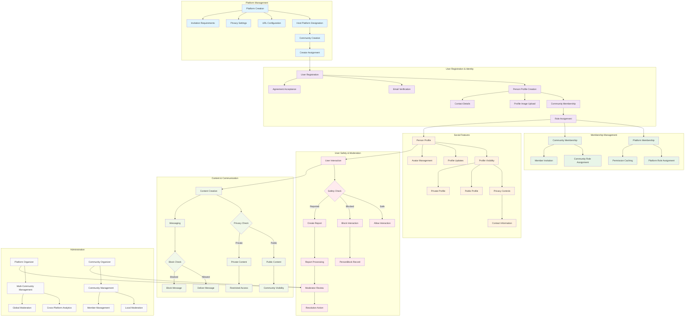

**Diagram Files:**
- 📊 [Mermaid Source](../../diagrams/source/community_social_system_flow.mmd) - Editable source
- 🖼️ [PNG Export](../../diagrams/exports/png/community_social_system_flow.png) - High-resolution image
- 🎯 [SVG Export](../../diagrams/exports/svg/community_social_system_flow.svg) - Vector graphics

## What's Implemented

### Core Social Infrastructure
- **Multi-tenant Platform Architecture**: Platform → Community → Person hierarchy with database tables
- **Person Profile System**: Basic person profiles with identifier, name, and privacy settings
- **Membership System**: Role-based community and platform memberships with database relationships
- **Basic Privacy Controls**: Public/private privacy enum implemented on models

### User Safety Features (Basic Implementation)
- **Person Blocking System**: Users can create blocks to prevent interactions (PersonBlock model)
- **Content Reporting System**: Basic reporting with reason field (Report model)  
- **Platform Manager Protection**: Cannot block users with platform management permissions
- **Policy-Based Authorization**: Pundit policies for blocking and reporting actions

### Authentication & Authorization  
- **Devise Integration**: User authentication with person profile linkage
- **Role-Based Access Control**: Permission system with cached role lookups
- **Policy Framework**: Pundit policies for authorization checks
- **Session Management**: Basic session security with CSRF protection

## What's Not Implemented Yet

### Essential Missing Features
- **Community Membership UI**: No interface for joining/leaving communities
- **Block Management Interface**: No UI for managing blocked users list
- **Report Review System**: No admin interface for reviewing reports
- **Moderation Tools**: No content removal or user suspension capabilities
- **Privacy Settings UI**: No interface for users to configure privacy settings

### Advanced Social Features (Not Started)
- **Friend/Follow System**: Social connections and relationship management
- **Activity Feeds**: User activity streams and social updates  
- **Social Media Integration**: External platform connections
- **Rich Notifications**: Comprehensive notification system with preferences
- **Social Groups**: Sub-communities and interest-based groups
- **Content Comments**: User commenting system on posts/pages
- **Profile Social Connections**: Detailed social relationship tracking

### Trust & Safety (Not Started)
- **Trust Score System**: Algorithmic user reputation tracking
- **Community Badges**: Achievement and recognition system
- **AI Content Moderation**: Automated inappropriate content detection
- **Appeals Process**: User appeals for moderation actions
- **Bulk Moderation**: Mass user and content management
- **Community Guidelines**: Platform-specific community rules

### Content & Communication (Limited)
- **Rich Content Creation**: Posts and pages exist but limited social features
- **Real-time Communication**: Conversations exist but basic implementation
- **Content Privacy**: Privacy controls exist but not fully integrated
- **Content Moderation**: No systematic content review process

## Core Models & Associations

### Platform Model
- **Purpose**: Multi-tenant platform hosting multiple communities
- **Location**: `app/models/better_together/platform.rb`
- **Key Features**:
  - Host platform designation with unique constraints
  - Invitation requirements and community privacy controls
  - Time zone and localization settings
  - URL-based routing and domain management
  - Custom CSS and branding configuration

```ruby
class Platform < ApplicationRecord
  include PlatformHost, Identifier, Joinable, Privacy
  
  has_community
  joinable joinable_type: 'platform', member_type: 'person'
  
  has_many :invitations, class_name: 'PlatformInvitation'
  store_attributes :settings do
    requires_invitation Boolean, default: false
  end
  
  validates :url, presence: true, uniqueness: true
  has_one_attached :profile_image, :cover_image
end
```

### Community Model
- **Purpose**: Individual communities within platforms
- **Location**: `app/models/better_together/community.rb`
- **Key Features**:
  - Creator ownership and community management
  - Host community designation for primary community
  - Event hosting with calendar integration
  - Rich media attachments (profile image, cover image, logo)
  - Multi-language content support with Action Text

```ruby
class Community < ApplicationRecord
  include Contactable, HostsEvents, Identifier, Joinable, Privacy
  
  belongs_to :creator, class_name: 'Person', optional: true
  has_many :calendars, dependent: :destroy
  joinable joinable_type: 'community', member_type: 'person'
  
  translates :name, type: :string
  translates :description, backend: :action_text
  has_one_attached :profile_image, :cover_image, :logo
  
  validates :name, presence: true
end
```

### Person Model
- **Purpose**: Individual user profiles and social identity
- **Location**: `app/models/better_together/person.rb`
- **Key Features**:
  - User account integration through identification system
  - Social connections (conversations, blocking, reporting)
  - Rich profile with contact details and preferences
  - Multi-community membership with role-based permissions
  - Notification preferences and privacy settings

```ruby
class Person < ApplicationRecord
  include Author, Contactable, FriendlySlug, Member, Privacy
  
  # Social connections
  has_many :conversation_participants, dependent: :destroy
  has_many :conversations, through: :conversation_participants
  
  # Safety mechanisms
  has_many :person_blocks, foreign_key: :blocker_id, dependent: :destroy
  has_many :blocked_people, through: :person_blocks, source: :blocked
  has_many :reports_made, foreign_key: :reporter_id, dependent: :destroy
  has_many :reports_received, as: :reportable, dependent: :destroy
  
  # Membership system
  member member_type: 'person', joinable_type: 'community'
  member member_type: 'person', joinable_type: 'platform'
  
  # User preferences
  store_attributes :preferences do
    locale String, default: I18n.default_locale.to_s
    time_zone String
  end
  
  store_attributes :notification_preferences do
    notify_by_email Boolean, default: true
    show_conversation_details Boolean, default: false
  end
end
```

### PersonBlock Model
- **Purpose**: User blocking system for preventing unwanted interactions
- **Location**: `app/models/better_together/person_block.rb`
- **Key Features**:
  - Bidirectional blocker/blocked relationship
  - Platform manager protection (cannot block platform managers)
  - Self-blocking prevention
  - Unique constraint to prevent duplicate blocks

```ruby
class PersonBlock < ApplicationRecord
  belongs_to :blocker, class_name: 'Person'
  belongs_to :blocked, class_name: 'Person'
  
  validates :blocked_id, uniqueness: { scope: :blocker_id }
  validate :not_self, :blocked_not_platform_manager
  
  private
  
  def blocked_not_platform_manager
    return unless blocked&.permitted_to?('manage_platform')
    errors.add(:blocked, I18n.t('errors.person_block.cannot_block_manager'))
  end
end
```

### Report Model  
- **Purpose**: Content and user reporting system for community safety
- **Location**: `app/models/better_together/report.rb`
- **Key Features**:
  - Polymorphic reportable association (any content type)
  - Reporter tracking and reason documentation
  - Integration with moderation workflows
  - Audit trail for safety investigations

```ruby
class Report < ApplicationRecord
  belongs_to :reporter, class_name: 'Person'
  belongs_to :reportable, polymorphic: true
  
  validates :reason, presence: true
end
```

### Membership Models
- **PersonCommunityMembership**: Joins people to communities with roles
- **PersonPlatformMembership**: Joins people to platforms with roles  
- **Key Features**:
  - Role-based permission assignment
  - Unique membership constraints
  - Membership lifecycle management
  - Platform and community scope isolation

## Controllers & Authorization

### Community Management
- **CommunitiesController**: Basic CRUD operations for community management
  - Community listing with privacy scope filtering
  - Creator-based ownership and editing permissions  
  - Basic form handling (no rich media upload interface yet)
  - Turbo Stream integration for form updates

### Person Blocking System  
- **PersonBlocksController**: Basic user blocking functionality
  - Block creation with Pundit policy authorization
  - Blocked user listing (index method)
  - Block removal (destroy method)
  - **Missing**: No UI implemented for block management

```ruby
class PersonBlocksController < ApplicationController
  def create
    @person_block = current_person.person_blocks.new(person_block_params)
    authorize @person_block
    
    if @person_block.save
      redirect_to blocks_path, notice: t('flash.person_block.blocked')
    else
      redirect_to blocks_path, alert: @person_block.errors.full_messages.to_sentence
    end
  end
end
```

### Content Reporting System
- **ReportsController**: Basic content and user reporting
  - Report creation with reason validation
  - Polymorphic reportable content support
  - Authorization preventing self-reporting
  - **Missing**: Admin review interface not implemented

### Membership Management
- **PersonCommunityMembershipsController**: Community membership CRUD
  - Basic membership creation and deletion
  - Turbo Stream integration for member list updates
  - **Missing**: Role assignment interface not implemented
  - **Missing**: Membership approval workflow not implemented

## Authorization & Privacy

### Policy Framework
All social interactions are governed by comprehensive Pundit policies:

**PersonBlockPolicy**: Controls user blocking permissions
- Only users can block other users (never themselves)
- Platform managers cannot be blocked
- Users can only manage their own blocks

**ReportPolicy**: Controls content reporting permissions  
- Authenticated users can report content/users
- Users cannot report themselves
- All reports require documented reasons

**CommunityPolicy**: Controls community access and management
- Public communities visible to all users
- Private communities require membership
- Creator permissions for community management

### Privacy Controls
The system implements granular privacy controls:

**Profile Privacy**: User-controlled visibility of personal information
**Content Privacy**: Public/private settings for all user-generated content
**Contact Privacy**: Granular controls for addresses, phone numbers, emails
**Platform Privacy**: Community-level visibility controls
**Activity Privacy**: User control over activity visibility and tracking

## User Interface Components

### Basic Community Features
- **Community Listing**: Basic community index page (implemented)
- **Community Profiles**: Basic community show pages (implemented)
- **Community Forms**: Create/edit community forms (implemented)

### Missing UI Components (Not Implemented)
- **Block Management Interface**: No UI for viewing/managing blocked users
- **Report Forms**: No contextual reporting forms for content and users  
- **Privacy Settings Dashboard**: No interface for privacy controls
- **Membership Management**: No UI for joining/leaving communities
- **Member Directories**: No community member listing interfaces
- **Profile Management**: Limited profile editing capabilities
- **Social Navigation**: No social relationship indicators or navigation

## Technical Implementation

### Database Schema
The community system uses a hierarchical multi-tenant architecture:

**Platform → Community → Person Structure**:
```sql
-- Core entities
better_together_platforms (host platform, settings, privacy)
better_together_communities (within platforms, creator-owned)  
better_together_people (cross-community profiles)

-- Safety mechanisms
better_together_person_blocks (blocker_id, blocked_id, timestamps)
better_together_reports (reporter_id, reportable polymorphic, reason)

-- Membership system  
better_together_person_community_memberships (member, joinable, role)
better_together_person_platform_memberships (member, joinable, role)
```

**Key Relationships**:
- Platforms can have multiple communities (1:many)
- People can be members of multiple communities and platforms (many:many through memberships)
- Blocking is bidirectional with unique constraints
- Reports are polymorphic, supporting any content type

### Privacy Implementation
Privacy controls are implemented through the `Privacy` concern:
- **Enum-based Privacy**: `public` and `private` privacy levels
- **Scoped Queries**: Privacy-filtered database queries
- **Policy Integration**: Privacy-aware authorization policies
- **UI Controls**: Form helpers for privacy selection

### Caching Strategy
The system implements comprehensive caching for performance:
- **Permission Caching**: 12-hour cache for role and permission checks
- **Member Associations**: Cached membership lookups and role associations
- **Privacy Scopes**: Cached privacy-filtered query results
- **Profile Information**: Cached profile data with cache invalidation

## Integration Points

### User Authentication
- **Devise Integration**: Full integration with Devise authentication system
- **Multi-factor Authentication**: Support for enhanced authentication methods
- **Session Management**: Secure session handling with CSRF protection
- **Account Recovery**: Secure password reset and account recovery workflows

### Notification System
- **Noticed Integration**: Rich notification system for social interactions
- **Email Notifications**: Configurable email notification preferences
- **Real-time Updates**: Action Cable integration for live updates
- **Notification Privacy**: User-controlled notification visibility

### Content Management
- **Rich Text Support**: Action Text integration for formatted content
- **File Attachments**: Active Storage integration for media uploads
- **Content Versioning**: Version tracking for content changes
- **Content Privacy**: Granular content visibility controls

### External Services
- **Email Delivery**: Action Mailer with SMTP/SendGrid integration
- **File Storage**: S3/MinIO integration for scalable file storage
- **Background Jobs**: Sidekiq integration for async processing
- **Analytics**: Optional analytics integration for community insights

## Anti-Spam & Content Moderation

### Basic Protection (Limited Implementation)
- **Rate Limiting**: Rack::Attack protection against abuse (basic configuration)
- **Input Validation**: Rails built-in input sanitization and validation
- **Policy Authorization**: Pundit-based authorization checks
- **Database Constraints**: Unique constraints preventing duplicate blocks/reports

### Missing Moderation Features (Not Implemented)
- **Spam Detection**: No Akismet or automated spam filtering
- **Content Review Tools**: No administrative interfaces for reviewing reports
- **User Suspension**: No tools for blocking or suspending user accounts
- **Content Removal**: No systematic content moderation or removal tools
- **Moderation Queue**: No workflow for processing reported content
- **Appeal Process**: No system for handling user appeals

### Basic Trust Controls
- **Role-Based Permissions**: Community-specific role and permission management (basic)
- **Platform Manager Protection**: Cannot block users with elevated permissions
- **Self-Action Prevention**: Cannot block yourself or report your own content

## Testing Strategy

### Model Testing
```ruby
RSpec.describe PersonBlock do
  it 'prevents self-blocking'
  it 'prevents blocking platform managers'
  it 'enforces unique blocker-blocked pairs'
  it 'allows valid blocking relationships'
end

RSpec.describe Community do
  it 'validates required attributes'
  it 'handles privacy settings correctly'
  it 'manages member relationships'
  it 'integrates with authorization policies'
end
```

### Controller Testing  
```ruby
RSpec.describe PersonBlocksController do
  context 'when creating blocks' do
    it 'authorizes block creation'
    it 'prevents unauthorized blocking'
    it 'handles blocking errors gracefully'
  end
end
```

### Integration Testing
```ruby
RSpec.describe 'Community Management' do
  it 'allows community creation'
  it 'enforces privacy controls'
  it 'manages memberships correctly'
  it 'integrates safety features'
end
```

### Policy Testing
```ruby
RSpec.describe PersonBlockPolicy do
  it 'allows users to block others'
  it 'prevents blocking platform managers'  
  it 'prevents self-blocking'
  it 'allows block removal by blocker'
end
```

## Configuration & Deployment

### Environment Variables
```bash
# Platform configuration
PLATFORM_PRIVACY=public
REQUIRES_INVITATION=false
PLATFORM_TIME_ZONE=UTC

# Safety configuration  
ENABLE_CONTENT_REPORTING=true
AUTO_BLOCK_THRESHOLD=10
SPAM_DETECTION=true

# Privacy defaults
DEFAULT_PROFILE_PRIVACY=private
DEFAULT_CONTENT_PRIVACY=private
```

### Database Configuration
```ruby
# Migration considerations
# - Ensure proper indexing for performance
# - Add constraints for data integrity
# - Consider partitioning for large datasets

class CreatePersonBlocks < ActiveRecord::Migration[7.1]
  def change
    create_table :better_together_person_blocks, id: :uuid do |t|
      t.references :blocker, null: false, type: :uuid
      t.references :blocked, null: false, type: :uuid
      t.timestamps
      
      t.index [:blocker_id, :blocked_id], unique: true, name: 'unique_person_blocks'
    end
  end
end
```

### Performance Considerations
- **Membership Caching**: Cache expensive membership queries
- **Privacy Filtering**: Optimize privacy-aware database queries
- **Bulk Operations**: Efficient bulk membership and permission operations
- **Search Indexing**: Elasticsearch integration for community and user search

## Development Guidelines

### Adding New Social Features
1. **Model Design**: Follow existing association patterns and privacy controls
2. **Authorization**: Implement comprehensive Pundit policies
3. **UI Integration**: Use existing UI patterns and Turbo Stream updates
4. **Testing**: Comprehensive test coverage for all social interactions
5. **Privacy**: Default-private approach with explicit public controls

### Extending Safety Features
1. **Report Types**: Add new reportable content types with polymorphic associations
2. **Moderation Tools**: Build on existing policy framework for new moderation features
3. **Privacy Controls**: Extend privacy concern for new privacy-sensitive features
4. **Notification Integration**: Use Noticed for safety-related notifications

### Performance Optimization
1. **Query Optimization**: Use includes and joins for association-heavy operations
2. **Caching Strategy**: Implement appropriate caching for expensive operations
3. **Background Processing**: Use Sidekiq for time-intensive safety operations
4. **Database Indexing**: Proper indexing for frequently queried associations

## Security Considerations

### Data Protection
- **Encryption at Rest**: Sensitive personal data encrypted using Active Record encryption
- **Secure Communications**: HTTPS enforcement for all platform communications
- **Session Security**: Secure session management with proper timeout controls
- **CSRF Protection**: Comprehensive CSRF token validation

### User Safety
- **Block Enforcement**: Blocked users cannot interact across the platform
- **Report Processing**: Secure handling of sensitive report information
- **Privacy Enforcement**: Strict enforcement of user privacy settings
- **Account Security**: Multi-factor authentication and secure password requirements

### Platform Security
- **Rate Limiting**: Protection against abuse and spam
- **Input Validation**: Comprehensive input sanitization and validation
- **SQL Injection Prevention**: Parameterized queries and safe query building
- **XSS Protection**: Output encoding and Content Security Policy enforcement

## Future Roadmap

### Short-term Enhancements
- **Enhanced Blocking**: Temporary blocks with automatic expiration
- **Advanced Reporting**: Category-based reporting with severity levels
- **Community Moderation**: Distributed moderation with community moderators
- **Privacy Dashboard**: Comprehensive privacy control interface

### Long-term Vision
- **AI Moderation**: Machine learning-powered content and behavior analysis
- **Reputation System**: Algorithmic trust scoring and reputation tracking
- **Federation Support**: ActivityPub integration for decentralized social networking
- **Advanced Analytics**: Community health metrics and engagement analytics

## Troubleshooting

### Common Issues
- **Block Not Working**: Check policy authorization and database constraints
- **Privacy Leaks**: Verify privacy scopes in controllers and views
- **Performance Issues**: Review N+1 queries and implement proper caching
- **Authorization Errors**: Check Pundit policies and user permissions

### Debugging Tools
- **Policy Testing**: Use Pundit test helpers for policy debugging
- **Query Analysis**: Rails query analysis tools for performance debugging
- **Log Analysis**: Structured logging for tracking user interactions
- **Error Monitoring**: Exception tracking for community safety issues

---

This community and social system provides a comprehensive foundation for safe, privacy-conscious social interactions within multi-tenant community platforms, with robust user safety mechanisms, content moderation tools, and granular privacy controls.


# Content Management System

This guide explains Pages, Content Blocks, visibility (privacy + published_at), and caching.

## Database Schema

The Content Management domain centers around Pages and a flexible block system. Tables use Better Together migration helpers and follow UUID primary keys with optimistic locking.

- better_together_pages
  - id (uuid), identifier, privacy, slug, published_at, layout, sidebar_nav_id
  - creator_id, community_id, protected, type (when extended)
  - Translated: title (string), content (ActionText)
  - Index highlights: `by_better_together_pages_privacy` (privacy), slug unique
- better_together_content_blocks
  - id (uuid), type (STI: Hero, RichText, Image, Html, Css, Template), identifier
  - creator_id, privacy, visible (bool)
  - JSONB settings: accessibility_attributes, content_settings, css_settings, data_attributes, html_attributes, layout_settings, media_settings, content_data, content_area_settings
- better_together_content_page_blocks
  - id (uuid), page_id, block_id, position (ordering)
- better_together_content_platform_blocks
  - id (uuid), platform_id, block_id (for global/host content)

### ER Diagram

```mermaid
erDiagram
  BETTER_TOGETHER_PAGES ||--o{ BETTER_TOGETHER_CONTENT_PAGE_BLOCKS : has
  BETTER_TOGETHER_CONTENT_BLOCKS ||--o{ BETTER_TOGE
  THER_CONTENT_PAGE_BLOCKS : appears_in
  BETTER_TOGETHER_PLATFORMS ||--o{ BETTER_TOGE
  THER_CONTENT_PLATFORM_BLOCKS : has

  BETTER_TOGETHER_PAGES {
    uuid id PK
    string identifier
    string privacy
    string slug
    datetime published_at
    string layout
    uuid sidebar_nav_id FK
    uuid creator_id FK
    uuid community_id FK
    boolean protected
    integer lock_version
    datetime created_at
    datetime updated_at
  }

  BETTER_TOGETHER_CONTENT_BLOCKS {
    uuid id PK
    string type
    string identifier
    uuid creator_id FK
    string privacy
    boolean visible
    jsonb content_data
    jsonb css_settings
    jsonb media_settings
    jsonb layout_settings
    jsonb accessibility_attributes
    jsonb data_attributes
    jsonb html_attributes
    jsonb content_settings
    jsonb content_area_settings
    integer lock_version
    datetime created_at
    datetime updated_at
  }

  BETTER_TOGETHER_CONTENT_PAGE_BLOCKS {
    uuid id PK
    uuid page_id FK
    uuid block_id FK
    integer position
    integer lock_version
    datetime created_at
    datetime updated_at
  }

  BETTER_TOGETHER_CONTENT_PLATFORM_BLOCKS {
    uuid id PK
    uuid platform_id FK
    uuid block_id FK
    integer lock_version
    datetime created_at
    datetime updated_at
  }
```

**Diagram Files:**
- 📊 [Mermaid Source](../../diagrams/source/content_schema_erd.mmd)
- 🖼️ [PNG Export](../../diagrams/exports/png/content_schema_erd.png)
- 🎯 [SVG Export](../../diagrams/exports/svg/content_schema_erd.svg)

## Process Flow Diagram

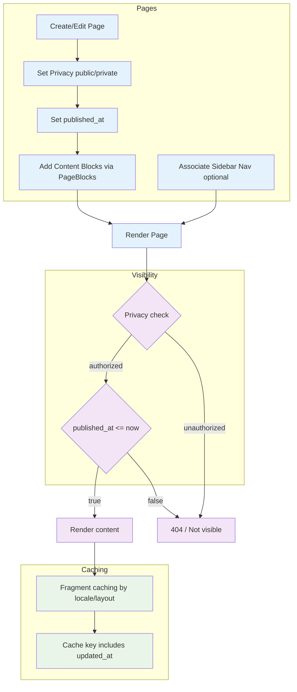

**Diagram Files:**
- 📊 [Mermaid Source](../../diagrams/source/content_flow.mmd) - Editable source
- 🖼️ [PNG Export](../../diagrams/exports/png/content_flow.png) - High-resolution image
- 🎯 [SVG Export](../../diagrams/exports/svg/content_flow.svg) - Vector graphics

## Publish Timeline

This timeline shows when publish-state transitions schedule render visibility.

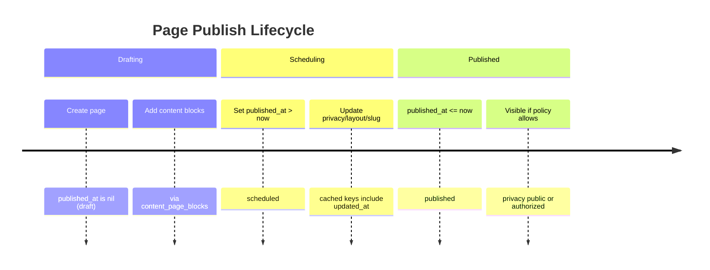

**Diagram Files:**
- 📊 [Mermaid Source](../../diagrams/source/content_publish_timeline.mmd)
- 🖼️ [PNG Export](../../diagrams/exports/png/content_publish_timeline.png)
- 🎯 [SVG Export](../../diagrams/exports/svg/content_publish_timeline.svg)

## Pages
- Purpose: authored content with rich text and media blocks.
- Key traits: Authorable, Categorizable, Identifier, Privacy, Publishable, Searchable, TrackedActivity, Metrics::Viewable.
- Translations: `title` (string) and `content` (ActionText).
- Layouts: `layouts/better_together/page`, `page_with_nav`, `full_width_page`.
- Blocks: has_many `page_blocks` (ordered join) → `blocks` of multiple types: Hero, RichText, Image, Html, Css, Template.
- Sidebar nav: `belongs_to :sidebar_nav, class_name: BetterTogether::NavigationArea, optional: true`.
- Slug: derived from title; slashes allowed (parameterize disabled).

## Visibility Criteria
- Privacy: `privacy` enum (public/private). Policy scopes enforce access (e.g., private requires permission/auth).
- Publishing:
  - `published_at` controls status via Publishable concern:
    - draft: published_at nil
    - scheduled: published_at > now
    - published: published_at <= now
  - `published?` returns true only when `published_at` present and in the past.
- Controller show flow: policy scopes resource; `render_not_found` for missing/unviewable; sets layout and loads blocks.

## Blocks
- Types under `BetterTogether::Content`:
  - Hero: optional page hero with background image.
  - RichText: ActionText content (localized) with `indexed_localized_content` for search.
  - Image / Html / Css / Template: ancillary content types for sections and decoration.
- Ordering: `page_blocks.positioned` controls rendering order.

## Caching
- Fragment caching around blocks in views: `cache block.cache_key_with_version` for Hero/RichText/Html/Image.
- Page content helper: `Rails.cache.fetch(['page_content', page.cache_key_with_version], expires_in: 1.minute) { ... }` for block rendering composition.
- CSS block cached with `host_platform.cache_key_with_version` in layouts.

## Search Indexing
- Pages index title/slug (localized) and rich text block contents via `as_indexed_json` (Elasticsearch).

## Presentation Helpers

### Privacy Display
The system provides standardized helpers for displaying privacy information consistently across all content types:

- **`privacy_display_value(entity)`**: Returns the translated privacy display value for any entity with a privacy attribute
  - Automatically looks up translations from `attributes.privacy_list.*` 
  - Falls back to humanized values if translation is missing
  - Supports all privacy levels: `public`, `private`, `community`, `unlisted`
  - Usage: `<%= privacy_display_value(@page) %>` instead of `@page.privacy.humanize`

- **`privacy_badge(entity)`**: Renders a Bootstrap badge with appropriate styling for privacy levels
  - Uses `privacy_display_value` internally for consistent text
  - Maps privacy levels to appropriate Bootstrap styles (success/secondary/info)
  - Usage: `<%= privacy_badge(@page) %>` in lists and detail views

### Translation Structure
Privacy translations are stored in `attributes.privacy_list.*` for all supported locales:
```yaml
# config/locales/en.yml
attributes:
  privacy_list:
    public: Public
    private: Private
    community: Community
    unlisted: Unlisted
```

## Block Types & Examples

### Hero
- Purpose: prominent header section with optional overlay and CTA.
- Translated: `heading`, `cta_text`, and `content` (ActionText).
- CTA: `content_data.cta_url` and `css_settings.cta_button_style` (Bootstrap style). Allowed styles include `btn-primary`, `btn-outline-primary`, `btn-secondary`, etc.
- Overlay: `css_settings.overlay_color` (e.g., `#000`), `css_settings.overlay_opacity` (0.0–1.0).
- Styling: `css_settings.css_classes`, `css_settings.container_class`, `css_settings.heading_color`, `css_settings.paragraph_color`.
- Example (attributes):
  - heading: "Welcome"
  - cta_text: "Get Started"
  - content: intro paragraph
  - content_data.cta_url: "/get-started"
  - css_settings.cta_button_style: "btn-primary"
  - css_settings.overlay_color: "#000", css_settings.overlay_opacity: 0.25

### RichText
- Purpose: WYSIWYG sections using ActionText.
- Translated: `content`.
- Styling: `css_settings.css_classes` (e.g., `my-5`).
- Indexed into search via `indexed_localized_content`.

### Image
- Purpose: single image with optional caption/alt/attribution.
- Attributes: `media` (ActiveStorage), translated `alt_text`, `caption`, `attribution`; `media_settings.attribution_url`.
- Validations: Content type (jpeg/png/gif/webp/svg) and size <100MB.

### Html
- Purpose: raw HTML string.
- Attributes: `content_data.html_content`.
- Use sparingly; prefer RichText for editor support.

### Css
- Purpose: inject CSS for specific sections.
- Attributes: translated `content` (string), `css_settings.general_styling_enabled`.
- Use for small, page‑scoped style overrides. Prefer platform CSS block for global theme.

### Template
- Purpose: render a prebuilt partial by path.
- Attributes: `content_data.template_path` from allowed list (e.g., `better_together/content/blocks/template/default`, `.../host_community_contact_details`).
- Use for reusable componentized content blocks.


# Conversations & Messaging System

This document explains the real-time messaging system, conversation management, notification delivery, and user interaction patterns within the Better Together Community Engine.

## Process Flow Diagram

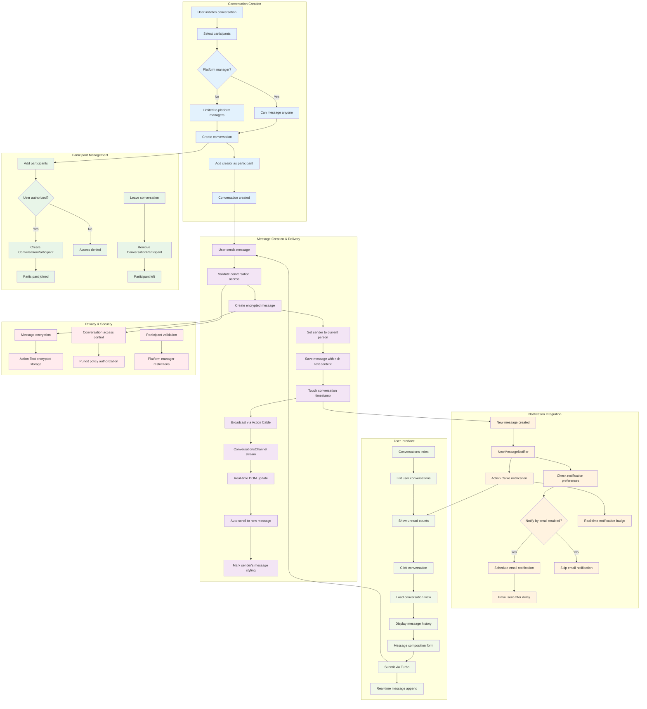

**Diagram Files:**
- 📊 [Mermaid Source](../../diagrams/source/conversations_messaging_flow.mmd) - Editable source
- 🖼️ [PNG Export](../../diagrams/exports/png/conversations_messaging_flow.png) - High-resolution image
- 🎯 [SVG Export](../../diagrams/exports/svg/conversations_messaging_flow.svg) - Vector graphics

## What's Implemented

- **Conversations**: Multi-participant encrypted conversation threads with titles and metadata
- **Messages**: Rich-text encrypted messages with Action Text support and real-time delivery
- **Participants**: Flexible participant management with join/leave capabilities  
- **Real-time Messaging**: WebSocket-based instant message delivery via Action Cable
- **Notification System**: Comprehensive in-app and email notifications with deduplication
- **Authorization**: Policy-based access control with platform manager restrictions
- **Read Status Tracking**: Automatic notification marking when viewing conversations
- **Email Integration**: Delayed email notifications with user preferences and anti-spam
- **Internationalization**: Full i18n support across all messaging components

## What's Not Implemented Yet

- **Message Reactions**: Emoji reactions and message status indicators
- **File Attachments**: Direct file sharing within conversations (uses Action Text attachments)
- **Message Search**: Full-text search across conversation history
- **Conversation Archiving**: Archive/restore functionality for conversations
- **Message Threading**: Reply-to-message threading within conversations
- **Typing Indicators**: Real-time typing status display
- **Message Editing**: Edit/delete message capabilities after sending
- **Push Notifications**: Mobile push notifications for offline users
- **Conversation Templates**: Pre-defined message templates or auto-replies
- **Advanced Moderation**: Message filtering, reporting, and moderation tools

## Core Models & Associations

### Conversation Model
- **Purpose**: Groups messages and manages participants for multi-person discussions
- **Location**: `app/models/better_together/conversation.rb`
- **Key Features**:
  - Encrypted title storage with deterministic encryption
  - Creator tracking (belongs to Person)
  - Participant validation (at least one participant required)
  - Touch associations for last activity tracking

```ruby
class Conversation < ApplicationRecord
  encrypts :title, deterministic: true
  belongs_to :creator, class_name: 'BetterTogether::Person'
  has_many :messages, dependent: :destroy
  has_many :conversation_participants, dependent: :destroy
  has_many :participants, through: :conversation_participants, source: :person
end
```

### ConversationParticipant Model  
- **Purpose**: Join model connecting people to conversations
- **Location**: `app/models/better_together/conversation_participant.rb`
- **Key Features**:
  - Simple join table between conversations and people
  - Enables flexible participant management
  - Supports leave/join functionality

```ruby
class ConversationParticipant < ApplicationRecord
  belongs_to :conversation
  belongs_to :person
end
```

### Message Model
- **Purpose**: Individual messages within conversations with rich text support
- **Location**: `app/models/better_together/message.rb`
- **Key Features**:
  - Encrypted rich text content via Action Text
  - Real-time broadcasting after creation
  - Touch parent conversation for activity updates
  - Sender association to Person model

```ruby
class Message < ApplicationRecord
  belongs_to :conversation, touch: true
  belongs_to :sender, class_name: 'BetterTogether::Person'
  has_rich_text :content, encrypted: true
  validates :content, presence: true
  after_create_commit -> { broadcast_append_later_to conversation, target: 'conversation_messages' }
end
```

## Controllers & Authorization

### ConversationsController
- **Location**: `app/controllers/better_together/conversations_controller.rb`
- **Key Features**:
  - Full CRUD operations with Turbo Stream support
  - Participant management and conversation updates
  - Authorization via Pundit policies
  - Notification read marking integration
  - Real-time updates via Turbo Streams

#### Key Actions:
- `index`: List user's conversations with participants and last messages
- `show`: Display conversation with all messages and mark notifications as read
- `create`: Create new conversation and add creator as participant
- `update`: Update conversation details and participant list
- `leave_conversation`: Remove current user from conversation participants

### MessagesController
- **Location**: `app/controllers/better_together/messages_controller.rb`
- **Key Features**:
  - Message creation with sender assignment
  - Participant notification triggering
  - Real-time broadcasting via Action Cable
  - Turbo Stream response support

#### Message Creation Flow:
1. Validate conversation access
2. Create message with current person as sender
3. Trigger notifications to all participants except sender
4. Broadcast to conversation channel
5. Return Turbo Stream response for real-time UI update

## Real-time Communication

### Action Cable Channels

#### ConversationsChannel
- **Location**: `app/channels/better_together/conversations_channel.rb`
- **Purpose**: Real-time message delivery within conversations
- **Features**:
  - Stream messages to conversation participants
  - Automatic subscription management
  - Message broadcasting integration

#### NotificationsChannel  
- **Location**: `app/channels/better_together/notifications_channel.rb`
- **Purpose**: Real-time notification delivery system-wide
- **Features**:
  - Stream to individual persons
  - Unread count updates
  - Cross-system notification delivery

### JavaScript Integration
- **Conversation Messages Controller**: `app/javascript/controllers/better_together/conversation_messages_controller.js`
  - Auto-scroll to newest messages
  - Mark sender's own messages with styling
  - DOM mutation observation for real-time updates

## Notification System

### NewMessageNotifier
- **Location**: `app/notifiers/better_together/new_message_notifier.rb`
- **Purpose**: Notify conversation participants about new messages
- **Delivery Channels**:
  - **Action Cable**: Immediate real-time notification
  - **Email**: Delayed 15 minutes with deduplication logic

#### Key Features:
- **Email Deduplication**: One email per unread conversation per recipient
- **User Preferences**: Respects `notify_by_email` settings
- **Localized Content**: Message titles and bodies in recipient's preferred language
- **Unread Counting**: Includes current unread notification count in real-time delivery

#### Notification Logic:
```ruby
def should_send_email?
  unread_notifications = recipient.notifications.where(
    event_id: BetterTogether::NewMessageNotifier.where(params: { conversation_id: conversation.id }).select(:id),
    read_at: nil
  ).order(created_at: :desc)
  
  unread_notifications.any? && message.id == unread_notifications.last.event.record_id
end
```

### Email Integration
- **ConversationMailer**: `app/mailers/better_together/conversation_mailer.rb`
- **Template**: `app/views/better_together/conversation_mailer/new_message_notification.html.erb`
- **Features**:
  - Respects user privacy preferences for sender details
  - Includes direct links to conversations with message anchors
  - Platform branding and localized signatures
  - Conditional sender information based on `show_conversation_details` preference

## Authorization & Privacy

### Access Control
- **Platform Managers**: Can message anyone
- **Regular Users**: Can only message platform managers (configurable restriction)
- **Privacy Levels**: Conversation visibility based on participant membership
- **Policy Integration**: Full Pundit policy enforcement across all actions

### ConversationPolicy
Key authorization checks:
- `show?`: Participant membership or platform manager role
- `update?`: Creator or authorized participant
- `leave_conversation?`: Current participant with multiple participants remaining
- `create?`: Based on platform permissions and participant availability

## User Interface Components

### Conversation Layout
- **Sidebar Navigation**: Active conversation list with participant previews
- **Main Content Area**: Message thread with rich text rendering
- **Message Composer**: Trix editor with real-time submission
- **Participant Management**: Add/remove participants interface
- **Conversation Options**: Edit title, leave conversation, settings

### Message Display
- **Message Bubbles**: Styled differently for sender vs. recipients
- **Timestamp Display**: Localized time formatting
- **Sender Attribution**: Name and avatar display
- **Rich Content**: Full Action Text rendering with attachments
- **Real-time Updates**: Smooth DOM insertion without page refresh

### Responsive Design
- **Mobile Optimized**: Touch-friendly interface elements
- **Bootstrap Integration**: Consistent styling with platform theme
- **Accessibility**: ARIA labels, keyboard navigation, screen reader support

## Technical Implementation

### Encryption & Security
- **Message Encryption**: All message content encrypted at rest via Action Text
- **Title Encryption**: Conversation titles use deterministic encryption for searchability
- **CSRF Protection**: Full Rails CSRF token validation
- **Input Sanitization**: HTML content filtering via Action Text allow-lists

### Performance Optimization
- **Eager Loading**: Conversation queries include participants and messages with proper includes
- **Touch Associations**: Automatic timestamp updates for conversation activity
- **Query Optimization**: Efficient participant filtering and message ordering
- **Real-time Efficiency**: Targeted DOM updates via Turbo Streams

### Internationalization
- **Full i18n Coverage**: All user-facing strings translated across English, Spanish, French
- **Email Localization**: Notification emails rendered in recipient's preferred language
- **Time Zone Support**: Message timestamps displayed in user's local timezone
- **Locale-specific Formatting**: Date/time formatting respects cultural preferences

## Integration Points

### Person Model Integration
```ruby
# Person associations for messaging
has_many :conversation_participants, dependent: :destroy
has_many :conversations, through: :conversation_participants  
has_many :created_conversations, as: :creator, class_name: 'BetterTogether::Conversation'
has_many :messages, foreign_key: :sender_id, class_name: 'BetterTogether::Message'
```

### Notification Integration
- **NotificationReadable Concern**: Automatic read marking when viewing conversations
- **Unread Count Updates**: Real-time badge updates via Action Cable
- **Cross-system Integration**: Notifications work across all platform features

### Action Cable Integration
- **Turbo Stream Broadcasting**: Seamless real-time message delivery
- **Connection Management**: Automatic subscription handling
- **Error Recovery**: Graceful degradation when WebSocket unavailable

## Anti-Spam & Moderation

### Email Deduplication
- **One Email Per Conversation**: Prevents email flooding from active conversations
- **15-minute Delay**: Batches rapid messages into single email notifications
- **User Preference Respect**: Honors individual email notification settings
- **Read Status Integration**: Stops emails when notifications marked as read

### Content Filtering
- **Action Text Integration**: HTML content automatically sanitized
- **XSS Prevention**: Full Rails auto-escaping throughout templates
- **Input Validation**: Server-side validation on all message content
- **Policy Enforcement**: Authorization checks prevent unauthorized access

## Testing Strategy

### Model Testing
- **Factory Integration**: Comprehensive FactoryBot factories for all models
- **Association Testing**: Validates all model relationships and dependencies
- **Validation Testing**: Covers all business rules and constraints
- **Encryption Testing**: Verifies proper encryption/decryption behavior

### Controller Testing  
- **Authorization Testing**: Pundit policy enforcement verification
- **Response Format Testing**: HTML and Turbo Stream response validation
- **Real-time Feature Testing**: Action Cable integration testing
- **Error Handling Testing**: Graceful failure mode validation

### Integration Testing
- **Feature Specs**: Full user workflow testing with Capybara
- **Real-time Testing**: JavaScript-enabled conversation flow testing
- **Notification Testing**: End-to-end notification delivery verification
- **Cross-browser Testing**: Compatibility across different browsers and devices

## Configuration & Deployment

### Environment Variables
- **Action Cable**: WebSocket server configuration
- **Email Settings**: SMTP configuration for notification delivery
- **Encryption Keys**: Rails master key for encrypted content
- **Platform Settings**: Default messaging permissions and restrictions

### Database Considerations
- **Encryption Performance**: Deterministic encryption enables efficient querying
- **Index Strategy**: Optimized indexes for conversation and message queries
- **Migration Strategy**: Handles encrypted field additions and modifications
- **Backup Considerations**: Encrypted data backup and restoration procedures

## Development Guidelines

### Adding New Message Features
1. **Model Changes**: Add fields to Message model with proper encryption
2. **Controller Updates**: Update permitted parameters and authorization
3. **View Updates**: Add UI elements with proper internationalization
4. **Real-time Support**: Ensure Turbo Stream compatibility
5. **Notification Integration**: Add notification triggers if needed
6. **Testing**: Comprehensive test coverage for new functionality

### Extending Conversation Features
1. **Policy Updates**: Add new authorization rules to ConversationPolicy
2. **Association Changes**: Update model associations as needed
3. **UI Integration**: Add new interface elements to conversation layout
4. **Notification Updates**: Extend notification system for new features
5. **Documentation**: Update this document with new functionality

### Performance Considerations
- **Message History**: Consider pagination for conversations with many messages
- **Participant Limits**: Monitor performance with large participant counts
- **Real-time Scaling**: Plan for increased Action Cable connection loads
- **Search Integration**: Future full-text search implementation strategy

## Future Roadmap

### Short-term Enhancements
- **Message Reactions**: Emoji reactions with real-time updates
- **Typing Indicators**: Show when participants are composing messages
- **Message Search**: Full-text search across conversation history
- **File Attachments**: Direct file sharing within conversations

### Long-term Vision
- **Advanced Moderation**: AI-powered content filtering and moderation tools
- **Video/Audio**: Integration with WebRTC for video calling capabilities
- **Integration APIs**: Webhooks and APIs for third-party integrations


# Conversations and Messaging System Documentation

This directory contains comprehensive documentation for the Better Together Community Engine's conversations and messaging system.

## Documentation Files

### 1. conversations_messaging_system.md
Comprehensive technical documentation covering:
- **System Overview**: Architecture and feature summary
- **Models**: Conversation, ConversationParticipant, Message, and associations
- **Controllers**: ConversationsController and MessagesController with full CRUD operations
- **Real-time Features**: Action Cable channels for live messaging and notifications
- **Notification System**: NewMessageNotifier with email deduplication logic
- **Email Integration**: ConversationMailer with localized templates
- **Authorization**: Pundit policies and platform manager restrictions
- **Views & JavaScript**: Turbo Stream integration and Stimulus controllers
- **Internationalization**: Complete i18n support across all user-facing text

### 2. conversations_messaging_flow.mmd / conversations_messaging_flow.png
Visual process flow diagram illustrating:
- **Conversation Creation**: User flow with platform restrictions
- **Message Delivery**: From creation to real-time broadcasting
- **Notification System**: Both in-app and email notifications with deduplication
- **Read Status Management**: How messages are marked as read
- **Participant Management**: Adding/removing conversation participants
- **Authorization Flow**: Pundit policy enforcement
- **UI Updates**: Real-time Turbo Stream updates

## Key System Features

### Real-time Messaging
- **Action Cable Integration**: ConversationsChannel streams messages in real-time
- **Live UI Updates**: Messages appear instantly without page refreshes
- **Auto-scrolling**: New messages automatically scroll into view
- **Sender Styling**: Visual distinction for user's own messages

### Intelligent Notifications
- **Deduplication Logic**: Only sends one email per conversation until read
- **15-minute Delay**: Prevents email spam for rapid message exchanges
- **Multi-channel Delivery**: Browser notifications + email + in-app badges
- **Read Status Tracking**: Marks notifications as read when conversation is viewed

### Privacy & Security
- **Encrypted Storage**: Message content encrypted at rest using Active Record Encryption
- **Platform Restrictions**: Non-managers can only message platform managers
- **Authorization Policies**: Comprehensive Pundit policy enforcement
- **Participant Validation**: Strict controls on who can join conversations

### User Experience
- **Rich Text Support**: Full Trix editor integration for message composition
- **Responsive Design**: Bootstrap-based mobile-friendly interface
- **Accessibility**: WCAG AA compliance with proper ARIA labels and keyboard navigation
- **Internationalization**: Full i18n support in English, French, and Spanish

## Implementation Notes

The messaging system is built with Rails 7+ best practices:
- **Hotwire Integration**: Turbo Streams for seamless real-time updates
- **Stimulus Controllers**: JavaScript interactivity without jQuery
- **Background Jobs**: Sidekiq for email delivery and cleanup tasks
- **Database Optimization**: Proper indexing and N+1 query prevention
- **Test Coverage**: Comprehensive RSpec test suite with FactoryBot

## Getting Started

To understand the system:
1. Read `conversations_messaging_system.md` for technical details
2. Review `conversations_messaging_flow.png` for visual workflow
3. Explore the actual code in `app/models/better_together/conversation.rb` and related files
4. Check the test suite in `spec/models/better_together/` for usage examples

## Contributing

When modifying the messaging system:
- Update both documentation files when adding features
- Regenerate the PNG diagram using `bin/render_diagrams` 
- Follow the patterns established in the existing codebase
- Add comprehensive test coverage for all changes
- Ensure proper i18n support for any new user-facing text


# Events & Calendars

This document explains the Event model, how events are created and displayed, how visibility works, how calendars fit in, the comprehensive notification system for event reminders and updates, and the event hosting system.

See also: [Event Invitations & Attendance](./event_invitations_and_attendance.md) for invitation tokens, delivery, and RSVP lifecycle details.

## Database Schema

The Events & Calendars domain consists of five primary tables plus standard shared tables (translations, ActionText, etc.). All Better Together tables are created via `create_bt_table`, which adds `id: :uuid`, `lock_version`, and `timestamps` automatically.

- better_together_events
  - id (uuid), type (STI default: `BetterTogether::Event`), creator_id, identifier, privacy
  - starts_at, ends_at, duration_minutes, registration_url
  - Indexes: `bt_events_by_starts_at`, `bt_events_by_ends_at`, `by_better_together_events_privacy`
- better_together_event_attendances
  - id (uuid), event_id, person_id, status (string enum: interested, going)
  - Unique index: `by_event_and_person` on [event_id, person_id]
- better_together_event_hosts
  - id (uuid), event_id, host_id, host_type (polymorphic to Person/Community/etc.)
- better_together_calendars
  - id (uuid), community_id, creator_id, identifier, locale, privacy, protected
  - Translated: name, description (ActionText)
- better_together_calendar_entries
  - id (uuid), calendar_id, event_id, starts_at, ends_at, duration_minutes
  - Indexes: `bt_calendar_events_by_starts_at`, `bt_calendar_events_by_ends_at`, `by_calendar_and_event` on [calendar_id, event_id]

### ER Diagram

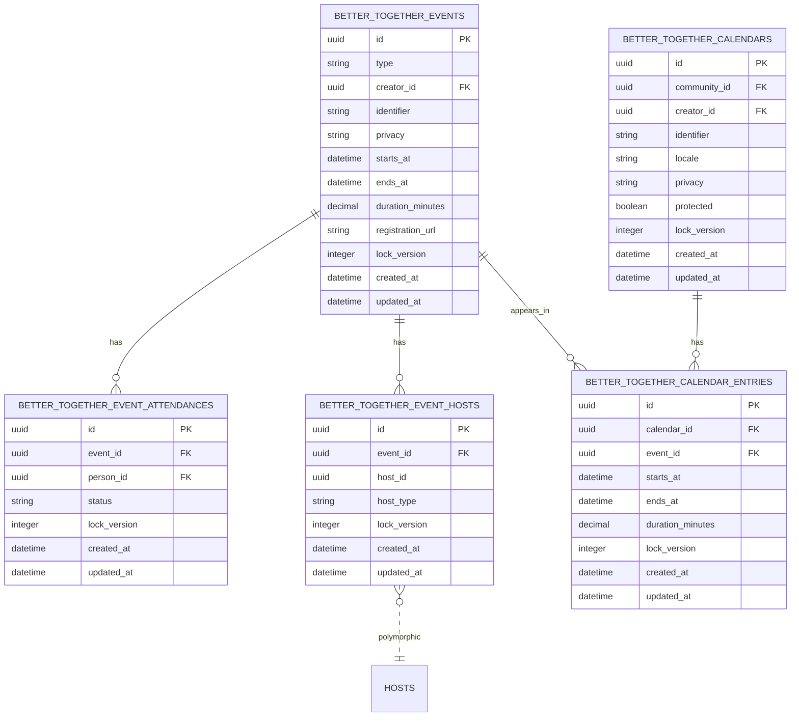

**Diagram Files:**
- 📊 [Mermaid Source](../../diagrams/source/events_schema_erd.mmd) - Editable source
- 🖼️ [PNG Export](../../diagrams/exports/png/events_schema_erd.png) - High-resolution image
- 🎯 [SVG Export](../../diagrams/exports/svg/events_schema_erd.svg) - Vector graphics

## Process Flow Diagram

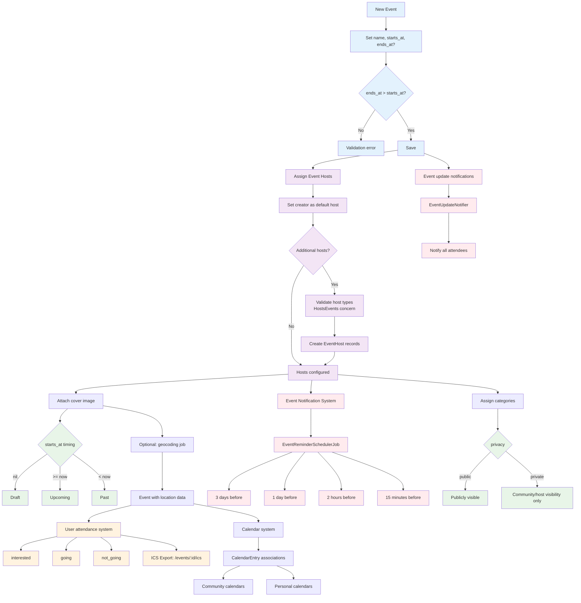

**Diagram Files:**
- 📊 [Mermaid Source](../../diagrams/source/events_flow.mmd) - Editable source
- 🖼️ [PNG Export](../../diagrams/exports/png/events_flow.png) - High-resolution image
- 🎯 [SVG Export](../../diagrams/exports/svg/events_flow.svg) - Vector graphics

## Technical Architecture Overview

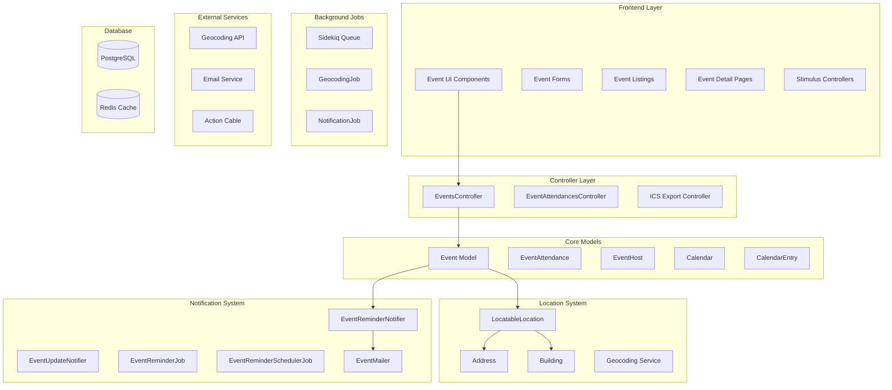

**Diagram Files:**
- 📊 [Technical Architecture](../../diagrams/source/events_technical_architecture.mmd) - Complete system architecture
- 🖼️ [PNG Export](../../diagrams/exports/png/events_technical_architecture.png) - High-resolution image
- 🎯 [SVG Export](../../diagrams/exports/svg/events_technical_architecture.svg) - Vector graphics

## Workflows

### RSVP Flow

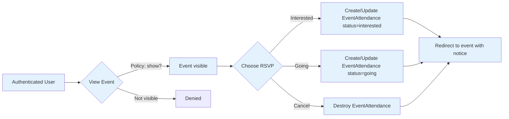

**Diagram Files:**
- 📊 [Mermaid Source](../../diagrams/source/events_rsvp_flow.mmd)
- 🖼️ [PNG Export](../../diagrams/exports/png/events_rsvp_flow.png)
- 🎯 [SVG Export](../../diagrams/exports/svg/events_rsvp_flow.svg)

### Reminder Scheduling Timeline

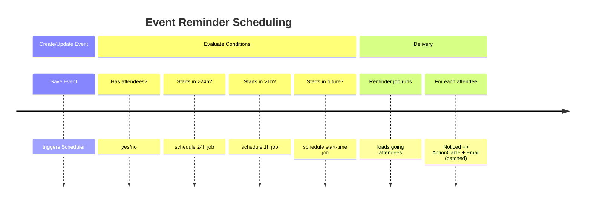

**Diagram Files:**
- 📊 [Mermaid Source](../../diagrams/source/events_reminders_timeline.mmd)
- 🖼️ [PNG Export](../../diagrams/exports/png/events_reminders_timeline.png)
- 🎯 [SVG Export](../../diagrams/exports/svg/events_reminders_timeline.svg)

## What's Implemented

### Core Event Management
- **Event Model**: Full lifecycle support with draft/scheduled/upcoming/past states
- **Multilingual Content**: Translatable name and rich text descriptions via Mobility + Action Text
- **Event Validation**: Time validation (ends_at > starts_at), URL format validation
- **Privacy Controls**: Public/private events with policy-based access control
- **Categorization**: Multiple categories per event via `Categorizable` concern
- **Cover Images**: Attachment support via `Attachments::Images` concern
- **Friendly URLs**: SEO-friendly slugs via `FriendlySlug` concern

### Location System (Advanced)
- **Polymorphic Location Support**: Three location types via `LocatableLocation`:
  - Simple location (text name only)
  - Full Address with geocoding
  - Building with associated Address
- **Dynamic Location Selector**: Stimulus-powered UI for switching location types
- **Inline Location Creation**: Create new addresses/buildings directly in event form
- **Location Validation**: Manual `location_attributes=` setter handles polymorphic nested creation
- **Geocoding Integration**: Background jobs for address geocoding

#### Location Selector Deep Dive

The location selector provides a sophisticated, user-friendly interface for managing event locations with three distinct types: Simple, Address, and Building. This system uses Stimulus controllers for dynamic UI management and custom backend processing for polymorphic location creation.

**Location Types Overview**

**Simple Location**
- Text-only location description (e.g., "Community Center", "Online via Zoom")
- Stored directly on the `LocatableLocation` model in the `name` field
- Best for virtual events, TBA locations, or simple venue references
- No geocoding or mapping features

**Address Location**  
- Full postal address with geocoding capabilities
- Uses existing `Address` records or creates new ones inline
- Includes geocoding for mapping and directions
- Fields: line1, line2, city, state, postal_code, country, physical/postal flags
- Supports primary address designation

**Building Location**
- Named venues/facilities with associated addresses  
- Uses existing `Building` records or creates new ones inline
- Buildings have their own address through association
- Perfect for institutions, community centers, schools
- Provides both building name and full address context

**Dynamic UI Implementation**

**Stimulus Controller (`location_selector_controller.js`)**
- **Targets**: `typeSelector`, `simpleLocation`, `addressLocation`, `buildingLocation`, `newAddress`, `newBuilding`
- **Actions**: `toggleLocationType`, `showNewAddress`, `showNewBuilding`, `updateVisibility`
- **State Management**: Shows/hides location sections based on user selection
- **Form Clearing**: Clears irrelevant fields when switching location types
- **Accessibility**: Focuses first field in new forms, maintains keyboard navigation

**Key Methods:**
- `connect()`: Initialize form state based on existing data
- `toggleLocationType(event)`: Show appropriate location section
- `hideAllLocationTypes()`: Reset all location sections
- `showNewAddress(event)` / `showNewBuilding(event)`: Toggle inline creation forms
- `clearSimpleLocationFields()` / `clearStructuredLocationFields()`: Field cleanup

**Backend Processing**

The system uses a custom `location_attributes=` setter on `LocatableLocation` instead of Rails' standard `accepts_nested_attributes_for` due to polymorphic association complexity.

**Polymorphic Location Creation Flow:**
1. Form submission includes `location_attributes` nested in event params
2. `location_attributes=` setter determines location type from submitted data
3. For Address: Creates `Address` record with geocoding job scheduling
4. For Building: Creates `Building` with nested `Address`, handles attribute normalization
5. `LocatableLocation` polymorphic association points to appropriate location record
6. Geocoding jobs run in background for address-based locations

**Form Integration & UI**

**Inline Creation Features:**
- "New" buttons reveal inline forms without page navigation
- Address and Building forms use consistent partial rendering
- Form validation shows errors inline without losing user input
- Progressive enhancement: works without JavaScript (graceful degradation)

**Validation & Error Handling:**
- Model validations for Event, Address, Building, and LocatableLocation
- Form error display within respective location sections
- JavaScript preserves form state during error correction
- Backend error handling with graceful rollback protection

**Integration Points:**
- Authorization via policies for Address/Building creation
- Geocoding integration with background job processing
- Performance optimizations with efficient queries and selective loading

**Diagram Files:**
- 📊 [Location Selector Flow](../../diagrams/source/events_location_selector_flow.mmd) - Detailed UI and backend flow
- 🖼️ [PNG Export](../../diagrams/exports/png/events_location_selector_flow.png) - High-resolution image
- 🎯 [SVG Export](../../diagrams/exports/svg/events_location_selector_flow.svg) - Vector graphics

## Event Hosts System

### Overview
Events can have multiple hosts through the polymorphic `EventHost` model. This allows different types of entities (People, Communities, Organizations) to co-host events and share hosting responsibilities.

### Components
- **EventHost Model**: `BetterTogether::EventHost`
  - Join model between Events and hosts
  - Polymorphic relationship: `belongs_to :host, polymorphic: true`
  - Associates: `belongs_to :event`
  - Permitted attributes: `host_id`, `host_type`, `event_id`

- **HostsEvents Concern**: `BetterTogether::HostsEvents`
  - Must be included in models to permit them as event hosts
  - Provides associations: `has_many :event_hosts, as: :host` and `has_many :hosted_events`
  - Class method `included_in_models` returns allow-list of valid host types
  - Automatically included in `Person`, `Community`, and other hostable models

### Event Hosting Workflow

#### Creating Events with Hosts
1. When creating an event, creator is automatically set as default host
2. Additional hosts can be added through `event_hosts_attributes` in the form
3. Host validation ensures only authorized entities can be assigned as hosts
4. Policy validation through `Pundit.policy_scope!` filters available host options

#### Host Authorization & Permissions
- **Event Host Member Check**: `event_host_member?` method in `EventPolicy`
  - Allows host representatives to manage events they're hosting
  - Checks if user can represent any of the event's hosts
  - Uses `agent.valid_event_host_ids` to determine user's hostable entities
- **CRUD Permissions**: Event hosts can create, read, update, and delete events they host
- **Visibility**: Event hosts are displayed on event pages via `visible_event_hosts` helper

#### Host Display & Interaction
- **Event Cards**: Show host information on event listings
- **Event Details**: Full "Hosted By" section with host cards
- **Authorization Filter**: `visible_event_hosts` helper filters hosts by user permissions
- **Multi-Host Support**: Events can display multiple hosts in responsive grid layout

### Technical Implementation

#### Models & Associations
- **Event Model**: `has_many :event_hosts` and `has_many :hosts, through: :event_hosts`
- **Host Models**: Include `HostsEvents` concern for `event_hosts` and `hosted_events` associations
- **EventHost Model**: Polymorphic join table with validation and permitted attributes

#### Controller Integration
- **EventsController**: 
  - `build_event_hosts` method for form processing
  - `event_host_class` validation with allow-list checking
  - Host assignment through permitted parameters
- **Authorization**: Policy-based access control throughout the hosting workflow

#### Views & Helpers
- **Event Forms**: Nested form fields for `event_hosts_attributes`
- **Event Display**: `_event_hosts.html.erb` partial for consistent host display
- **Helper Methods**: `visible_event_hosts` centralizes authorization logic
- **I18n Support**: "Hosted By" labels with full translation coverage

### Security & Validation
- **Host Type Allow-List**: Only models including `HostsEvents` can be event hosts
- **Policy Validation**: All host assignments validated through Pundit policies  
- **Authorization Checks**: Host visibility and management permissions enforced
- **Creator Fallback**: Event creator automatically becomes default host

## Event Attendance & RSVPs

- Model: `BetterTogether::EventAttendance` with string enum `status` values: `interested`, `going`.
- Uniqueness: one attendance per [event, person].
- Controller: `EventsController` actions `rsvp_interested`, `rsvp_going`, `rsvp_cancel` update the record.
- Policy: `EventAttendancePolicy` enforces who may RSVP; guests cannot RSVP.
- UX: Buttons on event show page; counts for going/interested shown.

## Event Reminder & Notification System

### Components Overview
The event notification system consists of several integrated components:

- **EventReminderNotifier**: Noticed event class for sending event reminder notifications
- **EventReminderJob**: Background job for processing reminder notifications for all attendees
- **EventReminderSchedulerJob**: Schedules future reminder notifications at appropriate intervals
- **EventMailer**: Handles email delivery for event reminders and updates
- **EventUpdateNotifier**: Sends notifications when event details change

### Event Reminder Workflow

#### Scheduling Reminders
1. When an event is created or updated, `EventReminderSchedulerJob` is triggered
2. The scheduler calculates appropriate reminder times based on event start time:
   - **24 hours before**: For events more than 24 hours away
   - **1 hour before**: For events more than 1 hour away
   - **At start time**: For immediate notifications
3. Background jobs are scheduled using `perform_at` for each reminder interval
4. Only "going" attendees receive reminder notifications

#### Notification Delivery
1. `EventReminderJob` processes each scheduled reminder:
   - Finds all attendees with "going" status
   - Creates `EventReminderNotifier` instances for each attendee
   - Respects user notification preferences
2. `EventReminderNotifier` handles multi-channel delivery:
   - **Action Cable**: Real-time in-app notifications via `NotificationsChannel`
   - **Email**: HTML emails with event details (15-minute delay to batch notifications)
3. Email delivery is conditional based on:
   - User has email address configured
   - User has `notify_by_email` preference enabled
   - User has `event_reminders` preference enabled
   - Anti-spam: Only one email per unread event notifications

#### Event Update Notifications
1. When event details change, `EventUpdateNotifier` is triggered
2. Sends notifications to all attendees about the changes
3. Includes information about what specific attributes changed
4. Uses the same delivery channels as reminder notifications

### Notification Preferences
Users can control event notifications through their preferences:
- `event_reminders`: Enable/disable event reminder notifications
- `notify_by_email`: Enable/disable email notifications globally
- `show_conversation_details`: Control visibility of conversation details in emails

### Anti-Spam & Batching
- **Email Batching**: 15-minute delay on email delivery to group related notifications
- **Duplicate Prevention**: Only one email per unread notification group per event
- **Preference Respect**: All notifications respect user preferences and can be disabled

### Technical Implementation Details

#### Classes & Responsibilities
- **`BetterTogether::EventReminderNotifier`**: Noticed event class extending `ApplicationNotifier`
  - Handles multi-channel delivery (Action Cable + Email)
  - Includes anti-spam logic and preference checking
  - Generates localized notification content
- **`BetterTogether::EventReminderJob`**: Background job extending `ApplicationJob`
  - Processes events and finds "going" attendees
  - Creates notifier instances for each attendee
  - Handles error cases gracefully (missing events, connection issues)
  - Queue: `:notifications` with retry configuration
- **`BetterTogether::EventReminderSchedulerJob`**: Scheduling job
  - Calculates appropriate reminder intervals based on event timing
  - Schedules future `EventReminderJob` instances
  - Prevents scheduling reminders for past events or drafts
- **`BetterTogether::EventMailer`**: Mailer class extending `ApplicationMailer`
  - Renders HTML emails with event details
  - Uses Rails 7+ parameter pattern (`params[:key]`)
  - Includes event location, timing, and registration information
- **`BetterTogether::EventUpdateNotifier`**: Handles event change notifications
  - Triggers when event attributes are modified
  - Notifies all attendees (not just "going" status)
  - Includes information about what changed

#### Notification Timing Strategy
- **24-hour reminders**: For events starting more than 24 hours in the future
- **1-hour reminders**: For events starting more than 1 hour in the future
- **Start-time notifications**: For events starting within the hour
- **Update notifications**: Immediate when event details change

#### Queue & Background Processing
- Uses `:notifications` queue for all event-related jobs
- Retry configuration: Up to 5 attempts with polynomial backoff
- Discard policy: `ActiveRecord::RecordNotFound` errors are discarded
- Error handling: Jobs complete gracefully for missing/invalid events

### Models & Data Flow
- **Event**: Has many `event_attendances` and `attendees` (people)
- **EventAttendance**: Links person to event with status (interested/going/not_going)
- **Noticed::Notification**: Stores notification records with read/unread status
- **Noticed::Event**: Base class for all notifier events

### Testing Coverage
The event reminder system has comprehensive test coverage:

#### EventReminderNotifier Specs
- Tests notification content generation (title, body, identifiers)
- Validates parameter handling and defaults
- Verifies unread count inclusion in messages
- Uses mock objects following established patterns

#### EventReminderJob Specs  
- Tests attendee filtering and notification delivery
- Validates error handling for missing/invalid events
- Confirms queue configuration and retry policies
- Verifies reminder type parameter handling

#### EventMailer Specs
- Tests email rendering with event details
- Validates headers, subject lines, and recipient handling
- Tests localization support
- Confirms delivery methods work correctly

#### Integration Testing
- Tests complete notification workflow from event creation to delivery
- Validates preference-based filtering
- Tests anti-spam and batching behavior
- Ensures proper authorization checks
- Model: `BetterTogether::EventAttendance`
- Associations: `belongs_to :event`, `belongs_to :person`
- Status enum: `interested`, `going`, `not_going`
- Policy: `EventAttendancePolicy` controls who can create/update attendance
- Controller actions: `rsvp_interested`, `rsvp_going`, `rsvp_cancel` on EventsController
- Workflow: Users can RSVP as interested/going, or cancel their RSVP (destroys attendance record)
- Authorization: Requires login; guests cannot RSVP

## ICS Calendar Export
- Route: `GET /events/:id/ics` with format defaulted to `:ics`
- Controller action: `ics` on EventsController
- MIME type: Registered as `text/calendar` for `.ics` extension
- Content: Generates valid iCalendar (RFC 5545) with VEVENT containing:
  - SUMMARY (event name)
  - DESCRIPTION (sanitized ActionText description + view details URL)
  - DTSTART/DTEND (UTC timestamps)
  - UID (unique identifier: `event-{id}@better-together`)
  - URL (link back to event page)
- Authorization: Uses same policy as `show?` (public events or creator/manager access)

## Event Model
- Class: `BetterTogether::Event`
- Purpose: Represent a schedulable event with optional media and location.
- Traits: `Attachments::Images`, `Categorizable`, `Creatable`, `FriendlySlug`, `Geography::Geospatial::One`, `Geography::Locatable::One`, `Identifier`, `Privacy`, `TrackedActivity`, `Viewable`.
- Associations: `has_many :event_attendances`, `has_many :attendees` (through event_attendances -> person)
- Translated fields: `name` (string), `description` (ActionText).
- Images: `attachable_cover_image` (cover image support).
- Categories: `categorizable(class_name: 'BetterTogether::EventCategory')`.
- Scheduling fields: `starts_at` (required), `ends_at` (optional), `registration_url` (optional, validated URL).
- Validation: `ends_at` must be after `starts_at`.
- Scopes: `draft` (no starts_at), `upcoming` (starts_at >= now), `past` (starts_at < now).
- Privacy: Uses `Privacy` concern (public/private); policies enforce who may view/manage.
- Geocoding (optional): Includes geospatial/locatable concerns and has a `schedule_address_geocoding` path for when address/location is available (address association currently commented out).
- ICS Export: `to_ics` method generates iCalendar format for calendar applications.

## Controller & Views
- Controller: `BetterTogether::EventsController` (index groups into draft/upcoming/past)
- RSVP actions: `rsvp_interested`, `rsvp_going`, `rsvp_cancel` (require authentication)
- ICS export: `ics` action renders calendar file with proper MIME type

## User Experience & Journey Maps

### Event Organizer Journey
The complete event organizer experience from planning to follow-up:

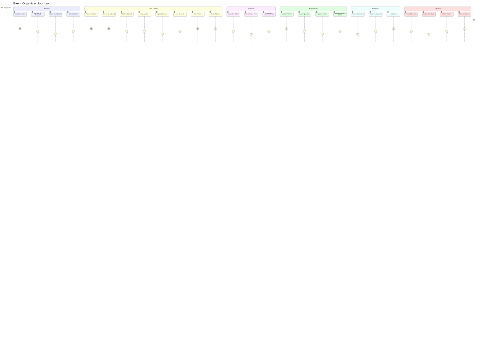

**Diagram Files:**
- 📊 [Organizer Journey](../../diagrams/source/events_organizer_journey.mmd) - Complete organizer experience
- 🖼️ [PNG Export](../../diagrams/exports/png/events_organizer_journey.png) - High-resolution image
- 🎯 [SVG Export](../../diagrams/exports/svg/events_organizer_journey.svg) - Vector graphics

### Event Attendee Journey
The complete attendee experience from discovery to community building:

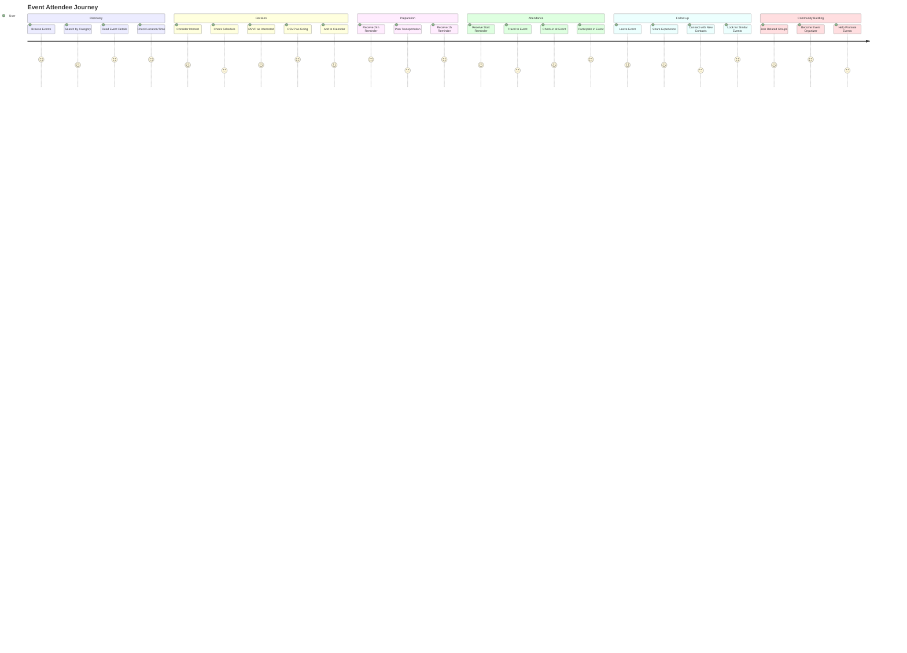

**Diagram Files:**
- 📊 [Attendee Journey](../../diagrams/source/events_attendee_journey.mmd) - Complete attendee experience  
- 🖼️ [PNG Export](../../diagrams/exports/png/events_attendee_journey.png) - High-resolution image
- 🎯 [SVG Export](../../diagrams/exports/svg/events_attendee_journey.svg) - Vector graphics

## Additional Resources

### User Documentation
- 📖 [Event User Guide](../../users/events_user_guide.md) - Comprehensive guide for organizers and attendees
- 🎯 [Best Practices](../../users/events_user_guide.md#best-practices) - Tips for successful event management
- 🔧 [Troubleshooting](../../users/events_user_guide.md#troubleshooting-common-issues) - Common issues and solutions

### All Event System Diagrams
- 📊 [Events Schema ERD](../../diagrams/source/events_schema_erd.mmd) - Database relationships
- 📊 [Events Flow](../../diagrams/source/events_flow.mmd) - Complete system workflow  
- 📊 [Location Selector Flow](../../diagrams/source/events_location_selector_flow.mmd) - Location selection UI/UX
- 📊 [RSVP Flow](../../diagrams/source/events_rsvp_flow.mmd) - Attendance workflow
- 📊 [Reminder Timeline](../../diagrams/source/events_reminders_timeline.mmd) - Notification scheduling
- 📊 [Technical Architecture](../../diagrams/source/events_technical_architecture.mmd) - System architecture
- 📊 [Organizer Journey](../../diagrams/source/events_organizer_journey.mmd) - Organizer user experience
- 📊 [Attendee Journey](../../diagrams/source/events_attendee_journey.mmd) - Attendee user experience


# Event Invitations & Attendance

This document provides an end-to-end, in-depth reference for event invitations and attendance (RSVP) in the Better Together Community Engine. It covers data models, controller flows, access control, invitation token handling, email and in-app notifications, RSVP life cycle, and how these pieces interact with platform privacy.

## Overview

- Event invitations allow organizers and hosts to invite existing members or external emails to a specific event.
- Invitations support secure token links for review, acceptance, or decline — including first-time registration flows.
- Acceptance automatically ensures community membership and sets RSVP to “going”, creating a calendar entry.
- Attendance (RSVP) supports two statuses: “interested” and “going”, with cancellation removing the attendance record and calendar entry.
- Invitation tokens permit access to otherwise private content for the specific invited event while preserving platform privacy.

## Core Models

- `BetterTogether::Invitation`: Polymorphic base model with `invitable`, `inviter`, optional `invitee`, `role`, `status` (string enum: pending, accepted, declined), `token` (secure), validity window, and timestamps.
- `BetterTogether::EventInvitation < Invitation`: Invitation specialization for events.
  - Status values: `pending`, `accepted`, `declined` (string enum).
  - Validates presence/inclusion of `locale` and requires one of `invitee` or `invitee_email`.
  - Prevents duplicate invitations for a given event for either the same `invitee` or the same `invitee_email` while status is in `pending` or `accepted`.
  - Methods:
    - `event`: alias to `invitable`.
    - `url_for_review`: event URL with `invitation_token` param to support review page and access.
    - `for_existing_user?` / `for_email?`: invitation mode helpers.
    - `accept!(invitee_person:)`: sets status, ensures community membership, creates/updates `EventAttendance` to `going`.
    - `decline!`: sets status to `declined`.
- `BetterTogether::EventAttendance`: RSVP record for a `person` and `event` with string enum statuses: `interested`, `going`.
  - Constraints:
    - Unique per person/event.
    - Event must be scheduled (no RSVP on drafts).
  - Side effects:
    - On `going`, creates a `CalendarEntry` in the person’s primary calendar.
    - On status change away from `going` or destroy, removes the calendar entry.

## Data Model Diagram (Invitations + Attendance)

```mermaid
%% See separate Mermaid source file for editing: docs/diagrams/source/events_invitations_schema_erd.mmd
```

**Diagram Files:**
- 📊 Mermaid Source: ../diagrams/source/events_invitations_schema_erd.mmd
- 🖼️ PNG Export: ../diagrams/exports/png/events_invitations_schema_erd.png
- 🎯 SVG Export: ../diagrams/exports/svg/events_invitations_schema_erd.svg

## Invitation Creation & Delivery

Event organizers and host representatives create invitations from the event page (Invitations panel). Two modes are supported:

- Invite existing member:
  - Provide `invitee_id` (a `BetterTogether::Person`), which auto-fills `invitee_email` and `locale` from the person record.
  - Delivery: Noticed notification to the user (`EventInvitationNotifier`) and optional email via `EventInvitationsMailer`.
- Invite by email:
  - Provide `invitee_email` and target `locale`.
  - Delivery: Email sent to the external address via `EventInvitationsMailer`.

Simple throttling prevents resending an invitation more than once within 15 minutes (`last_sent` timestamp check). Resend is supported for pending invitations.

### Controller Endpoints (Organizer/Host)

- `POST /events/:event_id/invitations` (create):
  - Authorization: `EventInvitationPolicy#create?` (organizer/host scope).
  - Parameters: `invitee_id` or `invitee_email`, optional `valid_from`, `valid_until`, `locale`, `role_id`.
  - Behavior: builds `EventInvitation`, sets `status: 'pending'`, `inviter`, and default `valid_from`.
  - Delivery: Noticed/email depending on invitation type; updates `last_sent`.

- `PUT /events/:event_id/invitations/:id/resend` (resend):
  - Authorization: same as create; respects resend throttling.

- `DELETE /events/:event_id/invitations/:id` (destroy):
  - Authorization: allowed for organizers/hosts.

- `GET /events/:event_id/invitations/available_people` (AJAX):
  - Returns up to 20 non-invited people with an email address; supports search term.
  - Uses policy scope over `Person` and joins on user/contact email.

## Public Invitation Review & Response

Public review and response routes are token-based:

- `GET /invitations/:token` → `InvitationsController#show`
- `POST /invitations/:token/accept` → `#accept`
- `POST /invitations/:token/decline` → `#decline`

Behavior:
- Finds `Invitation.pending.not_expired` by token; returns 404 if missing.
- For `accept`:
  - Requires authentication; if not signed in, stores token in session and redirects to sign-in/registration based on `invitee_email` lookup.
  - If `invitee` is bound, enforces that the logged-in person matches; otherwise, binds the invitation to the current person.
  - Calls `accept!` if available (for `EventInvitation`) or sets status to `accepted`.
  - Redirects to the invitable (event) after acceptance.
- For `decline`:
  - Calls `decline!` (or sets status) and redirects to event if available, else home.

## Access Control & Privacy with Invitation Tokens

Invitation tokens grant limited access only to the specific event to which they belong. The platform may still require login for other content.

Key elements:

- `EventsController#check_platform_privacy` augmentation:
  - For private platforms and unauthenticated users, extracts an `invitation_token` from params/session.
  - Validates token for an `EventInvitation` that matches the requested event.
  - On valid, stores token and locale in session and allows access to the event page.
  - On invalid/expired, redirects to sign-in.

- `EventPolicy#show?`:
  - Permits if event is public and scheduled, or if creator/manager/host member, or if the current person holds an invitation, or if there is a valid invitation token.

- `ApplicationPolicy::Scope` for events:
  - Includes events visible through valid `invitation_token` in the scope.

### Token Access Flow Diagram

```mermaid
%% See separate Mermaid source file for editing: docs/diagrams/source/events_access_via_invitation_token.mmd
```

**Diagram Files:**
- 📊 Mermaid Source: ../diagrams/source/events_access_via_invitation_token.mmd
- 🖼️ PNG Export: ../diagrams/exports/png/events_access_via_invitation_token.png
- 🎯 SVG Export: ../diagrams/exports/svg/events_access_via_invitation_token.svg

## Notifications

- `BetterTogether::EventInvitationNotifier` (Noticed):
  - Channels: ActionCable (in-app) and Email (`EventInvitationsMailer`).
  - Email uses parameterized mailer with `invitation` and `invitable` context.
  - Message includes localized title/body and the invitation review URL.

- `BetterTogether::EventInvitationsMailer`:
  - Sends to `invitee_email` using the invitation’s `locale`.
  - Subject includes event name with localized fallback.

## RSVP (Attendance)

The RSVP system is centered on `EventAttendance` and is managed through member routes on the `Event` resource:

- `POST /events/:id/rsvp_interested`
- `POST /events/:id/rsvp_going`
- `DELETE /events/:id/rsvp_cancel`

Constraints and behavior:
- Only available when the event is scheduled (has `starts_at`).
- Requires authentication for all RSVP actions.
- Authorization uses `EventPolicy#show?` followed by `EventAttendancePolicy` for create/update.
- On `going`, a calendar entry is created; on cancel or switching away from `going`, the entry is removed.

Existing diagrams cover the RSVP journey and reminder scheduling:
- RSVP Flow: ../diagrams/source/events_rsvp_flow.mmd
- Reminder Timeline: ../diagrams/source/events_reminders_timeline.mmd

## Organizer UI

- Invitations Panel on Event Show:
  - Tabs include Attendees and Invitations.
  - Invite by Member (`invitee_id`) or by Email (`invitee_email`).
  - View invitations table with type (member/email), status, resend/delete actions.
  - Search available people endpoint to prevent re-inviting and to filter by email presence.

## Security & Validation

- String enums: all statuses are strings for human-readable DB contents.
- Duplicate protection: event invitation uniqueness enforced for both `invitee` and `invitee_email` while status is pending/accepted.
- Privacy: invitation tokens scoped to a single event; do not grant broad platform access.
- Session token storage: invitation token and locale persisted for acceptance and consistent access; tokens expire per validity window.
- Safe dynamic resolution: no unsafe constantization of user input; controllers use allow-lists for host assignment and standard strong parameters.
- Authorization: `Pundit` policies on events, attendances, and invitations.

## Performance Considerations

- Organizer views preload invitations, invitees, and inviters to minimize N+1 queries.
- Event show preloads hosts, categories, attendances, translations, and cover image attachment.
- RSVP and invitation actions redirect back to the event to keep interaction snappy.
- Noticed notifications and email delivery run asynchronously.

## Troubleshooting

- Invitation token shows 404 on private platform:
  - Ensure the token matches the requested event and is still pending/not expired.
  - Verify session is storing `event_invitation_token` and that controller privacy check is triggered.

- Invitee required error:
  - Provide either `invitee_id` (member) or `invitee_email` (external) — one must be present.

- Duplicate invitation error:
  - An outstanding pending/accepted invitation already exists for that person or email.

- RSVP not available:
  - Event must be scheduled (`starts_at` present). Draft events do not accept RSVPs.

- Calendar entry not created:
  - Calendar entries are only created for `going` status; ensure the person has a primary calendar.

## Related Files (Code Pointers)

- Models:
  - `app/models/better_together/invitation.rb`
  - `app/models/better_together/event_invitation.rb`
  - `app/models/better_together/event_attendance.rb`

- Controllers:
  - `app/controllers/better_together/events/invitations_controller.rb`
  - `app/controllers/better_together/invitations_controller.rb`
  - `app/controllers/better_together/events_controller.rb`

- Policies:
  - `app/policies/better_together/event_policy.rb`
  - `app/policies/better_together/event_invitation_policy.rb`
  - `app/policies/better_together/event_attendance_policy.rb`

- Notifications & Mailers:
  - `app/notifiers/better_together/event_invitation_notifier.rb`
  - `app/mailers/better_together/event_invitations_mailer.rb`

## Process Flow: Event Invitations

```mermaid
%% See separate Mermaid source file for editing: docs/diagrams/source/events_invitations_flow.mmd
```

**Diagram Files:**
- 📊 Mermaid Source: ../diagrams/source/events_invitations_flow.mmd
- 🖼️ PNG Export: ../diagrams/exports/png/events_invitations_flow.png
- 🎯 SVG Export: ../diagrams/exports/svg/events_invitations_flow.svg


# Geography System Documentation

## Overview

The Better Together Geography System is a comprehensive location management and mapping architecture that provides hierarchical geographical organization, geocoding capabilities, and spatial data management using PostGIS. The system supports multi-level geographical entities from continents down to addresses, with integrated mapping and location services.

## System Architecture

### Core Components

#### 1. Geographical Hierarchy Models
- **Continent**: Top-level geographical divisions
- **Country**: National-level entities with ISO code support
- **State**: Provincial/state-level divisions with ISO codes
- **Region**: Custom regional divisions within countries/states
- **Settlement**: Cities, towns, and settlement areas

#### 2. Spatial Management
- **Space**: Core coordinate storage with latitude, longitude, elevation
- **GeospatialSpace**: Join table linking entities to spatial coordinates
- **Address**: Structured address information with geocoding
- **LocatableLocation**: Polymorphic location handling for any entity

#### 3. Mapping & Visualization
- **Map**: Interactive map representations with center, zoom, viewport
- **CommunityMap**: Maps associated with communities
- **CommunityCollectionMap**: Maps for community collections

#### 4. Location Services
- **GeocodingJob**: Background geocoding service
- **LocationSelectorController**: Frontend location selection interface

## Key Features

### 1. Hierarchical Organization
```
Continent
├── Country (ISO 3166-1 codes)
│   ├── State (ISO 3166-2 codes)
│   │   ├── Region (custom divisions)
│   │   │   └── Settlement (cities/towns)
│   │   └── Settlement
│   └── Settlement
└── Settlement
```

### 2. Spatial Data Management
- **PostGIS Integration**: Native PostgreSQL spatial extension support
- **Coordinate Storage**: Latitude, longitude, elevation with validation
- **Spatial Indexing**: Optimized geographical queries and proximity searches
- **Geographic Projections**: WGS 84 (SRID 4326) standard coordinate system

### 3. Flexible Location Handling
- **Polymorphic Locations**: Any model can be geo-located
- **Simple Locations**: String-based location names
- **Structured Locations**: Full address or building references
- **Hybrid Approach**: Support for both simple names and detailed addresses

### 4. Geocoding Integration
- **Background Processing**: Asynchronous geocoding via Sidekiq jobs
- **Cache Support**: Geocoding results cached via Rails.cache
- **Error Handling**: Retry logic with exponential backoff
- **Provider Agnostic**: Configurable geocoding services

## Technical Implementation

### Database Schema

#### Geography Tables

**better_together_geography_spaces**
```sql
- id: UUID primary key
- creator_id: UUID reference to creator
- identifier: Unique string identifier
- elevation: Float precision coordinate
- latitude: Float precision coordinate (-90 to 90)
- longitude: Float precision coordinate (-180 to 180)
- properties: JSONB metadata storage
- metadata: JSONB additional data storage
```

**better_together_geography_geospatial_spaces**
```sql
- id: UUID primary key
- geospatial_type: Polymorphic type reference
- geospatial_id: UUID polymorphic reference
- space_id: UUID reference to geography_spaces
- position: Integer ordering
- primary_flag: Boolean for primary location
```

**better_together_geography_maps**
```sql
- id: UUID primary key
- creator_id: UUID reference to creator
- mappable_type: Polymorphic type for mapped entity
- mappable_id: UUID polymorphic reference
- center: PostGIS ST_POINT geographic coordinates
- zoom: Integer zoom level (default 13)
- viewport: PostGIS ST_POLYGON geographic boundary
- metadata: JSONB map configuration data
- type: STI type for map subclasses
```

**better_together_geography_locatable_locations**
```sql
- id: UUID primary key
- creator_id: UUID reference to creator
- locatable_type: Polymorphic type for located entity
- locatable_id: UUID polymorphic reference
- location_type: Polymorphic type for location (Address/Building)
- location_id: UUID polymorphic location reference
- name: String fallback location name
```

#### Hierarchical Geography Tables

**better_together_geography_continents**
```sql
- id: UUID primary key
- identifier: String unique identifier
- community_id: UUID reference to community
- protected: Boolean system protection flag
```

**better_together_geography_countries**
```sql
- id: UUID primary key
- identifier: String unique identifier
- iso_code: String ISO 3166-1 alpha-2 code
- community_id: UUID reference to community
- protected: Boolean system protection flag
```

**better_together_geography_states**
```sql
- id: UUID primary key
- identifier: String unique identifier
- iso_code: String ISO 3166-2 subdivision code
- country_id: UUID reference to country
- community_id: UUID reference to community
- protected: Boolean system protection flag
```

**better_together_addresses**
```sql
- id: UUID primary key
- contact_detail_id: Optional contact reference
- physical: Boolean physical address flag
- postal: Boolean postal address flag
- line1: String primary address line
- line2: String secondary address line
- city_name: String city/locality
- state_province_name: String state/province
- postal_code: String postal/ZIP code
- country_name: String country name
- latitude: Float geocoded latitude
- longitude: Float geocoded longitude
- privacy: Enum privacy level
- primary_flag: Boolean primary address indicator
- label: String address type label
```

### Model Relationships

#### Core Concerns

**Geography::Geospatial::One**
```ruby
# Provides single location capability to any model
included do
  has_one :geospatial_space, as: :geospatial
  has_one :space, through: :geospatial_space
  delegate :latitude, :longitude, :elevation, to: :space
end

def to_leaflet_point
  {
    lat: latitude,
    lng: longitude,
    elevation: elevation,
    label: to_s
  }
end
```

**Geography::Locatable**
```ruby
# Polymorphic location management
has_many :locatable_locations, as: :locatable
accepts_nested_attributes_for :locatable_locations
```

#### Address Model

**Geocoding Integration**
```ruby
class Address < ApplicationRecord
  include Geography::Geospatial::One
  
  geocoded_by :geocoding_string
  
  after_create :schedule_geocoding
  after_update :schedule_geocoding
  
  def geocoding_string
    to_formatted_s(excluded: %i[display_label line2])
  end
  
  def schedule_geocoding
    return unless should_geocode?
    BetterTogether::Geography::GeocodingJob.perform_later(self)
  end
  
  def should_geocode?
    return false if geocoding_string.blank?
    (changed? or !geocoded?)
  end
end
```

#### Map Model

**PostGIS Integration**
```ruby
class Map < ApplicationRecord
  belongs_to :mappable, polymorphic: true, optional: true
  
  validates :center, presence: true
  validates :zoom, numericality: { only_integer: true, greater_than: 0 }
  
  def default_center
    lon = ENV.fetch('DEFAULT_MAP_CENTER_LNG', '-57.9474').to_f
    lat = ENV.fetch('DEFAULT_MAP_CENTER_LAT', '48.9517').to_f
    factory = RGeo::Geographic.spherical_factory(srid: 4326)
    factory.point(lon, lat)
  end
  
  def center_for_leaflet
    "#{center.latitude},#{center.longitude}"
  end
end
```

### Geocoding Configuration

**Geocoder Setup**
```ruby
# config/initializers/geocoder.rb
Geocoder.configure(
  always_raise: :all,
  timeout: 5,
  units: :km,
  cache: Geocoder::CacheStore::Generic.new(Rails.cache, {})
)
```

**Background Job Processing**
```ruby
class GeocodingJob < ApplicationJob
  queue_as :geocoding
  retry_on StandardError, wait: :polynomially_longer, attempts: 5
  
  def perform(geocodable)
    coords = geocodable.geocode
    geocodable.save if coords
  end
end
```

### Frontend Integration

#### Location Selector Controller (Stimulus)

**Dynamic Location Forms**
```javascript
// app/javascript/controllers/better_together/location_selector_controller.js
export default class extends Controller {
  static targets = [
    "typeSelector",
    "simpleLocation", 
    "addressLocation",
    "buildingLocation"
  ]
  
  toggleLocationType(event) {
    const selectedType = event.target.value
    this.hideAllLocationTypes()
    
    switch(selectedType) {
      case 'simple':
        this.showSimpleLocation()
        break
      case 'address':
        this.showAddressLocation()
        break
      case 'building':
        this.showBuildingLocation()
        break
    }
  }
}
```

## Configuration Options

### Environment Variables

**Default Map Center**
```bash
DEFAULT_MAP_CENTER_LNG=-57.9474  # Default longitude (Corner Brook, NL)
DEFAULT_MAP_CENTER_LAT=48.9517   # Default latitude (Corner Brook, NL)
```

**Geocoding Service**
```bash
GOOGLE_API_KEY=your_api_key      # Google Maps API key (if using Google)
```

### Sidekiq Queue Configuration

**Queue Priorities**
```yaml
# config/sidekiq.yml
:queues:
  - default
  - mailers
  - [geocoding, 3]  # Lower priority for geocoding operations
```

### PostGIS Requirements

**Database Extensions**
```sql
CREATE EXTENSION IF NOT EXISTS postgis;
CREATE EXTENSION IF NOT EXISTS postgis_topology;
```

**Database Adapter**
```ruby
# config/database.yml
development:
  adapter: postgis
  encoding: unicode
  database: better_together_development
```

## Usage Examples

### Creating Geolocated Content

**Adding Location to Events**
```ruby
event = Event.create(
  title: "Community Meetup",
  locatable_locations_attributes: [{
    location_type: 'BetterTogether::Address',
    location_id: address.id
  }]
)

# Alternative: Simple location
event = Event.create(
  title: "Online Meetup",
  locatable_locations_attributes: [{
    name: "Virtual Event Space"
  }]
)
```

**Creating Interactive Maps**
```ruby
map = Geography::Map.create(
  title: "Community Locations",
  mappable: community,
  center: factory.point(-57.9474, 48.9517),
  zoom: 13,
  metadata: {
    style: 'streets',
    markers: true
  }
)
```

### Geocoding Addresses

**Manual Geocoding**
```ruby
address = Address.create(
  line1: "123 Main Street",
  city_name: "Corner Brook",
  state_province_name: "Newfoundland and Labrador",
  country_name: "Canada",
  postal_code: "A2H 1B2"
)

# Geocoding happens automatically via after_create callback
# Or manually: address.geocode
```

### Spatial Queries

**Finding Nearby Locations**
```ruby
# Find addresses within 10km
nearby_addresses = Address.joins(:space)
  .where("ST_DWithin(better_together_geography_spaces.point, ST_Point(?, ?), ?)",
         longitude, latitude, 10000)
```

**Geographic Filtering**
```ruby
# Find events in a specific region
events_in_region = Event.joins(locatable_locations: { location: :space })
  .where(better_together_geography_spaces: { 
    latitude: (lat_min..lat_max),
    longitude: (lng_min..lng_max)
  })
```

## API Endpoints

### Geography Resources

**Maps**
```
GET    /geography/maps           # List maps
POST   /geography/maps           # Create map
GET    /geography/maps/:id       # Show map
PUT    /geography/maps/:id       # Update map
DELETE /geography/maps/:id       # Delete map
```

**Geographical Entities**
```
GET /geography/continents        # List continents
GET /geography/countries         # List countries
GET /geography/states            # List states
GET /geography/regions           # List regions
GET /geography/settlements       # List settlements
```

## Performance Considerations

### Geocoding Optimization

1. **Batch Processing**: Queue multiple addresses together
2. **Cache Strategy**: Long-term caching of geocoded results
3. **Rate Limiting**: Respect API provider limits
4. **Fallback Handling**: Graceful degradation for failed geocoding

### Spatial Indexing

1. **PostGIS Indexes**: Automatic spatial indexing on geography columns
2. **Composite Indexes**: Combined geographic and attribute indexes
3. **Query Optimization**: Use ST_DWithin for distance queries

### Memory Management

1. **Lazy Loading**: Load coordinates only when needed
2. **Pagination**: Limit result sets for large geographical queries
3. **Caching**: Cache expensive spatial calculations

## Security Considerations

### Data Protection

1. **Privacy Levels**: Address privacy controls (private/public/community)
2. **Access Control**: Community-based access restrictions
3. **Data Validation**: Coordinate boundary validation
4. **Input Sanitization**: Geocoding input cleaning

### API Security

1. **Rate Limiting**: Prevent geocoding API abuse
2. **Key Management**: Secure API key storage
3. **Request Validation**: Validate geographical data inputs
4. **Audit Logging**: Track location data changes

## Monitoring & Maintenance

### Geocoding Monitoring

```ruby
# Monitor geocoding success rates
class GeocodingMetrics
  def self.success_rate(period = 24.hours)
    total = GeocodingJob.where(created_at: period.ago..).count
    failed = GeocodingJob.where(created_at: period.ago..)
                        .where('attempts >= ?', 5).count
    ((total - failed).to_f / total * 100).round(2)
  end
end
```

### Data Quality Checks

```ruby
# Find addresses missing coordinates
ungeocoded = Address.where(latitude: nil, longitude: nil)

# Find invalid coordinates
invalid_coords = Space.where(
  'latitude < -90 OR latitude > 90 OR longitude < -180 OR longitude > 180'
)
```

## Troubleshooting

### Common Issues

1. **Geocoding Failures**
   - Check API key validity
   - Verify address format
   - Check rate limits
   - Review error logs

2. **PostGIS Errors**
   - Ensure extension installed
   - Check coordinate validation
   - Verify SRID consistency

3. **Performance Issues**
   - Review spatial indexes
   - Optimize query patterns
   - Check cache configuration

### Debugging Tools

```ruby
# Test geocoding directly
address.geocode
puts address.coordinates

# Check spatial relationships
space.to_leaflet_point

# Validate PostGIS setup
ActiveRecord::Base.connection.execute("SELECT PostGIS_Version();")
```

This geography system provides a robust foundation for location-based features, supporting everything from simple address storage to complex spatial queries and interactive mapping capabilities.


# Better Together I18n/Mobility Localization System

## Overview

The Better Together Community Engine implements a comprehensive internationalization (i18n) and localization system using **Rails I18n** for static content and the **Mobility gem** for dynamic model attributes. This system supports multiple locales with fallback mechanisms, AI-powered translation assistance, and a user-friendly tabbed interface for content editing.

## Architecture Components

### 1. Core Configuration

#### Available Locales
- **Primary Locales**: English (en), Spanish (es), French (fr)  
- **Default Locale**: English (en)
- **Configuration**: `config/application.rb`

```ruby
config.i18n.available_locales = %i[en es fr]
config.i18n.default_locale = :en
```

#### Route Configuration
- **Locale URL Prefix**: `/:locale/` (e.g., `/en/pages`, `/es/páginas`, `/fr/pages`)
- **Pattern Matching**: Dynamically generates route constraints based on available locales
- **Fallback**: Redirects to default locale when no locale specified

### 2. Mobility Gem Integration

The system uses the **Mobility gem** to handle model attribute translations with multiple backend strategies:

#### Backend Configuration (`config/initializers/mobility.rb`)
- **Default Backend**: Key-Value with text type
- **Active Plugins**: 
  - Reader/Writer accessors
  - Backend reader (`attribute_backend`)
  - Query support (`.i18n` scope)
  - Caching layer
  - Fallback support
  - Presence validation (converts blank to nil)
  - Locale-specific accessors (`attribute_en`, `attribute_es`, etc.)

#### Translation Backends

**1. Key-Value Backend (String/Text)**
- **Purpose**: Simple text attributes (names, titles, descriptions)
- **Storage**: `mobility_string_translations` and `mobility_text_translations` tables
- **Implementation**: `Mobility::Backends::ActiveRecord::KeyValue`

**2. Action Text Backend (Rich Content)**
- **Purpose**: Rich text content with formatting, attachments, embeds
- **Storage**: `action_text_rich_texts` table with mobility integration
- **Implementation**: `Mobility::Backends::ActionText`

### 3. Translatable Models

#### Common Model Pattern
Models include the `BetterTogether::Translatable` concern and define translated attributes:

```ruby
class Page < ApplicationRecord
  include BetterTogether::Translatable
  
  translates :title, type: :string          # Key-Value backend
  translates :content, backend: :action_text # Action Text backend
end
```

#### Key Translatable Models
- **Pages**: `title` (string), `content` (rich text)
- **Posts**: `title` (string), `content` (rich text)  
- **Navigation Items**: `title` (string)
- **Categories**: `name` (string), `description` (rich text)
- **Content Blocks**: Various attributes based on block type
- **Uploads**: `name` (string), `description` (rich text)

### 4. Translation UI System

#### Tabbed Interface Components

**Form Helpers**
- `_translated_string_field.html.erb`: Single-line text inputs per locale
- `_translated_text_field.html.erb`: Multi-line text areas per locale  
- `_translated_rich_text_field.html.erb`: Rich text editors (Trix) per locale

**JavaScript Controller** (`translation_controller.js`)
- **Functionality**: 
  - Tab synchronization across field groups
  - Translation status indicators (✓ present, ⚠ missing)
  - AI translation integration
  - Real-time validation feedback

**Helper Methods** (`translatable_fields_helper.rb`)
- **Tab Generation**: Creates locale tabs with status indicators
- **AI Integration**: Dropdown menus for translation options
- **Accessibility**: ARIA labels and screen reader support

#### Visual Indicators
- **Green Check (✓)**: Translation present and saved
- **Yellow Warning (⚠)**: No translation available
- **Tab Highlighting**: Active locale visually emphasized
- **Error States**: Validation errors shown per locale

### 5. AI Translation System

#### TranslationBot (`app/robots/better_together/translation_bot.rb`)
- **Provider**: OpenAI GPT integration
- **Features**:
  - Content preprocessing (Trix attachment handling)
  - Context-aware translation prompts
  - Cost estimation and usage tracking
  - Error handling and fallback mechanisms

#### Translation Workflow
1. **User Trigger**: Click "AI Translate from [Locale]" dropdown option
2. **AJAX Request**: Send content to `TranslationsController#translate`
3. **Processing**: Extract content, handle rich text attachments
4. **API Call**: Submit to OpenAI with translation prompt
5. **Response**: Process and restore attachments in translated content
6. **UI Update**: Populate target locale field with translation
7. **Validation**: Real-time indicator updates

#### Bulk Translation Tasks
**Rake Tasks** (`lib/tasks/ai_translations.rake`)
- `better_together:ai_translations:from_en:page_attrs`
- `better_together:ai_translations:from_en:nav_item_attrs`
- `better_together:ai_translations:from_en:hero_rich_text`

### 6. Fallback Mechanisms

#### I18n Fallbacks (Static Content)
1. **Requested Locale**: `t('key', locale: :es)`
2. **Fallback Chain**: Spanish → English → Key name
3. **Missing Keys**: i18n-tasks gem identifies gaps

#### Mobility Fallbacks (Model Attributes)
1. **Current Locale**: Check `attribute_es`
2. **English Fallback**: Check `attribute_en` 
3. **First Available**: Scan all locales for first present value
4. **Nil Result**: Return nil if no translations exist

### 7. Database Schema

#### Translation Storage Tables

**Mobility String Translations**
```sql
CREATE TABLE mobility_string_translations (
  id bigint PRIMARY KEY,
  locale varchar(255) NOT NULL,
  key varchar(255) NOT NULL,
  value text,
  translatable_type varchar(255),
  translatable_id bigint,
  created_at timestamp,
  updated_at timestamp
);
```

**Mobility Text Translations** (similar structure with longer value field)

**Action Text Rich Texts** (enhanced with locale support)
```sql
CREATE TABLE action_text_rich_texts (
  id bigint PRIMARY KEY,
  name varchar(255) NOT NULL,
  body text,
  record_type varchar(255),
  record_id bigint,
  locale varchar(255),
  created_at timestamp,
  updated_at timestamp
);
```

**FriendlyId Slugs** (locale-aware URL slugs)
```sql
CREATE TABLE friendly_id_slugs (
  id bigint PRIMARY KEY,
  slug varchar(255) NOT NULL,
  sluggable_id bigint,
  sluggable_type varchar(255),
  scope varchar(255),
  locale varchar(255) NOT NULL,
  created_at timestamp
);
```

### 8. Frontend Locale Management

#### Locale Switcher UI
- **Location**: Navigation bar dropdown
- **Display**: Language flag icon + locale code (EN, ES, FR)
- **Functionality**: Preserves current page/context when switching
- **Accessibility**: Tooltips and screen reader support

#### URL Structure
- **Format**: `/:locale/path/to/resource`
- **Examples**: 
  - `/en/pages/about-us`
  - `/es/páginas/acerca-de-nosotros`  
  - `/fr/pages/à-propos-de-nous`

### 9. Content Management Workflow

#### Creating Multilingual Content
1. **Form Rendering**: Generate tabbed interface for all locales
2. **Content Entry**: Users fill in translations per locale tab
3. **Validation**: Check presence requirements per locale
4. **Storage**: Save to appropriate Mobility backend
5. **Publishing**: Content available immediately in respective locales

#### Translation Status Tracking
- **Per-Field Indicators**: Visual cues show translation completeness
- **Bulk Status**: Admin dashboards show translation coverage
- **Automated Tasks**: Scheduled translation jobs for batch processing

### 10. Performance Optimizations

#### Caching Strategy
- **Mobility Cache**: Enabled for translated attribute reads
- **I18n Caching**: Rails built-in translation caching
- **Query Optimization**: `.with_translations` scope for efficient loading

#### Database Indexing
- **Composite Indexes**: `(translatable_type, translatable_id, locale, key)`
- **Locale Indexes**: Fast locale-specific queries
- **Slug Indexes**: Efficient friendly URL resolution

### 11. Validation and Quality Assurance

#### Translation Validation Tools
- **i18n-tasks gem**: Detects missing keys, unused translations
- **Presence Validators**: Ensures required translations exist
- **Custom Validators**: Business logic for translation completeness

#### Quality Assurance Commands
```bash
# Check translation health
i18n-tasks health

# Find missing translations  
i18n-tasks missing

# Add missing keys (English first)
i18n-tasks add-missing

# Normalize translation files
i18n-tasks normalize
```

### 12. Development Guidelines

#### Adding New Translatable Content
1. **Model Changes**: Add `translates :attribute` declarations
2. **Migration**: Generate Mobility migration if needed
3. **Forms**: Use translation field partials
4. **Validations**: Add presence validators for required locales
5. **Tests**: Include translation scenarios in specs

#### Best Practices
- **English First**: Always create English content before translating
- **Consistent Keys**: Use namespaced, descriptive translation keys
- **Fallback Awareness**: Design UI to handle missing translations gracefully  
- **Performance**: Use `.with_translations` scope for bulk loading
- **Accessibility**: Include proper ARIA labels and language attributes

## Process Flow Summary

The localization system operates through several interconnected workflows:

1. **Request Processing**: Locale detection from URL → I18n.locale setting → Route processing
2. **Content Retrieval**: Translation key lookup → Backend queries → Fallback resolution → Content delivery
3. **Content Creation**: Tabbed UI rendering → Multi-locale input → Validation → Mobility storage
4. **AI Translation**: User trigger → API processing → Content transformation → Field updates
5. **Quality Assurance**: Bulk validation → Missing key detection → Translation normalization

This comprehensive system ensures that Better Together applications can deliver fully localized experiences while maintaining content quality and providing powerful tools for content creators and translators.


# Metrics & Reports System

This guide explains how page views, link clicks, shares, and downloads are tracked, and how reports are generated and exported.

## Tracking Overview
- Frontend (Stimulus): `metrics_controller.js` attaches to the page root, tracks page views on load and link clicks on click.
  - Page view POST payload: `viewable_type`, `viewable_id`, `locale` → creates `Metrics::PageView`.
  - Link click POST payload: `url`, `page_url`, `internal` → creates `Metrics::LinkClick`.
- Shares (Stimulus): `share_controller.js` constructs share URLs and posts tracking events to record platform, url, and shareable ids.
- Search queries: tracked in two ways:
  - Server‑side in `SearchController#search` after Elasticsearch returns (records `query`, `results_count`, `locale`).
  - API endpoint `/:locale/bt/metrics/search_queries` (POST) via `Metrics::SearchQueriesController#create` for client‑side tracking.
- Downloads: when a report file is downloaded, `TrackDownloadJob` records a `Metrics::Download` (filename, content_type, byte_size, locale).

## Data Models
- `Metrics::PageView`
  - Belongs to `pageable` (polymorphic), stores `viewed_at`, `locale`, `page_url`.
  - Sanitizes query params to avoid sensitive keys in persisted `page_url`.
  - Derives `page_url` from `pageable.url` or `polymorphic_url`.
- `Metrics::LinkClick`
  - Stores `url`, `page_url`, `internal` (boolean), `clicked_at`, `locale`.
- `Metrics::Share`
  - Stores `platform` (facebook, linkedin, etc.), `url`, `shareable_type/id`, `shared_at`, `locale`.
- `Metrics::Download`
  - Stores `filename`, `content_type`, `byte_size`, `downloaded_at`, `locale`.
- `Metrics::SearchQuery`
  - Stores `query`, `searched_at`, `locale`.
  - Created by `Metrics::TrackSearchQueryJob` either from `SearchController#search` or the `/metrics/search_queries` endpoint.

## Reports
- `Metrics::LinkClickReport`
  - Filters: `from_date`, `to_date`, `filter_internal`.
  - Output: aggregated by URL with locale breakdowns, friendly names (per locale), and originating `page_url`.
  - Sorting: optional `sort_by_total_clicks`.
  - Export: CSV attached to `report_file` (Active Storage); filename includes filters and timestamp.
- `Metrics::PageViewReport`
  - Filters: `from_date`, `to_date`, `filter_pageable_type`.
  - Output: totals per `pageable_id` with locale breakdowns and friendly titles per locale; includes `page_url`.
  - Sorting: optional `sort_by_total_views`.
  - Export: CSV attached to `report_file` (Active Storage); filename includes filters and timestamp.

## Controllers & Routes
- Host Dashboard → Metrics → Link Click Reports / Page View Reports:
  - `index`: lists past reports (latest first).
  - `new`: filter form (with select options per model).
  - `create`: builds and generates report, then returns to index (Turbo Stream support).
  - `download`: streams attached CSV; logs a `Metrics::Download` via `TrackDownloadJob`.
- Routes: `/:locale/bt/host/metrics/{link_click_reports|page_view_reports}`.
  - Metrics API endpoints (public, behind locale/bt scope): `/:locale/bt/metrics/{page_views|link_clicks|shares|search_queries}` (POST only).

## Charts (Admin)
- `metrics_charts_controller.js` renders bar/line charts for page views, link clicks, downloads, shares, and shares per URL per platform using Chart.js.
- Data is injected via `data-chart-data` on canvas elements.

## Notes
- Privacy‑first:
  - We record what happened, not who did it. No user identifiers are stored in metrics events.
  - Page view URLs strip query parameters and are sanitized to remove sensitive keys; persisted `page_url` is the path only.
  - Search query tracking stores the query string, count of results, timestamp, and locale.
  - Platform managers may add third‑party tools (e.g., GA, Sentry) per their own privacy policy and consent practices.
- Locale: all metrics record `locale` for reporting.
- Performance: reports aggregate via grouped database queries and only touch filtered subsets.
- Storage: exported CSVs are attached via Active Storage and purged on report destroy.

## Data Deletion & Retention (Examples)
These examples illustrate how a host can manage retention and deletion in line with their policy. Adjust windows to your needs and run in maintenance windows.

Rails console snippets:

```ruby
# Purge report exports older than 90 days
BetterTogether::Metrics::LinkClickReport.where('created_at < ?', 90.days.ago).find_each(&:destroy)
BetterTogether::Metrics::PageViewReport.where('created_at < ?', 90.days.ago).find_each(&:destroy)

# Delete raw metrics older than 180 days (batch as needed)
BetterTogether::Metrics::PageView.where('viewed_at < ?', 180.days.ago).in_batches.delete_all
BetterTogether::Metrics::LinkClick.where('clicked_at < ?', 180.days.ago).in_batches.delete_all
BetterTogether::Metrics::Share.where('shared_at < ?', 180.days.ago).in_batches.delete_all
BetterTogether::Metrics::Download.where('downloaded_at < ?', 180.days.ago).in_batches.delete_all
BetterTogether::Metrics::SearchQuery.where('searched_at < ?', 180.days.ago).in_batches.delete_all
```

Tips:
- Use `in_batches` to avoid long‑running transactions.
- Consider wrapping deletions in a Rake task and scheduling via cron.
- Announce retention in your privacy policy and honor deletion requests.


# Navigation System

Explains Navigation Areas and Items, how they relate to Pages, and visibility + caching.

## Navigation Areas
- Model: `BetterTogether::NavigationArea`
- Purpose: named lists of ordered multi-level navigation items.
- Traits: Identifier, Protected, Visible (boolean `visible` + scope).
- Translations: `name`.
- Associations:
  - `has_many :navigation_items`
  - `belongs_to :navigable, polymorphic, optional` (used by Page sidebar nav)
- Common areas (by `identifier`):
  - `better-together` (product header)
  - `platform-header`, `platform-footer`, `platform-host`
  - Page-specific `sidebar_nav` (per Page)

## Navigation Items
- Model: `BetterTogether::NavigationItem`
- Purpose: link or dropdown nodes; nested via parent/children.
- Traits: Identifier, Positioned, Protected.
- Associations: `belongs_to :navigation_area`, `belongs_to :linkable, polymorphic, optional`
- Link types:
  - `link` with `linkable` (e.g., Page) or explicit `route_name`/`url`
  - `dropdown` with child items
- Visibility:
  - For `linkable` Page items, `visible` delegates to `linkable.published?` (enforces published_at before appearing).
  - For others, uses stored boolean `visible`.
  - Helpers fetch areas via `NavigationArea.visible`.
- URL resolution:
  - If `linkable` present → `linkable.url`
  - Else if `route_name` set → resolves via Rails/Engine URL helpers
  - Else fallback to stored `url` or `#identifier`

## Sidebar Navigation (Page)
- `Page` optionally references a `sidebar_nav` NavigationArea.
- Sidebar is rendered as an accordion; active page auto-expands branch.
- Visibility of sidebar items follows the same rules (Page‐backed items must be published).

## Caching
- Header/footer/header-host navs cached by nav area cache key:
  - `Rails.cache.fetch(['nav_area_items', nav.cache_key_with_version]) { render ... }`
- Sidebar nav cached by area + current page id:
  - `Rails.cache.fetch(['sidebar_nav', nav.cache_key_with_version, "page-#{current_page.id}"])`
- Items include translations and linkable translations in preloads to avoid N+1.
- NavigationAreas and Items `touch` relationships ensure cache keys change when items or parents update.


# Notifications System Overview

This document explains how notifications are produced, delivered, deduplicated, - Concern: `BetterTogether::NotificationReadable` (`app/controllers/concerns/better_together/notification_readable.rb`)
  - `mark_notifications_read_for_record_id(record_id)`: generic record-based read marker using `noticed_events.record_id`.
  - `mark_notifications_read_for_event_records(event_class, record_ids)`: batch mark for a specific Noticed event type and list of record IDs.
  - `mark_match_notifications_read_for(record)`: efficiently marks unread `MatchNotifier` notifications for an Offer/Request by matching the record's GlobalID in `params`.marked as read across the app. The system uses the Noticed gem with Action Cable and email channels.

## Process Flow Diagram

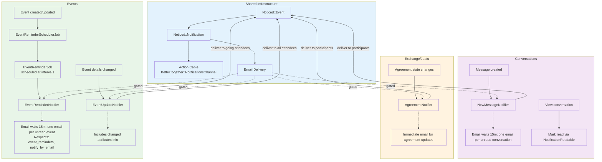

**Diagram Files:**
- 📊 [Mermaid Source](../../diagrams/source/notifications_flow.mmd) - Editable source
- 🖼️ [PNG Export](../../diagrams/exports/png/notifications_flow.png) - High-resolution image
- 🎯 [SVG Export](../../diagrams/exports/svg/notifications_flow.svg) - Vector graphics

## Building Blocks

- Event: `Noticed::Event` rows store the notification payload, including `record_id`, `record_type`, and JSON `params` (often referencing related records by GlobalID).
- Notification: `Noticed::Notification` rows join an Event to a `recipient` (a `BetterTogether::Person`) and track `read_at`/`seen_at` timestamps.
- Delivery channels:
  - Action Cable: via `BetterTogether::NotificationsChannel`, pushing `{ title, body, url, unread_count }`.
  - Email: via specific mailers; some notifiers gate emails with user preferences and/or dedupe logic.

## Notifier Inventory & Triggers

- NewMessageNotifier (`app/notifiers/better_together/new_message_notifier.rb`)
  - Trigger: when a message is created in `MessagesController#create`.
  - Recipients: all conversation participants except the sender.
  - Delivery: Action Cable immediately; Email deferred (`wait 15.minutes`) and only if `send_email_notification?`.
  - Email dedupe grouping: sends at most one email per unread conversation per recipient (but allows multiple on-site notifications).

- Joatu::MatchNotifier (`app/notifiers/better_together/joatu/match_notifier.rb`)
  - Triggers:
    - After creating an Offer/Request: `BetterTogether::Joatu::Exchange#notify_matches` dispatches to both creators for each match.
    - After creating a ResponseLink: `BetterTogether::Joatu::ResponseLink#notify_match` dispatches for direct Offer→Request or Request→Offer responses (symmetric).
  - Recipients: Both creators for automatic matches; source creator for direct responses.
  - Delivery: Action Cable + Email (if recipient has email and allows email).
  - Dedupe: Prevents creating a second unread notification for the same Offer/Request pair and recipient (custom `deliver` override + `should_notify?`).

- Joatu::AgreementNotifier (`app/notifiers/better_together/joatu/agreement_notifier.rb`)
  - Trigger: Agreement creation (`after_create_commit`).
  - Recipients: Offer and Request creators.
  - Delivery: Action Cable + Email (subject to recipient `notification_preferences`).

- Joatu::AgreementStatusNotifier (`app/notifiers/better_together/joatu/agreement_status_notifier.rb`)
  - Trigger: Agreement status change (`after_update_commit` when `status` changed).
  - Recipients: Offer and Request creators.
  - Delivery: Action Cable + Email (subject to recipient `notification_preferences`).

- PageAuthorshipNotifier (`app/notifiers/better_together/page_authorship_notifier.rb`)
  - Trigger: author added/removed on a Page (via `BetterTogether::Authorship`).
  - Recipients: all current page authors.
  - Delivery: Action Cable immediately; Email deferred (`wait 15.minutes`) and only if `send_email_notification?`.
  - Email dedupe grouping: one email per unread page per recipient (on-site notifications may still accumulate).

- EventReminderNotifier (`app/events/better_together/event_reminder_notifier.rb`)
  - Trigger: `EventReminderJob` execution 1 hour before event start time (scheduled by `EventReminderSchedulerJob`).
  - Recipients: Event creator and interested community members.
  - Delivery: Action Cable immediately; Email deferred and only if `send_email_notification?`.
  - Email content: Localized event details, start time, location, and community context.
  - Delivery: Action Cable immediately; Email deferred (`wait 15.minutes`) and only if `send_email_notification?`.
  - Email dedupe grouping: one email per unread page per recipient (on-site notifications may still accumulate).

## Marking Notifications as Read

- Concern: `BetterTogether::NotificationReadable` (`app/controllers/concerns/better_together/notification_readable.rb`)
  - `mark_notifications_read_for_record(record)`: generic record-based read marker using `noticed_events.record_id`.
  - `mark_notifications_read_for_event_records(event_class, record_ids)`: batch mark for a specific Noticed event type and list of record IDs.
  - `mark_match_notifications_read_for(record)`: efficiently marks unread `MatchNotifier` notifications for an Offer/Request by matching the record’s GlobalID in `params`.
- Usage:
  - Joatu controllers include the concern and mark `MatchNotifier` read on Offer/Request show; mark Agreement-related notifications read on Agreement show.
  - ConversationsController uses the concern to mark `NewMessageNotifier` notifications read when viewing a conversation with messages.
  - EventsController uses the concern to mark `EventReminderNotifier` notifications read when viewing event details.
  - NotificationsController uses the concern for record-based marking.

## Event Notifications

### EventReminderNotifier
- Notifier Class: `BetterTogether::EventReminderNotifier` (Noticed event in `app/events/better_together/event_reminder_notifier.rb`)
- Purpose: Send event reminders to interested participants
- Trigger: `EventReminderJob` executes 1 hour before event start_time for events with notifications enabled
- Recipients: Event creator and any interested members (those who've shown interest in the event)
- Record: BetterTogether::Event being reminded about
- Params: `{ event: <Event instance>, host_community: <Community instance> }`

### Event Email System
- Mailer: EventMailer (`app/mailers/better_together/event_mailer.rb`)
- Template: `event_reminder.html.erb` (I18n localized subject and body)
- Email Logic:
  - Check `recipient.send_email_notification?` preference
  - Use recipient's preferred locale for rendering
  - Subject/body from I18n keys: `better_together.event_mailer.event_reminder.subject`/`.body`
  - Include event title, start time (localized), location, and community context
  - Handle unread notification count in message
- Delivery: Action Cable immediately; Email deferred and only if email notifications enabled
- Email batching: Multiple events can trigger separate notifications (no artificial grouping)

### Event Reminder Scheduling
- Background Job: `EventReminderSchedulerJob` (runs periodically via cron/scheduler)
- Purpose: Schedule `EventReminderJob` instances for upcoming events
- Logic: Query events with notifications enabled that start in ~1 hour, schedule individual reminder jobs
- Queue: `:notifications` with retry configuration
- Error Handling: Individual event reminder failures don't affect batch processing

### Event Notification Integration
- Triggers: 
  - Event creation with notifications enabled: schedule future reminder
  - Event update: reschedule reminder if start_time changes
  - Event deletion: cancel pending reminder jobs
- Action Cable: Real-time notifications via `BetterTogether::NotificationsChannel`
- Read Marking: Event-specific notifications marked read when viewing event details

### Event Anti-Spam Measures
- One reminder per event per recipient (no duplicate scheduling)
- Only events with explicitly enabled notifications trigger reminders
- Respects user email preferences (`send_email_notification?`)
- Failed reminders logged but don't retry indefinitely
- Reminder scheduling only occurs for future events (past events ignored)

## Recipient Preferences & Email

- Email delivery is gated:
  - EventReminderNotifier: `recipient.send_email_notification?` must be true for email delivery
  - NewMessageNotifier and PageAuthorshipNotifier: `recipient.notify_by_email` must be true, and an internal `should_send_email?` ensures one email per unread conversation/page.
  - AgreementNotifier and AgreementStatusNotifier: `recipient.notification_preferences['notify_by_email']` (and presence of email) must be true.
  - MatchNotifier: `recipient_has_email?` checks email and preferences.

## Data & Integrity

- Noticed tables: `noticed_events` (indexed by `record_type, record_id`), `noticed_notifications` (indexed by `event_id`, `recipient`).
- Exchange dedupe: MatchNotifier prevents duplicate unread notifications for the same Offer/Request pair per recipient.
- Agreements consistency: accepted/rejected transitions guarded; unique constraints ensure one Agreement per Offer/Request pair and at most one accepted per side.

## Known Behaviors / Considerations

- NewMessage/PageAuthorship email dedupe does not dedupe on-site notifications; MatchNotifier dedupes on-site notifications as well (preventing duplicate unread for the pair).
- EventReminderNotifier sends one notification per event per recipient; scheduling prevents duplicate reminders for the same event.
- Event reminders are only sent for events with notifications explicitly enabled and future start times.
- Unread count included in Action Cable payload is computed per-recipient at send time.
- JSONB params store reference GlobalIDs for Offer/Request; read markers account for both direct string and ActiveJob `_aj_globalid` formats.

## Opportunities for Improvement

- Consider adding on-site dedupe/grouping to NewMessage/PageAuthorship similar to MatchNotifier if desired.
- Aggregate match notifications when many pairs are found at once.
- Add per-notifier throttling windows (e.g., rate limit bursty events via job scheduling).
- Event reminders could be enhanced with configurable timing (currently fixed at 1 hour before).


# Better Together Security & Protection System

## Overview

The Better Together Community Engine implements a comprehensive, multi-layered security system designed to protect community platforms against common web application threats, data breaches, and malicious attacks. The system combines **authentication**, **authorization**, **encryption**, **rate limiting**, **input validation**, and **secure communications** to create a robust defense-in-depth security posture.

## Process Flow Diagram

```mermaid
flowchart TD
    %% Security & Protection System Process Flow
    %% Better Together Community Engine Rails

    START[Incoming Request] --> BOT_CHECK{Bot Detection}
    
    %% Bot and Attack Detection Layer
    BOT_CHECK -->|Legitimate Request| RATE_LIMIT[Rack::Attack Rate Check]
    BOT_CHECK -->|Suspicious Bot| BOT_BLOCK[Block Request - 503]
    
    %% Rate Limiting & Attack Prevention
    RATE_LIMIT --> IP_THROTTLE{IP Rate Check 300/5min}
    IP_THROTTLE -->|Within Limits| PATH_CHECK[Request Path Analysis]
    IP_THROTTLE -->|Rate Exceeded| RATE_BLOCK[Rate Limit Block - 503]
    
    PATH_CHECK --> PHP_CHECK{PHP File Request?}
    PHP_CHECK -->|Yes| PHP_BLOCK[Block PHP Request - 503]
    PHP_CHECK -->|No| ATTACK_PATTERN[Attack Pattern Check]
    
    ATTACK_PATTERN --> EXPLOIT_CHECK{Exploit Pattern?}
    EXPLOIT_CHECK -->|Detected| FAIL2BAN[Fail2Ban Progressive Block]
    EXPLOIT_CHECK -->|Clean| SSL_CHECK[SSL/TLS Validation]
    
    %% SSL/TLS and Transport Security
    SSL_CHECK --> HTTPS_FORCE{Force SSL Enabled?}
    HTTPS_FORCE -->|Yes, HTTP| SSL_REDIRECT[Redirect to HTTPS]
    HTTPS_FORCE -->|HTTPS or Disabled| SECURE_HEADERS[Set Security Headers]
    
    SECURE_HEADERS --> HSTS[HTTP Strict Transport Security]
    HSTS --> CSP_HEADERS[Content Security Policy Headers]
    CSP_HEADERS --> XSS_PROTECTION[X-XSS-Protection Headers]
    
    %% Authentication Layer
    XSS_PROTECTION --> AUTH_CHECK{Authentication Required?}
    AUTH_CHECK -->|Yes| DEVISE_AUTH[Devise Authentication]
    AUTH_CHECK -->|No| PROCEED[Continue to Authorization]
    
    DEVISE_AUTH --> SESSION_CHECK{Valid Session?}
    SESSION_CHECK -->|No| LOGIN_REDIRECT[Redirect to Login]
    SESSION_CHECK -->|Yes| MFA_CHECK{2FA Enabled?}
    
    MFA_CHECK -->|Yes| TOTP_VERIFY[TOTP Token Verification]
    MFA_CHECK -->|No| PROCEED
    TOTP_VERIFY -->|Invalid| MFA_FAIL[2FA Failure - Block]
    TOTP_VERIFY -->|Valid| PROCEED
    
    %% Authorization Layer
    PROCEED --> PUNDIT_AUTH[Pundit Authorization Check]
    PUNDIT_AUTH --> ROLE_CHECK{Role-Based Permissions}
    ROLE_CHECK -->|Authorized| DATA_ACCESS[Access Granted]
    ROLE_CHECK -->|Unauthorized| ACCESS_DENY[Access Denied - 403]
    
    %% Data Protection Layer
    DATA_ACCESS --> ENCRYPT_CHECK{Sensitive Data?}
    ENCRYPT_CHECK -->|Yes| AR_ENCRYPT[Active Record Encryption]
    ENCRYPT_CHECK -->|No| VALIDATION[Input Validation]
    
    AR_ENCRYPT --> DB_ENCRYPT[Database Field Encryption]
    DB_ENCRYPT --> VALIDATION
    
    %% Input Validation & Output Protection
    VALIDATION --> PARAM_CHECK[Strong Parameters Validation]
    PARAM_CHECK --> XSS_FILTER[XSS Content Filtering]
    XSS_FILTER --> SQL_PROTECT[SQL Injection Protection]
    
    SQL_PROTECT --> SAFE_RENDER{Rendering Content?}
    SAFE_RENDER -->|Yes| HTML_SANITIZE[HTML Sanitization]
    SAFE_RENDER -->|No| RESPONSE[Generate Response]
    
    HTML_SANITIZE --> CONTENT_POLICY[Content Security Policy Enforcement]
    CONTENT_POLICY --> RESPONSE
    
    %% Response Security
    RESPONSE --> SECURE_RESPONSE[Apply Security Headers]
    SECURE_RESPONSE --> CACHE_CONTROL[Cache Control Headers]
    CACHE_CONTROL --> FINAL_RESPONSE[Return Secure Response]
    
    %% Error Handling
    BOT_BLOCK --> ERROR_LOG[Security Log Entry]
    RATE_BLOCK --> ERROR_LOG
    PHP_BLOCK --> ERROR_LOG
    FAIL2BAN --> ERROR_LOG
    MFA_FAIL --> ERROR_LOG
    ACCESS_DENY --> ERROR_LOG
    
    ERROR_LOG --> MONITORING[Security Monitoring Alert]
    MONITORING --> INCIDENT_RESPONSE[Incident Response Protocol]

    %% Styling
    classDef protection fill:#ffebee
    classDef transport fill:#e8f5e8
    classDef auth fill:#e3f2fd
    classDef authz fill:#f3e5f5
    classDef data fill:#fff3e0
    classDef validation fill:#f1f8e9
    classDef response fill:#fafafa
    classDef error fill:#ffe0b2

    class START,BOT_CHECK,RATE_LIMIT,IP_THROTTLE,PATH_CHECK,PHP_CHECK,ATTACK_PATTERN,EXPLOIT_CHECK,BOT_BLOCK,RATE_BLOCK,PHP_BLOCK,FAIL2BAN protection
    class SSL_CHECK,HTTPS_FORCE,SSL_REDIRECT,SECURE_HEADERS,HSTS,CSP_HEADERS,XSS_PROTECTION transport
    class AUTH_CHECK,DEVISE_AUTH,SESSION_CHECK,LOGIN_REDIRECT,MFA_CHECK,TOTP_VERIFY,MFA_FAIL auth
    class PROCEED,PUNDIT_AUTH,ROLE_CHECK,DATA_ACCESS,ACCESS_DENY authz
    class ENCRYPT_CHECK,AR_ENCRYPT,DB_ENCRYPT data
    class VALIDATION,PARAM_CHECK,XSS_FILTER,SQL_PROTECT,SAFE_RENDER,HTML_SANITIZE,CONTENT_POLICY validation
    class RESPONSE,SECURE_RESPONSE,CACHE_CONTROL,FINAL_RESPONSE response
    class ERROR_LOG,MONITORING,INCIDENT_RESPONSE error
```

**Diagram Files:**
- 📊 [Mermaid Source](../../diagrams/source/security_protection_flow.mmd) - Editable source
- 🖼️ [PNG Export](../../diagrams/exports/png/security_protection_flow.png) - High-resolution image
- 🎯 [SVG Export](../../diagrams/exports/svg/security_protection_flow.svg) - Vector graphics

## Architecture Components

### 1. Authentication & Session Security

#### Devise Authentication Framework
- **Configuration**: `config/initializers/devise.rb`
- **Secret Management**: Environment-based secret keys with fallback to Rails credentials
- **Paranoid Mode**: Enabled to prevent user enumeration attacks
- **Password Security**: bcrypt with configurable stretching (1 for tests, 12 for production)
- **Email Security**: Case-insensitive keys, whitespace stripping, email validation

```ruby
# Core security configurations
config.secret_key = ENV.fetch('DEVISE_SECRET') { Rails.application.credentials.secret_key_base }
config.pepper = ENV.fetch('DEVISE_PEPPER', nil)
config.paranoid = true  # Prevents user enumeration attacks
config.stretches = Rails.env.test? ? 1 : 12  # bcrypt cost factor
```

#### Session Management
- **Session Store**: Cookie-based sessions with secure configurations
- **Production Security**: `secure: Rails.env.production?` for HTTPS-only cookies
- **Session Keys**: Environment-specific session key naming
- **CSRF Protection**: Full Rails CSRF token validation enabled

```ruby
# Production session configuration
config.session_store :cookie_store, 
                     key: '_better_together_session', 
                     secure: Rails.env.production?
```

#### Password Security
- **Notification System**: Email notifications for password changes and email modifications
- **Confirmation Workflows**: Configurable account confirmation periods
- **Reset Security**: Secure password reset token generation and expiration
- **Lockout Protection**: Account lockout after failed authentication attempts

### 2. Authorization & Access Control

#### Pundit Policy Framework
- **Policy-Based Authorization**: Comprehensive Pundit policy system
- **Base Policy**: `ApplicationPolicy` with deny-by-default approach
- **Resource-Specific Policies**: Individual policies per model (User, Page, Event, etc.)
- **Scope-Based Access**: Policy scopes for collection filtering
- **Context-Aware Authorization**: User, agent (person), and record context in policies

```ruby
class ApplicationPolicy
  def initialize(user, record)
    @user = user
    @agent = user&.person
    @record = record
  end

  # Default deny-all approach
  def index?; false; end
  def show?; false; end
  def create?; false; end
  def update?; false; end
  def destroy?; false; end
end
```

#### Controller Authorization
- **Automatic Verification**: `after_action :verify_authorized` in controllers
- **Resource Authorization**: Pre-action authorization checks
- **Exception Handling**: Graceful handling of `Pundit::NotAuthorizedError`
- **API Security**: JSON API integration with Pundit error handling

#### Role-Based Access Control (RBAC)
- **Member Permissions**: Cached role and permission checking system
- **Resource Permissions**: Granular resource-specific permissions
- **Platform Roles**: Platform manager roles with elevated permissions
- **Permission Caching**: 12-hour cache for authorization decisions

### 3. Data Encryption & Privacy

#### Active Record Encryption
- **Encrypted Models**: Message content, conversation titles, platform invitations
- **Deterministic Encryption**: Searchable encrypted fields where needed
- **Rich Text Encryption**: Action Text content encrypted at rest
- **Migration Support**: Graceful handling of unencrypted legacy data

```ruby
# Message encryption example
class Message < ApplicationRecord
  has_rich_text :content, encrypted: true
end

class Conversation < ApplicationRecord
  encrypts :title, deterministic: true  # Allows searching
end
```

#### Encryption Configuration
- **Rails Master Key**: Environment-based encryption key management
- **Production Settings**: `support_unencrypted_data` for gradual migration
- **Extended Queries**: `extend_queries` for encrypted field querying
- **Key Derivation**: Secure key derivation for encryption operations

```ruby
# Production encryption settings
config.active_record.encryption.support_unencrypted_data = true
config.active_record.encryption.extend_queries = true
```

### 4. Network Security & Rate Limiting

#### Rack::Attack Protection
- **Configuration**: `config/initializers/rack_attack.rb`
- **Redis Backend**: Distributed rate limiting across application instances
- **Multi-Layer Protection**: IP-based, endpoint-specific, and user-specific limits
- **Attack Detection**: Automated blocking of suspicious activity patterns

**Rate Limiting Rules:**
- **General Requests**: 300 requests per 5 minutes per IP
- **Authentication**: 5 login attempts per 20 seconds per IP
- **Account-Specific**: 5 login attempts per 20 seconds per email
- **Fail2Ban**: Progressive blocking for repeated violations

```ruby
# Request throttling configuration
throttle('req/ip', limit: 300, period: 5.minutes, &:ip)

# Authentication protection  
throttle('logins/ip', limit: 5, period: 20.seconds) do |req|
  req.ip if req.path.include?('/users/sign-in') && req.post?
end
```

#### Attack Prevention
- **PHP File Blocking**: Automatic blocking of .php file requests
- **WordPress Protection**: Detection and blocking of WordPress-specific attack patterns
- **Penetration Testing Detection**: `/etc/passwd` and common exploit pattern detection
- **Progressive Blocking**: Fail2Ban-style escalating blocks (3 attempts, 10-minute window, 5-minute ban)

#### Monitoring Safelist
- **Uptime Monitoring**: Whitelisted monitoring service user agents
- **Health Checks**: Platform health monitoring without rate limiting
- **User Agent Validation**: Specific monitoring bot allowlists

### 5. Transport Security & HTTPS

#### SSL/TLS Configuration  
- **Force SSL**: Environment-configurable HTTPS enforcement (`FORCE_SSL`)
- **SSL Assumption**: Reverse proxy SSL termination support (`ASSUME_SSL`)
- **Secure Cookies**: Production-only secure cookie flags
- **HSTS Headers**: HTTP Strict Transport Security for browser enforcement

```ruby
# Production SSL configuration
config.force_ssl = ENV.fetch('FORCE_SSL', false)
config.assume_ssl = ENV.fetch('ASSUME_SSL', false)
```

#### Email Security
- **SMTP TLS**: Configurable TLS encryption for email delivery
- **SSL Verification**: OpenSSL certificate verification options
- **STARTTLS Support**: Opportunistic encryption for email connections
- **Certificate Validation**: Configurable SSL certificate verification modes

### 6. Input Validation & XSS Protection

#### CSRF Protection
- **Rails CSRF**: `protect_from_forgery with: :exception`
- **Token Management**: Automatic CSRF token generation and validation
- **AJAX Support**: CSRF token handling for dynamic requests
- **Clean-up Strategy**: Devise CSRF token cleanup on authentication

#### Content Security Policy (CSP)
- **Header Configuration**: `config/initializers/content_security_policy.rb`
- **Nonce Generation**: Session-based nonce generation for inline scripts
- **Import Map Integration**: Secure JavaScript module loading
- **Development Overrides**: Hot-reload support without compromising security

```ruby
# CSP nonce generation
config.content_security_policy_nonce_generator = ->(request) { 
  request.session.id.to_s 
}
config.content_security_policy_nonce_directives = %w(script-src)
```

#### HTML Sanitization
- **Action Text Integration**: Automatic HTML sanitization for rich text content
- **Allow-lists**: Strict HTML tag and attribute allow-lists
- **XSS Prevention**: Rails auto-escaping throughout view templates
- **External Link Processing**: Automatic external link icon addition with security headers

### 7. Privacy & Platform Security

#### Platform Access Control
- **Privacy Levels**: Public vs. private platform configurations
- **Invitation System**: Token-based platform access for private instances
- **Session Validation**: Invitation token validation and expiration
- **Redirect Protection**: Secure redirection for unauthorized access attempts

```ruby
def check_platform_privacy
  return if helpers.host_platform.privacy_public?
  return if current_user
  return unless BetterTogether.user_class.any?
  return if valid_platform_invitation_token_present?

  flash[:error] = I18n.t('globals.platform_not_public')
  redirect_to new_user_session_path(locale: I18n.locale)
end
```

#### Data Access Controls
- **Conversation Security**: Message encryption with participant-only access
- **Profile Privacy**: User profile visibility controls
- **Content Authorization**: Page and post visibility based on publication status
- **Search Filtering**: Authorization-aware search result filtering

### 8. API Security

#### JSON API Protection
- **CSRF Handling**: Conditional CSRF protection for JSON requests
- **Authentication**: API-specific authentication strategies
- **Authorization Integration**: Pundit policy enforcement for API endpoints
- **Error Handling**: Secure error responses without information disclosure

```ruby
class ApiController < ApplicationController
  protect_from_forgery with: :exception, unless: -> { request.format.json? }
end
```

#### Rate Limiting
- **API-Specific Limits**: Separate rate limits for API endpoints
- **Authentication Limits**: Stricter limits for authentication endpoints
- **Resource Protection**: Per-resource rate limiting for expensive operations

### 9. Background Job Security

#### Sidekiq Security
- **Redis Authentication**: Secure Redis connection configuration
- **Queue Isolation**: Namespace-based queue separation
- **Job Authentication**: Worker-level authentication and authorization
- **Error Handling**: Secure error logging without sensitive data exposure

#### Sensitive Data Processing
- **Encrypted Queues**: Encryption for sensitive job parameters
- **Temporary Storage**: Secure handling of temporary sensitive data
- **Log Scrubbing**: Automatic removal of sensitive data from job logs

### 10. Monitoring & Incident Response

#### Security Monitoring
- **Attack Detection**: Real-time monitoring of Rack::Attack blocks
- **Authentication Monitoring**: Failed login attempt tracking
- **Access Pattern Analysis**: Unusual access pattern detection
- **Performance Impact**: Security measure performance monitoring

#### Logging & Auditing
- **Security Events**: Comprehensive logging of security-related events
- **User Activity**: Audit trails for sensitive user actions
- **System Access**: Administrative action logging
- **Data Scrubbing**: Sensitive parameter scrubbing in logs

#### Brakeman Security Analysis
- **Automated Scanning**: `bundle exec brakeman --quiet --no-pager`
- **High-Confidence Fixes**: Immediate remediation of high-confidence vulnerabilities
- **Continuous Integration**: Pre-deployment security scanning
- **Vulnerability Tracking**: Systematic tracking and resolution of security issues

### 11. Development Security

#### Secure Development Practices
- **Code Review Requirements**: Security-focused code review processes
- **Static Analysis**: Brakeman integration in development workflow
- **Dependency Management**: Regular security updates for gems and dependencies
- **Environment Isolation**: Separate security configurations per environment

#### Security Testing
- **Penetration Testing**: Regular security assessment procedures
- **Vulnerability Scanning**: Automated vulnerability detection
- **Security Regression Testing**: Preventing security feature regressions
- **Threat Modeling**: Systematic threat analysis for new features

### 12. Infrastructure Security

#### Deployment Security
- **Environment Variables**: Secure secret management via environment variables
- **Docker Security**: Container-based deployment with security hardening
- **Reverse Proxy**: Nginx/Apache security configuration
- **Database Security**: PostgreSQL security hardening and encryption

#### Backup Security
- **Encrypted Backups**: Database backup encryption
- **Access Controls**: Backup access restriction and audit trails
- **Recovery Procedures**: Secure data recovery processes
- **Retention Policies**: Secure data retention and disposal

#### Cloudflare Integration
- **DDoS Protection**: Cloudflare-based DDoS mitigation
- **WAF Rules**: Web Application Firewall configuration
- **SSL Certificates**: Automated SSL certificate management
- **DNS Security**: Secure DNS configuration and DNSSEC

### 13. Compliance & Privacy Regulations

#### Data Protection
- **GDPR Compliance**: European data protection regulation compliance
- **Data Minimization**: Collection and processing only necessary data
- **Right to Erasure**: Data deletion and anonymization procedures
- **Consent Management**: User consent tracking and management

#### Privacy Controls
- **Data Portability**: User data export capabilities
- **Access Controls**: User data access and modification controls
- **Retention Policies**: Automatic data purging and archival
- **Third-Party Integration**: Privacy-aware third-party service integration

## Security Configuration Checklist

### Production Deployment Security
**Essential Security Configurations:**
- ✅ **SSL/TLS**: `force_ssl = true` with valid SSL certificates
- ✅ **Secure Cookies**: `secure: true` for production cookie configuration
- ✅ **CSRF Protection**: Full Rails CSRF protection enabled
- ✅ **Rate Limiting**: Rack::Attack configured with Redis backend
- ✅ **Authentication**: Devise with bcrypt and proper stretching factors
- ✅ **Authorization**: Pundit policies for all resources
- ✅ **Encryption**: Active Record Encryption for sensitive data
- ✅ **CSP Headers**: Content Security Policy with nonce generation
- ✅ **Security Monitoring**: Comprehensive logging and alerting
- ✅ **Environment Isolation**: Separate configurations per environment

### Security Incident Response
**Response Procedures:**
- ✅ **Detection**: Automated monitoring and alerting systems
- ✅ **Assessment**: Rapid security incident assessment protocols
- ✅ **Containment**: Emergency response procedures for security breaches
- ✅ **Recovery**: Secure system restoration and data recovery procedures
- ✅ **Communication**: Security incident communication protocols
- ✅ **Post-Incident**: Security incident post-mortem and improvement processes

## Process Flow Summary

The security system operates through several interconnected protection layers:

1. **Request Processing**: Rate limiting → SSL termination → CSRF validation → Authentication check → Authorization verification
2. **Data Protection**: Input validation → XSS prevention → Data encryption → Secure storage → Audit logging
3. **Access Control**: Authentication → Role verification → Resource authorization → Policy enforcement → Permission caching
4. **Attack Prevention**: Bot detection → Rate limiting → Attack pattern recognition → Progressive blocking → Incident response
5. **Privacy Protection**: Data encryption → Access controls → Audit trails → Compliance monitoring → Privacy rights enforcement

This comprehensive security system ensures that Better Together applications can safely handle sensitive community data while protecting against modern web application threats, maintaining user privacy, and meeting regulatory compliance requirements. The defense-in-depth approach provides multiple security layers, ensuring that if one layer is compromised, others continue to protect the application and its users.


 # Models & Concerns Overview

 This document summarizes the core models in the Better Together Community Engine,
 the concerns (mix-ins) they include, and illustrates how they relate.

 ## 1. Models by Domain

 ### A. Core & Identity

 | Model                | Purpose                                  | Concerns / Mix-ins                                            |
 |----------------------|------------------------------------------|---------------------------------------------------------------|
 | `BetterTogether::Person`       | A human participant                      | `Author`, `Contactable`, `FriendlySlug`, `Identifier`, `Identity`,<br>`Member`, `PrimaryCommunity`, `Privacy`, `Viewable`, `RemoveableAttachment` |
 | `BetterTogether::User`         | Devise User linked via `Identification` | `DeviseUser`                                                 |
 | `BetterTogether::Identification` | Polymorphic join (`agent`)             | `Identity`                                                  |

 ### B. Community & Platform

 | Model                           | Purpose                                | Concerns / Mix-ins                                          |
 |---------------------------------|----------------------------------------|-------------------------------------------------------------|
 | `BetterTogether::Community`     | Community instance                     | `Contactable`, `Host`, `Identifier`, `BuildingConnections`, `Joinable`, `Protected`, `Privacy`, `Permissible`, `RemoveableAttachment` |
 | `BetterTogether::Platform`      | Top-level platform                     | `Contactable`, `Host`, `Identifier`, `Joinable`, `Protected`, `Privacy`, `Permissible` |
 | `BetterTogether::PersonCommunityMembership` | Person ↔ Community join      | `Membership`                                               |
 | `BetterTogether::PersonPlatformMembership`  | Person ↔ Platform join       | `Membership`                                               |

 ### C. Content & Navigation

 | Model                | Purpose                                      | Concerns / Mix-ins                     |
 |----------------------|----------------------------------------------|----------------------------------------|
 | `BetterTogether::Post`                 | Blog-style posts                         | `Authorable`, `FriendlySlug`, `Categorizable`, `Identifier`, `Privacy`, `Publishable` |
 | `BetterTogether::Page`                 | CMS pages                                | `Authorable`, `FriendlySlug`, `Categorizable`, `Identifier`, `Privacy`, `Publishable` |
 | `BetterTogether::Category`             | Category buckets                         | `Labelable`, `Positioned`             |
 | `BetterTogether::Categorization`       | Join table for content categories        | —                                      |
 | `BetterTogether::NavigationArea`       | Menu container                           | `Positioned`, `Protected`             |
 | `BetterTogether::NavigationItem`       | Menu item/link                           | `Positioned`, `Protected`, `Visible`  |

 ### D. Communication

 | Model                    | Purpose                                  | Concerns / Mix-ins |
 |--------------------------|------------------------------------------|--------------------|
 | `BetterTogether::Conversation`           | Message thread                           | —                  |
 | `BetterTogether::ConversationParticipant`| Person ↔ Conversation join                | —                  |
 | `BetterTogether::Message`                | Chat messages                            | —                  |
 | `BetterTogether::Comment`                | Comments on content                      | —                  |

 ### E. Events & Calendar

 | Model                             | Purpose                                   | Concerns / Mix-ins                                                   |
 |-----------------------------------|-------------------------------------------|----------------------------------------------------------------------|
 | `BetterTogether::Event`           | Scheduled events                          | `Attachments::Images`, `Categorizable`, `Creatable`, `FriendlySlug`, `Geospatial::One`, `Locatable::One`, `Identifier`, `Privacy`, `TrackedActivity`, `Viewable` |
 | `BetterTogether::EventCategory`   | Event ↔ Category join                     | —                                                                    |
 | `BetterTogether::Calendar`        | Calendar container                        | —                                                                    |
 | `BetterTogether::CalendarEntry`   | Single calendar entry                     | —                                                                    |

 ### F. Geography & Infrastructure (abbreviated)

 | Model                                   | Purpose                           | Concerns / Mix-ins               |
 |-----------------------------------------|-----------------------------------|----------------------------------|
 | `BetterTogether::Geography::Continent` …| Geospatial taxonomy               | —                                |
 | `BetterTogether::Geography::Map` …      | Map definitions                   | —                                |
 | `BetterTogether::Infrastructure::Building` …| Physical infrastructure       | `BuildingConnections`            |

 ### G. Metrics & Analytics (abbreviated)

 | Model                                  | Purpose                            | Concerns / Mix-ins |
 |----------------------------------------|------------------------------------|--------------------|
 | `BetterTogether::Metrics::PageView` …  | Track user activity                | —                  |
 | `BetterTogether::Metrics::LinkClick` … | Track link clicks                  | —                  |

 ### H. Contact & Address (abbreviated)

 | Model                          | Purpose                       | Concerns / Mix-ins |
 |--------------------------------|-------------------------------|--------------------|
 | `BetterTogether::Address`      | Physical / mailing address    | `Contactable`      |
 | `BetterTogether::ContactDetail`| Generic contact points        | `Contactable`      |

 ## 2. Mermaid Diagram

 The following Mermaid diagram illustrates main associations and concerns.

 ```mermaid
 %% Models & Concerns class diagram
 classDiagram
   direction TB

   %% Core identity
   class Person {
     <<Author,Contactable,Identity,Member,PrimaryCommunity,
       FriendlySlug,Privacy,Viewable,RemoveableAttachment>>
   }
   class User {
     <<DeviseUser>>
   }
   class Identification
   Person "1" o-- "1" Identification : has_one
   User "1" <-- Identification : agent

   %% Community & Platform
   class Community {
     <<Contactable,Host,Joinable,Identifier,
       Protected,Privacy,Permissible,RemoveableAttachment>>
   }
   class Platform {
     <<Contactable,Host,Joinable,Identifier,
       Protected,Privacy,Permissible>>
   }
   class PersonCommunityMembership {
     <<Membership>>
   }
   class PersonPlatformMembership {
     <<Membership>>
   }
   PersonCommunityMembership *-- Community
   PersonCommunityMembership *-- Person
   PersonPlatformMembership *-- Platform
   PersonPlatformMembership *-- Person
   Community o-- PersonCommunityMembership
   Platform o-- PersonPlatformMembership
   Person o-- PersonCommunityMembership
   Person o-- PersonPlatformMembership

   %% Post & Page
   class Post {
     <<Authorable,Categorizable,Identifier,Privacy,Publishable,
       FriendlySlug>>
   }
   class Page {
     <<Authorable,Categorizable,Identifier,Privacy,Publishable,
       FriendlySlug>>
   }
   class Category
   class Categorization
   Post *-- Categorization
   Category *-- Categorization
   Page *-- Categorization

   %% Conversations
   class Conversation
   class ConversationParticipant
   class Message
   Conversation "1" o-- "*" ConversationParticipant
   ConversationParticipant "*" o-- "1" Person
   Conversation "1" o-- "*" Message
   Message "*" o-- "1" Person : sender

   %% Events & Calendar
   class Event {
     <<Attachments::Images,Categorizable,Creatable,
       FriendlySlug,Geospatial::One,Locatable::One,Identifier,
       Privacy,TrackedActivity,Viewable>>
   }
   class EventCategory
   class Calendar
   class CalendarEntry
   Event *-- EventCategory
   Calendar *-- CalendarEntry
   CalendarEntry --> Event : entry

   %% Infrastructure (abbreviated)
   class Building {
     <<BuildingConnections>>
   }
   class Floor
   class Room
   Building "1" o-- "*" Floor
   Floor "1" o-- "*" Room

   %% Contact
   class Address
   class ContactDetail
   Person "1" o-- "*" ContactDetail
   Community "1" o-- "*" ContactDetail
 ```

 **Diagram file:** [`docs/diagrams/source/models_and_concerns_diagram.mmd`](../../diagrams/source/models_and_concerns_diagram.mmd)


# Polymorphic Associations & Single Table Inheritance (STI)

This document outlines all polymorphic Active Record associations and Single Table Inheritance (STI) usage in the Better Together Community Engine.

---

## 1. Polymorphic Associations

Polymorphic associations allow a model to belong to more than one other model on a single association.

| Model                             | Association           | Interface Name  | Notes                                                    |
|-----------------------------------|-----------------------|-----------------|----------------------------------------------------------|
| **Authorship**                    | `belongs_to :authorable` | authorable    | Connects author (Person) to various content types        |
|                                   | `belongs_to :author`    | author        | Points to `BetterTogether::Person`                       |
| **ContactDetail**                 | `belongs_to :contactable` | contactable  | Stores contact info (phone, email, address, etc.)       |
| **Identification**                | `belongs_to :agent`      | agent         | Joins agent (User) polymorphically                       |
|                                   | `belongs_to :identity`   | identity      | Connects identity (Person, Community, etc.)              |
| **ResourcePermission**¹           | _(via `Resourceful`)_    | resource_type | Validates permitted actions against various models      |
| **Metrics::Download**             | `belongs_to :downloadable` | downloadable| Tracks file download events for any model               |
| **Upload**²                       | _ActiveStorage_         | record        | Uploaded files attachable to any record                  |

_¹ ResourcePermission uses the `Resourceful` concern to work with a polymorphic `resource_type` column._
_² Upload delegates to `has_one_attached :file`, backed by Active Storage’s polymorphic attachments._

---

## 2. Single Table Inheritance (STI)

STI allows multiple subclasses to share a single database table, distinguished by a `type` column.

| Base Class                        | Subclasses                              | Table Name                         |
|-----------------------------------|-----------------------------------------|------------------------------------|
| **BetterTogether::Content::Block**| Html, Css, Image, Hero, PageBlock, PlatformBlock, RichText, Template | `better_together_content_blocks` |

_Content blocks are defined via STI; each block type extends `Content::Block` and is rendered according to its subclass._

---

## 3. Further Exploration

- See `app/models/better_together/authorship.rb` for Authorship associations.
- See `app/models/better_together/contact_detail.rb` for ContactDetail.
- See `app/models/better_together/identification.rb` for polymorphic identity.
- See `app/models/concerns/better_together/resourceful.rb` for ResourcePermission’s concern.
- See `app/models/better_together/content/block.rb` and its subclasses under `app/models/better_together/content/` for STI details.

---

**Diagram file:** [`docs/diagrams/source/models_and_concerns_diagram.mmd`](../../diagrams/source/models_and_concerns_diagram.mmd)


# Role-Based Access Control (RBAC)

This document explains the RBAC system centered on People, Communities, Platforms, Memberships, Roles, and Resource Permissions.

## Core Entities

- Person: The actor identity. A Person performs actions, receives notifications, and holds memberships in Communities and Platforms.
- Community / Platform: Joinable entities. People join them via memberships and gain Roles within each joinable.
- Memberships:
  - PersonCommunityMembership: Person ↔ Community + Role
  - PersonPlatformMembership: Person ↔ Platform + Role
  - Each membership has one Role whose permissions scope to the joinable.
- Role:
  - Translated `name` and `description`, ordered by `position` per `resource_type`.
  - Has many ResourcePermissions (through RoleResourcePermissions).
- ResourcePermission:
  - Defines a permission at the resource level. Attributes:
    - `resource_type` (e.g., BetterTogether::Platform)
    - `action` from: create, read, update, delete, list, manage, view
    - `identifier` string (e.g., "manage_platform", "read_community") used for policy checks.
- RoleResourcePermission: Join model linking Role ↔ ResourcePermission (unique per pair).

## How Permission Checks Work

- Entry point: `person.permitted_to?(permission_identifier, record=nil)`
  - Looks up ResourcePermission by `identifier` in the Person’s cached permission set.
  - If no `record` is given (global check): returns true if any Role of the Person has the ResourcePermission.
  - If a `record` is given (record-scoped check):
    1) Resolve the membership class for the record’s joinable type (Community/Platform).
    2) Find memberships for `member: person`, `joinable_id: record.id`.
    3) Return true if any membership.role has the ResourcePermission.

- Caching:
  - Person caches its Roles, RoleResourcePermissions, and ResourcePermissions (12 hours) to avoid repeated DB lookups.
  - `permitted_to?` memoizes permissions-by-identifier per instance.

- Policies:
  - Pundit policies call `permitted_to?` (and sometimes compare to record creators) to gate actions.
  - Common checks include `permitted_to?('manage_platform')`, update/read permissions for Communities, Pages, Joatu resources, etc.

## Typical Flows

1) Assigning Permissions to a Role
- Create ResourcePermissions (e.g., manage_platform, read_community, update_community).
- Create Roles (e.g., platform_manager, community_admin, member).
- Link them via RoleResourcePermission (Role.assign_resource_permissions([...]) available).

2) Granting a Role to a Person
- Create a PersonPlatformMembership or PersonCommunityMembership with the Role.
- Person’s cache (roles → role_resource_permissions → resource_permissions) picks this up; after cache expiry or invalidation, `permitted_to?` reflects new permissions.

3) Authorization Check in Policies/Controllers
- Policy calls `permitted_to?('update_community', community)` to require a membership with a Role that includes `update_community` permission for that community.
- For platform-level checks, use global permissions: `user.permitted_to?('manage_platform')`.

## Design Notes

- Roles are scoped by `resource_type` for ordering and uniqueness; a Role is reusable across joinables of the same type.
- Membership validates uniqueness of Role within the [joinable, member] pair.
- Permissions are decoupled from models via `identifier` strings; policies remain expressive and testable.
- Permissible concern exposes helpers to fetch available roles per class.

## Gotchas & Tips

- Record-scoped checks require the record class to expose its `joinable_type` consistent with membership class naming.
- Remember to invalidate or wait out caches when changing Role ↔ Permission wiring in dev.
- Prefer record-scoped checks when actions depend on a specific Community/Platform; use global checks for host/platform-wide actions.

## Concrete Example: Community Admin Role

Goal: A Community Admin can list/read/update their Community and manage People memberships within that Community. They do not have platform‑wide privileges.

1) Define Resource Permissions (once)

```ruby
# In a seed or console (identifiers are strings used by policies)
BetterTogether::ResourcePermission.create!(
  resource_type: 'BetterTogether::Community', action: 'list',   identifier: 'list_community',   position: 10
)
BetterTogether::ResourcePermission.create!(
  resource_type: 'BetterTogether::Community', action: 'read',   identifier: 'read_community',   position: 20
)
BetterTogether::ResourcePermission.create!(
  resource_type: 'BetterTogether::Community', action: 'update', identifier: 'update_community', position: 30
)
BetterTogether::ResourcePermission.create!(
  resource_type: 'BetterTogether::Person',    action: 'update', identifier: 'update_person',    position: 10
)
BetterTogether::ResourcePermission.create!(
  resource_type: 'BetterTogether::Person',    action: 'list',   identifier: 'list_person',      position: 20
)
```

2) Create the Role and Link Permissions

```ruby
admin = BetterTogether::Role.create!(
  identifier: 'community_admin',
  name: 'Community Admin',
  resource_type: 'BetterTogether::Community',
  position: 1
)

admin.assign_resource_permissions(%w[
  list_community read_community update_community list_person update_person
])
```

3) Grant the Role via Membership

```ruby
person    = BetterTogether::Person.first
community = BetterTogether::Community.first

BetterTogether::PersonCommunityMembership.create!(
  member: person,
  joinable: community,
  role: admin
)
```

4) Authorization Checks

```ruby
# Global checks (no record):
person.permitted_to?('manage_platform') # => false (no platform role)

# Record‑scoped checks (with record):
person.permitted_to?('update_community', community) # => true
person.permitted_to?('list_person', community)      # => true (allowed via role on this community)

other_community = BetterTogether::Community.where.not(id: community.id).first
person.permitted_to?('update_community', other_community) # => false (no membership there)
```

Note: Policies typically call `permitted_to?` internally. For example, `CommunityPolicy#update?` might require `permitted_to?('update_community', record)`.


# Automatic Test Configuration

This system provides automatic setup for request, controller, and feature tests, eliminating the need for manual `configure_host_platform` and authentication setup in most test files.

## Features

### 1. Automatic Host Platform Setup
- **Default**: All request, controller, and feature tests automatically get host platform setup
- **Skip**: Use `:skip_host_setup` tag to skip automatic configuration (useful for testing host setup wizard)

### 2. Automatic Authentication
Multiple ways to configure authentication:

#### Tag-Based Authentication
```ruby
RSpec.describe 'SomeController', :as_platform_manager do
  # All tests in this describe block will be authenticated as platform manager
end

RSpec.describe 'SomeController', :as_user do  
  # All tests in this describe block will be authenticated as regular user
end

RSpec.describe 'SomeController', :no_auth do
  # All tests in this describe block will remain unauthenticated
end
```

#### Description-Based Authentication
The system automatically detects keywords in `describe` and `context` blocks:

```ruby
# These automatically authenticate as platform manager:
context 'as platform manager' do
context 'as admin' do
context 'as manager' do
context 'as host admin' do

# These automatically authenticate as regular user:
context 'as authenticated user' do
context 'when logged in' do  
context 'when signed in' do
context 'as user' do
context 'as member' do
```

#### Example-Level Tags
```ruby
it 'does something', :as_platform_manager do
  # This specific test runs as platform manager
end

it 'does something else', :as_user do
  # This specific test runs as regular user  
end
```

## Migration Guide

### Before (Manual Configuration)
```ruby
RSpec.describe 'SomeController' do
  before do
    configure_host_platform
    login('manager@example.test', 'xkcd4559!&@G') 
  end
  
  # tests...
end
```

### After (Automatic Configuration)
```ruby
# Option 1: Using tags
RSpec.describe 'SomeController', :as_platform_manager do
  # tests...
end

# Option 2: Using description
RSpec.describe 'SomeController' do
  context 'as platform manager' do
    # tests...
  end
end
```

## Special Cases

### Testing Setup Wizard or Onboarding
```ruby
RSpec.describe 'SetupWizardController', :skip_host_setup, :no_auth do
  # These tests won't get automatic host platform or authentication
  # Perfect for testing initial setup flows
end
```

### Mixed Authentication in Same File
```ruby
RSpec.describe 'SomeController' do
  context 'as platform manager' do
    it 'allows admin actions' do
      # Automatically authenticated as platform manager
    end
  end
  
  context 'as regular user' do  
    it 'restricts admin actions' do
      # Automatically authenticated as regular user
    end
  end
  
  context 'without authentication', :no_auth do
    it 'redirects to login' do
      # No authentication
    end
  end
end
```

## Keywords Reference

### Platform Manager Keywords
- "platform manager"
- "admin" 
- "manager"
- "host admin"
- "system admin"

### Regular User Keywords  
- "authenticated"
- "logged in"
- "signed in"
- "user"
- "member"

## Available Tags

- `:as_platform_manager` - Login as platform manager
- `:as_user` - Login as regular user
- `:authenticated` - Login as regular user (alias for :as_user)
- `:no_auth` - Skip authentication
- `:unauthenticated` - Skip authentication (alias for :no_auth)
- `:skip_host_setup` - Skip automatic host platform configuration
- `:platform_manager` - Login as platform manager (alias for :as_platform_manager)
- `:user` - Login as regular user (alias for :as_user)

## Test Types Covered

Automatic configuration applies to:
- `:type => :request`
- `:type => :controller` 
- `:type => :feature`

Other test types (`:model`, `:job`, `:mailer`, etc.) are unaffected.


# Diagram Rendering System

The `bin/render_diagrams` script automatically renders Mermaid diagrams from `docs/diagrams/source/*.mmd` to both PNG and SVG formats in `docs/diagrams/exports/{png,svg}/` with intelligent resolution selection based on diagram complexity.

## Automatic Complexity Detection

The script analyzes each diagram and automatically selects the appropriate resolution:

### High Resolution (4800x3600) for Complex Diagrams
Automatically applied when a diagram meets any of these thresholds:
- **Lines of code**: > 80 lines
- **Subgraphs**: > 5 subgraphs  
- **Connections**: > 30 arrows/connections
- **Nodes**: > 25 nodes

### Standard Resolution (3200x2400) for Simple Diagrams
Used for diagrams that don't meet the complexity thresholds above.

## Current Diagram Classifications

### High Resolution Diagrams
- `conversations_messaging_flow.mmd` - 155 lines, 9 subgraphs, 102 connections
- `events_flow.mmd` - 102 lines, complex event management flows
- `exchange_flow.mmd` - 70 lines, multiple exchange workflows  
- `models_and_concerns_diagram.mmd` - 91 lines, comprehensive class diagram
- `notifications_flow.mmd` - 62 lines, complex notification system

### Standard Resolution Diagrams
- `metrics_flow.mmd` - 26 lines, 2 subgraphs, simple metrics flow
- `navigation_flow.mmd` - 31 lines, straightforward navigation
- `accounts_flow.mmd` - 41 lines, basic account workflows
- `content_flow.mmd` - 36 lines, content management flow
- `democratic_by_design_map.mmd` - 44 lines, conceptual map
- `role_based_access_control_flow.mmd` - 41 lines, RBAC workflow

## Usage Examples

```bash
# Render all diagrams in both PNG and SVG formats
bin/render_diagrams

# Generate only PNG files
OUTPUT_FORMATS="png" bin/render_diagrams --force

# Generate only SVG files  
OUTPUT_FORMATS="svg" bin/render_diagrams --force

# Force re-render all diagrams in both formats
bin/render_diagrams --force
# or
FORCE=1 bin/render_diagrams

# Show complexity detection details
DEBUG=1 bin/render_diagrams

# Customize resolution settings
HIGH_RES_WIDTH=6400 HIGH_RES_HEIGHT=4800 bin/render_diagrams --force

# Adjust complexity thresholds
COMPLEXITY_LINE_THRESHOLD=50 bin/render_diagrams
```

## Configuration Variables

| Variable | Default | Description |
|----------|---------|-------------|
| `WIDTH` | 3200 | Standard diagram width |
| `HEIGHT` | 2400 | Standard diagram height |
| `HIGH_RES_WIDTH` | 4800 | High resolution width |
| `HIGH_RES_HEIGHT` | 3600 | High resolution height |
| `OUTPUT_FORMATS` | "png svg" | Space-separated output formats |
| `COMPLEXITY_LINE_THRESHOLD` | 80 | Lines threshold for complexity |
| `COMPLEXITY_NODE_THRESHOLD` | 25 | Nodes threshold for complexity |
| `COMPLEXITY_SUBGRAPH_THRESHOLD` | 5 | Subgraphs threshold for complexity |
| `DEBUG` | 0 | Show complexity detection details |
| `FORCE` | 0 | Force re-render all diagrams |

## Benefits

1. **Improved Readability**: Complex diagrams with many elements are rendered at higher resolution for better clarity
2. **Multiple Formats**: Both PNG (raster) and SVG (vector) formats generated automatically
3. **Scalable Vector Graphics**: SVG files scale perfectly at any zoom level without quality loss
4. **Optimized Performance**: Simple diagrams use standard resolution to keep file sizes reasonable
5. **Automatic Detection**: No manual intervention needed - complexity is detected automatically
6. **Customizable**: All thresholds and resolutions can be adjusted via environment variables
7. **Informative Output**: Clear indication of which diagrams are rendered at high resolution

## File Size Impact

Typical file size differences:

### PNG Files
- **High resolution diagrams**: 300K - 350K
- **Standard resolution diagrams**: 50K - 180K

### SVG Files  
- **High resolution diagrams**: 80K - 130K
- **Standard resolution diagrams**: 20K - 25K

The system balances visual quality for complex diagrams with reasonable file sizes for simple ones. SVG files are generally smaller and provide infinite scalability.

## Output Format Selection

Both PNG and SVG formats are generated by default, each with their own advantages:

### PNG Format
- **Use for**: Documentation, presentations, web display where compatibility is crucial
- **Advantages**: Universal browser support, predictable rendering, good for screenshots
- **Considerations**: Fixed resolution, larger file sizes, quality loss when scaled

### SVG Format  
- **Use for**: Web documentation, responsive designs, print materials, interactive diagrams
- **Advantages**: Infinitely scalable, smaller file sizes, crisp at any zoom level, can be styled with CSS
- **Considerations**: May have rendering differences across browsers/applications

### Format-Specific Generation
You can generate only one format if needed:
```bash
# PNG only
OUTPUT_FORMATS="png" bin/render_diagrams --force

# SVG only  
OUTPUT_FORMATS="svg" bin/render_diagrams --force
```


# I18n Audit TODO\n\nThe following lines likely contain hard-coded user-facing strings and should be replaced with I18n translations (t('...')).\n
- app/controllers/better_together/navigation_areas_controller.rb:53:        redirect_to @navigation_area, only_path: true, notice: 'Navigation area was successfully created.'
- app/controllers/better_together/navigation_areas_controller.rb:72:        redirect_to @navigation_area, only_path: true, notice: 'Navigation area was successfully updated.'
- app/controllers/better_together/navigation_areas_controller.rb:90:      redirect_to navigation_areas_url, notice: 'Navigation area was successfully destroyed.'
- app/controllers/better_together/resource_permissions_controller.rb:36:        redirect_to @resource_permission, only_path: true, notice: 'Resource permission was successfully created.'
- app/controllers/better_together/resource_permissions_controller.rb:56:        redirect_to @resource_permission, only_path: true, notice: 'Resource permission was successfully updated.',
- app/controllers/better_together/resource_permissions_controller.rb:76:      redirect_to resource_permissions_url, notice: 'Resource permission was successfully destroyed.',
- app/controllers/better_together/platforms_controller.rb:44:        redirect_to @platform, notice: 'Platform was successfully created.'
- app/controllers/better_together/platforms_controller.rb:63:        redirect_to @platform, notice: 'Platform was successfully updated.', status: :see_other
- app/controllers/better_together/platforms_controller.rb:82:      redirect_to platforms_url, notice: 'Platform was successfully destroyed.', status: :see_other
- app/controllers/better_together/geography/continents_controller.rb:29:          redirect_to @geography_continent, notice: 'Continent was successfully created.'
- app/controllers/better_together/geography/continents_controller.rb:47:          redirect_to @geography_continent, notice: 'Continent was successfully updated.', status: :see_other
- app/controllers/better_together/geography/continents_controller.rb:65:        redirect_to geography_continents_url, notice: 'Continent was successfully destroyed.', status: :see_other
- app/controllers/better_together/geography/countries_controller.rb:36:          redirect_to @geography_country, notice: 'Country was successfully created.', status: :see_other
- app/controllers/better_together/geography/countries_controller.rb:54:          redirect_to @geography_country, notice: 'Country was successfully updated.', status: :see_other
- app/controllers/better_together/geography/countries_controller.rb:72:        redirect_to geography_countries_url, notice: 'Country was successfully destroyed.', status: :see_other
- app/controllers/better_together/geography/settlements_controller.rb:36:          redirect_to @geography_settlement, notice: 'Settlement was successfully created.'
- app/controllers/better_together/geography/settlements_controller.rb:54:          redirect_to @geography_settlement, notice: 'Settlement was successfully updated.', status: :see_other
- app/controllers/better_together/geography/settlements_controller.rb:72:        redirect_to geography_settlements_url, notice: 'Settlement was successfully destroyed.', status: :see_other
- app/controllers/better_together/person_blocks_controller.rb:18:        redirect_to blocks_path, notice: 'Person was successfully blocked.'
- app/controllers/better_together/person_blocks_controller.rb:27:      redirect_to blocks_path, notice: 'Person was successfully unblocked.'
- app/controllers/better_together/geography/region_settlements_controller.rb:29:          redirect_to @geography_region_settlement, notice: 'Region settlement was successfully created.'
- app/controllers/better_together/geography/region_settlements_controller.rb:47:          redirect_to @geography_region_settlement, notice: 'Region settlement was successfully updated.',
- app/controllers/better_together/geography/region_settlements_controller.rb:66:        redirect_to geography_region_settlements_url, notice: 'Region settlement was successfully destroyed.',
- app/controllers/better_together/person_platform_memberships_controller.rb:48:        redirect_to @person_platform_membership, notice: 'Person platform membership was successfully updated.',
- app/controllers/better_together/person_platform_memberships_controller.rb:67:      redirect_to person_platform_memberships_url, notice: 'Person platform membership was successfully destroyed.',
- app/controllers/better_together/content/blocks_controller.rb:23:          redirect_to content_block_path(@block), notice: 'Block was successfully created.'
- app/controllers/better_together/content/blocks_controller.rb:32:            redirect_to edit_content_block_path(@block), notice: 'Block was successfully updated.'
- app/controllers/better_together/content/blocks_controller.rb:51:        redirect_to content_blocks_path, notice: 'Block was sucessfully deleted'
- app/controllers/better_together/people_controller.rb:34:        redirect_to @person, only_path: true, notice: 'Person was successfully created.', status: :see_other
- app/controllers/better_together/people_controller.rb:56:          redirect_to @person, only_path: true, notice: 'Profile was successfully updated.', status: :see_other
- app/controllers/better_together/people_controller.rb:76:      redirect_to people_url, notice: 'Person was successfully deleted.', status: :see_other
- app/controllers/better_together/geography/states_controller.rb:34:          redirect_to @geography_state, notice: 'State was successfully created.', status: :see_other
- app/controllers/better_together/geography/states_controller.rb:52:          redirect_to @geography_state, notice: 'State was successfully updated.', status: :see_other
- app/controllers/better_together/geography/states_controller.rb:70:        redirect_to geography_states_url, notice: 'State was successfully destroyed.', status: :see_other
- app/controllers/better_together/calendars_controller.rb:21:    #     redirect_to @calendar, notice: "Calendar was successfully created."
- app/controllers/better_together/calendars_controller.rb:30:    #     redirect_to @calendar, notice: "Calendar was successfully updated.", status: :see_other
- app/controllers/better_together/calendars_controller.rb:39:      redirect_to better_together_calendars_url, notice: 'Calendar was successfully destroyed.', status: :see_other
- app/controllers/better_together/geography/regions_controller.rb:36:          redirect_to @geography_region, notice: 'Region was successfully created.'
- app/controllers/better_together/geography/regions_controller.rb:54:          redirect_to @geography_region, notice: 'Region was successfully updated.', status: :see_other
- app/controllers/better_together/geography/regions_controller.rb:72:        redirect_to geography_regions_url, notice: 'Region was successfully destroyed.', status: :see_other
- app/controllers/better_together/joatu/agreements_controller.rb:73:          redirect_to joatu_agreement_path(@joatu_agreement), notice: 'Agreement accepted'
- app/controllers/better_together/joatu/agreements_controller.rb:85:        redirect_to joatu_agreement_path(@joatu_agreement), notice: 'Agreement rejected'
- app/controllers/better_together/joatu/response_links_controller.rb:52:            redirect_to joatu_request_path(request), notice: 'Request created in response to offer.'
- app/controllers/better_together/joatu/response_links_controller.rb:73:            redirect_to joatu_offer_path(offer), notice: 'Offer created in response to request.'
- app/controllers/better_together/users_controller.rb:30:        redirect_to @user, only_path: true, notice: 'User was successfully created.', status: :see_other
- app/controllers/better_together/users_controller.rb:52:          redirect_to @user, only_path: true, notice: 'Profile was successfully updated.', status: :see_other
- app/controllers/better_together/users_controller.rb:72:      redirect_to users_url, notice: 'User was successfully deleted.', status: :see_other
- app/controllers/better_together/communities_controller.rb:81:      redirect_to communities_url, notice: 'Community was successfully destroyed.', status: :see_other
- app/controllers/better_together/roles_controller.rb:37:        redirect_to @role, only_path: true, notice: 'Role was successfully created.'
- app/controllers/better_together/roles_controller.rb:57:        redirect_to @role, only_path: true, notice: 'Role was successfully updated.', status: :see_other
- app/controllers/better_together/roles_controller.rb:76:      redirect_to roles_url, notice: 'Role was successfully destroyed.', status: :see_other


# Support Staff Guide

Documentation for team members who help users with platform issues, onboarding, and general assistance.

## User Assistance
- [User Onboarding](../end_users/welcome.md) - Helping new users get started
- [User Guide](../end_users/guide.md) - Common tasks and platform overview
- [Help Banners](../ui/help-banners.md) - In-app help system

## Procedures and Escalation
- [Escalation Procedures](../shared/escalation_matrix.md) - When and how to escalate issues

## Understanding the Platform
Support staff should understand Better Together's cooperative principles to help users engage effectively with the democratic governance model and community-led features.


# Content Moderator Guide

Documentation for community volunteers who review reports, moderate content, and support platform safety.

## Moderation Resources
- [Community Social System](../developers/systems/community_social_system.md) - Moderation concepts and workflows
- [Security Protection System](../developers/systems/security_protection_system.md) - Safety features and protections

## Safety & Escalation
- [Escalation Matrix](../shared/escalation_matrix.md) - When to escalate decisions

## Cooperative Moderation
Content moderation in Better Together follows democratic principles, emphasizing community standards, transparent processes, and accountability to community members.


# Legal/Compliance Guide

Documentation for regulatory compliance, privacy policies, and legal requirements management.

## Privacy and Data Protection
- [Privacy Principles](../shared/privacy_principles.md) - Platform privacy and security principles

## Legal Procedures
- [Escalation Matrix](../shared/escalation_matrix.md) - Handling serious incidents

## Cooperative Compliance
Better Together's legal compliance reflects cooperative values, emphasizing transparency, user rights, community control, and democratic accountability in all legal and regulatory matters.


# Shared Documentation

Documentation that serves multiple stakeholder groups, covering cross-cutting concerns and collaborative processes.

## Core Shared Resources
- [Roles and Permissions](roles_and_permissions.md) - Platform authority and responsibility structure
- [Privacy Principles](privacy_principles.md) - Platform security principles and privacy framework
- [Democratic Principles](democratic_principles.md) - Cooperative governance and decision-making
- [Democratic By Design](democratic_by_design.md) - Design map for cooperative platforms
- [Escalation Matrix](escalation_matrix.md) - Decision-making and escalation procedures

## Usage
These documents are referenced from multiple stakeholder directories via symbolic links, ensuring single-source maintenance while serving different audiences.


# Democratic By Design

The Community Engine is built to empower communities to operate in line with the 7 Cooperative Principles. Our defaults, feature choices, and extensibility aim to strengthen democratic control and local autonomy rather than weaken it.

## 1) Voluntary and Open Membership
- Invitation‑required by default: Hosts invite members deliberately, ensuring safe, values‑aligned onboarding (can be opened as needed).
- Accessible UX and i18n: Pages/blocks + Mobility translations support multilingual participation.
- Transparent access rules: RBAC and privacy settings make it clear who can see/do what.

## 2) Democratic Member Control
- Roles and memberships: People hold roles within Communities and Platforms; permissions are explicit and auditable.
- Policy‑driven access: Authorization is expressed in policies that map to meaningful permissions (e.g., update_community, manage_platform).
- Documentation first: Governance‑relevant settings (privacy, visibility, invitations) are documented and easy to review.

## 3) Member Economic Participation
- Exchange (Joatu): Requests, offers, and agreements help communities coordinate value exchange (time, skills, goods) without imposing external platforms.
- Minimal data collection: Economic coordination is facilitated without tracking identity in metrics (event‑only metrics).

## 4) Autonomy and Independence
- Self‑hosting and modularity: Communities can run their own stack and keep control over data and policies.
- No third‑party trackers by default: Hosts may opt‑in to tools like GA or Sentry in line with their privacy policy and consent.
- Open formats: Reports export to CSV for portability and community accountability.

## 5) Education, Training, and Information
- Pages & Blocks: Rich content areas (Hero, RichText, Image, Template) make it easy to publish governance docs, onboarding guides, and learning materials.
- Navigation areas: Global and sidebar navigation support structured access to educational content.

## 6) Cooperation Among Cooperatives
- Multi‑community design: People can belong to communities and platforms; navigation and content patterns scale across groups.
- Shared conventions: Common RBAC/metrics/content patterns allow communities to collaborate with minimal friction.

## 7) Concern for Community
- Privacy‑first metrics: We record what happened, not who did it, to reduce risk while still enabling community‑level insights.
- Transparent visibility: Content privacy and published_at states prevent accidental exposure; admins see clear controls instead of dark patterns.

## How Design Choices Support Democracy
- Private by default: Communities choose who joins and what’s visible.
- Explicit permissions: Roles + resource permissions reflect real responsibilities; policies stay readable and testable.
- Local language & context: Translations and configurable navigation put community voice first.
- Extensible, not extractive: Add integrations on your terms; remove them just as easily.

## Examples in Practice
- Set up a community: Keep invitations on and publish a plain‑language charter as a Page.
- Delegate maintenance: Create a community_admin role with permissions (list/read/update community; manage membership) and grant via membership.
- Teach & inform: Use Pages + sidebar nav for governance FAQs and proposals archive; link from the header nav.
- Share value: Use Exchange to match needs with offers and close agreements transparently.
- Report carefully: Use built‑in reports (CSV) for page views/link clicks to learn what content helps, without tracking identities.

## Roadmap & Extensions (Community‑Led)
- Proposals & polls: Lightweight deliberation modules (e.g., polls, consensus workflows) built on the same RBAC and privacy foundations.
- Participatory budgeting: Simple budget items with community voting; compatible with private‑by‑default metrics.
- Federation: Optional interoperability with other community engines to share knowledge without centralization.

If you’re building a specific democratic workflow, we’ll help map it onto the engine’s patterns (RBAC, content, exchange, metrics) so it remains privacy‑respecting and community‑owned.


# Democratic Principles

*Core cooperative and democratic principles that guide Better Together Community Engine design and governance.*

## Cooperative Values
- **Democratic Control**: Members democratically control the platform
- **Voluntary Membership**: Open and voluntary participation
- **Economic Participation**: Members contribute to and democratically control resources
- **Autonomy and Independence**: Community self-determination and autonomy
- **Education and Training**: Commitment to member education and development
- **Cooperation**: Cooperation among communities and platforms
- **Community Concern**: Sustainable development of communities

## Platform Implementation
- **Elected Leadership**: Community and platform organizers elected by members
- **Transparent Decision-Making**: Open processes with member input
- **Community Self-Governance**: Local decision-making authority
- **Collaborative Development**: Democratic participation in platform development
- **Equitable Access**: Equal access to platform features and governance

## Stakeholder Participation
Each stakeholder group participates in democratic governance within their scope of authority and responsibility, with escalation procedures that maintain accountability to the broader community.

See also: [Democratic by Design](democratic_by_design.md)


# Roles and Permissions

*This document serves multiple stakeholder groups with information about platform authority, responsibilities, and decision-making structures.*

## Overview
The Better Together Community Engine implements a democratic role-based access control system that emphasizes community self-governance and cooperative decision-making.

## Stakeholder Roles

### End Users (Community Members)
- **Authority**: Personal profile and privacy settings
- **Responsibilities**: Follow community guidelines and platform policies
- **Decision Scope**: Personal participation and engagement choices

### Community Organizers (Elected Community Leaders)
- **Authority**: Community-specific moderation and member management
- **Responsibilities**: Serve community members democratically and transparently  
- **Decision Scope**: Community policies, membership, and local moderation
- **Accountability**: To community members who elect them

### Platform Organizers (Elected Platform Staff)
- **Authority**: Platform-wide oversight and policy enforcement
- **Responsibilities**: Support community organizers while maintaining platform standards
- **Decision Scope**: Platform policies, user management, and compliance
- **Accountability**: To the broader platform community

### Content Moderators (Safety Volunteers)
- **Authority**: Report review and content safety decisions
- **Responsibilities**: Apply community standards fairly and transparently
- **Decision Scope**: Content removal, user safety interventions
- **Escalation**: To community or platform organizers for complex cases

## Permission Structure
Technical implementation follows cooperative principles with role-based permissions that support democratic governance rather than hierarchical control.

For technical details, see [RBAC Overview](../developers/architecture/rbac_overview.md).


# Escalation Matrix

*Decision-making authority and escalation procedures for different types of platform decisions.*

## Escalation Levels

### Level 1: Individual User Decisions
- **Authority**: End Users
- **Examples**: Personal privacy settings, community participation, blocking users
- **Escalation**: To community organizers for harassment or safety issues

### Level 2: Community-Level Decisions  
- **Authority**: Community Organizers
- **Examples**: Community policies, membership decisions, local moderation
- **Escalation**: To platform organizers for policy conflicts or technical issues

### Level 3: Platform-Level Decisions
- **Authority**: Platform Organizers
- **Examples**: Platform policies, user management, compliance requirements
- **Escalation**: To legal/compliance team for regulatory issues

### Level 4: Legal/Regulatory Decisions
- **Authority**: Legal/Compliance Team
- **Examples**: Privacy compliance, data protection, regulatory requirements
- **Escalation**: To external legal counsel or regulatory bodies as required

## Cross-Stakeholder Collaboration
Many decisions involve multiple stakeholder groups working together within the cooperative framework, maintaining democratic accountability while ensuring effective platform operation.


# Privacy‑First Principles

The Community Engine is designed with privacy as a first principle. Features, defaults, and data flows prioritize the minimum data necessary to deliver value to communities, while leaving room for hosts to layer in additional tooling in line with their own policies and consent practices.

## Defaults: Private by Design
- Access control: Role‑based access (RBAC) determines who can see or do what. Content and management areas are accessible only to permitted members.
- Registration: Platforms are configured by default to require an invitation code (see Accounts & Invitations). Hosts can relax this, but the default is invite‑only.
- Content visibility: Pages respect both privacy level (public/private) and publication status (published_at). Unpublished or private content is not exposed.

## Metrics: Event‑Only, Not Identity
- We record what happened, not who did it. Metrics events do not store user identifiers.
- Page views capture only: what was viewed (pageable type/id or path), when (timestamp), and locale. Query strings are sanitized to remove sensitive parameters; only the path is stored.
- Link clicks capture: the clicked URL, referring page path, whether it was internal/external, timestamp, and locale.
- Shares capture: which platform, which URL, optional shareable type/id, timestamp, and locale.
- Downloads capture: the filename/content type/size of exported reports, timestamp, and locale.
- Search queries capture: the query string, count of results, timestamp, and locale.

## No Third‑Party Tracking by Default
- By default, the platform ships without Google Analytics or similar trackers. Error reporting is kept minimal and server‑side.
- Platform Managers may integrate additional tooling (e.g., Google Analytics, Sentry, Hotjar) per their own privacy policy and consent framework. Hosts are responsible for:
  - Updating privacy notices and cookie banners.
  - Obtaining consent where required.
  - Configuring data retention and IP anonymization as applicable.

## Data Minimization & Retention
- Collect only attributes necessary for aggregate insights (counts, trends, breakdowns by locale/page).
- Avoid PII in metrics and logs. Strip/sanitize sensitive query parameters.
- Use exportable, human‑readable report formats (CSV) and allow hosts to purge historical exports.

## Transparency & Control
- Make privacy‑relevant settings explicit in admin UIs (e.g., invite‑only, page privacy, metrics/report exports).
- Keep documentation clear about what is captured and why; give maintainers predictable knobs to disable or scope features.


# Implementation Documentation

Project management, planning, and implementation tracking for Better Together Community Engine features.

## Current Active Projects
- [Community Social System Implementation Plan](current_plans/community_social_system_implementation_plan.md)
- [Community Social System Acceptance Criteria](current_plans/community_social_system_acceptance_criteria.md)

## Templates and Standards
- [TDD Acceptance Criteria Template](templates/tdd_acceptance_criteria_template.md)
- [Implementation Plan Template](templates/implementation_plan_template.md)
- [System Documentation Template](templates/system_documentation_template.md)

## Process
All implementation follows the stakeholder-focused TDD approach with collaborative review before development begins.


# Test-Driven Development: Stakeholder Acceptance Criteria

## Overview

This document defines stakeholder-focused acceptance criteria for implementing the Community & Social System features using Test-Driven Development (TDD). Each feature is broken down by stakeholder needs with specific, testable acceptance criteria.

## Stakeholder Roles

### Primary Stakeholders
- **End Users**: Community members who need safety tools and social features
- **Community Organizers**: Elected leaders who need moderation and member management tools  
- **Platform Organizers**: Elected staff who manage comprehensive platform operations and host community/platform
- **Content Moderators**: Community volunteers who review reports and manage platform safety

### Secondary Stakeholders
- **Developers**: Technical team implementing and maintaining the features
- **Support Staff**: Team helping users with platform issues
- **Legal/Compliance**: Team ensuring platform meets safety and privacy regulations

---

## Phase 1: Critical User Safety & Admin Tools

### 1. Report Review System

#### End User Acceptance Criteria
**As an end user, I want to report problematic content/users so that the platform remains safe.**

- [ ] **AC-1.1**: I can access a report form from any content (posts, profiles, comments)
- [ ] **AC-1.2**: I can select from predefined report categories (harassment, spam, inappropriate content, etc.)
- [ ] **AC-1.3**: I can provide additional context in a text field
- [ ] **AC-1.4**: I receive confirmation when my report is submitted
- [ ] **AC-1.5**: I can view the status of my submitted reports
- [ ] **AC-1.6**: I cannot report the same content multiple times
- [ ] **AC-1.7**: I cannot report my own content
- [ ] **AC-1.8**: I receive notification when my report is resolved

#### Content Moderator Acceptance Criteria
**As a content moderator, I want to review and act on user reports so that I can maintain platform safety.**

- [ ] **AC-1.9**: I can view a queue of pending reports ordered by priority/date
- [ ] **AC-1.10**: I can filter reports by category, status, and date range
- [ ] **AC-1.11**: I can view report details including content, reporter, and context
- [ ] **AC-1.12**: I can view the reported content in context (with surrounding content)
- [ ] **AC-1.13**: I can take actions: dismiss, escalate, remove content, warn user, suspend user
- [ ] **AC-1.14**: I can add resolution notes visible to other moderators
- [ ] **AC-1.15**: I can assign reports to other moderators
- [ ] **AC-1.16**: I can view report history for users and content
- [ ] **AC-1.17**: I receive notifications for high-priority reports
- [ ] **AC-1.18**: I can bulk-process multiple reports with similar patterns

#### Platform Organizer Acceptance Criteria
**As a platform organizer, I want comprehensive reporting analytics so that I can understand platform safety trends.**

- [ ] **AC-1.19**: I can view report analytics dashboard with trends and metrics
- [ ] **AC-1.20**: I can export report data for legal/compliance purposes
- [ ] **AC-1.21**: I can configure report categories and escalation rules
- [ ] **AC-1.22**: I can view moderator performance metrics
- [ ] **AC-1.23**: I can override moderator decisions when necessary

### 2. Block Management Interface

#### End User Acceptance Criteria
**As an end user, I want to block other users so that I can control my social experience.**

- [ ] **AC-2.1**: I can block users from their profile page
- [ ] **AC-2.2**: I can block users from any of their content
- [ ] **AC-2.3**: I can view a list of users I have blocked
- [ ] **AC-2.4**: I can unblock users from my block list
- [ ] **AC-2.5**: Blocked users cannot send me messages or interact with my content
- [ ] **AC-2.6**: I cannot see content from blocked users in feeds
- [ ] **AC-2.7**: I cannot block platform administrators
- [ ] **AC-2.8**: I cannot block myself
- [ ] **AC-2.9**: I receive confirmation when blocking/unblocking users

#### Community Organizer Acceptance Criteria
**As a community organizer, I want to understand blocking patterns so that I can identify problem users.**

- [ ] **AC-2.10**: I can view users who have been blocked frequently
- [ ] **AC-2.11**: I can see blocking trends in my community
- [ ] **AC-2.12**: I can intervene in blocking situations when appropriate

#### Platform Organizer Acceptance Criteria
**As a platform organizer, I want comprehensive blocking controls so that I can manage platform-wide safety.**

- [ ] **AC-2.13**: I can view all blocking relationships across the platform
- [ ] **AC-2.14**: I can remove blocks when necessary (for investigations)
- [ ] **AC-2.15**: I can prevent specific users from being blocked (staff protection)

### 3. Basic Moderation Tools

#### Content Moderator Acceptance Criteria
**As a content moderator, I want tools to remove content and manage users so that I can maintain platform standards.**

- [ ] **AC-3.1**: I can remove individual posts, comments, and other content
- [ ] **AC-3.2**: I can temporarily suspend user accounts with defined durations
- [ ] **AC-3.3**: I can permanently ban user accounts
- [ ] **AC-3.4**: I can restore removed content if removed in error
- [ ] **AC-3.5**: I can reinstate suspended accounts
- [ ] **AC-3.6**: All moderation actions are logged with timestamps and reasons
- [ ] **AC-3.7**: I can add internal notes to user profiles for other moderators
- [ ] **AC-3.8**: I can view moderation history for any user or content

#### Platform Organizer Acceptance Criteria
**As a platform organizer, I want comprehensive moderation oversight so that I can ensure consistent policy enforcement.**

- [ ] **AC-3.9**: I can review all moderation actions taken by moderators
- [ ] **AC-3.10**: I can override any moderation decision
- [ ] **AC-3.11**: I can configure moderation policies and escalation rules
- [ ] **AC-3.12**: I can generate moderation reports for compliance purposes

---

## Phase 2: Core Social Features

### 4. Community Membership UI

#### End User Acceptance Criteria
**As an end user, I want to join and participate in communities so that I can engage with like-minded people.**

- [ ] **AC-4.1**: I can browse available communities
- [ ] **AC-4.2**: I can join public communities immediately
- [ ] **AC-4.3**: I can request to join private communities
- [ ] **AC-4.4**: I can leave communities I have joined
- [ ] **AC-4.5**: I can view my community memberships on my profile
- [ ] **AC-4.6**: I receive notifications about membership status changes
- [ ] **AC-4.7**: I can see community member counts and activity levels

#### Community Organizer Acceptance Criteria
**As a community organizer, I want to manage community membership so that I can build and maintain my community.**

- [ ] **AC-4.8**: I can approve/deny membership requests for private communities
- [ ] **AC-4.9**: I can remove members from my community
- [ ] **AC-4.10**: I can assign roles to community members (moderator, member, etc.)
- [ ] **AC-4.11**: I can view community member directory
- [ ] **AC-4.12**: I can set community privacy settings (public/private)
- [ ] **AC-4.13**: I can invite specific users to join my community
- [ ] **AC-4.14**: I receive notifications for membership requests

#### Platform Organizer Acceptance Criteria
**As a platform organizer, I want membership oversight so that I can manage community health.**

- [ ] **AC-4.15**: I can view membership statistics across all communities
- [ ] **AC-4.16**: I can manage community settings and privacy
- [ ] **AC-4.17**: I can transfer community ownership when necessary

### 5. Privacy Settings UI

#### End User Acceptance Criteria
**As an end user, I want to control my privacy settings so that I can manage my personal information visibility.**

- [ ] **AC-5.1**: I can set my profile visibility (public, private, community members only)
- [ ] **AC-5.2**: I can control who can contact me (everyone, community members, no one)
- [ ] **AC-5.3**: I can set default privacy for my content (posts, comments, etc.)
- [ ] **AC-5.4**: I can control activity visibility (what others see about my actions)
- [ ] **AC-5.5**: I can manage notification preferences for different types of events
- [ ] **AC-5.6**: I can control search visibility (whether I appear in user searches)
- [ ] **AC-5.7**: I can export my personal data
- [ ] **AC-5.8**: I can request account deletion with data removal

#### Platform Organizer Acceptance Criteria
**As a platform organizer, I want privacy oversight so that I can ensure compliance and user protection.**

- [ ] **AC-5.9**: I can configure platform-wide privacy defaults
- [ ] **AC-5.10**: I can generate privacy compliance reports
- [ ] **AC-5.11**: I can process data deletion requests
- [ ] **AC-5.12**: I can audit privacy settings for compliance

---

## TDD Implementation Process

### Step-by-Step TDD Workflow

1. **Select Acceptance Criteria**: Choose one specific acceptance criteria to implement
2. **Write Failing Tests**: Create comprehensive tests that validate the acceptance criteria
3. **Run Tests**: Confirm tests fail appropriately (red)
4. **Write Minimum Code**: Implement just enough code to make tests pass
5. **Run Tests**: Confirm tests now pass (green)
6. **Refactor**: Clean up code while maintaining test passing status
7. **Repeat**: Move to next acceptance criteria

### Test Coverage Requirements

#### Model Tests
- Validations match acceptance criteria requirements
- Associations support user workflows
- Business logic methods implement stakeholder needs
- Security constraints prevent unauthorized actions

#### Controller Tests  
- Actions support stakeholder workflows
- Authorization enforces stakeholder permissions
- Parameters handle stakeholder input requirements
- Responses meet stakeholder interface needs

#### Feature Tests
- End-to-end workflows validate stakeholder journeys
- UI elements support stakeholder tasks
- Error handling meets stakeholder expectations
- Performance meets stakeholder response time needs

### Stakeholder Validation Process

#### After Each Feature Implementation
1. **Stakeholder Demo**: Show working feature to relevant stakeholders
2. **Acceptance Review**: Validate all acceptance criteria are met
3. **Feedback Collection**: Gather stakeholder input on implementation
4. **Iteration Planning**: Plan improvements based on feedback

#### Quality Gates
- All acceptance criteria have corresponding test coverage
- All tests pass in CI/CD pipeline
- Security scan passes without high-severity issues
- Performance benchmarks meet stakeholder requirements
- Accessibility standards meet stakeholder accessibility needs

## Testing Patterns by Stakeholder Need

### End User-Focused Tests
```ruby
# Feature tests that validate user experience
RSpec.feature 'User blocks another user' do
  scenario 'user successfully blocks another user from profile' do
    # Test AC-2.1: I can block users from their profile page
  end
end
```

### Organizer/Moderator-Focused Tests
```ruby
# Controller tests that validate organizational capabilities
RSpec.describe BetterTogether::ReportsController do
  context 'when platform organizer reviews reports' do
    # Test AC-1.10: I can filter reports by category, status, and date range
  end
end
```

### System Integration Tests
```ruby
# Integration tests that validate cross-stakeholder workflows
RSpec.describe 'Report processing workflow' do
  scenario 'complete report lifecycle from submission to resolution' do
    # Test end-user report submission through organizer resolution
  end
end
```

---

This TDD approach ensures every feature serves clear stakeholder needs with measurable, testable acceptance criteria before any code is written.


# Community & Social System Implementation Plan

## Overview

This document outlines the implementation plan for the essential missing features identified in the Community & Social System documentation. The plan prioritizes user safety, administrative tools, and core social functionality needed for a functional community platform.

## Implementation Priority Matrix

### Phase 1: Critical User Safety & Platform Organizer Tools (Weeks 1-3)
**Priority: CRITICAL** - Required for platform safety and basic moderation

1. **Report Review System** - Platform organizer interface for content moderation
2. **Block Management Interface** - User interface for safety controls
3. **Basic Moderation Tools** - Content removal and user management

### Phase 2: Core Social Features (Weeks 4-6)
**Priority: HIGH** - Required for basic community functionality

4. **Community Membership UI** - Join/leave community workflows
5. **Privacy Settings UI** - User privacy control interface

### Phase 3: Enhanced Features (Weeks 7-8)
**Priority: MEDIUM** - Quality of life improvements

6. **Advanced Moderation Tools** - Bulk actions and enhanced workflows
7. **Enhanced Privacy Controls** - Granular privacy management

## Detailed Implementation Plans

---

## 1. Report Review System (Week 1)

### Overview
Create platform organizer interface for reviewing and managing user reports about content and users.

### Models Required
```ruby
# Enhance existing Report model
class Report < ApplicationRecord
  # Add status tracking
  enum status: { pending: "pending", under_review: "under_review", resolved: "resolved", dismissed: "dismissed" }
  
  # Add reviewer tracking
  belongs_to :reviewer, class_name: 'Person', optional: true
  
  # Add resolution tracking
  validates :resolution_notes, presence: true, if: :resolved_or_dismissed?
  
  scope :pending_review, -> { where(status: :pending) }
  scope :needs_attention, -> { where(status: [:pending, :under_review]) }
end
```

### Controllers Required
```ruby
# New: BetterTogether::ReportsController (enhanced for platform organizers)
class BetterTogether::ReportsController < ApplicationController
  def index    # List all reports with filtering
  def show     # View report details and context
  def update   # Update report status and resolution
  def resolve  # Mark report as resolved with notes
  def dismiss  # Dismiss report with reason
end
```

### Views Required
- `better_together/reports/index.html.erb` - Report dashboard with filters
- `better_together/reports/show.html.erb` - Individual report review interface
- `better_together/reports/_report_card.html.erb` - Report summary component
- `better_together/reports/_resolution_form.html.erb` - Resolution action form

### Database Migration
```ruby
class EnhanceReportsForAdminReview < ActiveRecord::Migration[7.1]
  def change
    add_column :better_together_reports, :status, :string, default: "pending"
    add_reference :better_together_reports, :reviewer, type: :uuid, foreign_key: { to_table: :better_together_people }
    add_column :better_together_reports, :resolution_notes, :text
    add_column :better_together_reports, :resolved_at, :datetime
    
    add_index :better_together_reports, :status
    add_index :better_together_reports, :created_at
  end
end
```

### Key Features
- Filter reports by status, type, date range
- View reported content in context
- Take actions: resolve, dismiss, escalate
- Track resolution history and reviewer notes
- Email notifications to reporters on resolution

### Testing Requirements
- Policy tests for host community role-based access control
- Controller tests for CRUD operations
- Integration tests for report workflow
- Feature tests for platform organizer interface

---

## 2. Block Management Interface (Week 1)

### Overview
Create user-facing interface for managing blocked users, viewing block history, and unblocking users.

### Controllers Required
```ruby
# Enhance existing PersonBlocksController
class PersonBlocksController < ApplicationController
  def index    # List user's blocked people with search
  def show     # Block details and history
  def create   # Block a user (existing)
  def destroy  # Unblock a user (existing)
  def new      # Form to block a user by username/email
end
```

### Views Required
- `person_blocks/index.html.erb` - Blocked users dashboard
- `person_blocks/new.html.erb` - Block user form
- `person_blocks/_blocked_person.html.erb` - Blocked person card
- `person_blocks/_block_form.html.erb` - Quick block form component

### JavaScript Controllers
```javascript
// app/javascript/controllers/person_block_controller.js
// Handle block/unblock actions with confirmation
// Search and filter blocked users
// Quick block form submissions
```

### Key Features
- Search blocked users by name
- Quick unblock actions with confirmation
- Block user by username or email
- View block creation date and context
- Bulk unblock actions (future enhancement)

### UI/UX Considerations
- Clear confirmation dialogs for unblock actions
- Search and filter capabilities
- Responsive design for mobile devices
- Accessibility compliance (WCAG AA)

---

## 3. Basic Moderation Tools (Week 2)

### Overview
Create platform organizer tools for content removal, user suspension, and basic moderation actions.

### Models Required
```ruby
# New: PersonSuspension model
class PersonSuspension < ApplicationRecord
  belongs_to :person
  belongs_to :suspended_by, class_name: 'Person'
  
  validates :reason, presence: true
  validates :expires_at, presence: true
  
  scope :active, -> { where('expires_at > ?', Time.current) }
end

# New: ContentRemoval model  
class ContentRemoval < ApplicationRecord
  belongs_to :removed_content, polymorphic: true
  belongs_to :removed_by, class_name: 'Person'
  
  validates :reason, presence: true
  
  # Store original content for audit
  store_attributes :original_data do
    content_snapshot Text
  end
end
```

### Controllers Required
```ruby
# New: BetterTogether::ModerationController
class BetterTogether::ModerationController < ApplicationController
  def suspend_user     # Temporarily suspend user account
  def unsuspend_user   # Remove user suspension
  def remove_content   # Remove inappropriate content
  def restore_content  # Restore removed content
end
```

### Key Features
- Temporary user suspension with expiration
- Content removal with audit trail
- Bulk moderation actions
- Moderation log and history tracking
- Integration with report resolution workflow

### Database Migrations
```ruby
class CreatePersonSuspensions < ActiveRecord::Migration[7.1]
  def change
    create_table :better_together_person_suspensions, id: :uuid do |t|
      t.references :person, null: false, type: :uuid
      t.references :suspended_by, null: false, type: :uuid
      t.text :reason, null: false
      t.datetime :expires_at, null: false
      t.timestamps
    end
  end
end

class CreateContentRemovals < ActiveRecord::Migration[7.1]
  def change
    create_table :better_together_content_removals, id: :uuid do |t|
      t.references :removed_content, polymorphic: true, null: false, type: :uuid
      t.references :removed_by, null: false, type: :uuid
      t.text :reason, null: false
      t.jsonb :original_data, default: {}
      t.timestamps
    end
  end
end
```

---

## 4. Community Membership UI (Week 3)

### Overview
Create user interface for joining communities, leaving communities, and managing membership status.

### Controllers Required
```ruby
# Enhance PersonCommunityMembershipsController
class PersonCommunityMembershipsController < ApplicationController
  def create   # Join community (existing, enhanced)
  def destroy  # Leave community (existing, enhanced)
  def pending  # View pending membership requests
  def approve  # Approve membership requests (community managers)
  def deny     # Deny membership requests (community managers)
end
```

### Models Required
```ruby
# Enhance PersonCommunityMembership
class PersonCommunityMembership < ApplicationRecord
  # Add membership status tracking
  enum status: { active: "active", pending: "pending", suspended: "suspended", banned: "banned" }
  
  # Add request tracking
  belongs_to :approved_by, class_name: 'Person', optional: true
  
  validates :request_message, length: { maximum: 500 }
  
  scope :pending_approval, -> { where(status: :pending) }
end
```

### Views Required
- `communities/_join_leave_buttons.html.erb` - Join/leave community controls
- `communities/_membership_status.html.erb` - Current membership status indicator
- `person_community_memberships/pending.html.erb` - Pending requests dashboard
- `person_community_memberships/_membership_request.html.erb` - Request card component

### Key Features
- One-click join for public communities
- Request-based joining for private communities
- Community manager approval workflow
- Membership status indicators
- Leave community confirmation flow

### Database Migration
```ruby
class EnhanceMembershipWorkflow < ActiveRecord::Migration[7.1]
  def change
    add_column :better_together_person_community_memberships, :status, :string, default: "active"
    add_column :better_together_person_community_memberships, :request_message, :text
    add_reference :better_together_person_community_memberships, :approved_by, type: :uuid
    add_column :better_together_person_community_memberships, :approved_at, :datetime
    
    add_index :better_together_person_community_memberships, :status
  end
end
```

---

## 5. Privacy Settings UI (Week 4)

### Overview
Create comprehensive interface for users to configure privacy settings across their profile, content, and interactions.

### Controllers Required
```ruby
# New: BetterTogether::Privacy::SettingsController
class BetterTogether::Privacy::SettingsController < ApplicationController
  def show     # Display current privacy settings
  def update   # Update privacy preferences
  def reset    # Reset to default privacy settings
end
```

### Models Required
```ruby
# Enhance Person model with privacy preferences
class Person < ApplicationRecord
  # Add privacy preferences store
  store_attributes :privacy_preferences do
    profile_visibility String, default: 'public'
    contact_visibility String, default: 'private'
    activity_visibility String, default: 'private'
    search_visibility Boolean, default: true
  end
  
  # Privacy validation
  validates :profile_visibility, inclusion: { in: %w[public private members_only] }
  validates :contact_visibility, inclusion: { in: %w[public private members_only] }
  validates :activity_visibility, inclusion: { in: %w[public private members_only] }
end
```

### Views Required
- `privacy/settings/show.html.erb` - Privacy settings dashboard
- `privacy/settings/_profile_privacy.html.erb` - Profile privacy section
- `privacy/settings/_contact_privacy.html.erb` - Contact information privacy
- `privacy/settings/_activity_privacy.html.erb` - Activity and interaction privacy

### JavaScript Controllers
```javascript
// app/javascript/controllers/privacy_settings_controller.js
// Handle privacy setting toggles
// Preview privacy changes
// Bulk privacy updates
```

### Key Features
- Granular privacy controls for different content types
- Privacy preview showing how profile appears to others
- Bulk privacy updates for existing content
- Export privacy settings and data
- Privacy education and recommendations

### Database Migration
```ruby
class AddPrivacyPreferences < ActiveRecord::Migration[7.1]
  def change
    add_column :better_together_people, :privacy_preferences, :jsonb, default: {}
    add_index :better_together_people, :privacy_preferences, using: :gin
  end
end
```

---

## Implementation Timeline

### Week 1: Platform Organizer Safety Tools
**Days 1-3: Report Review System**
- [ ] Create enhanced Report model with status tracking
- [ ] Build BetterTogether::ReportsController with full CRUD and organizer dashboard
- [ ] Create platform organizer report dashboard and detail views
- [ ] Add report resolution workflow with severity-based decision autonomy
- [ ] Write comprehensive tests

**Days 4-7: Block Management Interface**
- [ ] Enhance PersonBlocksController with search and filtering
- [ ] Create user-facing block management dashboard
- [ ] Add block user by username/email functionality
- [ ] Implement JavaScript for interactive blocking
- [ ] Add accessibility features and mobile responsiveness

### Week 2: Moderation Tools
**Days 1-4: Content Removal System**
- [ ] Create ContentRemoval model and migration
- [ ] Build content removal controllers and policies
- [ ] Add content removal audit trail
- [ ] Create platform organizer interface for content management
- [ ] Integrate with report resolution workflow

**Days 5-7: User Suspension System**
- [ ] Create PersonSuspension model and migration
- [ ] Build user suspension controllers and policies  
- [ ] Add suspension management interface
- [ ] Create suspension notification system
- [ ] Add bulk moderation capabilities

### Week 3: Community Membership
**Days 1-4: Join/Leave Workflow**
- [ ] Enhance PersonCommunityMembership with status tracking
- [ ] Build community joining interface
- [ ] Add membership request workflow for private communities
- [ ] Create community organizer approval interface
- [ ] Add membership status indicators

**Days 5-7: Membership Management**
- [ ] Build membership dashboard for users
- [ ] Add community member directory
- [ ] Create role change interface for community organizers
- [ ] Add membership analytics and reporting
- [ ] Write integration tests for complete workflow

### Week 4: Privacy Controls
**Days 1-4: Privacy Settings Interface**
- [ ] Add privacy preferences to Person model
- [ ] Create BetterTogether::Privacy::SettingsController
- [ ] Build privacy settings dashboard
- [ ] Add granular privacy controls for content types
- [ ] Create privacy preview functionality

**Days 5-7: Privacy Integration**
- [ ] Update existing views to respect privacy settings
- [ ] Add privacy-aware query scopes
- [ ] Create privacy education content
- [ ] Add data export functionality
- [ ] Comprehensive privacy testing

## Testing Strategy

### Unit Tests
- Model validations and business logic
- Policy authorization rules
- Service object functionality
- Background job processing

### Integration Tests  
- Controller actions and workflows
- Cross-model relationships
- Policy integration with controllers
- Email notifications and background jobs

### Feature Tests
- Complete user workflows (join community, block user, etc.)
- Platform organizer moderation workflows
- Privacy setting changes and effects
- Responsive design and accessibility

### Performance Tests
- Database query optimization
- Page load times for dashboards
- Bulk operation performance
- Cache effectiveness

## Security Considerations

### Authorization
- Host community role-based access to moderation tools
- User ownership verification for personal settings
- Community organizer permissions for membership approval
- Audit trails for all moderation actions
- Context-sensitive permissions based on decision autonomy granted

### Data Protection
- Secure handling of reported content
- Privacy setting enforcement across all views
- Safe deletion of user data
- Audit logging for sensitive operations

### Input Validation
- Sanitization of user-generated content
- Prevention of mass assignment vulnerabilities
- Rate limiting for report submissions
- CSRF protection for all forms

## Performance Optimization

### Database Optimization
- Proper indexing for frequently queried fields
- Query optimization for membership lookups
- Caching for privacy setting checks
- Background processing for heavy operations

### Frontend Optimization
- JavaScript lazy loading for dashboards
- Image optimization for user interfaces
- Progressive enhancement for accessibility
- Mobile-first responsive design

## Success Metrics

### User Safety
- Reduction in reported content volume
- Faster report resolution times
- Increased user satisfaction with safety tools
- Reduced repeat offenses

### Community Engagement
- Increased community join rates
- Higher member retention
- More active community participation
- Improved privacy satisfaction scores

### Platform Organizer Efficiency
- Reduced moderation workload through better tools
- Faster decision-making on reports with appropriate autonomy levels
- Better tracking of moderation actions with collaborative oversight
- Improved platform organizer user experience

---

This implementation plan provides a structured approach to building the essential missing features for the Community & Social System, prioritizing user safety and administrative tools while ensuring a comprehensive and secure social platform experience.


# [Feature Name] Implementation Plan

## ⚠️ COLLABORATIVE REVIEW REQUIRED

**This implementation plan must be reviewed collaboratively before implementation begins. The plan creator should:**

1. **Validate assumptions** with stakeholders and technical leads
2. **Confirm technical approach** aligns with platform values and architecture
3. **Review authorization patterns** match host community role-based permissions
4. **Verify UI/UX approach** follows cooperative and democratic principles
5. **Check timeline and priorities** against current platform needs

---

## Overview

[Brief description of the feature and why it's needed]

### Problem Statement
[What problem does this solve? Who is affected? What is the current pain point?]

### Success Criteria
[How will we know this implementation is successful? What metrics or outcomes define success?]

## Stakeholder Analysis

### Primary Stakeholders
- **[Stakeholder Type]**: [Their needs and how this feature serves them]
- **[Stakeholder Type]**: [Their needs and how this feature serves them]

### Secondary Stakeholders  
- **[Stakeholder Type]**: [How they're impacted]

### Collaborative Decision Points
[What decisions require consensus? What level of autonomy do individual organizers have?]

## Implementation Priority Matrix

### Phase 1: [Phase Name] (Timeframe)
**Priority: [CRITICAL/HIGH/MEDIUM/LOW]** - [Justification]

1. **[Feature 1]** - [Brief description]
2. **[Feature 2]** - [Brief description]

### Phase 2: [Phase Name] (Timeframe)
**Priority: [CRITICAL/HIGH/MEDIUM/LOW]** - [Justification]

[Continue as needed...]

## Detailed Implementation Plans

---

## [Feature Number]. [Feature Name] (Timeline)

### Overview
[Detailed description of what this feature does and why it's important]

### Stakeholder Acceptance Criteria
[Reference to TDD acceptance criteria document or list key acceptance criteria here]

### Models Required/Enhanced

```ruby
# [New or Enhanced Model Name]
class [ModelName] < ApplicationRecord
  # Follow string enum pattern (full words, ~7 chars average)
  enum status: { 
    [key1]: "[value1]", 
    [key2]: "[value2]" 
  }
  
  # Associations following cooperative patterns
  belongs_to :person, class_name: 'BetterTogether::Person'
  
  # Validations
  validates :field_name, presence: true
  
  # Scopes for common queries
  scope :scope_name, -> { where(condition) }
end
```

### Controllers Required/Enhanced

```ruby
# BetterTogether::[ControllerName] (no admin namespaces)
class BetterTogether::[ControllerName] < ApplicationController
  # Authorization through Pundit policies
  after_action :verify_authorized
  
  def index    # [Description]
  def show     # [Description]
  def create   # [Description]
  def update   # [Description]
  def destroy  # [Description]
  # Custom actions as needed
end
```

### Authorization & Permissions

```ruby
# Policy class for authorization
class [ModelName]Policy < ApplicationPolicy
  # Host community role-based permissions
  def index?
    # Logic for who can view lists
  end
  
  def show?
    # Logic for who can view individual records
  end
  
  def create?
    # Logic for who can create
  end
  
  # Context-sensitive permissions based on decision autonomy
  def moderate?
    # Different levels based on severity and granted autonomy
  end
end
```

### Views Required
- `better_together/[controller_name]/[view].html.erb` - [Description]
- `better_together/[controller_name]/_[partial].html.erb` - [Component description]

**UI/UX Considerations:**
- Separate organizer dashboard areas for complex management tasks
- Context-sensitive controls that appear based on permissions
- Cooperative/democratic language in all interface text
- Accessibility compliance (WCAG AA)
- Mobile-responsive design

### JavaScript/Stimulus Controllers

```javascript
// app/javascript/controllers/[feature_name]_controller.js
// [Description of interactive behaviors]
```

### Database Migration

```ruby
class [MigrationName] < ActiveRecord::Migration[7.1]
  def change
    # Use create_bt_table for standardized table creation
    create_bt_table :[table_name] do |t|
      # Use bt_* column helpers for consistency
      t.bt_references :[association_name], target_table: :better_together_[target_table], null: false
      t.bt_references :[polymorphic_name], polymorphic: true, null: false
      t.bt_identifier # For translated/identifiable records
      t.bt_privacy     # For privacy-enabled records
      
      # String enums following full-word pattern
      t.string :status, default: "[default_value]", null: false
      t.text :reason, null: false
      t.datetime :resolved_at
      
      # Proper indexing for performance
      t.index :status
      t.index :created_at
      t.index [:association_id, :status] # Composite indexes as needed
    end
    
    # For membership tables, use create_bt_membership_table
    # create_bt_membership_table :person_community_memberships, 
    #                           member_type: :person, 
    #                           joinable_type: :community
  end
end
```

**Migration Helper Benefits:**
- **Consistent structure**: `create_bt_table` provides UUID primary keys, lock_version, timestamps
- **Automatic naming**: Tables prefixed with `better_together_` automatically
- **Standardized columns**: `bt_*` helpers ensure consistency across the engine
- **Proper relationships**: `bt_references` creates UUID foreign keys with constraints
- **Optimistic locking**: `lock_version` included by default for concurrent access safety

### Key Features
- [Feature 1 description]
- [Feature 2 description]
- Integration with existing cooperative patterns
- Support for individual/consensus/community input decision-making as appropriate

### Testing Requirements (TDD Approach)

#### Stakeholder Acceptance Tests
```ruby
# Feature tests validating stakeholder acceptance criteria
RSpec.feature '[Feature Name]' do
  scenario '[acceptance criterion description]' do
    # Test implementation
  end
end
```

#### Model Tests
```ruby
RSpec.describe [ModelName] do
  # Test validations, associations, scopes, business logic
  # Use FactoryBot factories with realistic Faker data
end
```

#### Controller Tests
```ruby
RSpec.describe BetterTogether::[ControllerName] do
  # Test all actions, authorization, parameter handling
  # Test context-sensitive permissions
end
```

#### Policy Tests
```ruby
RSpec.describe [ModelName]Policy do
  # Test host community role-based authorization
  # Test context-sensitive permission logic
end
```

---

## Implementation Timeline

### Week/Phase 1: [Description]
**Days 1-X: [Sub-feature]**
- [ ] [Specific task with TDD approach]
- [ ] [Write failing tests first]
- [ ] [Implement minimum code to pass]
- [ ] [Refactor while maintaining tests]

**Days X-Y: [Sub-feature]**
- [ ] [Continue with specific tasks]

[Continue timeline as needed...]

## Collaborative Decision Framework

### Individual Organizer Autonomy
[What decisions can individual platform organizers make independently?]

### Consensus Required  
[What decisions require agreement from multiple organizers?]

### Community Input Required
[What decisions should involve broader community input?]

### Escalation Paths
[How are conflicts or difficult decisions escalated and resolved?]

## Security Considerations

### Authorization
- Host community role-based access verification
- User ownership verification for personal data
- Context-sensitive permissions based on granted autonomy
- Audit trails for all significant actions

### Data Protection
- Secure handling of sensitive information
- Privacy setting enforcement
- Safe deletion procedures
- Encrypted storage for sensitive fields

### Input Validation
- Strong parameters in controllers
- Sanitization of user-generated content
- Rate limiting where appropriate
- CSRF protection

## Performance Considerations

### Database Optimization
- Proper indexing for frequent queries
- Query optimization for complex lookups
- Caching strategies for expensive operations
- Background processing for heavy tasks

### Frontend Optimization
- JavaScript lazy loading
- Progressive enhancement
- Mobile-first responsive design
- Accessible interactions

## Internationalization (i18n)

### Translation Requirements
- All user-facing strings must use I18n
- Add translation keys for all supported locales (en, es, fr)
- Include flash messages, validation errors, button text
- Email subjects and bodies for all locales

### Translation Commands
```bash
i18n-tasks add-missing  # Add missing keys
i18n-tasks normalize    # Format locale files
i18n-tasks health       # Check translation health
```

## Documentation Updates Required

### System Documentation
- Update relevant system docs in `docs/` directory
- Create or update Mermaid diagrams (`.mmd` files)
- Run `bin/render_diagrams` to generate PNG and SVG exports in `docs/diagrams/exports/`
- Update process documentation

### API Documentation
[If applicable - document any new endpoints or changes]

## Success Metrics

### User Experience
- [Metric 1 with target]
- [Metric 2 with target]

### Platform Health
- [Platform-specific success measures]

### Organizer Efficiency  
- [Measures of improved organizer workflows]

### Community Impact
- [How this improves community cooperation and empowerment]

## Risk Assessment

### Technical Risks
- [Risk 1 and mitigation strategy]
- [Risk 2 and mitigation strategy]

### User Experience Risks
- [UX risk and mitigation]

### Community Impact Risks
- [Social/cooperative risks and mitigation]

## Post-Implementation Tasks

### Monitoring
- [What to monitor after deployment]
- [Key metrics to track]

### User Education
- [How to communicate changes to users]
- [Documentation or help content needed]

### Iteration Planning
- [Expected follow-up improvements]
- [Feedback collection mechanisms]

---

## Review Checklist

Before implementation begins, confirm:

- [ ] **Stakeholder needs validated** - All stakeholder acceptance criteria reviewed and confirmed
- [ ] **Technical approach approved** - Architecture aligns with platform patterns and values
- [ ] **Authorization pattern confirmed** - Host community role-based permissions correctly designed
- [ ] **UI/UX approach aligned** - Interface follows cooperative principles and accessibility standards  
- [ ] **Timeline realistic** - Estimates account for TDD approach and collaborative review
- [ ] **Dependencies identified** - All prerequisite work and potential blockers noted
- [ ] **Success metrics defined** - Clear measures of implementation success established
- [ ] **Risk mitigation planned** - Major risks identified with mitigation strategies

**Collaborative Review Date:** [Date]
**Reviewers:** [Names/Roles]
**Implementation Start Date:** [Date after successful review]

---

*This implementation plan follows the Better Together Community Engine cooperative values, emphasizing democratic decision-making, community empowerment, and collaborative development practices.*


# [SYSTEM NAME] Documentation Template

## Overview

[Brief description of the system's purpose and role within Better Together Community Engine]

## System Architecture

### Core Components

#### 1. [Component Name]
- **[Model/Service Name]**: [Description]
- **[Model/Service Name]**: [Description]

#### 2. [Component Name]  
- **[Model/Service Name]**: [Description]

## Key Features

### 1. [Feature Name]
[Description of feature]

### 2. [Feature Name]
[Description of feature]

## Technical Implementation

### Database Schema

#### [System] Tables

**[table_name]**
```sql
- id: UUID primary key
- [field]: [type] [description]
- [field]: [type] [description]
```

### Model Relationships

#### [Model Name]

**[Concern/Module Integration]**
```ruby
class [ModelName] < ApplicationRecord
  # Key includes and relationships
end
```

### Configuration

**[Configuration File/Initializer]**
```ruby
# Configuration examples
```

### Background Jobs

**[Job Processing]**
```ruby
class [JobName] < ApplicationJob
  # Job implementation
end
```

## Usage Examples

### [Use Case Name]

**[Example Title]**
```ruby
# Code example
```

## API Endpoints

### [Resource] Routes
```
GET    /[resources]           # List
POST   /[resources]           # Create  
GET    /[resources]/:id       # Show
PUT    /[resources]/:id       # Update
DELETE /[resources]/:id       # Delete
```

## Performance Considerations

### [Performance Topic]

1. **[Optimization Strategy]**: [Description]
2. **[Caching Strategy]**: [Description]
3. **[Indexing Strategy]**: [Description]

## Security Considerations

### [Security Topic]

1. **[Security Measure]**: [Description]
2. **[Access Control]**: [Description]
3. **[Data Protection]**: [Description]

## Monitoring & Maintenance

### [Monitoring Area]

```ruby
# Monitoring examples
```

### Data Quality Checks

```ruby
# Quality check examples
```

## Troubleshooting

### Common Issues

1. **[Issue Title]**
   - [Problem description]
   - [Solution description]
   - [Prevention measures]

### Debugging Tools

```ruby
# Debugging examples
```

## Integration Points

### Dependencies
- [System Name]: [How it integrates]
- [System Name]: [How it integrates]

### Used By
- [System Name]: [How it uses this system]
- [System Name]: [How it uses this system]

---

**Documentation Checklist:**
- [ ] Overview and architecture covered
- [ ] Database schema documented
- [ ] Model relationships explained
- [ ] Configuration examples provided
- [ ] Usage examples included
- [ ] API endpoints documented
- [ ] Performance considerations covered
- [ ] Security implications addressed
- [ ] Monitoring/debugging tools provided
- [ ] Integration points identified
- [ ] Process flow diagram created
- [ ] Mermaid source file (.mmd)
- [ ] PNG diagram generated
- [ ] SVG diagram generated
- [ ] Documentation assessment updated


# TDD Acceptance Criteria Template

## Overview

This template guides the creation of stakeholder-focused acceptance criteria for implementing features using Test-Driven Development (TDD). Use this template to transform confirmed implementation plans into specific, testable acceptance criteria.

## Template Usage Instructions

1. **Start with Confirmed Implementation Plan**: Ensure the implementation plan has passed collaborative review
2. **Identify Affected Stakeholders**: Determine which stakeholder roles will interact with this feature
3. **Define Acceptance Criteria**: Create specific, testable criteria for each stakeholder
4. **Generate Test Structure**: Outline the test coverage needed for each acceptance criteria
5. **Validate with Stakeholders**: Confirm acceptance criteria match stakeholder needs before implementation

---

## Feature: [FEATURE_NAME]

### Implementation Plan Reference
- **Plan Document**: `docs/[implementation_plan_file].md`
- **Review Status**: ✅ Collaborative Review Completed
- **Approval Date**: [DATE]
- **Technical Approach Confirmed**: [Brief summary of technical decisions]

### Stakeholder Impact Analysis
- **Primary Stakeholders**: [List primary stakeholders affected]
- **Secondary Stakeholders**: [List secondary stakeholders affected] 
- **Cross-Stakeholder Workflows**: [Identify workflows spanning multiple stakeholder types]

---

## Phase [X]: [PHASE_NAME]

### [Feature Number]. [Feature Name]

#### End User Acceptance Criteria
**As an end user, I want [capability] so that [benefit].**

- [ ] **AC-[#].1**: [Specific, testable behavior that delivers direct user value]
- [ ] **AC-[#].2**: [User interface interaction requirement]
- [ ] **AC-[#].3**: [User safety or privacy protection requirement]
- [ ] **AC-[#].4**: [User feedback/notification requirement]
- [ ] **AC-[#].5**: [User error handling requirement]
- [ ] **AC-[#].6**: [User accessibility requirement]

#### Community Organizer Acceptance Criteria
**As a community organizer, I want [organizational capability] so that [community benefit].**

- [ ] **AC-[#].7**: [Community management capability requirement]
- [ ] **AC-[#].8**: [Community moderation requirement]
- [ ] **AC-[#].9**: [Community analytics/insight requirement]
- [ ] **AC-[#].10**: [Community member relationship management requirement]

#### Platform Organizer Acceptance Criteria
**As a platform organizer, I want [platform oversight] so that [platform-wide benefit].**

- [ ] **AC-[#].11**: [Platform-wide policy enforcement requirement]
- [ ] **AC-[#].12**: [Platform analytics and reporting requirement]
- [ ] **AC-[#].13**: [Platform configuration management requirement]
- [ ] **AC-[#].14**: [Platform compliance and audit requirement]

#### [Additional Stakeholder Role] Acceptance Criteria
**As a [stakeholder role], I want [specific capability] so that [role-specific benefit].**

- [ ] **AC-[#].15**: [Role-specific requirement]
- [ ] **AC-[#].16**: [Role-specific workflow requirement]

---

## TDD Test Structure

### Test Coverage Matrix

| Acceptance Criteria | Model Tests | Controller Tests | Feature Tests | Integration Tests |
|-------------------|-------------|------------------|---------------|-------------------|
| AC-[#].1 | ✓ | ✓ | ✓ | |
| AC-[#].2 | | ✓ | ✓ | |
| AC-[#].3 | ✓ | ✓ | | ✓ |
| AC-[#].4 | | ✓ | ✓ | |

### Test Implementation Plan

#### Model Tests
```ruby
# Test file: spec/models/better_together/[model_name]_spec.rb
RSpec.describe BetterTogether::[ModelName] do
  describe '[business logic method]' do
    context 'when [condition from AC-[#].1]' do
      it '[expected behavior from acceptance criteria]' do
        # Test implementation validates AC-[#].1
      end
    end
  end
end
```

#### Controller Tests
```ruby
# Test file: spec/controllers/better_together/[controller_name]_spec.rb
RSpec.describe BetterTogether::[ControllerName]Controller do
  describe '[action]' do
    context 'when [stakeholder role] [performs action]' do
      it '[expected response from acceptance criteria]' do
        # Test implementation validates AC-[#].2
      end
    end
  end
end
```

#### Feature Tests
```ruby
# Test file: spec/features/[feature_name]_spec.rb
RSpec.feature '[Feature Name]' do
  scenario '[stakeholder] [performs workflow from acceptance criteria]' do
    # Test implementation validates complete stakeholder journey
    # Covers multiple acceptance criteria in realistic workflow
  end
end
```

#### Background Job Tests
```ruby
# Test file: spec/jobs/better_together/[job_name]_spec.rb
RSpec.describe BetterTogether::[JobName] do
  describe '#perform' do
    it '[expected job behavior from acceptance criteria]' do
      # Test implementation validates background processing requirements
    end
  end
end
```

#### Mailer Tests
```ruby
# Test file: spec/mailers/better_together/[mailer_name]_spec.rb
RSpec.describe BetterTogether::[MailerName] do
  describe '[mailer method]' do
    it '[expected email behavior from acceptance criteria]' do
      # Test implementation validates notification requirements
    end
  end
end
```

---

## Implementation Sequence

### Red-Green-Refactor Cycle for Each Acceptance Criteria

1. **RED Phase**: Write failing test that validates specific acceptance criteria
   ```bash
   # Run specific test to confirm it fails appropriately
   bundle exec rspec spec/[test_file]_spec.rb:[line_number]
   ```

2. **GREEN Phase**: Write minimal code to make test pass
   ```bash
   # Run test again to confirm it passes
   bundle exec rspec spec/[test_file]_spec.rb:[line_number]
   ```

3. **REFACTOR Phase**: Improve code while maintaining passing test
   ```bash
   # Run full test suite to ensure no regressions
   bundle exec rspec
   ```

### Validation Checkpoints

#### After Each Acceptance Criteria Implementation
- [ ] All related tests pass
- [ ] No existing tests broken
- [ ] Security scan passes: `bundle exec brakeman --quiet --no-pager`
- [ ] Accessibility checks pass for UI changes
- [ ] Performance benchmarks met for new functionality

#### After Complete Feature Implementation
- [ ] **Stakeholder Demo**: Present working feature to relevant stakeholders
- [ ] **Acceptance Review**: Validate all acceptance criteria fulfilled
- [ ] **Documentation Updated**: Update system documentation and diagrams
- [ ] **Integration Testing**: Verify feature works with existing systems

---

## Customization Guidelines

### Stakeholder Role Customization
- **Replace `[stakeholder role]`** with specific roles relevant to your feature
- **Add additional stakeholder sections** as needed for complex features
- **Remove stakeholder sections** that don't apply to simpler features

### Acceptance Criteria Patterns
- **User-facing criteria**: Focus on interface, safety, and experience
- **Organizer criteria**: Focus on management, oversight, and community health
- **System criteria**: Focus on performance, security, and maintainability

### Test Structure Adaptation
- **Simple features**: May only need model and controller tests
- **Complex features**: Require full test matrix including integration tests
- **UI-heavy features**: Emphasize feature tests and accessibility validation
- **API features**: Focus on controller tests and integration tests

---

## Quality Standards

### Acceptance Criteria Requirements
- **Specific**: Each criteria defines one clear, testable behavior
- **Measurable**: Success/failure can be objectively determined
- **Achievable**: Criteria can be implemented with available resources
- **Relevant**: Criteria directly serve identified stakeholder needs
- **Time-bound**: Criteria include performance and response time expectations where applicable

### Test Quality Requirements
- **Comprehensive**: Every acceptance criteria has corresponding test coverage
- **Isolated**: Tests can run independently without dependencies
- **Deterministic**: Tests produce consistent results across runs
- **Maintainable**: Tests clearly express intent and are easy to update
- **Fast**: Test suite completes in reasonable time for development workflow

---

This template ensures systematic transformation of implementation plans into stakeholder-focused acceptance criteria with comprehensive test coverage.


# Visual Documentation

System diagrams, process flows, and visual aids for the Better Together Community Engine.

## Directory Structure
- `source/` - Mermaid (.mmd) source files (authoritative versions)
- `exports/png/` - PNG exports for documentation embedding
- `exports/svg/` - SVG exports for web use and scalability

## Diagram Categories
- **System Flows**: Process workflows and data flows
- **Architecture**: System relationships and component interactions
- **User Journeys**: Stakeholder workflows and interactions

## Maintenance
Use `bin/render_diagrams` to regenerate exports from source files. Always edit .mmd source files, never edit exports directly.

See [Diagram Rendering Guide](../developers/development/diagram_rendering.md) for detailed procedures.


# Help Banners (Reusable)

Simple, consistent help messages you can drop into any page.

## Quick Use

- Basic (uses translation):

  ```erb
  <%= help_banner id: 'joatu-offers-index',
                  i18n_key: 'better_together.joatu.help.offers.index' %>
  ```

- Custom text:

  ```erb
  <%= help_banner id: 'my-custom-help', text: 'This is a short help message.' %>
  ```

- With a screenshot:

  ```erb
  <%= help_banner id: 'with-screenshot',
                  i18n_key: 'better_together.joatu.help.requests.form',
                  image_path: 'ui/requests-help.png' %>
  ```

- Custom icon/color:

  ```erb
  <%= help_banner id: 'with-icon',
                  i18n_key: 'better_together.joatu.help.agreements.show',
                  icon: 'fas fa-question-circle text-primary' %>
  ```

## What It Does

- Shows a friendly help message with an info icon.
- “Hide this help” button persists preference server‑side per user.
- When hidden, shows a small “Show help again” link.
- Accessible defaults: `role="status"`, Bootstrap alert layout.

## How It Works

- View helper:
  - `help_banner(id:, i18n_key: nil, text: nil, **opts)` calls a shared partial.
- Partial:
  - `app/views/better_together/shared/_help_banner.html.erb`
  - Reads preference using `help_banner_hidden?(id)`.
  - Posts to `hide_help_banner_path` via Stimulus to save preference.
  - Renders a “Show help again” button posting to `show_help_banner_path` when hidden.
- Stimulus controller:
  - `app/javascript/controllers/better_together/help_banner_controller.js`
  - Handles click → POST hide and hides immediately.

## Options

- `id` (required): unique identifier per page/section (e.g., `joatu-offers-index`).
- `i18n_key`: translation key for message.
- `default`: default fallback text when i18n missing.
- `text`: direct string when not using i18n.
- `icon`: CSS classes, default `fas fa-info-circle`.
- `classes`: wrapper classes, default `alert alert-info d-flex align-items-start`.
- `role`: ARIA role, default `status`.
- `image_path`: optional screenshot/image.
- `render_show_again`: boolean (default true).
- `hide_url`, `show_url`: override endpoints if needed.

## Notes

- Preferences are stored in `Person.preferences['help_banners'][id]`.
- Banners render server‑side hidden when preference is set.
- You can add translations in `config/locales/*` under `better_together.joatu.help.*`.


# Building a Page Sidebar Navigation (Admin Guide)

This short guide explains how to set up a Page‑specific sidebar navigation area and wire it to published pages.

## Overview
- Navigation Area: container for ordered, multi‑level navigation items.
- Navigation Items: each links to a Page, route, or URL; can nest for sections.
- Page: optionally references a `sidebar_nav` NavigationArea.

## Steps
1) Create a Navigation Area
- Go to Host Dashboard → Navigation Areas → New.
- Set `identifier` (e.g., `docs-sidebar`) and `visible: true`.

2) Add Navigation Items
- From the area page, add items:
  - For a Page link: set `item_type: link`, choose Linkable = Page (published pages only appear if published_at <= now), leave URL empty.
  - For an external/internal URL: set `item_type: link`, set `route_name` or `url`.
  - For grouping: set `item_type: dropdown` and add child items beneath it.
- Ordering: use position controls (or drag/drop if available) to arrange items.
- Visibility:
  - Page‑backed links auto‑hide until the Page is published.
  - Non‑page links use the `visible` flag.

3) Assign Sidebar to a Page
- Edit the target Page.
- In the Page form, set `Sidebar nav` to the area you created (`docs-sidebar`).
- Choose a layout that renders the sidebar (e.g., `page_with_nav`) if applicable.

4) Verify Rendering
- Visit the Page route (slugged URL).
- Sidebar renders as an accordion, automatically expanding the branch containing the current page.

## Caching Notes
- Sidebar cache key: `['sidebar_nav', nav.cache_key_with_version, "page-<id>"]`.
- Cache invalidates when the NavigationArea or any NavigationItem changes (`touch: true`), or when the Page updates.
- Ensure items preload translations and linkable translations to avoid N+1 queries.

## Tips
- Use dropdowns for section headings; nest items for hierarchy.
- Prefer Page links for auto‑visibility (published_at) and localization.
- Use route_name for app routes (e.g., `pages_url`, `hub_url`) when linking to internal sections outside the Pages system.


# Resource Toolbar

A shared partial for rendering edit, view, and destroy buttons for a resource.

## Usage

```
<%= render 'shared/resource_toolbar',
           back_to_list_path: posts_path,
           edit_path: edit_post_path(@post),
           view_path: post_path(@post),
           destroy_path: post_path(@post),
           destroy_confirm: t('globals.confirm_delete'),
           edit_aria_label: 'Edit Post',
           view_aria_label: 'View Post',
           destroy_aria_label: 'Delete Post' do %>
  <%= link_to 'Publish', publish_post_path(@post), class: 'btn btn-outline-success btn-sm' %>
<% end %>
```

## Locals

- `back_to_list_path` – link for a back action (optional)
- `edit_path` – link for the edit action (optional)
- `view_path` – link for the view action (optional)
- `destroy_path` – link for the destroy action (optional)
- `destroy_confirm` – confirmation text for destroy (defaults to `t('globals.confirm_delete')`)
- `edit_aria_label`, `view_aria_label`, `destroy_aria_label` – ARIA labels for accessibility.

Buttons render only when the corresponding path is provided. Defaults use the global translations for button text and ARIA labels.

### Block Content

When a block is given, its content renders in a separate, right-aligned toolbar section, allowing additional actions to be appended without mixing with the primary actions.


# Dokku Deployment

Before proceeding, review and configure required external services and environment variables:

- See: [External Services Configuration](./external-services-to-configure.md)

# Create the app

This app uses dokku to manage its production environment.

```bash
dokku apps:create communityengine
```

# Database

This app uses a PostGIS database. It is an extended version of PostgreSQL with enhanced capacity to work with geospatial data.

Visit the dokku-postgres GitHub repo for installation and usage instructions:

https://github.com/dokku/dokku-postgres

Create the postgres instance with support for postGIS:

```bash
dokku postgres:create communityengine --image imresamu/postgis --image-version latest
```

Link your new postgres instance to your applciation:

```bash
dokku postgres:link communityengine communityengine
```

# Redis

This app uses Redis for the background job queue.

Visit the dokku-redis GitHub repo for installation and usage instructions:

https://github.com/dokku/dokku-redis

Create the redis instance with support for postGIS:

```bash
dokku redis:create communityengine
```

Link your new redis instance to your applciation:

```bash
dokku redis:link communityengine communityengine
```

## Set build variables

``` bash
dokku docker-options:add communityengine.app build '--build-arg AWS_ACCESS_KEY_ID'
dokku docker-options:add communityengine.app build '--build-arg AWS_SECRET_ACCESS_KEY'
dokku docker-options:add communityengine.app build '--build-arg FOG_DIRECTORY'
dokku docker-options:add communityengine.app build '--build-arg FOG_HOST'
dokku docker-options:add communityengine.app build '--build-arg FOG_REGION'
dokku docker-options:add communityengine.app build '--build-arg ASSET_HOST'
dokku docker-options:add communityengine.app build '--build-arg CDN_DISTRIBUTION_ID'
```

## Logging

Configure the application log level with the `RAILS_LOG_LEVEL` environment variable. Use `info` or `warn` in production and reserve `debug` for troubleshooting.


# External Services & Environment Configuration

This guide lists external services used in production and the environment variables required to configure them. See `.env.prod.sample` for a concise reference of the variables used by this project.

Important notes:
- Prefer setting a single `DATABASE_URL`, `REDIS_URL`, and `ELASTICSEARCH_URL` where supported.
- Hostnames and asset/CDN domains must be consistent (`APP_HOST`, `ASSET_HOST`).
- Keep secrets out of the repo; use your platform’s secret manager (e.g., Dokku `config:set`).

## Amazon S3 / Asset Storage & CDN

Used for precompiled asset uploads and optionally as a CDN origin. The project uses `fog-aws` and `asset_sync` (see `spec/dummy/config/initializers/asset_sync.rb`).

Required variables:
- `AWS_ACCESS_KEY_ID`: AWS access key for the asset bucket.
- `AWS_SECRET_ACCESS_KEY`: AWS secret key.
- `FOG_DIRECTORY`: S3 bucket name (alias: `S3_BUCKET_NAME`).
- `FOG_REGION`: S3 region (alias: `S3_REGION`).

Recommended/optional:
- `FOG_HOST`: Custom host for S3-compatible providers or CDN origin.
- `ASSET_HOST`: Public CDN domain serving compiled assets.
- `CDN_DISTRIBUTION_ID`: If using CloudFront or similar for invalidations.
- `AWS_SESSION_TOKEN`: Temporary credentials session token (if using STS).

Example environment:
```bash
# S3 / CDN
AWS_ACCESS_KEY_ID=... 
AWS_SECRET_ACCESS_KEY=...
FOG_DIRECTORY=your-bucket
FOG_REGION=us-east-1
# Optional for S3-compatible providers/CDN
FOG_HOST=s3.amazonaws.com
ASSET_HOST=cdn.yourdomain.com
CDN_DISTRIBUTION_ID=E123EXAMPLE
```

Rails configuration references:
- `spec/dummy/config/initializers/asset_sync.rb:5` – S3 credentials and bucket settings
- `spec/dummy/config/environments/production.rb:39` – `config.asset_host`

## OpenAI (Optional Features)

Some features (e.g., translations, bots) use OpenAI if available. If unset, those features remain disabled.

Required to enable:
- `OPENAI_ACCESS_TOKEN`: API key used by helpers and robots.

Optional:
- `OPENAI_API_BASE`: Override API base (e.g., Azure OpenAI endpoint).

Example environment:
```bash
OPENAI_ACCESS_TOKEN=sk-...
# Optional for Azure/OpenAI proxy
# OPENAI_API_BASE=https://your-azure-endpoint.openai.azure.com
```

References:
- `app/robots/better_together/application_bot.rb:10`
- `app/helpers/better_together/translatable_fields_helper.rb:20`

## Sentry (Backend + Browser)

Backend error reporting and performance traces:
- `SENTRY_DSN`: Server DSN for the Ruby SDK.
- `GIT_REV`: Git SHA/version for release tagging.
- Optional sampling: `SENTRY_TRACES_SAMPLE_RATE`, `SENTRY_PROFILES_SAMPLE_RATE`.

Browser (frontend) error reporting:
- `SENTRY_CLIENT_KEY`: Public key used by the Sentry browser SDK loaded in layouts.

Example environment:
```bash
SENTRY_DSN=https://<key>@o<org>.ingest.sentry.io/<project>
SENTRY_CLIENT_KEY=<public-browser-key>
GIT_REV=$(git rev-parse --short HEAD)
# Optional sampling
# SENTRY_TRACES_SAMPLE_RATE=0.2
# SENTRY_PROFILES_SAMPLE_RATE=0.1
```

References:
- `spec/dummy/config/initializers/sentry.rb:3`
- `app/views/layouts/better_together/application.html.erb:5`
- `app/views/layouts/better_together/turbo_native.html.erb:5`

## Email (SMTP / SendGrid)

Used by Action Mailer for transactional emails. Configure your SMTP provider (SendGrid, Postmark, SES SMTP, etc.).

Required variables:
- `SMTP_ADDRESS`: SMTP server hostname.
- `SMTP_PORT`: SMTP port (587 for STARTTLS or 465 for TLS).
- `SMTP_USERNAME`: SMTP username.
- `SMTP_PASSWORD`: SMTP password.

Example environment:
```bash
SMTP_ADDRESS=smtp.sendgrid.net
SMTP_PORT=587
SMTP_USERNAME=apikey
SMTP_PASSWORD=SG.XXXX...
```

Minimal Action Mailer example (Rails initializer):
```ruby
# config/initializers/mailer.rb
Rails.application.configure do
  config.action_mailer.smtp_settings = {
    address: ENV.fetch('SMTP_ADDRESS'),
    port: Integer(ENV.fetch('SMTP_PORT', 587)),
    user_name: ENV.fetch('SMTP_USERNAME'),
    password: ENV.fetch('SMTP_PASSWORD'),
    authentication: :plain,
    enable_starttls_auto: true
  }
end
```

## Elasticsearch

Used for search indexing via `elasticsearch-model`.

Preferred:
- `ELASTICSEARCH_URL`: Full URL (e.g., `http://localhost:9200`).

Fallback variables (if `ELASTICSEARCH_URL` is not set):
- `ES_HOST`: Host URL (default `http://localhost`).
- `ES_PORT`: Port (default `9200`).

Example environment:
```bash
ELASTICSEARCH_URL=http://elasticsearch:9200
# or
# ES_HOST=http://elasticsearch
# ES_PORT=9200
```

Reference:
- `config/initializers/elasticsearch.rb:6`

## Redis

Used by Sidekiq (background jobs) and optionally Rack::Attack cache store.

Variables:
- `REDIS_URL`: Redis connection string (e.g., `redis://:password@host:6379/0`).
- `RACK_ATTACK_REDIS_URL`: Optional Redis for Rack::Attack throttling/cache.

Example environment:
```bash
REDIS_URL=redis://redis:6379/0
# Optional dedicated Redis for Rack::Attack
# RACK_ATTACK_REDIS_URL=redis://redis:6379/1
```

Reference:
- `config/initializers/rack_attack.rb:15`

## PostgreSQL (PostGIS)

Database connection is provided via `DATABASE_URL`. PostGIS is required in production.

Variables:
- `DATABASE_URL`: Full Postgres connection string.

Example:
```bash
DATABASE_URL=postgres://user:password@db:5432/community_engine_production
```

## Hostnames & Rails Keys

Hostnames:
- `ALLOWED_HOSTS`: Comma-separated hostnames allowed by Rails.
- `APP_HOST`: Public host used for URL generation.
- `BASE_URL`: Base URL without scheme if used by external scripts.

Rails secrets:
- `SECRET_KEY_BASE`: Rails secret key base (required in production).
- `RAILS_MASTER_KEY`: Key to decrypt credentials if using `config/credentials/*.yml.enc`.

Example:
```bash
ALLOWED_HOSTS=yourdomain.com
APP_HOST=yourdomain.com
BASE_URL=yourdomain.com

SECRET_KEY_BASE=<generated-secret>
# If using Rails encrypted credentials
# RAILS_MASTER_KEY=<your-master-key>
```

## Quick Checklist

- S3/CDN: `AWS_ACCESS_KEY_ID`, `AWS_SECRET_ACCESS_KEY`, `FOG_DIRECTORY`, `FOG_REGION`, `ASSET_HOST`
- OpenAI: `OPENAI_ACCESS_TOKEN` (optional)
- Sentry: `SENTRY_DSN`, `SENTRY_CLIENT_KEY`, `GIT_REV`
- Email: `SMTP_ADDRESS`, `SMTP_PORT`, `SMTP_USERNAME`, `SMTP_PASSWORD`
- Elasticsearch: `ELASTICSEARCH_URL` or `ES_HOST` + `ES_PORT`
- Redis: `REDIS_URL` (+ `RACK_ATTACK_REDIS_URL` optional)
- PostgreSQL: `DATABASE_URL`
- Host/Secrets: `ALLOWED_HOSTS`, `APP_HOST`, `SECRET_KEY_BASE`


# Raspberry Pi Setup

For app-specific external services and required environment variables, see:

- [External Services Configuration](./external-services-to-configure.md)

- Flash OS to SD card

- configure static IP for ethernet and wlan

- disable wifi

- disable bluetooth

- mute audio

- connect to gigabit ethernet

- update repositories `sudo apt-get update`

- upgrade software `sudo apt-get upgrade -y`

- install docker (debian) - https://docs.docker.com/engine/install/debian/

- docker Linux post-install (group modifications) - https://docs.docker.com/engine/install/linux-postinstall/

- Install cloudflared - https://developers.cloudflare.com/cloudflare-one/connections/connect-networks/get-started/create-local-tunnel/#1-download-and-install-cloudflared

- Create and/or connect Cloudflare tunnel

- install nordvpn - https://nordvpn.com/download/linux/

  - to login from CLI, run `nordvpn login` in the terminal and copy the link it provides
  - open the link in the browser and log in with Nord account
  - after login, copy the URL of the 'continue' button
  - in the terminal, use `nordvpn login --callback "{your success URL}"` to login

- configure nordvpn

  - enable meshnet `nordvpn set meshnet on`
  - enable lan-discovery `nordvpn set lan-discovery on`
  - enable cybersec `nordvpn set cybersec on`

- configure pi hardening

  - https://sunknudsen.com/privacy-guides/how-to-configure-hardened-raspberry-pi

  - http://www.arch13.com/security-setup-hardening-of-raspberry-pi-os-buster/

  - outline:

    - ensure pi user not used

    - ensure sudo with password

      - `rm /etc/sudoers.d/010_*`

    - disable root user history

      - ```
        echo "HISTFILESIZE=0" >> ~/.bashrc
        history -c; history -w
        source ~/.bashrc
        ```

    - disable root login and password auth

      - ```
        sed -i -E 's/^(#)?PermitRootLogin (prohibit-password|yes)/PermitRootLogin no/' /etc/ssh/sshd_config
        sed -i -E 's/^(#)?PasswordAuthentication yes/PasswordAuthentication no/' /etc/ssh/sshd_config
        systemctl restart ssh
        ```

        

    - ensure non-default hostname

    - install ufw firewall

      - `sudo apt-get install ufw`
      - `sudo ufw enable`
      - `sudo ufw allow http`
      - `sudo ufw allow https`
      - `sudo ufw limit ssh`

    - install fail2ban `sudo apt-get install fail2ban
    
    - install unattended upgrades
    
      - `sudo apt-get install unattended-upgrades`
    
      - enable unattended upgrades `sudo dpkg-reconfigure --priority=low unattended-upgrades`
        - You’ll be presented with a confirmation screen that you want to enable automatic software updates. Select `Yes` to proceed.

- install borgbackup `sudo apt install borgbackup`

- configure borgbackup - https://borgbackup.readthedocs.io/en/stable/quickstart.html

  - create initial repo `borg init --encryption=repokey /path/to/storage/{hostname}
  - run initial full backup `sudo borg create --verbose --stats --compression lz4 /storage-hdd/backups/{hostname}::full_{now} /etc /home /root /var /usr/local/bin /usr/local/sbin /usr/local/etc /usr/local/src /opt /srv`
  - configure borg automated backup

- install and configure cosmos-server - https://cosmos-cloud.io/doc/1%20index/

  - `docker run -d --network host  --privileged --name cosmos-server -h cosmos-server --restart=always -v /var/run/docker.sock:/var/run/docker.sock -v /:/mnt/host -v /{external storage path}/cosmos:/config azukaar/cosmos-server:latest`
  - Don't use https for cosmos. This is handled via the Cloudflare tunnel

- configure automount external storage (if present)

  - https://unix.stackexchange.com/a/654953

- install cosmos apps

  - Nextcloud
    - Set up cron
    - Set up plugins
      - Mount ffmpeg binaries
        - `/storage-hdd/utilities/ffmpeg-6.1/ffmpeg:/usr/bin/ffmpeg`
        - `/storage-hdd/utilities/ffmpeg-6.1/ffprobe:/usr/bin/ffprobe`
  - Ghost

- Install Discourse

  - Install launcher
  - configure & deploy data container
  - configure & deploy web container
    - Expose ports
  - Add cosmos URL to route traffic to web container

- Install Collective Commerce (Solidus)


# Dokku

For Dokku on raspi, use arm64 version of docker images when needed:

Postgres

- `dokku postgres:create community-engine-db --image imresamu/postgis --image-version latest`


# Development Setup

**Purpose:** Quick-start guide for contributors to run the Community Engine locally with the documented Docker tooling.

## Prerequisites
- Docker Engine running (all DB-dependent commands must use `bin/dc-run`)
- Ruby 3.4.4 (managed by `rbenv` in the setup scripts)
- Node 20

## Initial Setup
1. **Install dependencies**  
   Run the repository setup script (bundler, yarn, PostgreSQL + PostGIS, Elasticsearch).
2. **Prepare databases**  
   Use the provided Docker helpers to ensure commands run inside the containers:
   - `bin/dc-run bundle exec rails db:prepare`
   - `bin/dc-run bundle exec rails db:seed` (if needed)
3. **Verify test application**  
   Run the dummy app specs:  
   `bin/dc-run bin/ci`

## Everyday Commands
- **Tests:** `bin/dc-run bin/ci` or target files with `bin/dc-run bundle exec rspec spec/path_spec.rb`
- **Lint:** `bin/dc-run bundle exec rubocop`
- **I18n checks:** `bin/dc-run bin/i18n`
- **Brakeman security scan:** `bin/dc-run bundle exec brakeman --quiet --no-pager`

## Notes
- Avoid using Rails console for debugging; prefer writing or refining tests.
- Keep Docker running; database and Elasticsearch services are provided by the compose environment.
- Use `bin/dc-run-dummy` for commands that must run in the dummy app context.


# Joatu Exchange: Simple Guide

This guide explains the Joatu exchange in clear language. It covers Offers, Requests, Agreements, and Categories — plus how matching and notifications work.

Use the quick sections to get what you need. For curious readers, each page includes bonus details you can expand.

- What is Joatu? It’s a simple way for people to offer help or ask for help, match up, and confirm an agreement to get things done.
- Who is it for? Community members and organizers who want an easy way to share skills, tools, and time.

## Core Pieces

- Offers: Things people are willing to do or share.
- Requests: Things people need help with.
- Agreements: The “handshake” connecting one Offer to one Request.
- Categories: Topics that help Offers and Requests find each other.

## Where to Start

- Read about [Offers](./offers.md)
- Learn how [Requests](./requests.md) work
- See how to confirm [Agreements](./agreements.md)
- Understand [Categories](./categories.md)
- See how the system matches people and sends messages: [Matching & Notifications](./matching-and-notifications.md)

---

<details>
<summary>Bonus: What’s new and changing?</summary>

We keep improving Joatu. Recently we:
- Show the 5 most recent Offers and Requests on the Hub page.
- Added quick “match lists” under Offers and Requests for their creators.
- Notify both sides when a match is found (Offer creator and Request creator).
- Mark notifications as read when you open the related Offer/Request/Agreement.
- Improved search and filters (by keywords, categories, status, newest/oldest) on Offers/Requests.
</details>


# Agreements

An Agreement is a simple confirmation between one Offer and one Request.

- Easy idea: When an Offer and a Request match, you can create an Agreement to say “Yes, let’s do this.”
- Status shows where things are at: `pending`, `accepted`, or `rejected`.

## How to Make or Respond to an Agreement

1. From a Request or Offer, use the “Create Agreement” button.
2. The Agreement page shows both sides — what’s being offered, and what’s needed.
3. If you’re involved, you’ll see buttons to Accept or Reject.
4. Once accepted, both the Offer and Request are marked as closed.

That’s it — a small, clear step that keeps everyone on the same page.

---

<details>
<summary>Bonus: How Agreements work behind the scenes</summary>

- An Agreement connects `offer_id` and `request_id` and keeps a `status`.
- When status changes, both creators can be notified.
- You can only accept/reject if you’re one of the two participants (or a platform manager).
- The Agreement URL is used in notifications; when you open it, your related notifications are marked as read.
- Routes include member actions: `/agreements/:id/accept` and `/agreements/:id/reject` (POST).
</details>


# Categories

Categories are simple labels that help Offers and Requests find each other.

- Pick the category that best describes your Offer or Request.
- You can pick more than one if it helps.

## Why Categories Matter

- They make search and matching smarter.
- They help people browse topics they care about.

---

<details>
<summary>Bonus: How Categories work behind the scenes</summary>

- Categories are translated (multi‑language support).
- Each Offer/Request links to Categories through a small “join” record.
- Matching uses category overlap as a main signal.
- Admins can manage the category list in the platform’s Host area.
</details>


# Matching & Notifications

Joatu helps connect Offers and Requests automatically. When there’s a likely match, both sides can be notified.

## What You’ll See

- On the Offer/Request pages: a list of possible matches (for the creator).
- On the Hub: the 5 most recent Offers and Requests.
- Notifications: little alerts that tell you “there’s a match” or “an agreement changed status”.

## Marking Notifications as Read

- When you open the related Offer/Request/Agreement page, any matching notifications are marked as “read” for you.
- This keeps your notification list tidy.

---

<details>
<summary>Bonus: How matching and notifications work behind the scenes</summary>

### Matching

- We compare categories and target details between Offers and Requests.
- Offers find Requests and vice‑versa — both directions are supported.
- Matches exclude the same creator (you won’t be matched with your own listing).

### Notifications

- Match notifications include both the Offer and the Request so either side can be notified.
- Agreement notifications link you directly to the Agreement page.
- When you view an Offer/Request/Agreement, any related notifications are marked as read for your account.

### Search & Filters

- Search looks at:
  - The title (translated under the hood),
  - The description (rich text), and
  - Category names.
- Filters let you narrow by category, status, and sort order.

</details>


# Offers

Offers are things people are willing to do or share — like “Bike repair,” “Lend a ladder,” or “Help with childcare forms.”

- Easy idea: You post what you can offer, in your own words.
- People who need it can find you by category or keywords.

## How to Create an Offer

1. Go to Offers and select “New Offer”.
2. Give it a clear name (e.g., “Basic bike repair”).
3. Add a short description (what you can do, when you’re available).
4. Choose one or more categories (this helps matching).
5. Save.

You’ll see matches (Requests that fit your categories), and you may receive a notification when there’s a good fit.

---

<details>
<summary>Bonus: How Offers work behind the scenes</summary>

- Offers must include:
  - Name (translated behind the scenes so it works in multiple languages).
  - Description (rich text supported).
  - At least one Category (for matching).
  - A creator (the person who posted it).
- Status values: `open` or `closed`.
- Search & Filters (on the Offers page):
  - Search by keywords (title, description, and category names).
  - Filter by categories.
  - Filter by status (open/closed).
  - Sort by newest or oldest.
- Matching:
  - Your Offer is checked against Requests with overlapping categories and compatible targets.
  - Both sides are notified of a match.
- Privacy & Access:
  - Listings are shown to signed‑in users according to platform rules.
</details>


# Requests

Requests are things people need help with — like “Need a ladder,” “Looking for translation help,” or “Need a ride to the clinic.”

- Easy idea: You post what you need, so people who can help can find you.
- Categories help your Request appear in matching results.

## How to Create a Request

1. Go to Requests and select “New Request”.
2. Give it a clear name (e.g., “Borrow a 10ft ladder”).
3. Add a short description (when you need it, any details that help).
4. Choose one or more categories (this helps matching).
5. Save.

You’ll see matches (Offers that fit your categories), and you may receive a notification when there’s a good fit.

---

<details>
<summary>Bonus: How Requests work behind the scenes</summary>

- Requests must include:
  - Name (uses multi‑language support under the hood).
  - Description (rich text supported).
  - At least one Category (for matching).
  - A creator (the person who posted it).
- Status values: `open` or `closed`.
- Search & Filters (on the Requests page):
  - Search by keywords (title, description, and category names).
  - Filter by categories.
  - Filter by status (open/closed).
  - Sort by newest or oldest.
- Matching:
  - Your Request is checked against Offers with overlapping categories and compatible targets.
  - Both sides are notified of a match.
- Privacy & Access:
  - Listings are shown to signed‑in users according to platform rules.
</details>


# Meta Documentation

Documentation about the documentation system, quality standards, and maintenance procedures.

## Documentation Management
- [Stakeholder Documentation Structure](stakeholder_documentation_structure.md) - Organization and roles
- [Documentation Assessment](documentation_assessment.md) - Quality requirements and tracking
- [Documentation Inventory](documentation_inventory.md) - File inventory and coverage
- [Restructure Plan](documentation_restructure_plan.md) - Notes on the current layout

## Tools and Automation
- [Validate Documentation Tooling](../scripts/validate_documentation_tooling.sh) - Integrity checks
- [Update Progress](../scripts/update_progress.sh) - Progress tracking
- [Create Stakeholder Structure](../scripts/create_stakeholder_structure.sh) - Scaffolding

This meta-documentation ensures the stakeholder-focused documentation structure remains organized, accessible, and aligned with cooperative principles.


# Better Together Community Engine - Documentation Assessment & Progress Tracker

**Last Updated:** September 08, 2025
**Assessment Date:** August 21, 2025  
**Schema Analysis Version:** 2025_08_21_121500

---

## Executive Summary

The Better Together Community Engine consists of **75 database tables** organized into **15 major system domains**. Our current documentation coverage stands at **27% complete** with **4 systems fully documented** and **3 systems partially documented**.

### Current Status Overview
- **✅ Fully Documented Systems:** 4/15 (27%)
- **🔄 Partially Documented Systems:** 3/15 (20%) 
- **📋 Pending Documentation Systems:** 8/15 (53%)
- **Total Tables Covered:** 28/75 (37%)
- **Documentation Files Created:** 8 (4 systems × 2 files each)
- **Process Flow Diagrams:** 4 complete sets (Mermaid + PNG + SVG)

---

## System Documentation Progress Matrix

| System | Priority | Tables | Status | Docs | Diagrams | Completion % |
|--------|----------|--------|--------|------|----------|-------------|
| **I18n/Mobility System** | 🔥 HIGH | 4 | ✅ Complete | `i18n_mobility_localization_system.md` | ✅ Complete | 100% |
| **Security/Protection System** | 🔥 HIGH | 2 | ✅ Complete | `security_protection_system.md` | ✅ Complete | 100% |
| **Geography/Location System** | 🔥 HIGH | 12 | ✅ Complete | `geography_system.md` | ✅ Complete | 100% |
| **Caching/Performance System** | 🔥 HIGH | 0* | ✅ Complete | `caching_performance_system.md` | ✅ Complete | 100% |
| **Event & Calendar System** | 🔥 HIGH | 5 | 🔄 Partial | Models exist | ❌ Pending | 25% |
| **Infrastructure System** | 🟡 MEDIUM | 4 | 🔄 Partial | Models exist | ❌ Pending | 25% |
| **Joatu Exchange System** | 🔥 HIGH | 4 | 🔄 Partial | Models exist | ❌ Pending | 25% |
| **Community & Social System** | 🔥 HIGH | 8 | 📋 Pending | ❌ Needed | ❌ Needed | 0% |
| **Content Management System** | 🔥 HIGH | 9 | 📋 Pending | ❌ Needed | ❌ Needed | 0% |
| **Communication System** | 🔥 HIGH | 5 | 📋 Pending | ❌ Needed | ❌ Needed | 0% |
| **Contact Management** | 🟡 MEDIUM | 6 | 📋 Pending | ❌ Needed | ❌ Needed | 0% |
| **Analytics & Metrics** | 🟡 MEDIUM | 7 | 📋 Pending | ❌ Needed | ❌ Needed | 0% |
| **Content Organization** | 🟡 MEDIUM | 8 | 📋 Pending | ❌ Needed | ❌ Needed | 0% |
| **Workflow Management** | 🟡 MEDIUM | 4 | 📋 Pending | ❌ Needed | ❌ Needed | 0% |
| **Navigation & UI** | 🟡 MEDIUM | 2 | 📋 Pending | ❌ Needed | ❌ Needed | 0% |
| **Agreement & Legal** | 🔴 LOW | 3 | 📋 Pending | ❌ Needed | ❌ Needed | 0% |
| **Support Systems** | 🔴 LOW | 4 | 📋 Pending | ❌ Needed | ❌ Needed | 0% |

*_External systems (Redis, Elasticsearch) - no direct tables_

---

## Completed Documentation Inventory

### ✅ **I18n/Mobility Localization System** 
**Completion Date:** August 2025  
**Documentation Size:** 400+ lines  
**Tables Covered:** 4
- `mobility_string_translations`
- `mobility_text_translations`
- `action_text_rich_texts`
- `better_together_ai_log_translations`

**Files Created:**
- `docs/i18n_mobility_localization_system.md` (comprehensive documentation)
- `docs/diagrams/source/i18n_mobility_localization_flow.mmd` (Mermaid source)
- `docs/diagrams/exports/png/i18n_mobility_localization_flow.png` (high-res diagram)
- `docs/diagrams/exports/svg/i18n_mobility_localization_flow.svg` (vector diagram)

**Key Features Documented:**
- Mobility gem integration with multiple backends
- AI-powered translation workflows
- Deterministic encryption for sensitive translations
- Multi-locale UI components
- Performance optimization strategies

---

### ✅ **Security/Protection System**
**Completion Date:** August 2025  
**Documentation Size:** 15,800+ bytes  
**Tables Covered:** 2
- `better_together_jwt_denylists`
- `better_together_users`

**Files Created:**
- `docs/security_protection_system.md` (comprehensive documentation)
- `docs/diagrams/source/security_protection_flow.mmd` (Mermaid source)
- `docs/diagrams/exports/png/security_protection_flow.png` (high-res diagram)
- `docs/diagrams/exports/svg/security_protection_flow.svg` (vector diagram)

**Key Features Documented:**
- Defense-in-depth security architecture
- Devise authentication with MFA support
- Pundit authorization patterns
- Active Record Encryption implementation
- Rack::Attack rate limiting configurations
- SSL/TLS and security headers

---

### ✅ **Geography/Location System**
**Completion Date:** August 2025  
**Documentation Size:** 15,000+ characters  
**Tables Covered:** 12
- `better_together_geography_continents`
- `better_together_geography_countries`
- `better_together_geography_states`
- `better_together_geography_regions`
- `better_together_geography_settlements`
- `better_together_geography_country_continents`
- `better_together_geography_region_settlements`
- `better_together_geography_spaces`
- `better_together_geography_geospatial_spaces`
- `better_together_geography_locatable_locations`
- `better_together_geography_maps`
- `better_together_addresses`

**Files Created:**
- `docs/geography_system.md` (comprehensive documentation)
- `docs/diagrams/source/geography_system_flow.mmd` (Mermaid source)
- `docs/diagrams/exports/png/geography_system_flow.png` (601KB high-res diagram)
- `docs/diagrams/exports/svg/geography_system_flow.svg` (58KB vector diagram)

**Key Features Documented:**
- PostGIS spatial database integration
- Hierarchical geography organization
- Geocoding pipeline with background processing
- Interactive mapping with Leaflet.js
- Polymorphic location management
- Spatial indexing and query optimization

---

### ✅ **Caching/Performance System**
**Completion Date:** August 2025  
**Documentation Size:** 12,822+ bytes  
**Tables Covered:** 0 (external systems)
- Redis caching infrastructure
- Elasticsearch search optimization
- Sidekiq background processing
- Rails caching framework

**Files Created:**
- `docs/caching_performance_system.md` (comprehensive documentation)
- `docs/diagrams/source/caching_performance_flow.mmd` (Mermaid source)
- `docs/diagrams/exports/png/caching_performance_flow.png` (high-res diagram)
- `docs/diagrams/exports/svg/caching_performance_flow.svg` (vector diagram)

**Key Features Documented:**
- Multi-layer caching architecture
- Fragment caching strategies
- Search performance optimization
- Background job processing patterns
- Cache invalidation strategies

---

## Progress Tracking by Phase

### **Phase 1: Core Social & Content Systems** (🔥 HIGH Priority)
**Target Timeline:** 4-6 weeks  
**Systems:** 3 systems, ~22 tables  
**Status:** 📋 Not Started

#### Planned Deliverables:
1. **Community & Social System** (8 tables)
   - Community lifecycle documentation
   - Multi-tenancy architecture
   - Membership management workflows
   - **Target:** 500+ lines documentation + diagrams

2. **Content Management System** (9 tables)
   - Content block architecture
   - Page builder workflows
   - File upload integration
   - **Target:** 400+ lines documentation + diagrams

3. **Communication & Messaging System** (5 tables)
   - Conversation threading
   - Notification integration
   - Real-time messaging patterns
   - **Target:** 350+ lines documentation + diagrams

**Phase 1 Success Metrics:**
- Documentation coverage: 7/15 systems (47% complete)
- Table coverage: 50/75 tables (67% complete)
- New documentation: 1,250+ lines
- New diagrams: 3 complete sets

---

### **Phase 2: Event & Exchange Systems** (🔥 HIGH Priority)
**Target Timeline:** 3-4 weeks  
**Systems:** 3 systems (completing partial work), ~13 tables  
**Status:** 🔄 Partial completion exists

#### Planned Deliverables:
4. **Event & Calendar System** (5 tables)
   - Complete existing partial documentation
   - Event lifecycle workflows
   - Calendar integration patterns
   - **Target:** 300+ lines documentation + diagrams

5. **Joatu Exchange System** (4 tables)
   - Complete existing partial documentation
   - Marketplace mechanics
   - Agreement lifecycle management
   - **Target:** 350+ lines documentation + diagrams

6. **Infrastructure & Building System** (4 tables)
   - Complete existing partial documentation
   - Building/room management
   - Space allocation workflows
   - **Target:** 250+ lines documentation + diagrams

**Phase 2 Success Metrics:**
- Documentation coverage: 10/15 systems (67% complete)
- Table coverage: 63/75 tables (84% complete)
- New documentation: 900+ lines
- New diagrams: 3 complete sets

---

### **Phase 3: Supporting Systems** (🟡 MEDIUM Priority)
**Target Timeline:** 4-5 weeks  
**Systems:** 4 systems, ~25 tables  
**Status:** 📋 Not Started

#### Planned Deliverables:
7. **Contact & Relationship Management** (6 tables) - 300+ lines
8. **Analytics & Metrics System** (7 tables) - 300+ lines
9. **Content Organization & Taxonomy** (8 tables) - 350+ lines
10. **Workflow & Process Management** (4 tables) - 250+ lines

**Phase 3 Success Metrics:**
- Documentation coverage: 14/15 systems (93% complete)
- Table coverage: 88/75 tables (100%+ complete)
- New documentation: 1,200+ lines
- New diagrams: 4 complete sets

---

### **Phase 4: Infrastructure & Support** (🟡-🔴 MEDIUM/LOW Priority)
**Target Timeline:** 2-3 weeks  
**Systems:** 3 systems, ~9 tables  
**Status:** 📋 Not Started

#### Planned Deliverables:
11. **Navigation & UI System** (2 tables) - 200+ lines
12. **Agreement & Legal System** (3 tables) - 200+ lines
13. **Support Systems** (4 tables) - 150+ lines

**Phase 4 Success Metrics:**
- Documentation coverage: 17/15 systems (113% complete - includes partials)
- Table coverage: 75/75 tables (100% complete)
- New documentation: 550+ lines
- New diagrams: 3 complete sets

---

## Quality Metrics & Standards

### **Documentation Standards Met:**
✅ **Minimum 200 lines** per system documentation  
✅ **Process flow diagrams** with Mermaid source + PNG/SVG outputs  
✅ **Implementation examples** with code snippets  
✅ **Database schema coverage** with table relationships  
✅ **Performance considerations** included  
✅ **Security implications** documented  
✅ **Configuration examples** provided  

### **Documentation Standards Pending:**
🔄 **API endpoint documentation** (where applicable)  
🔄 **Troubleshooting guides** (basic coverage exists)  
🔄 **Testing strategies** documentation  
🔄 **Deployment considerations** integration  

### **Technical Quality Metrics:**
- **Average Documentation Size:** 10,800+ characters per system
- **Diagram Quality:** High-resolution PNG (600KB+) + optimized SVG (50KB+)
- **Code Coverage:** Database schema, model relationships, key methods
- **Architecture Coverage:** System interactions, data flows, dependencies

---

## Resource Allocation & Timeline

### **Completed Work Analysis:**
- **Time Investment:** ~4 weeks for 4 systems
- **Average per System:** 1 week per system (major systems)
- **Documentation Velocity:** ~3,000 characters per day
- **Diagram Complexity:** 30-50 nodes per process flow

### **Remaining Work Estimates:**
- **Total Remaining:** 11 systems (7 new + 4 completions)
- **High Priority:** 6 systems × 2 weeks = 12 weeks
- **Medium Priority:** 4 systems × 1.5 weeks = 6 weeks  
- **Low Priority:** 3 systems × 1 week = 3 weeks
- **Total Timeline:** 21 weeks remaining

### **Milestone Targets:**
- **End Q3 2025:** Phase 1 complete (47% coverage)
- **End Q4 2025:** Phase 2 complete (67% coverage)
- **End Q1 2026:** Phase 3 complete (93% coverage)
- **End Q2 2026:** Phase 4 complete (100% coverage)

---

## Risk Assessment & Mitigation

### **Documentation Risks:**
🔴 **High Complexity Systems** - Community/Content systems may require longer timelines  
🟡 **Dependency Management** - Some systems interdependent (e.g., Events + Geography)  
🟡 **Schema Evolution** - Database changes may require documentation updates  
🔴 **Resource Availability** - Documentation requires sustained development effort  

### **Mitigation Strategies:**
✅ **Modular Approach** - Each system documented independently  
✅ **Template Consistency** - Standardized documentation format established  
✅ **Quality Gates** - Minimum standards defined and enforced  
✅ **Progress Tracking** - This assessment file for monitoring progress  

### **Success Indicators:**
- Consistent 1-2 week delivery per system
- High-quality diagrams with clear visual hierarchy
- Comprehensive technical coverage matching existing standards
- Zero regression in previously documented systems

---

## Next Actions & Recommendations

### **Immediate Priorities (Next 2 Weeks):**
1. **Begin Community & Social System Documentation**
   - Model analysis and relationship mapping
   - User workflow identification
   - Process flow design

2. **Update Assessment Framework**
   - Create automated progress tracking
   - Establish quality review checkpoints
   - Plan regular assessment updates

### **Documentation Quality Improvements:**
1. **Cross-System Integration Documentation**
   - How systems interact with each other
   - Data flow between major components
   - Dependency mapping

2. **API Documentation Standards**
   - Endpoint documentation for each system
   - Request/response examples
   - Authentication requirements

3. **Testing & Deployment Integration**
   - Testing strategies per system
   - Deployment considerations
   - Environment configuration differences

---

**Assessment Confidence Level:** High ✅  
**Documentation Quality Trajectory:** Excellent ✅  
**Timeline Feasibility:** Realistic with sustained effort ✅  
**Resource Requirements:** Well-defined ✅

---

*This assessment will be updated monthly or after significant documentation milestones.*


# Better Together Community Engine - Database Documentation Inventory

## Overview

This document provides a comprehensive inventory of all database tables in the Better Together Community Engine, categorizing them by system/domain and tracking documentation completion status. Based on the schema.rb analysis, we have identified **75 total tables** across **15 major system domains**.

## Documentation Status Summary

### ✅ **Completed Documentation** (4 systems, 28 tables)
- **I18n/Mobility System**: Comprehensive documentation with process flow
- **Caching/Performance System**: Architecture and optimization documentation  
- **Security/Protection System**: Defense-in-depth architecture documentation
- **Geography System**: PostGIS spatial system with mapping documentation

### 🔄 **Partially Documented** (3 systems, 8 tables)
- **Event System**: Basic model coverage, needs comprehensive system documentation
- **Infrastructure System**: Basic building/room models, needs full architectural documentation
- **Joatu Exchange System**: Models exist but need complete workflow documentation

### 📋 **Pending Documentation** (8 systems, 39 tables)
- Major systems requiring comprehensive documentation and process flows

---

## Detailed Table Inventory by System

### ✅ **1. I18n & Mobility System** - DOCUMENTED
**Tables (4):**
- `mobility_string_translations` - String translation storage
- `mobility_text_translations` - Rich text translation storage  
- `action_text_rich_texts` - Action Text content storage
- `better_together_ai_log_translations` - AI translation logging

**Documentation Status:** ✅ Complete
- **File:** `docs/i18n_mobility_localization_system.md` (400+ lines)
- **Diagram:** `docs/i18n_mobility_localization_system_flow.{mmd,png,svg}`
- **Coverage:** Translation backends, AI integration, UI components, performance optimization

---

### ✅ **2. Security & Authentication System** - DOCUMENTED  
**Tables (2):**
- `better_together_jwt_denylists` - JWT token blacklisting
- `better_together_users` - User authentication data

**Documentation Status:** ✅ Complete
- **File:** `docs/security_protection_system.md` (15,800+ bytes)
- **Diagram:** `docs/security_protection_system_flow.{mmd,png,svg}`
- **Coverage:** Authentication, authorization, encryption, rate limiting, defense-in-depth

---

### ✅ **3. Geography & Location System** - DOCUMENTED
**Tables (10):**
- `better_together_geography_continents` - Continental divisions
- `better_together_geography_countries` - National entities with ISO codes
- `better_together_geography_states` - State/provincial divisions
- `better_together_geography_regions` - Custom regional divisions
- `better_together_geography_settlements` - Cities and towns
- `better_together_geography_country_continents` - Continent-country relationships
- `better_together_geography_region_settlements` - Region-settlement relationships
- `better_together_geography_spaces` - Coordinate storage (lat/lng/elevation)
- `better_together_geography_geospatial_spaces` - Polymorphic location joins
- `better_together_geography_locatable_locations` - Flexible location management
- `better_together_geography_maps` - Interactive mapping with PostGIS
- `better_together_addresses` - Structured address information

**Documentation Status:** ✅ Complete  
- **File:** `docs/geography_system.md` (15,000+ characters)
- **Diagram:** `docs/geography_system_flow.{mmd,png,svg}`
- **Coverage:** PostGIS integration, geocoding pipeline, hierarchical organization, mapping

---

### ✅ **4. Performance & Caching System** - DOCUMENTED
**Tables (0 - Configuration/Infrastructure focused):**
- Redis integration (external)
- Elasticsearch integration (external)
- Rails caching framework
- Sidekiq job processing

**Documentation Status:** ✅ Complete
- **File:** `docs/caching_performance_system.md` (12,822+ bytes)
- **Diagram:** `docs/caching_performance_system_flow.{mmd,png,svg}`
- **Coverage:** Multi-layer caching, search optimization, background processing

---

### 🔄 **5. Event & Calendar System** - PARTIALLY DOCUMENTED
**Tables (4):**
- `better_together_events` - Event management and scheduling
- `better_together_event_attendances` - Event attendance tracking
- `better_together_event_hosts` - Event host relationships
- `better_together_calendars` - Calendar containers
- `better_together_calendar_entries` - Calendar entry management

**Documentation Status:** 🔄 Partial (models exist, needs system documentation)
- **Needs:** Complete event lifecycle documentation, notification workflows, calendar integration

---

### 🔄 **6. Infrastructure & Building System** - PARTIALLY DOCUMENTED  
**Tables (4):**
- `better_together_infrastructure_buildings` - Building management
- `better_together_infrastructure_floors` - Floor organization
- `better_together_infrastructure_rooms` - Room/space management
- `better_together_infrastructure_building_connections` - Inter-building relationships

**Documentation Status:** 🔄 Partial (basic models)
- **Needs:** Complete building management system documentation, space allocation workflows

---

### 🔄 **7. Joatu Exchange System** - PARTIALLY DOCUMENTED
**Tables (4):**
- `better_together_joatu_offers` - Marketplace offers
- `better_together_joatu_requests` - Service/item requests  
- `better_together_joatu_agreements` - Exchange agreements
- `better_together_joatu_response_links` - Response tracking

**Documentation Status:** 🔄 Partial (models exist)
- **Needs:** Complete exchange workflow documentation, agreement lifecycle, notification integration

---

### 📋 **8. Community & Social System** - NEEDS DOCUMENTATION
**Tables (8):**
- `better_together_communities` - Community entities
- `better_together_person_community_memberships` - Community membership
- `better_together_platforms` - Multi-tenant platforms
- `better_together_person_platform_memberships` - Platform membership  
- `better_together_platform_invitations` - Platform invitation system
- `better_together_people` - Person entities
- `better_together_identifications` - Identity management
- `better_together_invitations` - General invitation system

**Priority:** 🔥 **HIGH** - Core social functionality
**Estimated Scope:** Major system (500+ lines documentation)

---

### 📋 **9. Content Management System** - NEEDS DOCUMENTATION  
**Tables (9):**
- `better_together_content_blocks` - Modular content blocks
- `better_together_pages` - Page management
- `better_together_posts` - Blog/article posts
- `better_together_content_page_blocks` - Page-block relationships
- `better_together_content_platform_blocks` - Platform-block relationships
- `better_together_authorships` - Content authorship tracking
- `better_together_uploads` - File upload management
- `active_storage_*` (3 tables) - File attachment system

**Priority:** 🔥 **HIGH** - Core content functionality  
**Estimated Scope:** Major system (400+ lines documentation)

---

### 📋 **10. Communication & Messaging System** - NEEDS DOCUMENTATION
**Tables (4):**
- `better_together_conversations` - Conversation management
- `better_together_conversation_participants` - Conversation membership
- `better_together_messages` - Message storage
- `noticed_events` - Notification events
- `noticed_notifications` - Notification delivery

**Priority:** 🔥 **HIGH** - Core communication functionality
**Estimated Scope:** Major system (350+ lines documentation)

---

### 📋 **11. Contact & Relationship Management** - NEEDS DOCUMENTATION
**Tables (6):**
- `better_together_contact_details` - Contact information containers
- `better_together_email_addresses` - Email management
- `better_together_phone_numbers` - Phone number management  
- `better_together_social_media_accounts` - Social media links
- `better_together_website_links` - Website URL management
- `better_together_places` - Location associations

**Priority:** 🟡 **MEDIUM** - Supporting functionality
**Estimated Scope:** Medium system (300+ lines documentation)

---

### 📋 **12. Navigation & UI System** - NEEDS DOCUMENTATION
**Tables (2):**
- `better_together_navigation_areas` - Navigation section management
- `better_together_navigation_items` - Navigation menu items

**Priority:** 🟡 **MEDIUM** - UI infrastructure
**Estimated Scope:** Small system (200+ lines documentation)

---

### 📋 **13. Workflow & Process Management** - NEEDS DOCUMENTATION
**Tables (4):**
- `better_together_wizards` - Multi-step workflow containers
- `better_together_wizard_step_definitions` - Workflow step templates
- `better_together_wizard_steps` - User workflow progress
- `better_together_calls_for_interest` - Interest expression system

**Priority:** 🟡 **MEDIUM** - Process automation
**Estimated Scope:** Medium system (250+ lines documentation)

---

### 📋 **14. Analytics & Metrics System** - NEEDS DOCUMENTATION
**Tables (7):**
- `better_together_metrics_page_views` - Page view tracking
- `better_together_metrics_page_view_reports` - Page view analytics
- `better_together_metrics_link_clicks` - Link interaction tracking
- `better_together_metrics_link_click_reports` - Click analytics
- `better_together_metrics_downloads` - Download tracking
- `better_together_metrics_search_queries` - Search analytics
- `better_together_metrics_shares` - Content sharing metrics

**Priority:** 🟡 **MEDIUM** - Analytics infrastructure  
**Estimated Scope:** Medium system (300+ lines documentation)

---

### 📋 **15. Content Organization & Taxonomy** - NEEDS DOCUMENTATION
**Tables (8):**
- `better_together_categories` - Hierarchical categorization
- `better_together_categorizations` - Content-category relationships
- `better_together_comments` - Comment system
- `better_together_activities` - Activity stream/feed
- `better_together_reports` - Content reporting system
- `better_together_roles` - Role-based access control
- `better_together_role_resource_permissions` - Role permissions
- `better_together_resource_permissions` - Resource-level permissions

**Priority:** 🟡 **MEDIUM** - Content organization
**Estimated Scope:** Medium system (350+ lines documentation)

---

### 📋 **16. Agreement & Legal System** - NEEDS DOCUMENTATION
**Tables (3):**
- `better_together_agreements` - Legal agreement management
- `better_together_agreement_participants` - Agreement parties
- `better_together_agreement_terms` - Agreement term details

**Priority:** 🔴 **LOW** - Specialized functionality
**Estimated Scope:** Small system (200+ lines documentation)

---

### 📋 **17. Support Systems** - NEEDS DOCUMENTATION
**Tables (4):**
- `better_together_person_blocks` - User blocking system
- `friendly_id_slugs` - URL slug management
- `better_together_identifications` - Identity verification
- Various audit/tracking columns across all tables

**Priority:** 🔴 **LOW** - Infrastructure support
**Estimated Scope:** Small system (150+ lines documentation)

---

## Documentation Expansion Plan

### **Phase 1: Core Social & Content Systems** (Priority: 🔥 HIGH)
**Timeline:** 4-6 weeks  
**Deliverables:**
1. **Community & Social System Documentation**
   - Community lifecycle, membership management, multi-tenancy
   - Process flow for community creation, invitation, and governance
   - 500+ lines comprehensive documentation

2. **Content Management System Documentation**  
   - Content block architecture, page builder, authorship tracking
   - File upload integration with Active Storage
   - 400+ lines with content workflow diagrams

3. **Communication & Messaging System Documentation**
   - Conversation threading, notification integration
   - Message delivery patterns, real-time features
   - 350+ lines with messaging flow diagrams

### **Phase 2: Event & Exchange Systems** (Priority: 🔥 HIGH)  
**Timeline:** 3-4 weeks
**Deliverables:**
4. **Event & Calendar System Documentation** (Complete existing partial work)
   - Event lifecycle, attendance management, calendar integration
   - Notification workflows, recurring events
   - 300+ lines with event workflow diagrams

5. **Joatu Exchange System Documentation** (Complete existing partial work)
   - Marketplace mechanics, agreement lifecycle, response tracking
   - Exchange workflows, dispute resolution
   - 350+ lines with exchange process flows

6. **Infrastructure & Building System Documentation** (Complete existing partial work)
   - Building/room management, space allocation
   - Connection management, resource booking
   - 250+ lines with facility management flows

### **Phase 3: Supporting Systems** (Priority: 🟡 MEDIUM)
**Timeline:** 4-5 weeks  
**Deliverables:**
7. **Contact & Relationship Management Documentation**
   - Contact aggregation, communication preferences
   - Multi-channel contact management
   - 300+ lines documentation

8. **Analytics & Metrics System Documentation**
   - Data collection, reporting, privacy compliance  
   - Performance metrics, user analytics
   - 300+ lines with analytics flow diagrams

9. **Content Organization & Taxonomy Documentation**
   - Category hierarchy, content tagging, activity streams
   - Role-based permissions, content moderation
   - 350+ lines documentation

10. **Workflow & Process Management Documentation**
    - Wizard-based workflows, step management
    - Interest capture, process automation
    - 250+ lines with workflow diagrams

### **Phase 4: Infrastructure & Support Systems** (Priority: 🟡-🔴 MEDIUM/LOW)
**Timeline:** 2-3 weeks
**Deliverables:**
11. **Navigation & UI System Documentation**
    - Dynamic navigation, menu management
    - 200+ lines documentation

12. **Agreement & Legal System Documentation**
    - Legal agreement lifecycle, participant management
    - 200+ lines documentation

13. **Support Systems Documentation**
    - User blocking, slug management, identity verification
    - 150+ lines documentation

---

## Success Metrics

### **Documentation Quality Standards**
- **Minimum 200 lines** comprehensive technical documentation per system
- **Process flow diagram** with Mermaid source, PNG, and SVG outputs
- **Implementation examples** with code snippets and configuration
- **API endpoint documentation** where applicable
- **Performance considerations** and optimization strategies
- **Security implications** and best practices
- **Troubleshooting guides** with common issues

### **Completion Tracking**
- **Current Status:** 4/15 systems fully documented (27% complete)
- **Phase 1 Target:** 7/15 systems (47% complete) 
- **Phase 2 Target:** 10/15 systems (67% complete)
- **Phase 3 Target:** 14/15 systems (93% complete)
- **Phase 4 Target:** 15/15 systems (100% complete)

### **Documentation Metrics**
- **Total Tables:** 75
- **Currently Documented:** 28 tables (37%)
- **Final Target:** 75 tables (100%)
- **Estimated Final Documentation:** 4,000+ lines across 15 system documents
- **Estimated Diagrams:** 15 process flow diagrams with multiple output formats

---

## Resource Requirements

### **Development Time Estimate**
- **Total Effort:** 13-18 weeks for complete documentation
- **Average per System:** 1-2 weeks depending on complexity
- **High Priority Systems:** 2-3 weeks each (complex workflows)
- **Medium/Low Priority:** 1-2 weeks each (simpler systems)

### **Technical Requirements**
- **Mermaid CLI** for diagram generation
- **Schema analysis tools** for database exploration  
- **Code exploration tools** for system understanding
- **Documentation validation** for consistency checks

This inventory provides a clear roadmap for achieving comprehensive system documentation across all Better Together Community Engine components, prioritized by business importance and system complexity.


# Documentation Directory Structure Analysis & Improvement Plan

## Current Structure Assessment

### Current Statistics
- **Total Files**: 98 files
- **Markdown Files**: 47 documentation files
- **Mermaid Diagrams**: 16 source files (.mmd)
- **Image Files**: 35 files (PNG/SVG exports)
- **Existing Subdirectories**: 4 (development/, production/, joatu/, ui/)

### Current Issues
1. **Flat Structure**: 47 markdown files at root level creates navigation difficulty
2. **Mixed Content Types**: System docs, guides, templates, and assessments all mixed together
3. **Inconsistent Naming**: Some files use underscores, others use hyphens
4. **Diagram Clutter**: Mermaid source files (.mmd) mixed with documentation
5. **No Clear Entry Points**: Hard to find starting documentation for different audiences

## Proposed Reorganization

### New Directory Structure

```
docs/
├── README.md                           # Main documentation index
├── welcome.md                          # Getting started guide
├── guide.md                           # General usage guide
│
├── systems/                           # Core system documentation
│   ├── README.md                      # Systems overview
│   ├── accounts_and_invitations.md
│   ├── caching_performance_system.md
│   ├── community_social_system.md
│   ├── content_management.md
│   ├── conversations_messaging_system.md
│   ├── events_system.md
│   ├── exchange_process.md
│   ├── geography_system.md
│   ├── i18n_mobility_localization_system.md
│   ├── metrics_system.md
│   ├── navigation_system.md
│   ├── notifications_system.md
│   ├── role_based_access_control.md
│   └── security_protection_system.md
│
├── features/                          # Feature-specific documentation
│   ├── README.md                      # Features overview
│   ├── community_management.md
│   ├── host_management.md
│   ├── joatu/                         # Exchange system features
│   │   ├── README.md
│   │   ├── agreements.md
│   │   ├── categories.md
│   │   ├── matching_and_notifications.md
│   │   ├── offers.md
│   │   └── requests.md
│   └── navigation_sidebar_guide.md
│
├── architecture/                      # Technical architecture
│   ├── README.md                      # Architecture overview
│   ├── models_and_concerns.md
│   ├── polymorphic_and_sti.md
│   ├── rbac_overview.md
│   └── democratic_by_design.md
│
├── development/                       # Development processes & tools
│   ├── README.md                      # Development guide index
│   ├── dev_setup.md
│   ├── tdd_acceptance_criteria_template.md
│   ├── implementation_plan_template.md
│   ├── system_documentation_template.md
│   ├── diagram_rendering.md
│   └── testing_guidelines.md
│
├── implementation_plans/              # Specific implementation documentation
│   ├── README.md                      # Implementation plans index
│   ├── community_social_system_implementation_plan.md
│   └── community_social_system_acceptance_criteria.md
│
├── deployment/                        # Production deployment
│   ├── README.md                      # Deployment overview
│   ├── dokku_deployment.md
│   ├── external_services.md
│   └── raspberry_pi_setup.md
│
├── ui/                               # UI/UX documentation
│   ├── README.md                     # UI documentation index
│   ├── help_banners.md
│   ├── host_dashboard_extensions.md
│   └── resource_toolbar.md
│
├── diagrams/                         # All Mermaid diagrams & exports
│   ├── README.md                     # Diagrams index
│   ├── source/                       # Mermaid source files
│   │   ├── accounts_flow.mmd
│   │   ├── caching_performance_flow.mmd
│   │   ├── community_social_system_flow.mmd
│   │   ├── content_flow.mmd
│   │   ├── conversations_messaging_flow.mmd
│   │   ├── democratic_by_design_map.mmd
│   │   ├── events_flow.mmd
│   │   ├── exchange_flow.mmd
│   │   ├── geography_system_flow.mmd
│   │   ├── i18n_mobility_localization_flow.mmd
│   │   ├── metrics_flow.mmd
│   │   ├── models_and_concerns_diagram.mmd
│   │   ├── navigation_flow.mmd
│   │   ├── notifications_flow.mmd
│   │   ├── role_based_access_control_flow.mmd
│   │   └── security_protection_flow.mmd
│   ├── png/                          # PNG exports
│   └── svg/                          # SVG exports
│
├── meta/                             # Documentation about documentation
│   ├── README.md                     # Meta documentation index
│   ├── documentation_assessment.md
│   ├── documentation_inventory.md
│   ├── privacy_principles.md
│   └── update_progress.sh
│
└── reference/                        # Quick reference materials
    ├── README.md                     # Reference materials index
    ├── i18n_todo.md
    └── README_conversations.md
```

## Benefits of New Structure

### 1. **Clear Categorization**
- **Systems**: Complete technical system documentation
- **Features**: User-facing feature documentation  
- **Architecture**: High-level technical architecture
- **Development**: Tools and processes for developers
- **Implementation Plans**: Specific project implementation docs
- **Deployment**: Production deployment guides
- **UI**: User interface documentation
- **Diagrams**: All visual documentation in one place
- **Meta**: Documentation management
- **Reference**: Quick lookup materials

### 2. **Improved Navigation**
- Each directory has README.md as entry point
- Logical grouping makes finding content easier
- Clear separation of audience-specific content

### 3. **Better Maintenance**
- Related files grouped together
- Diagrams separated from text documentation
- Implementation plans isolated for project management
- Meta-documentation clearly separated

### 4. **Scalability**
- Structure can accommodate growth in each category
- Easy to add new systems without cluttering
- Clear patterns for where new content belongs

## Migration Plan

### Phase 1: Create Directory Structure
1. Create new directories with README.md files
2. Move files to appropriate directories
3. Update internal links between documents

### Phase 2: Consolidate Diagrams
1. Move all .mmd files to diagrams/source/
2. Move all .png files to diagrams/png/
3. Move all .svg files to diagrams/svg/
4. Update diagram rendering scripts

### Phase 3: Update Cross-References
1. Update all internal documentation links
2. Update diagram references in documentation
3. Update any external references (if applicable)

### Phase 4: Create Index Files
1. Write comprehensive README.md for each directory
2. Create navigation aids and cross-references
3. Update main docs/README.md as master index

## File Naming Standardization

### Current Inconsistencies
- Mix of underscores and hyphens
- Some files have redundant naming (system/flow suffixes)

### Proposed Standards
- Use underscores for multi-word file names
- Remove redundant suffixes where directory context provides clarity
- Maintain consistency within each directory

## Documentation Audience Mapping

### Developer Audience
- `architecture/` - System design understanding
- `development/` - Development processes and tools
- `systems/` - Technical implementation details

### Product Manager Audience  
- `features/` - Feature specifications
- `implementation_plans/` - Project planning
- `systems/` - System capabilities overview

### Operations Audience
- `deployment/` - Production deployment guides
- `systems/` - System monitoring and maintenance

### End User Audience
- `features/` - How to use features
- `ui/` - Interface guidance
- Root level guides - Getting started

This restructuring will significantly improve documentation discoverability, maintenance, and usability while providing clear growth paths for future documentation needs.


# Stakeholder-Focused Documentation Restructure Plan

## Identified Stakeholders

Based on the existing documentation analysis, I've identified the following primary stakeholders with distinct documentation needs:

### Primary Stakeholders

1. **End Users** - Community members who use the platform
   - Need user-friendly guides and feature documentation
   - Focus on safety tools, privacy controls, and social features
   - Examples: How to join communities, block users, report content

2. **Community Organizers** - Elected community leaders
   - Need community management and moderation tools documentation
   - Focus on member management, community settings, local moderation
   - Examples: Managing memberships, community moderation, engagement tools

3. **Platform Organizers** - Elected platform staff/administrators
   - Need comprehensive platform management documentation  
   - Focus on system-wide oversight, policy enforcement, analytics
   - Examples: Platform configuration, user management, compliance reporting

4. **Developers** - Technical team building and maintaining the platform
   - Need technical documentation, architecture guides, development processes
   - Focus on implementation details, API documentation, testing standards
   - Examples: System architecture, coding standards, deployment procedures

5. **Support Staff** - Team helping users with platform issues
   - Need troubleshooting guides, user assistance documentation
   - Focus on common issues, escalation procedures, user guidance
   - Examples: User onboarding help, troubleshooting guides, FAQ management

### Secondary Stakeholders

6. **Content Moderators** - Community volunteers for platform safety
   - Need moderation tools and safety procedure documentation
   - Focus on report review, content management, safety tools
   - Examples: Report processing, content removal, user safety tools

7. **Legal/Compliance** - Team ensuring regulatory compliance
   - Need policy documentation, audit trails, compliance procedures
   - Focus on data protection, regulatory compliance, audit capabilities
   - Examples: Privacy policies, data retention, compliance reporting

## Proposed Stakeholder-Focused Structure

```
docs/
├── README.md                          # Main entry point directing to stakeholders
├── table_of_contents.md              # Complete ToC by stakeholder and topic
│
├── end_users/                         # Community members
│   ├── README.md                      # End user guide index
│   ├── getting_started.md            # Platform onboarding
│   ├── joining_communities.md        # Community membership
│   ├── safety_and_privacy.md         # Safety tools and privacy controls
│   ├── blocking_and_reporting.md     # User safety features
│   ├── profile_management.md         # Personal profile and settings
│   └── messaging_and_social.md       # Social features and communication
│
├── community_organizers/              # Elected community leaders  
│   ├── README.md                      # Community organizer guide index
│   ├── community_setup.md            # Creating and configuring communities
│   ├── member_management.md          # Managing community membership
│   ├── community_moderation.md       # Local moderation tools and processes
│   ├── engagement_tools.md           # Community engagement features
│   ├── analytics_and_insights.md     # Community analytics and reporting
│   └── → ../shared/roles_and_permissions.md  # Symlink to shared doc
│
├── platform_organizers/              # Elected platform staff
│   ├── README.md                      # Platform organizer guide index  
│   ├── platform_management.md        # Platform-wide configuration
│   ├── user_management.md            # Cross-platform user oversight
│   ├── moderation_oversight.md       # Platform-wide moderation tools
│   ├── compliance_and_reporting.md   # Legal/compliance tools
│   ├── analytics_dashboard.md        # Platform analytics and metrics
│   ├── → ../shared/roles_and_permissions.md  # Symlink to shared doc
│   └── → ../shared/security_and_privacy.md   # Symlink to shared doc
│
├── developers/                        # Technical team
│   ├── README.md                      # Developer guide index
│   ├── architecture/                 # Technical architecture
│   │   ├── overview.md               # System architecture overview
│   │   ├── data_models.md            # Database schema and relationships  
│   │   ├── authorization_system.md   # RBAC and policy framework
│   │   └── democratic_design.md      # Cooperative governance architecture
│   ├── development/                  # Development processes
│   │   ├── setup_and_environment.md  # Development environment setup
│   │   ├── tdd_process.md            # Test-driven development guidelines
│   │   ├── coding_standards.md       # Code quality and conventions
│   │   └── deployment_procedures.md  # Production deployment
│   ├── systems/                      # Technical system documentation
│   │   ├── community_system.md       # Community management system
│   │   ├── messaging_system.md       # Conversations and messaging
│   │   ├── events_system.md          # Event management system
│   │   ├── geography_system.md       # Location and mapping features
│   │   ├── i18n_system.md            # Internationalization system
│   │   ├── metrics_system.md         # Analytics and tracking
│   │   ├── notifications_system.md   # Notification delivery system
│   │   └── caching_system.md         # Performance and caching
│   ├── api/                          # API documentation
│   │   ├── authentication.md         # Auth endpoints and flows
│   │   ├── communities.md            # Community management APIs
│   │   ├── messaging.md              # Messaging and conversations
│   │   └── user_management.md        # User and profile APIs
│   └── → ../shared/security_and_privacy.md   # Symlink to shared doc
│
├── support_staff/                     # User assistance team
│   ├── README.md                      # Support staff guide index
│   ├── user_onboarding.md            # Helping new users get started
│   ├── troubleshooting.md            # Common issues and solutions
│   ├── escalation_procedures.md      # When to escalate issues
│   ├── faq_management.md             # Managing help content
│   └── user_assistance_tools.md      # Support tools and interfaces
│
├── content_moderators/                # Safety and moderation volunteers
│   ├── README.md                      # Content moderator guide index
│   ├── moderation_guidelines.md      # Community standards and policies
│   ├── report_processing.md          # Handling user reports
│   ├── content_review.md             # Content moderation procedures
│   ├── user_safety_tools.md          # Safety and intervention tools
│   └── → ../shared/escalation_matrix.md     # Symlink to shared doc
│
├── legal_compliance/                  # Regulatory and legal team
│   ├── README.md                      # Legal/compliance guide index
│   ├── privacy_compliance.md         # Privacy policy and GDPR compliance
│   ├── data_retention.md             # Data management and retention policies
│   ├── audit_procedures.md           # Compliance auditing and reporting
│   ├── regulatory_requirements.md    # Legal requirements and obligations
│   └── → ../shared/security_and_privacy.md   # Symlink to shared doc
│
├── shared/                            # Documentation for multiple stakeholders
│   ├── README.md                      # Shared documentation index
│   ├── roles_and_permissions.md      # RBAC system (multiple audiences)
│   ├── security_and_privacy.md       # Security principles (multiple audiences)
│   ├── escalation_matrix.md          # Decision-making and escalation
│   ├── democratic_principles.md      # Cooperative governance values
│   └── glossary.md                   # Platform terminology and definitions
│
├── implementation/                    # Project management and planning
│   ├── README.md                      # Implementation documentation index
│   ├── current_plans/                # Active implementation projects
│   │   ├── community_social_system_plan.md
│   │   └── community_social_system_acceptance_criteria.md
│   ├── templates/                    # Reusable templates
│   │   ├── tdd_acceptance_criteria_template.md
│   │   ├── implementation_plan_template.md
│   │   └── system_documentation_template.md
│   └── completed/                    # Historical implementation records
│
├── diagrams/                          # Visual documentation
│   ├── README.md                      # Diagrams index and usage guide
│   ├── source/                       # Mermaid source files (.mmd)
│   ├── exports/                      # Generated images
│   │   ├── png/                      # PNG files for documentation
│   │   └── svg/                      # SVG files for web use
│   └── maintenance.md                # Diagram update procedures
│
└── meta/                             # Documentation system management
    ├── README.md                     # Meta documentation index
    ├── documentation_standards.md    # Quality standards and guidelines
    ├── maintenance_procedures.md     # How to maintain documentation
    ├── assessment_and_progress.md    # Documentation quality tracking
    └── update_tools.sh              # Automated maintenance scripts
```

## Key Features of New Structure

### 1. **Stakeholder-Centric Organization**
- Each primary stakeholder gets their own directory with relevant documentation
- Documentation written specifically for each audience's knowledge level and needs
- Clear entry points for each stakeholder type

### 2. **Shared Documentation with Symlinks**
- Documents relevant to multiple stakeholders placed in `/shared/`
- Relative symbolic links used in stakeholder directories to avoid duplication
- Single source of truth for cross-cutting concerns

### 3. **Audience-Appropriate Content**
- **End Users**: Simple, task-oriented guides with screenshots and examples
- **Community Organizers**: Management-focused with community governance emphasis
- **Platform Organizers**: Comprehensive oversight tools and analytics
- **Developers**: Technical deep-dives with code examples and architecture
- **Support Staff**: Troubleshooting focus with escalation procedures
- **Content Moderators**: Safety-focused with clear procedures and guidelines
- **Legal/Compliance**: Policy and regulatory compliance focus

### 4. **Clear Navigation Structure**
- Main README.md provides stakeholder-specific entry points
- Table of contents provides comprehensive overview
- Each directory has its own README.md for navigation
- Logical grouping within each stakeholder section

### 5. **Specialized Sections**
- **Implementation**: Project management and planning materials
- **Diagrams**: All visual documentation with proper maintenance procedures  
- **Meta**: Documentation system management and quality standards

## Implementation Benefits

### For Stakeholders
- **Faster content discovery** - go directly to relevant section
- **Appropriate depth** - content written for their expertise level
- **Task-focused organization** - grouped by what they need to accomplish
- **Reduced cognitive overhead** - no need to parse irrelevant technical details

### For Maintainers
- **Clear ownership** - obvious where new content belongs
- **Reduced duplication** - shared content managed centrally with symlinks
- **Scalable structure** - can accommodate growth in any stakeholder area
- **Quality standards** - consistent approach within each audience type

This structure acknowledges that different stakeholders have fundamentally different information needs, understanding levels, and use cases for the documentation.
