% Better Together Community Engine Guide
% Auto-generated (developers)
% \today

## Overview

This PDF bundles the primary Community Engine documentation for developers. Source of truth remains the repository markdown; diagrams should be re-rendered before export.

<!-- TOC will be generated by pandoc -->


# Developer Guide

Technical documentation for developers working on the Better Together Community Engine.

## Getting Started
- [Development Setup](../development/dev-setup.md) - Local development environment
- [Docs Index](../README.md) - Documentation entry point
- [TDD Acceptance Criteria Template](../implementation/templates/tdd_acceptance_criteria_template.md) - Test-driven development approach

## Architecture
- [Models & Concerns](architecture/models_and_concerns.md) - Database schema and relationships
- [Polymorphic & STI](architecture/polymorphic_and_sti.md) - Database design patterns
- [RBAC Overview](architecture/rbac_overview.md) - Authorization and policy framework
- [Democratic by Design](../shared/democratic_by_design.md) - Cooperative governance architecture

## System Documentation
- [Community Social System](systems/community_social_system.md) - Community management implementation
- [Conversations Messaging System](systems/conversations_messaging_system.md) - Real-time communication features
- [Events System](systems/events_system.md) - Event management system
- [Agreements System](systems/agreements_system.md) - Platform legal agreements and exchange agreements
- [AI Integration System](systems/ai_integration_system.md) - OpenAI-powered translation features
- [Interactive Mapping System](systems/mapping_system.md) - Leaflet.js maps with PostGIS spatial data
- [All Systems →](systems/) - Complete system documentation

## Development Standards
- [Automatic Test Configuration](development/automatic_test_configuration.md) - Automated test setup and authentication
- [Diagram Rendering](development/diagram_rendering.md) - Documentation diagrams
- [I18n TODOs](development/i18n_todo.md) - Internationalization tasks
- [Deployment (Dokku)](../production/deployment-dokku.md) - Production deployment
- [Privacy Principles](../shared/privacy_principles.md) - Security & privacy guidelines

## API Documentation
API reference is planned. For now, see system documentation and code for behavior and endpoints.

The Better Together Community Engine follows cooperative principles in its technical architecture, emphasizing democratic governance, community empowerment, and equitable participation.


# Accounts, Invitations, and Agreements

This guide explains user account flows (Devise), platform invitations, required agreements, and how `User` relates to `Person`.

## Core Concepts

- `BetterTogether::User`: Devise-authenticated account (email/password, confirmable, recoverable, rememberable, JWT).
- `BetterTogether::Person`: Profile/identity used across the app (creator of content, recipient of notifications, memberships, etc.).
- Identification link: A join (`BetterTogether::Identification`) connects `User` (agent) to `Person` (identity):
  - `User has_one :person_identification` (active), `has_one :person, through: :person_identification`.
  - `Person has_one :user_identification`, `has_one :user, through: :user_identification`.

## Required Agreements at Sign-up

- Agreements (seeded via `AgreementBuilder`): `privacy_policy`, `terms_of_service`, optionally `code_of_conduct`.
- On the Devise sign-up page:
  - Required checkboxes shown if agreements exist.
  - `Users::RegistrationsController` blocks submission unless required agreements are checked.
  - After successful sign-up, `AgreementParticipant` records are created for the new `Person` for each required agreement (with `accepted_at`).

## Registration (Public vs Private Platform)

- Public: user completes sign-up and is signed in; confirmation email is sent (Devise confirmable).
- Private platform:
  - After sign-up (inactive), redirects to sign-in page; confirmation required before access.
- In both cases:
  - A `Person` is created via nested params/build helper.
  - Memberships are created:
    - Adds the person to the host community with role `community_member` (or role from an invitation, see below).

## Invitations Flow

- Platform managers can create `PlatformInvitation` records for a platform.
  - Validations: locale required, unique email per platform; throttling on inviter; status transitions pending→accepted.
  - After create: an invitation email is queued with a unique token URL.
- Accepting an invitation:
  - A user visiting the invitation URL lands on the Devise sign-up form with email prefilled.
  - On successful sign-up and confirmation of agreements:
    - Person is added to the host community with the invitation’s `community_role`.
    - If present, person is added to the host platform with the invitation’s `platform_role`.
    - The invitation is marked accepted, linking the `invitee` to the new `Person`.

## Invitation-Required Registration (Default)

- Platforms can be configured to require a valid invitation code to register (`Platform#requires_invitation`).
- When enabled (default for this project’s configuration), users cannot create accounts unless they supply a valid invitation code.
- Behavior in UI and controllers:
  - The registration page will display an invitation-required panel and a field to enter an invitation code when none is present.
  - The `invitation_code` persisted in the session (captured by `ApplicationController`) is passed through to the Devise flow and used to prefill and validate access.
  - Invitation acceptance applies roles to community/platform on successful registration.

## Passwords and Sessions (Devise)

- Sign-in/out: handled by Devise sessions controller.
- Confirmations: Devise confirmable module sends confirmation email on registration.
- Password reset: Devise passwords controller handles reset requests and emails.

## Relationship: Users and People

- A `User` represents credentials and login state; a `Person` represents the human identity used across the system.
- Most domain actions (offers/requests/messages/etc.) are authored by `Person`, not `User`.
- Authorization & permissions are evaluated on `Person` memberships and roles.
- Notifications are addressed to `Person` (recipient in Noticed).
- A `User` delegates permission checks to its `Person` (`user.permitted_to?`).

## Post-registration Side Effects

- Community membership: new `Person` is added to the host community (role from invitation or default `community_member`).
- Platform membership: added only if the invitation specified a platform role.
- Agreements: `AgreementParticipant` rows created.

## Diagram

See the Mermaid diagram in `accounts_flow.mmd` for the end-to-end flows.


# Better Together Caching & Performance System

## Overview

The Better Together Community Engine implements a comprehensive caching and performance optimization system designed to handle high-traffic community platforms efficiently. The system leverages **Redis** for distributed caching, **Elasticsearch** for search performance, **Sidekiq** for background processing, and multi-layered caching strategies to deliver optimal user experience.

## Process Flow Diagram

```mermaid
flowchart TD
    %% Caching & Performance System Process Flow
    %% Better Together Community Engine Rails

    START[User Request] --> RATE_LIMIT{Rack::Attack Rate Check}
    
    %% Rate Limiting Layer
    RATE_LIMIT -->|Allowed| ROUTE_PROCESS[Route Processing]
    RATE_LIMIT -->|Blocked| RATE_BLOCK[429 Rate Limit Response]
    
    %% Request Processing Layer
    ROUTE_PROCESS --> LOCALE_SET[Set Locale from URL/Header]
    LOCALE_SET --> CACHE_CHECK{Fragment Cache Check}
    
    %% Fragment Caching Layer
    CACHE_CHECK -->|Hit| CACHE_HIT[Serve Cached Response]
    CACHE_CHECK -->|Miss| CONTENT_GEN[Content Generation]
    
    %% Content Generation Flow
    CONTENT_GEN --> DB_QUERY{Database Query Needed?}
    DB_QUERY -->|Yes| QUERY_OPT[Query Optimization]
    DB_QUERY -->|No| RENDER_CONTENT[Render Content]
    
    %% Database & Query Optimization
    QUERY_OPT --> EAGER_LOAD{Eager Loading Available?}
    EAGER_LOAD -->|Yes| PRELOAD_ASSOC[Preload Associations]
    EAGER_LOAD -->|No| INDIVIDUAL_QUERY[Individual Queries]
    
    PRELOAD_ASSOC --> CACHE_RESULT[Cache Query Results]
    INDIVIDUAL_QUERY --> CACHE_RESULT
    CACHE_RESULT --> REDIS_STORE[Redis Cache Storage]
    
    %% Content Rendering Flow
    RENDER_CONTENT --> TEMPLATE_CACHE{Template Cache Available?}
    TEMPLATE_CACHE -->|Hit| CACHED_TEMPLATE[Use Cached Template]
    TEMPLATE_CACHE -->|Miss| COMPILE_TEMPLATE[Compile Template]
    
    COMPILE_TEMPLATE --> TEMPLATE_STORE[Store Compiled Template]
    TEMPLATE_STORE --> CACHED_TEMPLATE
    CACHED_TEMPLATE --> FRAGMENT_GEN[Fragment Generation]
    
    REDIS_STORE --> FRAGMENT_GEN
    FRAGMENT_GEN --> LOCALE_CACHE{Locale-Specific Cache?}
    
    %% Locale & Multi-tenancy Caching
    LOCALE_CACHE -->|Yes| LOCALIZED_CACHE[Store with Locale Key]
    LOCALE_CACHE -->|No| GLOBAL_CACHE[Store Global Cache]
    
    LOCALIZED_CACHE --> RESPONSE_HEADERS[Set Cache Headers]
    GLOBAL_CACHE --> RESPONSE_HEADERS
    RESPONSE_HEADERS --> DELIVER_RESPONSE[Deliver Response]
    
    %% Background Processing
    DELIVER_RESPONSE --> ASYNC_CHECK{Background Work Needed?}
    ASYNC_CHECK -->|Yes| SIDEKIQ_QUEUE[Queue Sidekiq Jobs]
    ASYNC_CHECK -->|No| COMPLETE[Request Complete]
    
    SIDEKIQ_QUEUE --> WORKER_PROCESS[Background Worker Processing]
    WORKER_PROCESS --> CACHE_INVALIDATE[Cache Invalidation Check]
    
    %% Cache Invalidation Flow
    CACHE_INVALIDATE --> DEPENDENT_CHECK{Dependencies Changed?}
    DEPENDENT_CHECK -->|Yes| PURGE_CACHE[Purge Related Cache Keys]
    DEPENDENT_CHECK -->|No| WORKER_COMPLETE[Worker Complete]
    
    PURGE_CACHE --> REDIS_DELETE[Delete from Redis]
    REDIS_DELETE --> WORKER_COMPLETE
    WORKER_COMPLETE --> COMPLETE
    
    %% Performance Monitoring
    CACHE_HIT --> METRICS[Record Cache Hit Metrics]
    CONTENT_GEN --> PERF_METRICS[Record Performance Metrics]
    METRICS --> DELIVER_RESPONSE
    PERF_METRICS --> RESPONSE_HEADERS
    
    %% Error Handling
    RATE_BLOCK --> ERROR_LOG[Log Rate Limit Error]
    ERROR_LOG --> MONITORING[Performance Monitoring Alert]

    %% Styling
    classDef request fill:#e3f2fd
    classDef caching fill:#e8f5e8
    classDef database fill:#f3e5f5
    classDef rendering fill:#fff3e0
    classDef background fill:#ffebee
    classDef monitoring fill:#f1f8e9
    classDef error fill:#ffe0b2

    class START,RATE_LIMIT,ROUTE_PROCESS,LOCALE_SET,RATE_BLOCK request
    class CACHE_CHECK,CACHE_HIT,FRAGMENT_GEN,LOCALE_CACHE,LOCALIZED_CACHE,GLOBAL_CACHE,REDIS_STORE,REDIS_DELETE caching
    class DB_QUERY,QUERY_OPT,EAGER_LOAD,PRELOAD_ASSOC,INDIVIDUAL_QUERY,CACHE_RESULT database
    class CONTENT_GEN,RENDER_CONTENT,TEMPLATE_CACHE,CACHED_TEMPLATE,COMPILE_TEMPLATE,TEMPLATE_STORE rendering
    class ASYNC_CHECK,SIDEKIQ_QUEUE,WORKER_PROCESS,CACHE_INVALIDATE,DEPENDENT_CHECK,PURGE_CACHE,WORKER_COMPLETE background
    class METRICS,PERF_METRICS,MONITORING monitoring
    class ERROR_LOG error
```

**Diagram Files:**
- 📊 [Mermaid Source](../../diagrams/source/caching_performance_flow.mmd) - Editable source
- 🖼️ [PNG Export](../../diagrams/exports/png/caching_performance_flow.png) - High-resolution image
- 🎯 [SVG Export](../../diagrams/exports/svg/caching_performance_flow.svg) - Vector graphics

## Architecture Components

### 1. Core Caching Infrastructure

#### Redis Configuration
- **Primary Use Cases**: Fragment caching, session storage, Sidekiq queues, Rack::Attack rate limiting
- **Connection Management**: Environment-specific Redis URL configuration
- **Namespace Strategy**: Isolated cache namespaces per environment (`cache_wayfinder_development`, `cache_production`)
- **Fallback**: Memory store for development, null store when caching disabled

```ruby
# Development with caching enabled
config.cache_store = :redis_cache_store, {
  url: ENV.fetch('REDIS_URL', 'redis://localhost:6379/1'),
  namespace: 'cache_wayfinder_development'
}

# Production configuration
config.cache_store = :redis_cache_store, {
  url: ENV.fetch('REDIS_URL'),
  namespace: 'cache_production'
}
```

#### Cache Store Strategy
- **Development**: Conditional caching via `tmp/caching-dev.txt` toggle
- **Production**: Always-on caching with Redis backend
- **Testing**: Null store to prevent cache pollution during tests
- **Static Assets**: Long-term caching headers (2 days) with digest-based cache busting

### 2. Fragment Caching System

#### Navigation Caching
**Implementation**: `NavigationItemsHelper`
- **Cache Keys**: `['nav_area_items', nav.cache_key_with_version]`
- **Scope**: Per navigation area (header, footer, sidebar, platform-specific)
- **Invalidation**: Automatic via ActiveRecord `cache_key_with_version`
- **Performance**: Preloaded navigation items with translations to avoid N+1 queries

```ruby
def render_better_together_nav_items
  Rails.cache.fetch(cache_key_for_nav_area(better_together_nav_area)) do
    render 'better_together/navigation_items/navigation_items', 
           navigation_items: better_together_nav_items
  end
end
```

#### Content Block Caching
**Implementation**: View-level fragment caching per block type
- **Hero Blocks**: `cache hero.cache_key_with_version`
- **Rich Text Blocks**: `cache rich_text.cache_key_with_version`
- **HTML Blocks**: `cache html.cache_key_with_version`
- **Image Blocks**: `cache image.cache_key_with_version`
- **Invalidation**: Automatic when block content or associations change

#### Page Content Caching
**Implementation**: `PagesHelper`
- **Cache Key**: `['page_content', page.cache_key_with_version]`
- **Duration**: 1 minute expiration for dynamic content freshness
- **Scope**: Full page content block rendering composition
- **Performance**: Reduces expensive content block assembly operations

```ruby
def render_page_content(page)
  Rails.cache.fetch(['page_content', page.cache_key_with_version], expires_in: 1.minute) do
    render @page.content_blocks
  end
end
```

#### Sidebar Navigation Caching
**Implementation**: `SidebarNavHelper`
- **Cache Key**: `['sidebar_nav', nav.cache_key_with_version, "page-<id>"]`
- **Context**: Page-specific navigation state preservation
- **Features**: Active item detection, nested navigation structure
- **Optimization**: In-memory caching of nav items during request cycle

### 3. Member Permissions Caching

#### Role-Based Access Control (RBAC) Performance
**Implementation**: `Member` concern
- **Duration**: 12 hours expiration for security-sensitive data
- **Cache Types**:
  - **Roles**: `cache_key_for(:roles)` - User role assignments
  - **Role IDs**: `cache_key_for(:role_ids)` - Quick lookup optimization  
  - **Role-Resource-Permissions**: `cache_key_for(:role_resource_permissions)` - Permission mappings
  - **Resource Permissions**: `cache_key_for(:resource_permissions)` - Available permissions
  - **Permission Checks**: `cache_key_for(:permitted_to, permission_identifier, record)` - Authorization results

```ruby
def roles
  Rails.cache.fetch(cache_key_for(:roles), expires_in: 12.hours) do
    ::BetterTogether::Role.joins(:role_resource_permissions)
                          .where(id: membership_role_ids).to_a
  end
end
```

#### Cache Key Strategy
**Pattern**: `better_together/member/#{self.class.name}/#{id}/#{cache_version}/#{method}`
- **Instance-Specific**: Isolated per user/entity
- **Version-Aware**: Invalidates when member record updates
- **Method-Specific**: Granular cache control per operation type
- **Record-Specific**: Optional record context for permission checks

### 4. Mobility Translation Caching

#### Translation Performance Optimization
**Configuration**: `config/initializers/mobility.rb`
- **Plugin**: `cache` - Enables read/write caching for translated attributes
- **Backend**: Key-Value and ActionText translation backends with caching layer
- **Scope**: `.with_translations` for efficient bulk loading
- **Fallbacks**: Cached fallback resolution (current locale → English → first available)

#### Database Query Optimization
**Indexing Strategy**:
- **Composite Indexes**: `(translatable_type, translatable_id, locale, key)` for fast lookups
- **Locale Indexes**: Locale-specific query optimization
- **FriendlyId Slugs**: Locale-aware URL resolution with indexed slug lookups

### 5. Search Performance (Elasticsearch)

#### Configuration & Connection Management
**Settings**: `config/initializers/elasticsearch.rb`
- **Connection**: Configurable URL with fallback to host/port combination
- **Resilience**: Retry on failure, connection reloading
- **Timeouts**: Request timeout (5s), connection timeout (2s)
- **Environment Isolation**: Separate indexes per environment

#### Search Indexing Strategy
**Models**: Pages, Posts, People, Events
- **Background Processing**: `ElasticsearchIndexJob` for async indexing
- **Queue**: Default Sidekiq queue for search operations
- **Actions**: Index creation, document indexing, document deletion
- **Content Extraction**: Rich text content indexing via `as_indexed_json`

```ruby
def as_indexed_json(_options = {})
  as_json(
    only: [:id],
    methods: [:title, :name, :slug, *localized_attribute_list],
    include: {
      rich_text_blocks: {
        only: [:id],
        methods: [:indexed_localized_content]
      }
    }
  )
end
```

#### Index Optimization
**Features**:
- **Localized Content**: Multi-language search with locale-specific indexing
- **Rich Text Processing**: Plain text extraction from Trix content
- **Selective Fields**: Only necessary data indexed to reduce storage/query load
- **Bulk Operations**: Batch indexing support for initial data import

### 6. Background Processing Performance

#### Sidekiq Configuration
**Setup**: Redis-backed job queue system
- **Queues**: Purpose-specific queues (`:default`, `:mailers`, `:metrics`, `:elasticsearch`)
- **Concurrency**: Matched to database connection pool size
- **Resilience**: Retry strategies with exponential backoff
- **Monitoring**: Dead job tracking and alerting

```ruby
Sidekiq.configure_server do |config|
  config.redis = { url: ENV.fetch('REDIS_URL') }
end

class ElasticsearchIndexJob < ApplicationJob
  queue_as :default
  
  def perform(record, action)
    # Async search indexing
  end
end
```

#### Queue Strategy
**Performance Considerations**:
- **Job Classification**: Critical vs. background task separation
- **Resource Allocation**: Queue-specific worker allocation
- **Failure Handling**: Dead job management and retry policies
- **Monitoring**: Queue depth and processing time tracking

### 7. Asset & Static Content Performance

#### Asset Pipeline Optimization
**Configuration**:
- **Compilation**: Disabled in production (precompiled assets)
- **Compression**: CSS/JS minification enabled
- **Digests**: Cache-busting via asset fingerprinting
- **CDN Integration**: Asset host configuration for CDN delivery

#### Static File Serving
**Strategy**:
- **Web Server**: Delegated to Nginx/Apache for production
- **Cache Headers**: Long-term caching (2 days) for static assets
- **Conditional Serving**: `RAILS_SERVE_STATIC_FILES` environment control

### 8. Performance Monitoring & Rate Limiting

#### Rack::Attack Integration
**Configuration**: `config/initializers/rack_attack.rb`
- **Cache Backend**: Redis-based request tracking
- **Rate Limiting**: Configurable throttling per IP/endpoint
- **Safelist/Blocklist**: IP-based access control
- **Monitoring**: Request pattern analysis and attack detection

```ruby
if rack_attack_redis
  Rack::Attack.cache.store = ActiveSupport::Cache::RedisCacheStore.new(
    url: rack_attack_redis
  )
end
```

#### Geocoding Performance
**Optimization**: `config/initializers/geocoder.rb`
- **Cache Layer**: Rails.cache integration for geocoding results
- **API Throttling**: Prevents API limit violations
- **Result Persistence**: Long-term storage of geocoding results

### 9. Database Performance Optimization

#### Connection Management
**Configuration**:
- **Pool Size**: Environment-specific connection pools
- **Timeout Management**: Connection checkout timeouts
- **Prepared Statements**: Statement caching for repeated queries

#### Query Optimization
**Strategies**:
- **Eager Loading**: `.includes` for association preloading
- **Counter Caches**: `children_count` for navigation item hierarchies
- **Database Indexes**: Strategic indexing for frequent lookups
- **Query Scope Optimization**: Efficient scope chaining and filtering

### 10. Content Delivery Optimization

#### Cache Warming Strategies
**Implementation**:
- **Hub Content**: Recent offers/requests caching with timestamp-based keys
- **User Navigation**: Precomputed navigation hierarchies
- **Template Rendering**: Cached partial rendering for repeated content

```ruby
# Hub recent content caching
cache([I18n.locale, 'hub/recent_offers', BetterTogether::Joatu::Offer.maximum(:updated_at)]) do
  # Expensive offer compilation
end
```

#### Collection Caching
**Features**:
- **Conversation Lists**: Cached collection rendering with `cache: true`
- **Event Listings**: Individual event caching with automatic invalidation
- **User-Specific Content**: Identity-based cache keys for personalized content

### 11. Development & Debugging Tools

#### Cache Development Workflow
**Tools**:
- **Toggle Control**: `rails dev:cache` for development caching
- **Fragment Logging**: `enable_fragment_cache_logging` for debugging
- **Cache Inspection**: Rails console cache key inspection
- **Performance Profiling**: Server timing headers for request analysis

#### Monitoring & Metrics
**Observability**:
- **Cache Hit Rates**: Redis monitoring for cache effectiveness
- **Query Analysis**: Database query performance tracking
- **Job Queue Health**: Sidekiq queue depth and processing metrics
- **Search Performance**: Elasticsearch query timing and result quality

### 12. Production Optimization Checklist

#### Performance Configuration
**Essential Settings**:
- ✅ **Class Loading**: `cache_classes = true` for production
- ✅ **Eager Loading**: `eager_load = true` to preload application code  
- ✅ **Fragment Caching**: Enabled with Redis backend
- ✅ **Static Assets**: Served by web server, not Rails
- ✅ **Database Pooling**: Optimized connection pool sizes
- ✅ **Background Jobs**: Sidekiq workers scaled to load

#### Security & Rate Limiting
**Protection Measures**:
- ✅ **Rack::Attack**: Request rate limiting enabled
- ✅ **Cache Isolation**: Environment-specific cache namespaces
- ✅ **Permission Caching**: Time-limited RBAC cache expiration
- ✅ **Search Security**: Elasticsearch query filtering and sanitization

## Process Flow Summary

The caching and performance system operates through several interconnected optimization layers:

1. **Request Processing**: Rate limiting → Fragment cache lookup → Dynamic content generation → Background job queuing
2. **Content Rendering**: Cache key generation → Fragment cache check → Content compilation → Cache storage → Response delivery
3. **Search Operations**: Query processing → Index lookup → Result compilation → Response caching → Background re-indexing
4. **Background Processing**: Job queuing → Redis-backed processing → Search indexing → Cache invalidation → Monitoring updates
5. **Permission Checking**: Cache key generation → RBAC cache lookup → Database verification → Cache update → Authorization response

This comprehensive system ensures that Better Together applications can handle high traffic loads while maintaining responsive user experiences and efficient resource utilization. The multi-layered approach provides redundancy, flexibility, and scalability for growing community platforms.


# Community & Social System

This document provides a comprehensive overview of the community and social interaction system within the Better Together Community Engine, including user safety mechanisms, content reporting, user blocking, privacy controls, and community moderation features.

## Process Flow Diagram

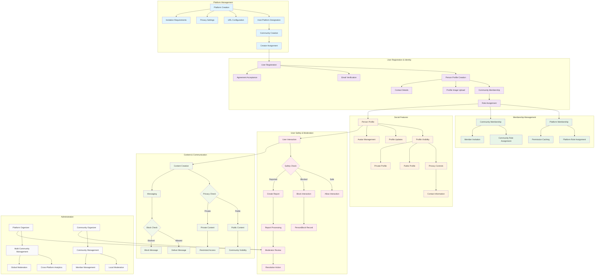

**Diagram Files:**
- 📊 [Mermaid Source](../../diagrams/source/community_social_system_flow.mmd) - Editable source
- 🖼️ [PNG Export](../../diagrams/exports/png/community_social_system_flow.png) - High-resolution image
- 🎯 [SVG Export](../../diagrams/exports/svg/community_social_system_flow.svg) - Vector graphics

## What's Implemented

### Core Social Infrastructure
- **Multi-tenant Platform Architecture**: Platform → Community → Person hierarchy with database tables
- **Person Profile System**: Basic person profiles with identifier, name, and privacy settings
- **Membership System**: Role-based community and platform memberships with database relationships
- **Basic Privacy Controls**: Public/private privacy enum implemented on models

### User Safety Features (Basic Implementation)
- **Person Blocking System**: Users can create blocks to prevent interactions (PersonBlock model)
- **Content Reporting System**: Basic reporting with reason field (Report model)  
- **Platform Manager Protection**: Cannot block users with platform management permissions
- **Policy-Based Authorization**: Pundit policies for blocking and reporting actions

### Authentication & Authorization  
- **Devise Integration**: User authentication with person profile linkage
- **Role-Based Access Control**: Permission system with cached role lookups
- **Policy Framework**: Pundit policies for authorization checks
- **Session Management**: Basic session security with CSRF protection

## What's Not Implemented Yet

### Essential Missing Features
- **Community Membership UI**: No interface for joining/leaving communities
- **Block Management Interface**: No UI for managing blocked users list
- **Report Review System**: No admin interface for reviewing reports
- **Moderation Tools**: No content removal or user suspension capabilities
- **Privacy Settings UI**: No interface for users to configure privacy settings

### Advanced Social Features (Not Started)
- **Friend/Follow System**: Social connections and relationship management
- **Activity Feeds**: User activity streams and social updates  
- **Social Media Integration**: External platform connections
- **Rich Notifications**: Comprehensive notification system with preferences
- **Social Groups**: Sub-communities and interest-based groups
- **Content Comments**: User commenting system on posts/pages
- **Profile Social Connections**: Detailed social relationship tracking

### Trust & Safety (Not Started)
- **Trust Score System**: Algorithmic user reputation tracking
- **Community Badges**: Achievement and recognition system
- **AI Content Moderation**: Automated inappropriate content detection
- **Appeals Process**: User appeals for moderation actions
- **Bulk Moderation**: Mass user and content management
- **Community Guidelines**: Platform-specific community rules

### Content & Communication (Limited)
- **Rich Content Creation**: Posts and pages exist but limited social features
- **Real-time Communication**: Conversations exist but basic implementation
- **Content Privacy**: Privacy controls exist but not fully integrated
- **Content Moderation**: No systematic content review process

## Core Models & Associations

### Platform Model
- **Purpose**: Multi-tenant platform hosting multiple communities
- **Location**: `app/models/better_together/platform.rb`
- **Key Features**:
  - Host platform designation with unique constraints
  - Invitation requirements and community privacy controls
  - Time zone and localization settings
  - URL-based routing and domain management
  - Custom CSS and branding configuration

```ruby
class Platform < ApplicationRecord
  include PlatformHost, Identifier, Joinable, Privacy
  
  has_community
  joinable joinable_type: 'platform', member_type: 'person'
  
  has_many :invitations, class_name: 'PlatformInvitation'
  store_attributes :settings do
    requires_invitation Boolean, default: false
  end
  
  validates :url, presence: true, uniqueness: true
  has_one_attached :profile_image, :cover_image
end
```

### Community Model
- **Purpose**: Individual communities within platforms
- **Location**: `app/models/better_together/community.rb`
- **Key Features**:
  - Creator ownership and community management
  - Host community designation for primary community
  - Event hosting with calendar integration
  - Rich media attachments (profile image, cover image, logo)
  - Multi-language content support with Action Text

```ruby
class Community < ApplicationRecord
  include Contactable, HostsEvents, Identifier, Joinable, Privacy
  
  belongs_to :creator, class_name: 'Person', optional: true
  has_many :calendars, dependent: :destroy
  joinable joinable_type: 'community', member_type: 'person'
  
  translates :name, type: :string
  translates :description, backend: :action_text
  has_one_attached :profile_image, :cover_image, :logo
  
  validates :name, presence: true
end
```

### Person Model
- **Purpose**: Individual user profiles and social identity
- **Location**: `app/models/better_together/person.rb`
- **Key Features**:
  - User account integration through identification system
  - Social connections (conversations, blocking, reporting)
  - Rich profile with contact details and preferences
  - Multi-community membership with role-based permissions
  - Notification preferences and privacy settings

```ruby
class Person < ApplicationRecord
  include Author, Contactable, FriendlySlug, Member, Privacy
  
  # Social connections
  has_many :conversation_participants, dependent: :destroy
  has_many :conversations, through: :conversation_participants
  
  # Safety mechanisms
  has_many :person_blocks, foreign_key: :blocker_id, dependent: :destroy
  has_many :blocked_people, through: :person_blocks, source: :blocked
  has_many :reports_made, foreign_key: :reporter_id, dependent: :destroy
  has_many :reports_received, as: :reportable, dependent: :destroy
  
  # Membership system
  member member_type: 'person', joinable_type: 'community'
  member member_type: 'person', joinable_type: 'platform'
  
  # User preferences
  store_attributes :preferences do
    locale String, default: I18n.default_locale.to_s
    time_zone String
  end
  
  store_attributes :notification_preferences do
    notify_by_email Boolean, default: true
    show_conversation_details Boolean, default: false
  end
end
```

### PersonBlock Model
- **Purpose**: User blocking system for preventing unwanted interactions
- **Location**: `app/models/better_together/person_block.rb`
- **Key Features**:
  - Bidirectional blocker/blocked relationship
  - Platform manager protection (cannot block platform managers)
  - Self-blocking prevention
  - Unique constraint to prevent duplicate blocks

```ruby
class PersonBlock < ApplicationRecord
  belongs_to :blocker, class_name: 'Person'
  belongs_to :blocked, class_name: 'Person'
  
  validates :blocked_id, uniqueness: { scope: :blocker_id }
  validate :not_self, :blocked_not_platform_manager
  
  private
  
  def blocked_not_platform_manager
    return unless blocked&.permitted_to?('manage_platform')
    errors.add(:blocked, I18n.t('errors.person_block.cannot_block_manager'))
  end
end
```

### Report Model  
- **Purpose**: Content and user reporting system for community safety
- **Location**: `app/models/better_together/report.rb`
- **Key Features**:
  - Polymorphic reportable association (any content type)
  - Reporter tracking and reason documentation
  - Integration with moderation workflows
  - Audit trail for safety investigations

```ruby
class Report < ApplicationRecord
  belongs_to :reporter, class_name: 'Person'
  belongs_to :reportable, polymorphic: true
  
  validates :reason, presence: true
end
```

### Membership Models
- **PersonCommunityMembership**: Joins people to communities with roles
- **PersonPlatformMembership**: Joins people to platforms with roles  
- **Key Features**:
  - Role-based permission assignment
  - Unique membership constraints
  - Membership lifecycle management
  - Platform and community scope isolation

## Controllers & Authorization

### Community Management
- **CommunitiesController**: Basic CRUD operations for community management
  - Community listing with privacy scope filtering
  - Creator-based ownership and editing permissions  
  - Basic form handling (no rich media upload interface yet)
  - Turbo Stream integration for form updates

### Person Blocking System  
- **PersonBlocksController**: Basic user blocking functionality
  - Block creation with Pundit policy authorization
  - Blocked user listing (index method)
  - Block removal (destroy method)
  - **Missing**: No UI implemented for block management

```ruby
class PersonBlocksController < ApplicationController
  def create
    @person_block = current_person.person_blocks.new(person_block_params)
    authorize @person_block
    
    if @person_block.save
      redirect_to blocks_path, notice: t('flash.person_block.blocked')
    else
      redirect_to blocks_path, alert: @person_block.errors.full_messages.to_sentence
    end
  end
end
```

### Content Reporting System
- **ReportsController**: Basic content and user reporting
  - Report creation with reason validation
  - Polymorphic reportable content support
  - Authorization preventing self-reporting
  - **Missing**: Admin review interface not implemented

### Membership Management
- **PersonCommunityMembershipsController**: Community membership CRUD
  - Basic membership creation and deletion
  - Turbo Stream integration for member list updates
  - **Missing**: Role assignment interface not implemented
  - **Missing**: Membership approval workflow not implemented

## Authorization & Privacy

### Policy Framework
All social interactions are governed by comprehensive Pundit policies:

**PersonBlockPolicy**: Controls user blocking permissions
- Only users can block other users (never themselves)
- Platform managers cannot be blocked
- Users can only manage their own blocks

**ReportPolicy**: Controls content reporting permissions  
- Authenticated users can report content/users
- Users cannot report themselves
- All reports require documented reasons

**CommunityPolicy**: Controls community access and management
- Public communities visible to all users
- Private communities require membership
- Creator permissions for community management

### Privacy Controls
The system implements granular privacy controls:

**Profile Privacy**: User-controlled visibility of personal information
**Content Privacy**: Public/private settings for all user-generated content
**Contact Privacy**: Granular controls for addresses, phone numbers, emails
**Platform Privacy**: Community-level visibility controls
**Activity Privacy**: User control over activity visibility and tracking

## User Interface Components

### Basic Community Features
- **Community Listing**: Basic community index page (implemented)
- **Community Profiles**: Basic community show pages (implemented)
- **Community Forms**: Create/edit community forms (implemented)

### Missing UI Components (Not Implemented)
- **Block Management Interface**: No UI for viewing/managing blocked users
- **Report Forms**: No contextual reporting forms for content and users  
- **Privacy Settings Dashboard**: No interface for privacy controls
- **Membership Management**: No UI for joining/leaving communities
- **Member Directories**: No community member listing interfaces
- **Profile Management**: Limited profile editing capabilities
- **Social Navigation**: No social relationship indicators or navigation

## Technical Implementation

### Database Schema
The community system uses a hierarchical multi-tenant architecture:

**Platform → Community → Person Structure**:
```sql
-- Core entities
better_together_platforms (host platform, settings, privacy)
better_together_communities (within platforms, creator-owned)  
better_together_people (cross-community profiles)

-- Safety mechanisms
better_together_person_blocks (blocker_id, blocked_id, timestamps)
better_together_reports (reporter_id, reportable polymorphic, reason)

-- Membership system  
better_together_person_community_memberships (member, joinable, role)
better_together_person_platform_memberships (member, joinable, role)
```

**Key Relationships**:
- Platforms can have multiple communities (1:many)
- People can be members of multiple communities and platforms (many:many through memberships)
- Blocking is bidirectional with unique constraints
- Reports are polymorphic, supporting any content type

### Privacy Implementation
Privacy controls are implemented through the `Privacy` concern:
- **Enum-based Privacy**: `public` and `private` privacy levels
- **Scoped Queries**: Privacy-filtered database queries
- **Policy Integration**: Privacy-aware authorization policies
- **UI Controls**: Form helpers for privacy selection

### Caching Strategy
The system implements comprehensive caching for performance:
- **Permission Caching**: 12-hour cache for role and permission checks
- **Member Associations**: Cached membership lookups and role associations
- **Privacy Scopes**: Cached privacy-filtered query results
- **Profile Information**: Cached profile data with cache invalidation

## Integration Points

### User Authentication
- **Devise Integration**: Full integration with Devise authentication system
- **Multi-factor Authentication**: Support for enhanced authentication methods
- **Session Management**: Secure session handling with CSRF protection
- **Account Recovery**: Secure password reset and account recovery workflows

### Notification System
- **Noticed Integration**: Rich notification system for social interactions
- **Email Notifications**: Configurable email notification preferences
- **Real-time Updates**: Action Cable integration for live updates
- **Notification Privacy**: User-controlled notification visibility

### Content Management
- **Rich Text Support**: Action Text integration for formatted content
- **File Attachments**: Active Storage integration for media uploads
- **Content Versioning**: Version tracking for content changes
- **Content Privacy**: Granular content visibility controls

### External Services
- **Email Delivery**: Action Mailer with SMTP/SendGrid integration
- **File Storage**: S3/MinIO integration for scalable file storage
- **Background Jobs**: Sidekiq integration for async processing
- **Analytics**: Optional analytics integration for community insights

## Anti-Spam & Content Moderation

### Basic Protection (Limited Implementation)
- **Rate Limiting**: Rack::Attack protection against abuse (basic configuration)
- **Input Validation**: Rails built-in input sanitization and validation
- **Policy Authorization**: Pundit-based authorization checks
- **Database Constraints**: Unique constraints preventing duplicate blocks/reports

### Missing Moderation Features (Not Implemented)
- **Spam Detection**: No Akismet or automated spam filtering
- **Content Review Tools**: No administrative interfaces for reviewing reports
- **User Suspension**: No tools for blocking or suspending user accounts
- **Content Removal**: No systematic content moderation or removal tools
- **Moderation Queue**: No workflow for processing reported content
- **Appeal Process**: No system for handling user appeals

### Basic Trust Controls
- **Role-Based Permissions**: Community-specific role and permission management (basic)
- **Platform Manager Protection**: Cannot block users with elevated permissions
- **Self-Action Prevention**: Cannot block yourself or report your own content

## Testing Strategy

### Model Testing
```ruby
RSpec.describe PersonBlock do
  it 'prevents self-blocking'
  it 'prevents blocking platform managers'
  it 'enforces unique blocker-blocked pairs'
  it 'allows valid blocking relationships'
end

RSpec.describe Community do
  it 'validates required attributes'
  it 'handles privacy settings correctly'
  it 'manages member relationships'
  it 'integrates with authorization policies'
end
```

### Controller Testing  
```ruby
RSpec.describe PersonBlocksController do
  context 'when creating blocks' do
    it 'authorizes block creation'
    it 'prevents unauthorized blocking'
    it 'handles blocking errors gracefully'
  end
end
```

### Integration Testing
```ruby
RSpec.describe 'Community Management' do
  it 'allows community creation'
  it 'enforces privacy controls'
  it 'manages memberships correctly'
  it 'integrates safety features'
end
```

### Policy Testing
```ruby
RSpec.describe PersonBlockPolicy do
  it 'allows users to block others'
  it 'prevents blocking platform managers'  
  it 'prevents self-blocking'
  it 'allows block removal by blocker'
end
```

## Configuration & Deployment

### Environment Variables
```bash
# Platform configuration
PLATFORM_PRIVACY=public
REQUIRES_INVITATION=false
PLATFORM_TIME_ZONE=UTC

# Safety configuration  
ENABLE_CONTENT_REPORTING=true
AUTO_BLOCK_THRESHOLD=10
SPAM_DETECTION=true

# Privacy defaults
DEFAULT_PROFILE_PRIVACY=private
DEFAULT_CONTENT_PRIVACY=private
```

### Database Configuration
```ruby
# Migration considerations
# - Ensure proper indexing for performance
# - Add constraints for data integrity
# - Consider partitioning for large datasets

class CreatePersonBlocks < ActiveRecord::Migration[7.1]
  def change
    create_table :better_together_person_blocks, id: :uuid do |t|
      t.references :blocker, null: false, type: :uuid
      t.references :blocked, null: false, type: :uuid
      t.timestamps
      
      t.index [:blocker_id, :blocked_id], unique: true, name: 'unique_person_blocks'
    end
  end
end
```

### Performance Considerations
- **Membership Caching**: Cache expensive membership queries
- **Privacy Filtering**: Optimize privacy-aware database queries
- **Bulk Operations**: Efficient bulk membership and permission operations
- **Search Indexing**: Elasticsearch integration for community and user search

## Development Guidelines

### Adding New Social Features
1. **Model Design**: Follow existing association patterns and privacy controls
2. **Authorization**: Implement comprehensive Pundit policies
3. **UI Integration**: Use existing UI patterns and Turbo Stream updates
4. **Testing**: Comprehensive test coverage for all social interactions
5. **Privacy**: Default-private approach with explicit public controls

### Extending Safety Features
1. **Report Types**: Add new reportable content types with polymorphic associations
2. **Moderation Tools**: Build on existing policy framework for new moderation features
3. **Privacy Controls**: Extend privacy concern for new privacy-sensitive features
4. **Notification Integration**: Use Noticed for safety-related notifications

### Performance Optimization
1. **Query Optimization**: Use includes and joins for association-heavy operations
2. **Caching Strategy**: Implement appropriate caching for expensive operations
3. **Background Processing**: Use Sidekiq for time-intensive safety operations
4. **Database Indexing**: Proper indexing for frequently queried associations

## Security Considerations

### Data Protection
- **Encryption at Rest**: Sensitive personal data encrypted using Active Record encryption
- **Secure Communications**: HTTPS enforcement for all platform communications
- **Session Security**: Secure session management with proper timeout controls
- **CSRF Protection**: Comprehensive CSRF token validation

### User Safety
- **Block Enforcement**: Blocked users cannot interact across the platform
- **Report Processing**: Secure handling of sensitive report information
- **Privacy Enforcement**: Strict enforcement of user privacy settings
- **Account Security**: Multi-factor authentication and secure password requirements

### Platform Security
- **Rate Limiting**: Protection against abuse and spam
- **Input Validation**: Comprehensive input sanitization and validation
- **SQL Injection Prevention**: Parameterized queries and safe query building
- **XSS Protection**: Output encoding and Content Security Policy enforcement

## Future Roadmap

### Short-term Enhancements
- **Enhanced Blocking**: Temporary blocks with automatic expiration
- **Advanced Reporting**: Category-based reporting with severity levels
- **Community Moderation**: Distributed moderation with community moderators
- **Privacy Dashboard**: Comprehensive privacy control interface

### Long-term Vision
- **AI Moderation**: Machine learning-powered content and behavior analysis
- **Reputation System**: Algorithmic trust scoring and reputation tracking
- **Federation Support**: ActivityPub integration for decentralized social networking
- **Advanced Analytics**: Community health metrics and engagement analytics

## Troubleshooting

### Common Issues
- **Block Not Working**: Check policy authorization and database constraints
- **Privacy Leaks**: Verify privacy scopes in controllers and views
- **Performance Issues**: Review N+1 queries and implement proper caching
- **Authorization Errors**: Check Pundit policies and user permissions

### Debugging Tools
- **Policy Testing**: Use Pundit test helpers for policy debugging
- **Query Analysis**: Rails query analysis tools for performance debugging
- **Log Analysis**: Structured logging for tracking user interactions
- **Error Monitoring**: Exception tracking for community safety issues

---

This community and social system provides a comprehensive foundation for safe, privacy-conscious social interactions within multi-tenant community platforms, with robust user safety mechanisms, content moderation tools, and granular privacy controls.


# Content Management System

This guide explains Pages, Content Blocks, visibility (privacy + published_at), and caching.

## Database Schema

The Content Management domain centers around Pages and a flexible block system. Tables use Better Together migration helpers and follow UUID primary keys with optimistic locking.

- better_together_pages
  - id (uuid), identifier, privacy, slug, published_at, layout, sidebar_nav_id
  - creator_id, community_id, protected, type (when extended)
  - Translated: title (string), content (ActionText)
  - Index highlights: `by_better_together_pages_privacy` (privacy), slug unique
- better_together_content_blocks
  - id (uuid), type (STI: Hero, RichText, Image, Html, Css, Template), identifier
  - creator_id, privacy, visible (bool)
  - JSONB settings: accessibility_attributes, content_settings, css_settings, data_attributes, html_attributes, layout_settings, media_settings, content_data, content_area_settings
- better_together_content_page_blocks
  - id (uuid), page_id, block_id, position (ordering)
- better_together_content_platform_blocks
  - id (uuid), platform_id, block_id (for global/host content)

### ER Diagram

```mermaid
erDiagram
  BETTER_TOGETHER_PAGES ||--o{ BETTER_TOGETHER_CONTENT_PAGE_BLOCKS : has
  BETTER_TOGETHER_CONTENT_BLOCKS ||--o{ BETTER_TOGE
  THER_CONTENT_PAGE_BLOCKS : appears_in
  BETTER_TOGETHER_PLATFORMS ||--o{ BETTER_TOGE
  THER_CONTENT_PLATFORM_BLOCKS : has

  BETTER_TOGETHER_PAGES {
    uuid id PK
    string identifier
    string privacy
    string slug
    datetime published_at
    string layout
    uuid sidebar_nav_id FK
    uuid creator_id FK
    uuid community_id FK
    boolean protected
    integer lock_version
    datetime created_at
    datetime updated_at
  }

  BETTER_TOGETHER_CONTENT_BLOCKS {
    uuid id PK
    string type
    string identifier
    uuid creator_id FK
    string privacy
    boolean visible
    jsonb content_data
    jsonb css_settings
    jsonb media_settings
    jsonb layout_settings
    jsonb accessibility_attributes
    jsonb data_attributes
    jsonb html_attributes
    jsonb content_settings
    jsonb content_area_settings
    integer lock_version
    datetime created_at
    datetime updated_at
  }

  BETTER_TOGETHER_CONTENT_PAGE_BLOCKS {
    uuid id PK
    uuid page_id FK
    uuid block_id FK
    integer position
    integer lock_version
    datetime created_at
    datetime updated_at
  }

  BETTER_TOGETHER_CONTENT_PLATFORM_BLOCKS {
    uuid id PK
    uuid platform_id FK
    uuid block_id FK
    integer lock_version
    datetime created_at
    datetime updated_at
  }
```

**Diagram Files:**
- 📊 [Mermaid Source](../../diagrams/source/content_schema_erd.mmd)
- 🖼️ [PNG Export](../../diagrams/exports/png/content_schema_erd.png)
- 🎯 [SVG Export](../../diagrams/exports/svg/content_schema_erd.svg)

## Process Flow Diagram

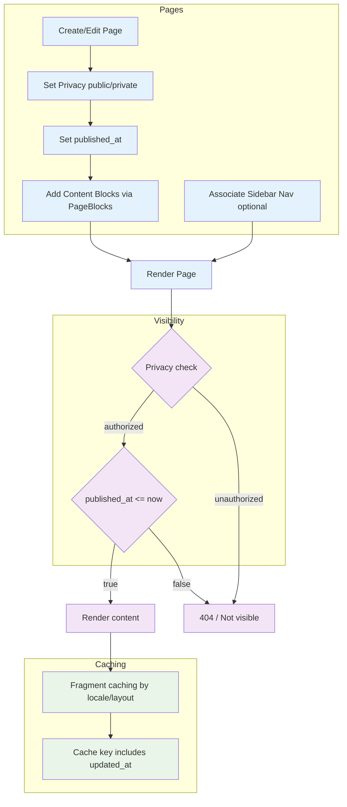

**Diagram Files:**
- 📊 [Mermaid Source](../../diagrams/source/content_flow.mmd) - Editable source
- 🖼️ [PNG Export](../../diagrams/exports/png/content_flow.png) - High-resolution image
- 🎯 [SVG Export](../../diagrams/exports/svg/content_flow.svg) - Vector graphics

## Publish Timeline

This timeline shows when publish-state transitions schedule render visibility.

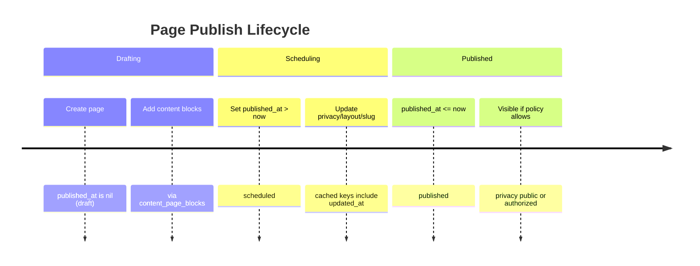

**Diagram Files:**
- 📊 [Mermaid Source](../../diagrams/source/content_publish_timeline.mmd)
- 🖼️ [PNG Export](../../diagrams/exports/png/content_publish_timeline.png)
- 🎯 [SVG Export](../../diagrams/exports/svg/content_publish_timeline.svg)

## Pages
- Purpose: authored content with rich text and media blocks.
- Key traits: Authorable, Categorizable, Identifier, Privacy, Publishable, Searchable, TrackedActivity, Metrics::Viewable.
- Translations: `title` (string) and `content` (ActionText).
- Layouts: `layouts/better_together/page`, `page_with_nav`, `full_width_page`.
- Blocks: has_many `page_blocks` (ordered join) → `blocks` of multiple types: Hero, RichText, Image, Html, Css, Template.
- Sidebar nav: `belongs_to :sidebar_nav, class_name: BetterTogether::NavigationArea, optional: true`.
- Slug: derived from title; slashes allowed (parameterize disabled).

## Visibility Criteria
- Privacy: `privacy` enum (public/private). Policy scopes enforce access (e.g., private requires permission/auth).
- Publishing:
  - `published_at` controls status via Publishable concern:
    - draft: published_at nil
    - scheduled: published_at > now
    - published: published_at <= now
  - `published?` returns true only when `published_at` present and in the past.
- Controller show flow: policy scopes resource; `render_not_found` for missing/unviewable; sets layout and loads blocks.

## Blocks
- Types under `BetterTogether::Content`:
  - Hero: optional page hero with background image.
  - RichText: ActionText content (localized) with `indexed_localized_content` for search.
  - Image / Html / Css / Template: ancillary content types for sections and decoration.
- Ordering: `page_blocks.positioned` controls rendering order.

## Caching
- Fragment caching around blocks in views: `cache block.cache_key_with_version` for Hero/RichText/Html/Image.
- Page content helper: `Rails.cache.fetch(['page_content', page.cache_key_with_version], expires_in: 1.minute) { ... }` for block rendering composition.
- CSS block cached with `host_platform.cache_key_with_version` in layouts.

## Search Indexing
- Pages index title/slug (localized) and rich text block contents via `as_indexed_json` (Elasticsearch).

## Presentation Helpers

### Privacy Display
The system provides standardized helpers for displaying privacy information consistently across all content types:

- **`privacy_display_value(entity)`**: Returns the translated privacy display value for any entity with a privacy attribute
  - Automatically looks up translations from `attributes.privacy_list.*` 
  - Falls back to humanized values if translation is missing
  - Supports all privacy levels: `public`, `private`, `community`, `unlisted`
  - Usage: `<%= privacy_display_value(@page) %>` instead of `@page.privacy.humanize`

- **`privacy_badge(entity)`**: Renders a Bootstrap badge with appropriate styling for privacy levels
  - Uses `privacy_display_value` internally for consistent text
  - Maps privacy levels to appropriate Bootstrap styles (success/secondary/info)
  - Usage: `<%= privacy_badge(@page) %>` in lists and detail views

### Translation Structure
Privacy translations are stored in `attributes.privacy_list.*` for all supported locales:
```yaml
# config/locales/en.yml
attributes:
  privacy_list:
    public: Public
    private: Private
    community: Community
    unlisted: Unlisted
```

## Block Types & Examples

### Hero
- Purpose: prominent header section with optional overlay and CTA.
- Translated: `heading`, `cta_text`, and `content` (ActionText).
- CTA: `content_data.cta_url` and `css_settings.cta_button_style` (Bootstrap style). Allowed styles include `btn-primary`, `btn-outline-primary`, `btn-secondary`, etc.
- Overlay: `css_settings.overlay_color` (e.g., `#000`), `css_settings.overlay_opacity` (0.0–1.0).
- Styling: `css_settings.css_classes`, `css_settings.container_class`, `css_settings.heading_color`, `css_settings.paragraph_color`.
- Example (attributes):
  - heading: "Welcome"
  - cta_text: "Get Started"
  - content: intro paragraph
  - content_data.cta_url: "/get-started"
  - css_settings.cta_button_style: "btn-primary"
  - css_settings.overlay_color: "#000", css_settings.overlay_opacity: 0.25

### RichText
- Purpose: WYSIWYG sections using ActionText.
- Translated: `content`.
- Styling: `css_settings.css_classes` (e.g., `my-5`).
- Indexed into search via `indexed_localized_content`.

### Image
- Purpose: single image with optional caption/alt/attribution.
- Attributes: `media` (ActiveStorage), translated `alt_text`, `caption`, `attribution`; `media_settings.attribution_url`.
- Validations: Content type (jpeg/png/gif/webp/svg) and size <100MB.

### Html
- Purpose: raw HTML string.
- Attributes: `content_data.html_content`.
- Use sparingly; prefer RichText for editor support.

### Css
- Purpose: inject CSS for specific sections.
- Attributes: translated `content` (string), `css_settings.general_styling_enabled`.
- Use for small, page‑scoped style overrides. Prefer platform CSS block for global theme.

### Template
- Purpose: render a prebuilt partial by path.
- Attributes: `content_data.template_path` from allowed list (e.g., `better_together/content/blocks/template/default`, `.../host_community_contact_details`).
- Use for reusable componentized content blocks.


# Conversations & Messaging System

This document explains the real-time messaging system, conversation management, notification delivery, and user interaction patterns within the Better Together Community Engine.

## Process Flow Diagram

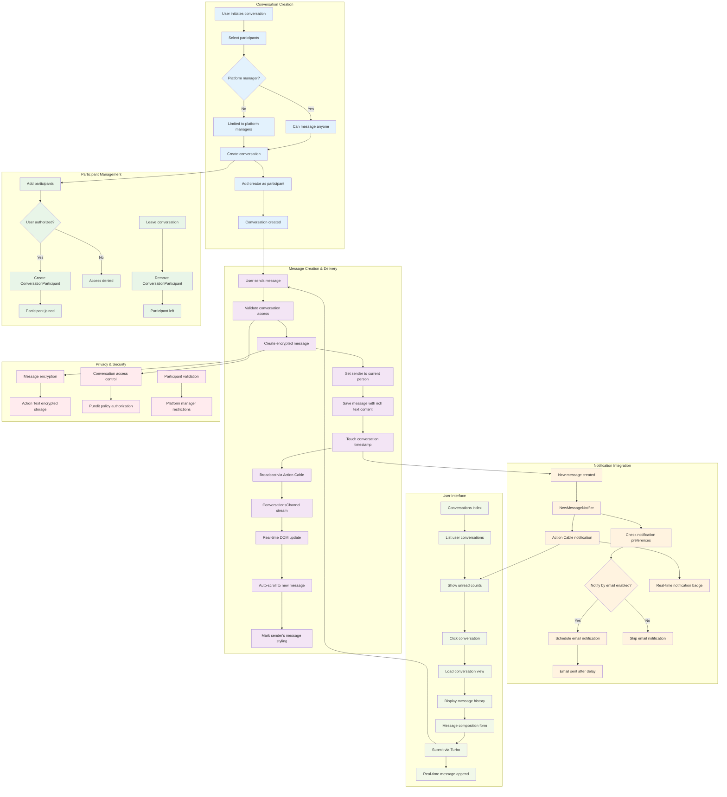

**Diagram Files:**
- 📊 [Mermaid Source](../../diagrams/source/conversations_messaging_flow.mmd) - Editable source
- 🖼️ [PNG Export](../../diagrams/exports/png/conversations_messaging_flow.png) - High-resolution image
- 🎯 [SVG Export](../../diagrams/exports/svg/conversations_messaging_flow.svg) - Vector graphics

## What's Implemented

- **Conversations**: Multi-participant encrypted conversation threads with titles and metadata
- **Messages**: Rich-text encrypted messages with Action Text support and real-time delivery
- **Participants**: Flexible participant management with join/leave capabilities  
- **Real-time Messaging**: WebSocket-based instant message delivery via Action Cable
- **Notification System**: Comprehensive in-app and email notifications with deduplication
- **Authorization**: Policy-based access control with platform manager restrictions
- **Read Status Tracking**: Automatic notification marking when viewing conversations
- **Email Integration**: Delayed email notifications with user preferences and anti-spam
- **Internationalization**: Full i18n support across all messaging components

## What's Not Implemented Yet

- **Message Reactions**: Emoji reactions and message status indicators
- **File Attachments**: Direct file sharing within conversations (uses Action Text attachments)
- **Message Search**: Full-text search across conversation history
- **Conversation Archiving**: Archive/restore functionality for conversations
- **Message Threading**: Reply-to-message threading within conversations
- **Typing Indicators**: Real-time typing status display
- **Message Editing**: Edit/delete message capabilities after sending
- **Push Notifications**: Mobile push notifications for offline users
- **Conversation Templates**: Pre-defined message templates or auto-replies
- **Advanced Moderation**: Message filtering, reporting, and moderation tools

## Core Models & Associations

### Conversation Model
- **Purpose**: Groups messages and manages participants for multi-person discussions
- **Location**: `app/models/better_together/conversation.rb`
- **Key Features**:
  - Encrypted title storage with deterministic encryption
  - Creator tracking (belongs to Person)
  - Participant validation (at least one participant required)
  - Touch associations for last activity tracking

```ruby
class Conversation < ApplicationRecord
  encrypts :title, deterministic: true
  belongs_to :creator, class_name: 'BetterTogether::Person'
  has_many :messages, dependent: :destroy
  has_many :conversation_participants, dependent: :destroy
  has_many :participants, through: :conversation_participants, source: :person
end
```

### ConversationParticipant Model  
- **Purpose**: Join model connecting people to conversations
- **Location**: `app/models/better_together/conversation_participant.rb`
- **Key Features**:
  - Simple join table between conversations and people
  - Enables flexible participant management
  - Supports leave/join functionality

```ruby
class ConversationParticipant < ApplicationRecord
  belongs_to :conversation
  belongs_to :person
end
```

### Message Model
- **Purpose**: Individual messages within conversations with rich text support
- **Location**: `app/models/better_together/message.rb`
- **Key Features**:
  - Encrypted rich text content via Action Text
  - Real-time broadcasting after creation
  - Touch parent conversation for activity updates
  - Sender association to Person model

```ruby
class Message < ApplicationRecord
  belongs_to :conversation, touch: true
  belongs_to :sender, class_name: 'BetterTogether::Person'
  has_rich_text :content, encrypted: true
  validates :content, presence: true
  after_create_commit -> { broadcast_append_later_to conversation, target: 'conversation_messages' }
end
```

## Controllers & Authorization

### ConversationsController
- **Location**: `app/controllers/better_together/conversations_controller.rb`
- **Key Features**:
  - Full CRUD operations with Turbo Stream support
  - Participant management and conversation updates
  - Authorization via Pundit policies
  - Notification read marking integration
  - Real-time updates via Turbo Streams

#### Key Actions:
- `index`: List user's conversations with participants and last messages
- `show`: Display conversation with all messages and mark notifications as read
- `create`: Create new conversation and add creator as participant
- `update`: Update conversation details and participant list
- `leave_conversation`: Remove current user from conversation participants

### MessagesController
- **Location**: `app/controllers/better_together/messages_controller.rb`
- **Key Features**:
  - Message creation with sender assignment
  - Participant notification triggering
  - Real-time broadcasting via Action Cable
  - Turbo Stream response support

#### Message Creation Flow:
1. Validate conversation access
2. Create message with current person as sender
3. Trigger notifications to all participants except sender
4. Broadcast to conversation channel
5. Return Turbo Stream response for real-time UI update

## Real-time Communication

### Action Cable Channels

#### ConversationsChannel
- **Location**: `app/channels/better_together/conversations_channel.rb`
- **Purpose**: Real-time message delivery within conversations
- **Features**:
  - Stream messages to conversation participants
  - Automatic subscription management
  - Message broadcasting integration

#### NotificationsChannel  
- **Location**: `app/channels/better_together/notifications_channel.rb`
- **Purpose**: Real-time notification delivery system-wide
- **Features**:
  - Stream to individual persons
  - Unread count updates
  - Cross-system notification delivery

### JavaScript Integration
- **Conversation Messages Controller**: `app/javascript/controllers/better_together/conversation_messages_controller.js`
  - Auto-scroll to newest messages
  - Mark sender's own messages with styling
  - DOM mutation observation for real-time updates

## Notification System

### NewMessageNotifier
- **Location**: `app/notifiers/better_together/new_message_notifier.rb`
- **Purpose**: Notify conversation participants about new messages
- **Delivery Channels**:
  - **Action Cable**: Immediate real-time notification
  - **Email**: Delayed 15 minutes with deduplication logic

#### Key Features:
- **Email Deduplication**: One email per unread conversation per recipient
- **User Preferences**: Respects `notify_by_email` settings
- **Localized Content**: Message titles and bodies in recipient's preferred language
- **Unread Counting**: Includes current unread notification count in real-time delivery

#### Notification Logic:
```ruby
def should_send_email?
  unread_notifications = recipient.notifications.where(
    event_id: BetterTogether::NewMessageNotifier.where(params: { conversation_id: conversation.id }).select(:id),
    read_at: nil
  ).order(created_at: :desc)
  
  unread_notifications.any? && message.id == unread_notifications.last.event.record_id
end
```

### Email Integration
- **ConversationMailer**: `app/mailers/better_together/conversation_mailer.rb`
- **Template**: `app/views/better_together/conversation_mailer/new_message_notification.html.erb`
- **Features**:
  - Respects user privacy preferences for sender details
  - Includes direct links to conversations with message anchors
  - Platform branding and localized signatures
  - Conditional sender information based on `show_conversation_details` preference

## Authorization & Privacy

### Access Control
- **Platform Managers**: Can message anyone
- **Regular Users**: Can only message platform managers (configurable restriction)
- **Privacy Levels**: Conversation visibility based on participant membership
- **Policy Integration**: Full Pundit policy enforcement across all actions

### ConversationPolicy
Key authorization checks:
- `show?`: Participant membership or platform manager role
- `update?`: Creator or authorized participant
- `leave_conversation?`: Current participant with multiple participants remaining
- `create?`: Based on platform permissions and participant availability

## User Interface Components

### Conversation Layout
- **Sidebar Navigation**: Active conversation list with participant previews
- **Main Content Area**: Message thread with rich text rendering
- **Message Composer**: Trix editor with real-time submission
- **Participant Management**: Add/remove participants interface
- **Conversation Options**: Edit title, leave conversation, settings

### Message Display
- **Message Bubbles**: Styled differently for sender vs. recipients
- **Timestamp Display**: Localized time formatting
- **Sender Attribution**: Name and avatar display
- **Rich Content**: Full Action Text rendering with attachments
- **Real-time Updates**: Smooth DOM insertion without page refresh

### Responsive Design
- **Mobile Optimized**: Touch-friendly interface elements
- **Bootstrap Integration**: Consistent styling with platform theme
- **Accessibility**: ARIA labels, keyboard navigation, screen reader support

## Technical Implementation

### Encryption & Security
- **Message Encryption**: All message content encrypted at rest via Action Text
- **Title Encryption**: Conversation titles use deterministic encryption for searchability
- **CSRF Protection**: Full Rails CSRF token validation
- **Input Sanitization**: HTML content filtering via Action Text allow-lists

### Performance Optimization
- **Eager Loading**: Conversation queries include participants and messages with proper includes
- **Touch Associations**: Automatic timestamp updates for conversation activity
- **Query Optimization**: Efficient participant filtering and message ordering
- **Real-time Efficiency**: Targeted DOM updates via Turbo Streams

### Internationalization
- **Full i18n Coverage**: All user-facing strings translated across English, Spanish, French
- **Email Localization**: Notification emails rendered in recipient's preferred language
- **Time Zone Support**: Message timestamps displayed in user's local timezone
- **Locale-specific Formatting**: Date/time formatting respects cultural preferences

## Integration Points

### Person Model Integration
```ruby
# Person associations for messaging
has_many :conversation_participants, dependent: :destroy
has_many :conversations, through: :conversation_participants  
has_many :created_conversations, as: :creator, class_name: 'BetterTogether::Conversation'
has_many :messages, foreign_key: :sender_id, class_name: 'BetterTogether::Message'
```

### Notification Integration
- **NotificationReadable Concern**: Automatic read marking when viewing conversations
- **Unread Count Updates**: Real-time badge updates via Action Cable
- **Cross-system Integration**: Notifications work across all platform features

### Action Cable Integration
- **Turbo Stream Broadcasting**: Seamless real-time message delivery
- **Connection Management**: Automatic subscription handling
- **Error Recovery**: Graceful degradation when WebSocket unavailable

## Anti-Spam & Moderation

### Email Deduplication
- **One Email Per Conversation**: Prevents email flooding from active conversations
- **15-minute Delay**: Batches rapid messages into single email notifications
- **User Preference Respect**: Honors individual email notification settings
- **Read Status Integration**: Stops emails when notifications marked as read

### Content Filtering
- **Action Text Integration**: HTML content automatically sanitized
- **XSS Prevention**: Full Rails auto-escaping throughout templates
- **Input Validation**: Server-side validation on all message content
- **Policy Enforcement**: Authorization checks prevent unauthorized access

## Testing Strategy

### Model Testing
- **Factory Integration**: Comprehensive FactoryBot factories for all models
- **Association Testing**: Validates all model relationships and dependencies
- **Validation Testing**: Covers all business rules and constraints
- **Encryption Testing**: Verifies proper encryption/decryption behavior

### Controller Testing  
- **Authorization Testing**: Pundit policy enforcement verification
- **Response Format Testing**: HTML and Turbo Stream response validation
- **Real-time Feature Testing**: Action Cable integration testing
- **Error Handling Testing**: Graceful failure mode validation

### Integration Testing
- **Feature Specs**: Full user workflow testing with Capybara
- **Real-time Testing**: JavaScript-enabled conversation flow testing
- **Notification Testing**: End-to-end notification delivery verification
- **Cross-browser Testing**: Compatibility across different browsers and devices

## Configuration & Deployment

### Environment Variables
- **Action Cable**: WebSocket server configuration
- **Email Settings**: SMTP configuration for notification delivery
- **Encryption Keys**: Rails master key for encrypted content
- **Platform Settings**: Default messaging permissions and restrictions

### Database Considerations
- **Encryption Performance**: Deterministic encryption enables efficient querying
- **Index Strategy**: Optimized indexes for conversation and message queries
- **Migration Strategy**: Handles encrypted field additions and modifications
- **Backup Considerations**: Encrypted data backup and restoration procedures

## Development Guidelines

### Adding New Message Features
1. **Model Changes**: Add fields to Message model with proper encryption
2. **Controller Updates**: Update permitted parameters and authorization
3. **View Updates**: Add UI elements with proper internationalization
4. **Real-time Support**: Ensure Turbo Stream compatibility
5. **Notification Integration**: Add notification triggers if needed
6. **Testing**: Comprehensive test coverage for new functionality

### Extending Conversation Features
1. **Policy Updates**: Add new authorization rules to ConversationPolicy
2. **Association Changes**: Update model associations as needed
3. **UI Integration**: Add new interface elements to conversation layout
4. **Notification Updates**: Extend notification system for new features
5. **Documentation**: Update this document with new functionality

### Performance Considerations
- **Message History**: Consider pagination for conversations with many messages
- **Participant Limits**: Monitor performance with large participant counts
- **Real-time Scaling**: Plan for increased Action Cable connection loads
- **Search Integration**: Future full-text search implementation strategy

## Future Roadmap

### Short-term Enhancements
- **Message Reactions**: Emoji reactions with real-time updates
- **Typing Indicators**: Show when participants are composing messages
- **Message Search**: Full-text search across conversation history
- **File Attachments**: Direct file sharing within conversations

### Long-term Vision
- **Advanced Moderation**: AI-powered content filtering and moderation tools
- **Video/Audio**: Integration with WebRTC for video calling capabilities
- **Integration APIs**: Webhooks and APIs for third-party integrations


# Conversations and Messaging System Documentation

This directory contains comprehensive documentation for the Better Together Community Engine's conversations and messaging system.

## Documentation Files

### 1. conversations_messaging_system.md
Comprehensive technical documentation covering:
- **System Overview**: Architecture and feature summary
- **Models**: Conversation, ConversationParticipant, Message, and associations
- **Controllers**: ConversationsController and MessagesController with full CRUD operations
- **Real-time Features**: Action Cable channels for live messaging and notifications
- **Notification System**: NewMessageNotifier with email deduplication logic
- **Email Integration**: ConversationMailer with localized templates
- **Authorization**: Pundit policies and platform manager restrictions
- **Views & JavaScript**: Turbo Stream integration and Stimulus controllers
- **Internationalization**: Complete i18n support across all user-facing text

### 2. conversations_messaging_flow.mmd / conversations_messaging_flow.png
Visual process flow diagram illustrating:
- **Conversation Creation**: User flow with platform restrictions
- **Message Delivery**: From creation to real-time broadcasting
- **Notification System**: Both in-app and email notifications with deduplication
- **Read Status Management**: How messages are marked as read
- **Participant Management**: Adding/removing conversation participants
- **Authorization Flow**: Pundit policy enforcement
- **UI Updates**: Real-time Turbo Stream updates

## Key System Features

### Real-time Messaging
- **Action Cable Integration**: ConversationsChannel streams messages in real-time
- **Live UI Updates**: Messages appear instantly without page refreshes
- **Auto-scrolling**: New messages automatically scroll into view
- **Sender Styling**: Visual distinction for user's own messages

### Intelligent Notifications
- **Deduplication Logic**: Only sends one email per conversation until read
- **15-minute Delay**: Prevents email spam for rapid message exchanges
- **Multi-channel Delivery**: Browser notifications + email + in-app badges
- **Read Status Tracking**: Marks notifications as read when conversation is viewed

### Privacy & Security
- **Encrypted Storage**: Message content encrypted at rest using Active Record Encryption
- **Platform Restrictions**: Non-managers can only message platform managers
- **Authorization Policies**: Comprehensive Pundit policy enforcement
- **Participant Validation**: Strict controls on who can join conversations

### User Experience
- **Rich Text Support**: Full Trix editor integration for message composition
- **Responsive Design**: Bootstrap-based mobile-friendly interface
- **Accessibility**: WCAG AA compliance with proper ARIA labels and keyboard navigation
- **Internationalization**: Full i18n support in English, French, and Spanish

## Implementation Notes

The messaging system is built with Rails 7+ best practices:
- **Hotwire Integration**: Turbo Streams for seamless real-time updates
- **Stimulus Controllers**: JavaScript interactivity without jQuery
- **Background Jobs**: Sidekiq for email delivery and cleanup tasks
- **Database Optimization**: Proper indexing and N+1 query prevention
- **Test Coverage**: Comprehensive RSpec test suite with FactoryBot

## Getting Started

To understand the system:
1. Read `conversations_messaging_system.md` for technical details
2. Review `conversations_messaging_flow.png` for visual workflow
3. Explore the actual code in `app/models/better_together/conversation.rb` and related files
4. Check the test suite in `spec/models/better_together/` for usage examples

## Contributing

When modifying the messaging system:
- Update both documentation files when adding features
- Regenerate the PNG diagram using `bin/render_diagrams` 
- Follow the patterns established in the existing codebase
- Add comprehensive test coverage for all changes
- Ensure proper i18n support for any new user-facing text


# Events & Calendars

This document explains the Event model, how events are created and displayed, how visibility works, how calendars fit in, the comprehensive notification system for event reminders and updates, and the event hosting system.

See also: [Event Invitations & Attendance](./event_invitations_and_attendance.md) for invitation tokens, delivery, and RSVP lifecycle details.

## Database Schema

The Events & Calendars domain consists of five primary tables plus standard shared tables (translations, ActionText, etc.). All Better Together tables are created via `create_bt_table`, which adds `id: :uuid`, `lock_version`, and `timestamps` automatically.

- better_together_events
  - id (uuid), type (STI default: `BetterTogether::Event`), creator_id, identifier, privacy
  - starts_at, ends_at, duration_minutes, registration_url
  - Indexes: `bt_events_by_starts_at`, `bt_events_by_ends_at`, `by_better_together_events_privacy`
- better_together_event_attendances
  - id (uuid), event_id, person_id, status (string enum: interested, going)
  - Unique index: `by_event_and_person` on [event_id, person_id]
- better_together_event_hosts
  - id (uuid), event_id, host_id, host_type (polymorphic to Person/Community/etc.)
- better_together_calendars
  - id (uuid), community_id, creator_id, identifier, locale, privacy, protected
  - Translated: name, description (ActionText)
- better_together_calendar_entries
  - id (uuid), calendar_id, event_id, starts_at, ends_at, duration_minutes
  - Indexes: `bt_calendar_events_by_starts_at`, `bt_calendar_events_by_ends_at`, `by_calendar_and_event` on [calendar_id, event_id]

### ER Diagram

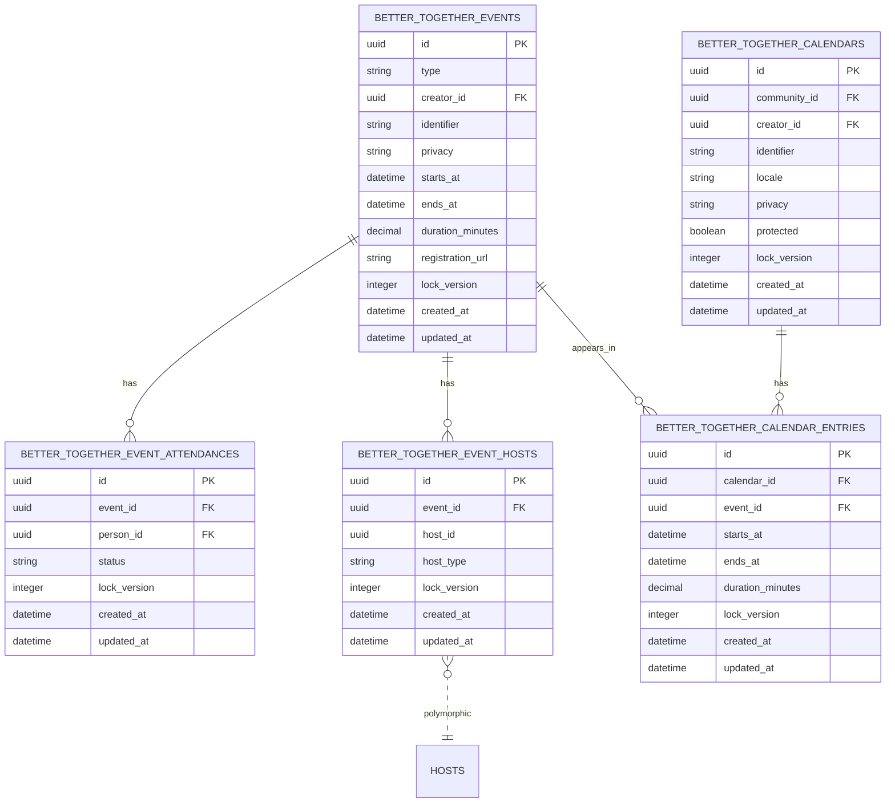

**Diagram Files:**
- 📊 [Mermaid Source](../../diagrams/source/events_schema_erd.mmd) - Editable source
- 🖼️ [PNG Export](../../diagrams/exports/png/events_schema_erd.png) - High-resolution image
- 🎯 [SVG Export](../../diagrams/exports/svg/events_schema_erd.svg) - Vector graphics

## Process Flow Diagram

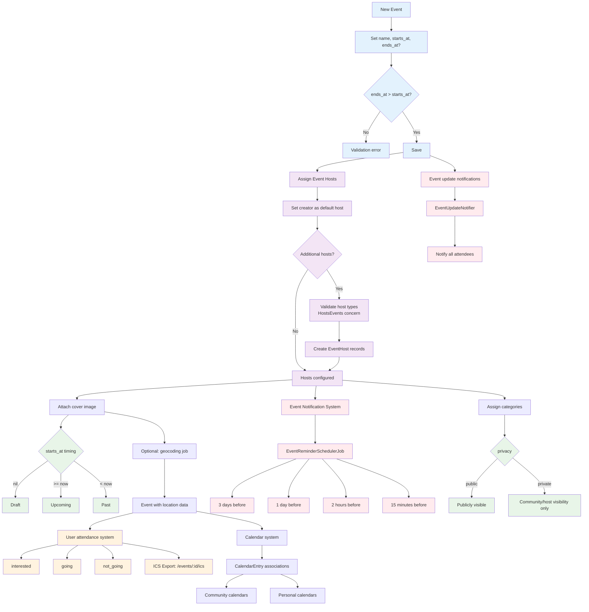

**Diagram Files:**
- 📊 [Mermaid Source](../../diagrams/source/events_flow.mmd) - Editable source
- 🖼️ [PNG Export](../../diagrams/exports/png/events_flow.png) - High-resolution image
- 🎯 [SVG Export](../../diagrams/exports/svg/events_flow.svg) - Vector graphics

## Technical Architecture Overview

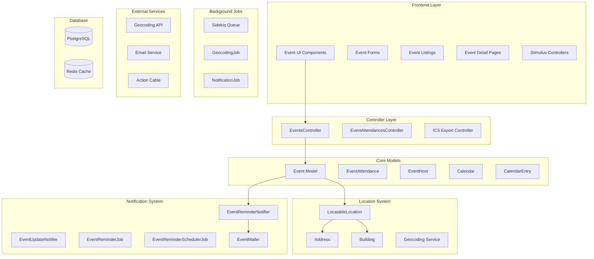

**Diagram Files:**
- 📊 [Technical Architecture](../../diagrams/source/events_technical_architecture.mmd) - Complete system architecture
- 🖼️ [PNG Export](../../diagrams/exports/png/events_technical_architecture.png) - High-resolution image
- 🎯 [SVG Export](../../diagrams/exports/svg/events_technical_architecture.svg) - Vector graphics

## Workflows

### RSVP Flow

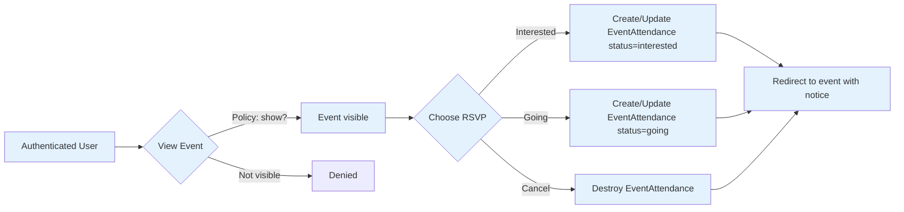

**Diagram Files:**
- 📊 [Mermaid Source](../../diagrams/source/events_rsvp_flow.mmd)
- 🖼️ [PNG Export](../../diagrams/exports/png/events_rsvp_flow.png)
- 🎯 [SVG Export](../../diagrams/exports/svg/events_rsvp_flow.svg)

### Reminder Scheduling Timeline

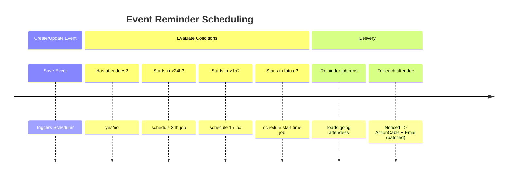

**Diagram Files:**
- 📊 [Mermaid Source](../../diagrams/source/events_reminders_timeline.mmd)
- 🖼️ [PNG Export](../../diagrams/exports/png/events_reminders_timeline.png)
- 🎯 [SVG Export](../../diagrams/exports/svg/events_reminders_timeline.svg)

## What's Implemented

### Core Event Management
- **Event Model**: Full lifecycle support with draft/scheduled/upcoming/past states
- **Multilingual Content**: Translatable name and rich text descriptions via Mobility + Action Text
- **Event Validation**: Time validation (ends_at > starts_at), URL format validation
- **Privacy Controls**: Public/private events with policy-based access control
- **Categorization**: Multiple categories per event via `Categorizable` concern
- **Cover Images**: Attachment support via `Attachments::Images` concern
- **Friendly URLs**: SEO-friendly slugs via `FriendlySlug` concern

### Location System (Advanced)
- **Polymorphic Location Support**: Three location types via `LocatableLocation`:
  - Simple location (text name only)
  - Full Address with geocoding
  - Building with associated Address
- **Dynamic Location Selector**: Stimulus-powered UI for switching location types
- **Inline Location Creation**: Create new addresses/buildings directly in event form
- **Location Validation**: Manual `location_attributes=` setter handles polymorphic nested creation
- **Geocoding Integration**: Background jobs for address geocoding

#### Location Selector Deep Dive

The location selector provides a sophisticated, user-friendly interface for managing event locations with three distinct types: Simple, Address, and Building. This system uses Stimulus controllers for dynamic UI management and custom backend processing for polymorphic location creation.

**Location Types Overview**

**Simple Location**
- Text-only location description (e.g., "Community Center", "Online via Zoom")
- Stored directly on the `LocatableLocation` model in the `name` field
- Best for virtual events, TBA locations, or simple venue references
- No geocoding or mapping features

**Address Location**  
- Full postal address with geocoding capabilities
- Uses existing `Address` records or creates new ones inline
- Includes geocoding for mapping and directions
- Fields: line1, line2, city, state, postal_code, country, physical/postal flags
- Supports primary address designation

**Building Location**
- Named venues/facilities with associated addresses  
- Uses existing `Building` records or creates new ones inline
- Buildings have their own address through association
- Perfect for institutions, community centers, schools
- Provides both building name and full address context

**Dynamic UI Implementation**

**Stimulus Controller (`location_selector_controller.js`)**
- **Targets**: `typeSelector`, `simpleLocation`, `addressLocation`, `buildingLocation`, `newAddress`, `newBuilding`
- **Actions**: `toggleLocationType`, `showNewAddress`, `showNewBuilding`, `updateVisibility`
- **State Management**: Shows/hides location sections based on user selection
- **Form Clearing**: Clears irrelevant fields when switching location types
- **Accessibility**: Focuses first field in new forms, maintains keyboard navigation

**Key Methods:**
- `connect()`: Initialize form state based on existing data
- `toggleLocationType(event)`: Show appropriate location section
- `hideAllLocationTypes()`: Reset all location sections
- `showNewAddress(event)` / `showNewBuilding(event)`: Toggle inline creation forms
- `clearSimpleLocationFields()` / `clearStructuredLocationFields()`: Field cleanup

**Backend Processing**

The system uses a custom `location_attributes=` setter on `LocatableLocation` instead of Rails' standard `accepts_nested_attributes_for` due to polymorphic association complexity.

**Polymorphic Location Creation Flow:**
1. Form submission includes `location_attributes` nested in event params
2. `location_attributes=` setter determines location type from submitted data
3. For Address: Creates `Address` record with geocoding job scheduling
4. For Building: Creates `Building` with nested `Address`, handles attribute normalization
5. `LocatableLocation` polymorphic association points to appropriate location record
6. Geocoding jobs run in background for address-based locations

**Form Integration & UI**

**Inline Creation Features:**
- "New" buttons reveal inline forms without page navigation
- Address and Building forms use consistent partial rendering
- Form validation shows errors inline without losing user input
- Progressive enhancement: works without JavaScript (graceful degradation)

**Validation & Error Handling:**
- Model validations for Event, Address, Building, and LocatableLocation
- Form error display within respective location sections
- JavaScript preserves form state during error correction
- Backend error handling with graceful rollback protection

**Integration Points:**
- Authorization via policies for Address/Building creation
- Geocoding integration with background job processing
- Performance optimizations with efficient queries and selective loading

**Diagram Files:**
- 📊 [Location Selector Flow](../../diagrams/source/events_location_selector_flow.mmd) - Detailed UI and backend flow
- 🖼️ [PNG Export](../../diagrams/exports/png/events_location_selector_flow.png) - High-resolution image
- 🎯 [SVG Export](../../diagrams/exports/svg/events_location_selector_flow.svg) - Vector graphics

## Event Hosts System

### Overview
Events can have multiple hosts through the polymorphic `EventHost` model. This allows different types of entities (People, Communities, Organizations) to co-host events and share hosting responsibilities.

### Components
- **EventHost Model**: `BetterTogether::EventHost`
  - Join model between Events and hosts
  - Polymorphic relationship: `belongs_to :host, polymorphic: true`
  - Associates: `belongs_to :event`
  - Permitted attributes: `host_id`, `host_type`, `event_id`

- **HostsEvents Concern**: `BetterTogether::HostsEvents`
  - Must be included in models to permit them as event hosts
  - Provides associations: `has_many :event_hosts, as: :host` and `has_many :hosted_events`
  - Class method `included_in_models` returns allow-list of valid host types
  - Automatically included in `Person`, `Community`, and other hostable models

### Event Hosting Workflow

#### Creating Events with Hosts
1. When creating an event, creator is automatically set as default host
2. Additional hosts can be added through `event_hosts_attributes` in the form
3. Host validation ensures only authorized entities can be assigned as hosts
4. Policy validation through `Pundit.policy_scope!` filters available host options

#### Host Authorization & Permissions
- **Event Host Member Check**: `event_host_member?` method in `EventPolicy`
  - Allows host representatives to manage events they're hosting
  - Checks if user can represent any of the event's hosts
  - Uses `agent.valid_event_host_ids` to determine user's hostable entities
- **CRUD Permissions**: Event hosts can create, read, update, and delete events they host
- **Visibility**: Event hosts are displayed on event pages via `visible_event_hosts` helper

#### Host Display & Interaction
- **Event Cards**: Show host information on event listings
- **Event Details**: Full "Hosted By" section with host cards
- **Authorization Filter**: `visible_event_hosts` helper filters hosts by user permissions
- **Multi-Host Support**: Events can display multiple hosts in responsive grid layout

### Technical Implementation

#### Models & Associations
- **Event Model**: `has_many :event_hosts` and `has_many :hosts, through: :event_hosts`
- **Host Models**: Include `HostsEvents` concern for `event_hosts` and `hosted_events` associations
- **EventHost Model**: Polymorphic join table with validation and permitted attributes

#### Controller Integration
- **EventsController**: 
  - `build_event_hosts` method for form processing
  - `event_host_class` validation with allow-list checking
  - Host assignment through permitted parameters
- **Authorization**: Policy-based access control throughout the hosting workflow

#### Views & Helpers
- **Event Forms**: Nested form fields for `event_hosts_attributes`
- **Event Display**: `_event_hosts.html.erb` partial for consistent host display
- **Helper Methods**: `visible_event_hosts` centralizes authorization logic
- **I18n Support**: "Hosted By" labels with full translation coverage

### Security & Validation
- **Host Type Allow-List**: Only models including `HostsEvents` can be event hosts
- **Policy Validation**: All host assignments validated through Pundit policies  
- **Authorization Checks**: Host visibility and management permissions enforced
- **Creator Fallback**: Event creator automatically becomes default host

## Event Attendance & RSVPs

- Model: `BetterTogether::EventAttendance` with string enum `status` values: `interested`, `going`.
- Uniqueness: one attendance per [event, person].
- Controller: `EventsController` actions `rsvp_interested`, `rsvp_going`, `rsvp_cancel` update the record.
- Policy: `EventAttendancePolicy` enforces who may RSVP; guests cannot RSVP.
- UX: Buttons on event show page; counts for going/interested shown.

## Event Reminder & Notification System

### Components Overview
The event notification system consists of several integrated components:

- **EventReminderNotifier**: Noticed event class for sending event reminder notifications
- **EventReminderJob**: Background job for processing reminder notifications for all attendees
- **EventReminderSchedulerJob**: Schedules future reminder notifications at appropriate intervals
- **EventMailer**: Handles email delivery for event reminders and updates
- **EventUpdateNotifier**: Sends notifications when event details change

### Event Reminder Workflow

#### Scheduling Reminders
1. When an event is created or updated, `EventReminderSchedulerJob` is triggered
2. The scheduler calculates appropriate reminder times based on event start time:
   - **24 hours before**: For events more than 24 hours away
   - **1 hour before**: For events more than 1 hour away
   - **At start time**: For immediate notifications
3. Background jobs are scheduled using `perform_at` for each reminder interval
4. Only "going" attendees receive reminder notifications

#### Notification Delivery
1. `EventReminderJob` processes each scheduled reminder:
   - Finds all attendees with "going" status
   - Creates `EventReminderNotifier` instances for each attendee
   - Respects user notification preferences
2. `EventReminderNotifier` handles multi-channel delivery:
   - **Action Cable**: Real-time in-app notifications via `NotificationsChannel`
   - **Email**: HTML emails with event details (15-minute delay to batch notifications)
3. Email delivery is conditional based on:
   - User has email address configured
   - User has `notify_by_email` preference enabled
   - User has `event_reminders` preference enabled
   - Anti-spam: Only one email per unread event notifications

#### Event Update Notifications
1. When event details change, `EventUpdateNotifier` is triggered
2. Sends notifications to all attendees about the changes
3. Includes information about what specific attributes changed
4. Uses the same delivery channels as reminder notifications

### Notification Preferences
Users can control event notifications through their preferences:
- `event_reminders`: Enable/disable event reminder notifications
- `notify_by_email`: Enable/disable email notifications globally
- `show_conversation_details`: Control visibility of conversation details in emails

### Anti-Spam & Batching
- **Email Batching**: 15-minute delay on email delivery to group related notifications
- **Duplicate Prevention**: Only one email per unread notification group per event
- **Preference Respect**: All notifications respect user preferences and can be disabled

### Technical Implementation Details

#### Classes & Responsibilities
- **`BetterTogether::EventReminderNotifier`**: Noticed event class extending `ApplicationNotifier`
  - Handles multi-channel delivery (Action Cable + Email)
  - Includes anti-spam logic and preference checking
  - Generates localized notification content
- **`BetterTogether::EventReminderJob`**: Background job extending `ApplicationJob`
  - Processes events and finds "going" attendees
  - Creates notifier instances for each attendee
  - Handles error cases gracefully (missing events, connection issues)
  - Queue: `:notifications` with retry configuration
- **`BetterTogether::EventReminderSchedulerJob`**: Scheduling job
  - Calculates appropriate reminder intervals based on event timing
  - Schedules future `EventReminderJob` instances
  - Prevents scheduling reminders for past events or drafts
- **`BetterTogether::EventMailer`**: Mailer class extending `ApplicationMailer`
  - Renders HTML emails with event details
  - Uses Rails 7+ parameter pattern (`params[:key]`)
  - Includes event location, timing, and registration information
- **`BetterTogether::EventUpdateNotifier`**: Handles event change notifications
  - Triggers when event attributes are modified
  - Notifies all attendees (not just "going" status)
  - Includes information about what changed

#### Notification Timing Strategy
- **24-hour reminders**: For events starting more than 24 hours in the future
- **1-hour reminders**: For events starting more than 1 hour in the future
- **Start-time notifications**: For events starting within the hour
- **Update notifications**: Immediate when event details change

#### Queue & Background Processing
- Uses `:notifications` queue for all event-related jobs
- Retry configuration: Up to 5 attempts with polynomial backoff
- Discard policy: `ActiveRecord::RecordNotFound` errors are discarded
- Error handling: Jobs complete gracefully for missing/invalid events

### Models & Data Flow
- **Event**: Has many `event_attendances` and `attendees` (people)
- **EventAttendance**: Links person to event with status (interested/going/not_going)
- **Noticed::Notification**: Stores notification records with read/unread status
- **Noticed::Event**: Base class for all notifier events

### Testing Coverage
The event reminder system has comprehensive test coverage:

#### EventReminderNotifier Specs
- Tests notification content generation (title, body, identifiers)
- Validates parameter handling and defaults
- Verifies unread count inclusion in messages
- Uses mock objects following established patterns

#### EventReminderJob Specs  
- Tests attendee filtering and notification delivery
- Validates error handling for missing/invalid events
- Confirms queue configuration and retry policies
- Verifies reminder type parameter handling

#### EventMailer Specs
- Tests email rendering with event details
- Validates headers, subject lines, and recipient handling
- Tests localization support
- Confirms delivery methods work correctly

#### Integration Testing
- Tests complete notification workflow from event creation to delivery
- Validates preference-based filtering
- Tests anti-spam and batching behavior
- Ensures proper authorization checks
- Model: `BetterTogether::EventAttendance`
- Associations: `belongs_to :event`, `belongs_to :person`
- Status enum: `interested`, `going`, `not_going`
- Policy: `EventAttendancePolicy` controls who can create/update attendance
- Controller actions: `rsvp_interested`, `rsvp_going`, `rsvp_cancel` on EventsController
- Workflow: Users can RSVP as interested/going, or cancel their RSVP (destroys attendance record)
- Authorization: Requires login; guests cannot RSVP

## ICS Calendar Export
- Route: `GET /events/:id/ics` with format defaulted to `:ics`
- Controller action: `ics` on EventsController
- MIME type: Registered as `text/calendar` for `.ics` extension
- Content: Generates valid iCalendar (RFC 5545) with VEVENT containing:
  - SUMMARY (event name)
  - DESCRIPTION (sanitized ActionText description + view details URL)
  - DTSTART/DTEND (UTC timestamps)
  - UID (unique identifier: `event-{id}@better-together`)
  - URL (link back to event page)
- Authorization: Uses same policy as `show?` (public events or creator/manager access)

## Event Model
- Class: `BetterTogether::Event`
- Purpose: Represent a schedulable event with optional media and location.
- Traits: `Attachments::Images`, `Categorizable`, `Creatable`, `FriendlySlug`, `Geography::Geospatial::One`, `Geography::Locatable::One`, `Identifier`, `Privacy`, `TrackedActivity`, `Viewable`.
- Associations: `has_many :event_attendances`, `has_many :attendees` (through event_attendances -> person)
- Translated fields: `name` (string), `description` (ActionText).
- Images: `attachable_cover_image` (cover image support).
- Categories: `categorizable(class_name: 'BetterTogether::EventCategory')`.
- Scheduling fields: `starts_at` (required), `ends_at` (optional), `registration_url` (optional, validated URL).
- Validation: `ends_at` must be after `starts_at`.
- Scopes: `draft` (no starts_at), `upcoming` (starts_at >= now), `past` (starts_at < now).
- Privacy: Uses `Privacy` concern (public/private); policies enforce who may view/manage.
- Geocoding (optional): Includes geospatial/locatable concerns and has a `schedule_address_geocoding` path for when address/location is available (address association currently commented out).
- ICS Export: `to_ics` method generates iCalendar format for calendar applications.

## Controller & Views
- Controller: `BetterTogether::EventsController` (index groups into draft/upcoming/past)
- RSVP actions: `rsvp_interested`, `rsvp_going`, `rsvp_cancel` (require authentication)
- ICS export: `ics` action renders calendar file with proper MIME type

## User Experience & Journey Maps

### Event Organizer Journey
The complete event organizer experience from planning to follow-up:

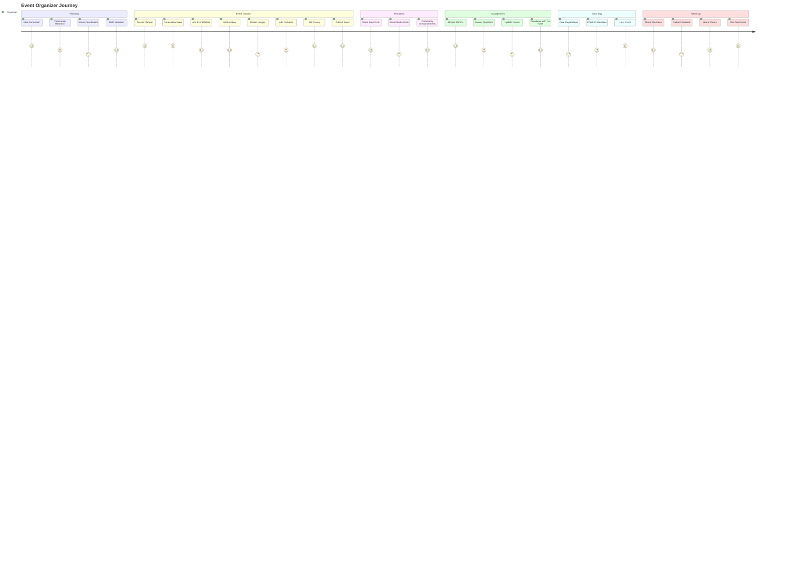

**Diagram Files:**
- 📊 [Organizer Journey](../../diagrams/source/events_organizer_journey.mmd) - Complete organizer experience
- 🖼️ [PNG Export](../../diagrams/exports/png/events_organizer_journey.png) - High-resolution image
- 🎯 [SVG Export](../../diagrams/exports/svg/events_organizer_journey.svg) - Vector graphics

### Event Attendee Journey
The complete attendee experience from discovery to community building:

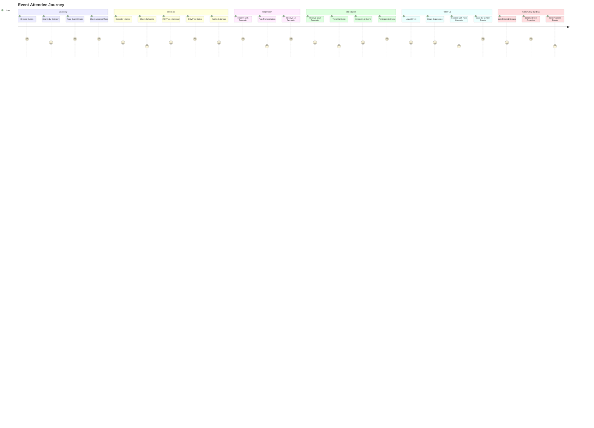

**Diagram Files:**
- 📊 [Attendee Journey](../../diagrams/source/events_attendee_journey.mmd) - Complete attendee experience  
- 🖼️ [PNG Export](../../diagrams/exports/png/events_attendee_journey.png) - High-resolution image
- 🎯 [SVG Export](../../diagrams/exports/svg/events_attendee_journey.svg) - Vector graphics

## Additional Resources

### User Documentation
- 📖 [Event User Guide](../../users/events_user_guide.md) - Comprehensive guide for organizers and attendees
- 🎯 [Best Practices](../../users/events_user_guide.md#best-practices) - Tips for successful event management
- 🔧 [Troubleshooting](../../users/events_user_guide.md#troubleshooting-common-issues) - Common issues and solutions

### All Event System Diagrams
- 📊 [Events Schema ERD](../../diagrams/source/events_schema_erd.mmd) - Database relationships
- 📊 [Events Flow](../../diagrams/source/events_flow.mmd) - Complete system workflow  
- 📊 [Location Selector Flow](../../diagrams/source/events_location_selector_flow.mmd) - Location selection UI/UX
- 📊 [RSVP Flow](../../diagrams/source/events_rsvp_flow.mmd) - Attendance workflow
- 📊 [Reminder Timeline](../../diagrams/source/events_reminders_timeline.mmd) - Notification scheduling
- 📊 [Technical Architecture](../../diagrams/source/events_technical_architecture.mmd) - System architecture
- 📊 [Organizer Journey](../../diagrams/source/events_organizer_journey.mmd) - Organizer user experience
- 📊 [Attendee Journey](../../diagrams/source/events_attendee_journey.mmd) - Attendee user experience


# Event Invitations & Attendance

This document provides an end-to-end, in-depth reference for event invitations and attendance (RSVP) in the Better Together Community Engine. It covers data models, controller flows, access control, invitation token handling, email and in-app notifications, RSVP life cycle, and how these pieces interact with platform privacy.

## Overview

- Event invitations allow organizers and hosts to invite existing members or external emails to a specific event.
- Invitations support secure token links for review, acceptance, or decline — including first-time registration flows.
- Acceptance automatically ensures community membership and sets RSVP to “going”, creating a calendar entry.
- Attendance (RSVP) supports two statuses: “interested” and “going”, with cancellation removing the attendance record and calendar entry.
- Invitation tokens permit access to otherwise private content for the specific invited event while preserving platform privacy.

## Core Models

- `BetterTogether::Invitation`: Polymorphic base model with `invitable`, `inviter`, optional `invitee`, `role`, `status` (string enum: pending, accepted, declined), `token` (secure), validity window, and timestamps.
- `BetterTogether::EventInvitation < Invitation`: Invitation specialization for events.
  - Status values: `pending`, `accepted`, `declined` (string enum).
  - Validates presence/inclusion of `locale` and requires one of `invitee` or `invitee_email`.
  - Prevents duplicate invitations for a given event for either the same `invitee` or the same `invitee_email` while status is in `pending` or `accepted`.
  - Methods:
    - `event`: alias to `invitable`.
    - `url_for_review`: event URL with `invitation_token` param to support review page and access.
    - `for_existing_user?` / `for_email?`: invitation mode helpers.
    - `accept!(invitee_person:)`: sets status, ensures community membership, creates/updates `EventAttendance` to `going`.
    - `decline!`: sets status to `declined`.
- `BetterTogether::EventAttendance`: RSVP record for a `person` and `event` with string enum statuses: `interested`, `going`.
  - Constraints:
    - Unique per person/event.
    - Event must be scheduled (no RSVP on drafts).
  - Side effects:
    - On `going`, creates a `CalendarEntry` in the person’s primary calendar.
    - On status change away from `going` or destroy, removes the calendar entry.

## Data Model Diagram (Invitations + Attendance)

```mermaid
%% See separate Mermaid source file for editing: docs/diagrams/source/events_invitations_schema_erd.mmd
```

**Diagram Files:**
- 📊 Mermaid Source: ../diagrams/source/events_invitations_schema_erd.mmd
- 🖼️ PNG Export: ../diagrams/exports/png/events_invitations_schema_erd.png
- 🎯 SVG Export: ../diagrams/exports/svg/events_invitations_schema_erd.svg

## Invitation Creation & Delivery

Event organizers and host representatives create invitations from the event page (Invitations panel). Two modes are supported:

- Invite existing member:
  - Provide `invitee_id` (a `BetterTogether::Person`), which auto-fills `invitee_email` and `locale` from the person record.
  - Delivery: Noticed notification to the user (`EventInvitationNotifier`) and optional email via `EventInvitationsMailer`.
- Invite by email:
  - Provide `invitee_email` and target `locale`.
  - Delivery: Email sent to the external address via `EventInvitationsMailer`.

Simple throttling prevents resending an invitation more than once within 15 minutes (`last_sent` timestamp check). Resend is supported for pending invitations.

### Controller Endpoints (Organizer/Host)

- `POST /events/:event_id/invitations` (create):
  - Authorization: `EventInvitationPolicy#create?` (organizer/host scope).
  - Parameters: `invitee_id` or `invitee_email`, optional `valid_from`, `valid_until`, `locale`, `role_id`.
  - Behavior: builds `EventInvitation`, sets `status: 'pending'`, `inviter`, and default `valid_from`.
  - Delivery: Noticed/email depending on invitation type; updates `last_sent`.

- `PUT /events/:event_id/invitations/:id/resend` (resend):
  - Authorization: same as create; respects resend throttling.

- `DELETE /events/:event_id/invitations/:id` (destroy):
  - Authorization: allowed for organizers/hosts.

- `GET /events/:event_id/invitations/available_people` (AJAX):
  - Returns up to 20 non-invited people with an email address; supports search term.
  - Uses policy scope over `Person` and joins on user/contact email.

## Public Invitation Review & Response

Public review and response routes are token-based:

- `GET /invitations/:token` → `InvitationsController#show`
- `POST /invitations/:token/accept` → `#accept`
- `POST /invitations/:token/decline` → `#decline`

Behavior:
- Finds `Invitation.pending.not_expired` by token; returns 404 if missing.
- For `accept`:
  - Requires authentication; if not signed in, stores token in session and redirects to sign-in/registration based on `invitee_email` lookup.
  - If `invitee` is bound, enforces that the logged-in person matches; otherwise, binds the invitation to the current person.
  - Calls `accept!` if available (for `EventInvitation`) or sets status to `accepted`.
  - Redirects to the invitable (event) after acceptance.
- For `decline`:
  - Calls `decline!` (or sets status) and redirects to event if available, else home.

## Access Control & Privacy with Invitation Tokens

Invitation tokens grant limited access only to the specific event to which they belong. The platform may still require login for other content.

Key elements:

- `EventsController#check_platform_privacy` augmentation:
  - For private platforms and unauthenticated users, extracts an `invitation_token` from params/session.
  - Validates token for an `EventInvitation` that matches the requested event.
  - On valid, stores token and locale in session and allows access to the event page.
  - On invalid/expired, redirects to sign-in.

- `EventPolicy#show?`:
  - Permits if event is public and scheduled, or if creator/manager/host member, or if the current person holds an invitation, or if there is a valid invitation token.

- `ApplicationPolicy::Scope` for events:
  - Includes events visible through valid `invitation_token` in the scope.

### Token Access Flow Diagram

```mermaid
%% See separate Mermaid source file for editing: docs/diagrams/source/events_access_via_invitation_token.mmd
```

**Diagram Files:**
- 📊 Mermaid Source: ../diagrams/source/events_access_via_invitation_token.mmd
- 🖼️ PNG Export: ../diagrams/exports/png/events_access_via_invitation_token.png
- 🎯 SVG Export: ../diagrams/exports/svg/events_access_via_invitation_token.svg

## Notifications

- `BetterTogether::EventInvitationNotifier` (Noticed):
  - Channels: ActionCable (in-app) and Email (`EventInvitationsMailer`).
  - Email uses parameterized mailer with `invitation` and `invitable` context.
  - Message includes localized title/body and the invitation review URL.

- `BetterTogether::EventInvitationsMailer`:
  - Sends to `invitee_email` using the invitation’s `locale`.
  - Subject includes event name with localized fallback.

## RSVP (Attendance)

The RSVP system is centered on `EventAttendance` and is managed through member routes on the `Event` resource:

- `POST /events/:id/rsvp_interested`
- `POST /events/:id/rsvp_going`
- `DELETE /events/:id/rsvp_cancel`

Constraints and behavior:
- Only available when the event is scheduled (has `starts_at`).
- Requires authentication for all RSVP actions.
- Authorization uses `EventPolicy#show?` followed by `EventAttendancePolicy` for create/update.
- On `going`, a calendar entry is created; on cancel or switching away from `going`, the entry is removed.

Existing diagrams cover the RSVP journey and reminder scheduling:
- RSVP Flow: ../diagrams/source/events_rsvp_flow.mmd
- Reminder Timeline: ../diagrams/source/events_reminders_timeline.mmd

## Organizer UI

- Invitations Panel on Event Show:
  - Tabs include Attendees and Invitations.
  - Invite by Member (`invitee_id`) or by Email (`invitee_email`).
  - View invitations table with type (member/email), status, resend/delete actions.
  - Search available people endpoint to prevent re-inviting and to filter by email presence.

## Security & Validation

- String enums: all statuses are strings for human-readable DB contents.
- Duplicate protection: event invitation uniqueness enforced for both `invitee` and `invitee_email` while status is pending/accepted.
- Privacy: invitation tokens scoped to a single event; do not grant broad platform access.
- Session token storage: invitation token and locale persisted for acceptance and consistent access; tokens expire per validity window.
- Safe dynamic resolution: no unsafe constantization of user input; controllers use allow-lists for host assignment and standard strong parameters.
- Authorization: `Pundit` policies on events, attendances, and invitations.

## Performance Considerations

- Organizer views preload invitations, invitees, and inviters to minimize N+1 queries.
- Event show preloads hosts, categories, attendances, translations, and cover image attachment.
- RSVP and invitation actions redirect back to the event to keep interaction snappy.
- Noticed notifications and email delivery run asynchronously.

## Troubleshooting

- Invitation token shows 404 on private platform:
  - Ensure the token matches the requested event and is still pending/not expired.
  - Verify session is storing `event_invitation_token` and that controller privacy check is triggered.

- Invitee required error:
  - Provide either `invitee_id` (member) or `invitee_email` (external) — one must be present.

- Duplicate invitation error:
  - An outstanding pending/accepted invitation already exists for that person or email.

- RSVP not available:
  - Event must be scheduled (`starts_at` present). Draft events do not accept RSVPs.

- Calendar entry not created:
  - Calendar entries are only created for `going` status; ensure the person has a primary calendar.

## Related Files (Code Pointers)

- Models:
  - `app/models/better_together/invitation.rb`
  - `app/models/better_together/event_invitation.rb`
  - `app/models/better_together/event_attendance.rb`

- Controllers:
  - `app/controllers/better_together/events/invitations_controller.rb`
  - `app/controllers/better_together/invitations_controller.rb`
  - `app/controllers/better_together/events_controller.rb`

- Policies:
  - `app/policies/better_together/event_policy.rb`
  - `app/policies/better_together/event_invitation_policy.rb`
  - `app/policies/better_together/event_attendance_policy.rb`

- Notifications & Mailers:
  - `app/notifiers/better_together/event_invitation_notifier.rb`
  - `app/mailers/better_together/event_invitations_mailer.rb`

## Process Flow: Event Invitations

```mermaid
%% See separate Mermaid source file for editing: docs/diagrams/source/events_invitations_flow.mmd
```

**Diagram Files:**
- 📊 Mermaid Source: ../diagrams/source/events_invitations_flow.mmd
- 🖼️ PNG Export: ../diagrams/exports/png/events_invitations_flow.png
- 🎯 SVG Export: ../diagrams/exports/svg/events_invitations_flow.svg


# Geography System Documentation

## Overview

The Better Together Geography System is a comprehensive location management and mapping architecture that provides hierarchical geographical organization, geocoding capabilities, and spatial data management using PostGIS. The system supports multi-level geographical entities from continents down to addresses, with integrated mapping and location services.

## System Architecture

### Core Components

#### 1. Geographical Hierarchy Models
- **Continent**: Top-level geographical divisions
- **Country**: National-level entities with ISO code support
- **State**: Provincial/state-level divisions with ISO codes
- **Region**: Custom regional divisions within countries/states
- **Settlement**: Cities, towns, and settlement areas

#### 2. Spatial Management
- **Space**: Core coordinate storage with latitude, longitude, elevation
- **GeospatialSpace**: Join table linking entities to spatial coordinates
- **Address**: Structured address information with geocoding
- **LocatableLocation**: Polymorphic location handling for any entity

#### 3. Mapping & Visualization
- **Map**: Interactive map representations with center, zoom, viewport
- **CommunityMap**: Maps associated with communities
- **CommunityCollectionMap**: Maps for community collections

#### 4. Location Services
- **GeocodingJob**: Background geocoding service
- **LocationSelectorController**: Frontend location selection interface

## Key Features

### 1. Hierarchical Organization
```
Continent
├── Country (ISO 3166-1 codes)
│   ├── State (ISO 3166-2 codes)
│   │   ├── Region (custom divisions)
│   │   │   └── Settlement (cities/towns)
│   │   └── Settlement
│   └── Settlement
└── Settlement
```

### 2. Spatial Data Management
- **PostGIS Integration**: Native PostgreSQL spatial extension support
- **Coordinate Storage**: Latitude, longitude, elevation with validation
- **Spatial Indexing**: Optimized geographical queries and proximity searches
- **Geographic Projections**: WGS 84 (SRID 4326) standard coordinate system

### 3. Flexible Location Handling
- **Polymorphic Locations**: Any model can be geo-located
- **Simple Locations**: String-based location names
- **Structured Locations**: Full address or building references
- **Hybrid Approach**: Support for both simple names and detailed addresses

### 4. Geocoding Integration
- **Background Processing**: Asynchronous geocoding via Sidekiq jobs
- **Cache Support**: Geocoding results cached via Rails.cache
- **Error Handling**: Retry logic with exponential backoff
- **Provider Agnostic**: Configurable geocoding services

## Technical Implementation

### Database Schema

#### Geography Tables

**better_together_geography_spaces**
```sql
- id: UUID primary key
- creator_id: UUID reference to creator
- identifier: Unique string identifier
- elevation: Float precision coordinate
- latitude: Float precision coordinate (-90 to 90)
- longitude: Float precision coordinate (-180 to 180)
- properties: JSONB metadata storage
- metadata: JSONB additional data storage
```

**better_together_geography_geospatial_spaces**
```sql
- id: UUID primary key
- geospatial_type: Polymorphic type reference
- geospatial_id: UUID polymorphic reference
- space_id: UUID reference to geography_spaces
- position: Integer ordering
- primary_flag: Boolean for primary location
```

**better_together_geography_maps**
```sql
- id: UUID primary key
- creator_id: UUID reference to creator
- mappable_type: Polymorphic type for mapped entity
- mappable_id: UUID polymorphic reference
- center: PostGIS ST_POINT geographic coordinates
- zoom: Integer zoom level (default 13)
- viewport: PostGIS ST_POLYGON geographic boundary
- metadata: JSONB map configuration data
- type: STI type for map subclasses
```

**better_together_geography_locatable_locations**
```sql
- id: UUID primary key
- creator_id: UUID reference to creator
- locatable_type: Polymorphic type for located entity
- locatable_id: UUID polymorphic reference
- location_type: Polymorphic type for location (Address/Building)
- location_id: UUID polymorphic location reference
- name: String fallback location name
```

#### Hierarchical Geography Tables

**better_together_geography_continents**
```sql
- id: UUID primary key
- identifier: String unique identifier
- community_id: UUID reference to community
- protected: Boolean system protection flag
```

**better_together_geography_countries**
```sql
- id: UUID primary key
- identifier: String unique identifier
- iso_code: String ISO 3166-1 alpha-2 code
- community_id: UUID reference to community
- protected: Boolean system protection flag
```

**better_together_geography_states**
```sql
- id: UUID primary key
- identifier: String unique identifier
- iso_code: String ISO 3166-2 subdivision code
- country_id: UUID reference to country
- community_id: UUID reference to community
- protected: Boolean system protection flag
```

**better_together_addresses**
```sql
- id: UUID primary key
- contact_detail_id: Optional contact reference
- physical: Boolean physical address flag
- postal: Boolean postal address flag
- line1: String primary address line
- line2: String secondary address line
- city_name: String city/locality
- state_province_name: String state/province
- postal_code: String postal/ZIP code
- country_name: String country name
- latitude: Float geocoded latitude
- longitude: Float geocoded longitude
- privacy: Enum privacy level
- primary_flag: Boolean primary address indicator
- label: String address type label
```

### Model Relationships

#### Core Concerns

**Geography::Geospatial::One**
```ruby
# Provides single location capability to any model
included do
  has_one :geospatial_space, as: :geospatial
  has_one :space, through: :geospatial_space
  delegate :latitude, :longitude, :elevation, to: :space
end

def to_leaflet_point
  {
    lat: latitude,
    lng: longitude,
    elevation: elevation,
    label: to_s
  }
end
```

**Geography::Locatable**
```ruby
# Polymorphic location management
has_many :locatable_locations, as: :locatable
accepts_nested_attributes_for :locatable_locations
```

#### Address Model

**Geocoding Integration**
```ruby
class Address < ApplicationRecord
  include Geography::Geospatial::One
  
  geocoded_by :geocoding_string
  
  after_create :schedule_geocoding
  after_update :schedule_geocoding
  
  def geocoding_string
    to_formatted_s(excluded: %i[display_label line2])
  end
  
  def schedule_geocoding
    return unless should_geocode?
    BetterTogether::Geography::GeocodingJob.perform_later(self)
  end
  
  def should_geocode?
    return false if geocoding_string.blank?
    (changed? or !geocoded?)
  end
end
```

#### Map Model

**PostGIS Integration**
```ruby
class Map < ApplicationRecord
  belongs_to :mappable, polymorphic: true, optional: true
  
  validates :center, presence: true
  validates :zoom, numericality: { only_integer: true, greater_than: 0 }
  
  def default_center
    lon = ENV.fetch('DEFAULT_MAP_CENTER_LNG', '-57.9474').to_f
    lat = ENV.fetch('DEFAULT_MAP_CENTER_LAT', '48.9517').to_f
    factory = RGeo::Geographic.spherical_factory(srid: 4326)
    factory.point(lon, lat)
  end
  
  def center_for_leaflet
    "#{center.latitude},#{center.longitude}"
  end
end
```

### Geocoding Configuration

**Geocoder Setup**
```ruby
# config/initializers/geocoder.rb
Geocoder.configure(
  always_raise: :all,
  timeout: 5,
  units: :km,
  cache: Geocoder::CacheStore::Generic.new(Rails.cache, {})
)
```

**Background Job Processing**
```ruby
class GeocodingJob < ApplicationJob
  queue_as :geocoding
  retry_on StandardError, wait: :polynomially_longer, attempts: 5
  
  def perform(geocodable)
    coords = geocodable.geocode
    geocodable.save if coords
  end
end
```

### Frontend Integration

#### Location Selector Controller (Stimulus)

**Dynamic Location Forms**
```javascript
// app/javascript/controllers/better_together/location_selector_controller.js
export default class extends Controller {
  static targets = [
    "typeSelector",
    "simpleLocation", 
    "addressLocation",
    "buildingLocation"
  ]
  
  toggleLocationType(event) {
    const selectedType = event.target.value
    this.hideAllLocationTypes()
    
    switch(selectedType) {
      case 'simple':
        this.showSimpleLocation()
        break
      case 'address':
        this.showAddressLocation()
        break
      case 'building':
        this.showBuildingLocation()
        break
    }
  }
}
```

## Configuration Options

### Environment Variables

**Default Map Center**
```bash
DEFAULT_MAP_CENTER_LNG=-57.9474  # Default longitude (Corner Brook, NL)
DEFAULT_MAP_CENTER_LAT=48.9517   # Default latitude (Corner Brook, NL)
```

**Geocoding Service**
```bash
GOOGLE_API_KEY=your_api_key      # Google Maps API key (if using Google)
```

### Sidekiq Queue Configuration

**Queue Priorities**
```yaml
# config/sidekiq.yml
:queues:
  - default
  - mailers
  - [geocoding, 3]  # Lower priority for geocoding operations
```

### PostGIS Requirements

**Database Extensions**
```sql
CREATE EXTENSION IF NOT EXISTS postgis;
CREATE EXTENSION IF NOT EXISTS postgis_topology;
```

**Database Adapter**
```ruby
# config/database.yml
development:
  adapter: postgis
  encoding: unicode
  database: better_together_development
```

## Usage Examples

### Creating Geolocated Content

**Adding Location to Events**
```ruby
event = Event.create(
  title: "Community Meetup",
  locatable_locations_attributes: [{
    location_type: 'BetterTogether::Address',
    location_id: address.id
  }]
)

# Alternative: Simple location
event = Event.create(
  title: "Online Meetup",
  locatable_locations_attributes: [{
    name: "Virtual Event Space"
  }]
)
```

**Creating Interactive Maps**
```ruby
map = Geography::Map.create(
  title: "Community Locations",
  mappable: community,
  center: factory.point(-57.9474, 48.9517),
  zoom: 13,
  metadata: {
    style: 'streets',
    markers: true
  }
)
```

### Geocoding Addresses

**Manual Geocoding**
```ruby
address = Address.create(
  line1: "123 Main Street",
  city_name: "Corner Brook",
  state_province_name: "Newfoundland and Labrador",
  country_name: "Canada",
  postal_code: "A2H 1B2"
)

# Geocoding happens automatically via after_create callback
# Or manually: address.geocode
```

### Spatial Queries

**Finding Nearby Locations**
```ruby
# Find addresses within 10km
nearby_addresses = Address.joins(:space)
  .where("ST_DWithin(better_together_geography_spaces.point, ST_Point(?, ?), ?)",
         longitude, latitude, 10000)
```

**Geographic Filtering**
```ruby
# Find events in a specific region
events_in_region = Event.joins(locatable_locations: { location: :space })
  .where(better_together_geography_spaces: { 
    latitude: (lat_min..lat_max),
    longitude: (lng_min..lng_max)
  })
```

## API Endpoints

### Geography Resources

**Maps**
```
GET    /geography/maps           # List maps
POST   /geography/maps           # Create map
GET    /geography/maps/:id       # Show map
PUT    /geography/maps/:id       # Update map
DELETE /geography/maps/:id       # Delete map
```

**Geographical Entities**
```
GET /geography/continents        # List continents
GET /geography/countries         # List countries
GET /geography/states            # List states
GET /geography/regions           # List regions
GET /geography/settlements       # List settlements
```

## Performance Considerations

### Geocoding Optimization

1. **Batch Processing**: Queue multiple addresses together
2. **Cache Strategy**: Long-term caching of geocoded results
3. **Rate Limiting**: Respect API provider limits
4. **Fallback Handling**: Graceful degradation for failed geocoding

### Spatial Indexing

1. **PostGIS Indexes**: Automatic spatial indexing on geography columns
2. **Composite Indexes**: Combined geographic and attribute indexes
3. **Query Optimization**: Use ST_DWithin for distance queries

### Memory Management

1. **Lazy Loading**: Load coordinates only when needed
2. **Pagination**: Limit result sets for large geographical queries
3. **Caching**: Cache expensive spatial calculations

## Security Considerations

### Data Protection

1. **Privacy Levels**: Address privacy controls (private/public/community)
2. **Access Control**: Community-based access restrictions
3. **Data Validation**: Coordinate boundary validation
4. **Input Sanitization**: Geocoding input cleaning

### API Security

1. **Rate Limiting**: Prevent geocoding API abuse
2. **Key Management**: Secure API key storage
3. **Request Validation**: Validate geographical data inputs
4. **Audit Logging**: Track location data changes

## Monitoring & Maintenance

### Geocoding Monitoring

```ruby
# Monitor geocoding success rates
class GeocodingMetrics
  def self.success_rate(period = 24.hours)
    total = GeocodingJob.where(created_at: period.ago..).count
    failed = GeocodingJob.where(created_at: period.ago..)
                        .where('attempts >= ?', 5).count
    ((total - failed).to_f / total * 100).round(2)
  end
end
```

### Data Quality Checks

```ruby
# Find addresses missing coordinates
ungeocoded = Address.where(latitude: nil, longitude: nil)

# Find invalid coordinates
invalid_coords = Space.where(
  'latitude < -90 OR latitude > 90 OR longitude < -180 OR longitude > 180'
)
```

## Troubleshooting

### Common Issues

1. **Geocoding Failures**
   - Check API key validity
   - Verify address format
   - Check rate limits
   - Review error logs

2. **PostGIS Errors**
   - Ensure extension installed
   - Check coordinate validation
   - Verify SRID consistency

3. **Performance Issues**
   - Review spatial indexes
   - Optimize query patterns
   - Check cache configuration

### Debugging Tools

```ruby
# Test geocoding directly
address.geocode
puts address.coordinates

# Check spatial relationships
space.to_leaflet_point

# Validate PostGIS setup
ActiveRecord::Base.connection.execute("SELECT PostGIS_Version();")
```

This geography system provides a robust foundation for location-based features, supporting everything from simple address storage to complex spatial queries and interactive mapping capabilities.


# Better Together I18n/Mobility Localization System

## Overview

The Better Together Community Engine implements a comprehensive internationalization (i18n) and localization system using **Rails I18n** for static content and the **Mobility gem** for dynamic model attributes. This system supports multiple locales with fallback mechanisms, AI-powered translation assistance, and a user-friendly tabbed interface for content editing.

## Architecture Components

### 1. Core Configuration

#### Available Locales
- **Primary Locales**: English (en), Spanish (es), French (fr)  
- **Default Locale**: English (en)
- **Configuration**: `config/application.rb`

```ruby
config.i18n.available_locales = %i[en es fr]
config.i18n.default_locale = :en
```

#### Route Configuration
- **Locale URL Prefix**: `/:locale/` (e.g., `/en/pages`, `/es/páginas`, `/fr/pages`)
- **Pattern Matching**: Dynamically generates route constraints based on available locales
- **Fallback**: Redirects to default locale when no locale specified

### 2. Mobility Gem Integration

The system uses the **Mobility gem** to handle model attribute translations with multiple backend strategies:

#### Backend Configuration (`config/initializers/mobility.rb`)
- **Default Backend**: Key-Value with text type
- **Active Plugins**: 
  - Reader/Writer accessors
  - Backend reader (`attribute_backend`)
  - Query support (`.i18n` scope)
  - Caching layer
  - Fallback support
  - Presence validation (converts blank to nil)
  - Locale-specific accessors (`attribute_en`, `attribute_es`, etc.)

#### Translation Backends

**1. Key-Value Backend (String/Text)**
- **Purpose**: Simple text attributes (names, titles, descriptions)
- **Storage**: `mobility_string_translations` and `mobility_text_translations` tables
- **Implementation**: `Mobility::Backends::ActiveRecord::KeyValue`

**2. Action Text Backend (Rich Content)**
- **Purpose**: Rich text content with formatting, attachments, embeds
- **Storage**: `action_text_rich_texts` table with mobility integration
- **Implementation**: `Mobility::Backends::ActionText`

### 3. Translatable Models

#### Common Model Pattern
Models include the `BetterTogether::Translatable` concern and define translated attributes:

```ruby
class Page < ApplicationRecord
  include BetterTogether::Translatable
  
  translates :title, type: :string          # Key-Value backend
  translates :content, backend: :action_text # Action Text backend
end
```

#### Key Translatable Models
- **Pages**: `title` (string), `content` (rich text)
- **Posts**: `title` (string), `content` (rich text)  
- **Navigation Items**: `title` (string)
- **Categories**: `name` (string), `description` (rich text)
- **Content Blocks**: Various attributes based on block type
- **Uploads**: `name` (string), `description` (rich text)

### 4. Translation UI System

#### Tabbed Interface Components

**Form Helpers**
- `_translated_string_field.html.erb`: Single-line text inputs per locale
- `_translated_text_field.html.erb`: Multi-line text areas per locale  
- `_translated_rich_text_field.html.erb`: Rich text editors (Trix) per locale

**JavaScript Controller** (`translation_controller.js`)
- **Functionality**: 
  - Tab synchronization across field groups
  - Translation status indicators (✓ present, ⚠ missing)
  - AI translation integration
  - Real-time validation feedback

**Helper Methods** (`translatable_fields_helper.rb`)
- **Tab Generation**: Creates locale tabs with status indicators
- **AI Integration**: Dropdown menus for translation options
- **Accessibility**: ARIA labels and screen reader support

#### Visual Indicators
- **Green Check (✓)**: Translation present and saved
- **Yellow Warning (⚠)**: No translation available
- **Tab Highlighting**: Active locale visually emphasized
- **Error States**: Validation errors shown per locale

### 5. AI Translation System

#### TranslationBot (`app/robots/better_together/translation_bot.rb`)
- **Provider**: OpenAI GPT integration
- **Features**:
  - Content preprocessing (Trix attachment handling)
  - Context-aware translation prompts
  - Cost estimation and usage tracking
  - Error handling and fallback mechanisms

#### Translation Workflow
1. **User Trigger**: Click "AI Translate from [Locale]" dropdown option
2. **AJAX Request**: Send content to `TranslationsController#translate`
3. **Processing**: Extract content, handle rich text attachments
4. **API Call**: Submit to OpenAI with translation prompt
5. **Response**: Process and restore attachments in translated content
6. **UI Update**: Populate target locale field with translation
7. **Validation**: Real-time indicator updates

#### Bulk Translation Tasks
**Rake Tasks** (`lib/tasks/ai_translations.rake`)
- `better_together:ai_translations:from_en:page_attrs`
- `better_together:ai_translations:from_en:nav_item_attrs`
- `better_together:ai_translations:from_en:hero_rich_text`

### 6. Fallback Mechanisms

#### I18n Fallbacks (Static Content)
1. **Requested Locale**: `t('key', locale: :es)`
2. **Fallback Chain**: Spanish → English → Key name
3. **Missing Keys**: i18n-tasks gem identifies gaps

#### Mobility Fallbacks (Model Attributes)
1. **Current Locale**: Check `attribute_es`
2. **English Fallback**: Check `attribute_en` 
3. **First Available**: Scan all locales for first present value
4. **Nil Result**: Return nil if no translations exist

### 7. Database Schema

#### Translation Storage Tables

**Mobility String Translations**
```sql
CREATE TABLE mobility_string_translations (
  id bigint PRIMARY KEY,
  locale varchar(255) NOT NULL,
  key varchar(255) NOT NULL,
  value text,
  translatable_type varchar(255),
  translatable_id bigint,
  created_at timestamp,
  updated_at timestamp
);
```

**Mobility Text Translations** (similar structure with longer value field)

**Action Text Rich Texts** (enhanced with locale support)
```sql
CREATE TABLE action_text_rich_texts (
  id bigint PRIMARY KEY,
  name varchar(255) NOT NULL,
  body text,
  record_type varchar(255),
  record_id bigint,
  locale varchar(255),
  created_at timestamp,
  updated_at timestamp
);
```

**FriendlyId Slugs** (locale-aware URL slugs)
```sql
CREATE TABLE friendly_id_slugs (
  id bigint PRIMARY KEY,
  slug varchar(255) NOT NULL,
  sluggable_id bigint,
  sluggable_type varchar(255),
  scope varchar(255),
  locale varchar(255) NOT NULL,
  created_at timestamp
);
```

### 8. Frontend Locale Management

#### Locale Switcher UI
- **Location**: Navigation bar dropdown
- **Display**: Language flag icon + locale code (EN, ES, FR)
- **Functionality**: Preserves current page/context when switching
- **Accessibility**: Tooltips and screen reader support

#### URL Structure
- **Format**: `/:locale/path/to/resource`
- **Examples**: 
  - `/en/pages/about-us`
  - `/es/páginas/acerca-de-nosotros`  
  - `/fr/pages/à-propos-de-nous`

### 9. Content Management Workflow

#### Creating Multilingual Content
1. **Form Rendering**: Generate tabbed interface for all locales
2. **Content Entry**: Users fill in translations per locale tab
3. **Validation**: Check presence requirements per locale
4. **Storage**: Save to appropriate Mobility backend
5. **Publishing**: Content available immediately in respective locales

#### Translation Status Tracking
- **Per-Field Indicators**: Visual cues show translation completeness
- **Bulk Status**: Admin dashboards show translation coverage
- **Automated Tasks**: Scheduled translation jobs for batch processing

### 10. Performance Optimizations

#### Caching Strategy
- **Mobility Cache**: Enabled for translated attribute reads
- **I18n Caching**: Rails built-in translation caching
- **Query Optimization**: `.with_translations` scope for efficient loading

#### Database Indexing
- **Composite Indexes**: `(translatable_type, translatable_id, locale, key)`
- **Locale Indexes**: Fast locale-specific queries
- **Slug Indexes**: Efficient friendly URL resolution

### 11. Validation and Quality Assurance

#### Translation Validation Tools
- **i18n-tasks gem**: Detects missing keys, unused translations
- **Presence Validators**: Ensures required translations exist
- **Custom Validators**: Business logic for translation completeness

#### Quality Assurance Commands
```bash
# Check translation health
i18n-tasks health

# Find missing translations  
i18n-tasks missing

# Add missing keys (English first)
i18n-tasks add-missing

# Normalize translation files
i18n-tasks normalize
```

### 12. Development Guidelines

#### Adding New Translatable Content
1. **Model Changes**: Add `translates :attribute` declarations
2. **Migration**: Generate Mobility migration if needed
3. **Forms**: Use translation field partials
4. **Validations**: Add presence validators for required locales
5. **Tests**: Include translation scenarios in specs

#### Best Practices
- **English First**: Always create English content before translating
- **Consistent Keys**: Use namespaced, descriptive translation keys
- **Fallback Awareness**: Design UI to handle missing translations gracefully  
- **Performance**: Use `.with_translations` scope for bulk loading
- **Accessibility**: Include proper ARIA labels and language attributes

## Process Flow Summary

The localization system operates through several interconnected workflows:

1. **Request Processing**: Locale detection from URL → I18n.locale setting → Route processing
2. **Content Retrieval**: Translation key lookup → Backend queries → Fallback resolution → Content delivery
3. **Content Creation**: Tabbed UI rendering → Multi-locale input → Validation → Mobility storage
4. **AI Translation**: User trigger → API processing → Content transformation → Field updates
5. **Quality Assurance**: Bulk validation → Missing key detection → Translation normalization

This comprehensive system ensures that Better Together applications can deliver fully localized experiences while maintaining content quality and providing powerful tools for content creators and translators.


# Metrics & Reports System

This guide explains how page views, link clicks, shares, and downloads are tracked, and how reports are generated and exported.

## Tracking Overview
- Frontend (Stimulus): `metrics_controller.js` attaches to the page root, tracks page views on load and link clicks on click.
  - Page view POST payload: `viewable_type`, `viewable_id`, `locale` → creates `Metrics::PageView`.
  - Link click POST payload: `url`, `page_url`, `internal` → creates `Metrics::LinkClick`.
- Shares (Stimulus): `share_controller.js` constructs share URLs and posts tracking events to record platform, url, and shareable ids.
- Search queries: tracked in two ways:
  - Server‑side in `SearchController#search` after Elasticsearch returns (records `query`, `results_count`, `locale`).
  - API endpoint `/:locale/bt/metrics/search_queries` (POST) via `Metrics::SearchQueriesController#create` for client‑side tracking.
- Downloads: when a report file is downloaded, `TrackDownloadJob` records a `Metrics::Download` (filename, content_type, byte_size, locale).

## Data Models
- `Metrics::PageView`
  - Belongs to `pageable` (polymorphic), stores `viewed_at`, `locale`, `page_url`.
  - Sanitizes query params to avoid sensitive keys in persisted `page_url`.
  - Derives `page_url` from `pageable.url` or `polymorphic_url`.
- `Metrics::LinkClick`
  - Stores `url`, `page_url`, `internal` (boolean), `clicked_at`, `locale`.
- `Metrics::Share`
  - Stores `platform` (facebook, linkedin, etc.), `url`, `shareable_type/id`, `shared_at`, `locale`.
- `Metrics::Download`
  - Stores `filename`, `content_type`, `byte_size`, `downloaded_at`, `locale`.
- `Metrics::SearchQuery`
  - Stores `query`, `searched_at`, `locale`.
  - Created by `Metrics::TrackSearchQueryJob` either from `SearchController#search` or the `/metrics/search_queries` endpoint.

## Reports
- `Metrics::LinkClickReport`
  - Filters: `from_date`, `to_date`, `filter_internal`.
  - Output: aggregated by URL with locale breakdowns, friendly names (per locale), and originating `page_url`.
  - Sorting: optional `sort_by_total_clicks`.
  - Export: CSV attached to `report_file` (Active Storage); filename includes filters and timestamp.
- `Metrics::PageViewReport`
  - Filters: `from_date`, `to_date`, `filter_pageable_type`.
  - Output: totals per `pageable_id` with locale breakdowns and friendly titles per locale; includes `page_url`.
  - Sorting: optional `sort_by_total_views`.
  - Export: CSV attached to `report_file` (Active Storage); filename includes filters and timestamp.

## Controllers & Routes
- Host Dashboard → Metrics → Link Click Reports / Page View Reports:
  - `index`: lists past reports (latest first).
  - `new`: filter form (with select options per model).
  - `create`: builds and generates report, then returns to index (Turbo Stream support).
  - `download`: streams attached CSV; logs a `Metrics::Download` via `TrackDownloadJob`.
- Routes: `/:locale/bt/host/metrics/{link_click_reports|page_view_reports}`.
  - Metrics API endpoints (public, behind locale/bt scope): `/:locale/bt/metrics/{page_views|link_clicks|shares|search_queries}` (POST only).

## Charts (Admin)
- `metrics_charts_controller.js` renders bar/line charts for page views, link clicks, downloads, shares, and shares per URL per platform using Chart.js.
- Data is injected via `data-chart-data` on canvas elements.

## Notes
- Privacy‑first:
  - We record what happened, not who did it. No user identifiers are stored in metrics events.
  - Page view URLs strip query parameters and are sanitized to remove sensitive keys; persisted `page_url` is the path only.
  - Search query tracking stores the query string, count of results, timestamp, and locale.
  - Platform managers may add third‑party tools (e.g., GA, Sentry) per their own privacy policy and consent practices.
- Locale: all metrics record `locale` for reporting.
- Performance: reports aggregate via grouped database queries and only touch filtered subsets.
- Storage: exported CSVs are attached via Active Storage and purged on report destroy.

## Data Deletion & Retention (Examples)
These examples illustrate how a host can manage retention and deletion in line with their policy. Adjust windows to your needs and run in maintenance windows.

Rails console snippets:

```ruby
# Purge report exports older than 90 days
BetterTogether::Metrics::LinkClickReport.where('created_at < ?', 90.days.ago).find_each(&:destroy)
BetterTogether::Metrics::PageViewReport.where('created_at < ?', 90.days.ago).find_each(&:destroy)

# Delete raw metrics older than 180 days (batch as needed)
BetterTogether::Metrics::PageView.where('viewed_at < ?', 180.days.ago).in_batches.delete_all
BetterTogether::Metrics::LinkClick.where('clicked_at < ?', 180.days.ago).in_batches.delete_all
BetterTogether::Metrics::Share.where('shared_at < ?', 180.days.ago).in_batches.delete_all
BetterTogether::Metrics::Download.where('downloaded_at < ?', 180.days.ago).in_batches.delete_all
BetterTogether::Metrics::SearchQuery.where('searched_at < ?', 180.days.ago).in_batches.delete_all
```

Tips:
- Use `in_batches` to avoid long‑running transactions.
- Consider wrapping deletions in a Rake task and scheduling via cron.
- Announce retention in your privacy policy and honor deletion requests.


# Navigation System

Explains Navigation Areas and Items, how they relate to Pages, and visibility + caching.

## Navigation Areas
- Model: `BetterTogether::NavigationArea`
- Purpose: named lists of ordered multi-level navigation items.
- Traits: Identifier, Protected, Visible (boolean `visible` + scope).
- Translations: `name`.
- Associations:
  - `has_many :navigation_items`
  - `belongs_to :navigable, polymorphic, optional` (used by Page sidebar nav)
- Common areas (by `identifier`):
  - `better-together` (product header)
  - `platform-header`, `platform-footer`, `platform-host`
  - Page-specific `sidebar_nav` (per Page)

## Navigation Items
- Model: `BetterTogether::NavigationItem`
- Purpose: link or dropdown nodes; nested via parent/children.
- Traits: Identifier, Positioned, Protected.
- Associations: `belongs_to :navigation_area`, `belongs_to :linkable, polymorphic, optional`
- Link types:
  - `link` with `linkable` (e.g., Page) or explicit `route_name`/`url`
  - `dropdown` with child items
- Visibility:
  - For `linkable` Page items, `visible` delegates to `linkable.published?` (enforces published_at before appearing).
  - For others, uses stored boolean `visible`.
  - Helpers fetch areas via `NavigationArea.visible`.
- URL resolution:
  - If `linkable` present → `linkable.url`
  - Else if `route_name` set → resolves via Rails/Engine URL helpers
  - Else fallback to stored `url` or `#identifier`

## Sidebar Navigation (Page)
- `Page` optionally references a `sidebar_nav` NavigationArea.
- Sidebar is rendered as an accordion; active page auto-expands branch.
- Visibility of sidebar items follows the same rules (Page‐backed items must be published).

## Caching
- Header/footer/header-host navs cached by nav area cache key:
  - `Rails.cache.fetch(['nav_area_items', nav.cache_key_with_version]) { render ... }`
- Sidebar nav cached by area + current page id:
  - `Rails.cache.fetch(['sidebar_nav', nav.cache_key_with_version, "page-#{current_page.id}"])`
- Items include translations and linkable translations in preloads to avoid N+1.
- NavigationAreas and Items `touch` relationships ensure cache keys change when items or parents update.


# Notifications System Overview

This document explains how notifications are produced, delivered, deduplicated, - Concern: `BetterTogether::NotificationReadable` (`app/controllers/concerns/better_together/notification_readable.rb`)
  - `mark_notifications_read_for_record_id(record_id)`: generic record-based read marker using `noticed_events.record_id`.
  - `mark_notifications_read_for_event_records(event_class, record_ids)`: batch mark for a specific Noticed event type and list of record IDs.
  - `mark_match_notifications_read_for(record)`: efficiently marks unread `MatchNotifier` notifications for an Offer/Request by matching the record's GlobalID in `params`.marked as read across the app. The system uses the Noticed gem with Action Cable and email channels.

## Process Flow Diagram

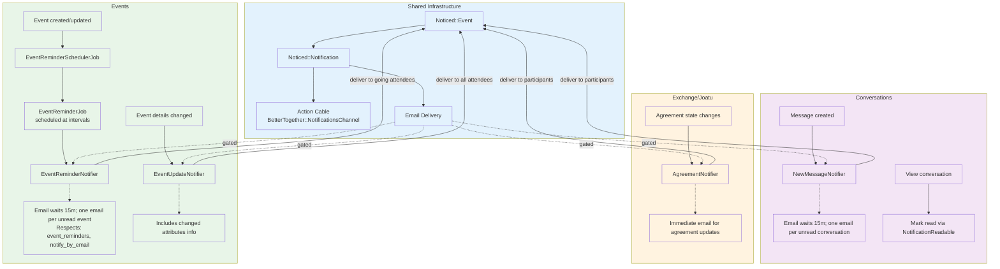

**Diagram Files:**
- 📊 [Mermaid Source](../../diagrams/source/notifications_flow.mmd) - Editable source
- 🖼️ [PNG Export](../../diagrams/exports/png/notifications_flow.png) - High-resolution image
- 🎯 [SVG Export](../../diagrams/exports/svg/notifications_flow.svg) - Vector graphics

## Building Blocks

- Event: `Noticed::Event` rows store the notification payload, including `record_id`, `record_type`, and JSON `params` (often referencing related records by GlobalID).
- Notification: `Noticed::Notification` rows join an Event to a `recipient` (a `BetterTogether::Person`) and track `read_at`/`seen_at` timestamps.
- Delivery channels:
  - Action Cable: via `BetterTogether::NotificationsChannel`, pushing `{ title, body, url, unread_count }`.
  - Email: via specific mailers; some notifiers gate emails with user preferences and/or dedupe logic.

## Notifier Inventory & Triggers

- NewMessageNotifier (`app/notifiers/better_together/new_message_notifier.rb`)
  - Trigger: when a message is created in `MessagesController#create`.
  - Recipients: all conversation participants except the sender.
  - Delivery: Action Cable immediately; Email deferred (`wait 15.minutes`) and only if `send_email_notification?`.
  - Email dedupe grouping: sends at most one email per unread conversation per recipient (but allows multiple on-site notifications).

- Joatu::MatchNotifier (`app/notifiers/better_together/joatu/match_notifier.rb`)
  - Triggers:
    - After creating an Offer/Request: `BetterTogether::Joatu::Exchange#notify_matches` dispatches to both creators for each match.
    - After creating a ResponseLink: `BetterTogether::Joatu::ResponseLink#notify_match` dispatches for direct Offer→Request or Request→Offer responses (symmetric).
  - Recipients: Both creators for automatic matches; source creator for direct responses.
  - Delivery: Action Cable + Email (if recipient has email and allows email).
  - Dedupe: Prevents creating a second unread notification for the same Offer/Request pair and recipient (custom `deliver` override + `should_notify?`).

- Joatu::AgreementNotifier (`app/notifiers/better_together/joatu/agreement_notifier.rb`)
  - Trigger: Agreement creation (`after_create_commit`).
  - Recipients: Offer and Request creators.
  - Delivery: Action Cable + Email (subject to recipient `notification_preferences`).

- Joatu::AgreementStatusNotifier (`app/notifiers/better_together/joatu/agreement_status_notifier.rb`)
  - Trigger: Agreement status change (`after_update_commit` when `status` changed).
  - Recipients: Offer and Request creators.
  - Delivery: Action Cable + Email (subject to recipient `notification_preferences`).

- PageAuthorshipNotifier (`app/notifiers/better_together/page_authorship_notifier.rb`)
  - Trigger: author added/removed on a Page (via `BetterTogether::Authorship`).
  - Recipients: all current page authors.
  - Delivery: Action Cable immediately; Email deferred (`wait 15.minutes`) and only if `send_email_notification?`.
  - Email dedupe grouping: one email per unread page per recipient (on-site notifications may still accumulate).

- EventReminderNotifier (`app/events/better_together/event_reminder_notifier.rb`)
  - Trigger: `EventReminderJob` execution 1 hour before event start time (scheduled by `EventReminderSchedulerJob`).
  - Recipients: Event creator and interested community members.
  - Delivery: Action Cable immediately; Email deferred and only if `send_email_notification?`.
  - Email content: Localized event details, start time, location, and community context.
  - Delivery: Action Cable immediately; Email deferred (`wait 15.minutes`) and only if `send_email_notification?`.
  - Email dedupe grouping: one email per unread page per recipient (on-site notifications may still accumulate).

## Marking Notifications as Read

- Concern: `BetterTogether::NotificationReadable` (`app/controllers/concerns/better_together/notification_readable.rb`)
  - `mark_notifications_read_for_record(record)`: generic record-based read marker using `noticed_events.record_id`.
  - `mark_notifications_read_for_event_records(event_class, record_ids)`: batch mark for a specific Noticed event type and list of record IDs.
  - `mark_match_notifications_read_for(record)`: efficiently marks unread `MatchNotifier` notifications for an Offer/Request by matching the record’s GlobalID in `params`.
- Usage:
  - Joatu controllers include the concern and mark `MatchNotifier` read on Offer/Request show; mark Agreement-related notifications read on Agreement show.
  - ConversationsController uses the concern to mark `NewMessageNotifier` notifications read when viewing a conversation with messages.
  - EventsController uses the concern to mark `EventReminderNotifier` notifications read when viewing event details.
  - NotificationsController uses the concern for record-based marking.

## Event Notifications

### EventReminderNotifier
- Notifier Class: `BetterTogether::EventReminderNotifier` (Noticed event in `app/events/better_together/event_reminder_notifier.rb`)
- Purpose: Send event reminders to interested participants
- Trigger: `EventReminderJob` executes 1 hour before event start_time for events with notifications enabled
- Recipients: Event creator and any interested members (those who've shown interest in the event)
- Record: BetterTogether::Event being reminded about
- Params: `{ event: <Event instance>, host_community: <Community instance> }`

### Event Email System
- Mailer: EventMailer (`app/mailers/better_together/event_mailer.rb`)
- Template: `event_reminder.html.erb` (I18n localized subject and body)
- Email Logic:
  - Check `recipient.send_email_notification?` preference
  - Use recipient's preferred locale for rendering
  - Subject/body from I18n keys: `better_together.event_mailer.event_reminder.subject`/`.body`
  - Include event title, start time (localized), location, and community context
  - Handle unread notification count in message
- Delivery: Action Cable immediately; Email deferred and only if email notifications enabled
- Email batching: Multiple events can trigger separate notifications (no artificial grouping)

### Event Reminder Scheduling
- Background Job: `EventReminderSchedulerJob` (runs periodically via cron/scheduler)
- Purpose: Schedule `EventReminderJob` instances for upcoming events
- Logic: Query events with notifications enabled that start in ~1 hour, schedule individual reminder jobs
- Queue: `:notifications` with retry configuration
- Error Handling: Individual event reminder failures don't affect batch processing

### Event Notification Integration
- Triggers: 
  - Event creation with notifications enabled: schedule future reminder
  - Event update: reschedule reminder if start_time changes
  - Event deletion: cancel pending reminder jobs
- Action Cable: Real-time notifications via `BetterTogether::NotificationsChannel`
- Read Marking: Event-specific notifications marked read when viewing event details

### Event Anti-Spam Measures
- One reminder per event per recipient (no duplicate scheduling)
- Only events with explicitly enabled notifications trigger reminders
- Respects user email preferences (`send_email_notification?`)
- Failed reminders logged but don't retry indefinitely
- Reminder scheduling only occurs for future events (past events ignored)

## Recipient Preferences & Email

- Email delivery is gated:
  - EventReminderNotifier: `recipient.send_email_notification?` must be true for email delivery
  - NewMessageNotifier and PageAuthorshipNotifier: `recipient.notify_by_email` must be true, and an internal `should_send_email?` ensures one email per unread conversation/page.
  - AgreementNotifier and AgreementStatusNotifier: `recipient.notification_preferences['notify_by_email']` (and presence of email) must be true.
  - MatchNotifier: `recipient_has_email?` checks email and preferences.

## Data & Integrity

- Noticed tables: `noticed_events` (indexed by `record_type, record_id`), `noticed_notifications` (indexed by `event_id`, `recipient`).
- Exchange dedupe: MatchNotifier prevents duplicate unread notifications for the same Offer/Request pair per recipient.
- Agreements consistency: accepted/rejected transitions guarded; unique constraints ensure one Agreement per Offer/Request pair and at most one accepted per side.

## Known Behaviors / Considerations

- NewMessage/PageAuthorship email dedupe does not dedupe on-site notifications; MatchNotifier dedupes on-site notifications as well (preventing duplicate unread for the pair).
- EventReminderNotifier sends one notification per event per recipient; scheduling prevents duplicate reminders for the same event.
- Event reminders are only sent for events with notifications explicitly enabled and future start times.
- Unread count included in Action Cable payload is computed per-recipient at send time.
- JSONB params store reference GlobalIDs for Offer/Request; read markers account for both direct string and ActiveJob `_aj_globalid` formats.

## Opportunities for Improvement

- Consider adding on-site dedupe/grouping to NewMessage/PageAuthorship similar to MatchNotifier if desired.
- Aggregate match notifications when many pairs are found at once.
- Add per-notifier throttling windows (e.g., rate limit bursty events via job scheduling).
- Event reminders could be enhanced with configurable timing (currently fixed at 1 hour before).


# Better Together Security & Protection System

## Overview

The Better Together Community Engine implements a comprehensive, multi-layered security system designed to protect community platforms against common web application threats, data breaches, and malicious attacks. The system combines **authentication**, **authorization**, **encryption**, **rate limiting**, **input validation**, and **secure communications** to create a robust defense-in-depth security posture.

## Process Flow Diagram

```mermaid
flowchart TD
    %% Security & Protection System Process Flow
    %% Better Together Community Engine Rails

    START[Incoming Request] --> BOT_CHECK{Bot Detection}
    
    %% Bot and Attack Detection Layer
    BOT_CHECK -->|Legitimate Request| RATE_LIMIT[Rack::Attack Rate Check]
    BOT_CHECK -->|Suspicious Bot| BOT_BLOCK[Block Request - 503]
    
    %% Rate Limiting & Attack Prevention
    RATE_LIMIT --> IP_THROTTLE{IP Rate Check 300/5min}
    IP_THROTTLE -->|Within Limits| PATH_CHECK[Request Path Analysis]
    IP_THROTTLE -->|Rate Exceeded| RATE_BLOCK[Rate Limit Block - 503]
    
    PATH_CHECK --> PHP_CHECK{PHP File Request?}
    PHP_CHECK -->|Yes| PHP_BLOCK[Block PHP Request - 503]
    PHP_CHECK -->|No| ATTACK_PATTERN[Attack Pattern Check]
    
    ATTACK_PATTERN --> EXPLOIT_CHECK{Exploit Pattern?}
    EXPLOIT_CHECK -->|Detected| FAIL2BAN[Fail2Ban Progressive Block]
    EXPLOIT_CHECK -->|Clean| SSL_CHECK[SSL/TLS Validation]
    
    %% SSL/TLS and Transport Security
    SSL_CHECK --> HTTPS_FORCE{Force SSL Enabled?}
    HTTPS_FORCE -->|Yes, HTTP| SSL_REDIRECT[Redirect to HTTPS]
    HTTPS_FORCE -->|HTTPS or Disabled| SECURE_HEADERS[Set Security Headers]
    
    SECURE_HEADERS --> HSTS[HTTP Strict Transport Security]
    HSTS --> CSP_HEADERS[Content Security Policy Headers]
    CSP_HEADERS --> XSS_PROTECTION[X-XSS-Protection Headers]
    
    %% Authentication Layer
    XSS_PROTECTION --> AUTH_CHECK{Authentication Required?}
    AUTH_CHECK -->|Yes| DEVISE_AUTH[Devise Authentication]
    AUTH_CHECK -->|No| PROCEED[Continue to Authorization]
    
    DEVISE_AUTH --> SESSION_CHECK{Valid Session?}
    SESSION_CHECK -->|No| LOGIN_REDIRECT[Redirect to Login]
    SESSION_CHECK -->|Yes| MFA_CHECK{2FA Enabled?}
    
    MFA_CHECK -->|Yes| TOTP_VERIFY[TOTP Token Verification]
    MFA_CHECK -->|No| PROCEED
    TOTP_VERIFY -->|Invalid| MFA_FAIL[2FA Failure - Block]
    TOTP_VERIFY -->|Valid| PROCEED
    
    %% Authorization Layer
    PROCEED --> PUNDIT_AUTH[Pundit Authorization Check]
    PUNDIT_AUTH --> ROLE_CHECK{Role-Based Permissions}
    ROLE_CHECK -->|Authorized| DATA_ACCESS[Access Granted]
    ROLE_CHECK -->|Unauthorized| ACCESS_DENY[Access Denied - 403]
    
    %% Data Protection Layer
    DATA_ACCESS --> ENCRYPT_CHECK{Sensitive Data?}
    ENCRYPT_CHECK -->|Yes| AR_ENCRYPT[Active Record Encryption]
    ENCRYPT_CHECK -->|No| VALIDATION[Input Validation]
    
    AR_ENCRYPT --> DB_ENCRYPT[Database Field Encryption]
    DB_ENCRYPT --> VALIDATION
    
    %% Input Validation & Output Protection
    VALIDATION --> PARAM_CHECK[Strong Parameters Validation]
    PARAM_CHECK --> XSS_FILTER[XSS Content Filtering]
    XSS_FILTER --> SQL_PROTECT[SQL Injection Protection]
    
    SQL_PROTECT --> SAFE_RENDER{Rendering Content?}
    SAFE_RENDER -->|Yes| HTML_SANITIZE[HTML Sanitization]
    SAFE_RENDER -->|No| RESPONSE[Generate Response]
    
    HTML_SANITIZE --> CONTENT_POLICY[Content Security Policy Enforcement]
    CONTENT_POLICY --> RESPONSE
    
    %% Response Security
    RESPONSE --> SECURE_RESPONSE[Apply Security Headers]
    SECURE_RESPONSE --> CACHE_CONTROL[Cache Control Headers]
    CACHE_CONTROL --> FINAL_RESPONSE[Return Secure Response]
    
    %% Error Handling
    BOT_BLOCK --> ERROR_LOG[Security Log Entry]
    RATE_BLOCK --> ERROR_LOG
    PHP_BLOCK --> ERROR_LOG
    FAIL2BAN --> ERROR_LOG
    MFA_FAIL --> ERROR_LOG
    ACCESS_DENY --> ERROR_LOG
    
    ERROR_LOG --> MONITORING[Security Monitoring Alert]
    MONITORING --> INCIDENT_RESPONSE[Incident Response Protocol]

    %% Styling
    classDef protection fill:#ffebee
    classDef transport fill:#e8f5e8
    classDef auth fill:#e3f2fd
    classDef authz fill:#f3e5f5
    classDef data fill:#fff3e0
    classDef validation fill:#f1f8e9
    classDef response fill:#fafafa
    classDef error fill:#ffe0b2

    class START,BOT_CHECK,RATE_LIMIT,IP_THROTTLE,PATH_CHECK,PHP_CHECK,ATTACK_PATTERN,EXPLOIT_CHECK,BOT_BLOCK,RATE_BLOCK,PHP_BLOCK,FAIL2BAN protection
    class SSL_CHECK,HTTPS_FORCE,SSL_REDIRECT,SECURE_HEADERS,HSTS,CSP_HEADERS,XSS_PROTECTION transport
    class AUTH_CHECK,DEVISE_AUTH,SESSION_CHECK,LOGIN_REDIRECT,MFA_CHECK,TOTP_VERIFY,MFA_FAIL auth
    class PROCEED,PUNDIT_AUTH,ROLE_CHECK,DATA_ACCESS,ACCESS_DENY authz
    class ENCRYPT_CHECK,AR_ENCRYPT,DB_ENCRYPT data
    class VALIDATION,PARAM_CHECK,XSS_FILTER,SQL_PROTECT,SAFE_RENDER,HTML_SANITIZE,CONTENT_POLICY validation
    class RESPONSE,SECURE_RESPONSE,CACHE_CONTROL,FINAL_RESPONSE response
    class ERROR_LOG,MONITORING,INCIDENT_RESPONSE error
```

**Diagram Files:**
- 📊 [Mermaid Source](../../diagrams/source/security_protection_flow.mmd) - Editable source
- 🖼️ [PNG Export](../../diagrams/exports/png/security_protection_flow.png) - High-resolution image
- 🎯 [SVG Export](../../diagrams/exports/svg/security_protection_flow.svg) - Vector graphics

## Architecture Components

### 1. Authentication & Session Security

#### Devise Authentication Framework
- **Configuration**: `config/initializers/devise.rb`
- **Secret Management**: Environment-based secret keys with fallback to Rails credentials
- **Paranoid Mode**: Enabled to prevent user enumeration attacks
- **Password Security**: bcrypt with configurable stretching (1 for tests, 12 for production)
- **Email Security**: Case-insensitive keys, whitespace stripping, email validation

```ruby
# Core security configurations
config.secret_key = ENV.fetch('DEVISE_SECRET') { Rails.application.credentials.secret_key_base }
config.pepper = ENV.fetch('DEVISE_PEPPER', nil)
config.paranoid = true  # Prevents user enumeration attacks
config.stretches = Rails.env.test? ? 1 : 12  # bcrypt cost factor
```

#### Session Management
- **Session Store**: Cookie-based sessions with secure configurations
- **Production Security**: `secure: Rails.env.production?` for HTTPS-only cookies
- **Session Keys**: Environment-specific session key naming
- **CSRF Protection**: Full Rails CSRF token validation enabled

```ruby
# Production session configuration
config.session_store :cookie_store, 
                     key: '_better_together_session', 
                     secure: Rails.env.production?
```

#### Password Security
- **Notification System**: Email notifications for password changes and email modifications
- **Confirmation Workflows**: Configurable account confirmation periods
- **Reset Security**: Secure password reset token generation and expiration
- **Lockout Protection**: Account lockout after failed authentication attempts

### 2. Authorization & Access Control

#### Pundit Policy Framework
- **Policy-Based Authorization**: Comprehensive Pundit policy system
- **Base Policy**: `ApplicationPolicy` with deny-by-default approach
- **Resource-Specific Policies**: Individual policies per model (User, Page, Event, etc.)
- **Scope-Based Access**: Policy scopes for collection filtering
- **Context-Aware Authorization**: User, agent (person), and record context in policies

```ruby
class ApplicationPolicy
  def initialize(user, record)
    @user = user
    @agent = user&.person
    @record = record
  end

  # Default deny-all approach
  def index?; false; end
  def show?; false; end
  def create?; false; end
  def update?; false; end
  def destroy?; false; end
end
```

#### Controller Authorization
- **Automatic Verification**: `after_action :verify_authorized` in controllers
- **Resource Authorization**: Pre-action authorization checks
- **Exception Handling**: Graceful handling of `Pundit::NotAuthorizedError`
- **API Security**: JSON API integration with Pundit error handling

#### Role-Based Access Control (RBAC)
- **Member Permissions**: Cached role and permission checking system
- **Resource Permissions**: Granular resource-specific permissions
- **Platform Roles**: Platform manager roles with elevated permissions
- **Permission Caching**: 12-hour cache for authorization decisions

### 3. Data Encryption & Privacy

#### Active Record Encryption
- **Encrypted Models**: Message content, conversation titles, platform invitations
- **Deterministic Encryption**: Searchable encrypted fields where needed
- **Rich Text Encryption**: Action Text content encrypted at rest
- **Migration Support**: Graceful handling of unencrypted legacy data

```ruby
# Message encryption example
class Message < ApplicationRecord
  has_rich_text :content, encrypted: true
end

class Conversation < ApplicationRecord
  encrypts :title, deterministic: true  # Allows searching
end
```

#### Encryption Configuration
- **Rails Master Key**: Environment-based encryption key management
- **Production Settings**: `support_unencrypted_data` for gradual migration
- **Extended Queries**: `extend_queries` for encrypted field querying
- **Key Derivation**: Secure key derivation for encryption operations

```ruby
# Production encryption settings
config.active_record.encryption.support_unencrypted_data = true
config.active_record.encryption.extend_queries = true
```

### 4. Network Security & Rate Limiting

#### Rack::Attack Protection
- **Configuration**: `config/initializers/rack_attack.rb`
- **Redis Backend**: Distributed rate limiting across application instances
- **Multi-Layer Protection**: IP-based, endpoint-specific, and user-specific limits
- **Attack Detection**: Automated blocking of suspicious activity patterns

**Rate Limiting Rules:**
- **General Requests**: 300 requests per 5 minutes per IP
- **Authentication**: 5 login attempts per 20 seconds per IP
- **Account-Specific**: 5 login attempts per 20 seconds per email
- **Fail2Ban**: Progressive blocking for repeated violations

```ruby
# Request throttling configuration
throttle('req/ip', limit: 300, period: 5.minutes, &:ip)

# Authentication protection  
throttle('logins/ip', limit: 5, period: 20.seconds) do |req|
  req.ip if req.path.include?('/users/sign-in') && req.post?
end
```

#### Attack Prevention
- **PHP File Blocking**: Automatic blocking of .php file requests
- **WordPress Protection**: Detection and blocking of WordPress-specific attack patterns
- **Penetration Testing Detection**: `/etc/passwd` and common exploit pattern detection
- **Progressive Blocking**: Fail2Ban-style escalating blocks (3 attempts, 10-minute window, 5-minute ban)

#### Monitoring Safelist
- **Uptime Monitoring**: Whitelisted monitoring service user agents
- **Health Checks**: Platform health monitoring without rate limiting
- **User Agent Validation**: Specific monitoring bot allowlists

### 5. Transport Security & HTTPS

#### SSL/TLS Configuration  
- **Force SSL**: Environment-configurable HTTPS enforcement (`FORCE_SSL`)
- **SSL Assumption**: Reverse proxy SSL termination support (`ASSUME_SSL`)
- **Secure Cookies**: Production-only secure cookie flags
- **HSTS Headers**: HTTP Strict Transport Security for browser enforcement

```ruby
# Production SSL configuration
config.force_ssl = ENV.fetch('FORCE_SSL', false)
config.assume_ssl = ENV.fetch('ASSUME_SSL', false)
```

#### Email Security
- **SMTP TLS**: Configurable TLS encryption for email delivery
- **SSL Verification**: OpenSSL certificate verification options
- **STARTTLS Support**: Opportunistic encryption for email connections
- **Certificate Validation**: Configurable SSL certificate verification modes

### 6. Input Validation & XSS Protection

#### CSRF Protection
- **Rails CSRF**: `protect_from_forgery with: :exception`
- **Token Management**: Automatic CSRF token generation and validation
- **AJAX Support**: CSRF token handling for dynamic requests
- **Clean-up Strategy**: Devise CSRF token cleanup on authentication

#### Content Security Policy (CSP)
- **Header Configuration**: `config/initializers/content_security_policy.rb`
- **Nonce Generation**: Session-based nonce generation for inline scripts
- **Import Map Integration**: Secure JavaScript module loading
- **Development Overrides**: Hot-reload support without compromising security

```ruby
# CSP nonce generation
config.content_security_policy_nonce_generator = ->(request) { 
  request.session.id.to_s 
}
config.content_security_policy_nonce_directives = %w(script-src)
```

#### HTML Sanitization
- **Action Text Integration**: Automatic HTML sanitization for rich text content
- **Allow-lists**: Strict HTML tag and attribute allow-lists
- **XSS Prevention**: Rails auto-escaping throughout view templates
- **External Link Processing**: Automatic external link icon addition with security headers

### 7. Privacy & Platform Security

#### Platform Access Control
- **Privacy Levels**: Public vs. private platform configurations
- **Invitation System**: Token-based platform access for private instances
- **Session Validation**: Invitation token validation and expiration
- **Redirect Protection**: Secure redirection for unauthorized access attempts

```ruby
def check_platform_privacy
  return if helpers.host_platform.privacy_public?
  return if current_user
  return unless BetterTogether.user_class.any?
  return if valid_platform_invitation_token_present?

  flash[:error] = I18n.t('globals.platform_not_public')
  redirect_to new_user_session_path(locale: I18n.locale)
end
```

#### Data Access Controls
- **Conversation Security**: Message encryption with participant-only access
- **Profile Privacy**: User profile visibility controls
- **Content Authorization**: Page and post visibility based on publication status
- **Search Filtering**: Authorization-aware search result filtering

### 8. API Security

#### JSON API Protection
- **CSRF Handling**: Conditional CSRF protection for JSON requests
- **Authentication**: API-specific authentication strategies
- **Authorization Integration**: Pundit policy enforcement for API endpoints
- **Error Handling**: Secure error responses without information disclosure

```ruby
class ApiController < ApplicationController
  protect_from_forgery with: :exception, unless: -> { request.format.json? }
end
```

#### Rate Limiting
- **API-Specific Limits**: Separate rate limits for API endpoints
- **Authentication Limits**: Stricter limits for authentication endpoints
- **Resource Protection**: Per-resource rate limiting for expensive operations

### 9. Background Job Security

#### Sidekiq Security
- **Redis Authentication**: Secure Redis connection configuration
- **Queue Isolation**: Namespace-based queue separation
- **Job Authentication**: Worker-level authentication and authorization
- **Error Handling**: Secure error logging without sensitive data exposure

#### Sensitive Data Processing
- **Encrypted Queues**: Encryption for sensitive job parameters
- **Temporary Storage**: Secure handling of temporary sensitive data
- **Log Scrubbing**: Automatic removal of sensitive data from job logs

### 10. Monitoring & Incident Response

#### Security Monitoring
- **Attack Detection**: Real-time monitoring of Rack::Attack blocks
- **Authentication Monitoring**: Failed login attempt tracking
- **Access Pattern Analysis**: Unusual access pattern detection
- **Performance Impact**: Security measure performance monitoring

#### Logging & Auditing
- **Security Events**: Comprehensive logging of security-related events
- **User Activity**: Audit trails for sensitive user actions
- **System Access**: Administrative action logging
- **Data Scrubbing**: Sensitive parameter scrubbing in logs

#### Brakeman Security Analysis
- **Automated Scanning**: `bundle exec brakeman --quiet --no-pager`
- **High-Confidence Fixes**: Immediate remediation of high-confidence vulnerabilities
- **Continuous Integration**: Pre-deployment security scanning
- **Vulnerability Tracking**: Systematic tracking and resolution of security issues

### 11. Development Security

#### Secure Development Practices
- **Code Review Requirements**: Security-focused code review processes
- **Static Analysis**: Brakeman integration in development workflow
- **Dependency Management**: Regular security updates for gems and dependencies
- **Environment Isolation**: Separate security configurations per environment

#### Security Testing
- **Penetration Testing**: Regular security assessment procedures
- **Vulnerability Scanning**: Automated vulnerability detection
- **Security Regression Testing**: Preventing security feature regressions
- **Threat Modeling**: Systematic threat analysis for new features

### 12. Infrastructure Security

#### Deployment Security
- **Environment Variables**: Secure secret management via environment variables
- **Docker Security**: Container-based deployment with security hardening
- **Reverse Proxy**: Nginx/Apache security configuration
- **Database Security**: PostgreSQL security hardening and encryption

#### Backup Security
- **Encrypted Backups**: Database backup encryption
- **Access Controls**: Backup access restriction and audit trails
- **Recovery Procedures**: Secure data recovery processes
- **Retention Policies**: Secure data retention and disposal

#### Cloudflare Integration
- **DDoS Protection**: Cloudflare-based DDoS mitigation
- **WAF Rules**: Web Application Firewall configuration
- **SSL Certificates**: Automated SSL certificate management
- **DNS Security**: Secure DNS configuration and DNSSEC

### 13. Compliance & Privacy Regulations

#### Data Protection
- **GDPR Compliance**: European data protection regulation compliance
- **Data Minimization**: Collection and processing only necessary data
- **Right to Erasure**: Data deletion and anonymization procedures
- **Consent Management**: User consent tracking and management

#### Privacy Controls
- **Data Portability**: User data export capabilities
- **Access Controls**: User data access and modification controls
- **Retention Policies**: Automatic data purging and archival
- **Third-Party Integration**: Privacy-aware third-party service integration

## Security Configuration Checklist

### Production Deployment Security
**Essential Security Configurations:**
- ✅ **SSL/TLS**: `force_ssl = true` with valid SSL certificates
- ✅ **Secure Cookies**: `secure: true` for production cookie configuration
- ✅ **CSRF Protection**: Full Rails CSRF protection enabled
- ✅ **Rate Limiting**: Rack::Attack configured with Redis backend
- ✅ **Authentication**: Devise with bcrypt and proper stretching factors
- ✅ **Authorization**: Pundit policies for all resources
- ✅ **Encryption**: Active Record Encryption for sensitive data
- ✅ **CSP Headers**: Content Security Policy with nonce generation
- ✅ **Security Monitoring**: Comprehensive logging and alerting
- ✅ **Environment Isolation**: Separate configurations per environment

### Security Incident Response
**Response Procedures:**
- ✅ **Detection**: Automated monitoring and alerting systems
- ✅ **Assessment**: Rapid security incident assessment protocols
- ✅ **Containment**: Emergency response procedures for security breaches
- ✅ **Recovery**: Secure system restoration and data recovery procedures
- ✅ **Communication**: Security incident communication protocols
- ✅ **Post-Incident**: Security incident post-mortem and improvement processes

## Process Flow Summary

The security system operates through several interconnected protection layers:

1. **Request Processing**: Rate limiting → SSL termination → CSRF validation → Authentication check → Authorization verification
2. **Data Protection**: Input validation → XSS prevention → Data encryption → Secure storage → Audit logging
3. **Access Control**: Authentication → Role verification → Resource authorization → Policy enforcement → Permission caching
4. **Attack Prevention**: Bot detection → Rate limiting → Attack pattern recognition → Progressive blocking → Incident response
5. **Privacy Protection**: Data encryption → Access controls → Audit trails → Compliance monitoring → Privacy rights enforcement

This comprehensive security system ensures that Better Together applications can safely handle sensitive community data while protecting against modern web application threats, maintaining user privacy, and meeting regulatory compliance requirements. The defense-in-depth approach provides multiple security layers, ensuring that if one layer is compromised, others continue to protect the application and its users.


 # Models & Concerns Overview

 This document summarizes the core models in the Better Together Community Engine,
 the concerns (mix-ins) they include, and illustrates how they relate.

 ## 1. Models by Domain

 ### A. Core & Identity

 | Model                | Purpose                                  | Concerns / Mix-ins                                            |
 |----------------------|------------------------------------------|---------------------------------------------------------------|
 | `BetterTogether::Person`       | A human participant                      | `Author`, `Contactable`, `FriendlySlug`, `Identifier`, `Identity`,<br>`Member`, `PrimaryCommunity`, `Privacy`, `Viewable`, `RemoveableAttachment` |
 | `BetterTogether::User`         | Devise User linked via `Identification` | `DeviseUser`                                                 |
 | `BetterTogether::Identification` | Polymorphic join (`agent`)             | `Identity`                                                  |

 ### B. Community & Platform

 | Model                           | Purpose                                | Concerns / Mix-ins                                          |
 |---------------------------------|----------------------------------------|-------------------------------------------------------------|
 | `BetterTogether::Community`     | Community instance                     | `Contactable`, `Host`, `Identifier`, `BuildingConnections`, `Joinable`, `Protected`, `Privacy`, `Permissible`, `RemoveableAttachment` |
 | `BetterTogether::Platform`      | Top-level platform                     | `Contactable`, `Host`, `Identifier`, `Joinable`, `Protected`, `Privacy`, `Permissible` |
 | `BetterTogether::PersonCommunityMembership` | Person ↔ Community join      | `Membership`                                               |
 | `BetterTogether::PersonPlatformMembership`  | Person ↔ Platform join       | `Membership`                                               |

 ### C. Content & Navigation

 | Model                | Purpose                                      | Concerns / Mix-ins                     |
 |----------------------|----------------------------------------------|----------------------------------------|
 | `BetterTogether::Post`                 | Blog-style posts                         | `Authorable`, `FriendlySlug`, `Categorizable`, `Identifier`, `Privacy`, `Publishable` |
 | `BetterTogether::Page`                 | CMS pages                                | `Authorable`, `FriendlySlug`, `Categorizable`, `Identifier`, `Privacy`, `Publishable` |
 | `BetterTogether::Category`             | Category buckets                         | `Labelable`, `Positioned`             |
 | `BetterTogether::Categorization`       | Join table for content categories        | —                                      |
 | `BetterTogether::NavigationArea`       | Menu container                           | `Positioned`, `Protected`             |
 | `BetterTogether::NavigationItem`       | Menu item/link                           | `Positioned`, `Protected`, `Visible`  |

 ### D. Communication

 | Model                    | Purpose                                  | Concerns / Mix-ins |
 |--------------------------|------------------------------------------|--------------------|
 | `BetterTogether::Conversation`           | Message thread                           | —                  |
 | `BetterTogether::ConversationParticipant`| Person ↔ Conversation join                | —                  |
 | `BetterTogether::Message`                | Chat messages                            | —                  |
 | `BetterTogether::Comment`                | Comments on content                      | —                  |

 ### E. Events & Calendar

 | Model                             | Purpose                                   | Concerns / Mix-ins                                                   |
 |-----------------------------------|-------------------------------------------|----------------------------------------------------------------------|
 | `BetterTogether::Event`           | Scheduled events                          | `Attachments::Images`, `Categorizable`, `Creatable`, `FriendlySlug`, `Geospatial::One`, `Locatable::One`, `Identifier`, `Privacy`, `TrackedActivity`, `Viewable` |
 | `BetterTogether::EventCategory`   | Event ↔ Category join                     | —                                                                    |
 | `BetterTogether::Calendar`        | Calendar container                        | —                                                                    |
 | `BetterTogether::CalendarEntry`   | Single calendar entry                     | —                                                                    |

 ### F. Geography & Infrastructure (abbreviated)

 | Model                                   | Purpose                           | Concerns / Mix-ins               |
 |-----------------------------------------|-----------------------------------|----------------------------------|
 | `BetterTogether::Geography::Continent` …| Geospatial taxonomy               | —                                |
 | `BetterTogether::Geography::Map` …      | Map definitions                   | —                                |
 | `BetterTogether::Infrastructure::Building` …| Physical infrastructure       | `BuildingConnections`            |

 ### G. Metrics & Analytics (abbreviated)

 | Model                                  | Purpose                            | Concerns / Mix-ins |
 |----------------------------------------|------------------------------------|--------------------|
 | `BetterTogether::Metrics::PageView` …  | Track user activity                | —                  |
 | `BetterTogether::Metrics::LinkClick` … | Track link clicks                  | —                  |

 ### H. Contact & Address (abbreviated)

 | Model                          | Purpose                       | Concerns / Mix-ins |
 |--------------------------------|-------------------------------|--------------------|
 | `BetterTogether::Address`      | Physical / mailing address    | `Contactable`      |
 | `BetterTogether::ContactDetail`| Generic contact points        | `Contactable`      |

 ## 2. Mermaid Diagram

 The following Mermaid diagram illustrates main associations and concerns.

 ```mermaid
 %% Models & Concerns class diagram
 classDiagram
   direction TB

   %% Core identity
   class Person {
     <<Author,Contactable,Identity,Member,PrimaryCommunity,
       FriendlySlug,Privacy,Viewable,RemoveableAttachment>>
   }
   class User {
     <<DeviseUser>>
   }
   class Identification
   Person "1" o-- "1" Identification : has_one
   User "1" <-- Identification : agent

   %% Community & Platform
   class Community {
     <<Contactable,Host,Joinable,Identifier,
       Protected,Privacy,Permissible,RemoveableAttachment>>
   }
   class Platform {
     <<Contactable,Host,Joinable,Identifier,
       Protected,Privacy,Permissible>>
   }
   class PersonCommunityMembership {
     <<Membership>>
   }
   class PersonPlatformMembership {
     <<Membership>>
   }
   PersonCommunityMembership *-- Community
   PersonCommunityMembership *-- Person
   PersonPlatformMembership *-- Platform
   PersonPlatformMembership *-- Person
   Community o-- PersonCommunityMembership
   Platform o-- PersonPlatformMembership
   Person o-- PersonCommunityMembership
   Person o-- PersonPlatformMembership

   %% Post & Page
   class Post {
     <<Authorable,Categorizable,Identifier,Privacy,Publishable,
       FriendlySlug>>
   }
   class Page {
     <<Authorable,Categorizable,Identifier,Privacy,Publishable,
       FriendlySlug>>
   }
   class Category
   class Categorization
   Post *-- Categorization
   Category *-- Categorization
   Page *-- Categorization

   %% Conversations
   class Conversation
   class ConversationParticipant
   class Message
   Conversation "1" o-- "*" ConversationParticipant
   ConversationParticipant "*" o-- "1" Person
   Conversation "1" o-- "*" Message
   Message "*" o-- "1" Person : sender

   %% Events & Calendar
   class Event {
     <<Attachments::Images,Categorizable,Creatable,
       FriendlySlug,Geospatial::One,Locatable::One,Identifier,
       Privacy,TrackedActivity,Viewable>>
   }
   class EventCategory
   class Calendar
   class CalendarEntry
   Event *-- EventCategory
   Calendar *-- CalendarEntry
   CalendarEntry --> Event : entry

   %% Infrastructure (abbreviated)
   class Building {
     <<BuildingConnections>>
   }
   class Floor
   class Room
   Building "1" o-- "*" Floor
   Floor "1" o-- "*" Room

   %% Contact
   class Address
   class ContactDetail
   Person "1" o-- "*" ContactDetail
   Community "1" o-- "*" ContactDetail
 ```

 **Diagram file:** [`docs/diagrams/source/models_and_concerns_diagram.mmd`](../../diagrams/source/models_and_concerns_diagram.mmd)


# Polymorphic Associations & Single Table Inheritance (STI)

This document outlines all polymorphic Active Record associations and Single Table Inheritance (STI) usage in the Better Together Community Engine.

---

## 1. Polymorphic Associations

Polymorphic associations allow a model to belong to more than one other model on a single association.

| Model                             | Association           | Interface Name  | Notes                                                    |
|-----------------------------------|-----------------------|-----------------|----------------------------------------------------------|
| **Authorship**                    | `belongs_to :authorable` | authorable    | Connects author (Person) to various content types        |
|                                   | `belongs_to :author`    | author        | Points to `BetterTogether::Person`                       |
| **ContactDetail**                 | `belongs_to :contactable` | contactable  | Stores contact info (phone, email, address, etc.)       |
| **Identification**                | `belongs_to :agent`      | agent         | Joins agent (User) polymorphically                       |
|                                   | `belongs_to :identity`   | identity      | Connects identity (Person, Community, etc.)              |
| **ResourcePermission**¹           | _(via `Resourceful`)_    | resource_type | Validates permitted actions against various models      |
| **Metrics::Download**             | `belongs_to :downloadable` | downloadable| Tracks file download events for any model               |
| **Upload**²                       | _ActiveStorage_         | record        | Uploaded files attachable to any record                  |

_¹ ResourcePermission uses the `Resourceful` concern to work with a polymorphic `resource_type` column._
_² Upload delegates to `has_one_attached :file`, backed by Active Storage’s polymorphic attachments._

---

## 2. Single Table Inheritance (STI)

STI allows multiple subclasses to share a single database table, distinguished by a `type` column.

| Base Class                        | Subclasses                              | Table Name                         |
|-----------------------------------|-----------------------------------------|------------------------------------|
| **BetterTogether::Content::Block**| Html, Css, Image, Hero, PageBlock, PlatformBlock, RichText, Template | `better_together_content_blocks` |

_Content blocks are defined via STI; each block type extends `Content::Block` and is rendered according to its subclass._

---

## 3. Further Exploration

- See `app/models/better_together/authorship.rb` for Authorship associations.
- See `app/models/better_together/contact_detail.rb` for ContactDetail.
- See `app/models/better_together/identification.rb` for polymorphic identity.
- See `app/models/concerns/better_together/resourceful.rb` for ResourcePermission’s concern.
- See `app/models/better_together/content/block.rb` and its subclasses under `app/models/better_together/content/` for STI details.

---

**Diagram file:** [`docs/diagrams/source/models_and_concerns_diagram.mmd`](../../diagrams/source/models_and_concerns_diagram.mmd)


# Role-Based Access Control (RBAC)

This document explains the RBAC system centered on People, Communities, Platforms, Memberships, Roles, and Resource Permissions.

## Core Entities

- Person: The actor identity. A Person performs actions, receives notifications, and holds memberships in Communities and Platforms.
- Community / Platform: Joinable entities. People join them via memberships and gain Roles within each joinable.
- Memberships:
  - PersonCommunityMembership: Person ↔ Community + Role
  - PersonPlatformMembership: Person ↔ Platform + Role
  - Each membership has one Role whose permissions scope to the joinable.
- Role:
  - Translated `name` and `description`, ordered by `position` per `resource_type`.
  - Has many ResourcePermissions (through RoleResourcePermissions).
- ResourcePermission:
  - Defines a permission at the resource level. Attributes:
    - `resource_type` (e.g., BetterTogether::Platform)
    - `action` from: create, read, update, delete, list, manage, view
    - `identifier` string (e.g., "manage_platform", "read_community") used for policy checks.
- RoleResourcePermission: Join model linking Role ↔ ResourcePermission (unique per pair).

## How Permission Checks Work

- Entry point: `person.permitted_to?(permission_identifier, record=nil)`
  - Looks up ResourcePermission by `identifier` in the Person’s cached permission set.
  - If no `record` is given (global check): returns true if any Role of the Person has the ResourcePermission.
  - If a `record` is given (record-scoped check):
    1) Resolve the membership class for the record’s joinable type (Community/Platform).
    2) Find memberships for `member: person`, `joinable_id: record.id`.
    3) Return true if any membership.role has the ResourcePermission.

- Caching:
  - Person caches its Roles, RoleResourcePermissions, and ResourcePermissions (12 hours) to avoid repeated DB lookups.
  - `permitted_to?` memoizes permissions-by-identifier per instance.

- Policies:
  - Pundit policies call `permitted_to?` (and sometimes compare to record creators) to gate actions.
  - Common checks include `permitted_to?('manage_platform')`, update/read permissions for Communities, Pages, Joatu resources, etc.

## Typical Flows

1) Assigning Permissions to a Role
- Create ResourcePermissions (e.g., manage_platform, read_community, update_community).
- Create Roles (e.g., platform_manager, community_admin, member).
- Link them via RoleResourcePermission (Role.assign_resource_permissions([...]) available).

2) Granting a Role to a Person
- Create a PersonPlatformMembership or PersonCommunityMembership with the Role.
- Person’s cache (roles → role_resource_permissions → resource_permissions) picks this up; after cache expiry or invalidation, `permitted_to?` reflects new permissions.

3) Authorization Check in Policies/Controllers
- Policy calls `permitted_to?('update_community', community)` to require a membership with a Role that includes `update_community` permission for that community.
- For platform-level checks, use global permissions: `user.permitted_to?('manage_platform')`.

## Design Notes

- Roles are scoped by `resource_type` for ordering and uniqueness; a Role is reusable across joinables of the same type.
- Membership validates uniqueness of Role within the [joinable, member] pair.
- Permissions are decoupled from models via `identifier` strings; policies remain expressive and testable.
- Permissible concern exposes helpers to fetch available roles per class.

## Gotchas & Tips

- Record-scoped checks require the record class to expose its `joinable_type` consistent with membership class naming.
- Remember to invalidate or wait out caches when changing Role ↔ Permission wiring in dev.
- Prefer record-scoped checks when actions depend on a specific Community/Platform; use global checks for host/platform-wide actions.

## Concrete Example: Community Admin Role

Goal: A Community Admin can list/read/update their Community and manage People memberships within that Community. They do not have platform‑wide privileges.

1) Define Resource Permissions (once)

```ruby
# In a seed or console (identifiers are strings used by policies)
BetterTogether::ResourcePermission.create!(
  resource_type: 'BetterTogether::Community', action: 'list',   identifier: 'list_community',   position: 10
)
BetterTogether::ResourcePermission.create!(
  resource_type: 'BetterTogether::Community', action: 'read',   identifier: 'read_community',   position: 20
)
BetterTogether::ResourcePermission.create!(
  resource_type: 'BetterTogether::Community', action: 'update', identifier: 'update_community', position: 30
)
BetterTogether::ResourcePermission.create!(
  resource_type: 'BetterTogether::Person',    action: 'update', identifier: 'update_person',    position: 10
)
BetterTogether::ResourcePermission.create!(
  resource_type: 'BetterTogether::Person',    action: 'list',   identifier: 'list_person',      position: 20
)
```

2) Create the Role and Link Permissions

```ruby
admin = BetterTogether::Role.create!(
  identifier: 'community_admin',
  name: 'Community Admin',
  resource_type: 'BetterTogether::Community',
  position: 1
)

admin.assign_resource_permissions(%w[
  list_community read_community update_community list_person update_person
])
```

3) Grant the Role via Membership

```ruby
person    = BetterTogether::Person.first
community = BetterTogether::Community.first

BetterTogether::PersonCommunityMembership.create!(
  member: person,
  joinable: community,
  role: admin
)
```

4) Authorization Checks

```ruby
# Global checks (no record):
person.permitted_to?('manage_platform') # => false (no platform role)

# Record‑scoped checks (with record):
person.permitted_to?('update_community', community) # => true
person.permitted_to?('list_person', community)      # => true (allowed via role on this community)

other_community = BetterTogether::Community.where.not(id: community.id).first
person.permitted_to?('update_community', other_community) # => false (no membership there)
```

Note: Policies typically call `permitted_to?` internally. For example, `CommunityPolicy#update?` might require `permitted_to?('update_community', record)`.


# Automatic Test Configuration

This system provides automatic setup for request, controller, and feature tests, eliminating the need for manual `configure_host_platform` and authentication setup in most test files.

## Features

### 1. Automatic Host Platform Setup
- **Default**: All request, controller, and feature tests automatically get host platform setup
- **Skip**: Use `:skip_host_setup` tag to skip automatic configuration (useful for testing host setup wizard)

### 2. Automatic Authentication
Multiple ways to configure authentication:

#### Tag-Based Authentication
```ruby
RSpec.describe 'SomeController', :as_platform_manager do
  # All tests in this describe block will be authenticated as platform manager
end

RSpec.describe 'SomeController', :as_user do  
  # All tests in this describe block will be authenticated as regular user
end

RSpec.describe 'SomeController', :no_auth do
  # All tests in this describe block will remain unauthenticated
end
```

#### Description-Based Authentication
The system automatically detects keywords in `describe` and `context` blocks:

```ruby
# These automatically authenticate as platform manager:
context 'as platform manager' do
context 'as admin' do
context 'as manager' do
context 'as host admin' do

# These automatically authenticate as regular user:
context 'as authenticated user' do
context 'when logged in' do  
context 'when signed in' do
context 'as user' do
context 'as member' do
```

#### Example-Level Tags
```ruby
it 'does something', :as_platform_manager do
  # This specific test runs as platform manager
end

it 'does something else', :as_user do
  # This specific test runs as regular user  
end
```

## Migration Guide

### Before (Manual Configuration)
```ruby
RSpec.describe 'SomeController' do
  before do
    configure_host_platform
    login('manager@example.test', 'xkcd4559!&@G') 
  end
  
  # tests...
end
```

### After (Automatic Configuration)
```ruby
# Option 1: Using tags
RSpec.describe 'SomeController', :as_platform_manager do
  # tests...
end

# Option 2: Using description
RSpec.describe 'SomeController' do
  context 'as platform manager' do
    # tests...
  end
end
```

## Special Cases

### Testing Setup Wizard or Onboarding
```ruby
RSpec.describe 'SetupWizardController', :skip_host_setup, :no_auth do
  # These tests won't get automatic host platform or authentication
  # Perfect for testing initial setup flows
end
```

### Mixed Authentication in Same File
```ruby
RSpec.describe 'SomeController' do
  context 'as platform manager' do
    it 'allows admin actions' do
      # Automatically authenticated as platform manager
    end
  end
  
  context 'as regular user' do  
    it 'restricts admin actions' do
      # Automatically authenticated as regular user
    end
  end
  
  context 'without authentication', :no_auth do
    it 'redirects to login' do
      # No authentication
    end
  end
end
```

## Keywords Reference

### Platform Manager Keywords
- "platform manager"
- "admin" 
- "manager"
- "host admin"
- "system admin"

### Regular User Keywords  
- "authenticated"
- "logged in"
- "signed in"
- "user"
- "member"

## Available Tags

- `:as_platform_manager` - Login as platform manager
- `:as_user` - Login as regular user
- `:authenticated` - Login as regular user (alias for :as_user)
- `:no_auth` - Skip authentication
- `:unauthenticated` - Skip authentication (alias for :no_auth)
- `:skip_host_setup` - Skip automatic host platform configuration
- `:platform_manager` - Login as platform manager (alias for :as_platform_manager)
- `:user` - Login as regular user (alias for :as_user)

## Test Types Covered

Automatic configuration applies to:
- `:type => :request`
- `:type => :controller` 
- `:type => :feature`

Other test types (`:model`, `:job`, `:mailer`, etc.) are unaffected.


# Diagram Rendering System

The `bin/render_diagrams` script automatically renders Mermaid diagrams from `docs/diagrams/source/*.mmd` to both PNG and SVG formats in `docs/diagrams/exports/{png,svg}/` with intelligent resolution selection based on diagram complexity.

## Automatic Complexity Detection

The script analyzes each diagram and automatically selects the appropriate resolution:

### High Resolution (4800x3600) for Complex Diagrams
Automatically applied when a diagram meets any of these thresholds:
- **Lines of code**: > 80 lines
- **Subgraphs**: > 5 subgraphs  
- **Connections**: > 30 arrows/connections
- **Nodes**: > 25 nodes

### Standard Resolution (3200x2400) for Simple Diagrams
Used for diagrams that don't meet the complexity thresholds above.

## Current Diagram Classifications

### High Resolution Diagrams
- `conversations_messaging_flow.mmd` - 155 lines, 9 subgraphs, 102 connections
- `events_flow.mmd` - 102 lines, complex event management flows
- `exchange_flow.mmd` - 70 lines, multiple exchange workflows  
- `models_and_concerns_diagram.mmd` - 91 lines, comprehensive class diagram
- `notifications_flow.mmd` - 62 lines, complex notification system

### Standard Resolution Diagrams
- `metrics_flow.mmd` - 26 lines, 2 subgraphs, simple metrics flow
- `navigation_flow.mmd` - 31 lines, straightforward navigation
- `accounts_flow.mmd` - 41 lines, basic account workflows
- `content_flow.mmd` - 36 lines, content management flow
- `democratic_by_design_map.mmd` - 44 lines, conceptual map
- `role_based_access_control_flow.mmd` - 41 lines, RBAC workflow

## Usage Examples

```bash
# Render all diagrams in both PNG and SVG formats
bin/render_diagrams

# Generate only PNG files
OUTPUT_FORMATS="png" bin/render_diagrams --force

# Generate only SVG files  
OUTPUT_FORMATS="svg" bin/render_diagrams --force

# Force re-render all diagrams in both formats
bin/render_diagrams --force
# or
FORCE=1 bin/render_diagrams

# Show complexity detection details
DEBUG=1 bin/render_diagrams

# Customize resolution settings
HIGH_RES_WIDTH=6400 HIGH_RES_HEIGHT=4800 bin/render_diagrams --force

# Adjust complexity thresholds
COMPLEXITY_LINE_THRESHOLD=50 bin/render_diagrams
```

## Configuration Variables

| Variable | Default | Description |
|----------|---------|-------------|
| `WIDTH` | 3200 | Standard diagram width |
| `HEIGHT` | 2400 | Standard diagram height |
| `HIGH_RES_WIDTH` | 4800 | High resolution width |
| `HIGH_RES_HEIGHT` | 3600 | High resolution height |
| `OUTPUT_FORMATS` | "png svg" | Space-separated output formats |
| `COMPLEXITY_LINE_THRESHOLD` | 80 | Lines threshold for complexity |
| `COMPLEXITY_NODE_THRESHOLD` | 25 | Nodes threshold for complexity |
| `COMPLEXITY_SUBGRAPH_THRESHOLD` | 5 | Subgraphs threshold for complexity |
| `DEBUG` | 0 | Show complexity detection details |
| `FORCE` | 0 | Force re-render all diagrams |

## Benefits

1. **Improved Readability**: Complex diagrams with many elements are rendered at higher resolution for better clarity
2. **Multiple Formats**: Both PNG (raster) and SVG (vector) formats generated automatically
3. **Scalable Vector Graphics**: SVG files scale perfectly at any zoom level without quality loss
4. **Optimized Performance**: Simple diagrams use standard resolution to keep file sizes reasonable
5. **Automatic Detection**: No manual intervention needed - complexity is detected automatically
6. **Customizable**: All thresholds and resolutions can be adjusted via environment variables
7. **Informative Output**: Clear indication of which diagrams are rendered at high resolution

## File Size Impact

Typical file size differences:

### PNG Files
- **High resolution diagrams**: 300K - 350K
- **Standard resolution diagrams**: 50K - 180K

### SVG Files  
- **High resolution diagrams**: 80K - 130K
- **Standard resolution diagrams**: 20K - 25K

The system balances visual quality for complex diagrams with reasonable file sizes for simple ones. SVG files are generally smaller and provide infinite scalability.

## Output Format Selection

Both PNG and SVG formats are generated by default, each with their own advantages:

### PNG Format
- **Use for**: Documentation, presentations, web display where compatibility is crucial
- **Advantages**: Universal browser support, predictable rendering, good for screenshots
- **Considerations**: Fixed resolution, larger file sizes, quality loss when scaled

### SVG Format  
- **Use for**: Web documentation, responsive designs, print materials, interactive diagrams
- **Advantages**: Infinitely scalable, smaller file sizes, crisp at any zoom level, can be styled with CSS
- **Considerations**: May have rendering differences across browsers/applications

### Format-Specific Generation
You can generate only one format if needed:
```bash
# PNG only
OUTPUT_FORMATS="png" bin/render_diagrams --force

# SVG only  
OUTPUT_FORMATS="svg" bin/render_diagrams --force
```


# I18n Audit TODO\n\nThe following lines likely contain hard-coded user-facing strings and should be replaced with I18n translations (t('...')).\n
- app/controllers/better_together/navigation_areas_controller.rb:53:        redirect_to @navigation_area, only_path: true, notice: 'Navigation area was successfully created.'
- app/controllers/better_together/navigation_areas_controller.rb:72:        redirect_to @navigation_area, only_path: true, notice: 'Navigation area was successfully updated.'
- app/controllers/better_together/navigation_areas_controller.rb:90:      redirect_to navigation_areas_url, notice: 'Navigation area was successfully destroyed.'
- app/controllers/better_together/resource_permissions_controller.rb:36:        redirect_to @resource_permission, only_path: true, notice: 'Resource permission was successfully created.'
- app/controllers/better_together/resource_permissions_controller.rb:56:        redirect_to @resource_permission, only_path: true, notice: 'Resource permission was successfully updated.',
- app/controllers/better_together/resource_permissions_controller.rb:76:      redirect_to resource_permissions_url, notice: 'Resource permission was successfully destroyed.',
- app/controllers/better_together/platforms_controller.rb:44:        redirect_to @platform, notice: 'Platform was successfully created.'
- app/controllers/better_together/platforms_controller.rb:63:        redirect_to @platform, notice: 'Platform was successfully updated.', status: :see_other
- app/controllers/better_together/platforms_controller.rb:82:      redirect_to platforms_url, notice: 'Platform was successfully destroyed.', status: :see_other
- app/controllers/better_together/geography/continents_controller.rb:29:          redirect_to @geography_continent, notice: 'Continent was successfully created.'
- app/controllers/better_together/geography/continents_controller.rb:47:          redirect_to @geography_continent, notice: 'Continent was successfully updated.', status: :see_other
- app/controllers/better_together/geography/continents_controller.rb:65:        redirect_to geography_continents_url, notice: 'Continent was successfully destroyed.', status: :see_other
- app/controllers/better_together/geography/countries_controller.rb:36:          redirect_to @geography_country, notice: 'Country was successfully created.', status: :see_other
- app/controllers/better_together/geography/countries_controller.rb:54:          redirect_to @geography_country, notice: 'Country was successfully updated.', status: :see_other
- app/controllers/better_together/geography/countries_controller.rb:72:        redirect_to geography_countries_url, notice: 'Country was successfully destroyed.', status: :see_other
- app/controllers/better_together/geography/settlements_controller.rb:36:          redirect_to @geography_settlement, notice: 'Settlement was successfully created.'
- app/controllers/better_together/geography/settlements_controller.rb:54:          redirect_to @geography_settlement, notice: 'Settlement was successfully updated.', status: :see_other
- app/controllers/better_together/geography/settlements_controller.rb:72:        redirect_to geography_settlements_url, notice: 'Settlement was successfully destroyed.', status: :see_other
- app/controllers/better_together/person_blocks_controller.rb:18:        redirect_to blocks_path, notice: 'Person was successfully blocked.'
- app/controllers/better_together/person_blocks_controller.rb:27:      redirect_to blocks_path, notice: 'Person was successfully unblocked.'
- app/controllers/better_together/geography/region_settlements_controller.rb:29:          redirect_to @geography_region_settlement, notice: 'Region settlement was successfully created.'
- app/controllers/better_together/geography/region_settlements_controller.rb:47:          redirect_to @geography_region_settlement, notice: 'Region settlement was successfully updated.',
- app/controllers/better_together/geography/region_settlements_controller.rb:66:        redirect_to geography_region_settlements_url, notice: 'Region settlement was successfully destroyed.',
- app/controllers/better_together/person_platform_memberships_controller.rb:48:        redirect_to @person_platform_membership, notice: 'Person platform membership was successfully updated.',
- app/controllers/better_together/person_platform_memberships_controller.rb:67:      redirect_to person_platform_memberships_url, notice: 'Person platform membership was successfully destroyed.',
- app/controllers/better_together/content/blocks_controller.rb:23:          redirect_to content_block_path(@block), notice: 'Block was successfully created.'
- app/controllers/better_together/content/blocks_controller.rb:32:            redirect_to edit_content_block_path(@block), notice: 'Block was successfully updated.'
- app/controllers/better_together/content/blocks_controller.rb:51:        redirect_to content_blocks_path, notice: 'Block was sucessfully deleted'
- app/controllers/better_together/people_controller.rb:34:        redirect_to @person, only_path: true, notice: 'Person was successfully created.', status: :see_other
- app/controllers/better_together/people_controller.rb:56:          redirect_to @person, only_path: true, notice: 'Profile was successfully updated.', status: :see_other
- app/controllers/better_together/people_controller.rb:76:      redirect_to people_url, notice: 'Person was successfully deleted.', status: :see_other
- app/controllers/better_together/geography/states_controller.rb:34:          redirect_to @geography_state, notice: 'State was successfully created.', status: :see_other
- app/controllers/better_together/geography/states_controller.rb:52:          redirect_to @geography_state, notice: 'State was successfully updated.', status: :see_other
- app/controllers/better_together/geography/states_controller.rb:70:        redirect_to geography_states_url, notice: 'State was successfully destroyed.', status: :see_other
- app/controllers/better_together/calendars_controller.rb:21:    #     redirect_to @calendar, notice: "Calendar was successfully created."
- app/controllers/better_together/calendars_controller.rb:30:    #     redirect_to @calendar, notice: "Calendar was successfully updated.", status: :see_other
- app/controllers/better_together/calendars_controller.rb:39:      redirect_to better_together_calendars_url, notice: 'Calendar was successfully destroyed.', status: :see_other
- app/controllers/better_together/geography/regions_controller.rb:36:          redirect_to @geography_region, notice: 'Region was successfully created.'
- app/controllers/better_together/geography/regions_controller.rb:54:          redirect_to @geography_region, notice: 'Region was successfully updated.', status: :see_other
- app/controllers/better_together/geography/regions_controller.rb:72:        redirect_to geography_regions_url, notice: 'Region was successfully destroyed.', status: :see_other
- app/controllers/better_together/joatu/agreements_controller.rb:73:          redirect_to joatu_agreement_path(@joatu_agreement), notice: 'Agreement accepted'
- app/controllers/better_together/joatu/agreements_controller.rb:85:        redirect_to joatu_agreement_path(@joatu_agreement), notice: 'Agreement rejected'
- app/controllers/better_together/joatu/response_links_controller.rb:52:            redirect_to joatu_request_path(request), notice: 'Request created in response to offer.'
- app/controllers/better_together/joatu/response_links_controller.rb:73:            redirect_to joatu_offer_path(offer), notice: 'Offer created in response to request.'
- app/controllers/better_together/users_controller.rb:30:        redirect_to @user, only_path: true, notice: 'User was successfully created.', status: :see_other
- app/controllers/better_together/users_controller.rb:52:          redirect_to @user, only_path: true, notice: 'Profile was successfully updated.', status: :see_other
- app/controllers/better_together/users_controller.rb:72:      redirect_to users_url, notice: 'User was successfully deleted.', status: :see_other
- app/controllers/better_together/communities_controller.rb:81:      redirect_to communities_url, notice: 'Community was successfully destroyed.', status: :see_other
- app/controllers/better_together/roles_controller.rb:37:        redirect_to @role, only_path: true, notice: 'Role was successfully created.'
- app/controllers/better_together/roles_controller.rb:57:        redirect_to @role, only_path: true, notice: 'Role was successfully updated.', status: :see_other
- app/controllers/better_together/roles_controller.rb:76:      redirect_to roles_url, notice: 'Role was successfully destroyed.', status: :see_other
