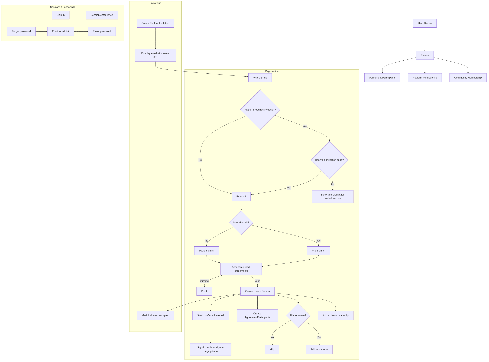

# Documentation Index

Quick links to system guides and diagrams. Each topic includes a process write‑up and a Mermaid diagram (PNG rendered for convenience).

## Exchange (Joatu)
- Overview: [Exchange Process](./exchange_process.md)
- Diagram (PNG): [exchange_flow.png](./exchange_flow.png)
- Diagram (Mermaid): [exchange_flow.mmd](./exchange_flow.mmd)
- Feature docs: [`docs/joatu/`](./joatu)

## Notifications
- Overview: [Notifications System](./notifications_system.md)
- Diagram (PNG): [notifications_flow.png](./notifications_flow.png)
- Diagram (Mermaid): [notifications_flow.mmd](./notifications_flow.mmd)

## Accounts & Invitations
- Overview: [Accounts, Invitations, and Agreements](./accounts_and_invitations.md)
- Diagram (PNG): [accounts_flow.png](./accounts_flow.png)
- Diagram (Mermaid): [accounts_flow.mmd](./accounts_flow.mmd)

## Models & Concerns
- Overview: [Models & Concerns](./models_and_concerns.md)
- Diagram (PNG): [models_and_concerns_diagram.png](./models_and_concerns_diagram.png)
- Diagram (Mermaid): [models_and_concerns_diagram.mmd](./models_and_concerns_diagram.mmd)

## Role-Based Access Control
- Overview: [Role-Based Access Control Overview](./rbac_overview.md)
- Diagram (PNG): [role_based_access_control_flow.png](./role_based_access_control_flow.png)
- Diagram (Mermaid): [role_based_access_control_flow.mmd](./role_based_access_control_flow.mmd)

## Host & Platform
- Host management: [Host Management](./host_management.md)
- Host dashboard: [Host Dashboard Extensions](./host_dashboard_extensions.md)

## UI & Content
- Resource toolbar: [Resource Toolbar](./resource_toolbar.md)
- Content management: [Content Management](./content_management.md)
- Content flow (PNG): [content_flow.png](./content_flow.png)
- Content flow (Mermaid): [content_flow.mmd](./content_flow.mmd)

## Navigation
- Navigation system: [Navigation System](./navigation_system.md)
- Navigation flow (PNG): [navigation_flow.png](./navigation_flow.png)
- Navigation flow (Mermaid): [navigation_flow.mmd](./navigation_flow.mmd)
- Admin guide: [Build a Page Sidebar Navigation](./navigation_sidebar_guide.md)

## Events
- Overview: [Events & Calendars](./events_system.md)
- Flow (PNG): [events_flow.png](./events_flow.png)
- Flow (Mermaid): [events_flow.mmd](./events_flow.mmd)

## Developer Guides
- Getting started: [Guide](./guide.md)
- Production: [Production](./production)
- Development: [Development](./development)
- Polymorphism / STI: [Polymorphic and STI](./polymorphic_and_sti.md)

## Privacy
- Principles: [Privacy‑First Principles](./privacy_principles.md)

## Democratic By Design
- Overview: [Democratic By Design](./democratic_by_design.md)
- Principles map (PNG): [democratic_by_design_map.png](./democratic_by_design_map.png)
- Principles map (Mermaid): [democratic_by_design_map.mmd](./democratic_by_design_map.mmd)

## Metrics
- Overview: [Metrics & Reports System](./metrics_system.md)
- Flow (PNG): [metrics_flow.png](./metrics_flow.png)
- Flow (Mermaid): [metrics_flow.mmd](./metrics_flow.mmd)

## Rendering Diagrams
- Render only changed diagrams: `bin/render_diagrams`
- Force re-render all: `bin/render_diagrams --force` (or `FORCE=1 bin/render_diagrams`)
- CI fails if any diagram fails to render; see listed failed files in output.
