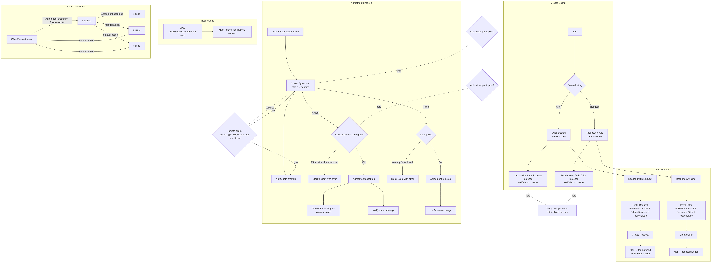

# Documentation Index

Quick links to system guides and diagrams. Each topic includes a process write‑up and a Mermaid diagram (PNG rendered for convenience).

## Exchange (Joatu)
- Overview: [Exchange Process](./exchange_process.md)
- Diagram (PNG): [exchange_flow.png](./exchange_flow.png)
- Diagram (Mermaid): [exchange_flow.mmd](./exchange_flow.mmd)
- Feature docs: [`docs/joatu/`](./joatu)

## Notifications
- Overview: [Notifications System](./notifications_system.md)
- Diagram (PNG): [notifications_flow.png](./notifications_flow.png)
- Diagram (Mermaid): [notifications_flow.mmd](./notifications_flow.mmd)

## Models & Concerns
- Overview: [Models & Concerns](./models_and_concerns.md)
- Diagram (PNG): [models_and_concerns_diagram.png](./models_and_concerns_diagram.png)
- Diagram (Mermaid): [models_and_concerns_diagram.mmd](./models_and_concerns_diagram.mmd)

## Host & Platform
- Host management: [Host Management](./host_management.md)
- Host dashboard: [Host Dashboard Extensions](./host_dashboard_extensions.md)

## UI & Content
- Resource toolbar: [Resource Toolbar](./resource_toolbar.md)
- Content management: [Content Management](./content_management.md)

## Developer Guides
- Getting started: [Guide](./guide.md)
- Production: [Production](./production)
- Development: [Development](./development)
- Polymorphism / STI: [Polymorphic and STI](./polymorphic_and_sti.md)

