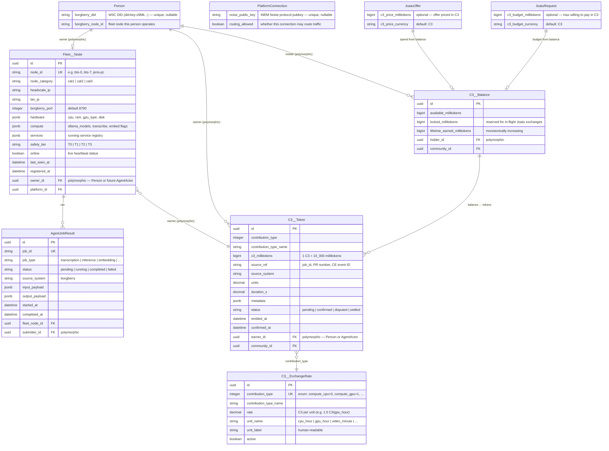
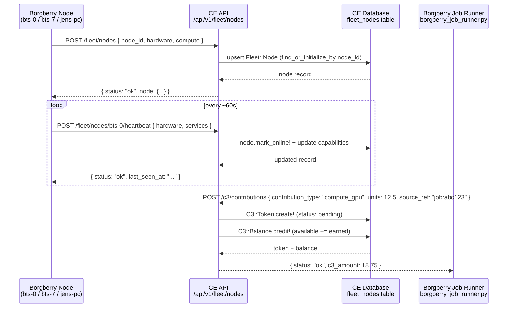
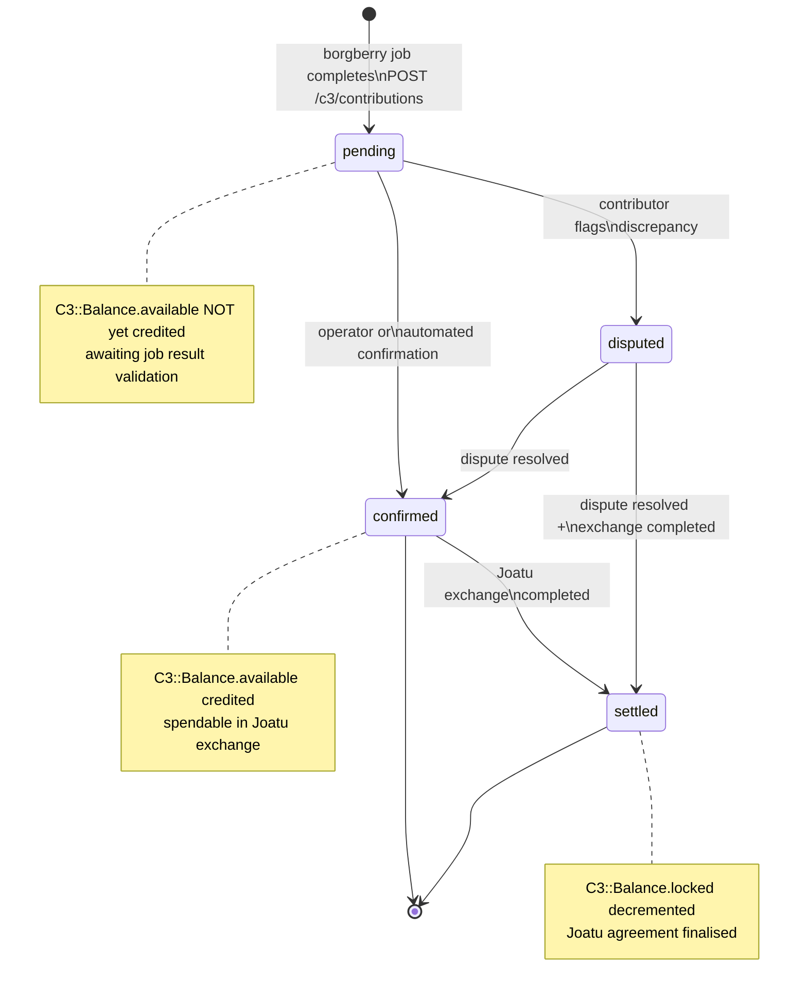
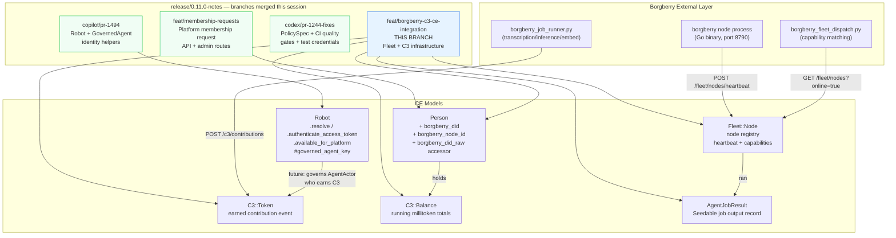

# Borgberry CE Integration — Fleet Mesh + C3 Community Contribution Token

> **Branch**: `feat/borgberry-c3-ce-integration`
> **Base**: `release/0.11.0-notes`
> **Commit**: `a4f265499` — 715 insertions, 0 deletions, 15 files

---

## What This Is

This branch adds the Community Engine-side infrastructure that lets CE act as a **coordination layer for the borgberry fleet mesh** and the **C3 Community Contribution Token (🌱 Tree Seed)**. It is purely additive — new tables, models, controllers, and routes that don't change any existing behaviour.

Three concerns are wired together:

| Concern | What it enables |
|---------|----------------|
| **Fleet mesh** | Borgberry nodes register with a CE platform and send heartbeats — CE becomes the authoritative registry for online/offline node state and hardware capabilities |
| **Job tracking** | Fleet job outputs (transcription, inference, embedding runs) are stored in CE as `AgentJobResult` records, Seedable for GDPR portability |
| **C3 tokens** | Compute contributions earn C3 millitokens; balances are tracked per holder; Joatu offers/requests can optionally price in C3 |

---

## Schema — New and Modified Tables



---

## API Endpoints Added

```
POST /api/v1/fleet/nodes                      register or upsert a node
GET  /api/v1/fleet/nodes                      list nodes (optional ?online=true)
GET  /api/v1/fleet/nodes/:node_id             show single node
POST /api/v1/fleet/nodes/:node_id/heartbeat   update last_seen_at + capabilities

GET  /api/v1/c3/contributions                 list earned C3 token records
POST /api/v1/c3/contributions                 record a new contribution event
GET  /api/v1/c3/balance                       get current balance for authenticated user
```

---

## Data Flow — Fleet Heartbeat Cycle



---

## C3 Token Lifecycle



---

## Relationship to Other `release/0.11.0-notes` Contributions

This branch is the **fleet infrastructure layer** that the governed-agent and robot models (from other branches in this release) will use as their compute context.



### Key design decisions

**Why C3 is NOT governance weight**
`C3::Token` and `C3::Balance` are intentionally isolated from the `GovernedAgent` / `GovernanceParticipant` models. C3 rewards compute contribution — it does not buy voting power. Governance remains one-member one-vote (co-op principle).

**Why millitokens**
Storing `bigint` millitokens (1 C3 = 10,000 millitokens) avoids floating-point rounding in balance arithmetic. All credit/debit operations use integer increments.

**Why idempotent migrations**
Every migration guards with `unless table_exists?` / `unless column_exists?`. This lets the migrations run safely on hosts where a previous partial apply may have left some tables present.

**Why `Fleet::Node` belongs to CE, not just borgberry**
The borgberry registry is the source of truth for live state, but CE needs to store historical job results (`AgentJobResult`) and associate them with Persons, Communities, and Joatu exchange records. The CE `fleet_nodes` table is a **capability mirror** — borgberry pushes to it, CE reads from it.

---

## Migration Checklist

Run these in order on any affected database:

```bash
rails db:migrate VERSION=20260407000100  # borgberry_did on Person
rails db:migrate VERSION=20260407000200  # noise_public_key on PlatformConnection
rails db:migrate VERSION=20260407000400  # fleet_nodes table
rails db:migrate VERSION=20260407000500  # agent_job_results table
rails db:migrate VERSION=20260407001000  # c3_tokens, c3_balances, c3_exchange_rates
rails db:migrate VERSION=20260407001100  # c3_price/budget on joatu offers/requests
# or simply:
rails db:migrate
```

All migrations are safe to run twice — idempotency guards prevent duplicate columns/tables.
