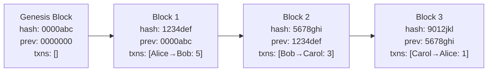
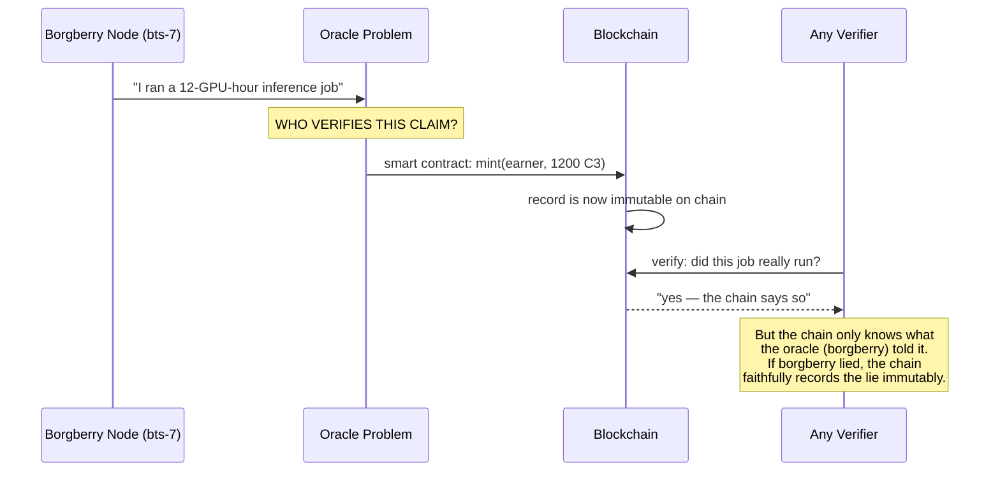
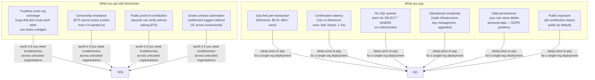
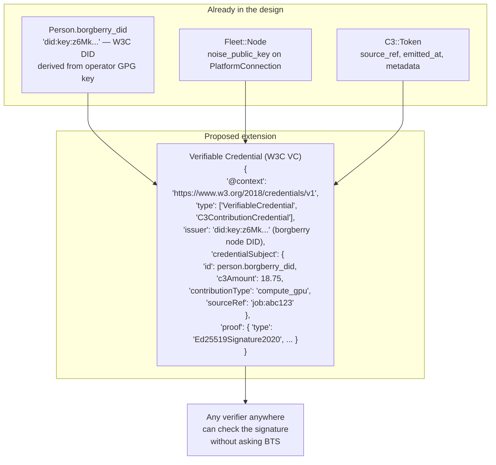
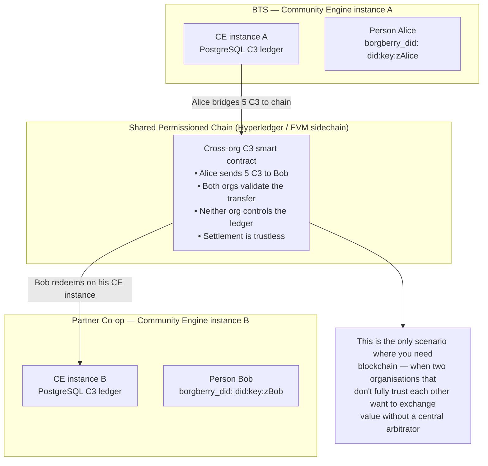
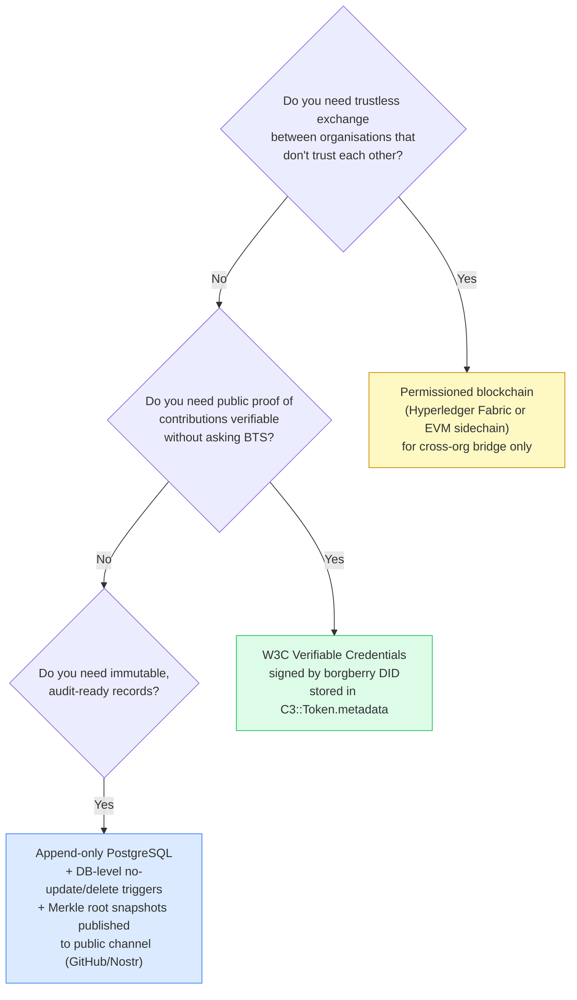

# C3 + Blockchain: Suitability Analysis

> **Question**: Would a blockchain ledger be appropriate for C3 contribution tracking,
> for the goals of auditing, transparency, and immutable ledger entries?
>
> **Short answer**: Not as the primary operational ledger. The properties you want
> are achievable more simply. However, cryptographic verifiability (a close cousin)
> is both appropriate and already partially designed into the system.

---

## 1. How Blockchains Work

A blockchain is a data structure where each record (block) contains:
1. A set of transactions
2. A cryptographic hash of the *previous* block
3. A timestamp
4. A nonce (in proof-of-work systems)



**Why this gives immutability**: changing Block 1's transactions changes its hash, which breaks Block 2's `prev` pointer, which changes Block 2's hash, breaking Block 3, and so on. Every subsequent block must be recomputed. In a network with many participants, you'd also need to convince >50% of the network to accept your altered chain — the 51% attack threshold.

**The three properties you asked about:**

| Property | How blockchain achieves it | What you actually need |
|----------|---------------------------|----------------------|
| **Immutability** | Hash-chaining makes retroactive edits detectable | Append-only records + cryptographic signing |
| **Auditability** | Full transaction history always present on every node | Event log with no deletes |
| **Transparency** | All participants can read the full chain | Open API + open-source code |

The key insight: **blockchain bundles these three properties together with decentralisation and trustlessness**. If you need the three properties but *not* decentralisation/trustlessness, you don't need a blockchain.

---

## 2. Types of Blockchains (Spectrum)

```mermaid
graph LR
    subgraph "Fully Decentralised"
        BTC["Bitcoin / Ethereum\n• Anyone can participate\n• No admin\n• Gas fees per transaction\n• 10s–minutes to confirm\n• All data public forever"]
    end
    subgraph "Public Permissioned"
        POL["Polygon / Solana\n• Validators are known entities\n• Still public ledger\n• Faster, cheaper\n• Data still public"]
    end
    subgraph "Private Permissioned"
        HYP["Hyperledger Fabric / Corda\n• Consortium controls validators\n• Transactions can be private\n• Fast (~1s)\n• You run the infrastructure"]
    end
    subgraph "Single-node"
        PG["Append-only PostgreSQL\n• One trusted operator\n• Cryptographic signing optional\n• Millisecond writes\n• Full SQL query power"]
    end

    BTC -->|"more trust required →"| POL -->|| HYP -->|| PG
    PG -->|"← more decentralisation"| HYP -->|| POL -->|| BTC
```

As you move right, you gain **operational simplicity, speed, and query power**. As you move left, you gain **trustlessness** (ability to transact with parties you don't trust without a central authority).

---

## 3. The Oracle Problem — Why Blockchain Doesn't Solve the Core Trust Question

This is the critical issue for C3 specifically.



**The blockchain makes the ledger entries immutable. It cannot make the input data true.**

For C3 specifically:
- Borgberry nodes report job completions to CE
- CE mints C3 tokens based on those reports
- If a borgberry node reports a fake job, a blockchain mints fake C3 just as faithfully as PostgreSQL does

The trust question is: **"Did this compute work actually happen?"** — and that question lives upstream of whatever ledger you use. Blockchain solves "can the ledger be tampered with after the fact?" It does not solve "was the input to the ledger honest?"

This oracle problem is why existing crypto platforms like Chainlink exist — entire companies are built around the problem of getting reliable real-world data onto a blockchain.

---

## 4. What the C3 Design Already Gets Right

The current architecture actually addresses all three goals through simpler means:

### Immutability via append-only design

`C3::Token` is already designed as an immutable event log:
- No `update` or `delete` in the controller or model
- The status FSM (`pending → confirmed → settled`) only moves forward
- `lifetime_earned_millitokens` on `C3::Balance` is monotonically increasing — it's never decremented

This can be enforced at the database level with a trigger:

```sql
CREATE RULE c3_tokens_no_update AS ON UPDATE TO better_together_c3_tokens
  DO INSTEAD NOTHING;
CREATE RULE c3_tokens_no_delete AS ON DELETE TO better_together_c3_tokens
  DO INSTEAD NOTHING;
```

**This gives you blockchain-grade immutability without a blockchain.**

### Auditability via the event log

Every C3 earning event is a separate `C3::Token` row with:
- `source_ref` — the job ID or event that triggered it
- `source_system` — which system emitted it (`borgberry`, `ce_governance`, `ce_metrics`)
- `emitted_at`, `confirmed_at` — full timestamp trail
- `contribution_type`, `units`, `duration_s`, `metadata` — full provenance

### Transparency via open source + open API

The CE codebase is open source. The `GET /api/v1/c3/contributions` and `GET /api/v1/c3/balance` endpoints expose the full record. Anyone who can read the API can audit any holder's balance against their token history.

---

## 5. What Blockchain Would Actually Add (and at What Cost)



**The GDPR problem is particularly sharp**: a person's right to erasure (GDPR Article 17) is structurally incompatible with a public immutable blockchain. A person can demand their contribution history be deleted — you can't do that on Ethereum. A private permissioned chain could be wiped, but then you're back to trusting whoever controls the validators.

---

## 6. The Better Alternative — Cryptographic Verifiability

The borgberry system already has the pieces for a much more appropriate solution: **W3C Verifiable Credentials** using the DID infrastructure already in the design.



**How this works:**

1. When borgberry completes a job, it signs a Verifiable Credential with the node's private key (already derived from the GPG key that generates `borgberry_did`)
2. CE stores both the `C3::Token` row AND the signed VC JSON in `metadata`
3. Anyone can verify the credential signature using the node's public DID — without trusting CE's database
4. The credential is portable — the person can take it to another platform and prove their contribution history
5. No blockchain required, no gas fees, GDPR-compliant (you can revoke a VC)

This is what the `borgberry_did` column is pointing toward. It's not blockchain — it's the same cryptographic verifiability without the overhead.

---

## 7. When Blockchain Would Be the Right Answer

There is one realistic future scenario where a blockchain becomes appropriate: **multi-organisation C3 exchange**.



For a single-organisation deployment (BTS running its own borgberry + CE), this scenario doesn't apply. If the C3 network grows to include independent partner orgs that want to exchange contributions peer-to-peer, a **private permissioned chain** (Hyperledger Fabric, or a simple EVM chain using Tendermint consensus) becomes genuinely valuable.

---

## 8. Recommendation



**For the current BTS deployment:**

| Goal | Recommended approach | Why |
|------|---------------------|-----|
| Immutable records | Append-only `C3::Token` + DB trigger | Same guarantees, millisecond writes, full SQL |
| Auditability | Event log with `source_ref`, timestamps, `metadata` | Already implemented |
| Transparency | Open API + open-source CE code | Already there |
| Cryptographic proof | W3C VCs signed by borgberry DID | Uses infrastructure already designed in |
| Cross-org exchange | Permissioned EVM sidechain | Only if/when multi-org C3 exchange is needed |

**What not to do:** put operational C3 ledger entries on a public blockchain. The gas costs, confirmation latency, GDPR incompatibility, and oracle trust problem make it strictly worse than what the current design already achieves.

---

## 9. Merkle Snapshot — Lowest-Cost Public Auditability

If the goal is "anyone can verify the C3 ledger hasn't been tampered with" without full blockchain infrastructure, a **periodic Merkle snapshot** achieves it at near-zero cost:

```
Every Sunday at midnight:
1. SELECT id, earner_id, c3_millitokens, source_ref, emitted_at
   FROM better_together_c3_tokens ORDER BY emitted_at
2. Compute SHA-256 Merkle root of all rows
3. Publish root to: GitHub commit, Nostr note, public RSS, or even a tweet
4. Anyone can download the full token table and verify their local Merkle root matches
```

This gives **public, independently verifiable proof** that the ledger matches the published root — at the cost of one cron job and a few bytes published weekly. No blockchain, no gas, no infrastructure.

---

## Summary

Blockchain is a solution to a specific problem: **enabling trustless value exchange between mutually distrusting parties**. That's not the current problem.

The current problem is: **audit-ready, tamper-evident contribution records within a trusted community infrastructure**. PostgreSQL append-only tables with cryptographic signatures from borgberry DIDs solve this completely, at a fraction of the complexity and cost, while remaining GDPR-compliant and fully queryable.

The W3C DID infrastructure (`borgberry_did` on `Person`, `noise_public_key` on `PlatformConnection`) is the right cryptographic foundation for portable contribution credentials — it's the same verifiability as blockchain without the consensus layer overhead. A blockchain bridge becomes the right answer only if and when CE instances in multiple independent organisations want to exchange C3 cross-org without trusting a common database operator.
