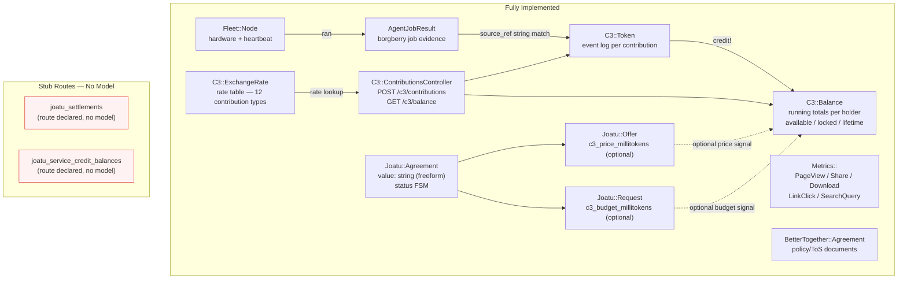
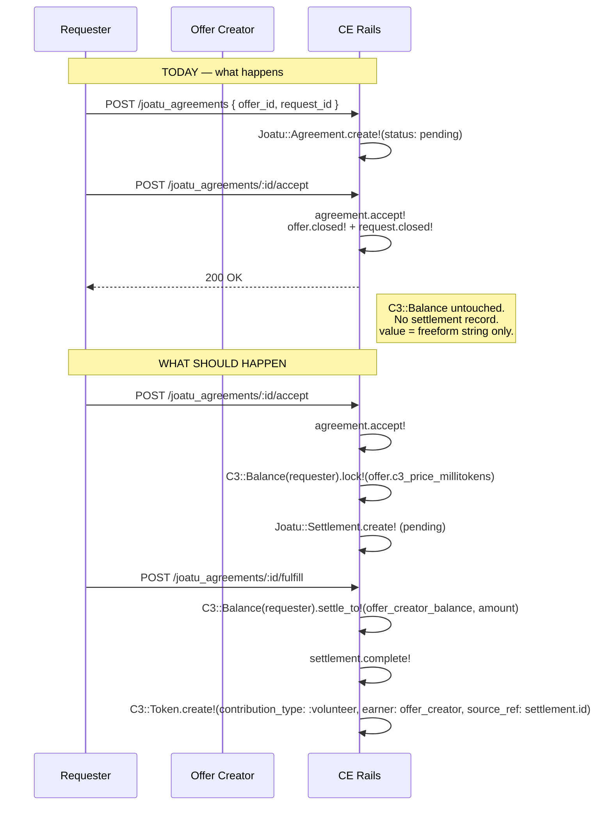
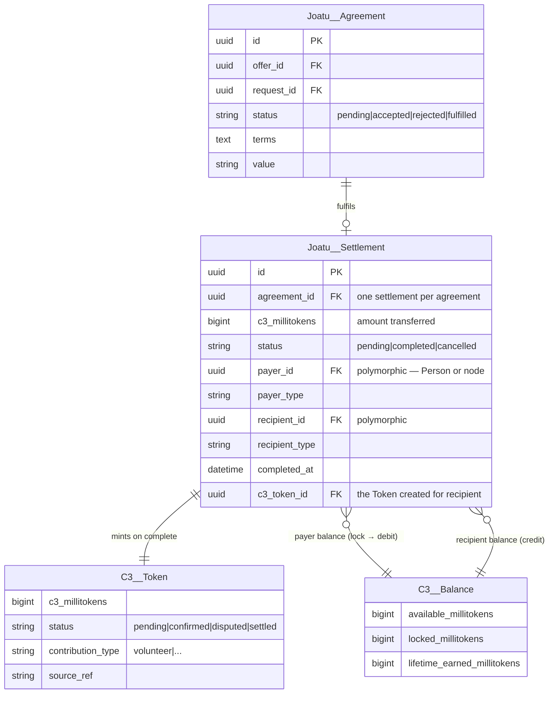
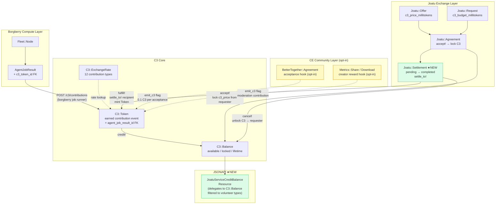

# C3 Integration with CE Contribution Mechanisms — Design Analysis

> **Status**: Architecture design document — identifies current gaps and proposes integration paths
> **Related**: `docs/borgberry-ce-integration.md`, `docs/joatu-v2-vs-ce-comparison.md`

---

## 1. Current State — All Contribution Mechanisms



### What each mechanism actually does

| Mechanism | Type | Has balance? | Has ledger? | Links to C3? |
|-----------|------|-------------|-------------|--------------|
| `C3::Token` | Contribution event log | No | Yes (immutable) | Is C3 |
| `C3::Balance` | Running total | Yes | No | Is C3 |
| `C3::ExchangeRate` | Rate config | No | No | Is C3 |
| `Joatu::Agreement` | Matched barter deal | No | No (value is freeform string) | No — gap |
| `Joatu::Offer.c3_price_millitokens` | Pricing signal | No | No | Price tag only |
| `Joatu::Request.c3_budget_millitokens` | Budget signal | No | No | Budget ceiling only |
| `joatu_settlements` | **Missing** | — | — | Intended |
| `joatu_service_credit_balances` | **Missing** | — | — | Unclear |
| `AgentJobResult` | Job evidence | No | No | Via source_ref string |
| `Metrics::*` | Analytics events | No | No | Not yet |
| `BetterTogether::Agreement` | Policy doc | No | No | Not yet |

---

## 2. The Broken Chain — Where C3 Does Not Yet Close

C3 currently handles the **earning** side fully (compute jobs → tokens → balance). What is missing is the **spending** side: when a Joatu agreement is accepted and fulfilled, C3 should transfer from the requester's balance to the offer creator's balance. That logic exists in `C3::Balance#settle_to!` but nothing calls it.



---

## 3. Proposed Integration — Full Picture

### 3.1 `Joatu::Settlement` — the missing ledger entry

The `joatu_settlements` stub route needs a model. It is the **audit record for a completed C3 transfer** between two parties via a Joatu agreement.



**Settlement lifecycle:**

```mermaid
stateDiagram-v2
    [*] --> pending : agreement.accept!\nlock C3 from requester

    pending --> completed : agreement.fulfill!\nsettle_to! recipient\nmint C3::Token for recipient

    pending --> cancelled : agreement.reject!\nor offer/request withdrawn\nunlock C3 back to requester

    completed --> [*]
    cancelled --> [*]
```

**Migration skeleton:**

```ruby
class CreateBetterTogetherJoatuSettlements < ActiveRecord::Migration[7.2]
  def change
    return if table_exists?(:better_together_joatu_settlements)

    create_bt_table :joatu_settlements do |t|
      t.references :agreement, type: :uuid, null: false,
                               foreign_key: { to_table: :better_together_joatu_agreements, on_delete: :restrict },
                               index: { unique: true, name: 'idx_bt_joatu_settlements_agreement' }
      t.references :payer,     polymorphic: true, type: :uuid, null: false,
                               index: { name: 'idx_bt_joatu_settlements_payer' }
      t.references :recipient, polymorphic: true, type: :uuid, null: false,
                               index: { name: 'idx_bt_joatu_settlements_recipient' }
      t.references :c3_token,  type: :uuid, null: true,
                               foreign_key: { to_table: :better_together_c3_tokens, on_delete: :nullify },
                               index: { name: 'idx_bt_joatu_settlements_token' }
      t.bigint  :c3_millitokens, null: false, default: 0
      t.string  :status, null: false, default: 'pending' # pending|completed|cancelled
      t.datetime :completed_at
    end
  end
end
```

---

### 3.2 `JoatuServiceCreditBalance` — resolve or retire the stub

Two options:

**Option A (recommended): Retire the stub, map to `C3::Balance`**

`C3::Balance` already is the service credit balance. Add a JSONAPI resource `JoatuServiceCreditBalanceResource` that delegates to `C3::Balance` scoped to Joatu-relevant contribution types (`volunteer`, `code_review`, `documentation`, `moderation`). This gives Joatu clients a filtered view of the same balance without a second table.

**Option B: Keep as separate ledger**

A dedicated `Joatu::ServiceCreditBalance` with its own table, used only for barter exchanges (separate from compute C3). This would be a double-entry sub-ledger: credits from fulfilled agreements, debits from new offers accepted. More complex, higher isolation.

Recommendation: Option A first. If Joatu-specific credits need different governance rules later, extract at that point.

---

### 3.3 `AgentJobResult` → `C3::Token` — add FK, retire string matching

Currently the link between `AgentJobResult` and `C3::Token` is via `source_ref` (a string like `"job:abc123"`). This is fragile.

**Proposed migration:**

```ruby
add_column :better_together_c3_tokens, :agent_job_result_id, :uuid
add_foreign_key :better_together_c3_tokens, :better_together_agent_job_results,
                column: :agent_job_result_id, on_delete: :nullify
add_index :better_together_c3_tokens, :agent_job_result_id,
          name: 'idx_bt_c3_tokens_job_result', where: 'agent_job_result_id IS NOT NULL'
```

`source_ref` stays for non-job contributions (PR reviews, moderation actions). The FK adds integrity for the borgberry compute path.

---

### 3.4 Metrics → C3 — community activity contributions

`Metrics::Share`, `Metrics::LinkClick`, and `Metrics::PageView` are currently pure analytics. They could optionally emit C3 tokens for the `moderation` and `documentation` contribution types — but **only for content creators, not consumers**.

Proposed: an **after_create hook** on specific metrics models, gated by a platform setting:

```ruby
# In Metrics::Share (example)
after_create :emit_c3_for_creator, if: :c3_rewards_enabled?

def emit_c3_for_creator
  return unless shareable.respond_to?(:creator)
  C3::ContributionJob.perform_later(
    earner: shareable.creator,
    contribution_type: :moderation,  # or :documentation for page content
    units: 1.0,
    source_ref: "share:#{id}",
    source_system: 'ce_metrics'
  )
end
```

This is a **platform opt-in** (off by default) — most deployments won't want to mint C3 for every page share.

---

### 3.5 `BetterTogether::Agreement` → C3

Accepting a platform community agreement (Terms of Service, Code of Conduct) is a `volunteer`-category contribution — the person is consenting to govern alongside others. This could emit a one-time `C3::Token` per agreement.

```ruby
# In BetterTogether::AgreementParticipant (after_create)
after_create :emit_c3_for_acceptance, if: :agreement_emits_c3?

def emit_c3_for_acceptance
  C3::Token.create!(
    earner: participant,
    contribution_type: :volunteer,
    contribution_type_name: 'agreement_acceptance',
    c3_millitokens: 1_000,  # 0.1 C3 — symbolic
    source_ref: "agreement_participant:#{id}",
    source_system: 'ce_governance',
    status: 'confirmed'
  )
end
```

Gate: `agreement.emits_c3` boolean column (opt-in per agreement). Off by default.

---

## 4. Full Integration Map — Proposed End State



---

## 5. Implementation Priority

| Priority | Item | Effort | Value |
|----------|------|--------|-------|
| **P1** | `Joatu::Settlement` model + migration | Medium | Closes the broken chain between agreement acceptance and C3 transfer |
| **P1** | `Joatu::Agreement#accept!` → lock C3 | Small | Hooks existing logic to `C3::Balance#lock!` |
| **P1** | `Joatu::Agreement#fulfill!` action | Small | New action on controller + `settle_to!` + Settlement#complete! |
| **P2** | `agent_job_result_id` FK on `C3::Token` | Small | Data integrity for compute path |
| **P2** | `JoatuServiceCreditBalance` JSONAPI resource | Small | Closes the stub route |
| **P3** | `BetterTogether::Agreement` C3 hook | Small | Optional, opt-in per agreement |
| **P4** | `Metrics::*` C3 hooks | Medium | Optional, platform-level setting, complex targeting |

---

## 6. What C3 Does NOT Do (by design)

These are architectural constraints, not gaps:

- **C3 ≠ fiat currency** — no Money gem, no exchange rate to dollars, no payment processor
- **C3 ≠ governance weight** — `C3::Token` and `C3::Balance` are structurally isolated from `GovernedAgent` / `GovernanceParticipant`. One member one vote (co-op doctrine).
- **C3 ≠ access control** — C3 balance does not gate any Pundit policy. Permissions come from roles.
- **No `CapsGenerator` pattern** — C3 cannot be minted from thin air. Every token requires a `source_ref` pointing to real work evidence. The system cannot create C3 without a matching job, agreement, or qualifying activity record.
