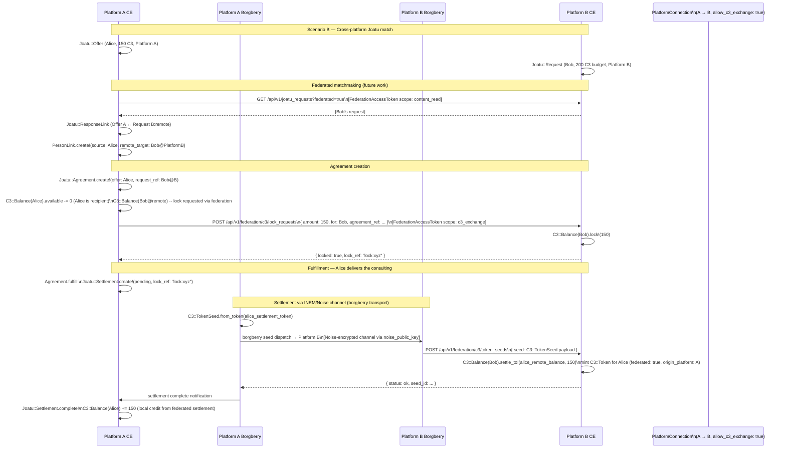
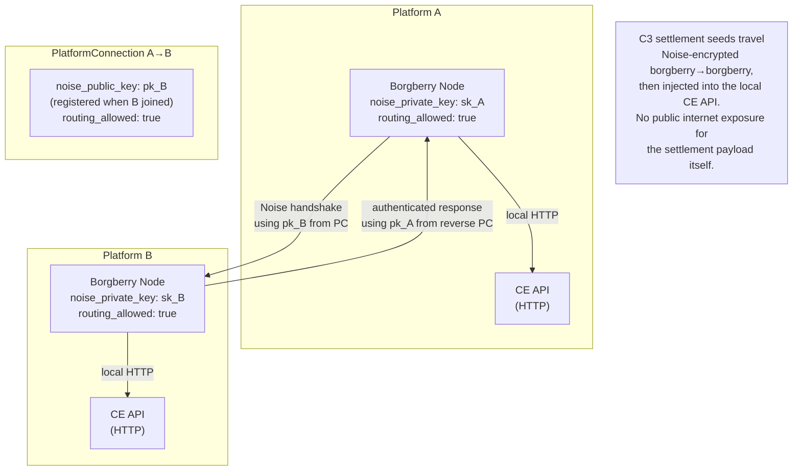
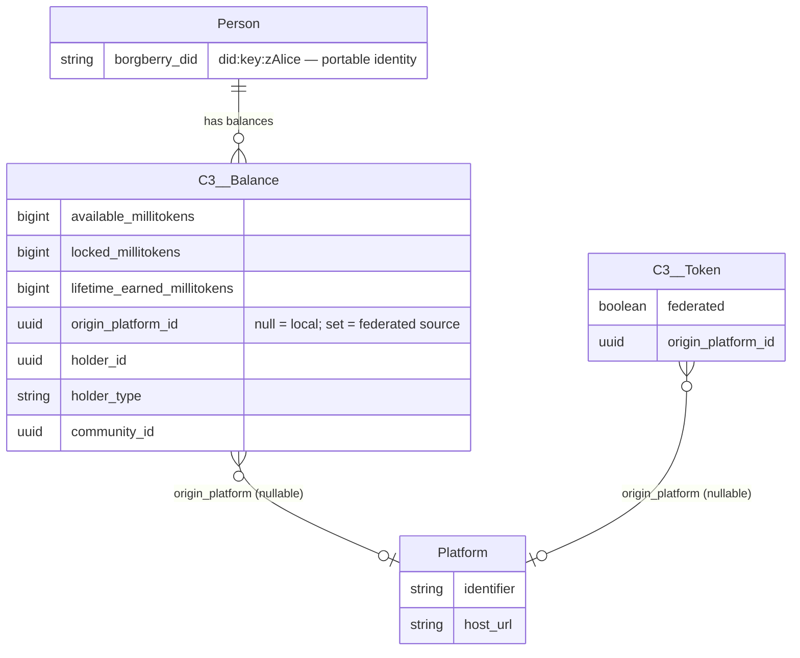
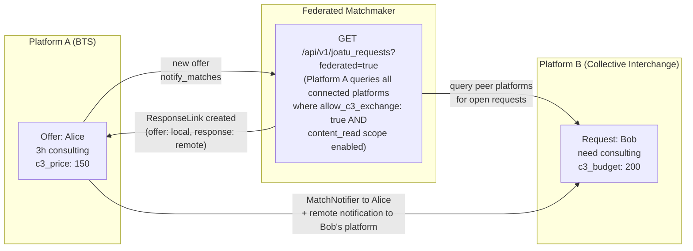
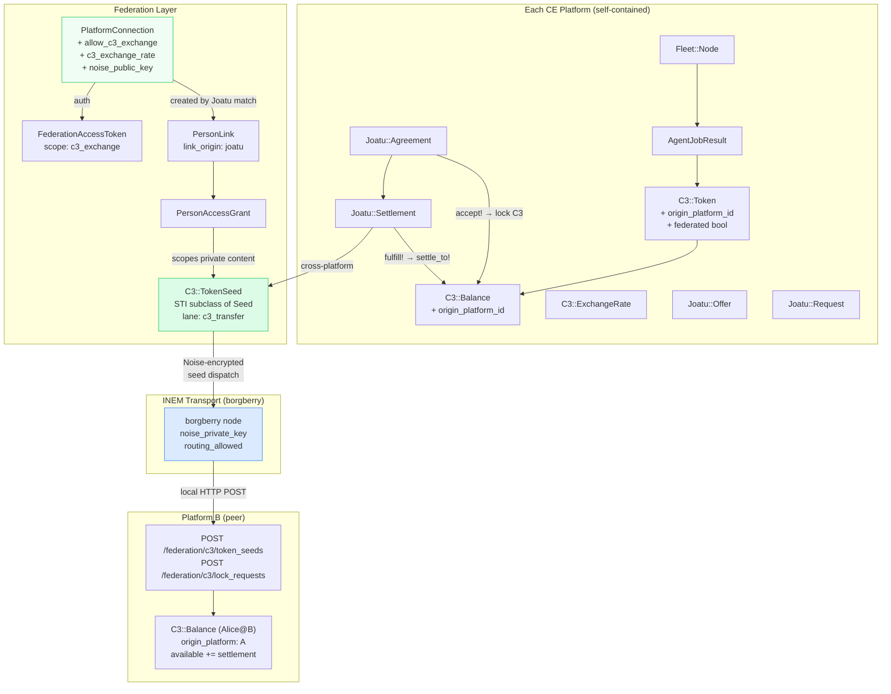

# C3 Across the CE Federation Network

> **Goal**: first-class C3 balance portability and cross-platform Joatu exchange
> across the federated CE network, using existing federation infrastructure as the
> transport and consent layer.

---

## 1. What the Federation Layer Already Provides

Before adding C3, the CE federation system has:

```mermaid
graph TD
    subgraph "Platform A (e.g. bts.community)"
        PA[Platform A]
        PA_Person[Person Alice\nborgberry_did: did:key:zAlice]
        PA_FA[FederationAccessToken\nscopes: content_read api_read]
    end

    subgraph "Platform B (e.g. collectiveinterchange.com)"
        PB[Platform B]
        PB_Person[Person Bob\nborgberry_did: did:key:zBob]
    end

    subgraph "PlatformConnection (directed edge)"
        PC[PlatformConnection\nsource: A → target: B\nkind: peer\nstatus: active\n\nContent policy: mirror_network_feed\nAuth policy: api_read\n\nScopes allowed:\n  ✓ identity\n  ✓ content_read\n  ✓ linked_content_read\n  ✗ content_write\n\nnoise_public_key: ... NEW\nrouting_allowed: true  NEW]
    end

    subgraph "PersonLink (created through Joatu)"
        PL[PersonLink\nsource: Alice → target: Bob\nlink_origin: joatu\nstatus: active]
        PAG[PersonAccessGrant\ngrantor: Alice → grantee: Bob\nallow_private_posts: true\ngrant_origin: joatu]
        PLS[PersonLinkedSeed\nencrypted payload\nrecipient: Bob]
    end

    subgraph "Seed (portable data envelope)"
        S[Seed\nlane: platform_shared\norigin.platforms: [A, B]\npayload: {...}]
    end

    PA --- PC
    PC --- PB
    PC --- PA_FA
    PC --> PL
    PL --> PAG
    PAG --> PLS
    PA_FA -->|"authenticate\noutbound API calls"| PB
```

**What this gives C3 for free:**
- A durable directed edge (`PlatformConnection`) between any two CE instances, with OAuth credentials already provisioned
- A scoped token (`FederationAccessToken`) that the source platform can use to call the target platform's API
- A person-to-person link (`PersonLink`) that was **already designed to be created by Joatu flows** (`link_origin: 'joatu'`)
- A private consent layer (`PersonAccessGrant`) that gates what personal data flows through that link
- A portable data envelope (`Seed`) with provenance tracking (`origin.platforms` array)
- An encrypted transport channel via Noise Protocol (`noise_public_key` on the connection, routed by borgberry)

---

## 2. The Three C3 Federation Scenarios

### Scenario A — Earning on one platform, spending on another

Alice earns C3 on Platform A by running GPU inference jobs through borgberry. She wants to spend that C3 to hire Bob (on Platform B) via Joatu.

### Scenario B — Cross-platform Joatu match

Platform A's offer (Alice: "3 hours consulting") matches Platform B's request (Bob: "I need consulting"). The matchmaker finds this across the federation. The agreement is brokered, C3 transfers from Bob → Alice across the platform boundary.

### Scenario C — Network-wide C3 balance visibility

A person participates in multiple CE platforms across the network. Their total C3 balance is the sum across all platforms where they have a `borgberry_did` identity. They want a single view.

---

## 3. What Needs to Be Added

### 3.1 New `PlatformConnection` scope flag: `allow_c3_exchange`

```ruby
store_attributes :settings do
  # ... existing flags ...
  allow_c3_exchange  Boolean, default: false   # enables C3 token sync + settlement
  c3_exchange_rate   String,  default: '1.0'   # bilateral rate (1.0 = parity)
end
```

This follows the exact same pattern as `allow_content_read_scope`, `share_posts`, etc. — a per-connection opt-in. Adding a corresponding `allows_c3_exchange?` method to `PlatformConnectionFederationPolicy`.

### 3.2 Origin tracking on `C3::Token`

```ruby
# new migration
add_column :better_together_c3_tokens, :origin_platform_id, :uuid
add_column :better_together_c3_tokens, :federated, :boolean, default: false, null: false
add_foreign_key :better_together_c3_tokens, :better_together_platforms,
                column: :origin_platform_id, on_delete: :nullify
```

- `origin_platform_id: nil` — minted locally (this platform's borgberry jobs)
- `origin_platform_id: platform.id` — received via federation from a peer platform

### 3.3 `C3::TokenSeed` — new `Seed` subtype

`Seed` is already STI. A new subclass for C3 token transfers follows the same `plant` / `import` / `export` API:

```ruby
module BetterTogether
  module C3
    class TokenSeed < BetterTogether::Seed
      LANE = 'c3_transfer'

      def self.from_token(token, source_platform:)
        build(
          type:        name,
          identifier:  "c3_token:#{token.id}",
          version:     '1.0',
          created_by:  source_platform.identifier,
          description: "C3 token transfer #{token.contribution_type_name} #{token.c3_amount} C3",
          origin:      {
            lane:        LANE,
            platforms:   [source_platform.identifier],
            source_ref:  token.source_ref,
            source_system: token.source_system
          },
          payload:     {
            token_id:            token.id,
            earner_did:          token.earner.try(:borgberry_did),
            contribution_type:   token.contribution_type,
            c3_millitokens:      token.c3_millitokens,
            status:              token.status,
            emitted_at:          token.emitted_at&.iso8601,
            confirmed_at:        token.confirmed_at&.iso8601
          }
        )
      end

      def apply_to_recipient_balance!
        data = payload_data
        earner = BetterTogether::Person.find_by(borgberry_did: data['earner_did'])
        return unless earner

        C3::Balance.find_or_create_by!(holder: earner, community: nil)
                   .credit!(data['c3_millitokens'] / C3::Token::MILLITOKEN_SCALE.to_f)
      end
    end
  end
end
```

### 3.4 `Joatu::Settlement` — the missing piece (from integration design)

Plus a new `origin_platform_id` column on Settlement to record which platform initiated it.

### 3.5 Federation API endpoint for inbound C3 seeds

```ruby
# routes: POST /api/v1/federation/c3/token_seeds
module BetterTogether
  module Api
    module V1
      module Federation
        class C3TokenSeedsController < Api::ApplicationController
          # Receives a C3::TokenSeed from a peer platform.
          # Authenticated via FederationAccessToken with c3_exchange scope.
          def create
            connection = current_federation_connection  # from token auth
            raise Forbidden unless connection.allows_c3_exchange?

            seed = C3::TokenSeed.import_or_update!(seed_params)
            seed.apply_to_recipient_balance!

            render json: { status: 'ok', seed_id: seed.id }
          end
        end
      end
    end
  end
end
```

---

## 4. Full Cross-Platform C3 Settlement Flow



---

## 5. The INEM Transport Layer

The `noise_public_key` on `PlatformConnection` is not incidental — it is the **borgberry INEM (Inter-Network Exchange Mesh) layer**. Noise Protocol (the same cryptographic framework used in WireGuard and Signal) provides:

- **Mutual authentication** — both CE instances prove they hold the private keys corresponding to their registered public keys
- **Forward secrecy** — a new ephemeral key is generated per session
- **No PKI dependency** — no certificate authorities; trust is established by the key registration on the PlatformConnection record itself



This is significant for C3 because:
- Settlement messages contain personal financial data — encrypting them at the transport layer via Noise is the right call
- The borgberry `seed dispatch` command (already in `cmd/borgberry-client/seed.go`) is the natural carrier for `C3::TokenSeed` payloads
- Platforms that don't run borgberry can fall back to HTTP + `FederationAccessToken` for the same endpoint

---

## 6. Federated Balance — Single View Across the Network



A person with a `borgberry_did` has:
- One `C3::Balance` per platform they've been active on
- The **network total** = `C3::Balance.where(holder: person).sum(:available_millitokens)`
- The **local total** = `C3::Balance.where(holder: person, origin_platform_id: nil).sum(:available_millitokens)`
- The **federated received** = `C3::Balance.where(holder: person).where.not(origin_platform_id: nil).sum(:available_millitokens)`

A new API endpoint: `GET /api/v1/c3/network_balance` — aggregates across all platform connections where `allow_c3_exchange: true` by looking up the person's `borgberry_did` on peer platforms.

---

## 7. Cross-Platform Exchange Rates

All CE platforms in the current network use C3 as the same currency. However, future deployment of independent CE instances (non-BTS) may want local community currencies (e.g. "Community Credits" on one platform, "Time Dollars" on another). The `c3_exchange_rate` on `PlatformConnection` handles this:

```
PlatformConnection A→B: c3_exchange_rate: 1.5
  → 1 C3 from Platform A = 1.5 C3 on Platform B
```

For the current BTS network (all platforms using the same C3): rate is always `1.0`. The field is there for future independent community currencies without requiring a schema migration.

---

## 8. Federated Joatu Matchmaking

This is the biggest new capability enabled by C3 federation: **cross-platform offers and requests**.



This requires no new models — `ResponseLink` already supports polymorphic `source` and `response`. A remote response just needs an additional `response_platform_id` column and the matchmaker extended to query peer platforms via `FederationAccessToken`.

---

## 9. Full Architecture — C3 + Federation



---

## 10. What This Enables for the Network

| Capability | How |
|------------|-----|
| Person earns C3 on Platform A, spends on Platform B | `C3::TokenSeed` pushed via federation; remote balance credited |
| Cross-platform Joatu match (Alice on A, Bob on B) | Federated matchmaker + `ResponseLink` with `response_platform_id` |
| Single network-wide C3 balance view | `GET /api/v1/c3/network_balance` aggregates across active connections |
| Independent community currencies (future) | `c3_exchange_rate` on `PlatformConnection` |
| Encrypted settlement transport | Noise Protocol via borgberry INEM (`noise_public_key`) |
| GDPR-portable contribution history | C3::TokenSeed uses the existing Seed export/import system; personal data export includes federated tokens |
| Spam/abuse prevention | `allow_c3_exchange` is off by default; `PersonLink` requires active Joatu relationship; `PersonAccessGrant` gates consent |

---

## 11. Implementation Priority (building on the integration design P1–P4)

| Step | What | Prerequisites |
|------|------|--------------|
| **F1** | `allow_c3_exchange` + `c3_exchange_rate` on `PlatformConnection` | None |
| **F1** | `origin_platform_id` + `federated` on `C3::Token` | P2 (AgentJobResult FK) |
| **F2** | `C3::TokenSeed` STI subclass | P1 (Settlement model) |
| **F2** | `POST /federation/c3/token_seeds` API endpoint | FederationAccessToken c3_exchange scope |
| **F3** | `POST /federation/c3/lock_requests` API endpoint | F2 |
| **F3** | Federated matchmaker (query peer platforms for offers/requests) | F1 |
| **F4** | `GET /api/v1/c3/network_balance` — cross-platform aggregate | F2 |
| **F4** | borgberry INEM seed dispatch for C3::TokenSeed | F2 + borgberry seed dispatch subcommand |
| **F5** | Response/settlement via Noise-encrypted channel | borgberry `noise_public_key` provisioning |
