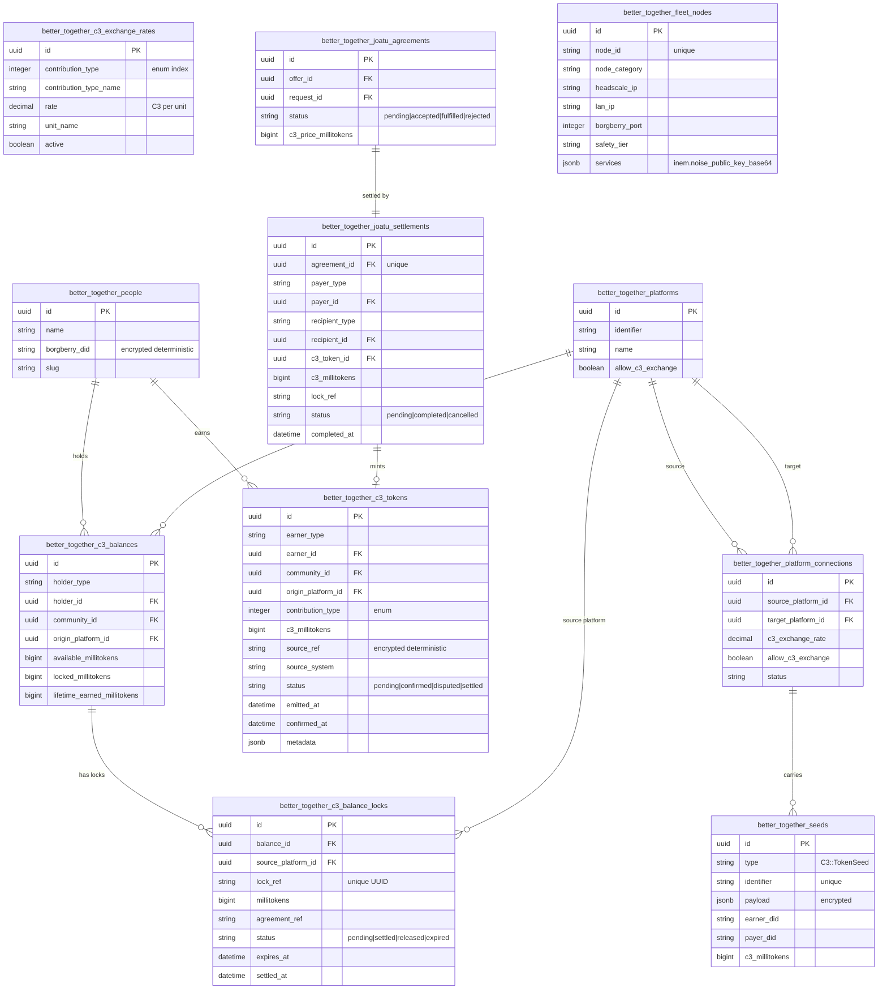
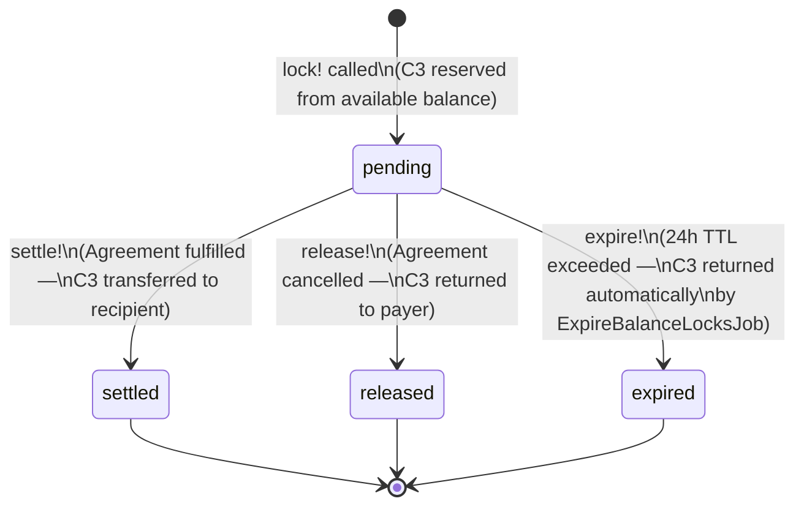
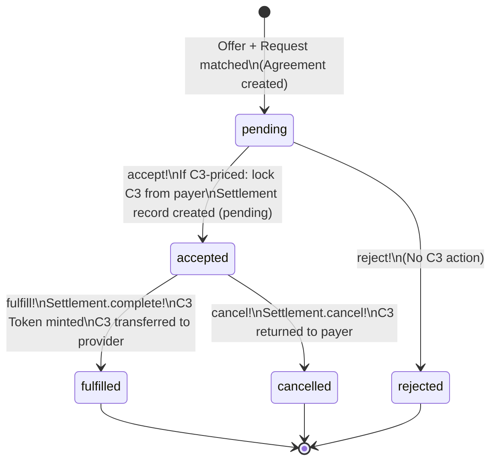

# C3 Federation — Object & Data Model Reference

This document is a complete reference to every table, model, and field in the C3 community contribution token system, the Joatu peer exchange layer, and the borgberry fleet registry. It is intended for developers, auditors, and integration teams.

All amounts are stored as **millitokens** (integer) in the database. **1 Tree Seed = 1,000 millitokens.** The milli prefix follows the SI convention (1/1000). Users always see Tree Seeds; millitokens are an internal wire and storage format only.

> **Note on code constant:** `C3::Token::MILLITOKEN_SCALE` is currently set to `10_000` in the Ruby code. This is a known discrepancy from the definition above and needs to be corrected to `1_000` before live exchange is enabled.

---

## Entity Relationship Diagram



---

## State Machine Diagrams

### C3::BalanceLock Lifecycle



Key properties:
- `lock_ref` is a UUID issued to the caller at creation time; it must be included in the settlement payload to verify chain of custody.
- `expires_at` defaults to `now + 24h`. `ExpireBalanceLocksJob` runs every 15 minutes and automatically releases expired locks.
- C3 is never lost: every terminal state (settled, released, expired) ensures the millitokens are accounted for.

### Joatu::Settlement Lifecycle

```mermaid
stateDiagram-v2
    [*] --> pending : Agreement accepted (accept!)\nSettlement created\nPayer C3 locked via BalanceLock

    pending --> completed : Agreement fulfilled (fulfill!)\nC3::Token minted for recipient\nPayer lock_ref settled\nNotifications sent

    pending --> cancelled : Agreement cancelled (cancel!)\nPayer C3 unlocked\nBalanceLock released\nNotifications sent

    completed --> [*]
    cancelled --> [*]
```

One `Settlement` per `Agreement` (enforced by unique index on `agreement_id`). The `lock_ref` on the Settlement links it to the corresponding `BalanceLock` for chain-of-custody verification.

### Joatu::Agreement Lifecycle



---

## Model Reference Tables

### `C3::Token` — `better_together_c3_tokens`

A single immutable record for each contribution event. One Token per job completion, per PR review, per volunteer hour, etc.

| Field | Type | Description |
|---|---|---|
| `id` | uuid | Primary key |
| `earner_type` / `earner_id` | polymorphic | The person (or future AgentActor) who earned this |
| `community_id` | uuid FK nullable | Community scope (nil = platform-wide) |
| `origin_platform_id` | uuid FK nullable | Set for federated tokens; nil for local tokens |
| `contribution_type` | integer enum | compute_cpu, compute_gpu, compute_metal, transcription, volunteer, code_review, documentation, moderation, embedding |
| `contribution_type_name` | string | Human-readable label |
| `c3_millitokens` | bigint | Amount earned (max: 10,000 Tree Seeds per transaction) |
| `source_ref` | string | **Encrypted (deterministic)** — job_id, PR number, CE event ID, "settlement:uuid" |
| `source_system` | string | 'borgberry', 'ce_joatu', 'federation' |
| `units` | decimal | Units contributed (e.g. CPU-hours, video-minutes) |
| `duration_s` | decimal | Duration in seconds |
| `metadata` | jsonb | Exchange rate applied, original millitokens (for federated tokens) |
| `status` | string | pending, confirmed, disputed, settled |
| `emitted_at` | datetime | When borgberry emitted the contribution event |
| `confirmed_at` | datetime | When CE confirmed the token |

**Encryption:** `source_ref` is encrypted with `AR::Encryption` (deterministic — supports `find_by` lookups).

### `C3::Balance` — `better_together_c3_balances`

Running totals per person. Updated atomically with each earn, lock, unlock, or settle operation.

| Field | Type | Description |
|---|---|---|
| `id` | uuid | Primary key |
| `holder_type` / `holder_id` | polymorphic | Person (or future AgentActor) who holds this balance |
| `community_id` | uuid FK nullable | Community scope (nil = platform-wide) |
| `origin_platform_id` | uuid FK nullable | nil = local balance; set = federated (received from another platform) |
| `available_millitokens` | bigint | Spendable Tree Seeds (not locked) |
| `locked_millitokens` | bigint | Reserved for in-flight Joatu exchanges |
| `lifetime_earned_millitokens` | bigint | Cumulative total ever earned (never decremented) |

**Scopes:** `Balance.local` (origin_platform_id IS NULL), `Balance.federated` (origin_platform_id IS NOT NULL).

**Unique constraint:** one balance per `(holder_type, holder_id, community_id)`.

### `C3::BalanceLock` — `better_together_c3_balance_locks`

Persistent audit record for every locked C3 amount. Created by `Balance#lock!`; terminal states set by `settle!`, `release!`, or `expire!`.

| Field | Type | Description |
|---|---|---|
| `id` | uuid | Primary key |
| `balance_id` | uuid FK | The balance being locked |
| `source_platform_id` | uuid FK nullable | Which platform requested this lock (nil = local) |
| `lock_ref` | string | **Unique UUID** — returned to caller and included in settlement payload |
| `millitokens` | bigint | Amount locked (max: MAX_SINGLE_TRANSACTION_MILLITOKENS) |
| `agreement_ref` | string | Caller-supplied agreement identifier |
| `status` | string | pending, settled, released, expired |
| `expires_at` | datetime | Default: now + 24h |
| `settled_at` | datetime | When the lock reached a terminal state |

### `Joatu::Settlement` — `better_together_joatu_settlements`

The audit record for a C3 value transfer via a Joatu agreement.

| Field | Type | Description |
|---|---|---|
| `id` | uuid | Primary key |
| `agreement_id` | uuid FK unique | One settlement per agreement |
| `payer_type` / `payer_id` | polymorphic | Who pays the C3 |
| `recipient_type` / `recipient_id` | polymorphic | Who receives the C3 |
| `c3_token_id` | uuid FK nullable | Token minted on completion (nil until completed) |
| `c3_millitokens` | bigint | Amount (validated ≤ MAX_SINGLE_TRANSACTION_MILLITOKENS) |
| `lock_ref` | string | Links to the corresponding `BalanceLock` |
| `status` | string | pending, completed, cancelled |
| `completed_at` | datetime | When the settlement reached a terminal state |

### `C3::TokenSeed` — `better_together_seeds` (type: `C3::TokenSeed`)

The federation wire record: created when a borgberry node sends a cross-platform Tree Seeds credit. Stored on the receiving platform.

| Field | Type | Description |
|---|---|---|
| `id` | uuid | Primary key |
| `type` | string | 'BetterTogether::C3::TokenSeed' (STI) |
| `identifier` | string unique | Deduplication key (source_ref hash — prevents double-apply) |
| `payload` | jsonb | **Encrypted** — full federation payload including earner_did, c3_millitokens, contribution_type, exchange_rate_applied |
| `earner_did` | string | borgberry DID of the earner |
| `payer_did` | string nullable | borgberry DID of the payer (for cross-platform lock settlements) |
| `c3_millitokens` | bigint | Amount credited on this platform (after exchange rate) |

**Encryption:** `payload` is encrypted with `AR::Encryption`. `earner_did` and `payer_did` are stored in plaintext on this record (they were supplied by the caller and are not enumeration-sensitive in this context); `borgberry_did` on `Person` is encrypted deterministically.

### `PlatformConnection` (C3 fields) — `better_together_platform_connections`

| Field | Type | Description |
|---|---|---|
| `allow_c3_exchange` | boolean | Both platforms must set this true for exchange to proceed |
| `c3_exchange_rate` | decimal | How many Tree Seeds on this platform = 1 Tree Seed on the source platform (default 1.0) |
| `status` | string | must be 'active' for exchange |

### `FleetNode` — `better_together_fleet_nodes`

Registry of borgberry nodes in the BTS fleet. Used for INEM routing and C3 federation.

| Field | Type | Description |
|---|---|---|
| `node_id` | string unique | e.g. 'bts-7', 'bts-ph-0' |
| `node_category` | string | 'community_hardware', 'member_device' |
| `headscale_ip` | string | Headscale WireGuard IP (100.64.x.x preferred) |
| `lan_ip` | string | LAN IP (10.45.x.x) |
| `borgberry_port` | integer | Default 8790 |
| `safety_tier` | string | T0–T4 |
| `services` | jsonb | `{ "inem" => { "noise_public_key_base64" => "..." } }` |

---

## Encryption Inventory

| Field | Model / Table | Encryption type | Why |
|---|---|---|---|
| `borgberry_did` | `Person` | AR::Encryption deterministic | DID links member across platforms — must not be readable from DB dump |
| `source_ref` | `C3::Token` | AR::Encryption deterministic | Internal agreement/job IDs must not leak to DB readers |
| `payload` | `C3::TokenSeed` (`Seed`) | AR::Encryption | Full federation payload contains earner DID and contribution details |
| Relay log lines | INEM relay log file | age X25519 (per-line) | Traffic metadata must not be readable without the key |
| Consent grant files | borgberry seed grants | age X25519 (per-file) | Peer consent records contain borgberry DIDs |

---

## Financial Fields Inventory

Every bigint millitoken field and who controls it:

| Field | Table | Who writes | Who reads | Max value |
|---|---|---|---|---|
| `c3_millitokens` | `c3_tokens` | borgberry emitter (via CE API) or Joatu settlement | Platform admin, earner | 10,000 Tree Seeds |
| `available_millitokens` | `c3_balances` | CE (credit!, unlock!, settle_to!) | Holder, platform admin | Unbounded (sum of earnings) |
| `locked_millitokens` | `c3_balances` | CE (lock!, unlock!, settle_to!) | Holder, platform admin | Bounded by available |
| `lifetime_earned_millitokens` | `c3_balances` | CE (credit!) — never decremented | Holder, platform admin | Unbounded |
| `millitokens` | `c3_balance_locks` | CE (Balance#lock!) | Platform admin | 10,000 Tree Seeds |
| `c3_millitokens` | `joatu_settlements` | CE (create_settlement_if_c3_priced!) | Payer, recipient, admin | 10,000 Tree Seeds |
| `c3_price_millitokens` | `joatu_agreements` | Offer/Request author | Any authenticated user | 10,000 Tree Seeds |
| `c3_millitokens` | `seeds` (TokenSeed) | borgberry CLI (via POST) | Platform admin | 10,000 Tree Seeds |

**Transaction ceiling:** `MAX_SINGLE_TRANSACTION_MILLITOKENS = 10,000 * MILLITOKEN_SCALE`. No single transaction may exceed 10,000 Tree Seeds. This prevents overflow and limits blast radius of malformed or malicious payloads.

---

## Exchange Rate Table

| Contribution type | Default rate | Unit |
|---|---|---|
| `compute_cpu` | 10 C3 | per CPU-hour |
| `compute_gpu` | 100 C3 | per GPU-hour (RTX 2070) |
| `compute_metal` | 60 C3 | per GPU-hour (M1 Metal) |
| `transcription` | 2 C3 | per video-minute |
| `volunteer` | 50 C3 | per hour |
| `code_review` | 20 C3 | per PR reviewed |
| `documentation` | 15 C3 | per documentation PR merged |
| `moderation` | 5 C3 | per CE moderation action |
| `embedding` | 1 C3 | per 1,000 vectors |

Exchange rates are stored in `C3::ExchangeRate` and can be updated by platform administrators. The rate at the time of earning is recorded in the `C3::Token` record.
