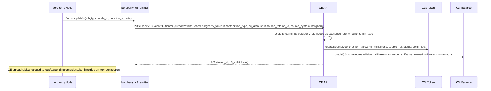
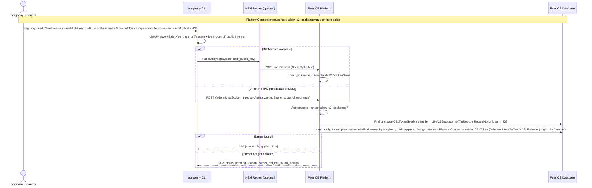
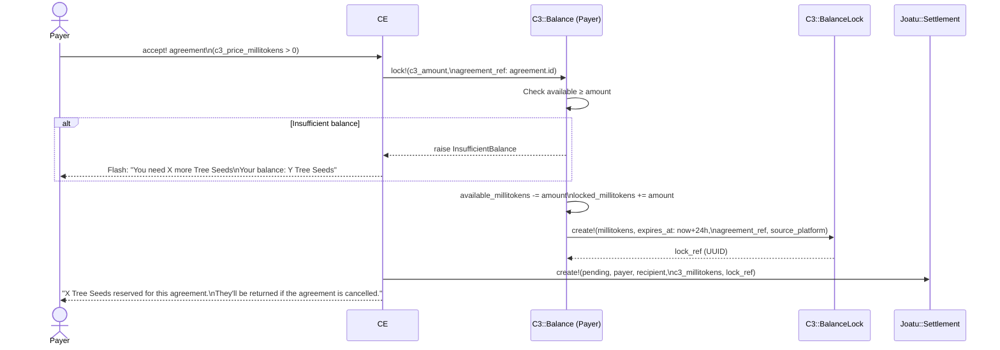
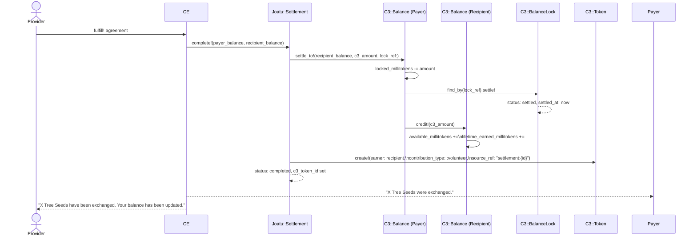
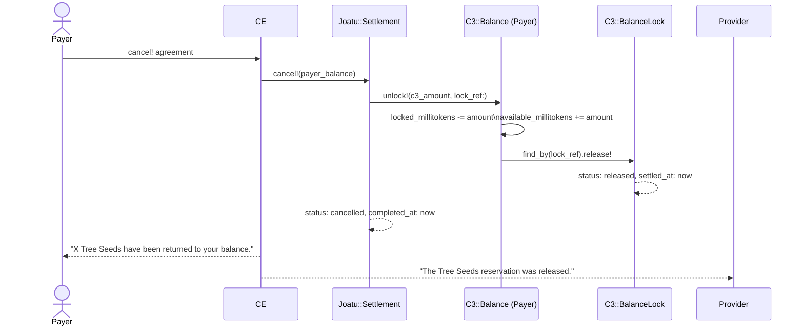
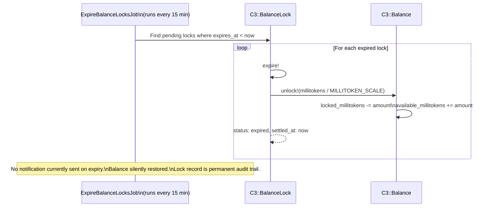
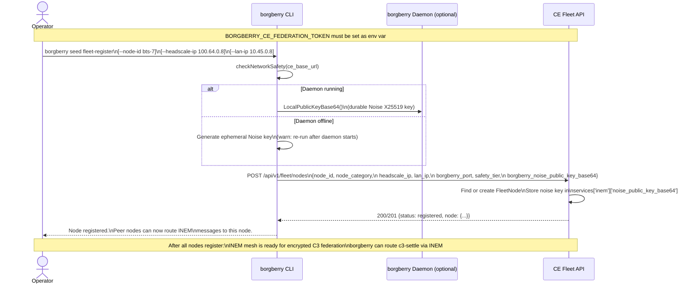

# C3 Federation — Transaction Flows

This document shows exactly how Tree Seeds move through the system for every scenario. Each flow has a plain-language summary, a sequence diagram, and a table of the records created or modified.

---

## Flow 1: Local C3 Earning

**Plain language:** When a borgberry node completes a job (compute, transcription, embedding), borgberry automatically records the contribution and credits the earner's Tree Seeds balance on their home platform. No human action is required.



**Records created/modified:**

| Record | Field changes |
|---|---|
| `C3::Token` (new) | earner, contribution_type, c3_millitokens, source_ref (encrypted), confirmed_at |
| `C3::Balance` (updated) | available_millitokens +=, lifetime_earned_millitokens += |

---

## Flow 2: Cross-Platform Token Seed

**Plain language:** When Tree Seeds earned on one platform need to be recognised on another platform (because the earner participates in both), a borgberry operator sends a "token seed" — a signed credit request — to the receiving platform. If the earner is enrolled there, their balance is credited immediately. If not, the credit is held and applied when they join.



**Records created/modified:**

| Record | Field changes |
|---|---|
| `C3::TokenSeed` (new, on peer platform) | type, identifier (hash), payload (encrypted), earner_did, c3_millitokens |
| `C3::Token` (new, on peer platform) | earner, federated: true, origin_platform, c3_millitokens (rate-adjusted), source_ref (hash) |
| `C3::Balance` (new or updated, on peer platform) | origin_platform set, available_millitokens +=, lifetime_earned_millitokens += |

---

## Flow 3: Agreement Lock (Accepting a C3-Priced Offer)

**Plain language:** When someone accepts an offer that has a Tree Seeds price, the right amount of Tree Seeds is immediately set aside (locked) from their balance. They can't spend those seeds elsewhere, but they haven't paid yet — the seeds are held in reserve until the service is delivered.



**Records created/modified:**

| Record | Field changes |
|---|---|
| `C3::Balance` (payer, updated) | available_millitokens -=, locked_millitokens += |
| `C3::BalanceLock` (new) | balance_id, lock_ref, millitokens, expires_at, status: pending |
| `Joatu::Settlement` (new) | agreement_id, payer, recipient, c3_millitokens, lock_ref, status: pending |
| `Joatu::Agreement` (updated) | status: accepted |

---

## Flow 4: Settlement Complete (Agreement Fulfilled)

**Plain language:** When both parties confirm the service has been delivered, the reserved Tree Seeds are transferred to the provider. An immutable record of the exchange is minted. Both parties receive a notification.



**Records created/modified:**

| Record | Field changes |
|---|---|
| `C3::Balance` (payer, updated) | locked_millitokens -= |
| `C3::Balance` (recipient, updated) | available_millitokens +=, lifetime_earned_millitokens += |
| `C3::BalanceLock` (updated) | status: settled, settled_at |
| `C3::Token` (new) | earner: recipient, contribution_type: volunteer, source_ref: "settlement:{id}" |
| `Joatu::Settlement` (updated) | status: completed, c3_token_id, completed_at |
| `Joatu::Agreement` (updated) | status: fulfilled |

---

## Flow 5: Settlement Cancel

**Plain language:** If either party cancels the agreement before it's fulfilled, the reserved Tree Seeds are immediately returned to the payer's available balance. Nothing is lost; the reservation is simply lifted.



**Records created/modified:**

| Record | Field changes |
|---|---|
| `C3::Balance` (payer, updated) | locked_millitokens -=, available_millitokens += |
| `C3::BalanceLock` (updated) | status: released, settled_at |
| `Joatu::Settlement` (updated) | status: cancelled, completed_at |
| `Joatu::Agreement` (updated) | status: cancelled |

---

## Flow 6: Lock Expiry (Automatic)

**Plain language:** If an agreement is accepted (locking Tree Seeds) but never fulfilled or cancelled — for example, if the peer platform goes offline — the locked Tree Seeds are automatically returned after 24 hours. No Tree Seeds are ever permanently frozen.



**Records modified:**

| Record | Field changes |
|---|---|
| `C3::Balance` (payer, updated) | locked_millitokens -=, available_millitokens += |
| `C3::BalanceLock` (updated) | status: expired, settled_at |

---

## Flow 7: Cross-Platform Lock (Remote Payer)

**Plain language:** When a payer on one platform wants to accept a C3-priced offer from a provider on a different platform, their borgberry node first requests a lock on their home platform's CE. The lock reference is then included in the settlement when the service completes, proving the C3 was reserved before the exchange.

```mermaid
sequenceDiagram
    actor Operator as borgberry Operator (payer's node)
    participant CLI as borgberry CLI
    participant HomeCE as Payer's Home CE
    participant PeerCE as Provider's CE Platform

    Note over Operator,PeerCE: Payer is on Platform A; Provider is on Platform B\nPlatformConnection must allow_c3_exchange on both sides

    Operator->>CLI: borgberry seed c3-lock\n--payer-did did:key:payerDID\n--c3-amount 3.0\n--agreement-ref joatu:agreement-uuid\n--ce-url https://platform-a.internal

    CLI->>CLI: checkNetworkSafety(ce_base_url)
    CLI->>HomeCE: POST /federation/c3/lock_requests\n{payer_did, c3_millitokens, agreement_ref}

    HomeCE->>HomeCE: Find payer by borgberry_did\nCheck C3::Balance.available ≥ amount
    alt Insufficient balance
        HomeCE-->>CLI: 402 {error: "Insufficient Tree Seeds balance"}
    end
    HomeCE->>HomeCE: balance.lock!(c3_amount,\nagreement_ref, source_platform)
    HomeCE-->>CLI: 200 {lock_ref: "uuid", c3_millitokens}

    Note over Operator,PeerCE: Later — when service is delivered —\ninclude lock_ref in the settlement

    Operator->>CLI: borgberry seed c3-settle\n--payer-did ...\n--earner-did ...\n--lock-ref uuid\n--c3-amount 3.0

    CLI->>PeerCE: POST /federation/c3/token_seeds\n{earner_did, payer_did, lock_ref, c3_millitokens}

    PeerCE->>PeerCE: Verify BalanceLock exists for payer_did+lock_ref\nApply to recipient balance
    PeerCE-->>CLI: 201 {applied: true}
```

**Records created/modified:**

| Record | Field changes |
|---|---|
| `C3::Balance` (payer, on home CE) | available_millitokens -=, locked_millitokens += |
| `C3::BalanceLock` (new, on home CE) | lock_ref, source_platform, millitokens, expires_at |
| `C3::TokenSeed` (new, on peer CE) | earner_did, payer_did, lock_ref, c3_millitokens |
| `C3::Token` (new, on peer CE) | federated token for recipient |
| `C3::Balance` (recipient, on peer CE) | available_millitokens += |

---

## Flow 8: Fleet Registration

**Plain language:** Before borgberry nodes can communicate securely with each other and with CE platforms, each node must register itself. This tells the community platform: "This node exists, here is its address, and here is its public encryption key." After registration, all nodes can find each other and set up encrypted channels.



**Records created/modified:**

| Record | Field changes |
|---|---|
| `FleetNode` (new or updated) | node_id, headscale_ip, lan_ip, borgberry_port, node_category, safety_tier, services.inem.noise_public_key_base64 |
