# C3 Federation — Network Topology & Security Model

This document is for security reviewers, operators, and system administrators. It covers network architecture, encryption layers, access control, audit trail, and privacy properties.

The guiding principle is **fail-closed**: any path that cannot be secured is blocked, not degraded. Encryption failures cause operations to stop, not fall back to plaintext. Untrusted network sources are rejected at the door.

---

## Network Topology

```mermaid
graph TD
    subgraph Fleet["BTS Fleet — borgberry nodes (:8790)"]
        direction LR
        bts0["bts-0\nRTX 2070\nOrchestrator\n100.64.0.1"]
        bts1["bts-1\nDokku / CE production\n100.64.0.2"]
        bts3["bts-3 CE primary\n100.64.0.4"]
        bts7["bts-7 M1 Metal\n100.64.0.8"]
        ph0["bts-ph-0 S22\n100.64.0.20"]
    end

    subgraph CE["Community Engine Platforms"]
        direction LR
        ce_bts["CE BTS\nbts-1 / bts-3"]
        ce_nn["CE newcomernavigatornl.ca\nbts-1"]
    end

    subgraph Mesh["Headscale WireGuard (100.64.0.0/10)"]
        hs["Headscale coordinator\nbts-0:8080"]
    end

    subgraph Edge["Public Edge — NO INEM"]
        do2["do-2 Pangolin/Traefik\nexternal access only"]
    end

    bts0 ---|"Noise_XX INEM"| bts1
    bts0 ---|"Noise_XX INEM"| bts3
    bts0 ---|"Noise_XX INEM"| bts7
    bts0 ---|"Noise_XX INEM"| ph0
    bts0 -->|WireGuard| hs
    bts1 -->|WireGuard| hs
    bts3 -->|WireGuard| hs
    bts7 -->|WireGuard| hs
    bts1 --- ce_bts
    bts3 --- ce_bts
    bts1 --- ce_nn
    bts0 <-->|"HTTPS C3 federation\nHeadscale preferred"| ce_bts
    bts0 <-->|"HTTPS C3 federation\nHeadscale preferred"| ce_nn
    ce_bts <-.->|"C3 TokenSeed exchange\nbilateral opt-in"| ce_nn
    hs -.->|"Pangolin tunnel fallback"| do2

    style Fleet fill:#1a2a3a,stroke:#4488aa
    style CE fill:#1a3a1a,stroke:#44aa44
    style Mesh fill:#1c1917,stroke:#888
    style Edge fill:#3a1a1a,stroke:#cc4444
```

---

## Network Trust Tiers

All C3 federation and INEM traffic must route through the BTS encrypted mesh. Trust decreases as traffic moves further from the mesh:

| Tier | Network | Description | INEM allowed? | C3 federation allowed? |
|---|---|---|---|---|
| 1 — Preferred | Headscale (100.64.x.x) | WireGuard mesh — all traffic encrypted at transport layer | Yes | Yes |
| 2 — Acceptable | LAN (10.45.x.x) | Physical LAN — acceptable within same location | Yes | Yes |
| 3 — Fallback | Pangolin tunnel | External zero-trust gateway — encrypted but higher latency | Limited | Yes (log incident) |
| 4 — Blocked | Public internet | Not trusted for INEM; C3 HTTPS logged as incident | No | Incident logged |

When borgberry routes a C3 federation call over public internet (Tier 4), it writes a structured incident entry to `<borgberry_home>/logs/credential_incidents/events.jsonl` and warns the operator. INEM rejects connections from public internet IPs outright.

---

## Encryption Layers

### In Transit

| Layer | Protocol | What it protects | Who can read |
|---|---|---|---|
| INEM envelope transport | HTTPS (TLS) | The NoiseCiphertext blob in transit between nodes | Transport layer only — payload still encrypted |
| INEM payload | Noise_X (X25519) | C3 settlement payload, DID, amounts | Intended recipient node only |
| C3 federation API | HTTPS (TLS) | POST body to CE `/federation/c3/*` | The CE platform only |

INEM uses application-layer encryption (Noise_X) **on top of** transport-layer TLS. A relay node sees only the envelope header (from_node_id, to_node_id, message_id) — never the payload. Even a compromised relay cannot read the content.

### At Rest

| What | Mechanism | Key location | Who can read |
|---|---|---|---|
| INEM relay log lines | age X25519 (per-line base64) | `<borgberry_home>/.inem-relay.age.key` (0600) | Only the key holder |
| Consent grant files | age X25519 (per-file) | `<borgberry_home>/.consent-grants.age.key` (0600) | Only the key holder |
| `Person.borgberry_did` | AR::Encryption (deterministic) | `config/credentials.yml.enc` | Application only; not readable from DB dump |
| `C3::Token.source_ref` | AR::Encryption (deterministic) | `config/credentials.yml.enc` | Application only |
| `C3::TokenSeed.payload` | AR::Encryption | `config/credentials.yml.enc` | Application only |

**Key file permissions:** All age key files are created with `0600` (owner read/write only). If a key file is not readable, the operation that requires it fails closed — it does not fall back to plaintext.

**Backward compatibility for reads:** If an existing relay log or grant file was written before encryption was enabled, the reader will warn on stderr and return the legacy plaintext line. New writes are always encrypted or fail.

---

## Access Control Matrix

### CE Federation Endpoints

| Endpoint | Auth required | Scope required | Additional check |
|---|---|---|---|
| `POST /federation/c3/token_seeds` | FederationAccessToken | `c3.exchange` | `PlatformConnection.allow_c3_exchange?` |
| `POST /federation/c3/lock_requests` | FederationAccessToken | `c3.exchange` | `PlatformConnection.allow_c3_exchange?` |
| `GET /api/v1/c3/network_balance` | FederationAccessToken | (own DID or admin) | Own borgberry_did OR platform admin role |
| `POST /api/v1/c3/contributions` | borgberry service token | (contribution scope) | Rate validation |
| `POST /api/v1/fleet/nodes` | FederationAccessToken | (fleet scope) | Valid node_id |

### borgberry INEM Endpoints

| Endpoint | IP allowlist | Auth | Additional check |
|---|---|---|---|
| `POST /inem/transit` | Headscale + LAN + loopback | None (Noise_X payload auth) | `inemTrustedMiddleware` (403 for untrusted IPs) |
| `/inem/c3/token_seed` | Headscale + LAN + loopback | INEM router must be initialized | 503 if `inRouter == nil` (unless `BORGBERRY_INEM_DEBUG=true`) |

**Trusted IP ranges for INEM:** `127.0.0.1`, `::1`, `10.0.0.0/8`, `100.64.0.0/10`, `100.90.0.0/16`.

---

## Fail-Closed Points

The following situations cause the operation to stop rather than degrade silently:

| Situation | Behaviour | Why |
|---|---|---|
| INEM router is nil (not initialized) | `POST /inem/*` → 503 | Prevents unauthenticated plain JSON settlement |
| Source IP not in trusted range | `POST /inem/*` → 403 | Rejects public internet INEM attempts |
| Route not found / expired | `Send()` returns error | Node can't route to unknown peers |
| Peer Noise key not registered | `Send()` returns error | Can't encrypt without recipient key |
| age key file unreadable (write path) | Write operation fails with error | Never write plaintext relay log or grant |
| age key file unreadable (read path) | Returns legacy plaintext with stderr warning | Backward compat for existing files only |
| `PlatformConnection.allow_c3_exchange?` false | `c3_token_seeds_controller` → 403 | No unilateral exchange |
| `C3::Balance.available < requested` | `lock!` raises `InsufficientBalance` | Can't lock more than available |
| Duplicate token seed (same identifier) | `RecordNotUnique` → 409 | No double-credit |
| `c3_millitokens > MAX_SINGLE_TRANSACTION_MILLITOKENS` | Validation error → 422 | Ceiling on transaction size |
| Federation token in config file (not env) | Startup warning + token cleared | Never store secrets in files |

---

## Audit Trail

Every C3 event produces an immutable record. No C3 record is ever destructively deleted.

| Event | Immutable record | Key fields |
|---|---|---|
| Contribution earned | `C3::Token` | earner, amount, type, source_ref (encrypted), timestamps |
| Balance update | `C3::Balance` | running totals — all updates are atomic increments |
| C3 locked | `C3::BalanceLock` | lock_ref, amount, expires_at, source_platform |
| C3 settled | `C3::BalanceLock` (settled) + `Joatu::Settlement` (completed) + `C3::Token` (minted) | chain of custody |
| C3 unlocked / cancelled | `C3::BalanceLock` (released) + `Joatu::Settlement` (cancelled) | full audit |
| Lock expired | `C3::BalanceLock` (expired) | automatic refund recorded |
| Cross-platform credit | `C3::TokenSeed` + `C3::Token` (federated) | exchange rate, origin platform |
| INEM relay | Relay log (age-encrypted) | anonymised: segment, relay_count, avg_latency_ms (no payload, no identities) |
| Public internet routing | Incident log JSONL | timestamp, host, operation |
| Fleet node registration | `FleetNode` | node_id, IPs, Noise public key |

---

## Privacy Properties

### Relay Log k-Anonymity

INEM relay logs do not record individual messages. Instead, relay events are bucketed into 60-second windows per segment (sender→receiver pair). A segment's window is only flushed to disk if it contains **3 or more** events (k=3 anonymity threshold). Segments with fewer than 3 relays in a window are dropped — isolated exchanges are not logged.

This prevents an attacker who obtains the relay log from inferring when specific pairs of nodes are communicating.

### DID Enumeration Prevention

- The `GET /api/v1/c3/network_balance` endpoint requires the caller to be either the DID owner or a platform administrator. Random authenticated users cannot probe other members' balances by DID.
- The `POST /federation/c3/lock_requests` error response uses a generic message ("lock request could not be processed") regardless of whether the payer DID was found. This prevents enumeration of who has a borgberry DID on the platform.

### source_ref Scrubbing

When a `C3::TokenSeed` is built from a local `C3::Token`, the `source_ref` (which may contain internal agreement UUIDs) is replaced with a SHA-256 hash: `SHA256("c3token:{source_ref}:{source_platform_identifier}")`. The hash travels cross-platform; the raw ref stays local. This prevents internal agreement IDs from leaking to peer platforms.

### borgberry_did Encryption

`Person.borgberry_did` is encrypted with AR::Encryption (deterministic mode, so `find_by` lookups still work). A database dump does not expose borgberry DIDs. Decryption requires the application's `config/credentials.yml.enc` key.

---

## Key Management Summary

| Key | Type | Location | Permissions | Who generates |
|---|---|---|---|---|
| INEM relay log age key | age X25519 | `<borgberry_home>/.inem-relay.age.key` | 0600 | `ensureAgeKey()` on first write |
| Consent grant age key | age X25519 | `<borgberry_home>/.consent-grants.age.key` | 0600 | `ensureAgeKey()` on first write |
| INEM Noise key pair (ephemeral) | Noise X25519 | In-memory only (Phase F0) | — | `GenerateNoiseKeyPair()` on startup |
| CE AR encryption key | AES-256-GCM | `config/credentials.yml.enc` | Operator-managed | `rails credentials:edit` (already done on all production apps) |
| CE FederationAccessToken | Symmetric | Env: `BORGBERRY_CE_FEDERATION_TOKEN` | Never in config file | Platform administrator |

> **Phase F0 note:** INEM Noise keys are currently generated fresh on each daemon start (ephemeral). Phase 2 will move to persistent keys stored in an operator-controlled USB VeraCrypt vault. Until then, each daemon restart requires re-running `borgberry seed fleet-register` to update the CE fleet registry with the new Noise public key.
