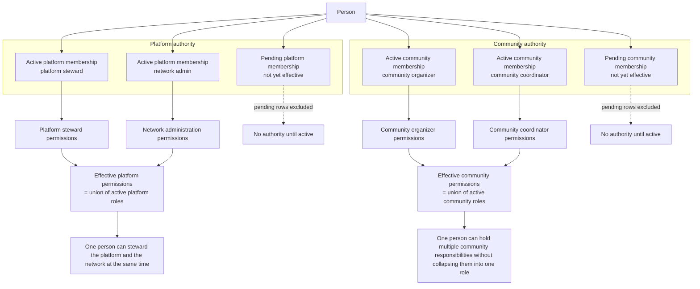
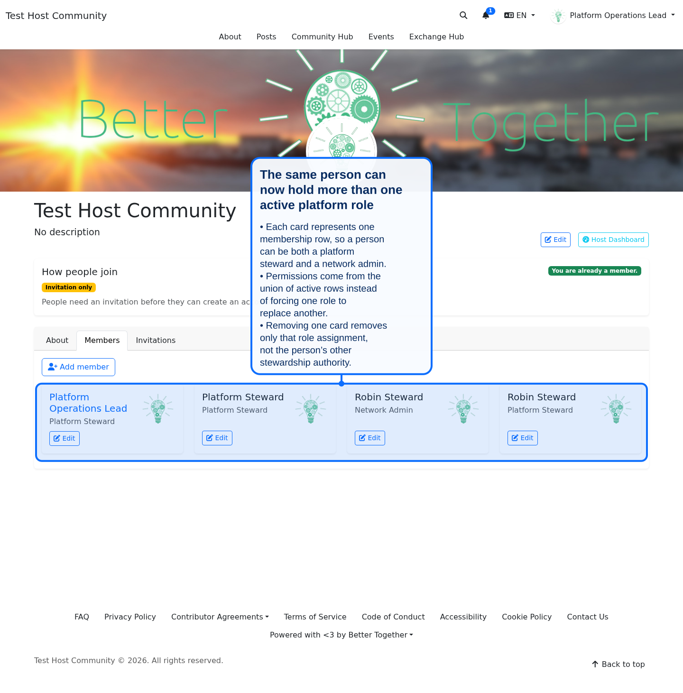
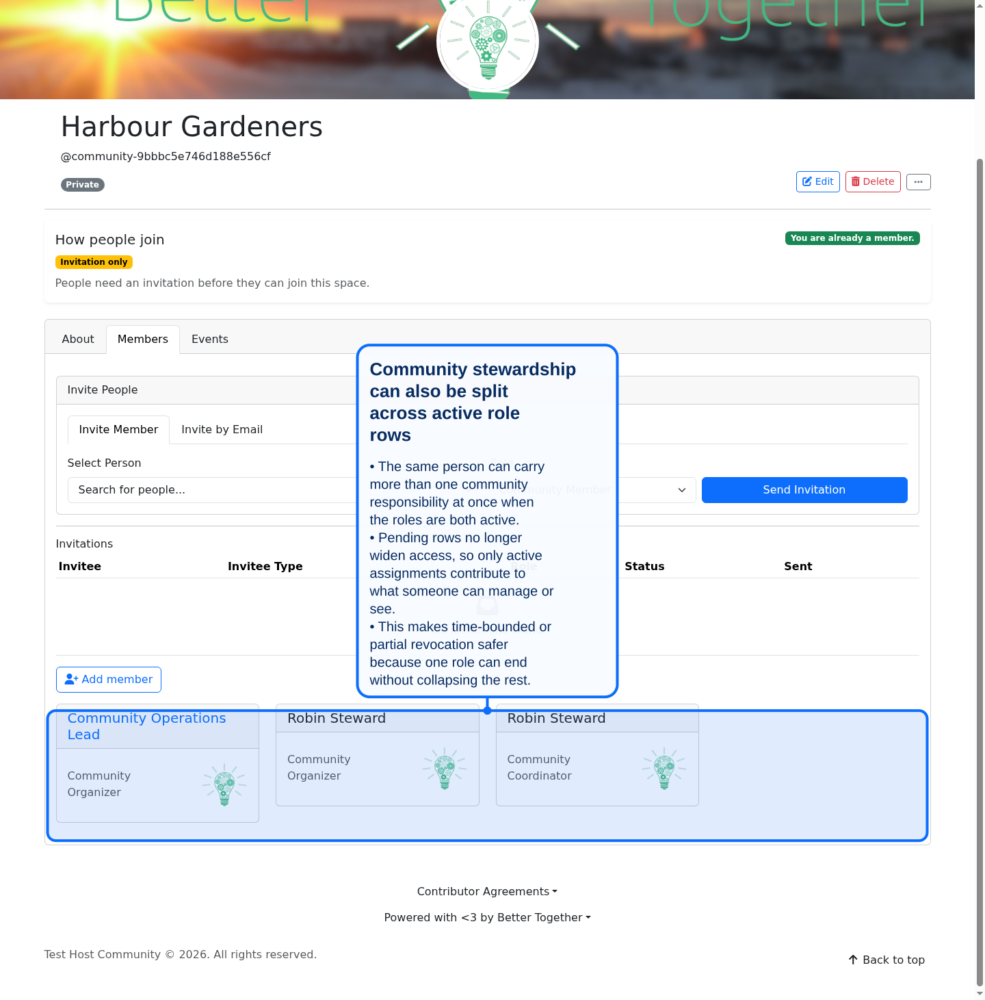

# Community Management

This section describes how to manage communities, partners, invitations, memberships, and conversations.

## People

- **Create & Edit**: Add or modify person profiles, including name, email, profile image, and bio.
- **Search & Filter**: Locate individuals by name, email, community membership, or role.
- **Bulk Actions**: Import, export, or deactivate multiple person records via CSV operations.

## Communities

- **Host Community**: Register, customize, and activate new communities with unique branding, privacy, and membership settings.

- **Future Expansions**:
  - **Personal Communities**: Allow individuals to create their own private community spaces.
  - **Geospatial Communities**: Auto-generate communities based on geographic boundaries (regions, cities).
  - **Language Communities**: Segment communities by preferred language/localization.
  - **Nested Sub-Communities**: Enable hierarchical community structures (chapters, subgroups) under a parent community.

## Partners

- **Name & Description**: Set partner name, subtitle, and summary description for public listings.
- **Images**: Upload and manage partner logo, cover image, and photo galleries.
- **Contact Details**: Store multiple addresses, phone numbers, email addresses, and social links via the contact detail editor.
- **Mapping & Locations**: Geolocate partners on maps, define service areas, and display interactive location markers.

## Invitations

- **Platform Invitations**: Send email invites to new users, assign default roles, and monitor acceptance rates.
- **Guest Access**: Create time-limited guest tokens for one-click entry without account creation.
- **Invitation Lifecycle**: Track invitation statuses (pending, accepted, expired), resend or revoke invites, and view audit logs.

## Memberships

- **Role Assignment**: Grant or revoke platform/community roles for individuals, controlling their access and capabilities.
- **Join & Leave**: Manage community membership directly or require approval; bulk-add or remove members as needed.

### Multiple active roles now stack

Community Engine `0.11.0` now treats each active membership row as its own role assignment.

- the same person can hold more than one active role on the same platform
- the same person can hold more than one active role in the same community
- effective permissions come from the union of those active roles
- pending memberships no longer grant access or reviewer visibility before activation

This means someone can be both a **platform steward** and a **network admin** on one platform, or both a **community organizer** and a **community coordinator** inside one community, without losing either set of responsibilities.

**Diagram Files:**
- [Mermaid Source](../diagrams/source/release_0_11_0_membership_role_stacking_flow.mmd)
- [PNG Export](../diagrams/exports/png/release_0_11_0_membership_role_stacking_flow.png)
- [SVG Export](../diagrams/exports/svg/release_0_11_0_membership_role_stacking_flow.svg)

### Platform membership cards with stacked roles

- each card represents one active membership row
- the same person can appear twice when they hold two distinct active roles
- removing one row removes only that role assignment

### Community membership cards with stacked roles

- community stewardship works the same way as platform stewardship
- multiple active roles can coexist for one person inside one community
- pending rows stay non-authoritative until they are activated

## Conversations & Messaging

- **Conversations**: Create new conversation threads (group or one-on-one), name channels, and add participants.
- **Messages**: Compose and edit rich-text messages (attachments supported) that update in real time via WebSockets.
- **Notifications**: Configure in-app toast and persistent alerts, as well as email digests for unread messages and mentions.
