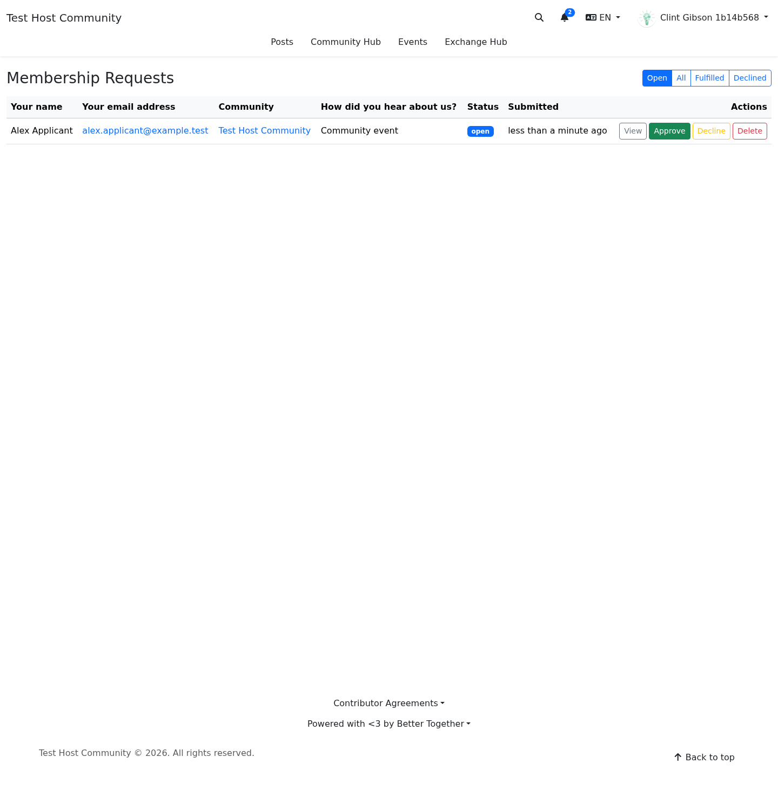

# Membership and Reporting Protection

**Target Audience:** Community organizers and moderators  
**Document Type:** Organizer guide  
**Last Updated:** April 2026

## Overview

Community Engine `0.11.0` adds a built-in bot-safety baseline to the public intake paths that organizers rely on most:

- sign-up and invitation-adjacent intake
- membership requests
- safety reports

This lowers spam and scripted abuse before requests reach your review queues, while keeping human review and organizer judgment in place.

## What organizers should know

### Membership requests are still a human decision

The new protection only guards the intake path. It does **not** auto-approve, auto-decline, or silently rank people by trust.

Organizers still decide:

- who to admit
- when to ask follow-up questions
- when to decline or escalate a request

### Safety reports still require careful review

The protection helps reduce automated misuse of the report form. It does **not** replace:

- community safety judgment
- platform safety escalation
- documentation of participant-visible follow-up

### Hidden checks do not create a visible challenge by default

Community Engine's built-in baseline is local-first and quiet. Most legitimate people will not see a captcha or challenge screen.

If you need stricter protection for a specific host app, Turnstile can still be layered on through the existing host-app captcha seam.

## What changed in practice

### Before

- protected public forms depended mostly on generic throttling and any host-app-specific captcha integration
- the default engine path did not provide a coherent human-verification layer on its own

### Now

- protected forms carry a signed proof that the page was served by the site
- hidden trap fields and timing windows help catch scripted submissions
- reused proofs are rejected
- challenge issuance itself is rate-limited

## What to review when requests look suspicious

If a real person says their request or report was rejected:

1. ask which form they used
2. ask whether they refreshed and retried
3. note whether they were using aggressive autofill or browser automation
4. escalate repeated failures to platform support if the pattern continues

## What remains out of scope

- this is not a full fraud-detection system
- this is not a replacement for moderation review
- this does not automatically classify or score submitters

## Visual review surfaces

### Membership request queue

## Related references

- [Membership Request Workflow](../developers/systems/membership_request_workflow.md)
- [Escalation Matrix](../shared/escalation_matrix.md)
- [Bot Safety Operations](../platform_organizers/bot_safety_operations.md)

