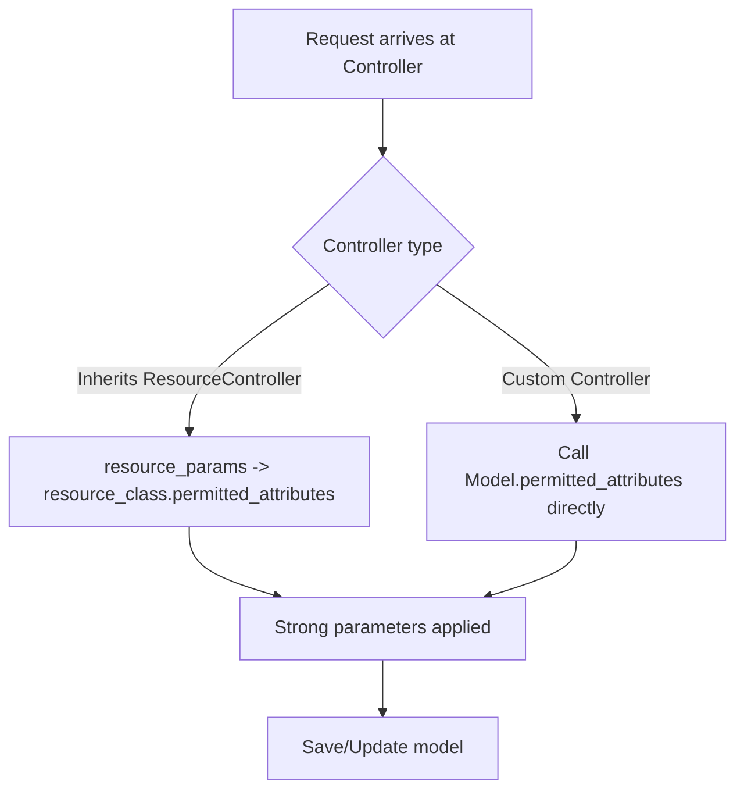

## ResourceController & model-level permitted_attributes

This document explains how the `ResourceController` and `FriendlyResourceController` cooperate with model-level `permitted_attributes` to centralize strong parameter definitions.

Key points
- `ResourceController#permitted_attributes` returns `resource_class.permitted_attributes`.
- Controllers inheriting from `ResourceController` or `FriendlyResourceController` use `resource_params` which delegates to `permitted_attributes` so you normally don't need to implement `*_params` methods in those controllers.
- For controllers that do not inherit from `ResourceController`, prefer calling `Model.permitted_attributes` directly, for example:

```ruby
def conversation_params
  params.require(:conversation).permit(*BetterTogether::Conversation.permitted_attributes)
end
```

Composing nested permitted attributes
- Instead of hard-coding nested permit lists, compose them by referencing other models' `permitted_attributes`. Example:

```ruby
class BetterTogether::Message < ApplicationRecord
  def self.permitted_attributes
    %i[id sender_id content _destroy]
  end
end

class BetterTogether::Conversation < ApplicationRecord
  def self.permitted_attributes
    [:title, { participant_ids: [] }, { messages_attributes: BetterTogether::Message.permitted_attributes }]
  end
end
```

Flow diagram



Why this pattern
- Single source of truth for strong parameters.
- Easier to compose nested attributes.
- Reduces duplication and accidental permission mismatches.

Where to update
- If you add nested attributes, update the child model with `self.permitted_attributes` and reference it from the parent model.
- When adding controllers, prefer inheriting `ResourceController` if the resource fits that pattern; otherwise call `Model.permitted_attributes` explicitly.
