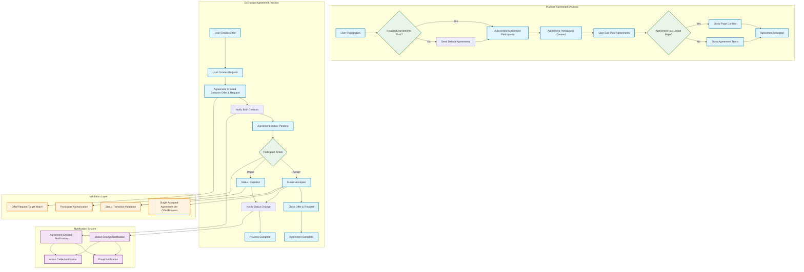

# Agreements System Documentation

## Overview

The Better Together Community Engine includes a comprehensive agreements system that serves two primary purposes:

1. **Platform Agreements** - Legal agreements that users accept when using the platform (privacy policy, terms of service, code of conduct)
2. **Exchange Agreements** - Specific agreements between users for resource exchange through the Joatu system

## Process Flow Diagram



**Diagram Files:**
- 📊 [Mermaid Source](../diagrams/source/agreements_system_flow.mmd) - Editable source
- 🖼️ [PNG Export](../diagrams/exports/png/agreements_system_flow.png) - High-resolution image  
- 🎯 [SVG Export](../diagrams/exports/svg/agreements_system_flow.svg) - Vector graphics

### Process Flow Explanation

The diagram above illustrates two distinct agreement processes:

**Platform Agreement Process (Top Section)**:
- Triggered during user registration
- Automatically creates agreement participants for required legal agreements
- Uses Agreement Builder to seed default agreements if they don't exist
- Supports flexible content display through linked pages or direct agreement terms

**Exchange Agreement Process (Middle Section)**:
- Initiated when users create agreements between offers and requests
- Implements a strict state machine: pending → accepted/rejected
- Includes comprehensive validation and authorization checks
- Automatically closes associated offers and requests upon acceptance

**Supporting Systems (Bottom Sections)**:
- **Validation Layer**: Ensures data integrity and business rule compliance
- **Notification System**: Provides real-time updates via multiple channels

The diagram uses color coding to distinguish different types of operations:
- 🔵 **Blue**: Core process steps
- 🟠 **Orange**: Validation and constraint checks
- 🟣 **Purple**: Notification and communication
- 🟢 **Green**: Decision points and conditional logic

## System Architecture

### Core Models

#### 1. Agreement (`BetterTogether::Agreement`)

**Purpose**: Platform-level agreements that define terms and conditions for using the platform.

**Key Features**:
- Multilingual support with translatable title and description
- Optional page linking (can show custom content instead of terms)
- Protected agreements cannot be deleted
- Privacy levels (public, private, etc.)
- Unique identifier system

**Associations**:
- `has_many :agreement_participants` - Users who have accepted the agreement
- `has_many :participants, through: :agreement_participants` - Direct access to people
- `has_many :agreement_terms` - Individual terms within the agreement
- `belongs_to :page` (optional) - Links to custom page content

**Database Schema**:
```ruby
# better_together_agreements table
t.references :creator
t.string :identifier
t.boolean :protected
t.string :privacy
t.references :page (optional)
t.timestamps
```

#### 2. AgreementParticipant (`BetterTogether::AgreementParticipant`)

**Purpose**: Join table tracking which users have accepted specific agreements.

**Key Features**:
- Unique constraint per agreement/person combination
- Timestamp tracking when agreement was accepted
- Optional group identifier for batch processing

**Associations**:
- `belongs_to :agreement`
- `belongs_to :person`

**Database Schema**:
```ruby
# better_together_agreement_participants table
t.references :agreement
t.references :person
t.string :group_identifier
t.datetime :accepted_at
# Unique index on [agreement_id, person_id]
```

#### 3. AgreementTerm (`BetterTogether::AgreementTerm`)

**Purpose**: Individual terms or sections within a platform agreement.

**Key Features**:
- Positioned ordering within agreements
- Multilingual support
- Rich text content via Action Text
- Protected terms cannot be deleted

**Associations**:
- `belongs_to :agreement`

**Database Schema**:
```ruby
# better_together_agreement_terms table
t.string :identifier
t.integer :position
t.boolean :protected
t.references :agreement
```

#### 4. Joatu::Agreement (`BetterTogether::Joatu::Agreement`)

**Purpose**: Specific agreements between users for resource exchange (offers and requests).

**Key Features**:
- Status tracking (pending, accepted, rejected)
- Strict state machine with validation
- Automatic closure of associated offers/requests
- Notification system for status changes
- Prevents multiple accepted agreements per offer/request

**Status Flow**:
```
pending → accepted (closes offer & request)
pending → rejected
accepted/rejected → no further changes allowed
```

**Associations**:
- `belongs_to :offer`
- `belongs_to :request`

**Database Schema**:
```ruby
# better_together_joatu_agreements table
t.references :offer
t.references :request
t.text :terms
t.string :value
t.string :status (default: 'pending')
# Partial unique indexes ensure only one accepted agreement per offer/request
```

### Supporting Components

#### Builders
- **AgreementBuilder**: Seeds initial platform agreements (privacy policy, terms of service, code of conduct)

#### Controllers
- **AgreementsController**: CRUD operations for platform agreements
- **Joatu::AgreementsController**: Manages exchange agreements with accept/reject actions

#### Policies
- **AgreementPolicy**: Authorization for platform agreements (mostly admin-only)
- **Joatu::AgreementPolicy**: Authorization for exchange agreements (participants only)

#### Notifiers
- **Joatu::AgreementNotifier**: Notifies when new agreements are created
- **Joatu::AgreementStatusNotifier**: Notifies when agreement status changes

## User Workflows

### Platform Agreement Acceptance

1. **User Registration**: Automatically creates agreement participants for required agreements
2. **Agreement Display**: Users can view agreements via modal or dedicated pages
3. **Page Linking**: Agreements can link to custom pages for detailed content

**Code Example**:
```ruby
# From RegistrationsController
def create_agreement_participants(person)
  identifiers = %w[privacy_policy terms_of_service]
  identifiers << 'code_of_conduct' if BetterTogether::Agreement.exists?(identifier: 'code_of_conduct')
  agreements = BetterTogether::Agreement.where(identifier: identifiers)
  agreements.find_each do |agreement|
    BetterTogether::AgreementParticipant.create!(
      agreement: agreement, 
      person: person, 
      accepted_at: Time.current
    )
  end
end
```

### Exchange Agreement Process

1. **Agreement Creation**: User creates agreement linking an offer and request
2. **Notification**: Both offer and request creators are notified
3. **Review**: Participants can accept or reject the agreement
4. **Completion**: Accepted agreements close both offer and request
5. **Status Tracking**: All status changes are logged and participants notified

**Validation Rules**:
- Offer and request must target the same resource
- Only one accepted agreement per offer/request
- Status transitions are strictly controlled
- No changes allowed once accepted/rejected

## Database Constraints

### Platform Agreements
- Unique identifier per agreement
- Unique agreement/person combination for participants

### Exchange Agreements  
- Partial unique indexes ensure only one accepted agreement per offer
- Partial unique indexes ensure only one accepted agreement per request
- Foreign key constraints to offers and requests

## Integration Points

### User Registration
- Automatically creates agreement participants for core platform agreements
- Required agreements: privacy_policy, terms_of_service
- Optional agreement: code_of_conduct (if exists)

### User Profiles
- Displays accepted agreements in user profile views
- Shows acceptance timestamps
- Links to full agreement text

### Notifications
- Real-time notifications via Action Cable
- Email notifications (configurable per user)
- Notification marking as read when viewing agreements

### Content Management
- Agreements can link to custom pages for rich content
- Falls back to agreement terms if no page linked
- Supports Action Text for rich formatting

## Access Control

### Platform Agreements
- Public viewing of all agreements
- Admin-only creation and editing
- Protected agreements cannot be deleted

### Exchange Agreements
- Participants-only access (offer/request creators)
- Platform managers have full access
- Strict authorization on accept/reject actions

## API Endpoints

### Platform Agreements
```
GET  /agreements/:id       # View agreement (public)
GET  /host/agreements      # Admin index (authenticated)
POST /host/agreements      # Create agreement (admin)
PUT  /host/agreements/:id  # Update agreement (admin)
```

### Exchange Agreements
```
GET  /exchange/agreements           # Index (authenticated)
POST /exchange/agreements           # Create agreement
GET  /exchange/agreements/:id       # View agreement (participants)
POST /exchange/agreements/:id/accept # Accept agreement
POST /exchange/agreements/:id/reject # Reject agreement
```

## Error Handling

### Platform Agreements
- Validation errors for missing required fields
- Protected record deletion prevention
- Unique identifier enforcement

### Exchange Agreements
- Status transition validation
- Offer/request matching validation  
- Single accepted agreement enforcement
- Closed offer/request handling

## Testing Strategy

### Model Tests
- Factory validation
- Association testing
- Validation rules
- Status transition logic
- Callback behavior

### Integration Tests  
- User registration agreement creation
- Agreement acceptance/rejection flows
- Notification delivery
- Authorization enforcement

### Feature Tests
- End-to-end agreement workflows
- UI interaction testing
- Error handling scenarios

## Future Enhancements

### Potential Features
- Agreement versioning and updates
- Bulk agreement management
- Agreement templates
- Advanced filtering and search
- Agreement analytics and reporting
- Multi-party agreements beyond 2 participants

### Technical Improvements
- API documentation enhancement
- Performance optimization for large-scale deployments
- Enhanced notification customization
- Improved admin interface

## Configuration

### Seeding Initial Agreements
```ruby
# Run in console or seeds file
BetterTogether::AgreementBuilder.seed_data
```

### Email Notifications
Controlled by user preferences:
```ruby
user.notification_preferences['notify_by_email']
```

### Protected Agreements
Core platform agreements are marked as protected and cannot be deleted:
```ruby
agreement = Agreement.create!(
  identifier: 'privacy_policy',
  protected: true,
  title: 'Privacy Policy',
  privacy: 'public'
)
```

## Troubleshooting

### Common Issues
1. **Agreement participants not created on registration**: Check agreement builder seeding
2. **Status transition errors**: Verify offer/request are not already closed
3. **Notification delivery failures**: Check user email preferences and mailer configuration
4. **Authorization errors**: Verify user has proper permissions or is agreement participant

### Debug Commands
```ruby
# Check user agreement participation
person.agreement_participants.includes(:agreement)

# Verify agreement status
agreement.status_pending? # => true/false

# Check agreement constraints
Agreement.where(identifier: 'privacy_policy').exists?

# View agreement notifications
person.notifications.where(type: 'BetterTogether::Joatu::AgreementNotifier')
```

This comprehensive system provides a robust foundation for both legal compliance through platform agreements and user-to-user coordination through exchange agreements, with proper validation, notifications, and access control throughout.
