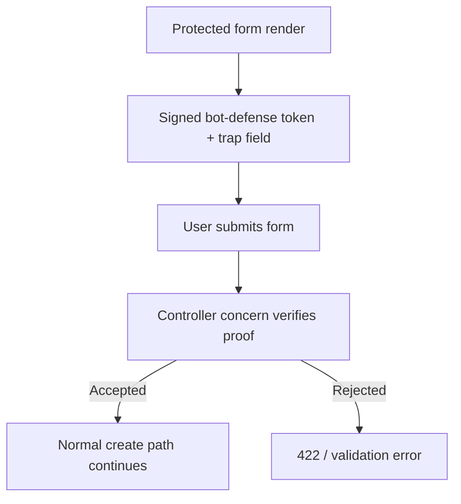
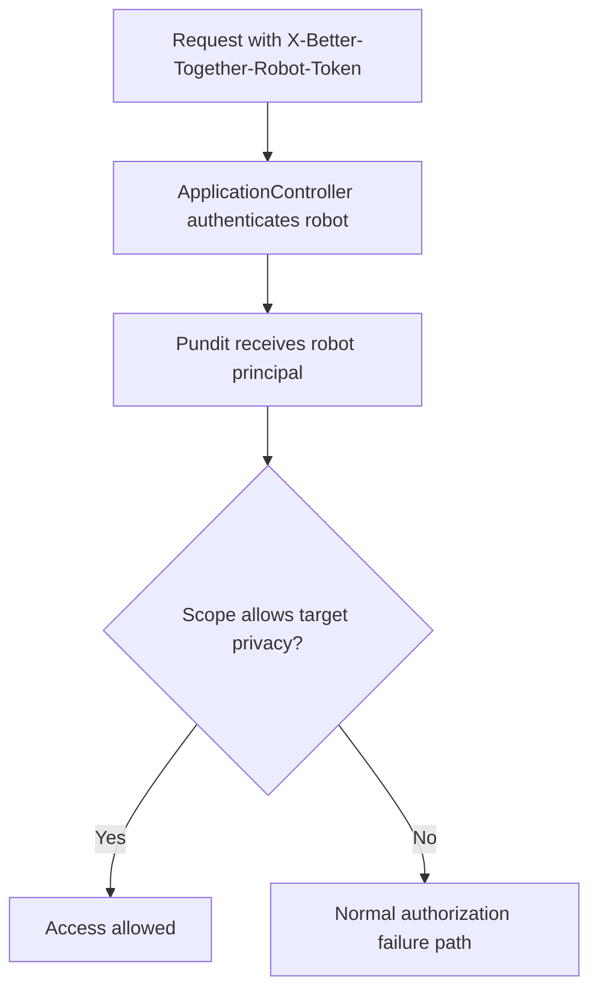

# Bot Safety System

## Overview

Community Engine `0.11.0` adds a built-in, local-first bot-safety baseline for the public write surfaces that need protection on day one, while also establishing a first-party robot principal for controlled automated access.

This system has two distinct lanes:

1. **human submission protection** for public or semi-public forms
2. **authorized robot access** for explicit machine principals

## Why it was added

Before this work, Community Engine had useful building blocks such as Rack::Attack throttles and host-app captcha seams, but the engine default still lacked a coherent production-ready baseline for public intake.

The new system provides a safer default without requiring:

- a third-party challenge service
- a host-app-specific gem
- undocumented scraper access to protected content

## Human submission protection

### Covered surfaces

- `BetterTogether::Users::RegistrationsController#create`
- `BetterTogether::MembershipRequestsController#create`
- `BetterTogether::Api::V1::MembershipRequestsController#create`
- `BetterTogether::ReportsController#create`

### Core service

`app/models/better_together/bot_defense/challenge.rb`

The challenge service:

- signs a payload with `ActiveSupport::MessageVerifier`
- binds the payload to a `form_id`
- includes:
  - `issued_at`
  - `nonce`
  - `trap_field`
  - optional `user_agent`
- rejects:
  - invalid signatures
  - expired proofs
  - submissions that arrive too quickly
  - filled honeypots
  - replayed nonces
  - user-agent mismatches when a user agent was embedded in the proof

### Shared controller concern

`app/controllers/concerns/better_together/bot_protected_submissions.rb`

This concern centralizes form protection so the covered controllers do not each reimplement:

- challenge verification
- honeypot parsing
- robot bypass rules for allowed machine principals
- localized error messaging

### Helper

`app/helpers/better_together/bot_defense_helper.rb`

This helper renders:

- the hidden signed token field
- the hidden honeypot field

The protection is intentionally quiet: there is no default visible captcha widget in the engine baseline.

## Authorized robots

### Principal

Community Engine reuses `BetterTogether::Robot` rather than inventing a separate access model.

Key additions live in:

- `app/models/better_together/robot.rb`
- `app/controllers/better_together/application_controller.rb`
- `app/policies/better_together/application_policy.rb`
- `app/policies/better_together/page_policy.rb`

### Authentication model

- header: `X-Better-Together-Robot-Token`
- token format: `<identifier>.<secret>`
- digest stored in `settings['bot_access_token_digest']`

### Scope model

Supported scopes now include:

- `read_public_content`
- `read_community_content`
- `read_private_content`
- `submit_public_forms`
- `submit_authenticated_forms`

The policy layer treats these scopes explicitly instead of pretending robots are ordinary signed-in people.

## Request and policy flow

### Human submissions

### Robots

See the maintained diagram sources for the complete review packet:

- [Submission defense flow](../../diagrams/source/bot_defense_submission_flow.mmd)
- [Robot access flow](../../diagrams/source/bot_robot_access_flow.mmd)
- [Operator decision flow](../../diagrams/source/bot_safety_operator_decision_flow.mmd)

## Optional Turnstile layer

The built-in baseline does not remove the existing captcha extension seam.

Host apps can still override the existing hooks to add Turnstile when a deployment needs stronger human-verification controls. The important change is that Turnstile is now an enhancement path rather than the minimum bar for a safer CE deployment.

See [Turnstile Host-App Adapter](turnstile_host_app_adapter.md) for the boundary between CE-owned defaults and host-app-owned external verification.

## Validation coverage

The release-line implementation is covered by:

- targeted request specs for membership requests and reports
- robot model and policy specs
- direct challenge service specs
- worktree RuboCop and i18n health checks

## Related docs

- [Bot Safety Operations](../../platform_organizers/bot_safety_operations.md)
- [Bot Safety Baseline](../../security/bot_safety_baseline.md)
- [0.11.0 Bot Safety Summary](../../releases/0.11.0_bot_safety_summary.md)
