# Better Together Caching & Performance System

## Overview

The Better Together Community Engine implements a comprehensive caching and performance optimization system designed to handle high-traffic community platforms efficiently. The system leverages **Redis** for distributed caching, **Elasticsearch** for search performance, **Sidekiq** for background processing, and multi-layered caching strategies to deliver optimal user experience.

## Process Flow Diagram

```mermaid
flowchart TD
    %% Caching & Performance System Process Flow
    %% Better Together Community Engine Rails

    START[User Request] --> RATE_LIMIT{Rack::Attack Rate Check}
    
    %% Rate Limiting Layer
    RATE_LIMIT -->|Allowed| ROUTE_PROCESS[Route Processing]
    RATE_LIMIT -->|Blocked| RATE_BLOCK[429 Rate Limit Response]
    
    %% Request Processing Layer
    ROUTE_PROCESS --> LOCALE_SET[Set Locale from URL/Header]
    LOCALE_SET --> CACHE_CHECK{Fragment Cache Check}
    
    %% Fragment Caching Layer
    CACHE_CHECK -->|Hit| CACHE_HIT[Serve Cached Response]
    CACHE_CHECK -->|Miss| CONTENT_GEN[Content Generation]
    
    %% Content Generation Flow
    CONTENT_GEN --> DB_QUERY{Database Query Needed?}
    DB_QUERY -->|Yes| QUERY_OPT[Query Optimization]
    DB_QUERY -->|No| RENDER_CONTENT[Render Content]
    
    %% Database & Query Optimization
    QUERY_OPT --> EAGER_LOAD{Eager Loading Available?}
    EAGER_LOAD -->|Yes| PRELOAD_ASSOC[Preload Associations]
    EAGER_LOAD -->|No| INDIVIDUAL_QUERY[Individual Queries]
    
    PRELOAD_ASSOC --> CACHE_RESULT[Cache Query Results]
    INDIVIDUAL_QUERY --> CACHE_RESULT
    CACHE_RESULT --> REDIS_STORE[Redis Cache Storage]
    
    %% Content Rendering Flow
    RENDER_CONTENT --> TEMPLATE_CACHE{Template Cache Available?}
    TEMPLATE_CACHE -->|Hit| CACHED_TEMPLATE[Use Cached Template]
    TEMPLATE_CACHE -->|Miss| COMPILE_TEMPLATE[Compile Template]
    
    COMPILE_TEMPLATE --> TEMPLATE_STORE[Store Compiled Template]
    TEMPLATE_STORE --> CACHED_TEMPLATE
    CACHED_TEMPLATE --> FRAGMENT_GEN[Fragment Generation]
    
    REDIS_STORE --> FRAGMENT_GEN
    FRAGMENT_GEN --> LOCALE_CACHE{Locale-Specific Cache?}
    
    %% Locale & Multi-tenancy Caching
    LOCALE_CACHE -->|Yes| LOCALIZED_CACHE[Store with Locale Key]
    LOCALE_CACHE -->|No| GLOBAL_CACHE[Store Global Cache]
    
    LOCALIZED_CACHE --> RESPONSE_HEADERS[Set Cache Headers]
    GLOBAL_CACHE --> RESPONSE_HEADERS
    RESPONSE_HEADERS --> DELIVER_RESPONSE[Deliver Response]
    
    %% Background Processing
    DELIVER_RESPONSE --> ASYNC_CHECK{Background Work Needed?}
    ASYNC_CHECK -->|Yes| SIDEKIQ_QUEUE[Queue Sidekiq Jobs]
    ASYNC_CHECK -->|No| COMPLETE[Request Complete]
    
    SIDEKIQ_QUEUE --> WORKER_PROCESS[Background Worker Processing]
    WORKER_PROCESS --> CACHE_INVALIDATE[Cache Invalidation Check]
    
    %% Cache Invalidation Flow
    CACHE_INVALIDATE --> DEPENDENT_CHECK{Dependencies Changed?}
    DEPENDENT_CHECK -->|Yes| PURGE_CACHE[Purge Related Cache Keys]
    DEPENDENT_CHECK -->|No| WORKER_COMPLETE[Worker Complete]
    
    PURGE_CACHE --> REDIS_DELETE[Delete from Redis]
    REDIS_DELETE --> WORKER_COMPLETE
    WORKER_COMPLETE --> COMPLETE
    
    %% Performance Monitoring
    CACHE_HIT --> METRICS[Record Cache Hit Metrics]
    CONTENT_GEN --> PERF_METRICS[Record Performance Metrics]
    METRICS --> DELIVER_RESPONSE
    PERF_METRICS --> RESPONSE_HEADERS
    
    %% Error Handling
    RATE_BLOCK --> ERROR_LOG[Log Rate Limit Error]
    ERROR_LOG --> MONITORING[Performance Monitoring Alert]

    %% Styling
    classDef request fill:#e3f2fd
    classDef caching fill:#e8f5e8
    classDef database fill:#f3e5f5
    classDef rendering fill:#fff3e0
    classDef background fill:#ffebee
    classDef monitoring fill:#f1f8e9
    classDef error fill:#ffe0b2

    class START,RATE_LIMIT,ROUTE_PROCESS,LOCALE_SET,RATE_BLOCK request
    class CACHE_CHECK,CACHE_HIT,FRAGMENT_GEN,LOCALE_CACHE,LOCALIZED_CACHE,GLOBAL_CACHE,REDIS_STORE,REDIS_DELETE caching
    class DB_QUERY,QUERY_OPT,EAGER_LOAD,PRELOAD_ASSOC,INDIVIDUAL_QUERY,CACHE_RESULT database
    class CONTENT_GEN,RENDER_CONTENT,TEMPLATE_CACHE,CACHED_TEMPLATE,COMPILE_TEMPLATE,TEMPLATE_STORE rendering
    class ASYNC_CHECK,SIDEKIQ_QUEUE,WORKER_PROCESS,CACHE_INVALIDATE,DEPENDENT_CHECK,PURGE_CACHE,WORKER_COMPLETE background
    class METRICS,PERF_METRICS,MONITORING monitoring
    class ERROR_LOG error
```



**Diagram Files:**
- 📊 [Mermaid Source](../../diagrams/source/caching_performance_flow.mmd) - Editable source
- 🖼️ [PNG Export](../../diagrams/exports/png/caching_performance_flow.png) - High-resolution image
- 🎯 [SVG Export](../../diagrams/exports/svg/caching_performance_flow.svg) - Vector graphics

## Architecture Components

### 1. Core Caching Infrastructure

#### Redis Configuration
- **Primary Use Cases**: Fragment caching, session storage, Sidekiq queues, Rack::Attack rate limiting
- **Connection Management**: Environment-specific Redis URL configuration
- **Namespace Strategy**: Isolated cache namespaces per environment (`cache_wayfinder_development`, `cache_production`)
- **Fallback**: Memory store for development, null store when caching disabled

```ruby
# Development with caching enabled
config.cache_store = :redis_cache_store, {
  url: ENV.fetch('REDIS_URL', 'redis://localhost:6379/1'),
  namespace: 'cache_wayfinder_development'
}

# Production configuration
config.cache_store = :redis_cache_store, {
  url: ENV.fetch('REDIS_URL'),
  namespace: 'cache_production'
}
```

#### Cache Store Strategy
- **Development**: Conditional caching via `tmp/caching-dev.txt` toggle
- **Production**: Always-on caching with Redis backend
- **Testing**: Null store to prevent cache pollution during tests
- **Static Assets**: Long-term caching headers (2 days) with digest-based cache busting

### 2. Fragment Caching System

#### Navigation Caching
**Implementation**: `NavigationItemsHelper`
- **Cache Keys**: `['nav_area_items', nav.cache_key_with_version]`
- **Scope**: Per navigation area (header, footer, sidebar, platform-specific)
- **Invalidation**: Automatic via ActiveRecord `cache_key_with_version`
- **Performance**: Preloaded navigation items with translations to avoid N+1 queries

```ruby
def render_better_together_nav_items
  Rails.cache.fetch(cache_key_for_nav_area(better_together_nav_area)) do
    render 'better_together/navigation_items/navigation_items', 
           navigation_items: better_together_nav_items
  end
end
```

#### Content Block Caching
**Implementation**: View-level fragment caching per block type
- **Hero Blocks**: `cache hero.cache_key_with_version`
- **Rich Text Blocks**: `cache rich_text.cache_key_with_version`
- **HTML Blocks**: `cache html.cache_key_with_version`
- **Image Blocks**: `cache image.cache_key_with_version`
- **Invalidation**: Automatic when block content or associations change

#### Page Content Caching
**Implementation**: `PagesHelper`
- **Cache Key**: `['page_content', page.cache_key_with_version]`
- **Duration**: 1 minute expiration for dynamic content freshness
- **Scope**: Full page content block rendering composition
- **Performance**: Reduces expensive content block assembly operations

```ruby
def render_page_content(page)
  Rails.cache.fetch(['page_content', page.cache_key_with_version], expires_in: 1.minute) do
    render @page.content_blocks
  end
end
```

#### Sidebar Navigation Caching
**Implementation**: `SidebarNavHelper`
- **Cache Key**: `['sidebar_nav', nav.cache_key_with_version, "page-<id>"]`
- **Context**: Page-specific navigation state preservation
- **Features**: Active item detection, nested navigation structure
- **Optimization**: In-memory caching of nav items during request cycle

### 3. Member Permissions Caching

#### Role-Based Access Control (RBAC) Performance
**Implementation**: `Member` concern
- **Duration**: 12 hours expiration for security-sensitive data
- **Cache Types**:
  - **Roles**: `cache_key_for(:roles)` - User role assignments
  - **Role IDs**: `cache_key_for(:role_ids)` - Quick lookup optimization  
  - **Role-Resource-Permissions**: `cache_key_for(:role_resource_permissions)` - Permission mappings
  - **Resource Permissions**: `cache_key_for(:resource_permissions)` - Available permissions
  - **Permission Checks**: `cache_key_for(:permitted_to, permission_identifier, record)` - Authorization results

```ruby
def roles
  Rails.cache.fetch(cache_key_for(:roles), expires_in: 12.hours) do
    ::BetterTogether::Role.joins(:role_resource_permissions)
                          .where(id: membership_role_ids).to_a
  end
end
```

#### Cache Key Strategy
**Pattern**: `better_together/member/#{self.class.name}/#{id}/#{cache_version}/#{method}`
- **Instance-Specific**: Isolated per user/entity
- **Version-Aware**: Invalidates when member record updates
- **Method-Specific**: Granular cache control per operation type
- **Record-Specific**: Optional record context for permission checks

### 4. Mobility Translation Caching

#### Translation Performance Optimization
**Configuration**: `config/initializers/mobility.rb`
- **Plugin**: `cache` - Enables read/write caching for translated attributes
- **Backend**: Key-Value and ActionText translation backends with caching layer
- **Scope**: `.with_translations` for efficient bulk loading
- **Fallbacks**: Cached fallback resolution (current locale → English → first available)

#### Database Query Optimization
**Indexing Strategy**:
- **Composite Indexes**: `(translatable_type, translatable_id, locale, key)` for fast lookups
- **Locale Indexes**: Locale-specific query optimization
- **FriendlyId Slugs**: Locale-aware URL resolution with indexed slug lookups

### 5. Search Performance (Elasticsearch)

#### Configuration & Connection Management
**Settings**: `config/initializers/elasticsearch.rb`
- **Connection**: Configurable URL with fallback to host/port combination
- **Resilience**: Retry on failure, connection reloading
- **Timeouts**: Request timeout (5s), connection timeout (2s)
- **Environment Isolation**: Separate indexes per environment

#### Search Indexing Strategy
**Models**: Pages, Posts, People, Events
- **Background Processing**: `ElasticsearchIndexJob` for async indexing
- **Queue**: Default Sidekiq queue for search operations
- **Actions**: Index creation, document indexing, document deletion
- **Content Extraction**: Rich text content indexing via `as_indexed_json`

```ruby
def as_indexed_json(_options = {})
  as_json(
    only: [:id],
    methods: [:title, :name, :slug, *localized_attribute_list],
    include: {
      rich_text_blocks: {
        only: [:id],
        methods: [:indexed_localized_content]
      }
    }
  )
end
```

#### Index Optimization
**Features**:
- **Localized Content**: Multi-language search with locale-specific indexing
- **Rich Text Processing**: Plain text extraction from Trix content
- **Selective Fields**: Only necessary data indexed to reduce storage/query load
- **Bulk Operations**: Batch indexing support for initial data import

### 6. Background Processing Performance

#### Sidekiq Configuration
**Setup**: Redis-backed job queue system
- **Queues**: Purpose-specific queues (`:default`, `:mailers`, `:metrics`, `:elasticsearch`)
- **Concurrency**: Matched to database connection pool size
- **Resilience**: Retry strategies with exponential backoff
- **Monitoring**: Dead job tracking and alerting

```ruby
Sidekiq.configure_server do |config|
  config.redis = { url: ENV.fetch('REDIS_URL') }
end

class ElasticsearchIndexJob < ApplicationJob
  queue_as :default
  
  def perform(record, action)
    # Async search indexing
  end
end
```

#### Queue Strategy
**Performance Considerations**:
- **Job Classification**: Critical vs. background task separation
- **Resource Allocation**: Queue-specific worker allocation
- **Failure Handling**: Dead job management and retry policies
- **Monitoring**: Queue depth and processing time tracking

### 7. Asset & Static Content Performance

#### Asset Pipeline Optimization
**Configuration**:
- **Compilation**: Disabled in production (precompiled assets)
- **Compression**: CSS/JS minification enabled
- **Digests**: Cache-busting via asset fingerprinting
- **CDN Integration**: Asset host configuration for CDN delivery

#### Static File Serving
**Strategy**:
- **Web Server**: Delegated to Nginx/Apache for production
- **Cache Headers**: Long-term caching (2 days) for static assets
- **Conditional Serving**: `RAILS_SERVE_STATIC_FILES` environment control

### 8. Performance Monitoring & Rate Limiting

#### Rack::Attack Integration
**Configuration**: `config/initializers/rack_attack.rb`
- **Cache Backend**: Redis-based request tracking
- **Rate Limiting**: Configurable throttling per IP/endpoint
- **Safelist/Blocklist**: IP-based access control
- **Monitoring**: Request pattern analysis and attack detection

```ruby
if rack_attack_redis
  Rack::Attack.cache.store = ActiveSupport::Cache::RedisCacheStore.new(
    url: rack_attack_redis
  )
end
```

#### Geocoding Performance
**Optimization**: `config/initializers/geocoder.rb`
- **Cache Layer**: Rails.cache integration for geocoding results
- **API Throttling**: Prevents API limit violations
- **Result Persistence**: Long-term storage of geocoding results

### 9. Database Performance Optimization

#### Connection Management
**Configuration**:
- **Pool Size**: Environment-specific connection pools
- **Timeout Management**: Connection checkout timeouts
- **Prepared Statements**: Statement caching for repeated queries

#### Query Optimization
**Strategies**:
- **Eager Loading**: `.includes` for association preloading
- **Counter Caches**: `children_count` for navigation item hierarchies
- **Database Indexes**: Strategic indexing for frequent lookups
- **Query Scope Optimization**: Efficient scope chaining and filtering

### 10. Content Delivery Optimization

#### Cache Warming Strategies
**Implementation**:
- **Hub Content**: Recent offers/requests caching with timestamp-based keys
- **User Navigation**: Precomputed navigation hierarchies
- **Template Rendering**: Cached partial rendering for repeated content

```ruby
# Hub recent content caching
cache([I18n.locale, 'hub/recent_offers', BetterTogether::Joatu::Offer.maximum(:updated_at)]) do
  # Expensive offer compilation
end
```

#### Collection Caching
**Features**:
- **Conversation Lists**: Cached collection rendering with `cache: true`
- **Event Listings**: Individual event caching with automatic invalidation
- **User-Specific Content**: Identity-based cache keys for personalized content

### 11. Development & Debugging Tools

#### Cache Development Workflow
**Tools**:
- **Toggle Control**: `rails dev:cache` for development caching
- **Fragment Logging**: `enable_fragment_cache_logging` for debugging
- **Cache Inspection**: Rails console cache key inspection
- **Performance Profiling**: Server timing headers for request analysis

#### Monitoring & Metrics
**Observability**:
- **Cache Hit Rates**: Redis monitoring for cache effectiveness
- **Query Analysis**: Database query performance tracking
- **Job Queue Health**: Sidekiq queue depth and processing metrics
- **Search Performance**: Elasticsearch query timing and result quality

### 12. Production Optimization Checklist

#### Performance Configuration
**Essential Settings**:
- ✅ **Class Loading**: `cache_classes = true` for production
- ✅ **Eager Loading**: `eager_load = true` to preload application code  
- ✅ **Fragment Caching**: Enabled with Redis backend
- ✅ **Static Assets**: Served by web server, not Rails
- ✅ **Database Pooling**: Optimized connection pool sizes
- ✅ **Background Jobs**: Sidekiq workers scaled to load

#### Security & Rate Limiting
**Protection Measures**:
- ✅ **Rack::Attack**: Request rate limiting enabled
- ✅ **Cache Isolation**: Environment-specific cache namespaces
- ✅ **Permission Caching**: Time-limited RBAC cache expiration
- ✅ **Search Security**: Elasticsearch query filtering and sanitization

## Process Flow Summary

The caching and performance system operates through several interconnected optimization layers:

1. **Request Processing**: Rate limiting → Fragment cache lookup → Dynamic content generation → Background job queuing
2. **Content Rendering**: Cache key generation → Fragment cache check → Content compilation → Cache storage → Response delivery
3. **Search Operations**: Query processing → Index lookup → Result compilation → Response caching → Background re-indexing
4. **Background Processing**: Job queuing → Redis-backed processing → Search indexing → Cache invalidation → Monitoring updates
5. **Permission Checking**: Cache key generation → RBAC cache lookup → Database verification → Cache update → Authorization response

This comprehensive system ensures that Better Together applications can handle high traffic loads while maintaining responsive user experiences and efficient resource utilization. The multi-layered approach provides redundancy, flexibility, and scalability for growing community platforms.
