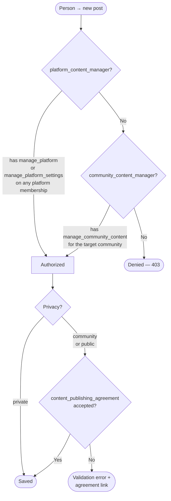
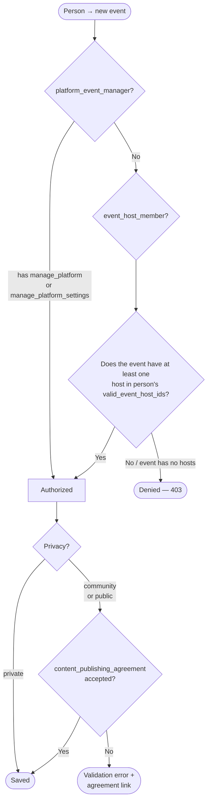
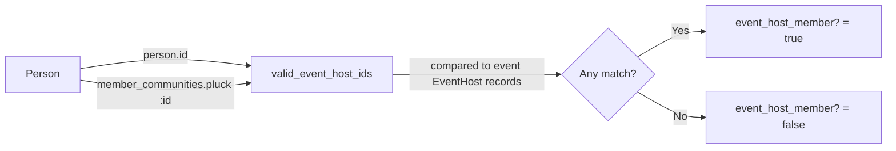
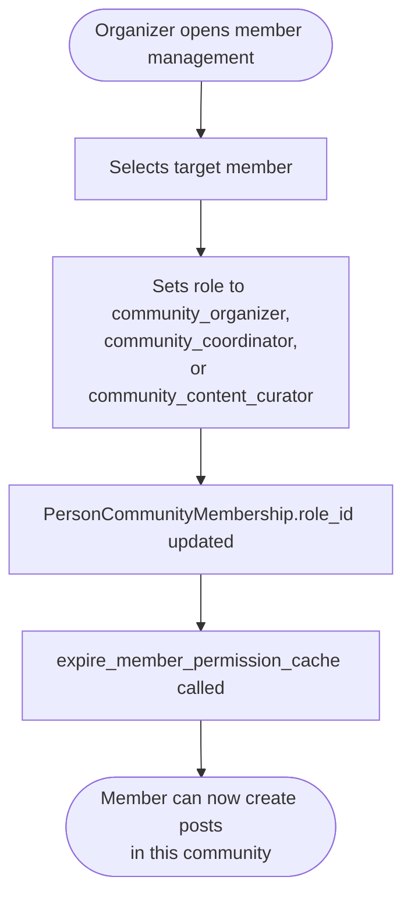
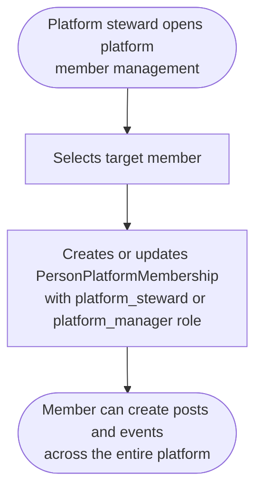
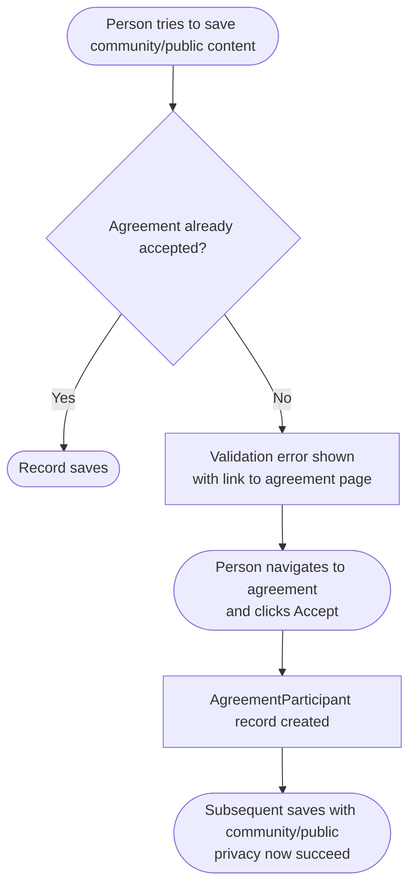

# Content and Event Creation Authorization

This document explains exactly who can create posts and events, under what conditions those permissions are granted, and how the publishing agreement interacts with content visibility.

See also:
- [RBAC Overview](../architecture/rbac_overview.md) — core RBAC mechanics
- [Public Publishing Agreement Gate](./public_publishing_agreement_gate_system.md) — agreement enforcement detail
- [Events System](./events_system.md) — event model and schema
- [Content Management](./content_management.md) — post/page system

---

## Post Creation Authorization

`PostPolicy#create?` determines whether a person may open the new post form and save a post.

```ruby
# app/policies/better_together/post_policy.rb
def create?
  platform_content_manager? || community_content_manager?
end
```

### Decision flow



### Authorization paths

| Path | Permission identifier | Scope |
|------|-----------------------|-------|
| Platform Content Manager | `manage_platform_settings` **or** `manage_platform` | Global — can create posts anywhere on the platform |
| Community Content Manager | `manage_community_content` | Scoped — only for the specific community the post belongs to |

The `community_content_manager?` check resolves the target community from:
1. `record.community` if the post already has one
2. `Current.platform.community` as fallback (the host community of the request)

---

## Event Creation Authorization

`EventPolicy#create?` determines whether a person may open the new event form and save an event.

```ruby
# app/policies/better_together/event_policy.rb
def create?
  platform_event_manager? || event_host_member?
end
```

### Decision flow



### valid_event_host_ids

The method on `Person` returns the set of entity IDs the person may represent as an event host:



**A person can host events as themselves or on behalf of any community they are an active member of, regardless of their role within that community.**

When a user navigates to `/events/new?host_id=<community_id>&host_type=BetterTogether::Community`, `build_event_hosts` pre-populates the event's host with that community. If the person is an active member of that community, `event_host_member?` returns true and creation is authorized.

### "Create Event" button on community show page

The community show view's events tab gates the button via `CommunityPolicy#create_events?`:

```ruby
# app/policies/better_together/community_policy.rb
def create_events?
  update? && BetterTogether::EventPolicy.new(user, Event.new).create?
end
```

This requires **both** conditions:
1. `update?` — the person has `update_community` permission for this community
2. `EventPolicy#create?` — the person passes the event creation check above

Plain `community_member` role holders can create events via direct URL but will not see the button in the community tab because they typically lack `update_community`. See the [role table](#community-roles) below for which roles include `update_community`.

---

## Privacy Levels and Publishing Agreement

Both posts and events use the same three privacy levels and the same agreement gate.

| Privacy | Visible to | Publishing agreement required |
|---------|-----------|-------------------------------|
| `private` | Creator + platform stewards only | No |
| `community` | Active members of the associated community | **Yes** |
| `public` | Anyone, including unauthenticated visitors | **Yes** |

The gate is enforced at the **model validation layer** via `Publishable` and `Privacy` concerns — not at the controller level. A private post or event can be saved and edited freely. The gate fires when `privacy` is changed to `community` or `public` (or when `published_at` is set on a community/public record).

On failure:
- The record is not saved.
- A validation error is added: *"The content publishing agreement must be accepted before this can be published."*
- The form's error partial renders a link to the agreement page with `data-agreement-mode="direct_accept"` so the user can read and accept without leaving the context.

**Related:** The gate also fires on `network_visibility: 'public'` (federation/seed exposure field).

---

## Community Roles

### Which roles grant `manage_community_content` (post creation)?

| Role | `manage_community_content` | `update_community` | Notes |
|------|:------------------------:|:----------------:|-------|
| `community_organizer` | ✓ | ✓ | Full day-to-day management |
| `community_coordinator` | ✓ | ✓ | Community engagement focus |
| `community_content_curator` | ✓ | ✗ | Content management only |
| `community_facilitator` | ✗ | ✗ | Moderation focus |
| `community_contributor` | ✗ | ✗ | Basic participation |
| `community_member` | ✗ | ✗ | Read-only access |
| `community_strategist` | ✗ | ✗ | Role management only |
| `community_legal_advisor` | ✗ | ✗ | Settings review only |
| `community_governance_council` | ✗ | ✗ | Member and role management |

### Which roles grant the "Create Event" button in community tab?

The `create_events?` button requires `update_community` **and** event host membership. Roles with `update_community`:

| Role | Can see "Create Event" button |
|------|:-----------------------------:|
| `community_organizer` | ✓ |
| `community_coordinator` | ✓ |
| All other community roles | ✗ (can still create events via direct URL if active member) |

---

## Platform Roles

All of the following platform roles include both `manage_platform` and `manage_platform_settings`, granting platform-wide post and event creation:

| Role | Can create posts | Can create events |
|------|:----------------:|:-----------------:|
| `platform_steward` | ✓ | ✓ |
| `platform_manager` | ✓ | ✓ |
| `platform_infrastructure_architect` | ✓ | ✓ |
| `platform_tech_support` | ✓ | ✓ |
| `platform_developer` | ✓ | ✓ |
| `platform_quality_assurance_lead` | ✓ | ✓ |
| `platform_accessibility_officer` | ✓ | ✓ |
| `network_admin` | ✗ | ✗ |
| `platform_analytics_viewer` | ✗ | ✗ |
| `analytics_viewer` | ✗ | ✗ |

---

## How Permissions Are Assigned

### Granting community post-creation ability



### Granting platform-wide content creation



### Publishing agreement assignment

The content publishing agreement (`content_publishing_agreement`) is not granted via a role. It must be **individually accepted** by each person:



A proactive notice (`_publishing_agreement_notice` partial) is also rendered on the events index, posts index, and community events/posts tabs when the current person has create permission but has not yet accepted the agreement.

### Permission caching

Permissions are cached per person for **12 hours** (Rails.cache). On membership role changes:
- `expire_member_permission_cache` is called automatically
- The person may need to sign out and back in if the old cached role is still in their request cycle

---

## Summary Matrix

| Person's access | Create private post | Create community/public post | Create private event | Create community/public event |
|-----------------|:-------------------:|:----------------------------:|:--------------------:|:-----------------------------:|
| Platform steward / manager | ✓ | ✓ + agreement | ✓ | ✓ + agreement |
| Community organizer / coordinator | ✓ | ✓ + agreement | ✓ as community host | ✓ + agreement |
| Community content curator | ✓ | ✓ + agreement | ✓ as community host | ✓ + agreement |
| Active community member (other roles) | ✗ | ✗ | ✓ as community host (direct URL) | ✓ + agreement (direct URL) |
| No community/platform membership | ✗ | ✗ | ✗ | ✗ |
