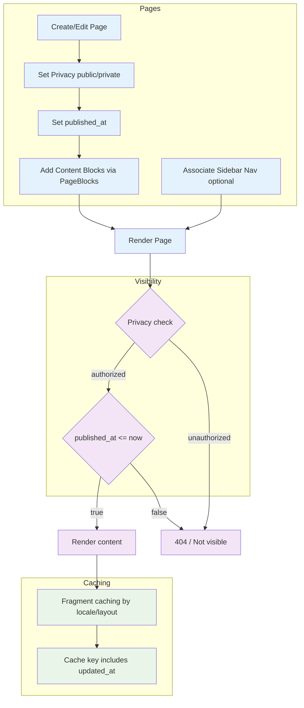
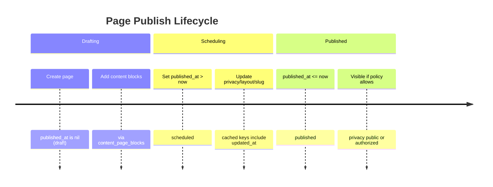

# Content Management System

This guide explains Pages, Content Blocks, visibility (privacy + published_at), and caching.

## Database Schema

The Content Management domain centers around Pages and a flexible block system. Tables use Better Together migration helpers and follow UUID primary keys with optimistic locking.

- better_together_pages
  - id (uuid), identifier, privacy, slug, published_at, layout, sidebar_nav_id
  - creator_id, community_id, protected, type (when extended)
  - Translated: title (string), content (ActionText)
  - Index highlights: `by_better_together_pages_privacy` (privacy), slug unique
- better_together_content_blocks
  - id (uuid), type (STI: Hero, RichText, Image, Html, Css, Template), identifier
  - creator_id, privacy, visible (bool)
  - JSONB settings: accessibility_attributes, content_settings, css_settings, data_attributes, html_attributes, layout_settings, media_settings, content_data, content_area_settings
- better_together_content_page_blocks
  - id (uuid), page_id, block_id, position (ordering)
- better_together_content_platform_blocks
  - id (uuid), platform_id, block_id (for global/host content)

### ER Diagram

```mermaid
erDiagram
  BETTER_TOGETHER_PAGES ||--o{ BETTER_TOGETHER_CONTENT_PAGE_BLOCKS : has
  BETTER_TOGETHER_CONTENT_BLOCKS ||--o{ BETTER_TOGE
  THER_CONTENT_PAGE_BLOCKS : appears_in
  BETTER_TOGETHER_PLATFORMS ||--o{ BETTER_TOGE
  THER_CONTENT_PLATFORM_BLOCKS : has

  BETTER_TOGETHER_PAGES {
    uuid id PK
    string identifier
    string privacy
    string slug
    datetime published_at
    string layout
    uuid sidebar_nav_id FK
    uuid creator_id FK
    uuid community_id FK
    boolean protected
    integer lock_version
    datetime created_at
    datetime updated_at
  }

  BETTER_TOGETHER_CONTENT_BLOCKS {
    uuid id PK
    string type
    string identifier
    uuid creator_id FK
    string privacy
    boolean visible
    jsonb content_data
    jsonb css_settings
    jsonb media_settings
    jsonb layout_settings
    jsonb accessibility_attributes
    jsonb data_attributes
    jsonb html_attributes
    jsonb content_settings
    jsonb content_area_settings
    integer lock_version
    datetime created_at
    datetime updated_at
  }

  BETTER_TOGETHER_CONTENT_PAGE_BLOCKS {
    uuid id PK
    uuid page_id FK
    uuid block_id FK
    integer position
    integer lock_version
    datetime created_at
    datetime updated_at
  }

  BETTER_TOGETHER_CONTENT_PLATFORM_BLOCKS {
    uuid id PK
    uuid platform_id FK
    uuid block_id FK
    integer lock_version
    datetime created_at
    datetime updated_at
  }
```

**Diagram Files:**
- 📊 [Mermaid Source](../../diagrams/source/content_schema_erd.mmd)
- 🖼️ [PNG Export](../../diagrams/exports/png/content_schema_erd.png)
- 🎯 [SVG Export](../../diagrams/exports/svg/content_schema_erd.svg)

## Process Flow Diagram



**Diagram Files:**
- 📊 [Mermaid Source](../../diagrams/source/content_flow.mmd) - Editable source
- 🖼️ [PNG Export](../../diagrams/exports/png/content_flow.png) - High-resolution image
- 🎯 [SVG Export](../../diagrams/exports/svg/content_flow.svg) - Vector graphics

## Publish Timeline

This timeline shows when publish-state transitions schedule render visibility.



**Diagram Files:**
- 📊 [Mermaid Source](../../diagrams/source/content_publish_timeline.mmd)
- 🖼️ [PNG Export](../../diagrams/exports/png/content_publish_timeline.png)
- 🎯 [SVG Export](../../diagrams/exports/svg/content_publish_timeline.svg)

## Pages
- Purpose: authored content with rich text and media blocks.
- Key traits: Authorable, Categorizable, Identifier, Privacy, Publishable, Searchable, TrackedActivity, Metrics::Viewable.
- Translations: `title` (string) and `content` (ActionText).
- Layouts: `layouts/better_together/page`, `page_with_nav`, `full_width_page`.
- Blocks: has_many `page_blocks` (ordered join) → `blocks` of multiple types: Hero, RichText, Image, Html, Css, Template.
- Sidebar nav: `belongs_to :sidebar_nav, class_name: BetterTogether::NavigationArea, optional: true`.
- Slug: derived from title; slashes allowed (parameterize disabled).

## Visibility Criteria
- Privacy: `privacy` enum (public/private). Policy scopes enforce access (e.g., private requires permission/auth).
- Publishing:
  - `published_at` controls status via Publishable concern:
    - draft: published_at nil
    - scheduled: published_at > now
    - published: published_at <= now
  - `published?` returns true only when `published_at` present and in the past.
- Controller show flow: policy scopes resource; `render_not_found` for missing/unviewable; sets layout and loads blocks.

## Blocks
- Types under `BetterTogether::Content`:
  - Hero: optional page hero with background image.
  - RichText: ActionText content (localized) with `indexed_localized_content` for search.
  - Image / Html / Css / Template: ancillary content types for sections and decoration.
- Ordering: `page_blocks.positioned` controls rendering order.

## Caching
- Fragment caching around blocks in views: `cache block.cache_key_with_version` for Hero/RichText/Html/Image.
- Page content helper: `Rails.cache.fetch(['page_content', page.cache_key_with_version], expires_in: 1.minute) { ... }` for block rendering composition.
- CSS block cached with `host_platform.cache_key_with_version` in layouts.

## Search Indexing
- Pages index title/slug (localized) and rich text block contents via `as_indexed_json` (Elasticsearch).

## Presentation Helpers

### Privacy Display
The system provides standardized helpers for displaying privacy information consistently across all content types:

- **`privacy_display_value(entity)`**: Returns the translated privacy display value for any entity with a privacy attribute
  - Automatically looks up translations from `attributes.privacy_list.*` 
  - Falls back to humanized values if translation is missing
  - Supports all privacy levels: `public`, `private`, `community`, `unlisted`
  - Usage: `<%= privacy_display_value(@page) %>` instead of `@page.privacy.humanize`

- **`privacy_badge(entity)`**: Renders a Bootstrap badge with appropriate styling for privacy levels
  - Uses `privacy_display_value` internally for consistent text
  - Maps privacy levels to appropriate Bootstrap styles (success/secondary/info)
  - Usage: `<%= privacy_badge(@page) %>` in lists and detail views

### Translation Structure
Privacy translations are stored in `attributes.privacy_list.*` for all supported locales:
```yaml
# config/locales/en.yml
attributes:
  privacy_list:
    public: Public
    private: Private
    community: Community
    unlisted: Unlisted
```

## Block Types & Examples

### Hero
- Purpose: prominent header section with optional overlay and CTA.
- Translated: `heading`, `cta_text`, and `content` (ActionText).
- CTA: `content_data.cta_url` and `css_settings.cta_button_style` (Bootstrap style). Allowed styles include `btn-primary`, `btn-outline-primary`, `btn-secondary`, etc.
- Overlay: `css_settings.overlay_color` (e.g., `#000`), `css_settings.overlay_opacity` (0.0–1.0).
- Styling: `css_settings.css_classes`, `css_settings.container_class`, `css_settings.heading_color`, `css_settings.paragraph_color`.
- Example (attributes):
  - heading: "Welcome"
  - cta_text: "Get Started"
  - content: intro paragraph
  - content_data.cta_url: "/get-started"
  - css_settings.cta_button_style: "btn-primary"
  - css_settings.overlay_color: "#000", css_settings.overlay_opacity: 0.25

### RichText
- Purpose: WYSIWYG sections using ActionText.
- Translated: `content`.
- Styling: `css_settings.css_classes` (e.g., `my-5`).
- Indexed into search via `indexed_localized_content`.

### Image
- Purpose: single image with optional caption/alt/attribution.
- Attributes: `media` (ActiveStorage), translated `alt_text`, `caption`, `attribution`; `media_settings.attribution_url`.
- Validations: Content type (jpeg/png/gif/webp/svg) and size <100MB.

### Html
- Purpose: raw HTML string.
- Attributes: `content_data.html_content`.
- Use sparingly; prefer RichText for editor support.

### Css
- Purpose: inject CSS for specific sections.
- Attributes: translated `content` (string), `css_settings.general_styling_enabled`.
- Use for small, page‑scoped style overrides. Prefer platform CSS block for global theme.

### Template
- Purpose: render a prebuilt partial by path.
- Attributes: `content_data.template_path` from allowed list (e.g., `better_together/content/blocks/template/default`, `.../host_community_contact_details`).
- Use for reusable componentized content blocks.
