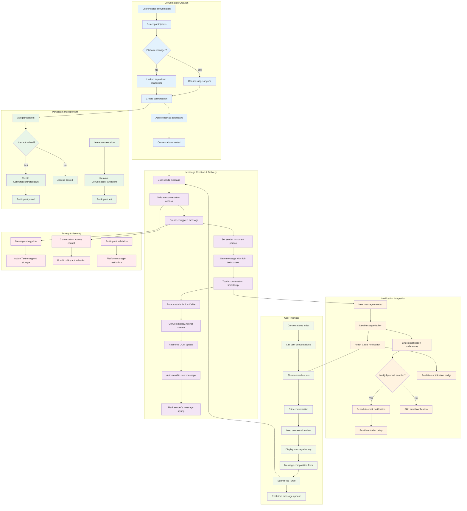

# Conversations & Messaging System

This document explains the real-time messaging system, conversation management, notification delivery, and user interaction patterns within the Better Together Community Engine.

## Process Flow Diagram



**Diagram Files:**
- 📊 [Mermaid Source](../../diagrams/source/conversations_messaging_flow.mmd) - Editable source
- 🖼️ [PNG Export](../../diagrams/exports/png/conversations_messaging_flow.png) - High-resolution image
- 🎯 [SVG Export](../../diagrams/exports/svg/conversations_messaging_flow.svg) - Vector graphics

## What's Implemented

- **Conversations**: Multi-participant encrypted conversation threads with titles and metadata
- **Messages**: Rich-text encrypted messages with Action Text support and real-time delivery
- **Participants**: Flexible participant management with join/leave capabilities  
- **Real-time Messaging**: WebSocket-based instant message delivery via Action Cable
- **Notification System**: Comprehensive in-app and email notifications with deduplication
- **Authorization**: Policy-based access control with platform manager restrictions
- **Read Status Tracking**: Automatic notification marking when viewing conversations
- **Email Integration**: Delayed email notifications with user preferences and anti-spam
- **Internationalization**: Full i18n support across all messaging components

## What's Not Implemented Yet

- **Message Reactions**: Emoji reactions and message status indicators
- **File Attachments**: Direct file sharing within conversations (uses Action Text attachments)
- **Message Search**: Full-text search across conversation history
- **Conversation Archiving**: Archive/restore functionality for conversations
- **Message Threading**: Reply-to-message threading within conversations
- **Typing Indicators**: Real-time typing status display
- **Message Editing**: Edit/delete message capabilities after sending
- **Push Notifications**: Mobile push notifications for offline users
- **Conversation Templates**: Pre-defined message templates or auto-replies
- **Advanced Moderation**: Message filtering, reporting, and moderation tools

## Core Models & Associations

### Conversation Model
- **Purpose**: Groups messages and manages participants for multi-person discussions
- **Location**: `app/models/better_together/conversation.rb`
- **Key Features**:
  - Encrypted title storage with deterministic encryption
  - Creator tracking (belongs to Person)
  - Participant validation (at least one participant required)
  - Touch associations for last activity tracking

```ruby
class Conversation < ApplicationRecord
  encrypts :title, deterministic: true
  belongs_to :creator, class_name: 'BetterTogether::Person'
  has_many :messages, dependent: :destroy
  has_many :conversation_participants, dependent: :destroy
  has_many :participants, through: :conversation_participants, source: :person
end
```

### ConversationParticipant Model  
- **Purpose**: Join model connecting people to conversations
- **Location**: `app/models/better_together/conversation_participant.rb`
- **Key Features**:
  - Simple join table between conversations and people
  - Enables flexible participant management
  - Supports leave/join functionality

```ruby
class ConversationParticipant < ApplicationRecord
  belongs_to :conversation
  belongs_to :person
end
```

### Message Model
- **Purpose**: Individual messages within conversations with rich text support
- **Location**: `app/models/better_together/message.rb`
- **Key Features**:
  - Encrypted rich text content via Action Text
  - Real-time broadcasting after creation
  - Touch parent conversation for activity updates
  - Sender association to Person model

```ruby
class Message < ApplicationRecord
  belongs_to :conversation, touch: true
  belongs_to :sender, class_name: 'BetterTogether::Person'
  has_rich_text :content, encrypted: true
  validates :content, presence: true
  after_create_commit -> { broadcast_append_later_to conversation, target: 'conversation_messages' }
end
```

## Controllers & Authorization

### ConversationsController
- **Location**: `app/controllers/better_together/conversations_controller.rb`
- **Key Features**:
  - Full CRUD operations with Turbo Stream support
  - Participant management and conversation updates
  - Authorization via Pundit policies
  - Notification read marking integration
  - Real-time updates via Turbo Streams

#### Key Actions:
- `index`: List user's conversations with participants and last messages
- `show`: Display conversation with all messages and mark notifications as read
- `create`: Create new conversation and add creator as participant
- `update`: Update conversation details and participant list
- `leave_conversation`: Remove current user from conversation participants

### MessagesController
- **Location**: `app/controllers/better_together/messages_controller.rb`
- **Key Features**:
  - Message creation with sender assignment
  - Participant notification triggering
  - Real-time broadcasting via Action Cable
  - Turbo Stream response support

#### Message Creation Flow:
1. Validate conversation access
2. Create message with current person as sender
3. Trigger notifications to all participants except sender
4. Broadcast to conversation channel
5. Return Turbo Stream response for real-time UI update

## Real-time Communication

### Action Cable Channels

#### ConversationsChannel
- **Location**: `app/channels/better_together/conversations_channel.rb`
- **Purpose**: Real-time message delivery within conversations
- **Features**:
  - Stream messages to conversation participants
  - Automatic subscription management
  - Message broadcasting integration

#### NotificationsChannel  
- **Location**: `app/channels/better_together/notifications_channel.rb`
- **Purpose**: Real-time notification delivery system-wide
- **Features**:
  - Stream to individual persons
  - Unread count updates
  - Cross-system notification delivery

### JavaScript Integration
- **Conversation Messages Controller**: `app/javascript/controllers/better_together/conversation_messages_controller.js`
  - Auto-scroll to newest messages
  - Mark sender's own messages with styling
  - DOM mutation observation for real-time updates

## Notification System

### NewMessageNotifier
- **Location**: `app/notifiers/better_together/new_message_notifier.rb`
- **Purpose**: Notify conversation participants about new messages
- **Delivery Channels**:
  - **Action Cable**: Immediate real-time notification
  - **Email**: Delayed 15 minutes with deduplication logic

#### Key Features:
- **Email Deduplication**: One email per unread conversation per recipient
- **User Preferences**: Respects `notify_by_email` settings
- **Localized Content**: Message titles and bodies in recipient's preferred language
- **Unread Counting**: Includes current unread notification count in real-time delivery

#### Notification Logic:
```ruby
def should_send_email?
  unread_notifications = recipient.notifications.where(
    event_id: BetterTogether::NewMessageNotifier.where(params: { conversation_id: conversation.id }).select(:id),
    read_at: nil
  ).order(created_at: :desc)
  
  unread_notifications.any? && message.id == unread_notifications.last.event.record_id
end
```

### Email Integration
- **ConversationMailer**: `app/mailers/better_together/conversation_mailer.rb`
- **Template**: `app/views/better_together/conversation_mailer/new_message_notification.html.erb`
- **Features**:
  - Respects user privacy preferences for sender details
  - Includes direct links to conversations with message anchors
  - Platform branding and localized signatures
  - Conditional sender information based on `show_conversation_details` preference

## Authorization & Privacy

### Access Control
- **Platform Managers**: Can message anyone
- **Regular Users**: Can only message platform managers (configurable restriction)
- **Privacy Levels**: Conversation visibility based on participant membership
- **Policy Integration**: Full Pundit policy enforcement across all actions

### ConversationPolicy
Key authorization checks:
- `show?`: Participant membership or platform manager role
- `update?`: Creator or authorized participant
- `leave_conversation?`: Current participant with multiple participants remaining
- `create?`: Based on platform permissions and participant availability

## User Interface Components

### Conversation Layout
- **Sidebar Navigation**: Active conversation list with participant previews
- **Main Content Area**: Message thread with rich text rendering
- **Message Composer**: Trix editor with real-time submission
- **Participant Management**: Add/remove participants interface
- **Conversation Options**: Edit title, leave conversation, settings

### Message Display
- **Message Bubbles**: Styled differently for sender vs. recipients
- **Timestamp Display**: Localized time formatting
- **Sender Attribution**: Name and avatar display
- **Rich Content**: Full Action Text rendering with attachments
- **Real-time Updates**: Smooth DOM insertion without page refresh

### Responsive Design
- **Mobile Optimized**: Touch-friendly interface elements
- **Bootstrap Integration**: Consistent styling with platform theme
- **Accessibility**: ARIA labels, keyboard navigation, screen reader support

## Technical Implementation

### Encryption & Security
- **Message Encryption**: All message content encrypted at rest via Action Text
- **Title Encryption**: Conversation titles use deterministic encryption for searchability
- **CSRF Protection**: Full Rails CSRF token validation
- **Input Sanitization**: HTML content filtering via Action Text allow-lists

### Performance Optimization
- **Eager Loading**: Conversation queries include participants and messages with proper includes
- **Touch Associations**: Automatic timestamp updates for conversation activity
- **Query Optimization**: Efficient participant filtering and message ordering
- **Real-time Efficiency**: Targeted DOM updates via Turbo Streams

### Internationalization
- **Full i18n Coverage**: All user-facing strings translated across English, Spanish, French
- **Email Localization**: Notification emails rendered in recipient's preferred language
- **Time Zone Support**: Message timestamps displayed in user's local timezone
- **Locale-specific Formatting**: Date/time formatting respects cultural preferences

## Integration Points

### Person Model Integration
```ruby
# Person associations for messaging
has_many :conversation_participants, dependent: :destroy
has_many :conversations, through: :conversation_participants  
has_many :created_conversations, as: :creator, class_name: 'BetterTogether::Conversation'
has_many :messages, foreign_key: :sender_id, class_name: 'BetterTogether::Message'
```

### Notification Integration
- **NotificationReadable Concern**: Automatic read marking when viewing conversations
- **Unread Count Updates**: Real-time badge updates via Action Cable
- **Cross-system Integration**: Notifications work across all platform features

### Action Cable Integration
- **Turbo Stream Broadcasting**: Seamless real-time message delivery
- **Connection Management**: Automatic subscription handling
- **Error Recovery**: Graceful degradation when WebSocket unavailable

## Anti-Spam & Moderation

### Email Deduplication
- **One Email Per Conversation**: Prevents email flooding from active conversations
- **15-minute Delay**: Batches rapid messages into single email notifications
- **User Preference Respect**: Honors individual email notification settings
- **Read Status Integration**: Stops emails when notifications marked as read

### Content Filtering
- **Action Text Integration**: HTML content automatically sanitized
- **XSS Prevention**: Full Rails auto-escaping throughout templates
- **Input Validation**: Server-side validation on all message content
- **Policy Enforcement**: Authorization checks prevent unauthorized access

## Testing Strategy

### Model Testing
- **Factory Integration**: Comprehensive FactoryBot factories for all models
- **Association Testing**: Validates all model relationships and dependencies
- **Validation Testing**: Covers all business rules and constraints
- **Encryption Testing**: Verifies proper encryption/decryption behavior

### Controller Testing  
- **Authorization Testing**: Pundit policy enforcement verification
- **Response Format Testing**: HTML and Turbo Stream response validation
- **Real-time Feature Testing**: Action Cable integration testing
- **Error Handling Testing**: Graceful failure mode validation

### Integration Testing
- **Feature Specs**: Full user workflow testing with Capybara
- **Real-time Testing**: JavaScript-enabled conversation flow testing
- **Notification Testing**: End-to-end notification delivery verification
- **Cross-browser Testing**: Compatibility across different browsers and devices

## Configuration & Deployment

### Environment Variables
- **Action Cable**: WebSocket server configuration
- **Email Settings**: SMTP configuration for notification delivery
- **Encryption Keys**: Rails master key for encrypted content
- **Platform Settings**: Default messaging permissions and restrictions

### Database Considerations
- **Encryption Performance**: Deterministic encryption enables efficient querying
- **Index Strategy**: Optimized indexes for conversation and message queries
- **Migration Strategy**: Handles encrypted field additions and modifications
- **Backup Considerations**: Encrypted data backup and restoration procedures

## Development Guidelines

### Adding New Message Features
1. **Model Changes**: Add fields to Message model with proper encryption
2. **Controller Updates**: Update permitted parameters and authorization
3. **View Updates**: Add UI elements with proper internationalization
4. **Real-time Support**: Ensure Turbo Stream compatibility
5. **Notification Integration**: Add notification triggers if needed
6. **Testing**: Comprehensive test coverage for new functionality

### Extending Conversation Features
1. **Policy Updates**: Add new authorization rules to ConversationPolicy
2. **Association Changes**: Update model associations as needed
3. **UI Integration**: Add new interface elements to conversation layout
4. **Notification Updates**: Extend notification system for new features
5. **Documentation**: Update this document with new functionality

### Performance Considerations
- **Message History**: Consider pagination for conversations with many messages
- **Participant Limits**: Monitor performance with large participant counts
- **Real-time Scaling**: Plan for increased Action Cable connection loads
- **Search Integration**: Future full-text search implementation strategy

## Future Roadmap

### Short-term Enhancements
- **Message Reactions**: Emoji reactions with real-time updates
- **Typing Indicators**: Show when participants are composing messages
- **Message Search**: Full-text search across conversation history
- **File Attachments**: Direct file sharing within conversations

### Long-term Vision
- **Advanced Moderation**: AI-powered content filtering and moderation tools
- **Video/Audio**: Integration with WebRTC for video calling capabilities
- **Integration APIs**: Webhooks and APIs for third-party integrations
