# DocumentationBuilder System Documentation

## Overview

The DocumentationBuilder system automates the creation and maintenance of a navigable documentation website from markdown files stored in the `docs/` directory. It recursively scans the filesystem, generates hierarchical navigation structures, and creates pages with markdown content blocks—eliminating manual page creation and ensuring documentation organization matches the developer's file structure.

**Primary Purpose:** Automate documentation site generation from markdown files  
**Target Users:** Platform organizers (publishing docs), Developers (maintaining technical documentation), End users (accessing documentation)  
**Implementation Status:** ✅ Production-ready (Implemented November 2025, PR #1149)

## System Architecture

### Core Components

#### 1. Builder Infrastructure
- **`BetterTogether::DocumentationBuilder`**: Singleton builder class that orchestrates the entire documentation generation process
- **Directory Scanner**: Recursive filesystem traversal to discover markdown files
- **Navigation Generator**: Creates hierarchical navigation structure from filesystem
- **Page Generator**: Creates or updates Page records with Markdown content blocks

#### 2. Content Integration
- **`BetterTogether::NavigationArea`**: Container for documentation navigation (slug: 'documentation')
- **`BetterTogether::NavigationItem`**: Individual navigation entries (dropdowns for directories, links for files)
- **`BetterTogether::Page`**: Documentation pages with markdown blocks
- **`BetterTogether::Content::Markdown`**: Content blocks referencing markdown files

#### 3. Protection Layer
- **Protected Flags**: All generated content marked `protected: true` to prevent accidental deletion
- **Row Locking**: Database locks during page updates prevent race conditions
- **Idempotent Rebuild**: Safe to run multiple times without data corruption

## Process Flow Diagram

```mermaid
flowchart TD
    Start([DocumentationBuilder.build]) --> ScanDocs[Scan docs/ Directory]
    ScanDocs --> BuildTree[Build Entry Tree<br/>Recursively]
    
    BuildTree --> CheckDir{Is Directory?}
    CheckDir -->|Yes| FindDefault[Find Default File<br/>README.md/index.md]
    CheckDir -->|No| IsMarkdown{Is .md File?}
    
    IsMarkdown -->|Yes| CreateFileEntry[Create File Entry<br/>type: :file]
    IsMarkdown -->|No| Skip[Skip File]
    
    FindDefault --> HasDefault{Has Default?}
    HasDefault -->|Yes| CreateDirEntryWithDefault[Create Dir Entry<br/>type: :directory<br/>with default_path]
    HasDefault -->|No| CheckChildren{Has Children?}
    
    CheckChildren -->|Yes| CreateDirEntry[Create Dir Entry<br/>type: :directory]
    CheckChildren -->|No| Skip
    
    CreateFileEntry --> AddToTree[Add to Entry Tree]
    CreateDirEntryWithDefault --> RecurseChildren[Recurse into<br/>Child Directories]
    CreateDirEntry --> RecurseChildren
    RecurseChildren --> AddToTree
    
    AddToTree --> MoreEntries{More Entries?}
    MoreEntries -->|Yes| BuildTree
    MoreEntries -->|No| FindOrCreateArea[Find or Create<br/>NavigationArea<br/>slug: 'documentation']
    
    FindOrCreateArea --> ClearExisting[Delete Existing<br/>Navigation Items]
    ClearExisting --> CreateNav[Create Navigation<br/>Structure]
    
    CreateNav --> ProcessEntry{Process Entry}
    ProcessEntry -->|Directory| CreateDropdown[Create Dropdown<br/>NavigationItem]
    ProcessEntry -->|File| CreateLink[Create Link<br/>NavigationItem]
    
    CreateDropdown --> HasDefaultPath{Has Default Path?}
    HasDefaultPath -->|Yes| CreatePageForDir[Create/Update Page<br/>for Directory]
    HasDefaultPath -->|No| SetPlaceholder[Set URL to '#']
    
    CreateLink --> CreatePageForFile[Create/Update Page<br/>for File]
    
    CreatePageForDir --> SetLinkable[Set linkable<br/>to Page]
    CreatePageForFile --> SetLinkable
    SetPlaceholder --> RecurseNav[Process Child<br/>Nav Items]
    
    SetLinkable --> RecurseNav
    RecurseNav --> MoreNav{More Nav Items?}
    MoreNav -->|Yes| CreateNav
    MoreNav -->|No| SaveArea[Save NavigationArea]
    
    SaveArea --> End([Build Complete])
    
    subgraph "Page Creation/Update"
        CreatePageForFile --> CheckExists{Page Exists?}
        CheckExists -->|Yes| LockPage[Lock Page Row]
        CheckExists -->|No| CreatePage[Create New Page]
        
        LockPage --> DestroyBlocks[Destroy Existing<br/>PageBlocks]
        DestroyBlocks --> UpdateAttrs[Update Attributes]
        CreatePage --> SetAttrs[Set Attributes]
        
        UpdateAttrs --> SetPageAttrs[Set:<br/>- title<br/>- slug<br/>- privacy: public<br/>- protected: true<br/>- sidebar_nav]
        SetAttrs --> SetPageAttrs
        
        SetPageAttrs --> AddMarkdownBlock[Add Markdown Block<br/>via page_blocks_attributes]
        AddMarkdownBlock --> SavePage[Save Page]
        SavePage --> ForceSlug[Force Exact Slug<br/>Bypass FriendlyId]
        ForceSlug --> ReturnPage[Return Page]
    end
    
    style Start fill:#e1f5e1
    style End fill:#e1f5e1
    style FindOrCreateArea fill:#fff4e6
    style CreatePageForFile fill:#e3f2fd
    style CreatePageForDir fill:#e3f2fd
    style LockPage fill:#ffebee
    style DestroyBlocks fill:#ffebee
```



**Diagram Files:**
- 📊 [Mermaid Source](../../diagrams/source/documentation_builder_flow.mmd) - Editable source
- 🖼️ [PNG Export](../../diagrams/exports/png/documentation_builder_flow.png) - High-resolution image
- 🎯 [SVG Export](../../diagrams/exports/svg/documentation_builder_flow.png) - Vector graphics

## Key Features

### 1. Recursive Directory Scanning

Automatically discovers all markdown files in the `docs/` directory hierarchy:

```ruby
# Internal method example
def documentation_child_paths(path)
  Dir.children(path).sort.map { |child| path.join(child) }.select do |child_path|
    next false if child_path.basename.to_s.start_with?('.')
    child_path.directory? || markdown_file?(child_path)
  end
end
```

**Features:**
- Ignores hidden files (starting with `.`)
- Alphabetical sorting for consistent ordering
- Supports arbitrary nesting depth
- Handles both `.md` and `.markdown` extensions

### 2. Hierarchical Navigation Generation

Creates multi-level navigation matching directory structure:

- **Directories** → Dropdown navigation items
- **Markdown files** → Link navigation items
- **README.md/index.md** → Directory overview pages

### 3. Automatic Page Creation

Generates `BetterTogether::Page` records with embedded markdown blocks:

```ruby
def documentation_page_attributes(title, slug, relative_path, sidebar_nav_area = nil)
  {
    title_en: title,
    slug_en: slug,
    published_at: Time.zone.now,
    privacy: 'public',
    protected: true,
    layout: 'layouts/better_together/full_width_page',
    page_blocks_attributes: [
      {
        block_attributes: {
          type: 'BetterTogether::Content::Markdown',
          markdown_file_path: documentation_file_path(relative_path)
        }
      }
    ],
    sidebar_nav: sidebar_nav_area
  }
end
```

### 4. Protection Against Deletion

All generated content marked as protected:

- Navigation area: `protected: true, visible: true`
- Navigation items: `protected: true`
- Pages: `protected: true`

### 5. Idempotent Rebuild

Safe to run multiple times:

```ruby
# Existing area handling
area = if (existing_area = ::BetterTogether::NavigationArea.i18n.find_by(slug: 'documentation'))
         existing_area.navigation_items.delete_all  # Clear old structure
         existing_area.update!(name: 'Documentation', visible: true, protected: true)
         existing_area
       else
         ::BetterTogether::NavigationArea.create! do |area|
           # Create new area
         end
       end
```

### 6. Slug Management

Consistent URL generation from file paths:

```ruby
def documentation_slug(path)
  relative = path.is_a?(Pathname) ? documentation_relative_path(path) : path.to_s
  base_slug = relative.sub(/\.md\z/i, '').downcase.tr('_', '-')
  base_slug = 'overview' if base_slug.blank?
  "docs/#{base_slug}"
end
```

**Examples:**
- `README.md` → `docs/overview`
- `developers/api.md` → `docs/developers/api`
- `developers/systems/caching.md` → `docs/developers/systems/caching`

## Technical Implementation

### Database Schema

#### No New Tables Required

The DocumentationBuilder uses existing Better Together tables:

**better_together_navigation_areas**
```sql
id: UUID primary key
name: String (translatable via Mobility)
slug: String (unique, FriendlyId)
visible: Boolean (default: false)
protected: Boolean (default: false)
navigable_type: String (polymorphic)
navigable_id: UUID (polymorphic)
```

**better_together_navigation_items**
```sql
id: UUID primary key
navigation_area_id: UUID (foreign key)
parent_id: UUID (self-referential for hierarchy)
title: String (translatable via Mobility)
slug: String (FriendlyId)
item_type: String ('link', 'dropdown', 'separator')
url: String (for external links)
route_name: String (for named routes)
linkable_type: String (polymorphic - typically 'BetterTogether::Page')
linkable_id: UUID (polymorphic)
position: Integer (ordering)
visible: Boolean
protected: Boolean
```

**better_together_pages**
```sql
id: UUID primary key
title: String (translatable)
slug: String (unique per locale, FriendlyId)
published_at: Datetime
privacy: String ('public', 'private', 'community')
protected: Boolean
layout: String (e.g., 'layouts/better_together/full_width_page')
sidebar_nav_id: UUID (foreign key to navigation_areas)
```

**better_together_page_blocks** (join table)
```sql
id: UUID primary key
page_id: UUID (foreign key)
block_id: UUID (foreign key to polymorphic content blocks)
block_type: String (polymorphic - 'BetterTogether::Content::Markdown')
position: Integer
```

**better_together_content_blocks** (STI base)
```sql
id: UUID primary key
type: String (STI discriminator - 'BetterTogether::Content::Markdown')
identifier: String
content_data: JSONB (stores markdown_file_path, auto_sync_from_file)
```

### Model Relationships

#### DocumentationBuilder

**Class Methods:**
```ruby
module BetterTogether
  class DocumentationBuilder < Builder
    class << self
      # Public API
      def build
        # Main entry point for documentation generation
      end
      
      private
      
      # Directory scanning
      def documentation_entries
      def build_documentation_entries(current_path)
      def documentation_child_paths(path)
      def markdown_file?(path)
      
      # Navigation generation
      def create_documentation_navigation_item(area, entry, position, parent: nil)
      def create_documentation_item_with_context(area, attributes)
      
      # Page generation
      def documentation_page_for(title, relative_path, sidebar_nav_area = nil)
      def documentation_page_attributes(title, slug, relative_path, sidebar_nav_area = nil)
      
      # Utilities
      def documentation_title(name)
      def documentation_slug(path)
      def documentation_relative_path(path)
      def documentation_file_path(relative_path)
      def default_documentation_file(path)
      def documentation_root  # Returns BetterTogether::Engine.root.join('docs')
    end
  end
end
```

**Integration Points:**
- Inherits from `BetterTogether::Builder` (base class for all builders)
- Uses I18n.with_locale(:en) for consistent English generation
- Delegates to Markdown content blocks for file rendering

### Configuration

**Default Configuration** (no configuration files required):

```ruby
# Hardcoded in builder
documentation_root = BetterTogether::Engine.root.join('docs')
documentation_url_prefix = '/docs'
navigation_area_slug = 'documentation'
```

**Environment Variables** (optional):

```bash
# Enable debug output during navigation creation
DEBUG_DOCUMENTATION_NAV=1
```

### Background Jobs

**Not Applicable** - Builder runs synchronously during:
- Platform setup wizard
- Rake tasks (manual rebuild)
- Future: Admin UI button

**Rationale for Synchronous:**
- Fast execution (<1 second for typical docs)
- Immediate feedback during setup
- Simplifies error handling

## Usage Examples

### 1. Initial Documentation Generation

**During Platform Setup:**

```ruby
# Called automatically in setup wizard
BetterTogether::DocumentationBuilder.build
```

### 2. Manual Rebuild via Rake

**Create rake task:**

```ruby
# lib/tasks/documentation.rake
namespace :better_together do
  namespace :documentation do
    desc "Rebuild documentation navigation and pages from docs/ directory"
    task rebuild: :environment do
      puts "Rebuilding documentation..."
      BetterTogether::DocumentationBuilder.build
      puts "Documentation rebuilt successfully!"
    end
  end
end
```

**Run:**

```bash
bin/dc-run rails better_together:documentation:rebuild
```

### 3. Directory Structure Example

**Filesystem:**

```
docs/
├── README.md                      # → Overview page
├── developers/
│   ├── README.md                  # → Developers Guide
│   ├── api.md                     # → API Documentation
│   └── systems/
│       ├── caching.md             # → Caching System
│       └── authentication.md      # → Auth System
└── policies/
    ├── privacy.md                 # → Privacy Policy
    └── terms.md                   # → Terms of Service
```

**Generated Navigation:**

```
Documentation (NavigationArea)
├── Overview (link → docs/overview)
├── Developers (dropdown)
│   ├── Developers Guide (link → docs/developers/readme)
│   ├── API (link → docs/developers/api)
│   └── Systems (dropdown → docs/developers/systems/...)
│       ├── Caching (link → docs/developers/systems/caching)
│       └── Authentication (link → docs/developers/systems/authentication)
└── Policies (dropdown)
    ├── Privacy (link → docs/policies/privacy)
    └── Terms (link → docs/policies/terms)
```

### 4. Accessing Generated Documentation

**URL Patterns:**

```
/en/pages/docs/overview              # Root README.md
/en/pages/docs/developers/api        # Nested file
/en/pages/docs/developers/systems/caching  # Deeply nested
```

**View Code:**

```erb
<%# Sidebar navigation automatically included %>
<%= render 'better_together/pages/show', page: @page %>

<%# Markdown content rendered from file %>
<div class="markdown-content">
  <%= page.page_blocks.first.block.rendered_html %>
</div>
```

## API Endpoints

### Not Applicable

DocumentationBuilder is a build-time utility, not a runtime API. However, generated pages are accessible through standard Page routes:

```ruby
# config/routes.rb (BetterTogether::Engine)
scope "/:locale", locale: /#{I18n.available_locales.join('|')}/ do
  resources :pages, only: [:index, :show], param: :slug
end
```

**Routes:**
```
GET /en/pages/docs/:slug           # Show documentation page
GET /en/pages/docs/:nested/:slug   # Show nested documentation
```

## Performance Considerations

### 1. Build Time Complexity

**Algorithmic Complexity:** O(n) where n = number of markdown files
- Linear directory traversal
- Each file processed once
- No nested queries (uses eager loading where possible)

**Typical Performance:**
- ~50 markdown files: <1 second
- ~500 markdown files: <5 seconds
- Acceptable for setup wizard and manual rebuilds

### 2. Database Optimization

**Row Locking:**
```ruby
locked_page = ::BetterTogether::Page.lock.find(page.id)
```
- Prevents concurrent modification during rebuild
- Ensures atomic page updates

**Batch Operations:**
- Navigation items created in single transaction per area
- Page blocks destroyed in batch before update

### 3. Caching Strategy

**No Runtime Caching Needed:**
- Builder runs during setup/rebuild only
- Generated pages cached via standard Page caching
- Markdown content cached via Markdown block caching

### 4. Index Usage

**Leverages Existing Indexes:**
- `navigation_areas.slug` - Unique index for fast lookup
- `pages.slug` - Unique index per locale
- `navigation_items.navigation_area_id` - Foreign key index
- `navigation_items.parent_id` - Self-referential index for hierarchy

## Security Considerations

### 1. File Path Safety

**Protection Against Path Traversal:**

```ruby
def documentation_root
  BetterTogether::Engine.root.join('docs')
end

def documentation_child_paths(path)
  # Rejects hidden files (starting with '.')
  next false if child_path.basename.to_s.start_with?('.')
  # ...
end
```

**Safe Path Resolution:**
- All paths resolved relative to `BetterTogether::Engine.root`
- No user input in file paths
- Controlled by developers through filesystem

### 2. Content Security

**Trusted Content Source:**
- Markdown files controlled by developers (in git repository)
- No user-supplied markdown in builder
- MarkdownRendererService handles rendering with Redcarpet

**HTML Sanitization:**
- Rendered HTML marked as `html_safe` (trusted content)
- Redcarpet configured for documentation (allows HTML in markdown)

### 3. Authorization

**Protected Content:**
- All generated pages marked `protected: true`
- PagePolicy prevents deletion of protected pages
- NavigationAreaPolicy prevents modification of protected navigation

**Public Access:**
- Documentation pages set to `privacy: 'public'`
- No authentication required for viewing
- Appropriate for platform documentation, policies, guides

### 4. Race Condition Prevention

**Row Locking:**
```ruby
locked_page = ::BetterTogether::Page.lock.find(page.id)
locked_page.page_blocks.destroy_all
locked_page.reload
locked_page.assign_attributes(attrs)
locked_page.save!
```

Prevents concurrent rebuild attempts from corrupting data.

## Testing Strategy

### Test Coverage

**Primary Test File:** `spec/builders/better_together/documentation_builder_spec.rb` (235 lines)

**Test Approach:**
- Uses temporary directory with test markdown files
- Creates realistic directory structures
- Tests complete build process end-to-end

### Test Scenarios

**1. Basic Functionality:**
```ruby
it 'creates a documentation navigation area with nested items' do
  # Validates complete build process
  # Checks navigation structure, page creation, markdown blocks
end
```

**2. Idempotency:**
```ruby
it 'updates existing pages without creating duplicates' do
  # Run build twice
  # Verify no duplicate pages
  # Confirm updates to existing pages
end
```

**3. Protection:**
```ruby
it 'creates protected pages' do
  # Verify protected flag on all generated pages
end

it 'creates protected navigation items' do
  # Verify protected flag on all navigation items
end
```

**4. Sidebar Navigation:**
```ruby
it 'assigns the documentation navigation area as sidebar_nav for all documentation pages' do
  # Check every generated page has sidebar_nav set
end
```

**5. Slug Management:**
```ruby
it 'preserves exact slugs across rebuilds' do
  # Verify FriendlyId bypass works correctly
end
```

## Integration Points

### Upstream Dependencies

**Content System:**
- `BetterTogether::Content::Markdown` - File-based markdown rendering
- `BetterTogether::Page` - Page infrastructure
- `BetterTogether::Content::PageBlock` - Block associations

**Navigation System:**
- `BetterTogether::NavigationArea` - Navigation containers
- `BetterTogether::NavigationItem` - Navigation entries

**Internationalization:**
- Mobility gem - Translatable attributes
- FriendlyId gem - Slug generation (bypassed for exact control)

### Downstream Dependents

**Setup Wizard:**
- Calls `DocumentationBuilder.build` during initial platform setup

**Rake Tasks:**
- Manual documentation rebuild tasks

**Future Enhancements:**
- Admin UI rebuild button
- File watch mode for development

## Troubleshooting

### Common Issues

**1. Documentation not appearing:**
```bash
# Check if navigation area exists
rails console
> BetterTogether::NavigationArea.find_by(slug: 'documentation')

# Rebuild documentation
> BetterTogether::DocumentationBuilder.build
```

**2. Duplicate pages after rebuild:**
```bash
# Should not happen (idempotent design), but if it does:
# Check for FriendlyId conflicts
> BetterTogether::Page.where("slug LIKE 'docs/%'").group(:slug).count.select { |k, v| v > 1 }
```

**3. Missing markdown content:**
```bash
# Verify file paths in markdown blocks
> BetterTogether::Page.find_by(slug: 'docs/your-page')
    .page_blocks.first.block.markdown_file_path

# Should point to valid file in docs/
```

**4. Broken navigation hierarchy:**
```bash
# Rebuild navigation (idempotent)
> BetterTogether::DocumentationBuilder.build

# Check for orphaned navigation items
> BetterTogether::NavigationItem.where(navigation_area_id: nil)
```

### Debug Mode

```bash
# Enable debug output
DEBUG_DOCUMENTATION_NAV=1 bin/dc-run rails better_together:documentation:rebuild
```

## Monitoring & Metrics

### Build Metrics

**Not Currently Tracked** (builder runs infrequently):

Potential future metrics:
- Build duration
- Number of files processed
- Number of pages created/updated
- Number of navigation items created

### Runtime Metrics

**Standard Page Metrics:**
- Documentation page views (via Viewable concern)
- Search queries on documentation content
- Navigation item click tracking

## Future Enhancements

### 1. Admin UI for Rebuild

**Proposed Feature:**
- "Rebuild Documentation" button in platform admin
- Progress indicator during rebuild
- Success/error notification

**Implementation Approach:**
- Turbo Stream for real-time progress
- Background job for large documentation sets

### 2. Incremental Updates

**Proposed Feature:**
- Detect changed files since last build
- Update only affected pages and navigation
- Faster rebuild for single file changes

**Implementation Approach:**
- Track file modification times
- Compare against last build timestamp
- Partial navigation tree updates

### 3. File Watch Mode

**Proposed Feature:**
- Automatic rebuild on file changes during development
- Opt-in via environment variable

**Implementation Approach:**
- Listen gem for filesystem watching
- Development-only (not in production)
- Debounced rebuilds (avoid rapid successive builds)

### 4. Internationalization

**Proposed Feature:**
- Multi-language documentation support
- Locale-specific navigation areas
- Fallback to default language

**Integration:**
- Leverage existing Markdown localization (file-based)
- Example: `privacy.en.md`, `privacy.fr.md`, `privacy.es.md`
- Builder scans for locale-specific files

### 5. Documentation Versioning

**Proposed Feature:**
- Track documentation changes over time
- Access previous versions
- Diff between versions

**Implementation Approach:**
- PaperTrail gem for version tracking
- Separate "Documentation History" interface
- Restore previous version functionality

## Related Systems

- **[Markdown Content Management System](markdown_content_management_system.md)** - Renders markdown from files or inline
- **[Navigation System](navigation_system.md)** - Hierarchical navigation infrastructure
- **[Content Management System](content_management_system.md)** - Page and block management
- **[Setup Wizard System](setup_wizard_system.md)** - Initial platform configuration (calls builder)

## References

- **Implementation Plan:** [docs/implementation/documentation_builder_plan.md](../../implementation/documentation_builder_plan.md)
- **Acceptance Criteria:** [docs/implementation/documentation_builder_acceptance_criteria.md](../../implementation/documentation_builder_acceptance_criteria.md)
- **Source Code:** [app/builders/better_together/documentation_builder.rb](../../../app/builders/better_together/documentation_builder.rb)
- **Tests:** [spec/builders/better_together/documentation_builder_spec.rb](../../../spec/builders/better_together/documentation_builder_spec.rb)

---

**Documentation Completeness:**
- ✅ Comprehensive technical documentation (200+ lines)
- ✅ Process flow diagram with Mermaid source
- ✅ Database schema coverage
- ✅ Code examples throughout
- ✅ Performance considerations
- ✅ Security implications
- ✅ Testing strategy
- ✅ Troubleshooting guide
- ✅ Integration points
- ✅ Future enhancements

**Last Updated:** January 12, 2026  
**System Status:** Production-ready, actively used  
**Documentation Status:** Complete
