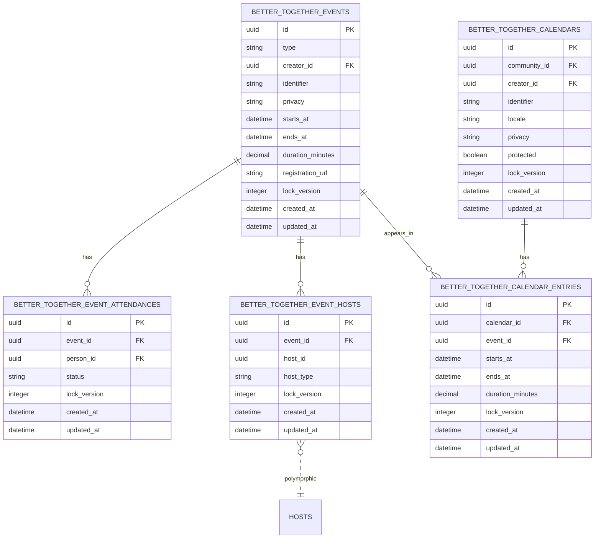
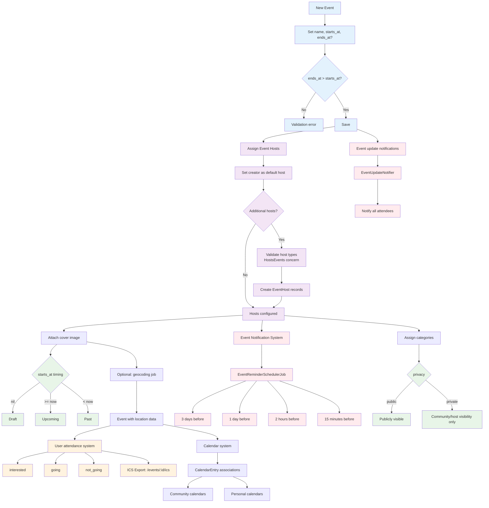
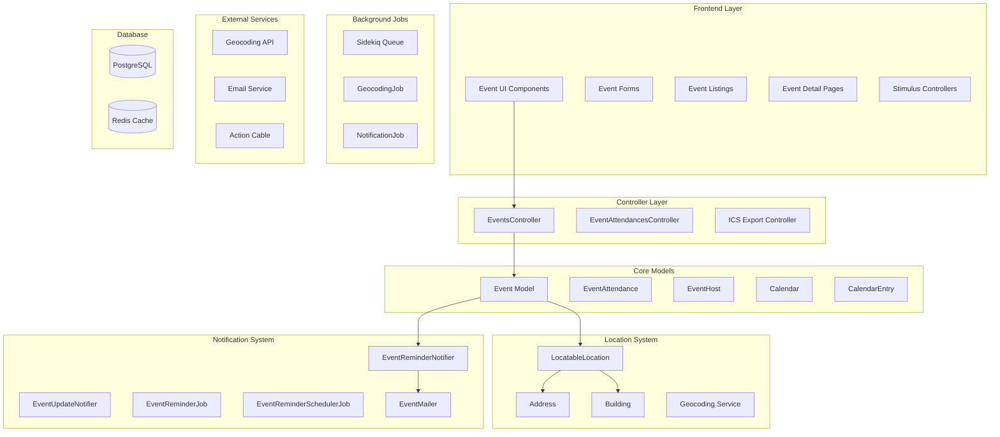
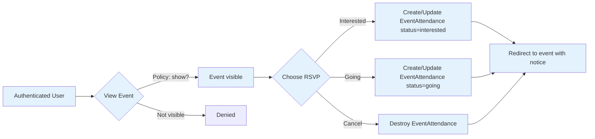
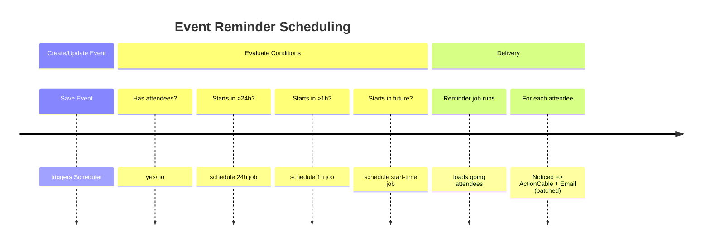
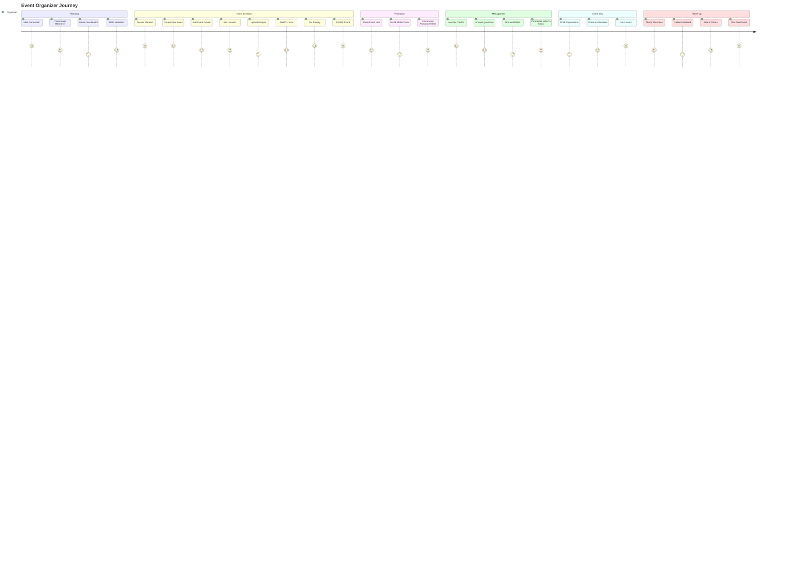
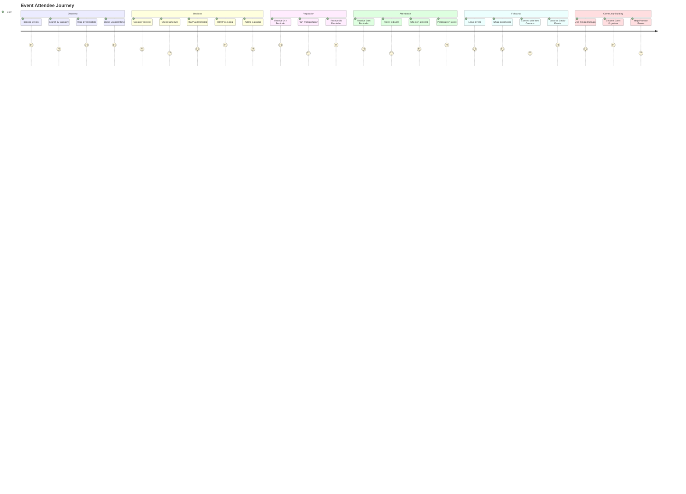

# Events & Calendars

This document explains the Event model, how events are created and displayed, how visibility works, how calendars fit in, the comprehensive notification system for event reminders and updates, and the event hosting system.

See also: [Event Invitations & Attendance](./event_invitations_and_attendance.md) for invitation tokens, delivery, and RSVP lifecycle details.

## Database Schema

The Events & Calendars domain consists of five primary tables plus standard shared tables (translations, ActionText, etc.). All Better Together tables are created via `create_bt_table`, which adds `id: :uuid`, `lock_version`, and `timestamps` automatically.

- better_together_events
  - id (uuid), type (STI default: `BetterTogether::Event`), creator_id, identifier, privacy
  - starts_at, ends_at, duration_minutes, registration_url
  - Indexes: `bt_events_by_starts_at`, `bt_events_by_ends_at`, `by_better_together_events_privacy`
- better_together_event_attendances
  - id (uuid), event_id, person_id, status (string enum: interested, going)
  - Unique index: `by_event_and_person` on [event_id, person_id]
- better_together_event_hosts
  - id (uuid), event_id, host_id, host_type (polymorphic to Person/Community/etc.)
- better_together_calendars
  - id (uuid), community_id, creator_id, identifier, locale, privacy, protected
  - Translated: name, description (ActionText)
- better_together_calendar_entries
  - id (uuid), calendar_id, event_id, starts_at, ends_at, duration_minutes
  - Indexes: `bt_calendar_events_by_starts_at`, `bt_calendar_events_by_ends_at`, `by_calendar_and_event` on [calendar_id, event_id]

### ER Diagram

**Diagram Files:**
- 📊 [Mermaid Source](../../diagrams/source/events_schema_erd.mmd) - Editable source
- 🖼️ [PNG Export](../../diagrams/exports/png/events_schema_erd.png) - High-resolution image
- 🎯 [SVG Export](../../diagrams/exports/svg/events_schema_erd.svg) - Vector graphics

## Process Flow Diagram

**Diagram Files:**
- 📊 [Mermaid Source](../../diagrams/source/events_flow.mmd) - Editable source
- 🖼️ [PNG Export](../../diagrams/exports/png/events_flow.png) - High-resolution image
- 🎯 [SVG Export](../../diagrams/exports/svg/events_flow.svg) - Vector graphics

## Technical Architecture Overview

**Diagram Files:**
- 📊 [Technical Architecture](../../diagrams/source/events_technical_architecture.mmd) - Complete system architecture
- 🖼️ [PNG Export](../../diagrams/exports/png/events_technical_architecture.png) - High-resolution image
- 🎯 [SVG Export](../../diagrams/exports/svg/events_technical_architecture.svg) - Vector graphics

## Workflows

### RSVP Flow

**Diagram Files:**
- 📊 [Mermaid Source](../../diagrams/source/events_rsvp_flow.mmd)
- 🖼️ [PNG Export](../../diagrams/exports/png/events_rsvp_flow.png)
- 🎯 [SVG Export](../../diagrams/exports/svg/events_rsvp_flow.svg)

### Reminder Scheduling Timeline

**Diagram Files:**
- 📊 [Mermaid Source](../../diagrams/source/events_reminders_timeline.mmd)
- 🖼️ [PNG Export](../../diagrams/exports/png/events_reminders_timeline.png)
- 🎯 [SVG Export](../../diagrams/exports/svg/events_reminders_timeline.svg)

## What's Implemented

### Core Event Management
- **Event Model**: Full lifecycle support with draft/scheduled/upcoming/past states
- **Multilingual Content**: Translatable name and rich text descriptions via Mobility + Action Text
- **Event Validation**: Time validation (ends_at > starts_at), URL format validation
- **Privacy Controls**: Public/private events with policy-based access control
- **Categorization**: Multiple categories per event via `Categorizable` concern
- **Cover Images**: Attachment support via `Attachments::Images` concern
- **Friendly URLs**: SEO-friendly slugs via `FriendlySlug` concern

### Location System (Advanced)
- **Polymorphic Location Support**: Three location types via `LocatableLocation`:
  - Simple location (text name only)
  - Full Address with geocoding
  - Building with associated Address
- **Dynamic Location Selector**: Stimulus-powered UI for switching location types
- **Inline Location Creation**: Create new addresses/buildings directly in event form
- **Location Validation**: Manual `location_attributes=` setter handles polymorphic nested creation
- **Geocoding Integration**: Background jobs for address geocoding

#### Location Selector Deep Dive

The location selector provides a sophisticated, user-friendly interface for managing event locations with three distinct types: Simple, Address, and Building. This system uses Stimulus controllers for dynamic UI management and custom backend processing for polymorphic location creation.

**Location Types Overview**

**Simple Location**
- Text-only location description (e.g., "Community Center", "Online via Zoom")
- Stored directly on the `LocatableLocation` model in the `name` field
- Best for virtual events, TBA locations, or simple venue references
- No geocoding or mapping features

**Address Location**  
- Full postal address with geocoding capabilities
- Uses existing `Address` records or creates new ones inline
- Includes geocoding for mapping and directions
- Fields: line1, line2, city, state, postal_code, country, physical/postal flags
- Supports primary address designation

**Building Location**
- Named venues/facilities with associated addresses  
- Uses existing `Building` records or creates new ones inline
- Buildings have their own address through association
- Perfect for institutions, community centers, schools
- Provides both building name and full address context

**Dynamic UI Implementation**

**Stimulus Controller (`location_selector_controller.js`)**
- **Targets**: `typeSelector`, `simpleLocation`, `addressLocation`, `buildingLocation`, `newAddress`, `newBuilding`
- **Actions**: `toggleLocationType`, `showNewAddress`, `showNewBuilding`, `updateVisibility`
- **State Management**: Shows/hides location sections based on user selection
- **Form Clearing**: Clears irrelevant fields when switching location types
- **Accessibility**: Focuses first field in new forms, maintains keyboard navigation

**Key Methods:**
- `connect()`: Initialize form state based on existing data
- `toggleLocationType(event)`: Show appropriate location section
- `hideAllLocationTypes()`: Reset all location sections
- `showNewAddress(event)` / `showNewBuilding(event)`: Toggle inline creation forms
- `clearSimpleLocationFields()` / `clearStructuredLocationFields()`: Field cleanup

**Backend Processing**

The system uses a custom `location_attributes=` setter on `LocatableLocation` instead of Rails' standard `accepts_nested_attributes_for` due to polymorphic association complexity.

**Polymorphic Location Creation Flow:**
1. Form submission includes `location_attributes` nested in event params
2. `location_attributes=` setter determines location type from submitted data
3. For Address: Creates `Address` record with geocoding job scheduling
4. For Building: Creates `Building` with nested `Address`, handles attribute normalization
5. `LocatableLocation` polymorphic association points to appropriate location record
6. Geocoding jobs run in background for address-based locations

**Form Integration & UI**

**Inline Creation Features:**
- "New" buttons reveal inline forms without page navigation
- Address and Building forms use consistent partial rendering
- Form validation shows errors inline without losing user input
- Progressive enhancement: works without JavaScript (graceful degradation)

**Validation & Error Handling:**
- Model validations for Event, Address, Building, and LocatableLocation
- Form error display within respective location sections
- JavaScript preserves form state during error correction
- Backend error handling with graceful rollback protection

**Integration Points:**
- Authorization via policies for Address/Building creation
- Geocoding integration with background job processing
- Performance optimizations with efficient queries and selective loading

**Diagram Files:**
- 📊 [Location Selector Flow](../../diagrams/source/events_location_selector_flow.mmd) - Detailed UI and backend flow
- 🖼️ [PNG Export](../../diagrams/exports/png/events_location_selector_flow.png) - High-resolution image
- 🎯 [SVG Export](../../diagrams/exports/svg/events_location_selector_flow.svg) - Vector graphics

## Event Hosts System

### Overview
Events can have multiple hosts through the polymorphic `EventHost` model. This allows different types of entities (People, Communities, Organizations) to co-host events and share hosting responsibilities.

### Components
- **EventHost Model**: `BetterTogether::EventHost`
  - Join model between Events and hosts
  - Polymorphic relationship: `belongs_to :host, polymorphic: true`
  - Associates: `belongs_to :event`
  - Permitted attributes: `host_id`, `host_type`, `event_id`

- **HostsEvents Concern**: `BetterTogether::HostsEvents`
  - Must be included in models to permit them as event hosts
  - Provides associations: `has_many :event_hosts, as: :host` and `has_many :hosted_events`
  - Class method `included_in_models` returns allow-list of valid host types
  - Automatically included in `Person`, `Community`, and other hostable models

### Event Hosting Workflow

#### Creating Events with Hosts
1. When creating an event, creator is automatically set as default host
2. Additional hosts can be added through `event_hosts_attributes` in the form
3. Host validation ensures only authorized entities can be assigned as hosts
4. Policy validation through `Pundit.policy_scope!` filters available host options

#### Host Authorization & Permissions
- **Event Host Member Check**: `event_host_member?` method in `EventPolicy`
  - Allows host representatives to manage events they're hosting
  - Checks if user can represent any of the event's hosts
  - Uses `agent.valid_event_host_ids` to determine user's hostable entities
- **CRUD Permissions**: Event hosts can create, read, update, and delete events they host
- **Visibility**: Event hosts are displayed on event pages via `visible_event_hosts` helper

#### Host Display & Interaction
- **Event Cards**: Show host information on event listings
- **Event Details**: Full "Hosted By" section with host cards
- **Authorization Filter**: `visible_event_hosts` helper filters hosts by user permissions
- **Multi-Host Support**: Events can display multiple hosts in responsive grid layout

### Technical Implementation

#### Models & Associations
- **Event Model**: `has_many :event_hosts` and `has_many :hosts, through: :event_hosts`
- **Host Models**: Include `HostsEvents` concern for `event_hosts` and `hosted_events` associations
- **EventHost Model**: Polymorphic join table with validation and permitted attributes

#### Controller Integration
- **EventsController**: 
  - `build_event_hosts` method for form processing
  - `event_host_class` validation with allow-list checking
  - Host assignment through permitted parameters
- **Authorization**: Policy-based access control throughout the hosting workflow

#### Views & Helpers
- **Event Forms**: Nested form fields for `event_hosts_attributes`
- **Event Display**: `_event_hosts.html.erb` partial for consistent host display
- **Helper Methods**: `visible_event_hosts` centralizes authorization logic
- **I18n Support**: "Hosted By" labels with full translation coverage

### Security & Validation
- **Host Type Allow-List**: Only models including `HostsEvents` can be event hosts
- **Policy Validation**: All host assignments validated through Pundit policies  
- **Authorization Checks**: Host visibility and management permissions enforced
- **Creator Fallback**: Event creator automatically becomes default host

## Event Attendance & RSVPs

- Model: `BetterTogether::EventAttendance` with string enum `status` values: `interested`, `going`.
- Uniqueness: one attendance per [event, person].
- Controller: `EventsController` actions `rsvp_interested`, `rsvp_going`, `rsvp_cancel` update the record.
- Policy: `EventAttendancePolicy` enforces who may RSVP; guests cannot RSVP.
- UX: Buttons on event show page; counts for going/interested shown.

## Event Reminder & Notification System

### Components Overview
The event notification system consists of several integrated components:

- **EventReminderNotifier**: Noticed event class for sending event reminder notifications
- **EventReminderJob**: Background job for processing reminder notifications for all attendees
- **EventReminderSchedulerJob**: Schedules future reminder notifications at appropriate intervals
- **EventMailer**: Handles email delivery for event reminders and updates
- **EventUpdateNotifier**: Sends notifications when event details change

### Event Reminder Workflow

#### Scheduling Reminders
1. When an event is created or updated, `EventReminderSchedulerJob` is triggered
2. The scheduler calculates appropriate reminder times based on event start time:
   - **24 hours before**: For events more than 24 hours away
   - **1 hour before**: For events more than 1 hour away
   - **At start time**: For immediate notifications
3. Background jobs are scheduled using `perform_at` for each reminder interval
4. Only "going" attendees receive reminder notifications

#### Notification Delivery
1. `EventReminderJob` processes each scheduled reminder:
   - Finds all attendees with "going" status
   - Creates `EventReminderNotifier` instances for each attendee
   - Respects user notification preferences
2. `EventReminderNotifier` handles multi-channel delivery:
   - **Action Cable**: Real-time in-app notifications via `NotificationsChannel`
   - **Email**: HTML emails with event details (15-minute delay to batch notifications)
3. Email delivery is conditional based on:
   - User has email address configured
   - User has `notify_by_email` preference enabled
   - User has `event_reminders` preference enabled
   - Anti-spam: Only one email per unread event notifications

#### Event Update Notifications
1. When event details change, `EventUpdateNotifier` is triggered
2. Sends notifications to all attendees about the changes
3. Includes information about what specific attributes changed
4. Uses the same delivery channels as reminder notifications

### Notification Preferences
Users can control event notifications through their preferences:
- `event_reminders`: Enable/disable event reminder notifications
- `notify_by_email`: Enable/disable email notifications globally
- `show_conversation_details`: Control visibility of conversation details in emails

### Anti-Spam & Batching
- **Email Batching**: 15-minute delay on email delivery to group related notifications
- **Duplicate Prevention**: Only one email per unread notification group per event
- **Preference Respect**: All notifications respect user preferences and can be disabled

### Technical Implementation Details

#### Classes & Responsibilities
- **`BetterTogether::EventReminderNotifier`**: Noticed event class extending `ApplicationNotifier`
  - Handles multi-channel delivery (Action Cable + Email)
  - Includes anti-spam logic and preference checking
  - Generates localized notification content
- **`BetterTogether::EventReminderJob`**: Background job extending `ApplicationJob`
  - Processes events and finds "going" attendees
  - Creates notifier instances for each attendee
  - Handles error cases gracefully (missing events, connection issues)
  - Queue: `:notifications` with retry configuration
- **`BetterTogether::EventReminderSchedulerJob`**: Scheduling job
  - Calculates appropriate reminder intervals based on event timing
  - Schedules future `EventReminderJob` instances
  - Prevents scheduling reminders for past events or drafts
- **`BetterTogether::EventMailer`**: Mailer class extending `ApplicationMailer`
  - Renders HTML emails with event details
  - Uses Rails 7+ parameter pattern (`params[:key]`)
  - Includes event location, timing, and registration information
- **`BetterTogether::EventUpdateNotifier`**: Handles event change notifications
  - Triggers when event attributes are modified
  - Notifies all attendees (not just "going" status)
  - Includes information about what changed

#### Notification Timing Strategy
- **24-hour reminders**: For events starting more than 24 hours in the future
- **1-hour reminders**: For events starting more than 1 hour in the future
- **Start-time notifications**: For events starting within the hour
- **Update notifications**: Immediate when event details change

#### Queue & Background Processing
- Uses `:notifications` queue for all event-related jobs
- Retry configuration: Up to 5 attempts with polynomial backoff
- Discard policy: `ActiveRecord::RecordNotFound` errors are discarded
- Error handling: Jobs complete gracefully for missing/invalid events

### Models & Data Flow
- **Event**: Has many `event_attendances` and `attendees` (people)
- **EventAttendance**: Links person to event with status (interested/going/not_going)
- **Noticed::Notification**: Stores notification records with read/unread status
- **Noticed::Event**: Base class for all notifier events

### Testing Coverage
The event reminder system has comprehensive test coverage:

#### EventReminderNotifier Specs
- Tests notification content generation (title, body, identifiers)
- Validates parameter handling and defaults
- Verifies unread count inclusion in messages
- Uses mock objects following established patterns

#### EventReminderJob Specs  
- Tests attendee filtering and notification delivery
- Validates error handling for missing/invalid events
- Confirms queue configuration and retry policies
- Verifies reminder type parameter handling

#### EventMailer Specs
- Tests email rendering with event details
- Validates headers, subject lines, and recipient handling
- Tests localization support
- Confirms delivery methods work correctly

#### Integration Testing
- Tests complete notification workflow from event creation to delivery
- Validates preference-based filtering
- Tests anti-spam and batching behavior
- Ensures proper authorization checks
- Model: `BetterTogether::EventAttendance`
- Associations: `belongs_to :event`, `belongs_to :person`
- Status enum: `interested`, `going`, `not_going`
- Policy: `EventAttendancePolicy` controls who can create/update attendance
- Controller actions: `rsvp_interested`, `rsvp_going`, `rsvp_cancel` on EventsController
- Workflow: Users can RSVP as interested/going, or cancel their RSVP (destroys attendance record)
- Authorization: Requires login; guests cannot RSVP

## ICS Calendar Export
- Route: `GET /events/:id/ics` with format defaulted to `:ics`
- Controller action: `ics` on EventsController
- MIME type: Registered as `text/calendar` for `.ics` extension
- Content: Generates valid iCalendar (RFC 5545) with VEVENT containing:
  - SUMMARY (event name)
  - DESCRIPTION (sanitized ActionText description + view details URL)
  - DTSTART/DTEND (UTC timestamps)
  - UID (unique identifier: `event-{id}@better-together`)
  - URL (link back to event page)
- Authorization: Uses same policy as `show?` (public events or creator/manager access)

## Event Model
- Class: `BetterTogether::Event`
- Purpose: Represent a schedulable event with optional media and location.
- Traits: `Attachments::Images`, `Categorizable`, `Creatable`, `FriendlySlug`, `Geography::Geospatial::One`, `Geography::Locatable::One`, `Identifier`, `Privacy`, `TrackedActivity`, `Viewable`.
- Associations: `has_many :event_attendances`, `has_many :attendees` (through event_attendances -> person)
- Translated fields: `name` (string), `description` (ActionText).
- Images: `attachable_cover_image` (cover image support).
- Categories: `categorizable(class_name: 'BetterTogether::EventCategory')`.
- Scheduling fields: `starts_at` (required), `ends_at` (optional), `registration_url` (optional, validated URL).
- Validation: `ends_at` must be after `starts_at`.
- Scopes: `draft` (no starts_at), `upcoming` (starts_at >= now), `past` (starts_at < now).
- Privacy: Uses `Privacy` concern (public/private); policies enforce who may view/manage.
- Geocoding (optional): Includes geospatial/locatable concerns and has a `schedule_address_geocoding` path for when address/location is available (address association currently commented out).
- ICS Export: `to_ics` method generates iCalendar format for calendar applications.

## Controller & Views
- Controller: `BetterTogether::EventsController` (index groups into draft/upcoming/past)
- RSVP actions: `rsvp_interested`, `rsvp_going`, `rsvp_cancel` (require authentication)
- ICS export: `ics` action renders calendar file with proper MIME type

## User Experience & Journey Maps

### Event Organizer Journey
The complete event organizer experience from planning to follow-up:

**Diagram Files:**
- 📊 [Organizer Journey](../../diagrams/source/events_organizer_journey.mmd) - Complete organizer experience
- 🖼️ [PNG Export](../../diagrams/exports/png/events_organizer_journey.png) - High-resolution image
- 🎯 [SVG Export](../../diagrams/exports/svg/events_organizer_journey.svg) - Vector graphics

### Event Attendee Journey
The complete attendee experience from discovery to community building:

**Diagram Files:**
- 📊 [Attendee Journey](../../diagrams/source/events_attendee_journey.mmd) - Complete attendee experience  
- 🖼️ [PNG Export](../../diagrams/exports/png/events_attendee_journey.png) - High-resolution image
- 🎯 [SVG Export](../../diagrams/exports/svg/events_attendee_journey.svg) - Vector graphics

## Additional Resources

### User Documentation
- 📖 [Event User Guide](../users/events_user_guide.md) - Comprehensive guide for organizers and attendees
- 🎯 [Best Practices](../users/events_user_guide.md#best-practices) - Tips for successful event management
- 🔧 [Troubleshooting](../users/events_user_guide.md#troubleshooting-common-issues) - Common issues and solutions

### All Event System Diagrams
- 📊 [Events Schema ERD](../../diagrams/source/events_schema_erd.mmd) - Database relationships
- 📊 [Events Flow](../../diagrams/source/events_flow.mmd) - Complete system workflow  
- 📊 [Location Selector Flow](../../diagrams/source/events_location_selector_flow.mmd) - Location selection UI/UX
- 📊 [RSVP Flow](../../diagrams/source/events_rsvp_flow.mmd) - Attendance workflow
- 📊 [Reminder Timeline](../../diagrams/source/events_reminders_timeline.mmd) - Notification scheduling
- 📊 [Technical Architecture](../../diagrams/source/events_technical_architecture.mmd) - System architecture
- 📊 [Organizer Journey](../../diagrams/source/events_organizer_journey.mmd) - Organizer user experience
- 📊 [Attendee Journey](../../diagrams/source/events_attendee_journey.mmd) - Attendee user experience
