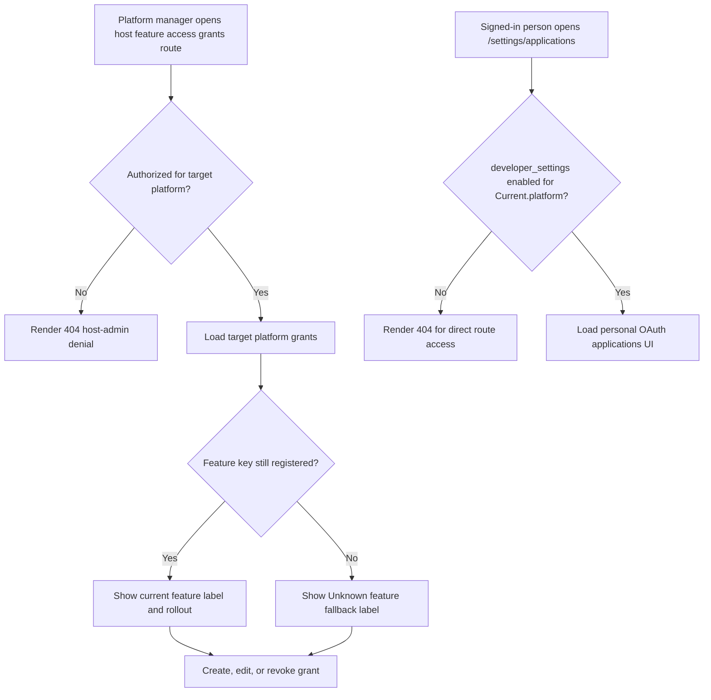
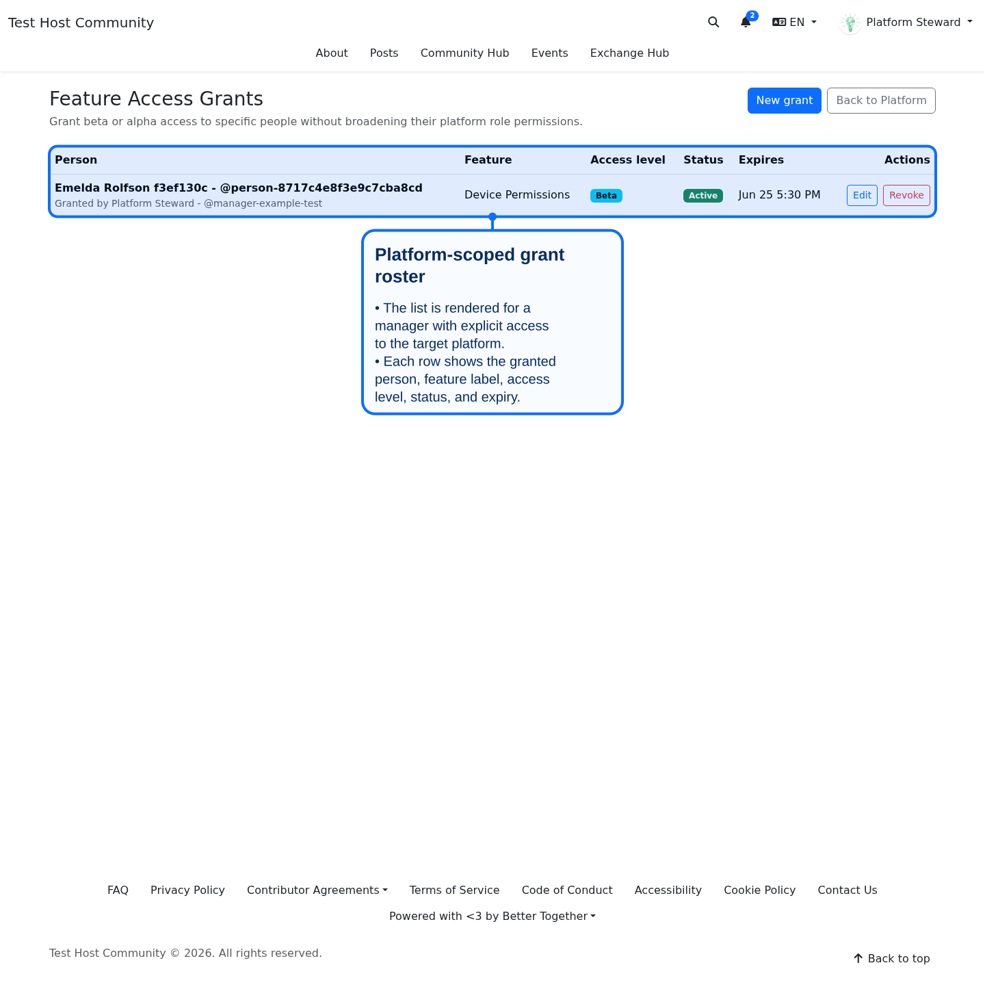
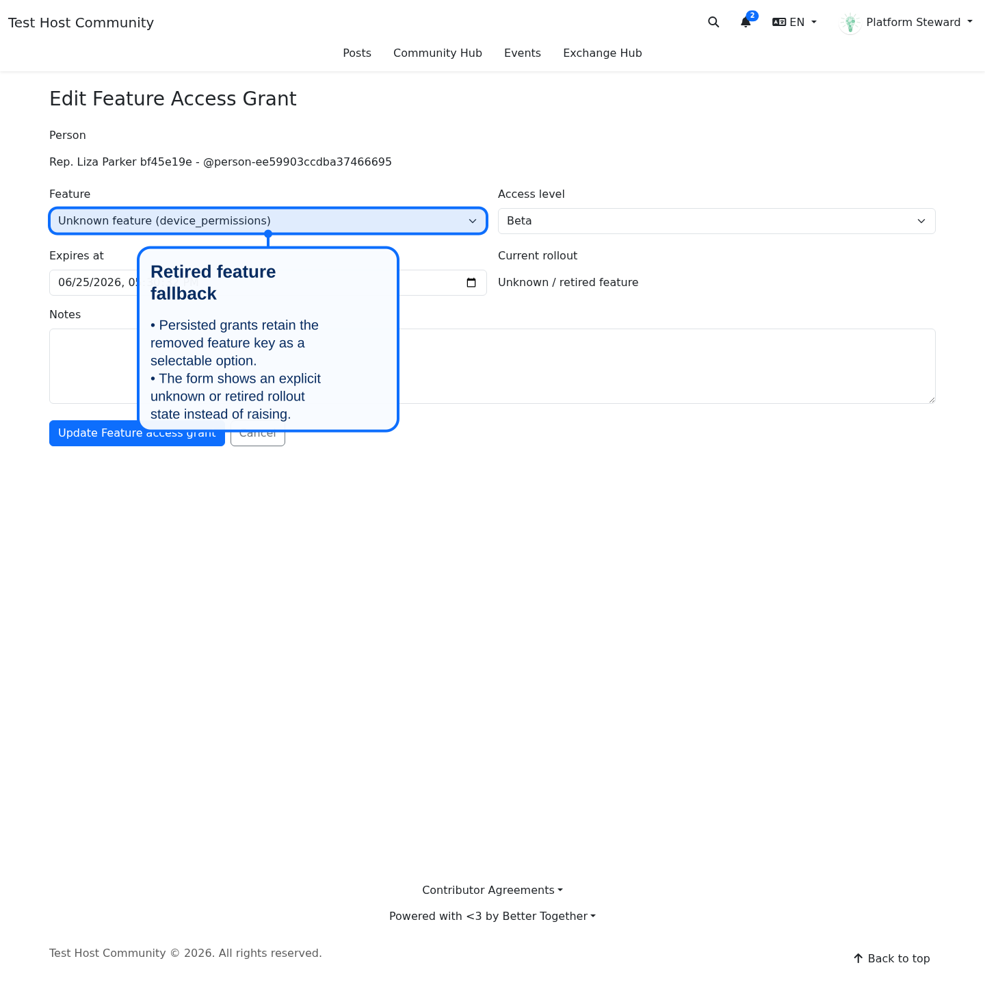
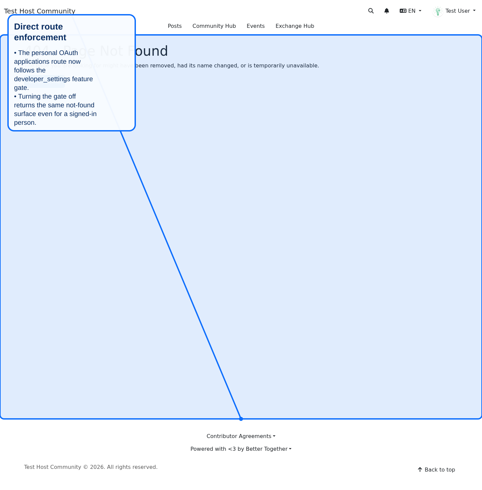

# Feature Access Grants And Developer Settings

## Overview

This branch tightens two related platform-management surfaces:

- host-admin managed feature access grants are now authorized against the target platform rather than broad host-global access alone
- the `developer_settings` gate now blocks direct access to personal OAuth application routes instead of only hiding the Settings tab

It also hardens feature lifecycle behavior so retired feature keys do not break the grant admin UI or historical records.

## Visual Flow

**Diagram Files:**
- [Mermaid Source](../../diagrams/source/feature_access_grants_and_developer_settings_flow.mmd)
- [PNG Export](../../diagrams/exports/png/feature_access_grants_and_developer_settings_flow.png)
- [SVG Export](../../diagrams/exports/svg/feature_access_grants_and_developer_settings_flow.svg)

## Authorization Boundaries

- Feature grant CRUD now requires `manage_platform` or `manage_platform_settings` on the specific target platform record.
- A host-platform manager without scoped access to another platform is denied with the same `404` contract used by other host admin surfaces.
- Direct personal OAuth application access now follows the `developer_settings` feature gate instead of bypassing it through the route layer.

## Retired Feature Key Handling

- Historical or persisted grants with removed feature keys remain editable for non-key fields.
- The grant index renders `Unknown feature (<key>)` instead of raising.
- The grant form keeps the retired key selectable for persisted records and shows `Unknown / retired feature` for rollout state when the registry no longer knows that key.

## UI Evidence

### Feature access grants index

### Retired feature grant edit form

### Direct personal OAuth route blocked when developer settings are off

Mobile captures are generated alongside the desktop variants in `docs/screenshots/mobile/`.

## Verification

- request specs cover scoped platform authorization, direct developer-settings route blocking, and retired feature-key rendering
- model and policy specs cover retired key persistence and gated OAuth policy behavior
- the docs screenshot spec exercises the grant index, retired-feature edit form, and blocked personal OAuth route with live rendered captures
