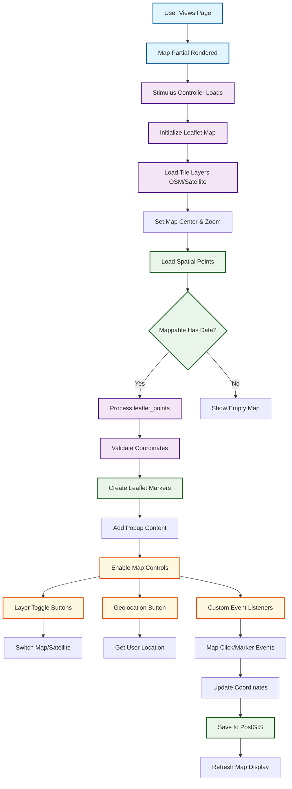

# Interactive Mapping System Documentation

## Overview

The Better Together Interactive Mapping System provides dynamic, interactive map visualization capabilities built on Leaflet.js and PostGIS spatial data. This system enables any entity in the platform to be visualized on interactive maps with real-time controls, multiple layer support, and seamless integration with the geography system.

## System Architecture

### Core Components

#### 1. Map Models & Polymorphic Design
- **Map**: Base interactive map model with center, zoom, viewport, and metadata
- **CommunityMap**: Specialized maps for community visualization
- **CommunityCollectionMap**: Collection-based maps showing multiple communities
- **Mappable Concern**: Polymorphic interface allowing any model to have maps

#### 2. Frontend Visualization
- **Leaflet.js Integration**: Professional mapping library with gesture handling
- **Stimulus Controller**: `better_together--map` controller for interactive functionality
- **Multiple Tile Layers**: OpenStreetMap and satellite imagery support
- **Real-time Controls**: Layer switching, geolocation, custom markers

#### 3. Spatial Data Integration
- **PostGIS Backend**: Leverages geography system's spatial database capabilities
- **Coordinate Conversion**: Transforms PostGIS data to Leaflet-compatible formats
- **Dynamic Point Loading**: Real-time spatial data visualization
- **Viewport Management**: Intelligent bounds calculation and fitting

#### 4. User Interface Components
- **Map Partial**: Reusable `_map.html.erb` component
- **Control Panel**: Built-in map controls (layer toggle, geolocation)
- **Popup System**: Configurable marker popups with HTML content
- **Responsive Design**: Mobile-friendly mapping interface

## Key Features

### 1. Polymorphic Map Association
```ruby
# Any model can be mappable
class Community < ApplicationRecord
  include BetterTogether::Geography::Mappable
  # Automatically gets map association and callback
end
```

### 2. Interactive Map Controls
- **Layer Switching**: Toggle between map and satellite view
- **Geolocation**: Browser-based location detection
- **Custom Markers**: Draggable markers with event handling
- **Zoom & Pan**: Full navigation with gesture handling

### 3. Real-time Data Visualization
- **Dynamic Point Loading**: Live spatial data updates
- **Popup Management**: Configurable content display
- **Bounds Fitting**: Automatic viewport adjustment
- **Multi-point Support**: Single and collection visualizations

### 4. Configurable Map Types
- **Single Entity Maps**: Individual community/location maps
- **Collection Maps**: Multiple entities on one map
- **Custom Map Classes**: Extensible map type system
- **Specialized Visualizations**: Domain-specific map implementations

## Technical Implementation

### Database Schema

**better_together_geography_maps**
```sql
- id: UUID primary key
- creator_id: UUID reference to creator
- mappable_type: Polymorphic type for mapped entity
- mappable_id: UUID polymorphic reference
- identifier: Unique string identifier
- center: PostGIS ST_POINT geographic coordinates
- zoom: Integer zoom level (default 13)
- viewport: PostGIS ST_POLYGON geographic boundary
- metadata: JSONB map configuration data
- type: STI type for map subclasses (default: BetterTogether::Geography::Map)
```

### Model Architecture

#### Base Map Model
```ruby
class BetterTogether::Geography::Map < ApplicationRecord
  include Creatable, FriendlySlug, Identifier, Privacy, Protected, Viewable
  
  belongs_to :mappable, polymorphic: true, optional: true
  delegate :spaces, :leaflet_points, to: :mappable, allow_nil: true
  
  translates :title, :description
  validates :center, presence: true
  validates :zoom, numericality: { only_integer: true, greater_than: 0 }
  
  before_validation :set_default_center, on: :create
end
```

#### Mappable Concern
```ruby
module BetterTogether::Geography::Mappable
  extend ActiveSupport::Concern
  
  included do
    has_one :map, 
            class_name: 'BetterTogether::Geography::Map',
            as: :mappable, 
            dependent: :destroy
    
    after_create :create_map, if: ->(obj) { obj.map.nil? }
    after_update :create_map, if: ->(obj) { obj.map.nil? }
  end
end
```

### JavaScript Integration

#### Stimulus Map Controller
```javascript
// app/javascript/controllers/better_together/map_controller.js
export default class extends Controller {
  static values = {
    center: String,
    spaces: Array,
    zoom: Number,
    extent: String,
    enablePopups: { type: Boolean, default: true },
    useLabelAsPopup: { type: Boolean, default: false }
  }
  
  connect() {
    const center = this.centerValue.split(',').map(Number)
    const zoom = this.zoomValue
    const extent = this.extentValue ? JSON.parse(this.extentValue) : null
    
    this.initializeMap(center, zoom, extent)
  }
  
  initializeMap(center, zoom, extent) {
    this.map = L.map(this.element, {
      gestureHandling: true
    }).setView(center, zoom)
    
    this.osmLayer = L.tileLayer.provider('OpenStreetMap.Mapnik').addTo(this.map)
    this.satelliteLayer = L.tileLayer.provider('Esri.WorldImagery')
    
    if (extent) {
      const bounds = L.latLngBounds(extent)
      this.map.fitBounds(bounds)
    }
    
    this.addPointsWithLabels(this.spacesValue)
  }
}
```

### Frontend Integration

#### Map Partial
```erb
<%# app/views/better_together/shared/_map.html.erb %>
<%# locals: (map:, enable_popups: true, use_label_as_popup: false) %>

<% if map %>
  <div class="map" id="<%= dom_id(map) %>"
      data-controller="better_together--map"
      data-better_together--map-center-value="<%= map.center_for_leaflet %>"
      data-better_together--map-spaces-value="<%= map.leaflet_points.to_json %>"
      data-better_together--map-zoom-value="<%= map.zoom %>"
      data-better_together--map-extent-value="<%= map.viewport %>"
      data-better_together--map-enable-popups-value="<%= enable_popups %>"
      data-better_together--map-use-label-as-popup-value="<%= use_label_as_popup %>">
    <div class="map-controls">
      <button class="btn btn-secondary" data-action="better_together--map#switchToOSM">Map</button>
      <button class="btn btn-secondary" data-action="better_together--map#switchToSatellite">Satellite</button>
      <button class="btn btn-secondary" data-action="better_together--map#enableGeolocation">Geolocate Me</button>
    </div>
  </div>
<% end %>
```

## Configuration Options

### Environment Variables

**Map Center Defaults**
```bash
# Default map center coordinates (Corner Brook, NL)
DEFAULT_MAP_CENTER_LNG="-57.9474"
DEFAULT_MAP_CENTER_LAT="48.9517"
```

### JavaScript Dependencies

**Importmap Configuration**
```ruby
# config/importmap.rb
pin 'leaflet', preload: true
pin 'leaflet-gesture-handling', preload: true
pin 'leaflet-providers', preload: true
```

### Map Initialization Options
```ruby
# Default zoom level
DEFAULT_ZOOM = 13

# PostGIS SRID for coordinates
SPATIAL_REFERENCE_SYSTEM = 4326  # WGS 84
```

## Usage Examples

### Creating Mappable Models
```ruby
class Event < ApplicationRecord
  include BetterTogether::Geography::Mappable
  has_many :locatable_locations, as: :locatable
  
  def leaflet_points
    locatable_locations.filter_map do |ll|
      space = ll.location&.space
      next unless space
      
      {
        lat: space.latitude,
        lng: space.longitude,
        label: ll.display_name,
        popup_html: "<strong>#{title}</strong><br/>#{ll.display_name}"
      }
    end
  end
end
```

### Rendering Maps in Views
```erb
<!-- Single entity map -->
<%= render 'better_together/shared/map', locals: { 
  map: @event.map, 
  enable_popups: true 
} %>

<!-- Collection map -->
<%= render 'better_together/shared/map', locals: { 
  map: CommunityCollectionMap.new,
  enable_popups: false,
  use_label_as_popup: true
} %>
```

### Custom Map Types
```ruby
class EventCollectionMap < BetterTogether::Geography::Map
  def self.mappable_class
    ::Event
  end
  
  def records
    mappable_class.published.includes(:locatable_locations)
  end
  
  def leaflet_points
    records.map(&:leaflet_points).flatten.uniq
  end
end
```

### Map Controller Integration
```ruby
class EventsController < ApplicationController
  def show
    @event = Event.find(params[:id])
    @map = @event.map || @event.create_map
  end
  
  def index
    @events = Event.published
    @collection_map = EventCollectionMap.new
  end
end
```

## Routes & Endpoints

### Map Resources

**Available Routes**
```
GET    /geography/maps           # List maps
POST   /geography/maps           # Create map  
GET    /geography/maps/:id       # Show map
PUT    /geography/maps/:id       # Update map
```

**Note**: The mapping system currently provides basic CRUD operations through the `MapsController`. Map data (points, bounds, center, zoom) is embedded in the map show response and delivered to the frontend via data attributes on the map partial, rather than through separate API endpoints.

## JavaScript Events

### Map Events
```javascript
// Listen for map ready
element.addEventListener('map:ready', (event) => {
  const map = event.detail.map
  // Map is initialized and ready
})

// Listen for map clicks
element.addEventListener('map:clicked', (event) => {
  const { latlng } = event.detail
  // User clicked on map
})

// Marker events
element.addEventListener('marker:add', (event) => {
  const { id, latlng } = event.detail
  // Add new marker
})

element.addEventListener('marker:moved', (event) => {
  const { id, lat, lng } = event.detail
  // Marker was dragged
})
```

### Custom Event Dispatching
```javascript
// Programmatically add marker
this.element.dispatchEvent(new CustomEvent('marker:add', {
  detail: { 
    id: 'new-marker', 
    latlng: [lat, lng] 
  }
}))

// Remove marker
this.element.dispatchEvent(new CustomEvent('marker:remove', {
  detail: { id: 'marker-to-remove' }
}))
```

## Performance Considerations

### Frontend Optimization

1. **Lazy Loading**: Initialize maps only when visible
2. **Point Clustering**: Group nearby markers for performance
3. **Tile Caching**: Leverage browser caching for map tiles
4. **Gesture Handling**: Prevent accidental map interactions on mobile

### Backend Optimization

1. **Spatial Indexing**: PostGIS indexes on coordinate columns
2. **Viewport Queries**: Limit points to visible area
3. **Caching Strategy**: Cache map data and configurations
4. **Batch Loading**: Efficient spatial data queries

### Memory Management
```ruby
# Efficient point loading
def leaflet_points
  @leaflet_points ||= calculate_leaflet_points
end

private

def calculate_leaflet_points
  # Only load necessary spatial data
  spaces_in_viewport.includes(:geospatial_spaces).map do |space|
    space.to_leaflet_point
  end
end
```

## Security Considerations

### Map Data Protection

1. **Privacy Levels**: Respect location privacy settings
2. **Access Control**: Community-based map access restrictions
3. **Data Sanitization**: Clean user-provided popup HTML content
4. **Tile Server Limits**: Respect external tile provider usage limits

### Frontend Security

1. **Content Security Policy**: Whitelist map tile domains
2. **XSS Prevention**: Sanitize popup content
3. **HTTPS Requirements**: Secure geolocation API access
4. **Input Validation**: Validate coordinate boundaries

```ruby
# Map policy example
class MapPolicy < ApplicationPolicy
  def show?
    return true if record.privacy_public?
    return true if record.privacy_community? && same_community?
    return true if record.privacy_private? && owner?
    
    false
  end
  
  def update?
    owner? || community_admin?
  end
end
```

## Monitoring & Maintenance

### Map Performance Monitoring

1. **Load Times**: Track map initialization performance
2. **Tile Loading**: Monitor tile server response times
3. **Memory Usage**: Watch for memory leaks in long-running maps
4. **User Interactions**: Track map engagement metrics

### Maintenance Tasks

1. **Tile Cache Management**: Clear outdated cached tiles
2. **Coordinate Validation**: Verify spatial data integrity
3. **Map Configuration Updates**: Sync default center points
4. **Performance Tuning**: Optimize spatial queries

### Health Checks
```ruby
# Map system health check
def map_system_healthy?
  # Check PostGIS availability
  ActiveRecord::Base.connection.execute("SELECT PostGIS_Version();")
  
  # Verify default coordinates
  default_center = Map.new.default_center
  return false unless default_center.latitude.between?(-90, 90)
  return false unless default_center.longitude.between?(-180, 180)
  
  # Test Leaflet integration
  return false unless Rails.application.importmap.find("leaflet")
  
  true
rescue => e
  Rails.logger.error "Map system health check failed: #{e.message}"
  false
end
```

## Troubleshooting

### Common Issues

1. **Map Not Loading**
   - Check importmap configuration for Leaflet dependencies
   - Verify Stimulus controller registration
   - Ensure PostGIS extension is available

2. **Markers Not Appearing**
   - Validate coordinate format (latitude/longitude order)
   - Check spatial data integrity
   - Verify leaflet_points method implementation

3. **Performance Issues**
   - Review number of markers being rendered
   - Check for memory leaks in long-running maps
   - Optimize spatial queries and indexing

4. **Mobile Responsiveness**
   - Verify gesture handling configuration
   - Check touch event handling
   - Test on various device sizes

### Debugging Tools

```ruby
# Debug map data
map = Event.find(1).map
puts "Center: #{map.center_for_leaflet}"
puts "Zoom: #{map.zoom}"
puts "Points: #{map.leaflet_points.count}"

# Test spatial relationships
space = Geography::Space.first
puts "Leaflet format: #{space.to_leaflet_point}"

# Verify mappable associations
community = Community.first
puts "Has map: #{community.map.present?}"
puts "Points count: #{community.leaflet_points.count}"
```

### Browser Console Debugging
```javascript
// Check map controller state
$controller = application.getControllerForElementAndIdentifier(
  document.querySelector('.map'), 
  'better_together--map'
)
console.log('Map instance:', $controller.map)
console.log('Center:', $controller.centerValue)
console.log('Points:', $controller.spacesValue)

// Test map events
document.querySelector('.map').dispatchEvent(
  new CustomEvent('marker:add', {
    detail: { id: 'test', latlng: [48.9517, -57.9474] }
  })
)
```

## Future Enhancements

### Planned Features

1. **Clustering Support**: Automatic marker clustering for dense areas
2. **Drawing Tools**: Allow users to draw shapes and annotations
3. **Routing Integration**: Add routing and direction capabilities
4. **Real-time Updates**: WebSocket integration for live map updates
5. **Custom Map Styles**: Theme support for different map appearances
6. **Offline Support**: Cache tiles for offline map viewing
7. **3D Visualization**: Integration with Cesium.js for 3D maps
8. **Heat Maps**: Density visualization for data analysis

### Integration Opportunities

1. **Event Integration**: Enhanced event location visualization
2. **Community Planning**: Collaborative mapping tools
3. **Resource Mapping**: Visualize community resources and services
4. **Transportation**: Public transit and route planning
5. **Emergency Services**: Crisis response and coordination mapping

## Process Flow Diagram



**Diagram Files:**
- 📊 [Mermaid Source](../../diagrams/source/mapping_system_flow.mmd) - Editable source
- 🖼️ [PNG Export](../../diagrams/exports/png/mapping_system_flow.png) - High-resolution image  
- 🎯 [SVG Export](../../diagrams/exports/svg/mapping_system_flow.svg) - Vector graphics

This comprehensive mapping system provides a robust foundation for interactive geographical visualization throughout the Better Together platform, supporting everything from simple location display to complex multi-entity spatial analysis and user interaction.
