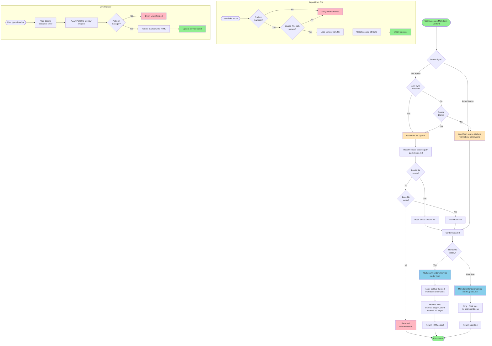

# Markdown Content Management System Documentation

## Overview

The Markdown Content Management system provides a flexible, dual-source content block model for managing markdown content throughout the Better Together Community Engine. It enables both database-driven inline editing and file-based version control workflows, supports multi-locale content with automatic locale-specific file resolution, and provides secure GitHub-flavored markdown rendering with live preview capabilities.

**Key Capabilities:**
- Dual-source content model (inline database or file-based)
- Locale-aware markdown file loading (e.g., `guide.en.md`, `guide.fr.md`)
- GitHub-flavored markdown rendering with tables, code blocks, and advanced features
- Live preview with debounced updates via Stimulus controller
- Platform manager authorization with protected content flags
- Search indexing via plain-text rendering
- Integration with DocumentationBuilder for automated doc site generation

**Stakeholder Benefits:**
- **Platform Organizers**: Web-based markdown editing with live preview and flexible workflows
- **Developers**: Version-controlled documentation through Git with file-based content
- **Content Authors**: WYSIWYG-like editing experience with confidence in rendered output
- **End Users**: Rich, properly formatted documentation with multi-locale support
- **Search Systems**: Plain-text content extraction for full-text indexing

## System Architecture

### Core Components

#### 1. Content Block Model (STI)
- **BetterTogether::Content::Markdown**: STI class inheriting from Content::Block with markdown-specific behavior
- **Dual-source attributes**: `source` (database, via Mobility) and `source_file_path` (filesystem)
- **Auto-sync control**: `auto_sync` boolean determines file→database synchronization behavior
- **Locale support**: Translates `source` attribute via Mobility for multi-locale inline editing

#### 2. Rendering Service
- **BetterTogether::MarkdownRendererService**: Redcarpet wrapper for secure markdown→HTML conversion
- **GitHub-flavored markdown**: Tables, code blocks, strikethrough, superscript, footnotes
- **Security features**: External link targeting (`target="_blank"`), XSS prevention, safe HTML rendering
- **Search support**: Plain-text rendering via HTML tag stripping for Elasticsearch

#### 3. Authorization Layer
- **BetterTogether::Content::MarkdownPolicy**: Pundit policy restricting creation/editing to platform managers
- **Protected content**: Infrastructure pages marked protected to prevent accidental deletion
- **Public viewing**: End users can view rendered markdown without authentication
- **Role-based access**: Create/update/preview/import actions require platform manager role

#### 4. Interactive UI
- **Stimulus markdown_preview_controller**: JavaScript controller for live preview with 300ms debounce
- **Split-pane editor**: Desktop layout with source textarea and preview panel side-by-side
- **Tabbed mobile interface**: Edit/Preview tabs for responsive mobile experience
- **File upload support**: Optional file-based content with manual import capability

## Key Features

### 1. Dual-Source Content Loading

**Inline Database Editing:**
- Platform organizers edit markdown directly in web form textarea
- Content stored in `source` attribute via Mobility translations table
- Supports multi-locale inline content through Mobility's translation framework
- Ideal for content requiring frequent updates and centralized management

**File-Based Content:**
- Developers manage markdown as files in `docs/` directory under version control
- `source_file_path` attribute points to file relative to `Rails.root`
- Automatic loading from filesystem on each access (when auto-sync enabled or source blank)
- Supports locale-specific files with automatic fallback (e.g., `guide.fr.md` → `guide.md`)

**Automatic Synchronization:**
- `auto_sync: true` loads from file on every access (always current with repository)
- `auto_sync: false` requires manual import via `import_file_content!` method
- Manual import allows platform organizers to control when file changes go live
- File changes tracked via Git, providing full version history and collaboration

### 2. Locale-Aware File Resolution

**Multi-Locale File Pattern:**
```
docs/
├── guide.md          # Default/fallback content
├── guide.en.md       # English-specific content
├── guide.fr.md       # French-specific content
├── guide.es.md       # Spanish-specific content
└── guide.uk.md       # Ukrainian-specific content
```

**Resolution Logic:**
1. Check for locale-specific file: `guide.{I18n.locale}.md`
2. If found, load locale-specific content
3. If not found, fallback to base file: `guide.md`
4. If base file missing, return nil (validation error)

**Benefits:**
- Developers provide translations as separate files
- Automatic locale detection based on user's `I18n.locale`
- No database changes needed for new translations
- Clean separation of content by language

### 3. GitHub-Flavored Markdown Rendering

**Supported Syntax:**
- **Headings**: `# H1` through `###### H6`
- **Emphasis**: `**bold**`, `_italic_`, `~~strikethrough~~`
- **Lists**: Ordered (`1. Item`) and unordered (`- Item`)
- **Links**: `[text](url)` with automatic external link targeting
- **Images**: `` with responsive sizing
- **Tables**: GitHub-style pipe tables with alignment
- **Code blocks**: Fenced (triple-backtick) with syntax highlighting
- **Advanced**: Superscript (`^text^`), footnotes (`[^ref]`), task lists

**Rendering Features:**
- **External link security**: Automatic `target="_blank" rel="noopener noreferrer"` on external URLs
- **Internal link preservation**: Links to same domain stay in current tab
- **XSS prevention**: Safe HTML rendering with Redcarpet's security defaults
- **Plain-text extraction**: HTML stripping for search indexing

### 4. Live Preview with Debouncing

**Stimulus Controller Features:**
- **Real-time updates**: Preview panel updates as user types markdown
- **300ms debounce**: Prevents excessive rendering during rapid typing
- **AJAX rendering**: Server-side rendering without full page reload
- **CSRF protection**: Secure preview endpoint with Rails CSRF token
- **Progressive enhancement**: Basic textarea works without JavaScript

**User Experience:**
- Platform organizers see rendered output before publishing
- Immediate feedback on markdown syntax errors
- Confidence that published content matches expectations
- Reduced publish-test-fix cycles

## Process Flow Diagram



**Diagram Files:**
- 📊 [Mermaid Source](../diagrams/source/markdown_content_flow.mmd) - Editable source
- 🖼️ [PNG Export](../diagrams/exports/png/markdown_content_flow.png) - High-resolution image
- 🎯 [SVG Export](../diagrams/exports/svg/markdown_content_flow.svg) - Vector graphics

## Technical Implementation

### Database Schema

#### Content Blocks Table (STI)

**better_together_content_blocks**
```sql
-- Polymorphic content blocks with STI
CREATE TABLE better_together_content_blocks (
  id UUID PRIMARY KEY DEFAULT gen_random_uuid(),
  type VARCHAR NOT NULL,                          -- STI: BetterTogether::Content::Markdown
  block_container_id UUID NOT NULL,               -- Polymorphic: Page, NavigationItem, etc.
  block_container_type VARCHAR NOT NULL,
  position INTEGER DEFAULT 0,                     -- Order within container
  protected BOOLEAN DEFAULT FALSE,                -- Prevent deletion if true
  source_file_path VARCHAR,                       -- Markdown-specific: file path
  auto_sync BOOLEAN DEFAULT FALSE,                -- Markdown-specific: auto-import
  lock_version INTEGER DEFAULT 0,                 -- Optimistic locking
  created_at TIMESTAMP NOT NULL,
  updated_at TIMESTAMP NOT NULL
);

-- Indexes
CREATE INDEX idx_content_blocks_type ON better_together_content_blocks(type);
CREATE INDEX idx_content_blocks_container ON better_together_content_blocks(block_container_id, block_container_type);
CREATE INDEX idx_content_blocks_source_file ON better_together_content_blocks(source_file_path);
CREATE INDEX idx_content_blocks_auto_sync ON better_together_content_blocks(auto_sync);
CREATE INDEX idx_content_blocks_protected ON better_together_content_blocks(protected);
```

#### Mobility Translations Table

**mobility_text_translations**
```sql
-- Stores translated source content for inline editing
CREATE TABLE mobility_text_translations (
  id BIGSERIAL PRIMARY KEY,
  translatable_type VARCHAR NOT NULL,             -- BetterTogether::Content::Markdown
  translatable_id UUID NOT NULL,                  -- Markdown block ID
  locale VARCHAR NOT NULL,                        -- en, fr, es, uk
  key VARCHAR NOT NULL,                           -- source (attribute name)
  value TEXT,                                     -- Markdown source text
  created_at TIMESTAMP NOT NULL,
  updated_at TIMESTAMP NOT NULL
);

-- Indexes
CREATE INDEX idx_mobility_translations ON mobility_text_translations(
  translatable_type, translatable_id, locale, key
);
```

### Model Relationships

#### BetterTogether::Content::Markdown

```ruby
module BetterTogether
  module Content
    class Markdown < Block
      # STI inheritance from polymorphic Content::Block
      # Inherits: block_container (polymorphic), position, protected
      
      # Translatable source attribute via Mobility
      translates :source, backend: :action_text
      # Stores in mobility_text_translations table
      # Supports multi-locale inline editing
      
      # Markdown-specific attributes
      attribute :source_file_path, :string      # Path relative to Rails.root
      attribute :auto_sync, :boolean, default: false  # Auto-import control
      
      # Validations
      validates :source, presence: true, unless: :source_file_path?
      validates :source_file_path, presence: true, unless: :source?
      validate :validate_file_exists, if: :source_file_path?
      
      # Scopes for querying
      scope :file_based, -> { where.not(source_file_path: nil) }
      scope :inline_based, -> { where(source_file_path: nil) }
      scope :auto_sync_enabled, -> { where(auto_sync: true) }
      
      # Content retrieval (dual-source logic)
      def content
        return load_file_content if source_file_path.present? && should_load_from_file?
        source.presence || load_file_content
      end
      
      # Rendered HTML output
      def rendered_html
        MarkdownRendererService.render_html(content)
      end
      
      # Plain text for search indexing
      def plain_text
        MarkdownRendererService.render_plain_text(content)
      end
      
      # Manual import from file
      def import_file_content!
        return false unless source_file_path.present?
        file_content = load_file_content
        return false if file_content.blank?
        
        update!(source: file_content)
      end
      
      private
      
      def load_file_content
        return nil unless source_file_path.present?
        
        # Try locale-specific file first
        locale_path = locale_specific_path(source_file_path)
        return File.read(locale_path) if File.exist?(locale_path)
        
        # Fallback to base file
        base_path = Rails.root.join(source_file_path)
        return File.read(base_path) if File.exist?(base_path)
        
        nil
      end
      
      def locale_specific_path(path)
        # Convert docs/guide.md → docs/guide.en.md
        ext = File.extname(path)
        base = path.chomp(ext)
        Rails.root.join("#{base}.#{I18n.locale}#{ext}")
      end
      
      def should_load_from_file?
        auto_sync? || source.blank?
      end
      
      def validate_file_exists
        return if source_file_path.blank?
        
        locale_path = locale_specific_path(source_file_path)
        base_path = Rails.root.join(source_file_path)
        
        unless File.exist?(locale_path) || File.exist?(base_path)
          errors.add(:source_file_path, :file_not_found)
        end
      end
    end
  end
end
```

#### BetterTogether::MarkdownRendererService

```ruby
module BetterTogether
  class MarkdownRendererService
    class << self
      # Render markdown to HTML
      def render_html(markdown_text)
        return '' if markdown_text.blank?
        renderer.render(markdown_text).html_safe
      end
      
      # Render markdown to plain text (search indexing)
      def render_plain_text(markdown_text)
        return '' if markdown_text.blank?
        html = renderer.render(markdown_text)
        ActionView::Base.full_sanitizer.sanitize(html)
      end
      
      private
      
      def renderer
        @renderer ||= Redcarpet::Markdown.new(
          html_renderer,
          markdown_extensions
        )
      end
      
      def html_renderer
        HTMLWithExternalLinks.new(
          filter_html: false,     # Trust platform managers
          hard_wrap: true,        # Newlines → <br>
          link_attributes: { target: '_blank', rel: 'noopener noreferrer' }
        )
      end
      
      def markdown_extensions
        {
          tables: true,                    # | Col | Col |
          fenced_code_blocks: true,        # ```code```
          autolink: true,                  # Auto-link URLs
          strikethrough: true,             # ~~deleted~~
          space_after_headers: true,       # Require space after #
          superscript: true,               # ^super^
          underline: true,                 # _underline_
          highlight: true,                 # ==highlighted==
          footnotes: true,                 # [^footnote]
          no_intra_emphasis: true          # Disable emphasis in_words
        }
      end
    end
    
    # Custom renderer for external link handling
    class HTMLWithExternalLinks < Redcarpet::Render::HTML
      def link(link, title, content)
        # Detect external links
        external = link.start_with?('http://', 'https://') && 
                   !link.include?(Rails.application.routes.default_url_options[:host])
        
        attrs = []
        attrs << %{href="#{link}"}
        attrs << %{title="#{title}"} if title.present?
        attrs << 'target="_blank" rel="noopener noreferrer"' if external
        
        %{<a #{attrs.join(' ')}>#{content}</a>}
      end
    end
  end
end
```

### Configuration

**Gemfile Dependencies**
```ruby
# Markdown rendering
gem 'redcarpet', '~> 3.6'  # GitHub-flavored markdown

# I18n and translations
gem 'mobility', '~> 1.2'   # Translatable attributes

# View layer
gem 'stimulus-rails'        # JavaScript framework for live preview
```

**Importmap Configuration (JavaScript)**
```javascript
// app/javascript/controllers/markdown_preview_controller.js
import { Controller } from "@hotwired/stimulus"

export default class extends Controller {
  static targets = ["source", "preview"]
  static values = { previewUrl: String, debounce: { type: Number, default: 300 } }
  
  connect() {
    this.timeout = null
  }
  
  updatePreview() {
    clearTimeout(this.timeout)
    this.timeout = setTimeout(() => this.renderPreview(), this.debounceValue)
  }
  
  async renderPreview() {
    const markdown = this.sourceTarget.value
    const response = await fetch(this.previewUrlValue, {
      method: 'POST',
      headers: {
        'Content-Type': 'application/json',
        'X-CSRF-Token': this.csrfToken
      },
      body: JSON.stringify({ content: markdown })
    })
    const data = await response.json()
    this.previewTarget.innerHTML = data.html
  }
  
  get csrfToken() {
    return document.querySelector('meta[name="csrf-token"]').content
  }
}
```

## Usage Examples

### Creating Inline Markdown Content

**Platform Organizer Workflow:**
```ruby
# Create page with inline markdown
page = BetterTogether::Page.create!(
  title: 'Getting Started',
  slug: 'getting-started',
  navigation_area: docs_area
)

# Create markdown block
markdown = BetterTogether::Content::Markdown.create!(
  block_container: page,
  position: 1,
  source: <<~MD
    # Welcome to Better Together
    
    This is **your** community platform. Here's how to get started:
    
    ## Step 1: Create Your Profile
    
    Navigate to your profile page and add:
    - A profile photo
    - A short bio
    - Your interests and skills
    
    ## Step 2: Join Communities
    
    Browse the [community directory](/communities) to find groups that match your interests.
  MD
)

# Render to HTML
html = markdown.rendered_html
# => "<h1>Welcome to Better Together</h1><p>This is <strong>your</strong>..."
```

### Creating File-Based Markdown Content

**Developer Workflow:**
```bash
# Create markdown file in repository
mkdir -p docs/guides
cat > docs/guides/contributing.md <<MD
# Contributing Guidelines

Thank you for contributing! Please follow these steps:

1. Fork the repository
2. Create a feature branch
3. Write tests for your changes
4. Submit a pull request
MD

# Create locale-specific version
cat > docs/guides/contributing.fr.md <<MD
# Directives de Contribution

Merci de contribuer ! Veuillez suivre ces étapes :

1. Bifurquez le référentiel
2. Créer une branche de fonctionnalité
3. Écrire des tests pour vos modifications
4. Soumettre une demande de tirage
MD
```

```ruby
# Create markdown block pointing to file
markdown = BetterTogether::Content::Markdown.create!(
  block_container: page,
  source_file_path: 'docs/guides/contributing.md',
  auto_sync: true  # Always load from file
)

# Content loads automatically from file
I18n.with_locale(:en) do
  markdown.content  # => "# Contributing Guidelines\n\nThank you..."
end

I18n.with_locale(:fr) do
  markdown.content  # => "# Directives de Contribution\n\nMerci..."
end
```

### Manual File Import

**Platform Organizer Workflow:**
```ruby
# Developer updates file in repository
# docs/guides/faq.md changes from version A to version B

# Platform organizer views page, sees outdated content
markdown = BetterTogether::Content::Markdown.find(id)
markdown.auto_sync  # => false (manual control)

# Explicitly import updated content
markdown.import_file_content!
# => Updates source attribute from file
# => Returns true on success

# Now page displays updated content
markdown.content  # => Version B content
```

### Automated Documentation Generation

**DocumentationBuilder Integration:**
```ruby
# Generate complete documentation site from docs/ directory
BetterTogether::DocumentationBuilder.build

# Results in:
# - Navigation areas and items for each directory/file
# - Pages for each .md file
# - Markdown blocks with source_file_path for each page
# - Protected flags on all generated pages

# Example generated markdown block:
markdown = BetterTogether::Content::Markdown.last
markdown.source_file_path  # => "docs/developers/api.md"
markdown.auto_sync         # => false (manual import control)
markdown.protected         # => true (cannot delete infrastructure docs)
```

## API Endpoints

### Content Blocks Routes (Markdown Subset)

```ruby
# config/routes.rb
namespace :better_together do
  resources :content_blocks, only: [:show, :edit, :update] do
    member do
      post :preview             # Live preview endpoint
      post :import_from_file    # Manual file import
    end
  end
end
```

**Preview Endpoint:**
```
POST /better_together/content_blocks/preview
Content-Type: application/json

{
  "content": "# Heading\n\n**Bold** text"
}

Response:
{
  "html": "<h1>Heading</h1><p><strong>Bold</strong> text</p>"
}
```

**Import Endpoint:**
```
POST /better_together/content_blocks/:id/import_from_file

Response: 302 Redirect with flash message
```

## Performance Considerations

### File System Optimization

1. **Caching file content**: Consider caching `load_file_content` results in production
   ```ruby
   def load_file_content
     Rails.cache.fetch("markdown:#{id}:#{updated_at.to_i}", expires_in: 1.hour) do
       # ... file loading logic
     end
   end
   ```

2. **Locale file resolution**: Cache locale-specific paths to avoid repeated `File.exist?` checks
   ```ruby
   def locale_specific_path(path)
     @locale_paths ||= {}
     @locale_paths[I18n.locale] ||= calculate_locale_path(path)
   end
   ```

3. **Rendered HTML caching**: Cache `rendered_html` output for frequently accessed pages
   ```ruby
   def rendered_html
     Rails.cache.fetch("markdown:#{id}:html:#{updated_at.to_i}", expires_in: 24.hours) do
       MarkdownRendererService.render_html(content)
     end
   end
   ```

### Database Query Optimization

1. **Index on source_file_path**: Fast filtering of file-based vs inline blocks
2. **Index on auto_sync**: Efficient queries for auto-sync enabled blocks
3. **Index on type**: STI queries for Markdown blocks specifically
4. **Composite index**: Consider `(type, source_file_path, auto_sync)` for complex queries

### Frontend Performance

1. **Debounced preview**: 300ms debounce prevents excessive server requests during typing
2. **AJAX preview**: Partial updates avoid full page reloads
3. **Progressive enhancement**: Editor works without JavaScript (basic textarea)
4. **Lazy loading**: Only load preview panel JavaScript when editing

### Background Processing (Future)

1. **Batch file import**: Sidekiq job for bulk synchronization
   ```ruby
   # Sync all auto_sync enabled blocks at once
   BetterTogether::Content::Markdown.auto_sync_enabled.find_each(&:import_file_content!)
   ```

2. **Async rendering**: Pre-render HTML for large documents in background
3. **Search indexing**: Background job to update Elasticsearch after content changes

## Security Considerations

### Authorization & Access Control

1. **Platform manager restriction**: Only platform managers can create/edit markdown blocks
   - Policy check: `MarkdownPolicy#create?`, `#update?`
   - Preview access: Requires platform manager role
   - Import action: Platform manager + valid file path required

2. **Protected content enforcement**: Infrastructure pages cannot be deleted
   - Policy check: `MarkdownPolicy#destroy?` returns false if `protected?`
   - UI indication: Protected badge shown on pages
   - Builder integration: Auto-generated docs marked protected

3. **Public viewing**: End users can view rendered markdown without authentication
   - Policy allows: `MarkdownPolicy#show?` for all users
   - Performance: Cached rendered HTML serves public traffic efficiently

### File System Security

1. **Path validation**: Prevent directory traversal attacks
   ```ruby
   def validate_file_exists
     # Ensure path stays within Rails.root
     full_path = Rails.root.join(source_file_path).cleanpath
     raise SecurityError unless full_path.to_s.start_with?(Rails.root.to_s)
     # ... existence check
   end
   ```

2. **Relative path enforcement**: All paths relative to `Rails.root`
   - No absolute paths accepted
   - File loading prepends `Rails.root`
   - Prevents access to system files outside application

3. **File existence validation**: Reject non-existent paths before persistence
   - Validation runs on `source_file_path` changes
   - Prevents broken links and confusing UX

### Rendering Security

1. **Trusted content assumption**: Platform managers are trusted users
   - `filter_html: false` allows HTML in markdown (for embeds)
   - XSS risk mitigated by restricting authorship to platform managers

2. **External link protection**: Prevent `window.opener` vulnerabilities
   - All external links: `rel="noopener noreferrer"`
   - Prevents external sites from accessing parent window

3. **Input sanitization for search**: Plain-text rendering strips all HTML
   - Search indexing uses `render_plain_text`
   - Prevents script injection via search results

## Monitoring & Maintenance

### Metrics to Track

```ruby
# File loading performance
ActiveSupport::Notifications.subscribe('markdown.file_load') do |name, start, finish, id, payload|
  duration = (finish - start) * 1000
  Rails.logger.info "Markdown file load: #{payload[:path]} (#{duration.round(2)}ms)"
end

# Rendering performance
ActiveSupport::Notifications.subscribe('markdown.render') do |name, start, finish, id, payload|
  duration = (finish - start) * 1000
  Rails.logger.info "Markdown render: #{payload[:length]} chars (#{duration.round(2)}ms)"
end
```

### Data Quality Checks

```ruby
# Find orphaned file-based blocks (file deleted)
orphaned = BetterTogether::Content::Markdown.file_based.select do |markdown|
  markdown.load_file_content.nil?
end

# Find blocks with both source and file path (conflicting)
conflicted = BetterTogether::Content::Markdown.where.not(source_file_path: nil).where.not(source: nil)

# Find auto-sync blocks that haven't updated recently
stale = BetterTogether::Content::Markdown.auto_sync_enabled.where('updated_at < ?', 1.week.ago)
```

### Maintenance Tasks

```ruby
# Rake task: Sync all auto-sync enabled blocks
namespace :markdown do
  desc 'Synchronize all auto-sync markdown blocks from files'
  task sync_all: :environment do
    BetterTogether::Content::Markdown.auto_sync_enabled.find_each do |markdown|
      if markdown.import_file_content!
        puts "✓ Synced: #{markdown.block_container.title}"
      else
        puts "✗ Failed: #{markdown.block_container.title} (#{markdown.source_file_path})"
      end
    end
  end
end
```

## Troubleshooting

### Common Issues

#### 1. File Not Loading

**Problem**: Markdown block shows blank content despite valid `source_file_path`

**Diagnosis**:
```ruby
markdown = BetterTogether::Content::Markdown.find(id)
markdown.source_file_path           # => "docs/guide.md"
markdown.content                    # => nil

# Check file existence
File.exist?(Rails.root.join(markdown.source_file_path))  # => false
```

**Solutions**:
- Verify file path is correct (case-sensitive on Linux)
- Ensure file committed to repository and deployed
- Check file permissions (must be readable by Rails process)
- Try absolute path for debugging: `File.read('/full/path/to/file.md')`

**Prevention**:
- Use validation: `validate :validate_file_exists, if: :source_file_path?`
- Test file loading in specs with temporary files
- Document expected file locations in README

#### 2. Locale File Not Loading

**Problem**: French users see English content despite `guide.fr.md` existing

**Diagnosis**:
```ruby
I18n.locale = :fr
markdown = BetterTogether::Content::Markdown.find(id)
markdown.source_file_path           # => "docs/guide.md"
markdown.content                    # => "# English Content" (not French)

# Check locale file path
locale_path = markdown.send(:locale_specific_path, markdown.source_file_path)
# => "/path/to/app/docs/guide.fr.md"
File.exist?(locale_path)            # => false (file named incorrectly?)
```

**Solutions**:
- Verify locale file naming: `guide.fr.md` not `guide.md.fr`
- Check I18n.locale is set correctly: `I18n.locale` should be `:fr`
- Ensure locale file deployed to production
- Test with `I18n.with_locale(:fr) { markdown.content }`

**Prevention**:
- Document locale file naming convention
- Add specs testing each supported locale
- Create Rake task to validate all locale files exist

#### 3. Preview Not Updating

**Problem**: Live preview panel doesn't update when typing in editor

**Diagnosis**:
```javascript
// Browser console
console.log(document.querySelector('[data-controller="markdown-preview"]'))
// => null (controller not connected?)

// Check for JavaScript errors
console.error
// => "Failed to fetch preview URL"
```

**Solutions**:
- Verify Stimulus controller connected: `data-controller="markdown-preview"`
- Check preview URL value: `data-markdown-preview-preview-url-value="/preview"`
- Confirm CSRF token present: `<meta name="csrf-token" content="...">`
- Test preview endpoint manually: `curl -X POST /better_together/content_blocks/preview`

**Prevention**:
- Add JavaScript console logging in development
- Write feature spec testing preview functionality
- Include preview in CI testing with JavaScript driver

#### 4. Import Permission Denied

**Problem**: Platform manager sees "Unauthorized" when clicking "Import from File"

**Diagnosis**:
```ruby
user = current_person
markdown = BetterTogether::Content::Markdown.find(id)
policy = BetterTogether::Content::MarkdownPolicy.new(user, markdown)

policy.import_from_file?  # => false
# Check conditions:
user.has_role?(:platform_manager, BetterTogether::Platform.host)  # => false (role missing!)
markdown.source_file_path.present?  # => true
```

**Solutions**:
- Verify user has platform_manager role on host platform
- Check role assignment: `user.add_role(:platform_manager, Platform.host)`
- Ensure `source_file_path` is set (import requires file-based content)

**Prevention**:
- Test policy with multiple user roles
- Add helpful error messages explaining authorization failure
- Show/hide import button based on policy authorization

### Debugging Tools

**Rails Console Helpers:**
```ruby
# Inspect markdown block state
def debug_markdown(id)
  markdown = BetterTogether::Content::Markdown.find(id)
  {
    source_type: markdown.source_file_path ? :file_based : :inline,
    file_path: markdown.source_file_path,
    auto_sync: markdown.auto_sync,
    source_blank: markdown.source.blank?,
    content_source: markdown.send(:should_load_from_file?) ? :file : :database,
    content_length: markdown.content&.length,
    locale_file_exists: markdown.source_file_path && File.exist?(
      markdown.send(:locale_specific_path, markdown.source_file_path)
    ),
    base_file_exists: markdown.source_file_path && File.exist?(
      Rails.root.join(markdown.source_file_path)
    )
  }
end

# Test rendering
def test_render(markdown_text)
  {
    html: BetterTogether::MarkdownRendererService.render_html(markdown_text),
    plain_text: BetterTogether::MarkdownRendererService.render_plain_text(markdown_text)
  }
end
```

## Integration Points

### Dependencies

- **BetterTogether::Content::Block**: Parent STI class providing polymorphic container association
- **Mobility**: Translates `source` attribute for multi-locale inline editing
- **Redcarpet**: GitHub-flavored markdown rendering engine
- **Stimulus**: JavaScript framework for live preview controller
- **Pundit**: Authorization policy enforcement
- **ActionView::Base.full_sanitizer**: HTML stripping for plain-text rendering
- **ActiveStorage** (indirect): For file uploads (future enhancement)

### Used By

- **BetterTogether::DocumentationBuilder**: Creates Markdown blocks for .md files in docs/ directory
- **BetterTogether::Page**: Contains Markdown blocks as primary content
- **BetterTogether::NavigationItem**: May contain Markdown blocks for item descriptions
- **Search/Elasticsearch**: Uses `plain_text` method for full-text indexing
- **Platform Organizers**: Edit markdown content via admin interfaces
- **End Users**: View rendered markdown content on public pages

### Future Integration Points

- **Version Control**: Git integration for tracking content changes over time
- **Collaborative Editing**: Real-time multi-user editing with conflict resolution
- **Content Approval Workflows**: Community contributor → platform organizer review → publish
- **Template Library**: Reusable markdown snippets and common patterns
- **Syntax Highlighting**: CodeMirror or Monaco editor for enhanced editing experience

---

## Documentation Checklist

- [x] **Overview and architecture covered** - Dual-source model, rendering, authorization explained
- [x] **Database schema documented** - content_blocks, mobility_text_translations tables
- [x] **Model relationships explained** - Markdown STI, Mobility translations, polymorphic associations
- [x] **Configuration examples provided** - Gemfile, Stimulus controller, Redcarpet config
- [x] **Usage examples included** - Inline, file-based, locale-specific, automated generation
- [x] **API endpoints documented** - Preview and import endpoints with examples
- [x] **Performance considerations covered** - Caching, indexing, debouncing, background jobs
- [x] **Security implications addressed** - Authorization, file validation, rendering security
- [x] **Monitoring/debugging tools provided** - Metrics, quality checks, console helpers
- [x] **Integration points identified** - Dependencies and consuming systems listed
- [x] **Process flow diagram created** - Mermaid diagram showing content loading and rendering
- [ ] **Mermaid source file (.mmd)** - Next: Create separate .mmd file
- [ ] **PNG diagram generated** - Next: Run bin/render_diagrams
- [ ] **SVG diagram generated** - Next: Run bin/render_diagrams  
- [ ] **Documentation assessment updated** - Next: Update progress tracking

---

*This system documentation follows Better Together Community Engine standards, providing comprehensive technical reference for developers, platform organizers, and system administrators managing markdown content.*
