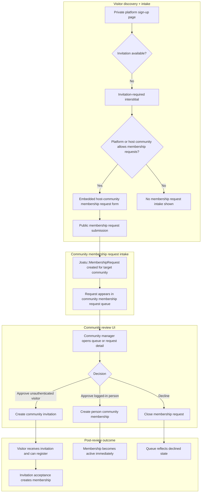
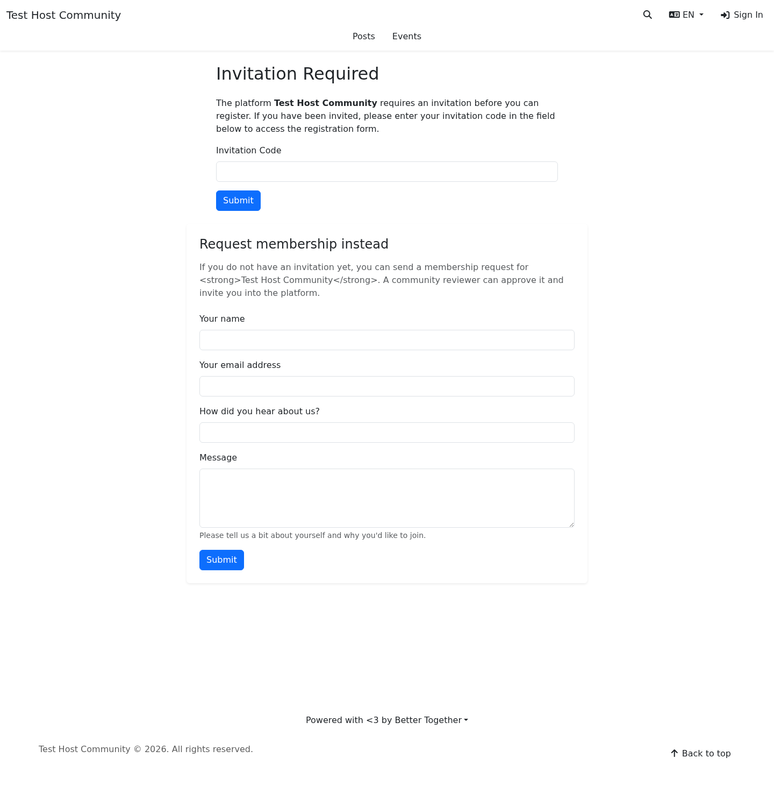
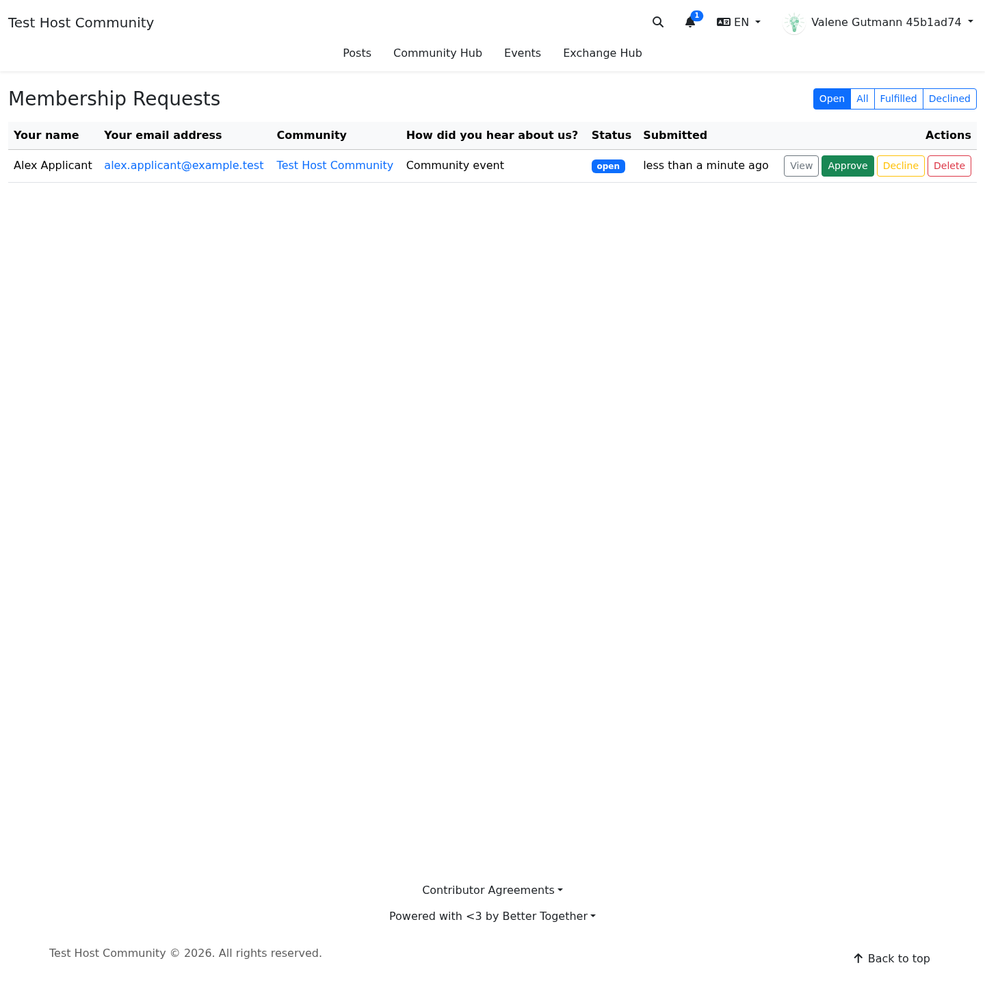
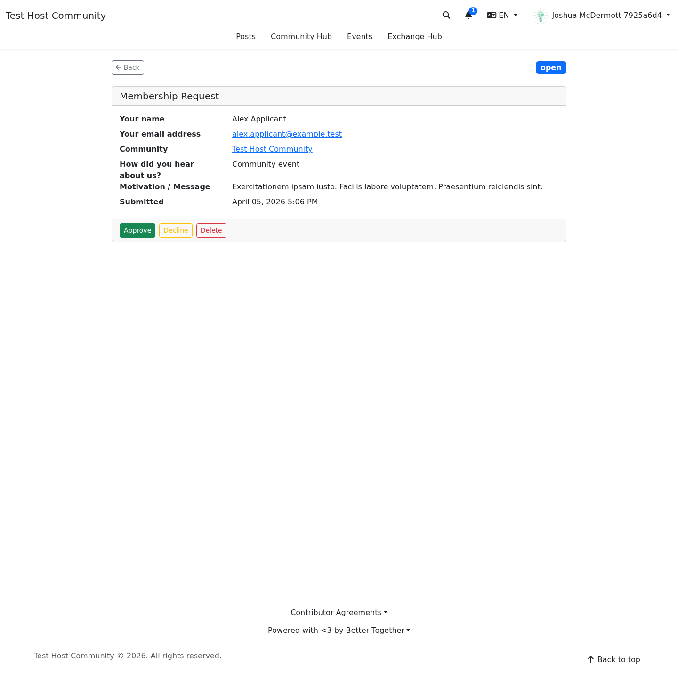
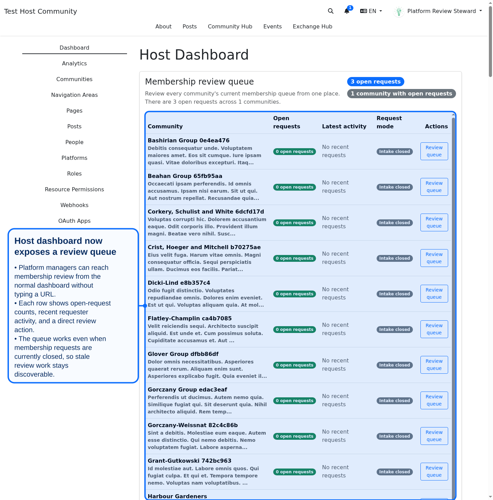
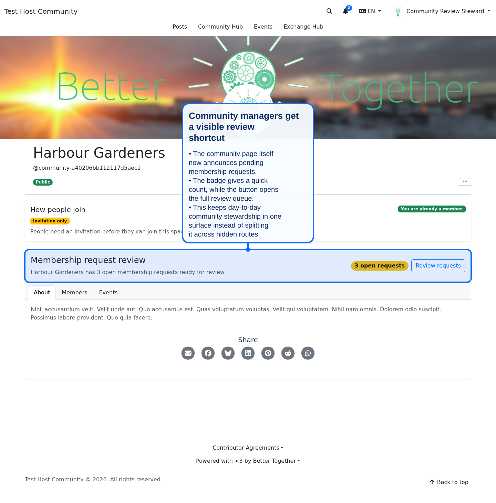
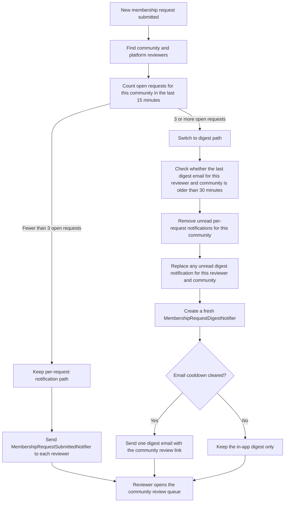

# Membership Request Workflow

## Overview

Community membership requests provide a bounded alternative to direct invitations on invitation-only platforms. When enabled at the **platform** level for the host community, or at the **community** level for an individual community, visitors can discover and submit a request without needing an invitation code first.

The request stays community-scoped:

- visitors submit a request to a specific community
- community reviewers manage the queue
- approval creates either a direct membership or a follow-up invitation, depending on whether the requester already has an account

## Visual Flow

**Diagram Files:**
- [Mermaid Source](../../diagrams/source/membership_request_workflow.mmd)
- [PNG Export](../../diagrams/exports/png/membership_request_workflow.png)
- [SVG Export](../../diagrams/exports/svg/membership_request_workflow.svg)

## Enablement Rules

- **Platform toggle**: `Platform#allow_membership_requests` enables the membership-request entry point for the host platform's primary community.
- **Community toggle**: `Community#allow_membership_requests` enables intake for that specific community.
- **Effective rule**: intake is enabled when either the community allows requests directly or its primary platform allows requests for the host-community path.
- **Registration discoverability**: the sign-up interstitial only renders the request form when the platform still requires invitations and a valid invitation is not already present.

## Backend Workflow

1. A visitor submits `Joatu::MembershipRequest` for a community.
2. The request appears in the community membership request queue.
3. A reviewer approves or declines it.
4. Approval branches:
   - **unauthenticated visitor**: create a `CommunityInvitation`
   - **authenticated requester**: create a `PersonCommunityMembership`
5. Decline closes the request without broadening access.

## Review UI

### Registration interstitial with request form

### Membership request review queue

### Membership request review detail

Mobile captures are generated alongside the desktop variants in `docs/screenshots/mobile/`.

## Review entry points added by the remediation pass

The original `0.11.0` workflow added the request queue and detail view, but the later remediation work made those review surfaces easier to find from normal stewardship screens.

### Host dashboard review queue

- platform managers can now reach membership review from the host dashboard
- the queue summarizes open-request counts, recent requester activity, and a direct review action
- this closes the “known URL only” gap that left review work hard to discover

### Community page review shortcut

- community managers now get a reviewer-only panel on the community page itself
- the panel shows the open-request count and links directly to the review queue
- this keeps request handling connected to the community-management surface people already use

## Reviewer notification digest behavior

The remediation also changed reviewer notifications so repeated request bursts do not pile up as one notification per request forever.

**Diagram files:**
- [Mermaid Source](../../diagrams/source/membership_review_notification_digest_flow.mmd)
- [PNG Export](../../diagrams/exports/png/membership_review_notification_digest_flow.png)
- [SVG Export](../../diagrams/exports/svg/membership_review_notification_digest_flow.svg)

### What the digest flow changes

1. Individual notifications are still used for small volumes of requests.
2. Once a community accumulates **3 or more** open requests inside a **15 minute** window, unread per-request notifications are collapsed into one digest per reviewer.
3. Digest emails are rate-limited so the same reviewer does not receive a new digest email for the same community more often than every **30 minutes**.
4. The digest keeps the same review destination: the community membership review queue.

## Privacy and Authorization Boundaries

- public visitors may only **create** requests when the target community intake is enabled
- request review remains a privileged community-management workflow
- the registration page does not expose general admin tooling, only the bounded request form
- approval expands access through the normal invitation or membership pipeline rather than bypassing it
