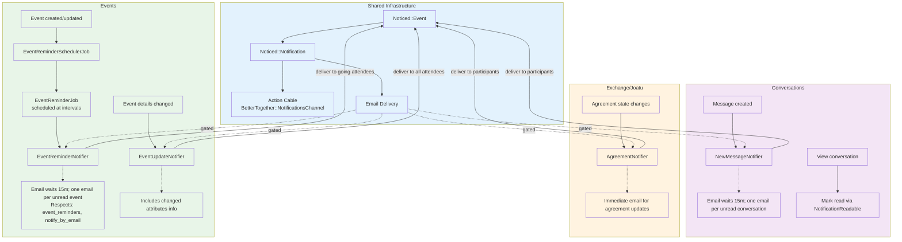

# Notifications System Overview

This document explains how notifications are produced, delivered, deduplicated, and marked as read across the app. The system uses the Noticed gem with Action Cable and email channels.

## Process Flow Diagram

**Diagram Files:**
- 📊 [Mermaid Source](../../diagrams/source/notifications_flow.mmd) - Editable source
- 🖼️ [PNG Export](../../diagrams/exports/png/notifications_flow.png) - High-resolution image
- 🎯 [SVG Export](../../diagrams/exports/svg/notifications_flow.svg) - Vector graphics

## Building Blocks

- Event: `Noticed::Event` rows store the notification payload, including `record_id`, `record_type`, and JSON `params` (often referencing related records by GlobalID).
- Notification: `Noticed::Notification` rows join an Event to a `recipient` (a `BetterTogether::Person`) and track `read_at`/`seen_at` timestamps.
- Delivery channels:
  - Action Cable: via `BetterTogether::NotificationsChannel`, pushing `{ title, body, url, unread_count }`.
  - Email: via specific mailers; some notifiers gate emails with user preferences and/or dedupe logic.

## Notifier Inventory & Triggers

- NewMessageNotifier (`app/notifiers/better_together/new_message_notifier.rb`)
  - Trigger: when a message is created in `MessagesController#create`.
  - Recipients: all conversation participants except the sender.
  - Delivery: Action Cable immediately; Email deferred (`wait 15.minutes`) and only if `send_email_notification?`.
  - Email dedupe grouping: sends at most one email per unread conversation per recipient (but allows multiple on-site notifications).

- Joatu::MatchNotifier (`app/notifiers/better_together/joatu/match_notifier.rb`)
  - Triggers:
    - After creating an Offer/Request: `BetterTogether::Joatu::Exchange#notify_matches` dispatches to both creators for each match.
    - After creating a ResponseLink: `BetterTogether::Joatu::ResponseLink#notify_match` dispatches for direct Offer→Request or Request→Offer responses (symmetric).
  - Recipients: Both creators for automatic matches; source creator for direct responses.
  - Delivery: Action Cable + Email (if recipient has email and allows email).
  - Dedupe: Prevents creating a second unread notification for the same Offer/Request pair and recipient (custom `deliver` override + `should_notify?`).

- Joatu::AgreementNotifier (`app/notifiers/better_together/joatu/agreement_notifier.rb`)
  - Trigger: Agreement creation (`after_create_commit`).
  - Recipients: Offer and Request creators.
  - Delivery: Action Cable + Email (subject to recipient `notification_preferences`).

- Joatu::AgreementStatusNotifier (`app/notifiers/better_together/joatu/agreement_status_notifier.rb`)
  - Trigger: Agreement status change (`after_update_commit` when `status` changed).
  - Recipients: Offer and Request creators.
  - Delivery: Action Cable + Email (subject to recipient `notification_preferences`).

- PageAuthorshipNotifier (`app/notifiers/better_together/page_authorship_notifier.rb`)
  - Trigger: author added/removed on a Page (via `BetterTogether::Authorship`).
  - Recipients: all current page authors.
  - Delivery: Action Cable immediately; Email deferred (`wait 15.minutes`) and only if `send_email_notification?`.
  - Email dedupe grouping: one email per unread page per recipient (on-site notifications may still accumulate).

- EventReminderNotifier (`app/events/better_together/event_reminder_notifier.rb`)
  - Trigger: `EventReminderJob` execution 1 hour before event start time (scheduled by `EventReminderSchedulerJob`).
  - Recipients: Event creator and interested community members.
  - Delivery: Action Cable immediately; Email deferred and only if `send_email_notification?`.
  - Email content: Localized event details, start time, location, and community context.
  - Delivery: Action Cable immediately; Email deferred (`wait 15.minutes`) and only if `send_email_notification?`.
  - Email dedupe grouping: one email per unread page per recipient (on-site notifications may still accumulate).

## Marking Notifications as Read

- Concern: `BetterTogether::NotificationReadable` (`app/controllers/concerns/better_together/notification_readable.rb`)
  - `mark_notifications_read_for_record(record)`: generic record-based read marker using `noticed_events.record_id`.
  - `mark_notifications_read_for_event_records(event_class, record_ids)`: batch mark for a specific Noticed event type and list of record IDs.
  - `mark_match_notifications_read_for(record)`: efficiently marks unread `MatchNotifier` notifications for an Offer/Request by matching the record’s GlobalID in `params`.
- Usage:
  - Joatu controllers include the concern and mark `MatchNotifier` read on Offer/Request show; mark Agreement-related notifications read on Agreement show.
  - ConversationsController uses the concern to mark `NewMessageNotifier` notifications read when viewing a conversation with messages.
  - EventsController uses the concern to mark `EventReminderNotifier` notifications read when viewing event details.
  - NotificationsController uses the concern for record-based marking.

## Event Notifications

### EventReminderNotifier
- Notifier Class: `BetterTogether::EventReminderNotifier` (Noticed event in `app/events/better_together/event_reminder_notifier.rb`)
- Purpose: Send event reminders to interested participants
- Trigger: `EventReminderJob` executes 1 hour before event start_time for events with notifications enabled
- Recipients: Event creator and any interested members (those who've shown interest in the event)
- Record: BetterTogether::Event being reminded about
- Params: `{ event: <Event instance>, host_community: <Community instance> }`

### Event Email System
- Mailer: EventMailer (`app/mailers/better_together/event_mailer.rb`)
- Template: `event_reminder.html.erb` (I18n localized subject and body)
- Email Logic:
  - Check `recipient.send_email_notification?` preference
  - Use recipient's preferred locale for rendering
  - Subject/body from I18n keys: `better_together.event_mailer.event_reminder.subject`/`.body`
  - Include event title, start time (localized), location, and community context
  - Handle unread notification count in message
- Delivery: Action Cable immediately; Email deferred and only if email notifications enabled
- Email batching: Multiple events can trigger separate notifications (no artificial grouping)

### Event Reminder Scheduling
- Background Job: `EventReminderSchedulerJob` (runs periodically via cron/scheduler)
- Purpose: Schedule `EventReminderJob` instances for upcoming events
- Logic: Query events with notifications enabled that start in ~1 hour, schedule individual reminder jobs
- Queue: `:notifications` with retry configuration
- Error Handling: Individual event reminder failures don't affect batch processing

### Event Notification Integration
- Triggers: 
  - Event creation with notifications enabled: schedule future reminder
  - Event update: reschedule reminder if start_time changes
  - Event deletion: cancel pending reminder jobs
- Action Cable: Real-time notifications via `BetterTogether::NotificationsChannel`
- Read Marking: Event-specific notifications marked read when viewing event details

### Event Anti-Spam Measures
- One reminder per event per recipient (no duplicate scheduling)
- Only events with explicitly enabled notifications trigger reminders
- Respects user email preferences (`send_email_notification?`)
- Failed reminders logged but don't retry indefinitely
- Reminder scheduling only occurs for future events (past events ignored)

## Recipient Preferences & Email

- Email delivery is gated:
  - EventReminderNotifier: `recipient.send_email_notification?` must be true for email delivery
  - NewMessageNotifier and PageAuthorshipNotifier: `recipient.notify_by_email` must be true, and an internal `should_send_email?` ensures one email per unread conversation/page.
  - AgreementNotifier and AgreementStatusNotifier: `recipient.notification_preferences['notify_by_email']` (and presence of email) must be true.
  - MatchNotifier: `recipient_has_email?` checks email and preferences.

## Data & Integrity

- Noticed tables: `noticed_events` (indexed by `record_type, record_id`), `noticed_notifications` (indexed by `event_id`, `recipient`).
- Exchange dedupe: MatchNotifier prevents duplicate unread notifications for the same Offer/Request pair per recipient.
- Agreements consistency: accepted/rejected transitions guarded; unique constraints ensure one Agreement per Offer/Request pair and at most one accepted per side.

## Known Behaviors / Considerations

- NewMessage/PageAuthorship email dedupe does not dedupe on-site notifications; MatchNotifier dedupes on-site notifications as well (preventing duplicate unread for the pair).
- EventReminderNotifier sends one notification per event per recipient; scheduling prevents duplicate reminders for the same event.
- Event reminders are only sent for events with notifications explicitly enabled and future start times.
- Unread count included in Action Cable payload is computed per-recipient at send time.
- JSONB params store reference GlobalIDs for Offer/Request; read markers account for both direct string and ActiveJob `_aj_globalid` formats.

## Opportunities for Improvement

- Consider adding on-site dedupe/grouping to NewMessage/PageAuthorship similar to MatchNotifier if desired.
- Aggregate match notifications when many pairs are found at once.
- Add per-notifier throttling windows (e.g., rate limit bursty events via job scheduling).
- Event reminders could be enhanced with configurable timing (currently fixed at 1 hour before).

