# Safety and Federation Review Workflow

## Overview

Community Engine now exposes the two review surfaces introduced during the `0.11.0` rollout through stable operator entry points and a shared digest-style notification contract.

- **Safety review** now has two discoverable operator paths: the host platform profile Safety tab and the host dashboard safety review queue for reviewers who also have dashboard access.
- **Federation review** now has a host-dashboard queue for operators who already have both host-dashboard access and network-connection authority, while approval-only network stewards still act from the platform profile, platform-connections index, and direct notifications.

## Clearly labeled review-and-notification diagram

```mermaid
flowchart TB
  subgraph SAFETY["Safety review operations"]
    SR1["Reporter submits a safety report"]
    SR2["Report creates or updates an open safety case"]
    SR3["Safety reviewers with manage_platform_safety are resolved on the host platform"]
    SR4{"3+ open reports in 15 minutes?"}
    SR5["Send immediate safety review notification"]
    SR6["Collapse burst into one safety digest notification"]
    SR7["Cooldown suppresses duplicate digests for 30 minutes"]
    SR8["Reviewer opens host platform Safety tab or the safety-case queue"]
    SR1 --> SR2 --> SR3 --> SR4
    SR4 -->|No| SR5 --> SR8
    SR4 -->|Yes| SR6 --> SR7 --> SR8
  end

  subgraph FEDERATION["Federation review operations"]
    FR1["Operator creates a pending platform connection or changes its state"]
    FR2["Network stewards with manage or approve connection authority are resolved"]
    FR3{"3+ pending connections in 15 minutes?"}
    FR4["Send immediate pending-connection notification"]
    FR5["Collapse burst into one federation digest notification"]
    FR6["Active, suspended, and blocked transitions send status notifications"]
    FR7["Operator opens the host dashboard federation queue or the platform-connections index"]
    FR1 --> FR2 --> FR3
    FR3 -->|No| FR4 --> FR7
    FR3 -->|Yes| FR5 --> FR7
    FR1 --> FR6 --> FR7
  end
```

**Diagram files**

- [Mermaid Source](../../diagrams/source/safety_and_federation_review_operations.mmd)
- [PNG Export](../../diagrams/exports/png/safety_and_federation_review_operations.png)
- [SVG Export](../../diagrams/exports/svg/safety_and_federation_review_operations.svg)

## Reviewer entry points

### Safety reviewers

Safety reviewers should not need a direct URL to discover their work.

Safety review now has two complementary reviewer surfaces:

1. the **host platform profile Safety tab**
2. the **host dashboard safety review queue**

Together they summarize:

- open cases
- urgent cases
- unassigned cases
- participant-visible updates
- direct links to the safety-case queue and submitted reports

**Screenshot artifacts**

- `docs/screenshots/desktop/safety_review_host_platform_panel.png`
- `docs/screenshots/mobile/safety_review_host_platform_panel.png`
- `docs/screenshots/desktop/safety_review_host_dashboard_queue.png`
- `docs/screenshots/mobile/safety_review_host_dashboard_queue.png`

### Federation operators and network stewards

Federation review now has two complementary entry points:

1. **Host dashboard federation review queue** for operators who already have host-dashboard access and explicit network-connection authority.
2. **Platform connections index and platform profile Federation tab** for broader connection review, approval, and state changes.

The dashboard queue is intentionally summary-oriented. It exposes:

- connected platform name
- incoming/outgoing direction relative to the host platform
- connection kind
- current status
- latest activity timestamp
- direct link into the connection record

**Screenshot artifacts**

- `docs/screenshots/desktop/federation_review_host_dashboard_queue.png`
- `docs/screenshots/mobile/federation_review_host_dashboard_queue.png`
- `docs/screenshots/desktop/release_0_11_0_platform_connections_index.png`
- `docs/screenshots/mobile/release_0_11_0_platform_connections_index.png`

## Notification and digest contract

Safety and federation review now follow the same operator-facing delivery pattern:

1. low-volume events send an immediate in-app notification
2. bursts collapse into a single digest when the same review surface receives **3 or more** items inside **15 minutes**
3. duplicate unread notifications are removed before the digest is sent
4. digest delivery is suppressed for **30 minutes** after a matching digest so reviewers do not receive repeated bursts for the same queue

The content of the notices stays intentionally operational:

- safety notices avoid broad detail disclosure and point reviewers to the safety-case workspace
- federation notices point network stewards to the platform-connections queue and connection records

## Related docs

- [Security & Protection System](./security_protection_system.md)
- [Federation Privacy and Consent](../../platform_organizers/federation_privacy_and_consent.md)
- [Membership Request Workflow](./membership_request_workflow.md)
