# Better Together Security & Protection System

## Overview

The Better Together Community Engine implements a comprehensive, multi-layered security system designed to protect community platforms against common web application threats, data breaches, and malicious attacks. The system combines **authentication**, **authorization**, **encryption**, **rate limiting**, **input validation**, and **secure communications** to create a robust defense-in-depth security posture.

## Process Flow Diagram

```mermaid
flowchart TD
    %% Security & Protection System Process Flow
    %% Better Together Community Engine Rails

    START[Incoming Request] --> BOT_CHECK{Bot Detection}
    
    %% Bot and Attack Detection Layer
    BOT_CHECK -->|Legitimate Request| RATE_LIMIT[Rack::Attack Rate Check]
    BOT_CHECK -->|Suspicious Bot| BOT_BLOCK[Block Request - 503]
    
    %% Rate Limiting & Attack Prevention
    RATE_LIMIT --> IP_THROTTLE{IP Rate Check 300/5min}
    IP_THROTTLE -->|Within Limits| PATH_CHECK[Request Path Analysis]
    IP_THROTTLE -->|Rate Exceeded| RATE_BLOCK[Rate Limit Block - 503]
    
    PATH_CHECK --> PHP_CHECK{PHP File Request?}
    PHP_CHECK -->|Yes| PHP_BLOCK[Block PHP Request - 503]
    PHP_CHECK -->|No| ATTACK_PATTERN[Attack Pattern Check]
    
    ATTACK_PATTERN --> EXPLOIT_CHECK{Exploit Pattern?}
    EXPLOIT_CHECK -->|Detected| FAIL2BAN[Fail2Ban Progressive Block]
    EXPLOIT_CHECK -->|Clean| SSL_CHECK[SSL/TLS Validation]
    
    %% SSL/TLS and Transport Security
    SSL_CHECK --> HTTPS_FORCE{Force SSL Enabled?}
    HTTPS_FORCE -->|Yes, HTTP| SSL_REDIRECT[Redirect to HTTPS]
    HTTPS_FORCE -->|HTTPS or Disabled| SECURE_HEADERS[Set Security Headers]
    
    SECURE_HEADERS --> HSTS[HTTP Strict Transport Security]
    HSTS --> CSP_HEADERS[Content Security Policy Headers]
    CSP_HEADERS --> XSS_PROTECTION[X-XSS-Protection Headers]
    
    %% Authentication Layer
    XSS_PROTECTION --> AUTH_CHECK{Authentication Required?}
    AUTH_CHECK -->|Yes| DEVISE_AUTH[Devise Authentication]
    AUTH_CHECK -->|No| PROCEED[Continue to Authorization]
    
    DEVISE_AUTH --> SESSION_CHECK{Valid Session?}
    SESSION_CHECK -->|No| LOGIN_REDIRECT[Redirect to Login]
    SESSION_CHECK -->|Yes| MFA_CHECK{2FA Enabled?}
    
    MFA_CHECK -->|Yes| TOTP_VERIFY[TOTP Token Verification]
    MFA_CHECK -->|No| PROCEED
    TOTP_VERIFY -->|Invalid| MFA_FAIL[2FA Failure - Block]
    TOTP_VERIFY -->|Valid| PROCEED
    
    %% Authorization Layer
    PROCEED --> PUNDIT_AUTH[Pundit Authorization Check]
    PUNDIT_AUTH --> ROLE_CHECK{Role-Based Permissions}
    ROLE_CHECK -->|Authorized| DATA_ACCESS[Access Granted]
    ROLE_CHECK -->|Unauthorized| ACCESS_DENY[Access Denied - 403]
    
    %% Data Protection Layer
    DATA_ACCESS --> ENCRYPT_CHECK{Sensitive Data?}
    ENCRYPT_CHECK -->|Yes| AR_ENCRYPT[Active Record Encryption]
    ENCRYPT_CHECK -->|No| VALIDATION[Input Validation]
    
    AR_ENCRYPT --> DB_ENCRYPT[Database Field Encryption]
    DB_ENCRYPT --> VALIDATION
    
    %% Input Validation & Output Protection
    VALIDATION --> PARAM_CHECK[Strong Parameters Validation]
    PARAM_CHECK --> XSS_FILTER[XSS Content Filtering]
    XSS_FILTER --> SQL_PROTECT[SQL Injection Protection]
    
    SQL_PROTECT --> SAFE_RENDER{Rendering Content?}
    SAFE_RENDER -->|Yes| HTML_SANITIZE[HTML Sanitization]
    SAFE_RENDER -->|No| RESPONSE[Generate Response]
    
    HTML_SANITIZE --> CONTENT_POLICY[Content Security Policy Enforcement]
    CONTENT_POLICY --> RESPONSE
    
    %% Response Security
    RESPONSE --> SECURE_RESPONSE[Apply Security Headers]
    SECURE_RESPONSE --> CACHE_CONTROL[Cache Control Headers]
    CACHE_CONTROL --> FINAL_RESPONSE[Return Secure Response]
    
    %% Error Handling
    BOT_BLOCK --> ERROR_LOG[Security Log Entry]
    RATE_BLOCK --> ERROR_LOG
    PHP_BLOCK --> ERROR_LOG
    FAIL2BAN --> ERROR_LOG
    MFA_FAIL --> ERROR_LOG
    ACCESS_DENY --> ERROR_LOG
    
    ERROR_LOG --> MONITORING[Security Monitoring Alert]
    MONITORING --> INCIDENT_RESPONSE[Incident Response Protocol]

    %% Styling
    classDef protection fill:#ffebee
    classDef transport fill:#e8f5e8
    classDef auth fill:#e3f2fd
    classDef authz fill:#f3e5f5
    classDef data fill:#fff3e0
    classDef validation fill:#f1f8e9
    classDef response fill:#fafafa
    classDef error fill:#ffe0b2

    class START,BOT_CHECK,RATE_LIMIT,IP_THROTTLE,PATH_CHECK,PHP_CHECK,ATTACK_PATTERN,EXPLOIT_CHECK,BOT_BLOCK,RATE_BLOCK,PHP_BLOCK,FAIL2BAN protection
    class SSL_CHECK,HTTPS_FORCE,SSL_REDIRECT,SECURE_HEADERS,HSTS,CSP_HEADERS,XSS_PROTECTION transport
    class AUTH_CHECK,DEVISE_AUTH,SESSION_CHECK,LOGIN_REDIRECT,MFA_CHECK,TOTP_VERIFY,MFA_FAIL auth
    class PROCEED,PUNDIT_AUTH,ROLE_CHECK,DATA_ACCESS,ACCESS_DENY authz
    class ENCRYPT_CHECK,AR_ENCRYPT,DB_ENCRYPT data
    class VALIDATION,PARAM_CHECK,XSS_FILTER,SQL_PROTECT,SAFE_RENDER,HTML_SANITIZE,CONTENT_POLICY validation
    class RESPONSE,SECURE_RESPONSE,CACHE_CONTROL,FINAL_RESPONSE response
    class ERROR_LOG,MONITORING,INCIDENT_RESPONSE error
```



**Diagram Files:**
- 📊 [Mermaid Source](../../diagrams/source/security_protection_flow.mmd) - Editable source
- 🖼️ [PNG Export](../../diagrams/exports/png/security_protection_flow.png) - High-resolution image
- 🎯 [SVG Export](../../diagrams/exports/svg/security_protection_flow.svg) - Vector graphics

## Architecture Components

### 1. Authentication & Session Security

#### Devise Authentication Framework
- **Configuration**: `config/initializers/devise.rb`
- **Secret Management**: Environment-based secret keys with fallback to Rails credentials
- **Paranoid Mode**: Enabled to prevent user enumeration attacks
- **Password Security**: bcrypt with configurable stretching (1 for tests, 12 for production)
- **Email Security**: Case-insensitive keys, whitespace stripping, email validation

```ruby
# Core security configurations
config.secret_key = ENV.fetch('DEVISE_SECRET') { Rails.application.credentials.secret_key_base }
config.pepper = ENV.fetch('DEVISE_PEPPER', nil)
config.paranoid = true  # Prevents user enumeration attacks
config.stretches = Rails.env.test? ? 1 : 12  # bcrypt cost factor
```

#### Session Management
- **Session Store**: Cookie-based sessions with secure configurations
- **Production Security**: `secure: Rails.env.production?` for HTTPS-only cookies
- **Session Keys**: Environment-specific session key naming
- **CSRF Protection**: Full Rails CSRF token validation enabled

```ruby
# Production session configuration
config.session_store :cookie_store, 
                     key: '_better_together_session', 
                     secure: Rails.env.production?
```

#### Password Security
- **Notification System**: Email notifications for password changes and email modifications
- **Confirmation Workflows**: Configurable account confirmation periods
- **Reset Security**: Secure password reset token generation and expiration
- **Lockout Protection**: Account lockout after failed authentication attempts

### 2. Authorization & Access Control

#### Pundit Policy Framework
- **Policy-Based Authorization**: Comprehensive Pundit policy system
- **Base Policy**: `ApplicationPolicy` with deny-by-default approach
- **Resource-Specific Policies**: Individual policies per model (User, Page, Event, etc.)
- **Scope-Based Access**: Policy scopes for collection filtering
- **Context-Aware Authorization**: User, agent (person), and record context in policies

```ruby
class ApplicationPolicy
  def initialize(user, record)
    @user = user
    @agent = user&.person
    @record = record
  end

  # Default deny-all approach
  def index?; false; end
  def show?; false; end
  def create?; false; end
  def update?; false; end
  def destroy?; false; end
end
```

#### Controller Authorization
- **Automatic Verification**: `after_action :verify_authorized` in controllers
- **Resource Authorization**: Pre-action authorization checks
- **Exception Handling**: Graceful handling of `Pundit::NotAuthorizedError`
- **API Security**: JSON API integration with Pundit error handling

#### Role-Based Access Control (RBAC)
- **Member Permissions**: Cached role and permission checking system
- **Resource Permissions**: Granular resource-specific permissions
- **Platform Roles**: Platform manager roles with elevated permissions
- **Permission Caching**: 12-hour cache for authorization decisions

### 3. Data Encryption & Privacy

#### Active Record Encryption
- **Encrypted Models**: Message content, conversation titles, platform invitations
- **Deterministic Encryption**: Searchable encrypted fields where needed
- **Rich Text Encryption**: Action Text content encrypted at rest
- **Migration Support**: Graceful handling of unencrypted legacy data

```ruby
# Message encryption example
class Message < ApplicationRecord
  has_rich_text :content, encrypted: true
end

class Conversation < ApplicationRecord
  encrypts :title, deterministic: true  # Allows searching
end
```

#### Encryption Configuration
- **Rails Master Key**: Environment-based encryption key management
- **Production Settings**: `support_unencrypted_data` for gradual migration
- **Extended Queries**: `extend_queries` for encrypted field querying
- **Key Derivation**: Secure key derivation for encryption operations

```ruby
# Production encryption settings
config.active_record.encryption.support_unencrypted_data = true
config.active_record.encryption.extend_queries = true
```

### 4. Network Security & Rate Limiting

#### Rack::Attack Protection
- **Configuration**: `config/initializers/rack_attack.rb`
- **Redis Backend**: Distributed rate limiting across application instances
- **Multi-Layer Protection**: IP-based, endpoint-specific, and user-specific limits
- **Attack Detection**: Automated blocking of suspicious activity patterns

**Rate Limiting Rules:**
- **General Requests**: 300 requests per 5 minutes per IP
- **Authentication**: 5 login attempts per 20 seconds per IP
- **Account-Specific**: 5 login attempts per 20 seconds per email
- **Fail2Ban**: Progressive blocking for repeated violations

```ruby
# Request throttling configuration
throttle('req/ip', limit: 300, period: 5.minutes, &:ip)

# Authentication protection  
throttle('logins/ip', limit: 5, period: 20.seconds) do |req|
  req.ip if req.path.include?('/users/sign-in') && req.post?
end
```

#### Attack Prevention
- **PHP File Blocking**: Automatic blocking of .php file requests
- **WordPress Protection**: Detection and blocking of WordPress-specific attack patterns
- **Penetration Testing Detection**: `/etc/passwd` and common exploit pattern detection
- **Progressive Blocking**: Fail2Ban-style escalating blocks (3 attempts, 10-minute window, 5-minute ban)

#### Monitoring Safelist
- **Uptime Monitoring**: Whitelisted monitoring service user agents
- **Health Checks**: Platform health monitoring without rate limiting
- **User Agent Validation**: Specific monitoring bot allowlists

### 5. Transport Security & HTTPS

#### SSL/TLS Configuration  
- **Force SSL**: Environment-configurable HTTPS enforcement (`FORCE_SSL`)
- **SSL Assumption**: Reverse proxy SSL termination support (`ASSUME_SSL`)
- **Secure Cookies**: Production-only secure cookie flags
- **HSTS Headers**: HTTP Strict Transport Security for browser enforcement

```ruby
# Production SSL configuration
config.force_ssl = ENV.fetch('FORCE_SSL', false)
config.assume_ssl = ENV.fetch('ASSUME_SSL', false)
```

#### Email Security
- **SMTP TLS**: Configurable TLS encryption for email delivery
- **SSL Verification**: OpenSSL certificate verification options
- **STARTTLS Support**: Opportunistic encryption for email connections
- **Certificate Validation**: Configurable SSL certificate verification modes

### 6. Input Validation & XSS Protection

#### CSRF Protection
- **Rails CSRF**: `protect_from_forgery with: :exception`
- **Token Management**: Automatic CSRF token generation and validation
- **AJAX Support**: CSRF token handling for dynamic requests
- **Clean-up Strategy**: Devise CSRF token cleanup on authentication

#### Content Security Policy (CSP)
- **Header Configuration**: `config/initializers/content_security_policy.rb`
- **Nonce Generation**: Session-based nonce generation for inline scripts
- **Import Map Integration**: Secure JavaScript module loading
- **Development Overrides**: Hot-reload support without compromising security

```ruby
# CSP nonce generation
config.content_security_policy_nonce_generator = ->(request) { 
  request.session.id.to_s 
}
config.content_security_policy_nonce_directives = %w(script-src)
```

#### HTML Sanitization
- **Action Text Integration**: Automatic HTML sanitization for rich text content
- **Allow-lists**: Strict HTML tag and attribute allow-lists
- **XSS Prevention**: Rails auto-escaping throughout view templates
- **External Link Processing**: Automatic external link icon addition with security headers

### 7. Privacy & Platform Security

#### Platform Access Control
- **Privacy Levels**: Public vs. private platform configurations
- **Invitation System**: Token-based platform access for private instances
- **Session Validation**: Invitation token validation and expiration
- **Redirect Protection**: Secure redirection for unauthorized access attempts

```ruby
def check_platform_privacy
  return if helpers.host_platform.privacy_public?
  return if current_user
  return unless BetterTogether.user_class.any?
  return if valid_platform_invitation_token_present?

  flash[:error] = I18n.t('globals.platform_not_public')
  redirect_to new_user_session_path(locale: I18n.locale)
end
```

#### Data Access Controls
- **Conversation Security**: Message encryption with participant-only access
- **Profile Privacy**: User profile visibility controls
- **Content Authorization**: Page and post visibility based on publication status
- **Search Filtering**: Authorization-aware search result filtering

### 8. API Security

#### JSON API Protection
- **CSRF Handling**: Conditional CSRF protection for JSON requests
- **Authentication**: API-specific authentication strategies
- **Authorization Integration**: Pundit policy enforcement for API endpoints
- **Error Handling**: Secure error responses without information disclosure

```ruby
class ApiController < ApplicationController
  protect_from_forgery with: :exception, unless: -> { request.format.json? }
end
```

#### Rate Limiting
- **API-Specific Limits**: Separate rate limits for API endpoints
- **Authentication Limits**: Stricter limits for authentication endpoints
- **Resource Protection**: Per-resource rate limiting for expensive operations

### 9. Background Job Security

#### Sidekiq Security
- **Redis Authentication**: Secure Redis connection configuration
- **Queue Isolation**: Namespace-based queue separation
- **Job Authentication**: Worker-level authentication and authorization
- **Error Handling**: Secure error logging without sensitive data exposure

#### Sensitive Data Processing
- **Encrypted Queues**: Encryption for sensitive job parameters
- **Temporary Storage**: Secure handling of temporary sensitive data
- **Log Scrubbing**: Automatic removal of sensitive data from job logs

### 10. Monitoring & Incident Response

#### Security Monitoring
- **Attack Detection**: Real-time monitoring of Rack::Attack blocks
- **Authentication Monitoring**: Failed login attempt tracking
- **Access Pattern Analysis**: Unusual access pattern detection
- **Performance Impact**: Security measure performance monitoring

#### Logging & Auditing
- **Security Events**: Comprehensive logging of security-related events
- **User Activity**: Audit trails for sensitive user actions
- **System Access**: Administrative action logging
- **Data Scrubbing**: Sensitive parameter scrubbing in logs

#### Brakeman Security Analysis
- **Automated Scanning**: `bundle exec brakeman --quiet --no-pager`
- **High-Confidence Fixes**: Immediate remediation of high-confidence vulnerabilities
- **Continuous Integration**: Pre-deployment security scanning
- **Vulnerability Tracking**: Systematic tracking and resolution of security issues

### 11. Development Security

#### Secure Development Practices
- **Code Review Requirements**: Security-focused code review processes
- **Static Analysis**: Brakeman integration in development workflow
- **Dependency Management**: Regular security updates for gems and dependencies
- **Environment Isolation**: Separate security configurations per environment

#### Security Testing
- **Penetration Testing**: Regular security assessment procedures
- **Vulnerability Scanning**: Automated vulnerability detection
- **Security Regression Testing**: Preventing security feature regressions
- **Threat Modeling**: Systematic threat analysis for new features

### 12. Infrastructure Security

#### Deployment Security
- **Environment Variables**: Secure secret management via environment variables
- **Docker Security**: Container-based deployment with security hardening
- **Reverse Proxy**: Nginx/Apache security configuration
- **Database Security**: PostgreSQL security hardening and encryption

#### Backup Security
- **Encrypted Backups**: Database backup encryption
- **Access Controls**: Backup access restriction and audit trails
- **Recovery Procedures**: Secure data recovery processes
- **Retention Policies**: Secure data retention and disposal

#### Cloudflare Integration
- **DDoS Protection**: Cloudflare-based DDoS mitigation
- **WAF Rules**: Web Application Firewall configuration
- **SSL Certificates**: Automated SSL certificate management
- **DNS Security**: Secure DNS configuration and DNSSEC

### 13. Compliance & Privacy Regulations

#### Data Protection
- **GDPR Compliance**: European data protection regulation compliance
- **Data Minimization**: Collection and processing only necessary data
- **Right to Erasure**: Data deletion and anonymization procedures
- **Consent Management**: User consent tracking and management

#### Privacy Controls
- **Data Portability**: User data export capabilities
- **Access Controls**: User data access and modification controls
- **Retention Policies**: Automatic data purging and archival
- **Third-Party Integration**: Privacy-aware third-party service integration

## Security Configuration Checklist

### Production Deployment Security
**Essential Security Configurations:**
- ✅ **SSL/TLS**: `force_ssl = true` with valid SSL certificates
- ✅ **Secure Cookies**: `secure: true` for production cookie configuration
- ✅ **CSRF Protection**: Full Rails CSRF protection enabled
- ✅ **Rate Limiting**: Rack::Attack configured with Redis backend
- ✅ **Authentication**: Devise with bcrypt and proper stretching factors
- ✅ **Authorization**: Pundit policies for all resources
- ✅ **Encryption**: Active Record Encryption for sensitive data
- ✅ **CSP Headers**: Content Security Policy with nonce generation
- ✅ **Security Monitoring**: Comprehensive logging and alerting
- ✅ **Environment Isolation**: Separate configurations per environment

### Security Incident Response
**Response Procedures:**
- ✅ **Detection**: Automated monitoring and alerting systems
- ✅ **Assessment**: Rapid security incident assessment protocols
- ✅ **Containment**: Emergency response procedures for security breaches
- ✅ **Recovery**: Secure system restoration and data recovery procedures
- ✅ **Communication**: Security incident communication protocols
- ✅ **Post-Incident**: Security incident post-mortem and improvement processes

## Process Flow Summary

The security system operates through several interconnected protection layers:

1. **Request Processing**: Rate limiting → SSL termination → CSRF validation → Authentication check → Authorization verification
2. **Data Protection**: Input validation → XSS prevention → Data encryption → Secure storage → Audit logging
3. **Access Control**: Authentication → Role verification → Resource authorization → Policy enforcement → Permission caching
4. **Attack Prevention**: Bot detection → Rate limiting → Attack pattern recognition → Progressive blocking → Incident response
5. **Privacy Protection**: Data encryption → Access controls → Audit trails → Compliance monitoring → Privacy rights enforcement

This comprehensive security system ensures that Better Together applications can safely handle sensitive community data while protecting against modern web application threats, maintaining user privacy, and meeting regulatory compliance requirements. The defense-in-depth approach provides multiple security layers, ensuring that if one layer is compromised, others continue to protect the application and its users.
