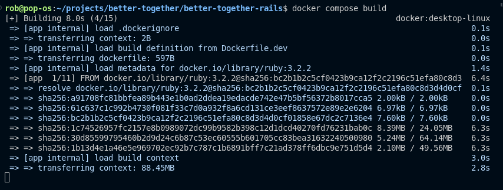

# Development Setup

The Commuity Engine is a Ruby on Rails Engine that provides turnkey community features for your application so you can focus on building your business logic.

It uses Docker and Docker Compose to build and provision the dependency containers.

This app depends on the following core containers/services:

- **app:** This app running the Community Engine
- **sidekiq:** An instance of this app to run and manage background jobs
- **db:** A PostgreSQL database with the PostGIS extension to work with geospatial data accessed by the app container using the `DATABASE_URL` ENV variable
- **redis:** a key/value store database used to store the app's background job queues accessed by the app container using the `REDIS_URL` ENV variable

In development, these are managed via `docker compose` commands, eg: `docker compose logs -f app` (follow the logs for the app container).

## Setting up the Development Environment

First, ensure that you have the latest version of [**Docker**](https://docs.docker.com/guides/docker-overview/) installed using Docker Engine, Docker Desktop, or your preferred Docker installation method.

Next, lets run the build step:

```bash
docker compose build
```



Once the build step is complete, let's bundle the gems:

```bash
docker compose run --rm app bundle
```

Set up the database:

```bash
docker compose run --rm app rails db:setup
```

Run the RSpec tests:

```bash
docker compose run --rm app rspec
```