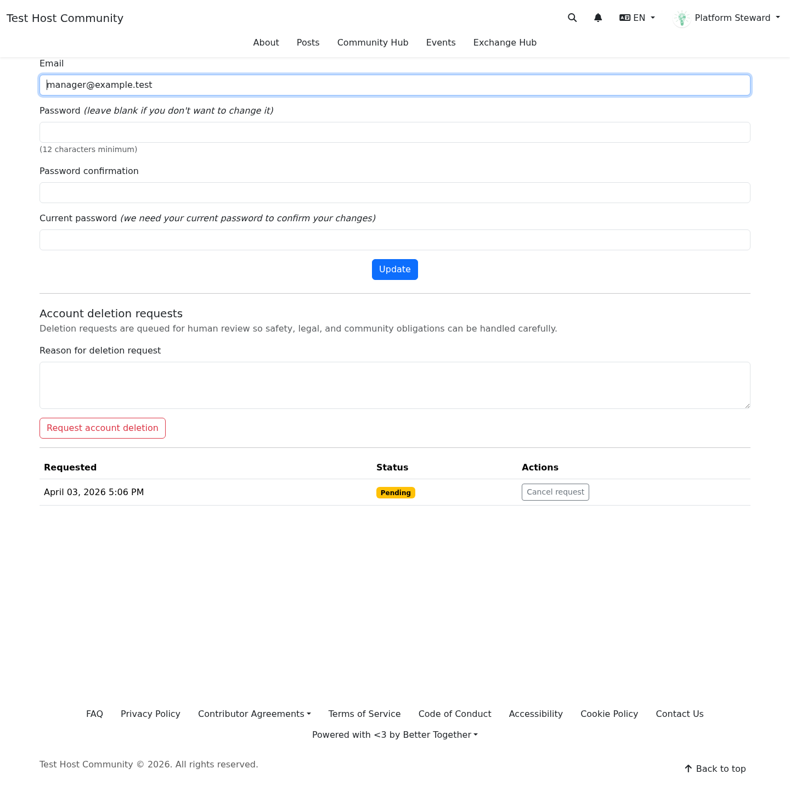

# Account Deletion Requests

**Target Audience:** All community members  
**Document Type:** User Guide  
**Last Updated:** April 3, 2026

## Overview

The account deletion request flow lets you ask the platform to begin account removal review.

In `0.11.0`, this is intentionally a review-oriented workflow rather than an instant destructive action. The platform records the request and allows you to cancel it while it is still active.

## Where It Starts

The current deletion request entrypoint is available from account settings.

You reach it from the account-edit/settings area rather than from the **My Data** export table.

## What The Current Flow Does

The current interface allows you to:

- start a deletion request
- optionally provide a short reason
- see whether a request is already active
- cancel the request if needed before the platform completes review

[Mobile screenshot of the account deletion request entrypoint](../screenshots/mobile/release_0_11_0_person_deletion_request.png)

## How To Request Account Deletion

1. Open your account settings.
2. Find the deletion request section.
3. Review the warning or explanation text carefully.
4. Choose the action to submit the request.

If the platform requires confirmation text or review steps in a future release, follow the instructions shown on screen.

## How To Cancel A Pending Request

If your request is still active and the platform has not yet completed deletion:

1. Return to the same account settings area.
2. Find the active request state.
3. Choose the cancel action.

Cancellation is useful when:

- you submitted the request by mistake
- you changed your mind
- you need more time to download data first

## Recommended Order Of Operations

Before requesting deletion, it is usually better to:

1. request and download your data export
2. confirm you have any information you still need
3. then submit the deletion request

That order leaves you with a portable copy before the platform begins account-removal review.

## What To Expect After Submitting

The exact timing depends on platform operations, but the `0.11.0` design assumes:

- the request is recorded immediately
- platform review may happen asynchronously
- the request may stay visible as active until the platform finishes review

If you need help while waiting, contact the platform organizers directly.

## Related Guides

- [My Data and Exports](my_data_and_exports.md)
- [Privacy and Safety Preferences](privacy_and_safety_preferences.md)
