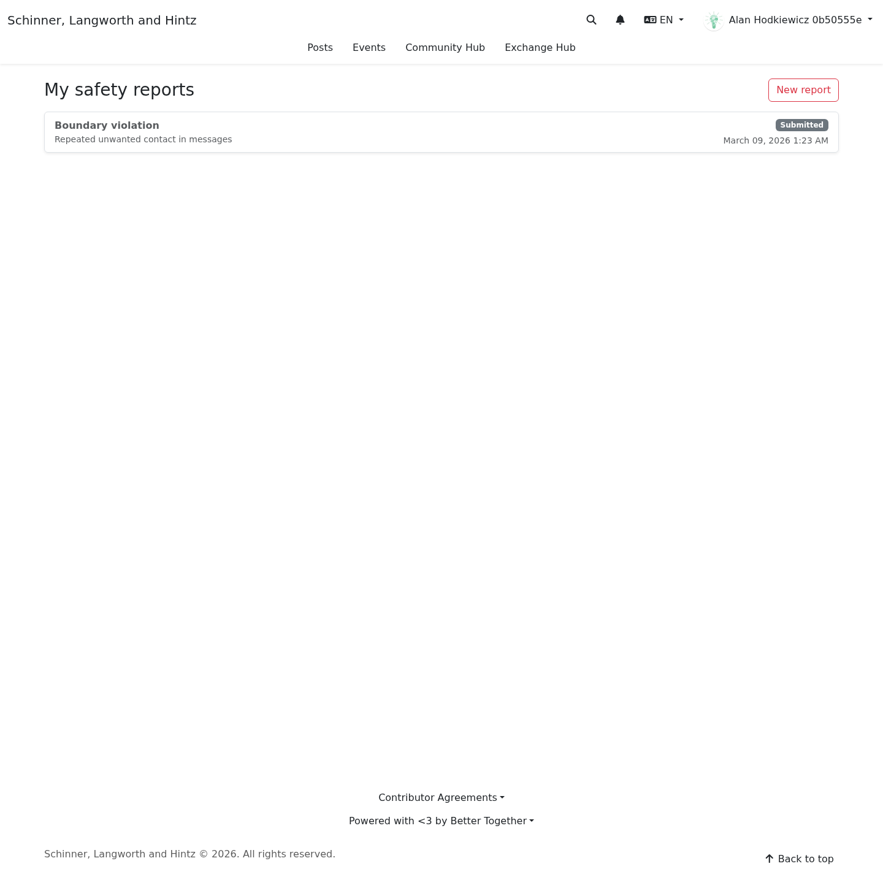
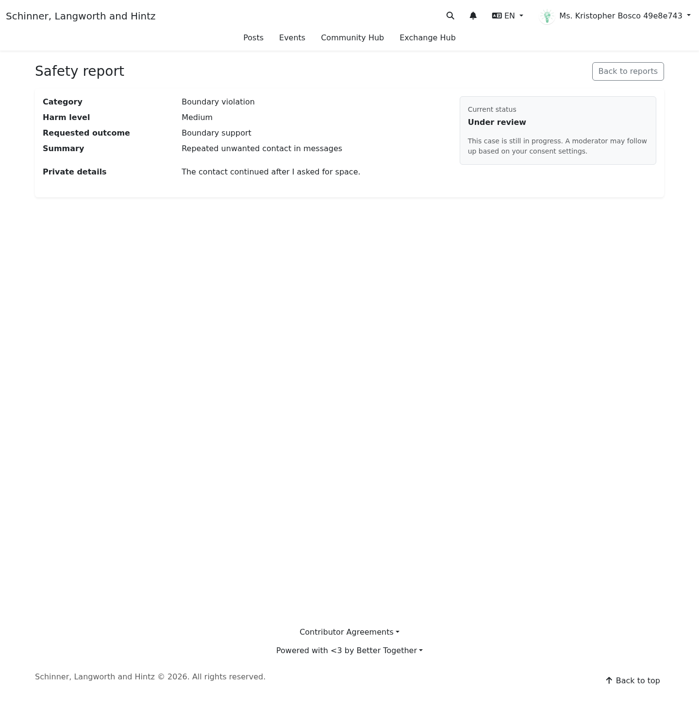

# After You Report

**Target Audience:** All community members  
**Document Type:** User Guide  
**Last Updated:** March 9, 2026

## Overview

After you submit a report, the current interface gives you two user-facing places to check:

- your report history
- the detail page for an individual report

These pages help you confirm that your report was submitted and show the current user-visible status information available today.

## Where To Find Your Reports

Current route:

- `/reports`

This page lists your submitted reports.

[Mobile screenshot of the report history page](../screenshots/mobile/report_history.png)

## What You Can See In Report History

The current history page shows:

- category
- a short version of your summary
- the current case status
- the date the report was created

## What You Can See On A Report Detail Page

The report detail page currently shows:

- category
- harm level
- requested outcome
- your summary
- your private details, if you added them
- the current user-visible status
- a case summary if one has been added and is visible to the reporter

[Mobile screenshot of the report detail page](../screenshots/mobile/report_detail.png)

## What “Current Status” Means

The current interface uses a limited reporter-visible status view.

In practice, this means:

- your report has been submitted
- it may still be under review
- a visible summary may appear later if the case has a reporter-visible closure summary

Do **not** assume the user-facing status page shows the full internal review workflow.

## Will Someone Contact You?

Someone may contact you if:

- you allowed contact in the report form
- the safety team needs more information
- follow-up is appropriate for the case

If you did **not** allow contact, the platform should rely on the information you provided unless another safety reason requires action.

## What To Do While Waiting

- Keep your own notes or screenshots if the issue continues.
- Use blocking if you need distance right away.
- If the situation escalates, submit an updated report or follow the steps in [Emergency and Urgent Situations](emergency_and_urgent_situations.md).

## If Something Changes After You Report

You may need to make a new report if:

- the behavior continues
- a new incident happens
- the harm becomes more urgent
- you need to document retaliation risk or escalation

## Related Guides

- [Reporting Harm and Safety Concerns](reporting_harm_and_safety_concerns.md)
- [Blocking and Boundaries](blocking_and_boundaries.md)
- [Emergency and Urgent Situations](emergency_and_urgent_situations.md)
