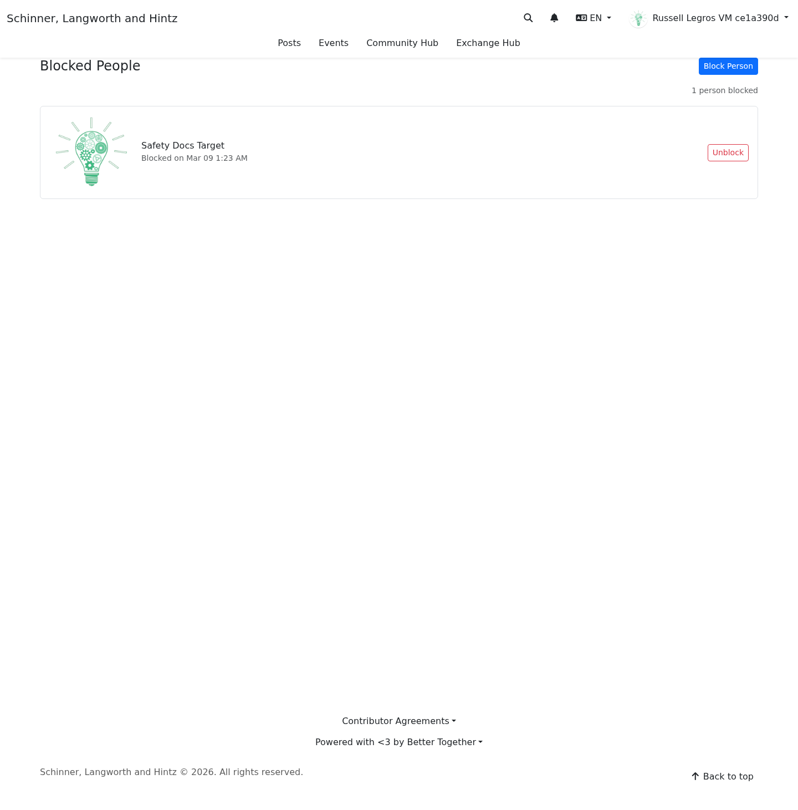
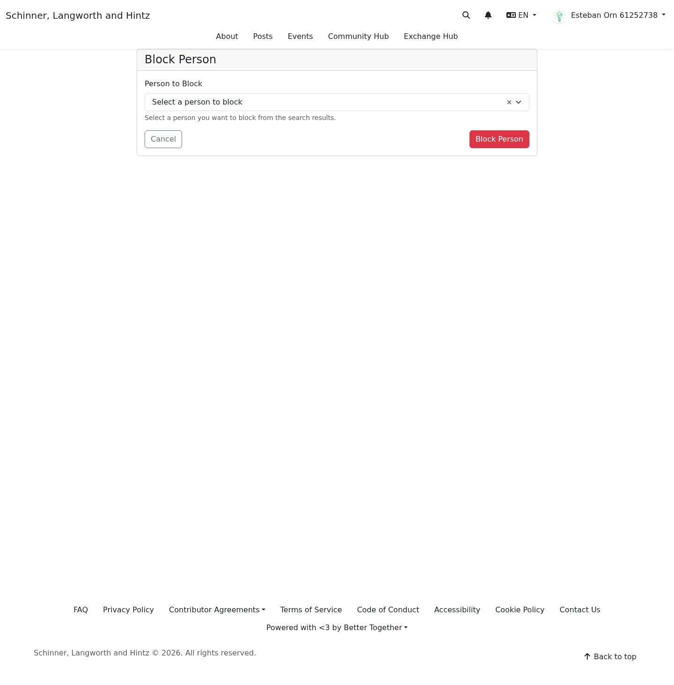

# Blocking and Boundaries

**Target Audience:** All community members  
**Document Type:** User Guide  
**Last Updated:** March 9, 2026

## Overview

Blocking helps you create distance from a specific person on the platform.

Use blocking when:

- you do not want someone interacting with you
- contact from a person feels stressful, unwanted, or unsafe
- you want a private boundary tool that does not require filing a report first

If you also want the platform to review behavior or content, use [Reporting Harm and Safety Concerns](reporting_harm_and_safety_concerns.md) as well.

## What Blocking Currently Does

Blocking is the strongest user-controlled boundary tool currently available in the interface.

What you can count on today:

- you can keep a private list of blocked people
- blocked people are not notified when you block them
- blocks affect visibility and filtering in key areas of the platform
- you can unblock someone later

What you should **not** assume yet:

- that every possible interaction surface is blocked in exactly the same way
- that the platform will always show a visible explanation to the other user

If a blocked person still appears to have a path to contact or interact with you, document it and submit a report.

## Where To Manage Blocks

You can manage blocked people from the blocked-people area in Settings.

Direct route in the current app:

- `/blocks`

You may also reach it through the Settings page where blocked people appear as a dedicated section.

## How To Block Someone

1. Open the blocked-people area in Settings.
2. Select **Block person**.
3. Search for the person you want to block.
4. Confirm the action.

[Mobile screenshot of the blocked-people list](../screenshots/mobile/blocked_people_list.png)

[Mobile screenshot of the block-person form](../screenshots/mobile/block_person_form.png)

## How To Unblock Someone

1. Open your blocked-people list.
2. Find the person in the list.
3. Select **Unblock**.
4. Confirm the action.

Unblocking is private, just like blocking.

## When To Block, Report, Or Do Both

### Use blocking when:

- you want immediate distance
- you do not want contact
- you do not need the platform to review the situation yet

### Use reporting when:

- you want the platform to review harm, abuse, or patterns of behavior
- the issue affects more than one person
- you want a record inside the platform

### Use both when:

- you need immediate distance **and** platform follow-up
- you are worried about escalation or retaliation
- the person has already ignored boundaries

## Tips For Using Blocking Safely

- Take screenshots or notes if something harmful happened before you block.
- If you are worried about retaliation, mention that in a report.
- If the situation is urgent or dangerous, follow the steps in [Emergency and Urgent Situations](emergency_and_urgent_situations.md).

## Related Guides

- [Reporting Harm and Safety Concerns](reporting_harm_and_safety_concerns.md)
- [After You Report](after_you_report.md)
- [Privacy and Safety Preferences](privacy_and_safety_preferences.md)
