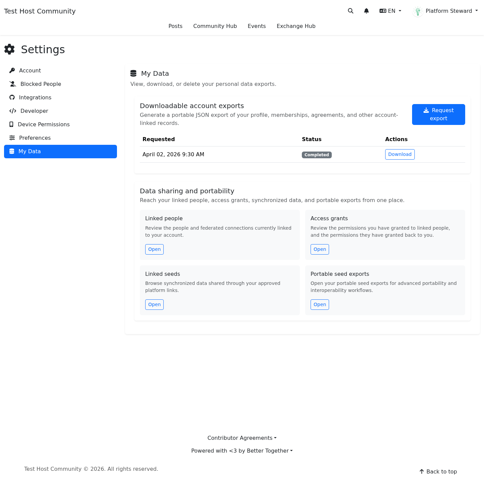

# My Data and Exports

**Target Audience:** All community members  
**Document Type:** User Guide  
**Last Updated:** April 3, 2026

## Overview

The **My Data** area gives you a self-service way to manage the data and portability tools attached to your account.

In `0.11.0`, this flow is centered on:

- requesting a new export package
- seeing whether an export is pending, completed, or failed
- downloading a completed export
- reaching your linked people, access grants, synchronized linked data, and portable seed exports from the same settings surface

The current release also stores export packages as structured seed-backed files so the platform can support portability and audit trails more consistently.

## Where To Find It

You can reach **My Data** from the main Settings screen.

Direct route in the current app:

- `/settings/my_data`

The normal user-facing flow is through the main **Settings** page where **My Data** appears as its own tab.

## What You Can Do There

The page currently includes:

- a short explanation of what the export request does
- a **Request export** button
- a table of recent export requests
- status badges for each request
- a download action when an export is complete
- a **Data sharing and portability** section with direct links to linked people, access grants, linked seeds, and portable seed exports

[Mobile screenshot of the My Data settings tab](../screenshots/mobile/release_0_11_0_settings_my_data_tab.png)

## How To Request An Export

1. Open **Settings**.
2. Select **My Data**.
3. Choose **Request export**.
4. Wait for the request to appear in the export table.

The export may take a short time to finish. While it is processing, the table shows a pending state instead of a download link.

## Data Sharing And Portability Shortcuts

The same page now also surfaces the account-level portability tools that were previously easy to miss if you did not already know the direct routes.

Depending on your permissions and the data connected to your account, you may see links for:

- **Linked people** to review identity and federation links connected to you
- **Access grants** to review what linked people can access and what they have granted back
- **Linked seeds** to browse synchronized data made available through approved links
- **Portable seed exports** to open your portable seed-backed export records directly

These links only appear when the platform policies allow your account to use them.

## Understanding Export Statuses

### Pending

The platform has accepted the request and is still preparing the file.

### Completed

The export package is ready and the page shows a **Download** action.

### Failed

The request did not complete successfully. If the page shows an error message or the request stays stuck for too long, contact the platform organizers.

## What The Download Contains

The exact contents may grow over time, but the `0.11.0` flow is designed to package:

- core account information that belongs to your person/account record
- export metadata such as request timing and processing state
- a structured seed-backed payload that can support future portability flows more consistently

This is a privacy and portability feature, not a full-site backup.

## Good Practices

- Wait for the request to complete before leaving the page if you want to download immediately.
- If you make repeated requests, use the most recent completed export unless you need an older snapshot for comparison.
- Store downloaded exports somewhere private.

## Related Guides

- [Account Deletion Requests](account_deletion_requests.md)
- [Privacy and Safety Preferences](privacy_and_safety_preferences.md)
