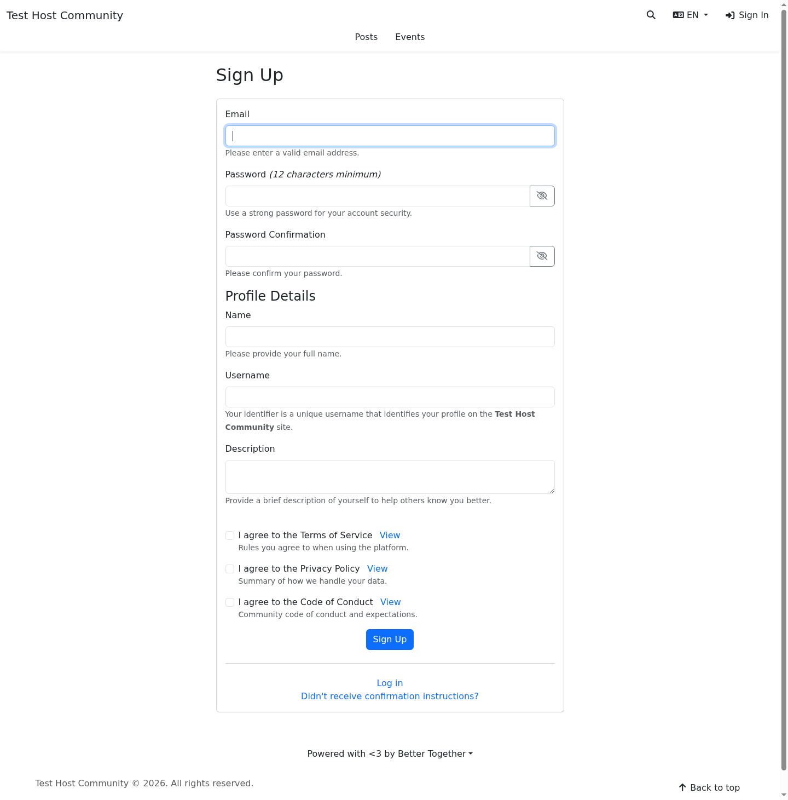
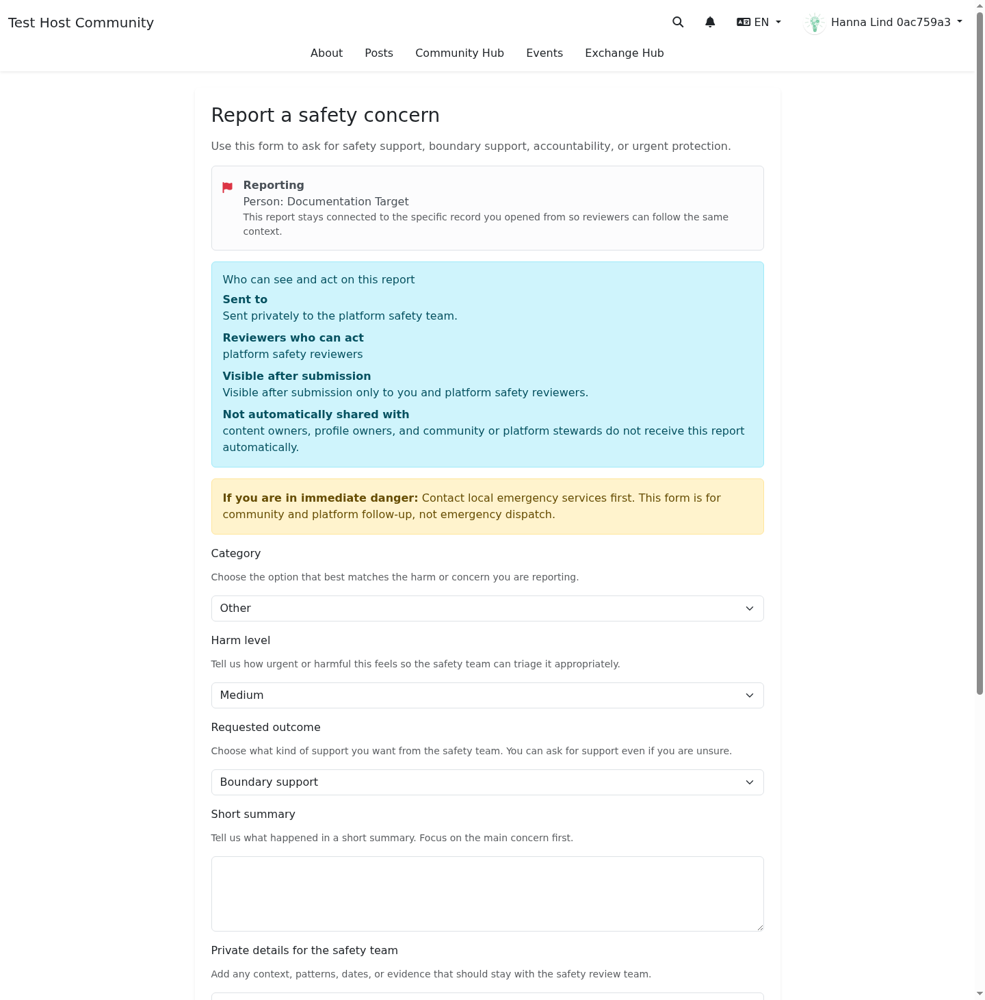

# Submission Protection and Security Checks

**Target Audience:** End users and community members  
**Document Type:** User guide  
**Last Updated:** April 2026

## Overview

Community Engine `0.11.0` adds built-in background checks to the public forms that are most likely to attract spam or abusive automation.

These checks help protect:

- account registration
- membership requests
- safety reports

The goal is to slow down automated abuse **without** making ordinary people solve a puzzle or install a separate app first.

## What changed

The platform now adds several quiet checks behind the scenes when you submit a protected form:

1. a signed form token that proves the page was generated by the site
2. a hidden field that should stay empty during a real submission
3. a short timing check so forms cannot be submitted unrealistically fast
4. replay protection so the same proof cannot be reused over and over

These checks usually happen invisibly. Most people will only notice them if a submission is rejected.

## What this means for you

### Sign-up and join flows

You can still sign up or request membership the normal way. The protection runs in the background and should not change the basic steps.

If your platform requires invitations, you may still see the membership request path instead of direct self-sign-up.

### Safety reports

Safety reports now use the same built-in protection layer. This helps reduce automated abuse against reporting channels while keeping the form available to real people.

## When a submission might fail

The platform may reject a submission if:

- the page sat open too long and the protection token expired
- the form was submitted too quickly by automation
- a browser extension or script filled hidden fields that should stay blank
- the same submission proof was reused

## What to do if your submission is rejected

1. refresh the page
2. complete the form again
3. submit it normally without autofill scripts or browser automation

If the problem keeps happening, contact platform support and tell them:

- which form failed
- roughly when it happened
- whether you were using autofill, a password manager, accessibility tooling, or browser extensions

## What these protections do **not** mean

- they do **not** guarantee that every harmful submission is blocked
- they do **not** replace organizer or moderator review
- they do **not** grant staff permission to read private reports they could not already access

## Visual examples

### Sign-up form

### Membership request entry point

### Safety report form

## Related guides

- [Safety and Reporting Tools](safety_reporting.md)
- [Reporting Harm and Safety Concerns](reporting_harm_and_safety_concerns.md)
- [Privacy Principles](../shared/privacy_principles.md)

