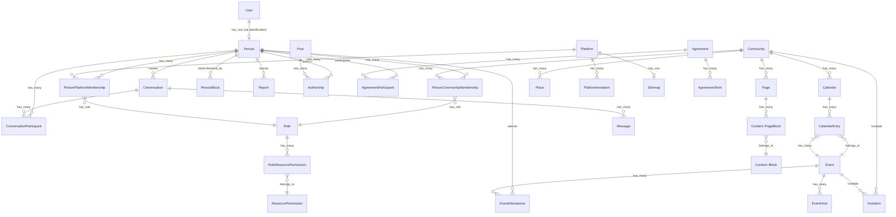
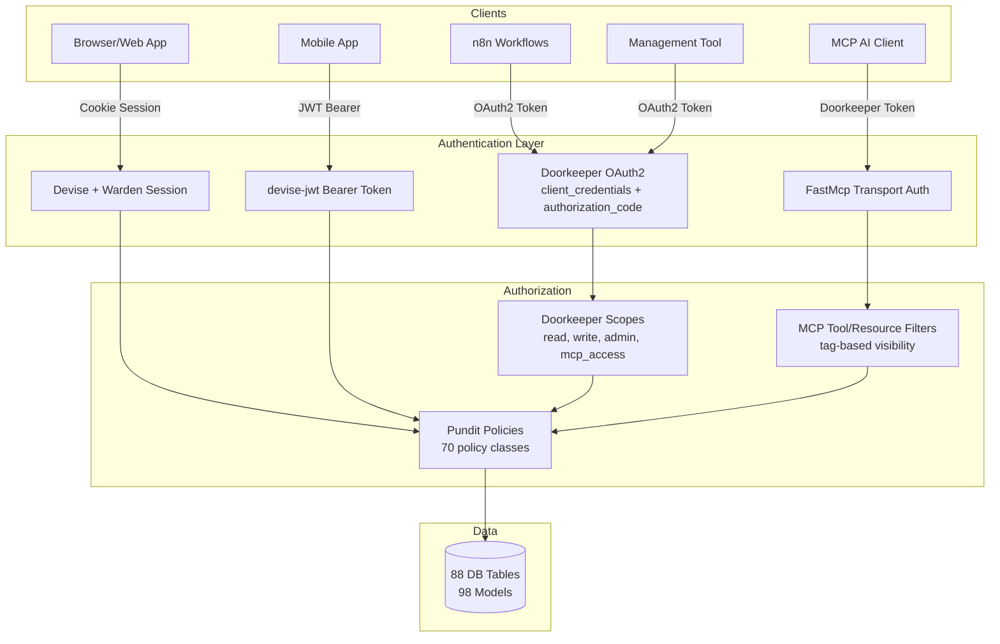
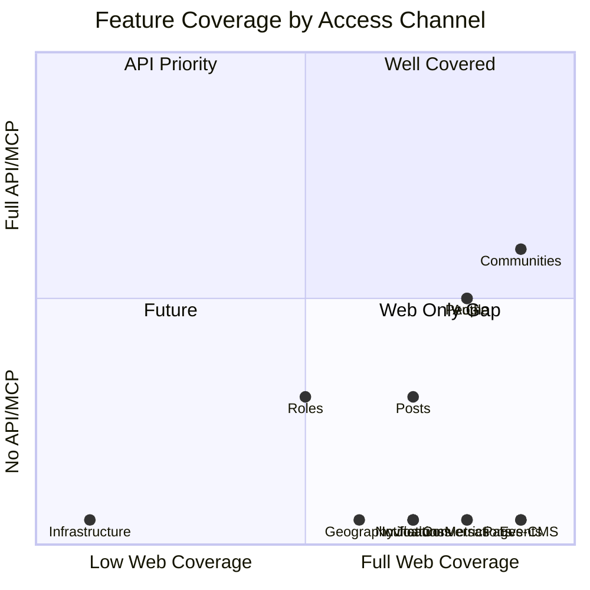
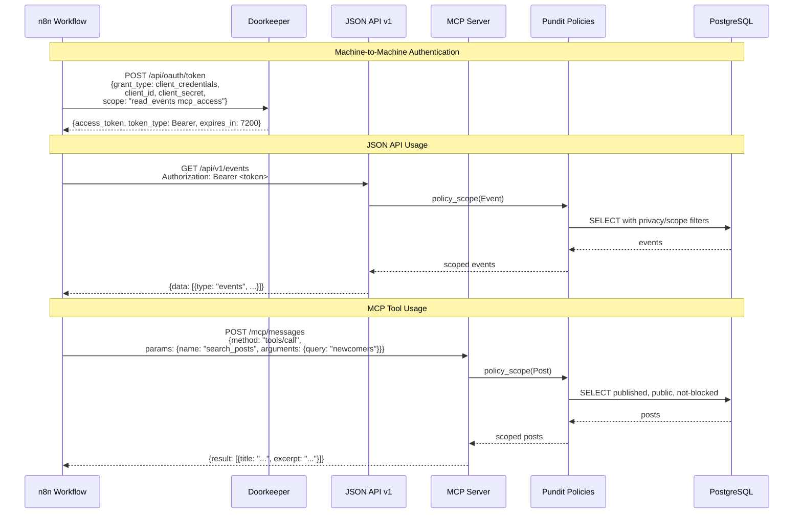
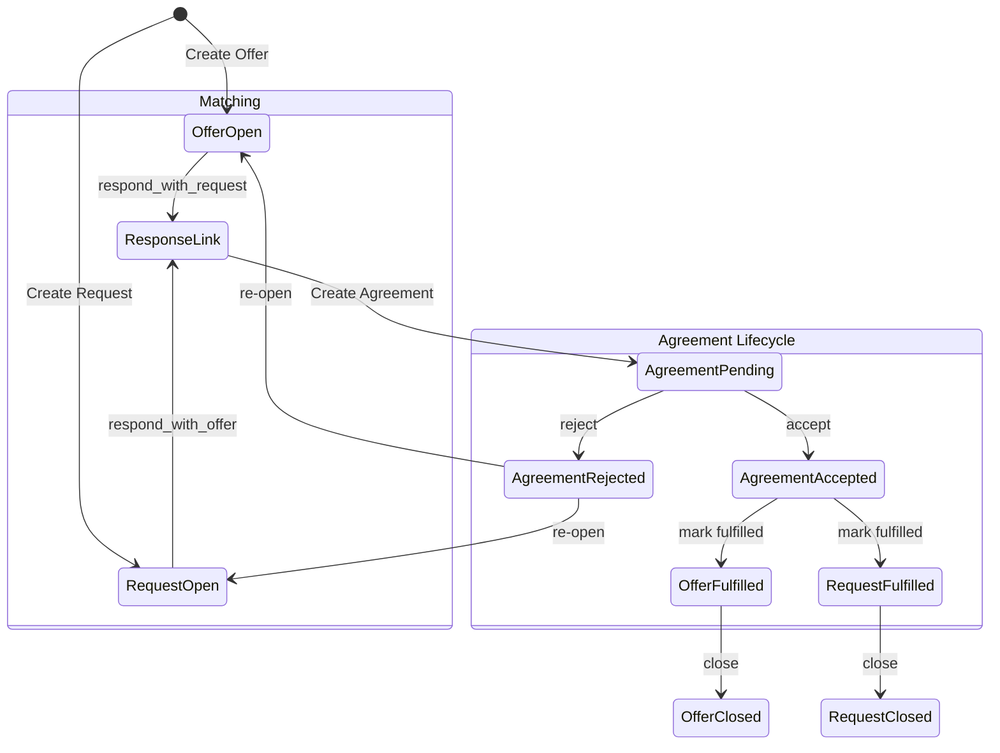
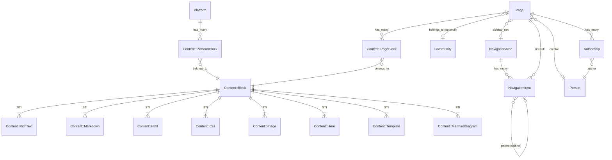
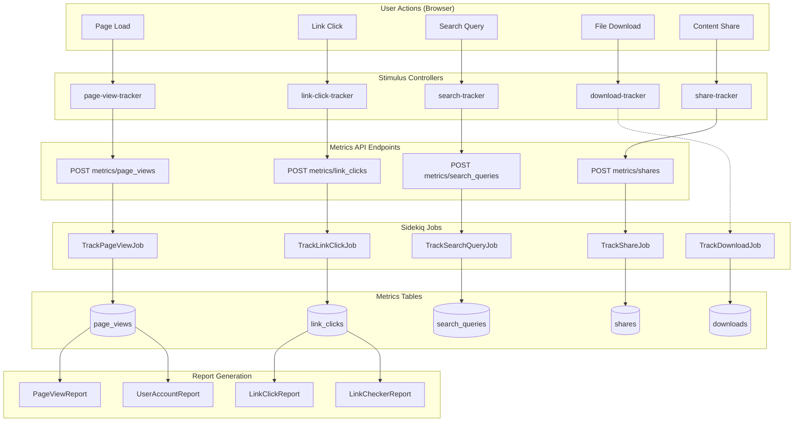

# MCP & API Integration Plan — Community Engine + Management Tool

**Date:** February 15, 2026
**Scope:** MCP server hardening, Doorkeeper OAuth2 integration, JSON API + MCP coverage gap analysis, full system architecture mapping
**Branch:** `feat/mcp`

---

## Table of Contents

1. [Executive Summary](#1-executive-summary)
2. [MCP Security Consideration Fixes](#2-mcp-security-consideration-fixes)
3. [Doorkeeper OAuth2 Integration Plan](#3-doorkeeper-oauth2-integration-plan)
4. [Coverage Gap Analysis: JSON API + MCP vs Web App](#4-coverage-gap-analysis)
5. [Full System Architecture](#5-full-system-architecture)
6. [Concern-to-Model Mapping](#6-concern-to-model-mapping)
7. [Mermaid Diagrams](#7-mermaid-diagrams)
8. [Implementation Phases](#8-implementation-phases)

---

## 1. Executive Summary

The Better Together Community Engine is a comprehensive Rails engine with **99 models**, **88 database tables**, **52 concerns**, **89 controllers**, **70 policies**, **26 jobs**, **15 notifiers**, **12 mailers**, and **8 ActionCable channels**. It covers identity, communities, messaging, events, content management, geography, infrastructure, exchange (Joatu), and metrics.

**Current programmatic access:**
- **JSON API (JSONAPI::Resources):** 4 resource endpoints — communities, people, memberships, roles
- **MCP Server (fast-mcp):** 2 tools (list communities, search posts) + 1 resource (public communities)
- **Authentication:** JWT via devise-jwt (user sessions only); no application-level API keys

**The gap is enormous.** The web app exposes ~30 feature domains through 89 controllers, while the JSON API covers ~5% and MCP covers ~3% of that surface area. To integrate with the management tool and n8n workflows, we need Doorkeeper for machine-to-machine auth, expanded API coverage, and MCP tools for the key operational domains.

---

## 2. MCP Security Consideration Fixes

### 2.1 Rate Limiting for MCP Endpoints
**Severity:** Low | **Effort:** Small | **Priority:** P1

**Problem:** Rack::Attack throttles don't cover `/mcp/*` paths specifically. MCP tool invocations are compute-intensive (DB queries, policy evaluation) and need tighter limits than regular page requests.

**Fix:**
```ruby
# config/initializers/rack_attack.rb — Add after existing throttles

# MCP endpoint throttling (AI client requests)
throttle('mcp/ip', limit: 60, period: 1.minute) do |req|
  req.ip if req.path.start_with?('/mcp')
end

# MCP tool invocations (more expensive than SSE connections)
throttle('mcp/tool-calls/ip', limit: 30, period: 1.minute) do |req|
  req.ip if req.path == '/mcp/messages' && req.post?
end

# Per-token MCP throttle (when Doorkeeper is integrated)
# throttle('mcp/token', limit: 120, period: 1.minute) do |req|
#   if req.path.start_with?('/mcp')
#     req.env['HTTP_AUTHORIZATION']&.sub(/^Bearer\s+/i, '')&.first(32)
#   end
# end
```

**Tests:** Add request spec verifying MCP paths hit rack-attack throttle rules.

### 2.2 `allow_any_instance_of` in Test Helpers
**Severity:** Low | **Effort:** None (document only) | **Priority:** P3

**Status:** Acceptable. FastMcp instantiates tool/resource classes internally — we cannot get a reference to the instance before `request` is called. The `# rubocop:disable RSpec/AnyInstance` is already annotated. No code change needed.

**Action:** Add a brief explanatory comment in `McpTestHelpers` noting why this pattern is necessary.

### 2.3 Audit Logging for MCP Requests
**Severity:** Low | **Effort:** Medium | **Priority:** P2

**Problem:** MCP tool invocations aren't logged beyond standard Rails request logging. For compliance and debugging, tool calls should produce structured audit records.

**Fix:** Add an `around` callback in `ApplicationTool` and `ApplicationResource`:

```ruby
# app/tools/better_together/mcp/application_tool.rb
class ApplicationTool < FastMcp::Tool
  include BetterTogether::Mcp::PunditIntegration

  private

  def log_invocation(tool_name, args, result_size)
    Rails.logger.tagged('MCP', 'tool') do
      Rails.logger.info({
        tool: tool_name,
        user_id: current_user&.id,
        person_id: agent&.id,
        args: args.except(:sensitive_keys),
        result_bytes: result_size,
        timestamp: Time.current.iso8601
      }.to_json)
    end
  end
end
```

**Future:** When Doorkeeper is integrated, include `oauth_application_id` and `client_name` in the audit log entry. Consider a dedicated `Metrics::McpInvocation` model for queryable audit trails.

### 2.4 Bearer Token is Shared Secret → Doorkeeper Per-Client Tokens
**Severity:** Medium | **Effort:** Large (see Section 3) | **Priority:** P1

**Problem:** `MCP_AUTH_TOKEN` is a single shared secret. All clients that know it have the same transport-level access.

**Fix:** Replace with Doorkeeper-issued per-application access tokens. Each n8n workflow, management tool instance, or bot gets its own OAuth2 application with scoped permissions. See [Section 3](#3-doorkeeper-oauth2-integration-plan) for full implementation plan.

### 2.5 SQL Injection via Search Query
**Severity:** None | **No action needed**

Already uses parameterized `ILIKE ?` — safe.

### 2.6 No CORS Protection in Production
**Severity:** None (already correct) | **No action needed**

`allowed_origins: []` in non-dev prevents cross-origin browser access. MCP clients (n8n, CLI tools) connect server-to-server and don't use browser CORS.

### 2.7 Content Excerpts in Search Results
**Severity:** Low | **Effort:** Small | **Priority:** P3

**Problem:** Post excerpts expose 200 chars of body content to MCP clients. While already policy-scoped, making this configurable improves operator control.

**Fix:** Add a configurable excerpt length:
```ruby
# lib/better_together/engine.rb (in MCP config section)
mcp_config.excerpt_length = ENV.fetch('MCP_EXCERPT_LENGTH', 200).to_i

# app/tools/better_together/mcp/search_posts_tool.rb
def serialize_post(post)
  excerpt_length = Rails.application.config.mcp.excerpt_length
  {
    # ...
    excerpt: post.content.to_plain_text.truncate(excerpt_length),
    # ...
  }
end
```

---

## 3. Doorkeeper OAuth2 Integration Plan

### 3.1 Context

The codebase already has pre-built skeleton code waiting for Doorkeeper:
- `Api::OauthAuthorization` concern — scope verification, `doorkeeper_token` integration
- `Oauth::ApplicationsController` — full CRUD for OAuth applications
- `docs/security/api_security_performance_assessment.md` — detailed implementation plan

### 3.2 Gem Installation & Configuration

**Step 1: Add gem**
```ruby
# better_together.gemspec
spec.add_dependency 'doorkeeper', '>= 5.7', '< 6.0'
spec.add_dependency 'doorkeeper-jwt', '>= 0.4'
```

**Step 2: Generate migrations**
```bash
bin/dc-run rails generate doorkeeper:migration
# Customize to use UUID primary keys and better_together_ prefix
```

**Step 3: Initializer**
```ruby
# config/initializers/doorkeeper.rb
Doorkeeper.configure do
  orm :active_record

  # Use existing Devise authentication
  resource_owner_authenticator do
    current_user || warden.authenticate!(scope: :user)
  end

  # API-only: no browser-based authorization
  api_only
  base_controller 'BetterTogether::Api::ApplicationController'

  # Grant types
  grant_flows %w[client_credentials authorization_code]

  # Scopes
  default_scopes :read
  optional_scopes :write, :admin,
                  :read_communities, :write_communities,
                  :read_people, :read_events, :write_events,
                  :read_posts, :write_posts,
                  :read_conversations, :write_conversations,
                  :read_metrics, :write_metrics,
                  :mcp_access

  # Token expiration
  access_token_expires_in 2.hours
  use_refresh_token

  # Custom token model with BT prefix
  access_token_class 'BetterTogether::OauthAccessToken'
  application_class 'BetterTogether::OauthApplication'
  access_grant_class 'BetterTogether::OauthAccessGrant'

  # Skip authorization for trusted apps
  skip_authorization do |_resource_owner, client|
    client.application.trusted?
  end

  # Use existing Pundit for admin checks on application management
  admin_authenticator do |routes|
    unless current_user&.person&.permitted_to?('manage_platform')
      redirect_to routes.root_url, alert: I18n.t('doorkeeper.errors.not_authorized')
    end
  end
end
```

### 3.3 Models

```ruby
# app/models/better_together/oauth_application.rb
class BetterTogether::OauthApplication < ApplicationRecord
  include ::Doorkeeper::Models::Application

  self.table_name = 'better_together_oauth_applications'

  belongs_to :owner, class_name: 'BetterTogether::Person', optional: true
  has_many :access_tokens, class_name: 'BetterTogether::OauthAccessToken',
           foreign_key: :application_id, dependent: :destroy

  validates :name, presence: true
  validates :redirect_uri, presence: true

  # Trusted applications skip the authorization screen
  def trusted?
    # Platform-managed applications (n8n, management tool) are trusted
    owner&.permitted_to?('manage_platform')
  end
end

# app/models/better_together/oauth_access_token.rb
class BetterTogether::OauthAccessToken < ApplicationRecord
  include ::Doorkeeper::Models::AccessToken

  self.table_name = 'better_together_oauth_access_tokens'

  belongs_to :application, class_name: 'BetterTogether::OauthApplication', optional: true
  belongs_to :resource_owner, class_name: 'BetterTogether::User', optional: true
end

# app/models/better_together/oauth_access_grant.rb
class BetterTogether::OauthAccessGrant < ApplicationRecord
  include ::Doorkeeper::Models::AccessGrant

  self.table_name = 'better_together_oauth_access_grants'

  belongs_to :application, class_name: 'BetterTogether::OauthApplication'
  belongs_to :resource_owner, class_name: 'BetterTogether::User'
end
```

### 3.4 Migration

```ruby
class CreateBetterTogetherOauthTables < ActiveRecord::Migration[7.2]
  def change
    create_bt_table :oauth_applications do |t|
      t.string :name, null: false
      t.string :uid, null: false
      t.string :secret, null: false
      t.text :redirect_uri
      t.string :scopes, null: false, default: ''
      t.boolean :confidential, null: false, default: true
      t.boolean :trusted, null: false, default: false
      t.bt_references :owner, target_table: :better_together_people, null: true

      t.index :uid, unique: true
    end

    create_bt_table :oauth_access_grants do |t|
      t.bt_references :resource_owner, target_table: :better_together_users, null: false
      t.bt_references :application, target_table: :better_together_oauth_applications, null: false
      t.string :token, null: false
      t.integer :expires_in, null: false
      t.text :redirect_uri, null: false
      t.string :scopes, null: false, default: ''
      t.datetime :revoked_at

      t.index :token, unique: true
    end

    create_bt_table :oauth_access_tokens do |t|
      t.bt_references :resource_owner, target_table: :better_together_users, null: true
      t.bt_references :application, target_table: :better_together_oauth_applications, null: true
      t.string :token, null: false
      t.string :refresh_token
      t.integer :expires_in
      t.string :scopes, null: false, default: ''
      t.datetime :revoked_at
      t.string :previous_refresh_token, null: false, default: ''

      t.index :token, unique: true
      t.index :refresh_token, unique: true
    end
  end
end
```

### 3.5 Routes

```ruby
# config/routes/api.rb — Add Doorkeeper routes
scope path: BetterTogether.route_scope_path do
  namespace :api, defaults: { format: :json } do
    # Doorkeeper OAuth2 endpoints
    use_doorkeeper do
      controllers applications: 'better_together/oauth/applications',
                  tokens: 'better_together/oauth/tokens'
    end

    # Existing auth routes ...
  end
end
```

### 3.6 MCP Integration with Doorkeeper

Replace the single `MCP_AUTH_TOKEN` with Doorkeeper token verification:

```ruby
# config/initializers/fast_mcp.rb — Updated auth flow
FastMcp.mount_in_rails(
  Rails.application,
  # ... existing config ...

  # Use Doorkeeper for auth instead of static token
  authenticate: Rails.env.production? || Rails.application.config.mcp.auth_token.present?,
  auth_token: nil, # Disable static token when Doorkeeper is active

  # Custom authentication via before_action in middleware
) do |server|
  # ... tool/resource registration ...

  server.filter_tools do |request, tools|
    # Verify Doorkeeper token has mcp_access scope
    doorkeeper_token = Doorkeeper::OAuth::Token.authenticate(request, :from_bearer_authorization)

    if doorkeeper_token&.acceptable?(:mcp_access)
      user = BetterTogether::User.find_by(id: doorkeeper_token.resource_owner_id)
      context = BetterTogether::Mcp::PunditContext.new(user: user)
    else
      context = BetterTogether::Mcp::PunditContext.from_request(request)
    end

    if context.permitted_to?('manage_platform')
      tools
    else
      tools.reject { |t| t.tags.include?(:admin) }
    end
  end
end
```

### 3.7 n8n / Management Tool Integration

**n8n credentials setup:**
1. Create an OAuth application in the BT admin panel for the n8n instance
2. Use `client_credentials` grant flow (machine-to-machine, no user interaction)
3. Scopes: `read_communities read_people read_events read_posts read_metrics mcp_access`
4. n8n HTTP Request node uses the issued Bearer token

**Management tool setup:**
1. Create a trusted OAuth application owned by a platform manager
2. Grant `admin` scope for full access
3. Use `client_credentials` with the application's `uid`/`secret`

---

## 4. Coverage Gap Analysis

### 4.1 Feature Domain Coverage Matrix

| Feature Domain | Web Controllers | JSON API Resources | MCP Tools/Resources | Gap |
|----------------|:-:|:-:|:-:|-----|
| **Identity & Auth** | Users, Sessions, Registrations, Confirmations, Passwords | Sessions, Registrations, Confirmations, Passwords | — | MCP: No user management |
| **People** | People (CRUD) | People (CRUD + `me`) | — | MCP: No people tools |
| **Communities** | Communities (CRUD + members) | Communities (CRUD) | ListCommunitiesTool, PublicCommunitiesResource | Partial MCP coverage |
| **Memberships** | PersonCommunityMemberships, PersonPlatformMemberships | PersonCommunityMemberships | — | MCP: No membership tools |
| **Conversations** | Conversations, Messages (+ ActionCable) | — | — | **Full gap** in API + MCP |
| **Events** | Events (CRUD + RSVP + ICS), EventAttendances, Calendars | — | — | **Full gap** in API + MCP |
| **Content (Pages)** | Pages, Content::Blocks, PageBlocks | — | — | **Full gap** in API + MCP |
| **Posts** | Posts (CRUD) | — | SearchPostsTool | API gap; partial MCP |
| **Notifications** | Notifications (index + mark_read + ActionCable) | — | — | **Full gap** in API + MCP |
| **Invitations** | Invitations, PlatformInvitations, Community/Event Invitations | — | — | **Full gap** in API + MCP |
| **Geography** | Continents, Countries, States, Regions, Settlements, Maps | — | — | **Full gap** in API + MCP |
| **Joatu Exchange** | Offers, Requests, Agreements, ResponseLinks | — | — | **Full gap** in API + MCP |
| **Metrics** | PageViews, LinkClicks, Shares, SearchQueries, Reports | — | — | **Full gap** in API + MCP |
| **Navigation** | NavigationAreas, NavigationItems | — | — | **Full gap** in API + MCP |
| **Settings/Admin** | Roles, ResourcePermissions, Platforms, HostDashboard | Roles (read-only) | — | Minimal |
| **Search** | SearchController | — | SearchPostsTool | API gap; partial MCP |
| **Uploads** | Uploads (CRUD + download) | — | — | **Full gap** in API + MCP |
| **Checklists** | Checklists, ChecklistItems, PersonChecklistItems | — | — | **Full gap** in API + MCP |
| **Reports (Safety)** | Reports (create) | — | — | **Full gap** in API + MCP |
| **Person Blocks** | PersonBlocks (CRUD + search) | — | — | **Full gap** in API + MCP |
| **OAuth Apps** | Oauth::ApplicationsController (skeleton) | — | — | Awaiting Doorkeeper |
| **Contact Details** | (via communities/people) | — | — | **Full gap** in API + MCP |
| **Infrastructure** | — | — | — | No web exposure yet |

### 4.2 Priority Expansion Plan

**Phase 1 — Critical for n8n/Management Tool Integration:**
- Events API + MCP tools (CRUD, RSVP, calendar feeds)
- Posts API (CRUD, not just search)
- Conversations API (list, create, send message)
- Notifications API (list, mark read)
- People API enhancements (search, profile management)
- Metrics API (read access for dashboards)

**Phase 2 — Community Management:**
- Invitations API (create, accept, decline)
- Memberships API (manage roles)
- Person blocks API
- Reports API
- Checklists API

**Phase 3 — Content & Geography:**
- Pages + Blocks API (CMS operations)
- Navigation API
- Geography API (maps, locations)
- Uploads API

**Phase 4 — Exchange System:**
- Joatu Offers/Requests API
- Agreements API
- Response Links API

### 4.3 MCP Tool Expansion Priority

For each feature domain, define read-oriented MCP tools that AI clients need:

| Priority | MCP Tool | Purpose | Scopes Required |
|----------|----------|---------|-----------------|
| P1 | `ListEventsTool` | Upcoming events with RSVP status | `read_events` |
| P1 | `GetEventDetailTool` | Single event with hosts, attendees | `read_events` |
| P1 | `ListNotificationsTool` | Unread notifications with context | `read` |
| P1 | `ListConversationsTool` | Recent conversations with last message | `read_conversations` |
| P1 | `GetPostTool` | Full post content by ID or slug | `read_posts` |
| P2 | `ListMembersTool` | Community members with roles | `read_communities` |
| P2 | `SearchPeopleTool` | Search people by name/handle | `read_people` |
| P2 | `GetMetricsSummaryTool` | Platform metrics dashboard data | `read_metrics` |
| P2 | `ListInvitationsTool` | Pending invitations for user | `read` |
| P3 | `CreateEventTool` | Create event (write tool, admin-tagged) | `write_events` |
| P3 | `SendMessageTool` | Send message to conversation | `write_conversations` |
| P3 | `CreatePostTool` | Create/draft a post | `write_posts` |

### 4.4 JSON API Resource Expansion Priority

| Priority | API Resource | Actions | Scopes |
|----------|-------------|---------|--------|
| P1 | `EventResource` | index, show, create, update, destroy | `read_events`, `write_events` |
| P1 | `PostResource` | index, show, create, update, destroy | `read_posts`, `write_posts` |
| P1 | `ConversationResource` | index, show, create | `read_conversations`, `write_conversations` |
| P1 | `MessageResource` | index, create | `write_conversations` |
| P1 | `NotificationResource` | index, update (mark_read) | `read` |
| P2 | `InvitationResource` | index, create, update | `write` |
| P2 | `CalendarResource` | show, feed | `read_events` |
| P2 | `PageResource` | index, show | `read` |
| P2 | `SearchResource` | (custom endpoint) | `read` |
| P3 | `Joatu::OfferResource` | index, show, create | `write` |
| P3 | `Joatu::RequestResource` | index, show, create | `write` |
| P3 | `Geography::*Resources` | index, show | `read` |

---

## 5. Full System Architecture

### 5.1 Model Count Summary

| Namespace | Models | Tables | STI Hierarchies |
|-----------|--------|--------|-----------------|
| Core (BetterTogether::) | 53 | 46 | User→OauthUser, Invitation→Community/Event, Category→Event/Joatu |
| Content (Content::) | 12 | 4 | Block→Css/Hero/Html/Image/Markdown/MermaidDiagram/RichText/Template |
| Geography (Geography::) | 13 | 11 | Map→CommunityMap→CommunityCollectionMap |
| Infrastructure (Infrastructure::) | 4 | 4 | — |
| Joatu (Joatu::) | 5 | 4 | Category→Joatu::Category |
| Metrics (Metrics::) | 10 | 10 | — |
| AI (Ai::) | 1 | 1 | — |
| **Total** | **98** | **88** (+5 support +2 Mobility +2 Noticed) | **12 STI trees** |

### 5.2 Concern Classification

Concerns fall into 8 functional categories:

| Category | Concerns | Purpose |
|----------|----------|---------|
| **Identity & Auth** | Agent, Identity, Identifier, DeviseUser, Permissible | User/person identity, authentication, role-based permissions |
| **Associations** | Authorable, Author, Creatable, Member, Membership, Joinable, Invitable, PrimaryCommunity, PrimaryFlag | Polymorphic relationships between entities |
| **Content** | Publishable, Translatable (Mobility), Content::BlockAttributes, FriendlySlug, Searchable | Content lifecycle, i18n, search indexing |
| **Privacy & Safety** | Privacy, Protected, BlockFilterable, Visible | Visibility controls, user blocking |
| **Location** | Geography::Geospatial, Geography::Locatable, Geography::IsoLocation, Geography::Mappable, TimezoneAttributeAliasing, TimezoneScoped | Geospatial data, timezone handling |
| **UI & Display** | Positioned, Labelable, Resourceful, Viewable, RemoveableAttachment, Attachments::Images | Ordering, display helpers |
| **Activity & Metrics** | TrackedActivity, Metrics::Viewable, Metrics::Utf8UrlHandler, NotificationCacheManagement | Event tracking, metrics recording |
| **Domain-Specific** | Joatu::Exchange, Joatu::ResponseLinkable, RecurringSchedulable, HostsEvents, Contactable, PlatformHost, Categorizable, BetterTogetherId | Exchange system, event hosting, contact details |
| **MCP** | Mcp::PunditIntegration | MCP authorization integration |
| **Infrastructure** | Infrastructure::BuildingConnections | Building/room relationships |

### 5.3 Job Classification

| Category | Jobs | Count |
|----------|------|-------|
| **Search** | ElasticsearchIndexJob | 1 |
| **Events** | EventReminderJob, EventReminderScanJob, EventReminderSchedulerJob | 3 |
| **Metrics** | TrackDownloadJob, TrackLinkClickJob, TrackPageViewJob, TrackSearchQueryJob, TrackShareJob | 5 |
| **Metrics Reports** | GenerateUserAccountReportJob, LinkCheckerReportSchedulerJob | 2 |
| **Link Checking** | ExternalLinkCheckerJob, InternalLinkCheckerJob, RichTextExternalLinkCheckerQueueJob, RichTextInternalLinkCheckerQueueJob, RichTextLinkCheckerQueueJob, OrphanedRichTextLinkCleanupJob | 6 |
| **Notifications** | CleanupNotificationsJob, NotificationCacheWarmingJob | 2 |
| **Email** | PlatformInvitationMailerJob, MailerJob | 2 |
| **AI** | Ai::Log::TranslationLoggerJob | 1 |
| **Content** | SitemapRefreshJob | 1 |
| **Geography** | Geography::GeocodingJob | 1 |

---

## 6. Concern-to-Model Mapping

This maps which concerns are included by which models, revealing the behavioral contract each model inherits.

### 6.1 High-Frequency Concerns (included by 5+ models)

| Concern | Included By |
|---------|-------------|
| **Privacy** | Community, Person, Post, Event, Page, Joatu::Offer, Joatu::Request, CallForInterest |
| **Creatable** | Community, Conversation, Post, Page, Event, Report, Comment, Message |
| **FriendlySlug** | Community, Person, Page, Post, Event, Geography::Country, Geography::State, Geography::Region, Geography::Settlement |
| **Translatable** | Community, Person, Page, Post, Event, Category, Role, ResourcePermission, Geography::*, NavigationArea, NavigationItem, ChecklistItem, Checklist |
| **Searchable** | Community, Person, Post, Page, Event |
| **Identifier** | Community, Person, Platform, Role, ResourcePermission |
| **BetterTogetherId** | (All models via ApplicationRecord) |
| **Positioned** | NavigationItem, Content::PageBlock, ChecklistItem, WizardStepDefinition |

### 6.2 Identity & Membership Cluster

| Concern | Models |
|---------|--------|
| **Agent** | Person |
| **Identity** | Person, User |
| **Member** | Person |
| **Joinable** | Community, Platform |
| **Membership** | PersonCommunityMembership, PersonPlatformMembership |
| **Permissible** | Person |
| **DeviseUser** | User |

### 6.3 Content Cluster

| Concern | Models |
|---------|--------|
| **Authorable** | Page, Post |
| **Author** | Person |
| **Publishable** | Post, Page |
| **Content::BlockAttributes** | Content::Block (all STI subtypes) |
| **Attachments::Images** | Community, Person, Platform, Event |

### 6.4 Exchange Cluster (Joatu)

| Concern | Models |
|---------|--------|
| **Joatu::Exchange** | Joatu::Offer, Joatu::Request |
| **Joatu::ResponseLinkable** | Joatu::Offer, Joatu::Request |
| **Categorizable** | Joatu::Offer, Joatu::Request, Event, Page |

### 6.5 Location Cluster

| Concern | Models |
|---------|--------|
| **Geography::Geospatial** | Geography::Map, Geography::Space |
| **Geography::Locatable** | Community, Event, Place |
| **Geography::IsoLocation** | Geography::Country, Geography::State |
| **Geography::Mappable** | Community |
| **TimezoneAttributeAliasing** | Person, Platform, Event |
| **TimezoneScoped** | (via MCP PunditIntegration) |

---

## 7. Mermaid Diagrams

### 7.1 Core Entity Relationship Diagram



### 7.2 Authentication & Authorization Flow



### 7.3 Concern Composition Diagram

```mermaid
flowchart LR
    subgraph Identity["Identity Concerns"]
        Agent
        Identity
        DeviseUser
        Permissible
        Member
    end

    subgraph Associations["Association Concerns"]
        Creatable
        Authorable
        Author
        Joinable
        Membership
        Invitable
        Categorizable
    end

    subgraph Content["Content Concerns"]
        Publishable
        Translatable
        FriendlySlug
        Searchable
        BlockAttributes["Content::BlockAttributes"]
    end

    subgraph PrivacySafety["Privacy & Safety"]
        Privacy
        Protected
        BlockFilterable
        Visible
    end

    subgraph Location["Location Concerns"]
        Geospatial["Geography::Geospatial"]
        Locatable["Geography::Locatable"]
        IsoLocation["Geography::IsoLocation"]
        Mappable["Geography::Mappable"]
        TZAlias["TimezoneAttributeAliasing"]
    end

    subgraph Exchange["Exchange Concerns"]
        JoatuExchange["Joatu::Exchange"]
        ResponseLinkable["Joatu::ResponseLinkable"]
    end

    subgraph Metrics["Metrics Concerns"]
        TrackedActivity
        MetricsViewable["Metrics::Viewable"]
    end

    Person --- Agent & Identity & Member & Permissible & Author
    Person --- Privacy & Translatable & FriendlySlug & Searchable
    Person --- Locatable & TZAlias & Contactable

    Community --- Joinable & Invitable & Categorizable
    Community --- Privacy & Translatable & FriendlySlug & Searchable
    Community --- Creatable & Mappable & Locatable

    Post --- Authorable & Publishable & Creatable
    Post --- Privacy & Translatable & FriendlySlug & Searchable

    Event --- Creatable & Invitable & Categorizable
    Event --- Privacy & Translatable & FriendlySlug & Searchable
    Event --- Locatable & TZAlias

    JoatuOffer["Joatu::Offer"] --- JoatuExchange & ResponseLinkable & Categorizable
    JoatuRequest["Joatu::Request"] --- JoatuExchange & ResponseLinkable & Categorizable
```

### 7.4 API + MCP Coverage Heat Map



### 7.5 Data Flow: n8n → Community Engine



### 7.6 Joatu Exchange System



### 7.7 Content Management System



### 7.8 Metrics & Tracking System



### 7.9 Notification System

```mermaid
flowchart LR
    subgraph Triggers["Event Triggers"]
        NewMessage[New Message]
        NewMembership[Membership Created]
        NewInvitation[Invitation Sent]
        EventReminder[Event Reminder]
        JoatuMatch[Joatu Match]
        AuthorshipAdded[Authorship Added]
    end

    subgraph Notifiers["Noticed Notifiers (15)"]
        NewMessageNotifier
        MembershipCreatedNotifier
        CommunityInvitationNotifier
        EventReminderNotifier
        "Joatu::MatchNotifier"
        PageAuthorshipNotifier
    end

    subgraph Delivery["Delivery Channels"]
        ActionCable["ActionCable<br/>(Real-time)"]
        Email["Email<br/>(ActionMailer)"]
    end

    subgraph Storage["Storage"]
        NoticedEvents[(noticed_events)]
        NoticedNotifications[(noticed_notifications)]
    end

    subgraph Channels["ActionCable Channels"]
        NotificationsChannel
        ConversationsChannel
        MessagesChannel
    end

    NewMessage --> NewMessageNotifier
    NewMembership --> MembershipCreatedNotifier
    NewInvitation --> CommunityInvitationNotifier
    EventReminder --> EventReminderNotifier
    JoatuMatch --> "Joatu::MatchNotifier"
    AuthorshipAdded --> PageAuthorshipNotifier

    NewMessageNotifier --> ActionCable & Email
    MembershipCreatedNotifier --> ActionCable & Email
    CommunityInvitationNotifier --> ActionCable & Email
    EventReminderNotifier --> ActionCable & Email

    ActionCable --> NotificationsChannel & ConversationsChannel & MessagesChannel
    Email --> Mailers["12 Mailer Classes"]

    NewMessageNotifier --> NoticedEvents --> NoticedNotifications
```

---

## 8. Implementation Phases

### Phase 1: MCP Hardening + Doorkeeper Foundation (2-3 weeks)

| Task | Effort | Depends On |
|------|--------|------------|
| Add MCP-specific Rack::Attack throttles | 2h | — |
| Add MCP audit logging (tool invocations) | 4h | — |
| Make excerpt length configurable | 1h | — |
| Add McpTestHelpers explanatory comment | 15m | — |
| Install Doorkeeper gem + generate migrations | 2h | — |
| Create OauthApplication/AccessToken/AccessGrant models | 4h | Doorkeeper migration |
| Configure Doorkeeper initializer with scopes | 4h | Models |
| Add Doorkeeper routes to API namespace | 2h | Initializer |
| Wire OauthAuthorization concern into API controllers | 4h | Routes |
| Update MCP auth to support Doorkeeper tokens | 4h | Doorkeeper config |
| Add Person → OauthApplication association | 1h | OauthApplication model |
| Complete Oauth::ApplicationsController (was skeleton) | 4h | Models + routes |
| Write specs for all Doorkeeper flows | 8h | All above |
| Update API security assessment doc | 2h | All above |

### Phase 2: API Expansion — Events + Posts + Conversations (3-4 weeks)

| Task | Effort | Depends On |
|------|--------|------------|
| Create EventResource (JSONAPI) | 8h | Phase 1 |
| Create PostResource (JSONAPI) | 6h | Phase 1 |
| Create ConversationResource + MessageResource | 10h | Phase 1 |
| Create NotificationResource | 4h | Phase 1 |
| Create CalendarResource with ICS feed | 6h | EventResource |
| Expand PersonResource (search, preferences) | 4h | Phase 1 |
| Add MCP ListEventsTool + GetEventDetailTool | 6h | EventResource |
| Add MCP ListNotificationsTool | 4h | NotificationResource |
| Add MCP ListConversationsTool | 4h | ConversationResource |
| Add MCP GetPostTool (full content) | 3h | PostResource |
| Update Swagger/OpenAPI spec | 8h | All resources |
| Write request specs for all new endpoints | 16h | All above |

### Phase 3: API Expansion — Memberships + Invitations + Metrics (2-3 weeks)

| Task | Effort | Depends On |
|------|--------|------------|
| Expand PersonCommunityMembershipResource | 4h | Phase 2 |
| Create InvitationResource | 6h | Phase 2 |
| Create MetricsResource (read-only dashboards) | 8h | Phase 2 |
| Create PersonBlockResource | 4h | Phase 2 |
| Add MCP SearchPeopleTool | 3h | Phase 2 |
| Add MCP GetMetricsSummaryTool | 4h | MetricsResource |
| Add MCP ListInvitationsTool | 3h | InvitationResource |
| Add write MCP tools (CreateEvent, SendMessage, CreatePost) | 12h | Phase 2 |

### Phase 4: Content, Geography, Exchange APIs (3-4 weeks)

| Task | Effort | Depends On |
|------|--------|------------|
| Create PageResource + Block resources | 10h | Phase 3 |
| Create NavigationResource | 4h | Phase 3 |
| Create Geography resources (maps, locations) | 8h | Phase 3 |
| Create Joatu Exchange resources | 10h | Phase 3 |
| Create UploadResource | 4h | Phase 3 |
| Add MCP tools for geography/content/exchange | 8h | Phase 3 |

### Phase 5: n8n + Management Tool Integration (2 weeks)

| Task | Effort | Depends On |
|------|--------|------------|
| Create n8n OAuth application + credentials | 2h | Phase 1 |
| Build n8n credential type for BT API | 4h | Phase 1 |
| Create n8n workflow templates for common operations | 8h | Phase 2-3 |
| Management tool OAuth app + token management | 4h | Phase 1 |
| Management tool API client library | 8h | Phase 2-3 |
| End-to-end integration tests | 8h | All above |

---

## Appendix A: Full Model List with Tables

| # | Model | Table | STI? | Key Concerns |
|---|-------|-------|------|--------------|
| 1 | User | better_together_users | Base | DeviseUser, Identity |
| 2 | OauthUser | better_together_users | STI↑ | DeviseUser |
| 3 | Person | better_together_people | — | Agent, Identity, Member, Author, Permissible, Privacy, Translatable, FriendlySlug, Searchable, Locatable, TimezoneAttributeAliasing, Contactable |
| 4 | Community | better_together_communities | Base | Joinable, Invitable, Privacy, Translatable, FriendlySlug, Searchable, Creatable, Mappable, Locatable, Categorizable, HostsEvents |
| 5 | Platform | better_together_platforms | — | Joinable, Invitable, Identity, TimezoneAttributeAliasing |
| 6 | Event | better_together_events | Base | Privacy, Translatable, FriendlySlug, Searchable, Creatable, Invitable, Locatable, TimezoneAttributeAliasing, RecurringSchedulable, Categorizable |
| 7 | Post | better_together_posts | Base | Authorable, Publishable, Creatable, Privacy, Translatable, FriendlySlug, Searchable |
| 8 | Page | better_together_pages | — | Authorable, Publishable, Creatable, Translatable, FriendlySlug |
| 9 | Conversation | better_together_conversations | — | Creatable |
| 10 | Message | better_together_messages | — | Creatable |
| 11 | PersonCommunityMembership | better_together_person_community_memberships | — | Membership |
| 12 | PersonPlatformMembership | better_together_person_platform_memberships | — | Membership |
| 13 | Role | better_together_roles | Base | Translatable, Identifier |
| 14 | ResourcePermission | better_together_resource_permissions | — | Translatable, Identifier |
| 15 | RoleResourcePermission | better_together_role_resource_permissions | — | — |
| 16 | Invitation | better_together_invitations | Base | — |
| 17 | CommunityInvitation | better_together_invitations | STI↑ | — |
| 18 | EventInvitation | better_together_invitations | STI↑ | — |
| 19 | PlatformInvitation | better_together_platform_invitations | Base | — |
| 20 | GuestAccess | better_together_platform_invitations | STI↑ | — |
| 21 | Calendar | better_together_calendars | — | — |
| 22 | CalendarEntry | better_together_calendar_entries | — | — |
| 23 | EventAttendance | better_together_event_attendances | — | — |
| 24 | EventHost | better_together_event_hosts | — | — |
| 25 | Category | better_together_categories | Base | Translatable |
| 26 | EventCategory | better_together_categories | STI↑ | — |
| 27 | Joatu::Category | better_together_categories | STI↑ | — |
| 28 | Categorization | better_together_categorizations | — | — |
| 29 | Content::Block | better_together_content_blocks | Base | Content::BlockAttributes, Translatable |
| 30 | Content::RichText | better_together_content_blocks | STI↑ | — |
| 31 | Content::Markdown | better_together_content_blocks | STI↑ | — |
| 32 | Content::Html | better_together_content_blocks | STI↑ | — |
| 33 | Content::Css | better_together_content_blocks | STI↑ | — |
| 34 | Content::Image | better_together_content_blocks | STI↑ | — |
| 35 | Content::Hero | better_together_content_blocks | STI↑ | — |
| 36 | Content::Template | better_together_content_blocks | STI↑ | — |
| 37 | Content::MermaidDiagram | better_together_content_blocks | STI↑ | — |
| 38 | Content::PageBlock | better_together_content_page_blocks | — | Positioned |
| 39 | Content::PlatformBlock | better_together_content_platform_blocks | — | — |
| 40 | Content::Link | better_together_content_links | — | — |
| 41 | Agreement | better_together_agreements | — | — |
| 42 | AgreementParticipant | better_together_agreement_participants | — | — |
| 43 | AgreementTerm | better_together_agreement_terms | — | — |
| 44 | Authorship | better_together_authorships | — | — |
| 45 | PersonBlock | better_together_person_blocks | — | — |
| 46 | Report | better_together_reports | — | Creatable |
| 47 | Comment | better_together_comments | — | Creatable |
| 48 | ConversationParticipant | better_together_conversation_participants | — | — |
| 49 | NavigationArea | better_together_navigation_areas | — | Translatable |
| 50 | NavigationItem | better_together_navigation_items | — | Translatable, Positioned |
| 51 | CallForInterest | better_together_calls_for_interest | Base | Privacy |
| 52 | Identification | better_together_identifications | — | — |
| 53 | Checklist | better_together_checklists | — | Translatable |
| 54 | ChecklistItem | better_together_checklist_items | — | Translatable, Positioned |
| 55 | PersonChecklistItem | better_together_person_checklist_items | — | — |
| 56 | ContactDetail | better_together_contact_details | Base | — |
| 57 | Address | better_together_addresses | — | — |
| 58 | EmailAddress | better_together_email_addresses | — | — |
| 59 | PhoneNumber | better_together_phone_numbers | — | — |
| 60 | SocialMediaAccount | better_together_social_media_accounts | — | — |
| 61 | WebsiteLink | better_together_website_links | — | — |
| 62 | Place | better_together_places | — | — |
| 63 | Upload | better_together_uploads | Base | FriendlySlug |
| 64 | Sitemap | better_together_sitemaps | — | — |
| 65 | Wizard | better_together_wizards | — | — |
| 66 | WizardStep | better_together_wizard_steps | — | — |
| 67 | WizardStepDefinition | better_together_wizard_step_definitions | — | Positioned |
| 68 | Recurrence | better_together_recurrences | — | — |
| 69 | JwtDenylist | better_together_jwt_denylists | — | — |
| 70 | PersonPlatformIntegration | better_together_person_platform_integrations | — | — |
| 71-78 | Geography::* | better_together_geography_* | (Map has STI) | Geospatial, IsoLocation, Locatable |
| 79-82 | Infrastructure::* | better_together_infrastructure_* | — | BuildingConnections |
| 83-87 | Joatu::* | better_together_joatu_* | — | Exchange, ResponseLinkable |
| 88-97 | Metrics::* | better_together_metrics_* | — | Utf8UrlHandler |
| 98 | Ai::Log::Translation | better_together_ai_log_translations | — | — |

## Appendix B: Doorkeeper Scope Definitions

| Scope | Access Level | Resources |
|-------|-------------|-----------|
| `read` | Read public data | Communities (public), posts (published), events (public), pages |
| `write` | Create/update own data | Own profile, conversations, RSVP, reports |
| `admin` | Full platform management | All CRUD, user management, settings |
| `read_communities` | Read communities | Community index/show, memberships |
| `write_communities` | Manage communities | Create/edit communities, manage members |
| `read_people` | Read people | People index/show, search |
| `read_events` | Read events | Event index/show, calendars |
| `write_events` | Manage events | Create/edit events, manage attendance |
| `read_posts` | Read posts | Post index/show, search |
| `write_posts` | Manage posts | Create/edit/publish posts |
| `read_conversations` | Read conversations | Conversation list, messages |
| `write_conversations` | Send messages | Create conversations, send messages |
| `read_metrics` | Read metrics | Dashboard data, reports |
| `write_metrics` | Generate reports | Create metric reports, exports |
| `mcp_access` | MCP server access | All MCP tools and resources |
