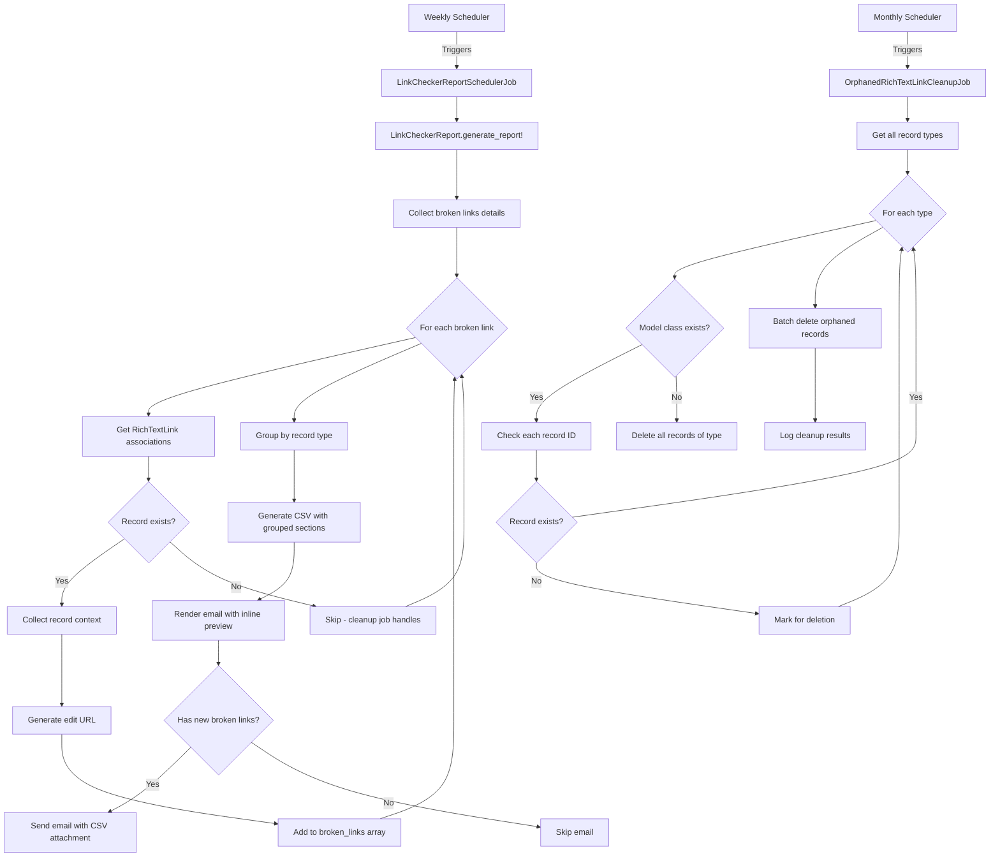

# Link Checker Report Enhancements - Implementation Plan

**Date:** January 15, 2026  
**Status:** Planning  
**Priority:** High - Improves actionability of weekly link checker reports

---

## Executive Summary

The current link checker report only shows broken links grouped by host, but doesn't tell recipients which records contain the broken links or how to fix them. This enhancement adds detailed context about where broken links are found (Person descriptions, Community pages, Content Blocks, etc.) with direct edit URLs for quick access.

Additionally, a monthly cleanup job will remove orphaned RichTextLink records where the associated record has been deleted.

---

## Objectives

### Primary Goals
1. **Actionable Reports**: Provide recipients with enough context to quickly identify and fix broken links
2. **Direct Navigation**: Include edit URLs for each record containing broken links
3. **Organized Presentation**: Group broken links by record type for easier delegation
4. **Data Hygiene**: Automatically clean up orphaned link references monthly

### Success Criteria
- ✅ Email contains inline preview of broken links grouped by record type
- ✅ Each broken link includes: record type, identifier, field name, and edit URL
- ✅ Recipients can click directly from email to edit view
- ✅ Deleted records are excluded from reports (handled by cleanup job)
- ✅ CSV export provides complete breakdown with all context
- ✅ Monthly job removes orphaned RichTextLink records

---

## Current State

### Existing Report Structure
**Model:** `BetterTogether::Metrics::LinkCheckerReport`
- Generates reports with:
  - `by_host`: Link counts grouped by host
  - `invalid_by_host`: Broken link counts by host  
  - `failures_daily`: Broken links by date

**Email Output:**
- Generic greeting and attachment notice
- CSV with host-level summaries only
- No record context or edit URLs

**Limitations:**
- No information about which records contain broken links
- No way to navigate directly to fix issues
- Recipients must manually search for broken links
- Deleted records cause confusion in reports

---

## Design Decisions

### 1. Record Context Collection
**Decision:** Enhance `generate_report!` to collect detailed broken link information via RichTextLink associations

**Rationale:**
- RichTextLink table already contains polymorphic associations to source records
- Can access `rich_text_record_type` and `rich_text_record_id`
- Rich text field name available via `ActionText::RichText#name`

**Implementation:**
```ruby
broken_links_details = collect_broken_links_details(base_scope)

self.report_data = {
  by_host: by_host,
  invalid_by_host: invalid_by_host,
  failures_daily: failures_daily,
  broken_links: broken_links_details  # New detailed data
}
```

### 2. Handling Deleted Records
**Decision:** Skip deleted records in reports; handle cleanup separately via monthly job

**Rationale:**
- Reports should focus only on actionable items
- Deleted records cannot be edited, so showing them adds noise
- Separate cleanup job maintains data integrity without cluttering reports
- Allows admins to track orphaned data removal

**Implementation:**
- Report collection: `next unless record` (skips nil records)
- Cleanup job: Monthly background task removes orphaned RichTextLinks

### 3. Edit URL Generation
**Decision:** Generate full absolute URLs with host from Platform settings

**Rationale:**
- Emails need absolute URLs to be clickable
- Platform.host_url already handles environment differences (dev/staging/prod)
- On failure, show "N/A" rather than breaking report generation

**Implementation:**
```ruby
def edit_url_for(record)
  platform = BetterTogether::Platform.host.first
  host = platform.host_url.gsub(%r{^https?://}, '')
  protocol = platform.host_url.start_with?('https') ? 'https' : 'http'
  
  edit_person_url(record, locale: I18n.default_locale, host: host, protocol: protocol)
rescue StandardError => e
  Rails.logger.warn "Failed to generate edit URL: #{e.message}"
  nil  # Will display as 'N/A'
end
```

### 4. Email Presentation
**Decision:** Group broken links by record type with inline preview (top 5 per type)

**Rationale:**
- Makes it easy to delegate fixes to different team members
- Person descriptions → Profile management team
- Community pages → Community managers
- Content blocks → Content team
- Inline preview allows quick assessment without opening CSV
- Full details still available in CSV attachment

**Email Structure:**
```
Greeting
Summary (total broken links)

--- Person (3 links) ---
[Table with top 5]
More in CSV...

--- Community (2 links) ---
[Table with top 5]

--- Content Block (7 links) ---
[Table with top 5]
More in CSV...

CSV Attachment
```

### 5. CSV Organization
**Decision:** Organize CSV with grouped sections by record type

**Rationale:**
- Mirrors email structure for consistency
- Makes it easy to filter/sort in spreadsheet software
- Clear sections for different teams

**CSV Structure:**
```csv
Link Checker Report Summary
Generated, 2026-01-15 02:00 UTC
Total Broken Links, 12

Broken Links by Record Type

PERSON (3 broken links)
Record, Field, Broken URL, Status, Error, Last Checked, Edit URL, Instructions
John Doe, Description, http://dead.link, 404, Not Found, 2026-01-14, https://..., Edit Person profile

COMMUNITY (2 broken links)
...

CONTENT BLOCK (7 broken links)
...

Summary by Host
...

Failures by Date
...
```

---

## Implementation Steps

### Phase 1: Enhance Report Model

#### 1.1 Update LinkCheckerReport Model
**File:** `app/models/better_together/metrics/link_checker_report.rb`

**Changes:**
- Include URL helper modules
- Add `collect_broken_links_details` method
- Add `broken_links_grouped_by_type` helper
- Add helper methods: `record_identifier`, `field_name_from_rich_text`, `edit_instructions_for`, `edit_url_for`
- Update `generate_report!` to collect detailed data
- Update `generate_csv_file` to include grouped sections with detailed columns

**New Methods:**
```ruby
# Include URL helpers for generating edit links
include Rails.application.routes.url_helpers
include BetterTogether::Engine.routes.url_helpers

def broken_links_grouped_by_type
  # Groups broken_links array by record_type
end

private

def collect_broken_links_details(base_scope)
  # Query broken links with rich_text_link associations
  # Build array of hashes with full context
  # Skip deleted records (record.nil?)
end

def humanize_record_type(type)
  # "BetterTogether::Person" -> "Person"
end

def record_identifier(record)
  # Returns name, title, identifier, or ID
end

def field_name_from_rich_text(rich_text, record)
  # Extracts field name from rich_text.name
end

def edit_instructions_for(record)
  # Returns user-friendly edit instructions
end

def edit_url_for(record)
  # Generates absolute edit URL with host from Platform
  # Returns nil on failure (displays as 'N/A')
end
```

**Data Structure:**
```ruby
{
  'record_type' => 'Person',
  'record_identifier' => 'John Doe',
  'field_name' => 'Description',
  'url' => 'http://broken.link',
  'status_code' => '404',
  'error_message' => 'Not Found',
  'last_checked_at' => '2026-01-14 15:30 UTC',
  'edit_instructions' => 'Edit Person profile (John Doe)',
  'edit_url' => 'https://example.com/en/people/123/edit'
}
```

### Phase 2: Enhance Email Templates

#### 2.1 Update HTML Email Template
**File:** `app/views/better_together/metrics/report_mailer/link_checker_report.html.erb`

**Features:**
- Summary with total broken link count
- Grouped sections by record type
- Inline table for top 5 per type
- Clickable "Edit →" buttons with edit URLs
- Status codes color-coded (4xx/5xx in red)
- "N/A" for failed URL generation with fallback to instructions
- Indicator when more records exist in CSV

**Styling:**
- Bootstrap-style tables with borders
- Blue action buttons for edit links
- Responsive layout
- Truncated URLs to prevent layout breaking

#### 2.2 Update Text Email Template
**File:** `app/views/better_together/metrics/report_mailer/link_checker_report.text.erb`

**Features:**
- Plain text version of grouped structure
- Numbered lists for readability
- Clear section separators
- Edit URLs on separate lines
- "Showing X of Y" indicators

### Phase 3: Create Orphaned Link Cleanup Job

#### 3.1 Create OrphanedRichTextLinkCleanupJob
**File:** `app/jobs/better_together/metrics/orphaned_rich_text_link_cleanup_job.rb`

**Purpose:** Remove RichTextLink records where the associated record has been deleted

**Logic:**
1. Get all distinct `rich_text_record_type` values from RichTextLinks
2. For each type:
   - Constantize to get model class
   - Find all RichTextLinks for that type
   - Check if each `rich_text_record_id` still exists
   - Batch delete orphaned records
3. Handle missing model classes (delete all records of that type)
4. Log cleanup results

**Error Handling:**
- Catch `NameError` for non-existent model classes
- Batch delete records for missing models
- Log warnings for missing models
- Log info for cleanup counts

**Queue:** `maintenance`

#### 3.2 Add Monthly Schedule
**File:** `config/sidekiq_scheduler.yml`

```yaml
"better_together:metrics:orphaned_link_cleanup_monthly":
  cron: "0 3 1 * *" # monthly on the 1st at 03:00 UTC
  class: "BetterTogether::Metrics::OrphanedRichTextLinkCleanupJob"
  queue: "maintenance"
  description: "Remove orphaned RichTextLink records where the associated record has been deleted"
```

#### 3.3 Add Rake Task for Manual Cleanup
**File:** `lib/tasks/link_checker_reports.rake`

```ruby
desc 'Clean up orphaned RichTextLink records (where associated record has been deleted)'
task cleanup_orphaned_links: :environment do
  puts "Starting orphaned RichTextLink cleanup..."
  BetterTogether::Metrics::OrphanedRichTextLinkCleanupJob.perform_now
  puts "Cleanup completed"
end
```

### Phase 4: Testing

#### 4.1 Update Model Tests
**File:** `spec/models/better_together/metrics/link_checker_report_spec.rb`

**New Tests:**
- Test `broken_links_grouped_by_type` grouping logic
- Test `collect_broken_links_details` with various record types
- Test deleted record exclusion
- Test URL generation for each record type
- Test URL generation failure handling
- Test helper methods (record_identifier, field_name_from_rich_text, etc.)

#### 4.2 Create Cleanup Job Tests
**File:** `spec/jobs/better_together/metrics/orphaned_rich_text_link_cleanup_job_spec.rb`

**Test Scenarios:**
- Removes orphaned records (where record deleted)
- Keeps valid records (where record exists)
- Handles non-existent model classes
- Logs cleanup counts correctly
- Handles empty results (no orphans)

#### 4.3 Update Integration Tests
**File:** `spec/requests/better_together/metrics/link_checker_reports_controller_spec.rb`

**Test Scenarios:**
- Report generation includes detailed broken links data
- CSV contains grouped sections
- Email sent with proper record context

#### 4.4 Create Email Preview Tests
**Test rendered email output:**
- HTML email contains grouped tables
- Text email contains grouped sections
- Edit URLs are properly formatted
- Deleted records are excluded

### Phase 5: Documentation

#### 5.1 Update README
**File:** `config/sidekiq_cron.README.md`

Add documentation for:
- New orphaned link cleanup job
- Monthly schedule
- Manual rake task

#### 5.2 Update Rich Text Link Checker Documentation
**File:** `docs/rich_text_link_checker.md`

Add sections for:
- Report enhancement features
- Edit URL generation
- Orphaned link cleanup process
- Maintenance schedule

---

## Data Flow Diagram



---

## Record Type Handling

### Supported Record Types

| Record Type | Identifier Field | Edit Route | Example URL |
|-------------|-----------------|------------|-------------|
| Person | `name` | `edit_person_path` | `/en/people/123/edit` |
| Community | `name` | `edit_community_path` | `/en/communities/456/edit` |
| Content::Block | `identifier` or `id` | `edit_content_block_path` | `/en/content/blocks/789/edit` |
| Page | `title` or `url` | `edit_page_path` | `/en/pages/101/edit` |
| Post | `title` | `edit_post_path` | `/en/posts/202/edit` |
| Other | `id` | `polymorphic_url` | Attempts generic edit route |

### Fallback Strategy

1. **Record Identifier:** name → title → identifier → "ID: #{id}"
2. **Field Name:** `rich_text.name.humanize` → "Unknown"
3. **Edit URL:** Record-specific route → polymorphic route → nil (shows "N/A")
4. **Instructions:** Record-specific → Generic "Edit #{class} record"

---

## Email Examples

### HTML Email Preview

```html
<h3>Broken Links by Record Type</h3>
<p><strong>Total broken links: 12</strong></p>

<h4>Person (3 links)</h4>
<table>
  <tr>
    <td>John Doe</td>
    <td>Description</td>
    <td>http://dead.link</td>
    <td>404</td>
    <td><a href="https://example.com/en/people/123/edit">Edit →</a></td>
  </tr>
  ...
</table>

<h4>Community (2 links)</h4>
...

<h4>Content Block (7 links)</h4>
...
<p><em>Showing 5 of 7 Content Block records. See CSV for complete list.</em></p>
```

### Text Email Preview

```
BROKEN LINKS BY RECORD TYPE
====================================

Total broken links: 12

--- PERSON (3 links) ---

1. John Doe
   Field: Description
   Broken URL: http://dead.link
   Status: 404
   Edit: https://example.com/en/people/123/edit

...

--- COMMUNITY (2 links) ---
...
```

---

## Performance Considerations

### Query Optimization
- Use `includes(rich_text_links: [:rich_text, :rich_text_record])` to avoid N+1 queries
- Use `find_each` for batch processing large result sets
- Cleanup job uses batch deletion for efficiency

### Email Size
- Inline preview limited to top 5 per record type
- Prevents excessively large emails
- Complete data available in CSV attachment

### Cleanup Job Efficiency
- Runs monthly (low frequency)
- Uses batch operations
- Handles non-existent models gracefully
- Logs results for monitoring

---

## Security Considerations

### URL Generation
- Uses Platform's configured host (environment-aware)
- Respects authorization via edit routes (Pundit policies apply)
- No sensitive data in URLs (only record IDs)

### Email Recipients
- Sent to `ApplicationMailer.default[:from]` (admin address)
- No PII in email content (only record names/titles)
- Edit URLs require authentication to access

---

## Rollout Plan

### Phase 1: Development
- [ ] Implement model enhancements
- [ ] Update email templates  
- [ ] Create cleanup job
- [ ] Write comprehensive tests
- [ ] Update documentation

### Phase 2: Testing
- [ ] Test with real broken link data
- [ ] Verify URL generation for all record types
- [ ] Test email rendering in multiple clients
- [ ] Verify cleanup job removes orphans correctly
- [ ] Load test with large datasets

### Phase 3: Deployment
- [ ] Deploy to staging environment
- [ ] Trigger test report generation
- [ ] Review email output
- [ ] Run cleanup job manually
- [ ] Monitor logs for errors

### Phase 4: Production
- [ ] Deploy to production
- [ ] Monitor first weekly report
- [ ] Monitor first monthly cleanup
- [ ] Gather feedback from recipients
- [ ] Adjust grouping/limits if needed

---

## Success Metrics

### Report Quality
- ✅ 100% of broken links include record context
- ✅ Edit URLs generated for 95%+ of records
- ✅ Email size stays under 1MB
- ✅ Recipients can fix issues within 2 clicks

### Data Hygiene
- ✅ Orphaned RichTextLinks reduced to near-zero monthly
- ✅ No errors in cleanup job execution
- ✅ Cleanup completes within 5 minutes

### User Satisfaction
- ✅ Reduced time to identify broken link sources
- ✅ Reduced back-and-forth with admins
- ✅ Increased broken link fix rate

---

## Future Enhancements

### Potential Improvements
1. **Priority Scoring:** Flag high-traffic pages with broken links
2. **Auto-Fix Suggestions:** Common URL migrations (http→https, domain changes)
3. **Trend Analysis:** Show if broken links are increasing/decreasing over time
4. **Team Assignment:** Auto-assign broken links to record owners
5. **Slack/Discord Integration:** Send summaries to team channels
6. **Dashboard View:** Web UI for viewing broken links interactively

---

## Appendix A: File Checklist

### New Files
- [ ] `app/jobs/better_together/metrics/orphaned_rich_text_link_cleanup_job.rb`
- [ ] `spec/jobs/better_together/metrics/orphaned_rich_text_link_cleanup_job_spec.rb`

### Modified Files
- [ ] `app/models/better_together/metrics/link_checker_report.rb`
- [ ] `app/views/better_together/metrics/report_mailer/link_checker_report.html.erb`
- [ ] `app/views/better_together/metrics/report_mailer/link_checker_report.text.erb`
- [ ] `config/sidekiq_scheduler.yml`
- [ ] `lib/tasks/link_checker_reports.rake`
- [ ] `spec/models/better_together/metrics/link_checker_report_spec.rb`
- [ ] `config/sidekiq_cron.README.md`
- [ ] `docs/rich_text_link_checker.md`

---

## Appendix B: Translation Keys

### New Translation Keys Needed

**English (en.yml):**
```yaml
better_together:
  metrics:
    mailer:
      link_checker_report:
        summary_header: "Broken Links by Record Type"
        total_count: "Total broken links: %{count}"
        showing_partial: "Showing %{shown} of %{total} %{type} records with broken links."
        see_csv: "See attached CSV for complete list."
        table_headers:
          record: "Record"
          field: "Field"
          broken_url: "Broken URL"
          status: "Status"
          action: "Action"
        actions:
          edit: "Edit →"
          manual_edit: "Manual edit required"
```

Similar translations needed for: es.yml, fr.yml, uk.yml

---

## Appendix C: Example CSV Output

```csv
Link Checker Report Summary
Generated,2026-01-15 02:00 UTC
Total Broken Links,12

Broken Links by Record Type

PERSON (3 broken links)
Record,Field,Broken URL,Status,Error,Last Checked,Edit URL,Instructions
John Doe,Description,http://old-site.com,404,Not Found,2026-01-14 15:30 UTC,https://example.com/en/people/abc-123/edit,Edit Person profile (John Doe)
Jane Smith,Bio,http://dead.link,Connection refused,Connection refused,2026-01-13 10:00 UTC,https://example.com/en/people/def-456/edit,Edit Person profile (Jane Smith)
Bob Wilson,About,http://broken.com,SSL Error,SSL certificate verify failed,2026-01-12 08:00 UTC,https://example.com/en/people/ghi-789/edit,Edit Person profile (Bob Wilson)

COMMUNITY (2 broken links)
Record,Field,Broken URL,Status,Error,Last Checked,Edit URL,Instructions
Seattle Tech,Description,http://old-forum.com,404,Not Found,2026-01-14 12:00 UTC,https://example.com/en/communities/xyz-111/edit,Edit Community (Seattle Tech)
Portland Design,Welcome Message,http://moved.site,301,Moved Permanently,2026-01-13 09:00 UTC,https://example.com/en/communities/xyz-222/edit,Edit Community (Portland Design)

CONTENT BLOCK (7 broken links)
...

Summary by Host
Host,Total Links,Invalid Links
old-site.com,10,3
dead.link,5,2
broken.com,3,1
...

Failures by Date
Date,Invalid Count
2026-01-14,5
2026-01-13,4
2026-01-12,3
```

---

**End of Implementation Plan**
