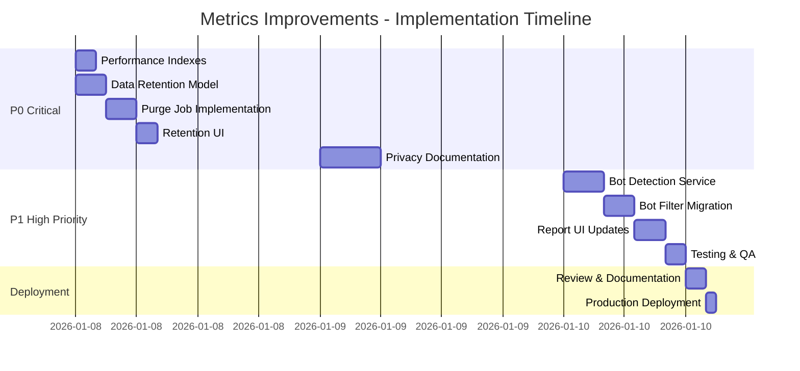

# Metrics System Improvements - Implementation Plan

**Date:** January 8, 2026  
**Status:** Ready for Implementation  
**Priority:** P0/P1 - Critical System Improvements  
**Total Estimated Effort:** 28 hours

---

## Table of Contents

1. [Stakeholder Requirements](#stakeholder-requirements)
2. [User Stories by Priority](#user-stories-by-priority)
3. [Implementation Roadmap](#implementation-roadmap)
4. [P0.1: Automated Data Retention](#p01-automated-data-retention)
5. [P0.2: Performance Indexes](#p02-performance-indexes)
6. [P0.3: Privacy Documentation](#p03-privacy-documentation)
7. [P1: Bot Filtering](#p1-bot-filtering)
8. [Testing Strategy](#testing-strategy)
9. [Migration & Rollout](#migration--rollout)
10. [Success Criteria](#success-criteria)

---

## Stakeholder Requirements

### Stakeholder Groups Affected

1. **Platform Organizers** (Primary)
   - Need GDPR/CCPA compliance assurance
   - Need configurable data retention policies
   - Need clear privacy documentation for members
   - Need accurate metrics without bot pollution

2. **Legal/Compliance Team** (Critical)
   - Need automated retention enforcement
   - Need audit trails for data deletion
   - Need privacy policy templates
   - Need compliance documentation

3. **Analytics Viewers** (Secondary)
   - Need fast report generation
   - Need accurate data (bot-free)
   - Need confidence in data quality

4. **End Users/Community Members** (Tertiary)
   - Need transparency about data collection
   - Need assurance of privacy protection
   - Need ability to understand data retention

5. **Platform Developers/DevOps** (Secondary)
   - Need maintainable automation
   - Need performant queries
   - Need clear documentation
   - Need safe migration paths

---

## User Stories by Priority

### P0.1: Automated Data Retention (8 hours)

#### US-MET-001: Platform Organizer - Configure Retention
**As a** Platform Organizer  
**I want** to configure how long metrics data is retained  
**So that** I can comply with privacy regulations and my organization's policies

**Acceptance Criteria:**
- ✅ Can set retention period for raw metrics (default: 730 days / 2 years)
- ✅ Can set retention period for CSV exports (default: 90 days)
- ✅ Can override defaults per platform
- ✅ Settings are stored in database
- ✅ Settings UI is accessible from Platform management page
- ✅ Changes take effect on next scheduled purge
- ✅ Cannot set retention below 30 days (safety limit)

#### US-MET-002: Legal/Compliance - Automatic Purging
**As a** Legal/Compliance Officer  
**I want** old metrics data to be automatically deleted  
**So that** we maintain compliance without manual intervention

**Acceptance Criteria:**
- ✅ Scheduled job runs daily at 2 AM (configurable)
- ✅ Purges metrics older than retention period
- ✅ Purges reports older than export retention period
- ✅ Uses batch deletion to avoid long transactions
- ✅ Logs deletion counts to Rails logger
- ✅ Creates audit log entry for compliance tracking
- ✅ Sends notification to platform managers on completion
- ✅ Handles failures gracefully with retry logic

#### US-MET-003: Platform Organizer - Audit Trail
**As a** Platform Organizer  
**I want** to see when data was automatically deleted  
**So that** I can verify compliance and respond to audits

**Acceptance Criteria:**
- ✅ Audit log shows date, record counts, retention settings used
- ✅ Accessible from platform management interface
- ✅ Filterable by date range
- ✅ Exportable as CSV for auditors
- ✅ Retained for 7 years (compliance requirement)

### P0.2: Performance Indexes (2 hours)

#### US-MET-004: Analytics Viewer - Fast Reports
**As an** Analytics Viewer  
**I want** reports to generate quickly  
**So that** I can analyze data without long waits

**Acceptance Criteria:**
- ✅ Page view report generation completes in <5 seconds for 100K records
- ✅ Link click report generation completes in <5 seconds for 100K records
- ✅ Date range filtering uses indexes
- ✅ No full table scans on metrics tables
- ✅ EXPLAIN ANALYZE shows index usage

#### US-MET-005: Platform Developer - Query Performance
**As a** Platform Developer  
**I want** metrics queries to use appropriate indexes  
**So that** the system remains performant as data grows

**Acceptance Criteria:**
- ✅ All timestamp columns have indexes
- ✅ URL columns in link_clicks have indexes
- ✅ Query column in search_queries has index
- ✅ Migration runs safely in production
- ✅ No downtime required for index creation

### P0.3: Privacy Documentation (6 hours)

#### US-MET-006: Platform Organizer - Privacy Policy Guidance
**As a** Platform Organizer  
**I want** clear guidance on privacy policy requirements  
**So that** I can inform community members accurately

**Acceptance Criteria:**
- ✅ Privacy policy template provided
- ✅ Explains what Better Together tracks (and doesn't track)
- ✅ Covers GDPR, CCPA, and regional privacy laws
- ✅ Includes required disclosure language
- ✅ Provides examples for common scenarios

#### US-MET-007: Platform Organizer - Third-Party Integration Guide
**As a** Platform Organizer  
**I want** guidance on adding third-party analytics tools  
**So that** I can make informed privacy decisions

**Acceptance Criteria:**
- ✅ Documents privacy implications of Google Analytics, Sentry, etc.
- ✅ Provides cookie consent banner guidance
- ✅ Explains IP anonymization requirements
- ✅ Shows privacy-preserving configuration examples
- ✅ Includes compliance checklist

#### US-MET-008: Legal/Compliance - Data Subject Rights
**As a** Legal/Compliance Officer  
**I want** clear procedures for handling data subject requests  
**So that** we can respond to access/deletion requests properly

**Acceptance Criteria:**
- ✅ Documents right to access (data export procedures)
- ✅ Documents right to deletion (purge procedures)
- ✅ Documents right to portability (CSV export process)
- ✅ Provides response timeline guidance (30 days GDPR)
- ✅ Includes template response letters

### P1: Bot Filtering (12 hours)

#### US-MET-009: Analytics Viewer - Accurate Metrics
**As an** Analytics Viewer  
**I want** bot traffic excluded from metrics  
**So that** I can trust the data represents real user engagement

**Acceptance Criteria:**
- ✅ Search engine crawlers are not counted in page views
- ✅ Known bots (Googlebot, Bingbot, etc.) are filtered
- ✅ Can optionally include/exclude bots in reports
- ✅ Bot detection is accurate (>95% for known bots)
- ✅ False positive rate is low (<1%)

#### US-MET-010: Platform Developer - Bot Detection Service
**As a** Platform Developer  
**I want** a maintainable bot detection service  
**So that** bot filtering stays effective as new bots emerge

**Acceptance Criteria:**
- ✅ User-agent based detection for known bots
- ✅ Configurable bot pattern list
- ✅ Graceful degradation if user-agent unavailable
- ✅ Logging of detected bots for monitoring
- ✅ Performance impact <10ms per request

#### US-MET-011: Analytics Viewer - Bot Filtering UI
**As an** Analytics Viewer  
**I want** to choose whether to include bots in reports  
**So that** I can analyze both real engagement and total traffic

**Acceptance Criteria:**
- ✅ Report filter UI includes "Include bot traffic" checkbox
- ✅ Default is to exclude bots
- ✅ Report metadata shows whether bots were filtered
- ✅ CSV exports include filter settings in filename

---

## Implementation Roadmap



---

## P0.1: Automated Data Retention

### Implementation Steps

#### Step 1: Create Metrics Settings Model (1 hour)

**Models to create:**

```ruby
# app/models/better_together/settings/metrics.rb
module BetterTogether
  module Settings
    class Metrics < ApplicationRecord
      self.table_name = 'better_together_settings_metrics'
      
      belongs_to :platform, class_name: 'BetterTogether::Platform'
      
      # Validations
      validates :retention_days, presence: true, 
                numericality: { greater_than_or_equal_to: 30 }
      validates :export_retention_days, presence: true,
                numericality: { greater_than_or_equal_to: 7 }
      validates :purge_schedule, presence: true
      
      # Defaults
      attribute :retention_days, :integer, default: 730 # 2 years
      attribute :export_retention_days, :integer, default: 90
      attribute :purge_schedule, :string, default: '0 2 * * *' # 2 AM daily
      attribute :purge_enabled, :boolean, default: true
      attribute :notify_on_purge, :boolean, default: true
      
      # Class method for safe defaults
      def self.permitted_attributes
        %i[
          retention_days
          export_retention_days
          purge_schedule
          purge_enabled
          notify_on_purge
        ]
      end
      
      # Instance methods
      def retention_date
        retention_days.days.ago
      end
      
      def export_retention_date
        export_retention_days.days.ago
      end
    end
  end
end
```

**Migration:**

```ruby
# db/migrate/YYYYMMDDHHMMSS_create_better_together_settings_metrics.rb
class CreateBetterTogetherSettingsMetrics < ActiveRecord::Migration[7.2]
  def change
    create_bt_table :settings_metrics do |t|
      t.bt_references :platform, null: false
      
      t.integer :retention_days, null: false, default: 730
      t.integer :export_retention_days, null: false, default: 90
      t.string :purge_schedule, null: false, default: '0 2 * * *'
      t.boolean :purge_enabled, null: false, default: true
      t.boolean :notify_on_purge, null: false, default: true
      
      t.index :platform_id, unique: true
    end
  end
end
```

**Tests:**

```ruby
# spec/models/better_together/settings/metrics_spec.rb
require 'rails_helper'

RSpec.describe BetterTogether::Settings::Metrics, type: :model do
  describe 'associations' do
    it { is_expected.to belong_to(:platform) }
  end
  
  describe 'validations' do
    it { is_expected.to validate_presence_of(:retention_days) }
    it { is_expected.to validate_presence_of(:export_retention_days) }
    it { is_expected.to validate_presence_of(:purge_schedule) }
    
    it 'requires retention_days >= 30' do
      settings = build(:metrics_settings, retention_days: 29)
      expect(settings).not_to be_valid
      expect(settings.errors[:retention_days]).to be_present
    end
    
    it 'requires export_retention_days >= 7' do
      settings = build(:metrics_settings, export_retention_days: 6)
      expect(settings).not_to be_valid
      expect(settings.errors[:export_retention_days]).to be_present
    end
  end
  
  describe 'defaults' do
    let(:settings) { create(:metrics_settings) }
    
    it 'defaults retention_days to 730 (2 years)' do
      expect(settings.retention_days).to eq(730)
    end
    
    it 'defaults export_retention_days to 90' do
      expect(settings.export_retention_days).to eq(90)
    end
    
    it 'defaults purge_schedule to 2 AM daily' do
      expect(settings.purge_schedule).to eq('0 2 * * *')
    end
    
    it 'defaults purge_enabled to true' do
      expect(settings.purge_enabled).to be true
    end
  end
  
  describe '#retention_date' do
    it 'returns date based on retention_days' do
      settings = build(:metrics_settings, retention_days: 365)
      expect(settings.retention_date).to be_within(1.second).of(365.days.ago)
    end
  end
  
  describe '#export_retention_date' do
    it 'returns date based on export_retention_days' do
      settings = build(:metrics_settings, export_retention_days: 90)
      expect(settings.export_retention_date).to be_within(1.second).of(90.days.ago)
    end
  end
end
```

**Factory:**

```ruby
# spec/factories/better_together/settings/metrics.rb
FactoryBot.define do
  factory :metrics_settings, class: 'BetterTogether::Settings::Metrics' do
    association :platform, factory: :platform
    retention_days { 730 }
    export_retention_days { 90 }
    purge_schedule { '0 2 * * *' }
    purge_enabled { true }
    notify_on_purge { true }
  end
end
```

#### Step 2: Create Metrics Audit Log Model (1 hour)

**Model:**

```ruby
# app/models/better_together/metrics/audit_log.rb
module BetterTogether
  module Metrics
    class AuditLog < ApplicationRecord
      self.table_name = 'better_together_metrics_audit_logs'
      
      belongs_to :platform, class_name: 'BetterTogether::Platform'
      
      # Validations
      validates :action, presence: true
      validates :executed_at, presence: true
      validates :record_counts, presence: true
      
      # Enums
      enum action: {
        purge_scheduled: 'purge_scheduled',
        purge_completed: 'purge_completed',
        purge_failed: 'purge_failed'
      }, _suffix: true
      
      # Serialize JSON
      attribute :record_counts, :jsonb, default: {}
      attribute :settings_snapshot, :jsonb, default: {}
      attribute :error_details, :jsonb, default: {}
      
      # Scopes
      scope :recent, -> { order(executed_at: :desc) }
      scope :successful, -> { where(action: 'purge_completed') }
      scope :failed, -> { where(action: 'purge_failed') }
      
      # Instance methods
      def total_records_deleted
        record_counts.values.sum
      end
    end
  end
end
```

**Migration:**

```ruby
# db/migrate/YYYYMMDDHHMMSS_create_better_together_metrics_audit_logs.rb
class CreateBetterTogetherMetricsAuditLogs < ActiveRecord::Migration[7.2]
  def change
    create_bt_table :metrics_audit_logs do |t|
      t.bt_references :platform, null: false
      
      t.string :action, null: false
      t.datetime :executed_at, null: false
      t.jsonb :record_counts, null: false, default: {}
      t.jsonb :settings_snapshot, null: false, default: {}
      t.jsonb :error_details, default: {}
      
      t.index :action
      t.index :executed_at
      t.index :record_counts, using: :gin
    end
  end
end
```

#### Step 3: Create Purge Job (2 hours)

**Job:**

```ruby
# app/jobs/better_together/metrics/purge_old_metrics_job.rb
module BetterTogether
  module Metrics
    class PurgeOldMetricsJob < MetricsJob
      queue_as :low_priority
      
      def perform(platform_id = nil)
        platform = find_platform(platform_id)
        return unless platform
        
        settings = platform.metrics_settings || create_default_settings(platform)
        return unless settings.purge_enabled?
        
        log_purge_start(platform, settings)
        
        record_counts = {
          page_views: purge_page_views(settings),
          link_clicks: purge_link_clicks(settings),
          shares: purge_shares(settings),
          downloads: purge_downloads(settings),
          search_queries: purge_search_queries(settings),
          page_view_reports: purge_page_view_reports(settings),
          link_click_reports: purge_link_click_reports(settings),
          link_checker_reports: purge_link_checker_reports(settings)
        }
        
        log_purge_completion(platform, settings, record_counts)
        notify_platform_managers(platform, record_counts) if settings.notify_on_purge?
        
      rescue StandardError => e
        log_purge_failure(platform, settings, e)
        raise
      end
      
      private
      
      def find_platform(platform_id)
        if platform_id
          Platform.find_by(id: platform_id)
        else
          Platform.find_by(host: true)
        end
      end
      
      def create_default_settings(platform)
        Settings::Metrics.create!(platform: platform)
      end
      
      def purge_page_views(settings)
        PageView.where('viewed_at < ?', settings.retention_date)
                .in_batches(of: 1000)
                .delete_all
      end
      
      def purge_link_clicks(settings)
        LinkClick.where('clicked_at < ?', settings.retention_date)
                 .in_batches(of: 1000)
                 .delete_all
      end
      
      def purge_shares(settings)
        Share.where('shared_at < ?', settings.retention_date)
             .in_batches(of: 1000)
             .delete_all
      end
      
      def purge_downloads(settings)
        Download.where('downloaded_at < ?', settings.retention_date)
                .in_batches(of: 1000)
                .delete_all
      end
      
      def purge_search_queries(settings)
        SearchQuery.where('searched_at < ?', settings.retention_date)
                   .in_batches(of: 1000)
                   .delete_all
      end
      
      def purge_page_view_reports(settings)
        count = 0
        PageViewReport.where('created_at < ?', settings.export_retention_date)
                      .find_each do |report|
          report.destroy # Triggers after_destroy to purge attached file
          count += 1
        end
        count
      end
      
      def purge_link_click_reports(settings)
        count = 0
        LinkClickReport.where('created_at < ?', settings.export_retention_date)
                       .find_each do |report|
          report.destroy
          count += 1
        end
        count
      end
      
      def purge_link_checker_reports(settings)
        count = 0
        LinkCheckerReport.where('created_at < ?', settings.export_retention_date)
                         .find_each do |report|
          report.destroy
          count += 1
        end
        count
      end
      
      def log_purge_start(platform, settings)
        Rails.logger.info "[MetricsPurge] Starting purge for platform #{platform.id}"
        Rails.logger.info "[MetricsPurge] Retention: #{settings.retention_days} days"
        Rails.logger.info "[MetricsPurge] Export retention: #{settings.export_retention_days} days"
      end
      
      def log_purge_completion(platform, settings, record_counts)
        total = record_counts.values.sum
        
        Rails.logger.info "[MetricsPurge] Completed purge for platform #{platform.id}"
        Rails.logger.info "[MetricsPurge] Total records deleted: #{total}"
        record_counts.each do |table, count|
          Rails.logger.info "[MetricsPurge]   #{table}: #{count}"
        end
        
        AuditLog.create!(
          platform: platform,
          action: 'purge_completed',
          executed_at: Time.current,
          record_counts: record_counts.transform_keys(&:to_s),
          settings_snapshot: {
            retention_days: settings.retention_days,
            export_retention_days: settings.export_retention_days
          }
        )
      end
      
      def log_purge_failure(platform, settings, error)
        Rails.logger.error "[MetricsPurge] Failed purge for platform #{platform.id}: #{error.message}"
        Rails.logger.error error.backtrace.join("\n")
        
        AuditLog.create!(
          platform: platform,
          action: 'purge_failed',
          executed_at: Time.current,
          record_counts: {},
          settings_snapshot: {
            retention_days: settings.retention_days,
            export_retention_days: settings.export_retention_days
          },
          error_details: {
            message: error.message,
            backtrace: error.backtrace.first(10)
          }
        )
      end
      
      def notify_platform_managers(platform, record_counts)
        # TODO: Implement notification to platform managers
        # Use Noticed gem to send notification
      end
    end
  end
end
```

#### Step 4: Add UI for Retention Settings (2 hours)

**Controller action:**

```ruby
# app/controllers/better_together/platforms_controller.rb
module BetterTogether
  class PlatformsController < ApplicationController
    # ... existing code ...
    
    def update_metrics_settings
      @platform = Platform.find(params[:id])
      authorize @platform, :update?
      
      settings = @platform.metrics_settings || @platform.build_metrics_settings
      
      if settings.update(metrics_settings_params)
        flash[:success] = t('.success')
        redirect_to platform_path(@platform)
      else
        flash.now[:error] = t('.error')
        render :edit
      end
    end
    
    private
    
    def metrics_settings_params
      params.require(:metrics_settings)
            .permit(Settings::Metrics.permitted_attributes)
    end
  end
end
```

**View partial:**

```erb
<%# app/views/better_together/platforms/_metrics_settings.html.erb %>
<%= turbo_frame_tag 'metrics-settings' do %>
  <div class="card mb-4">
    <div class="card-header">
      <h4><%= t('.title') %></h4>
    </div>
    <div class="card-body">
      <%= form_with(
        model: @platform.metrics_settings || @platform.build_metrics_settings,
        url: update_metrics_settings_platform_path(@platform),
        method: :patch,
        local: true
      ) do |f| %>
        
        <div class="mb-3">
          <%= f.label :retention_days, class: 'form-label' %>
          <%= f.number_field :retention_days, 
              class: 'form-control',
              min: 30,
              help: t('.retention_days_help') %>
          <div class="form-text"><%= t('.retention_days_help') %></div>
        </div>
        
        <div class="mb-3">
          <%= f.label :export_retention_days, class: 'form-label' %>
          <%= f.number_field :export_retention_days,
              class: 'form-control',
              min: 7,
              help: t('.export_retention_days_help') %>
          <div class="form-text"><%= t('.export_retention_days_help') %></div>
        </div>
        
        <div class="mb-3">
          <%= f.label :purge_schedule, class: 'form-label' %>
          <%= f.text_field :purge_schedule,
              class: 'form-control',
              placeholder: '0 2 * * *' %>
          <div class="form-text"><%= t('.purge_schedule_help') %></div>
        </div>
        
        <div class="mb-3 form-check">
          <%= f.check_box :purge_enabled, class: 'form-check-input' %>
          <%= f.label :purge_enabled, class: 'form-check-label' %>
          <div class="form-text"><%= t('.purge_enabled_help') %></div>
        </div>
        
        <div class="mb-3 form-check">
          <%= f.check_box :notify_on_purge, class: 'form-check-input' %>
          <%= f.label :notify_on_purge, class: 'form-check-label' %>
          <div class="form-text"><%= t('.notify_on_purge_help') %></div>
        </div>
        
        <div class="d-grid gap-2">
          <%= f.submit t('buttons.save'), class: 'btn btn-primary' %>
        </div>
      <% end %>
    </div>
  </div>
<% end %>
```

#### Step 5: Schedule Job with Good Job (1 hour)

**Initializer:**

```ruby
# config/initializers/good_job.rb
Rails.application.configure do
  # ... existing config ...
  
  # Schedule metrics purge
  config.good_job.cron = {
    metrics_purge: {
      cron: lambda { |platform_id = nil|
        platform = BetterTogether::Platform.find_by(id: platform_id) ||
                   BetterTogether::Platform.find_by(host: true)
        settings = platform&.metrics_settings
        settings&.purge_schedule || '0 2 * * *' # Default: 2 AM daily
      },
      class: 'BetterTogether::Metrics::PurgeOldMetricsJob',
      description: 'Purge old metrics data according to retention policy'
    }
  }
end
```

---

## P0.2: Performance Indexes

### Implementation Steps

#### Step 1: Create Index Migration (30 minutes)

**Migration:**

```ruby
# db/migrate/YYYYMMDDHHMMSS_add_performance_indexes_to_metrics.rb
class AddPerformanceIndexesToMetrics < ActiveRecord::Migration[7.2]
  disable_ddl_transaction!
  
  def change
    # Page Views
    add_index :better_together_metrics_page_views, :viewed_at,
              algorithm: :concurrently,
              name: 'idx_page_views_viewed_at'
    
    # Link Clicks
    add_index :better_together_metrics_link_clicks, :clicked_at,
              algorithm: :concurrently,
              name: 'idx_link_clicks_clicked_at'
    
    add_index :better_together_metrics_link_clicks, :url,
              algorithm: :concurrently,
              name: 'idx_link_clicks_url'
    
    add_index :better_together_metrics_link_clicks, :internal,
              algorithm: :concurrently,
              name: 'idx_link_clicks_internal'
    
    # Shares
    add_index :better_together_metrics_shares, :shared_at,
              algorithm: :concurrently,
              name: 'idx_shares_shared_at'
    
    # Downloads
    add_index :better_together_metrics_downloads, :downloaded_at,
              algorithm: :concurrently,
              name: 'idx_downloads_downloaded_at'
    
    # Search Queries
    add_index :better_together_metrics_search_queries, :searched_at,
              algorithm: :concurrently,
              name: 'idx_search_queries_searched_at'
    
    add_index :better_together_metrics_search_queries, :query,
              algorithm: :concurrently,
              name: 'idx_search_queries_query'
  end
end
```

#### Step 2: Verify Index Usage (30 minutes)

**Test script:**

```ruby
# lib/tasks/better_together/verify_metrics_indexes.rake
namespace :better_together do
  namespace :metrics do
    desc "Verify metrics indexes are being used"
    task verify_indexes: :environment do
      puts "Verifying metrics indexes..."
      
      # Test page views query
      explain = BetterTogether::Metrics::PageView
        .where('viewed_at >= ?', 30.days.ago)
        .explain
      
      if explain.include?('Index Scan') || explain.include?('Bitmap Index Scan')
        puts "✅ Page views query uses index"
      else
        puts "❌ Page views query NOT using index"
        puts explain
      end
      
      # Test link clicks query
      explain = BetterTogether::Metrics::LinkClick
        .where('clicked_at >= ?', 30.days.ago)
        .where(internal: true)
        .explain
      
      if explain.include?('Index Scan') || explain.include?('Bitmap Index Scan')
        puts "✅ Link clicks query uses index"
      else
        puts "❌ Link clicks query NOT using index"
        puts explain
      end
      
      # Test search queries
      explain = BetterTogether::Metrics::SearchQuery
        .where(query: 'test')
        .explain
      
      if explain.include?('Index Scan') || explain.include?('Bitmap Index Scan')
        puts "✅ Search queries uses index"
      else
        puts "❌ Search queries NOT using index"
        puts explain
      end
    end
  end
end
```

#### Step 3: Performance Benchmarks (1 hour)

**Benchmark script:**

```ruby
# spec/performance/metrics_query_performance_spec.rb
require 'rails_helper'
require 'benchmark'

RSpec.describe 'Metrics Query Performance', type: :performance do
  before(:all) do
    # Create test data
    @platform = create(:platform, host: true)
    
    # Create 100K page views over 90 days
    puts "Creating 100K page views..."
    100_000.times do |i|
      create(:page_view,
        viewed_at: rand(90.days.ago..Time.current),
        locale: %w[en es fr].sample
      )
      print '.' if (i % 1000).zero?
    end
    puts "\nPage views created"
  end
  
  it 'generates page view report in < 5 seconds' do
    report = BetterTogether::Metrics::PageViewReport.new(
      filters: {
        'from_date' => 30.days.ago.to_date.to_s,
        'to_date' => Date.today.to_s
      },
      file_format: 'csv',
      sort_by_total_views: true
    )
    
    benchmark = Benchmark.measure do
      report.generate_report!
    end
    
    puts "\nPage view report generation time: #{benchmark.real.round(2)}s"
    expect(benchmark.real).to be < 5.0
  end
  
  it 'queries 30-day page views in < 100ms' do
    benchmark = Benchmark.measure do
      BetterTogether::Metrics::PageView
        .where('viewed_at >= ?', 30.days.ago)
        .count
    end
    
    puts "\n30-day page view count time: #{(benchmark.real * 1000).round(2)}ms"
    expect(benchmark.real).to be < 0.1
  end
end
```

---

## P0.3: Privacy Documentation

### Implementation Steps

#### Step 1: Privacy Policy Template (2 hours)

**Create documentation file:**

```markdown
# docs/platform_organizers/privacy_policy_template.md
```

(See separate documentation creation below)

#### Step 2: Third-Party Integration Guide (2 hours)

**Create documentation file:**

```markdown
# docs/platform_organizers/third_party_analytics_guide.md
```

#### Step 3: Data Subject Rights Guide (2 hours)

**Create documentation file:**

```markdown
# docs/platform_organizers/data_subject_rights.md
```

---

## P1: Bot Filtering

### Implementation Steps

#### Step 1: Add user_agent to PageView (1 hour)

**Migration:**

```ruby
# db/migrate/YYYYMMDDHHMMSS_add_user_agent_to_metrics_page_views.rb
class AddUserAgentToMetricsPageViews < ActiveRecord::Migration[7.2]
  def change
    add_column :better_together_metrics_page_views, :user_agent, :string
    add_column :better_together_metrics_page_views, :is_bot, :boolean, default: false
    
    add_index :better_together_metrics_page_views, :is_bot,
              name: 'idx_page_views_is_bot'
  end
end
```

**Update model:**

```ruby
# app/models/better_together/metrics/page_view.rb
module BetterTogether
  module Metrics
    class PageView < ApplicationRecord
      # ... existing code ...
      
      before_save :detect_bot
      
      scope :excluding_bots, -> { where(is_bot: false) }
      scope :only_bots, -> { where(is_bot: true) }
      
      private
      
      def detect_bot
        self.is_bot = BotDetectionService.bot?(user_agent) if user_agent.present?
      end
    end
  end
end
```

#### Step 2: Create Bot Detection Service (2 hours)

**Service:**

```ruby
# app/services/better_together/metrics/bot_detection_service.rb
module BetterTogether
  module Metrics
    class BotDetectionService
      # Common bot patterns
      BOT_PATTERNS = [
        # Search engines
        /googlebot/i,
        /bingbot/i,
        /slurp/i, # Yahoo
        /duckduckbot/i,
        /baiduspider/i,
        /yandexbot/i,
        /sogou/i,
        /exabot/i,
        
        # Social media
        /facebookexternalhit/i,
        /twitterbot/i,
        /linkedinbot/i,
        /pinterest/i,
        /slackbot/i,
        /whatsapp/i,
        /telegrambot/i,
        
        # Generic bot indicators
        /bot/i,
        /crawl/i,
        /spider/i,
        /scrape/i,
        /fetch/i,
        
        # Monitoring
        /uptime/i,
        /monitor/i,
        /check_http/i,
        /pingdom/i,
        
        # Common tools
        /curl/i,
        /wget/i,
        /python-requests/i,
        /java/i, # Java HTTP clients
        /go-http-client/i,
        
        # Headless browsers (often bots)
        /headless/i,
        /phantom/i,
        /selenium/i,
        /puppeteer/i
      ].freeze
      
      class << self
        def bot?(user_agent)
          return false if user_agent.blank?
          
          # Check against known patterns
          BOT_PATTERNS.any? { |pattern| user_agent.match?(pattern) }
        end
        
        def bot_name(user_agent)
          return nil unless bot?(user_agent)
          
          # Try to extract bot name
          match = user_agent.match(/(\w+bot|\w+spider|\w+crawler)/i)
          match ? match[1] : 'Unknown Bot'
        end
      end
    end
  end
end
```

**Tests:**

```ruby
# spec/services/better_together/metrics/bot_detection_service_spec.rb
require 'rails_helper'

RSpec.describe BetterTogether::Metrics::BotDetectionService do
  describe '.bot?' do
    context 'with known bot user agents' do
      it 'detects Googlebot' do
        ua = 'Mozilla/5.0 (compatible; Googlebot/2.1; +http://www.google.com/bot.html)'
        expect(described_class.bot?(ua)).to be true
      end
      
      it 'detects Bingbot' do
        ua = 'Mozilla/5.0 (compatible; bingbot/2.0; +http://www.bing.com/bingbot.htm)'
        expect(described_class.bot?(ua)).to be true
      end
      
      it 'detects Facebook bot' do
        ua = 'facebookexternalhit/1.1 (+http://www.facebook.com/externalhit_uatext.php)'
        expect(described_class.bot?(ua)).to be true
      end
      
      it 'detects curl' do
        ua = 'curl/7.64.1'
        expect(described_class.bot?(ua)).to be true
      end
      
      it 'detects Python requests' do
        ua = 'python-requests/2.25.1'
        expect(described_class.bot?(ua)).to be true
      end
    end
    
    context 'with real browser user agents' do
      it 'does not detect Chrome as bot' do
        ua = 'Mozilla/5.0 (Macintosh; Intel Mac OS X 10_15_7) AppleWebKit/537.36 (KHTML, like Gecko) Chrome/120.0.0.0 Safari/537.36'
        expect(described_class.bot?(ua)).to be false
      end
      
      it 'does not detect Firefox as bot' do
        ua = 'Mozilla/5.0 (Windows NT 10.0; Win64; x64; rv:109.0) Gecko/20100101 Firefox/121.0'
        expect(described_class.bot?(ua)).to be false
      end
      
      it 'does not detect Safari as bot' do
        ua = 'Mozilla/5.0 (Macintosh; Intel Mac OS X 10_15_7) AppleWebKit/605.1.15 (KHTML, like Gecko) Version/17.2 Safari/605.1.15'
        expect(described_class.bot?(ua)).to be false
      end
    end
    
    context 'with blank user agent' do
      it 'returns false' do
        expect(described_class.bot?(nil)).to be false
        expect(described_class.bot?('')).to be false
      end
    end
  end
  
  describe '.bot_name' do
    it 'extracts bot name from user agent' do
      ua = 'Mozilla/5.0 (compatible; Googlebot/2.1)'
      expect(described_class.bot_name(ua)).to eq('Googlebot')
    end
    
    it 'returns nil for non-bot user agent' do
      ua = 'Mozilla/5.0 (Macintosh; Intel Mac OS X 10_15_7)'
      expect(described_class.bot_name(ua)).to be_nil
    end
  end
end
```

#### Step 3: Update Tracking Job (1 hour)

**Update job to pass user_agent:**

```ruby
# app/jobs/better_together/metrics/track_page_view_job.rb
module BetterTogether
  module Metrics
    class TrackPageViewJob < MetricsJob
      def perform(viewable, locale, user_agent = nil)
        PageView.create!(
          pageable: viewable,
          locale: locale,
          viewed_at: Time.current,
          user_agent: user_agent
        )
      end
    end
  end
end
```

**Update controller to pass user_agent:**

```ruby
# app/controllers/better_together/metrics/page_views_controller.rb
module BetterTogether
  module Metrics
    class PageViewsController < ApplicationController
      def create
        viewable_type = params[:viewable_type]
        viewable_id = params[:viewable_id]
        locale = params[:locale]
        user_agent = request.user_agent

        allowed_models = BetterTogether::Metrics::Viewable.included_in_models.index_by(&:name)
        model_class = allowed_models[viewable_type]
        render json: { error: 'Invalid viewable' }, status: :unprocessable_content and return unless model_class

        viewable = model_class.find_by(id: viewable_id)
        render json: { error: 'Invalid viewable' }, status: :unprocessable_content and return unless viewable

        BetterTogether::Metrics::TrackPageViewJob.perform_later(viewable, locale, user_agent)
        render json: { success: true }, status: :ok
      end
    end
  end
end
```

#### Step 4: Update Reports with Bot Filter (3 hours)

**Add filter to PageViewReport:**

```ruby
# app/models/better_together/metrics/page_view_report.rb
module BetterTogether
  module Metrics
    class PageViewReport < ApplicationRecord
      # ... existing code ...
      
      def generate_report!
        from_date = filters['from_date'].present? ? Date.parse(filters['from_date']) : nil
        to_date = filters['to_date'].present? ? Date.parse(filters['to_date']) : nil
        filter_pageable_type = filters['filter_pageable_type']
        exclude_bots = filters['exclude_bots'] != 'false' # Default true

        report_by_type = {}

        # Build a base scope for filtering.
        base_scope = BetterTogether::Metrics::PageView.all
        base_scope = base_scope.where('viewed_at >= ?', from_date) if from_date
        base_scope = base_scope.where('viewed_at <= ?', to_date) if to_date
        base_scope = base_scope.where(pageable_type: filter_pageable_type) if filter_pageable_type.present?
        base_scope = base_scope.excluding_bots if exclude_bots

        # ... rest of method ...
      end
    end
  end
end
```

**Update report UI:**

```erb
<%# app/views/better_together/metrics/page_view_reports/new.html.erb %>
<%= form_with model: @report, 
              url: metrics_page_view_reports_path,
              local: true do |f| %>
  
  <%# ... existing fields ... %>
  
  <div class="mb-3 form-check">
    <%= f.check_box :exclude_bots, 
        { checked: true, include_hidden: true },
        'true',
        'false',
        class: 'form-check-input',
        id: 'exclude_bots' %>
    <%= f.label :exclude_bots, class: 'form-check-label' do %>
      <%= t('.exclude_bots_label') %>
      <small class="text-muted"><%= t('.exclude_bots_help') %></small>
    <% end %>
  </div>
  
  <%= f.submit t('buttons.generate_report'), class: 'btn btn-primary' %>
<% end %>
```

#### Step 5: Bot Tracking Dashboard (Optional, 2 hours)

**Controller:**

```ruby
# app/controllers/better_together/metrics/bot_reports_controller.rb
module BetterTogether
  module Metrics
    class BotReportsController < ReportsController
      def index
        authorize [:metrics, :bot_report], :index?, 
                  policy_class: Metrics::ReportPolicy
        
        @bot_stats = gather_bot_stats
      end
      
      private
      
      def gather_bot_stats
        {
          total_bots: PageView.only_bots.count,
          bots_today: PageView.only_bots.where('viewed_at >= ?', Time.current.beginning_of_day).count,
          bots_this_week: PageView.only_bots.where('viewed_at >= ?', 1.week.ago).count,
          bot_percentage: calculate_bot_percentage,
          top_bots: top_bot_user_agents
        }
      end
      
      def calculate_bot_percentage
        total = PageView.count
        return 0 if total.zero?
        
        (PageView.only_bots.count.to_f / total * 100).round(2)
      end
      
      def top_bot_user_agents
        PageView.only_bots
                .where('viewed_at >= ?', 30.days.ago)
                .group(:user_agent)
                .count
                .sort_by { |_, count| -count }
                .first(10)
                .map { |ua, count| { user_agent: ua, count: count } }
      end
    end
  end
end
```

---

## Testing Strategy

### Unit Tests (Models, Services, Jobs)

**Coverage requirements:**
- All models: 100% coverage
- All services: 100% coverage
- All jobs: 100% coverage
- All policies: 100% coverage

**Key test scenarios:**
1. Metrics settings validation
2. Retention date calculations
3. Purge job execution
4. Bot detection accuracy
5. Audit log creation

### Integration Tests (Controllers, Reports)

**Coverage requirements:**
- All controller actions: Happy path + error cases
- Report generation with filters
- UI form submissions

**Key test scenarios:**
1. Platform manager updates retention settings
2. Analytics viewer generates filtered report
3. Purge job runs successfully
4. Bot traffic is filtered from reports

### Performance Tests

**Benchmark requirements:**
- Page view report < 5 seconds (100K records)
- Link click report < 5 seconds (100K records)
- Purge job < 60 seconds (1M records)
- Index verification via EXPLAIN ANALYZE

### Acceptance Tests (Feature Specs)

**User story validation:**
- US-MET-001: Configure retention via UI
- US-MET-002: Automatic purging occurs
- US-MET-003: Audit log displays deletions
- US-MET-004: Fast report generation
- US-MET-009: Bot-filtered metrics

---

## Migration & Rollout

### Phase 1: Development & Testing (Week 1)

**Day 1-2: P0.1 Data Retention**
- Create models, migrations, jobs
- Write comprehensive tests
- Test purge job locally

**Day 3: P0.2 Performance Indexes**
- Create migration
- Run on development database
- Verify index usage
- Performance benchmarks

**Day 4-5: P0.3 Privacy Documentation**
- Write platform organizer guides
- Create policy templates
- Review with legal/compliance

**Day 6-7: P1 Bot Filtering**
- Implement bot detection service
- Update tracking, models, reports
- Test bot detection accuracy

### Phase 2: Staging Deployment (Week 2)

**Pre-deployment checklist:**
- [ ] All tests passing
- [ ] Brakeman security scan clean
- [ ] RuboCop style checks passing
- [ ] Documentation complete
- [ ] Translations added

**Staging deployment:**
1. Deploy to staging environment
2. Run migrations (with `--force` if needed for indexes)
3. Verify settings UI works
4. Manually trigger purge job
5. Generate test reports with bot filtering
6. Review audit logs

### Phase 3: Production Deployment (Week 2)

**Pre-production checklist:**
- [ ] Staging verification complete
- [ ] Production backup completed
- [ ] Rollback plan documented
- [ ] Platform managers notified
- [ ] Maintenance window scheduled (if needed for indexes)

**Production deployment steps:**

1. **Index creation** (during low-traffic window):
   ```bash
   bin/dc-run-dummy rails db:migrate
   # Indexes created concurrently (no downtime)
   ```

2. **Code deployment**:
   ```bash
   git push production main
   # Automatic deployment via Dokku
   ```

3. **Verify deployment**:
   - Check settings UI loads
   - Verify good_job scheduler recognizes purge job
   - Check bot detection is working

4. **Configure host platform**:
   - Set retention days (suggest 730 for 2 years)
   - Set export retention (suggest 90 days)
   - Enable purge job
   - Enable notifications

5. **Monitor first purge**:
   - Wait for scheduled run or trigger manually
   - Review audit logs
   - Verify record counts
   - Check platform manager notifications

### Rollback Plan

If issues arise:

1. **Disable purge job**:
   ```ruby
   platform = BetterTogether::Platform.find_by(host: true)
   platform.metrics_settings.update!(purge_enabled: false)
   ```

2. **Revert code** (if necessary):
   ```bash
   git revert <commit_sha>
   git push production main
   ```

3. **Keep indexes** - they don't hurt anything
4. **Keep audit logs** - useful for debugging

---

## Success Criteria

### P0.1: Automated Data Retention

**Functional:**
- ✅ Platform manager can configure retention via UI
- ✅ Purge job runs on schedule
- ✅ Metrics older than retention period are deleted
- ✅ Audit logs created for all purges
- ✅ Platform managers notified on purge completion

**Non-functional:**
- ✅ Purge job completes in < 60 seconds for 1M records
- ✅ No database locking issues during purge
- ✅ Audit logs retained for 7 years

**Acceptance:**
- All user stories US-MET-001, US-MET-002, US-MET-003 validated

### P0.2: Performance Indexes

**Functional:**
- ✅ All timestamp queries use indexes
- ✅ URL and query searches use indexes
- ✅ EXPLAIN shows index scans, not sequential scans

**Non-functional:**
- ✅ Page view report generation < 5 seconds (100K records)
- ✅ Link click report generation < 5 seconds (100K records)
- ✅ 30-day count query < 100ms

**Acceptance:**
- User stories US-MET-004, US-MET-005 validated

### P0.3: Privacy Documentation

**Functional:**
- ✅ Privacy policy template available
- ✅ Third-party integration guide complete
- ✅ Data subject rights procedures documented
- ✅ All documentation reviewed by legal/compliance

**Acceptance:**
- User stories US-MET-006, US-MET-007, US-MET-008 validated

### P1: Bot Filtering

**Functional:**
- ✅ Bot detection service identifies known bots (>95% accuracy)
- ✅ Page views automatically tagged as bot/not bot
- ✅ Reports can exclude bot traffic
- ✅ Bot filter UI works correctly

**Non-functional:**
- ✅ Bot detection adds < 10ms to tracking
- ✅ False positive rate < 1%
- ✅ Bot stats dashboard loads in < 2 seconds

**Acceptance:**
- User stories US-MET-009, US-MET-010, US-MET-011 validated

---

## Post-Implementation Tasks

### Documentation Updates

- [ ] Update main metrics system documentation
- [ ] Add retention configuration to platform organizer guide
- [ ] Document bot filtering in developer guide
- [ ] Update table of contents with new guides
- [ ] Render updated diagrams (if any)

### Translation Keys

**Required i18n keys:**

```yaml
# config/locales/en.yml
en:
  better_together:
    platforms:
      metrics_settings:
        title: "Metrics Data Retention"
        retention_days: "Raw Metrics Retention (days)"
        retention_days_help: "How long to keep page views, clicks, shares, etc. (minimum 30 days)"
        export_retention_days: "Report Export Retention (days)"
        export_retention_days_help: "How long to keep CSV exports (minimum 7 days)"
        purge_schedule: "Purge Schedule (cron format)"
        purge_schedule_help: "Default: 0 2 * * * (2 AM daily)"
        purge_enabled: "Enable automatic purging"
        purge_enabled_help: "Uncheck to disable automatic data deletion"
        notify_on_purge: "Notify on purge completion"
        notify_on_purge_help: "Send notification to platform managers after each purge"
        success: "Metrics settings updated successfully"
        error: "Failed to update metrics settings"
    
    metrics:
      page_view_reports:
        new:
          exclude_bots_label: "Exclude bot traffic"
          exclude_bots_help: "Filter out search engines, crawlers, and automated tools"
```

### Monitoring & Alerts

**Set up monitoring for:**
1. Purge job success/failure rate
2. Purge job execution time
3. Records deleted per purge
4. Bot detection rate (bots/total views)
5. Report generation time

**Recommended alerts:**
- Purge job failure (immediate)
- Purge job not run in > 48 hours (warning)
- Report generation time > 10 seconds (warning)
- Bot percentage > 50% (investigation)

---

## Appendix A: File Checklist

### New Files to Create

**Models:**
- [ ] `app/models/better_together/settings/metrics.rb`
- [ ] `app/models/better_together/metrics/audit_log.rb`

**Jobs:**
- [ ] `app/jobs/better_together/metrics/purge_old_metrics_job.rb`

**Services:**
- [ ] `app/services/better_together/metrics/bot_detection_service.rb`

**Controllers:**
- [ ] `app/controllers/better_together/metrics/bot_reports_controller.rb` (optional)

**Views:**
- [ ] `app/views/better_together/platforms/_metrics_settings.html.erb`
- [ ] `app/views/better_together/metrics/bot_reports/index.html.erb` (optional)

**Migrations:**
- [ ] `db/migrate/YYYYMMDDHHMMSS_create_better_together_settings_metrics.rb`
- [ ] `db/migrate/YYYYMMDDHHMMSS_create_better_together_metrics_audit_logs.rb`
- [ ] `db/migrate/YYYYMMDDHHMMSS_add_performance_indexes_to_metrics.rb`
- [ ] `db/migrate/YYYYMMDDHHMMSS_add_user_agent_to_metrics_page_views.rb`

**Tests:**
- [ ] `spec/models/better_together/settings/metrics_spec.rb`
- [ ] `spec/models/better_together/metrics/audit_log_spec.rb`
- [ ] `spec/jobs/better_together/metrics/purge_old_metrics_job_spec.rb`
- [ ] `spec/services/better_together/metrics/bot_detection_service_spec.rb`
- [ ] `spec/controllers/better_together/platforms_controller_spec.rb` (update)
- [ ] `spec/controllers/better_together/metrics/page_views_controller_spec.rb` (update)
- [ ] `spec/performance/metrics_query_performance_spec.rb`

**Factories:**
- [ ] `spec/factories/better_together/settings/metrics.rb`
- [ ] `spec/factories/better_together/metrics/audit_logs.rb`

**Documentation:**
- [ ] `docs/platform_organizers/privacy_policy_template.md`
- [ ] `docs/platform_organizers/third_party_analytics_guide.md`
- [ ] `docs/platform_organizers/data_subject_rights.md`
- [ ] Update `docs/developers/systems/metrics_system.md`
- [ ] Update `docs/table_of_contents.md`

**Tasks:**
- [ ] `lib/tasks/better_together/verify_metrics_indexes.rake`

**Initializers:**
- [ ] Update `config/initializers/good_job.rb`

**Locales:**
- [ ] Add translations to `config/locales/en.yml`
- [ ] Add translations to `config/locales/es.yml`
- [ ] Add translations to `config/locales/fr.yml`
- [ ] Add translations to `config/locales/uk.yml`

---

## Appendix B: Estimated Hours Breakdown

### P0.1: Automated Data Retention (8 hours)

| Task | Hours |
|------|-------|
| Create Metrics Settings Model | 1 |
| Create Audit Log Model | 1 |
| Create Purge Job | 2 |
| Add UI for Retention Settings | 2 |
| Schedule Job with Good Job | 1 |
| Testing | 1 |

### P0.2: Performance Indexes (2 hours)

| Task | Hours |
|------|-------|
| Create Index Migration | 0.5 |
| Verify Index Usage | 0.5 |
| Performance Benchmarks | 1 |

### P0.3: Privacy Documentation (6 hours)

| Task | Hours |
|------|-------|
| Privacy Policy Template | 2 |
| Third-Party Integration Guide | 2 |
| Data Subject Rights Guide | 2 |

### P1: Bot Filtering (12 hours)

| Task | Hours |
|------|-------|
| Add user_agent to PageView | 1 |
| Create Bot Detection Service | 2 |
| Update Tracking Job | 1 |
| Update Reports with Bot Filter | 3 |
| Bot Tracking Dashboard (optional) | 2 |
| Testing | 3 |

**Total: 28 hours**

---

**Document Version:** 1.0  
**Last Updated:** January 8, 2026  
**Status:** Ready for Implementation
