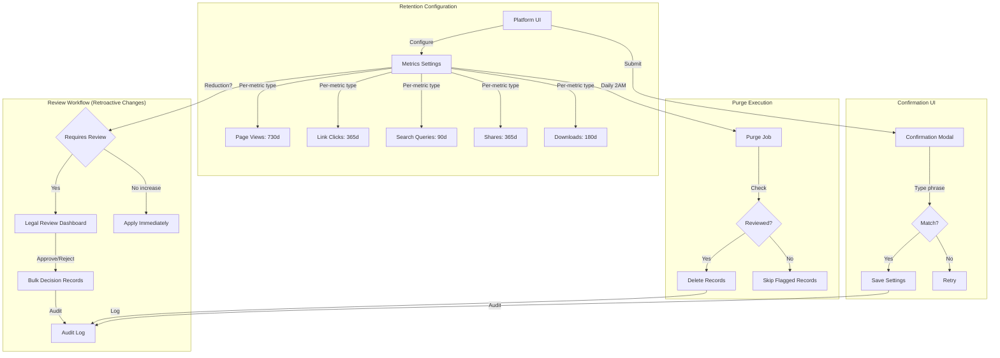
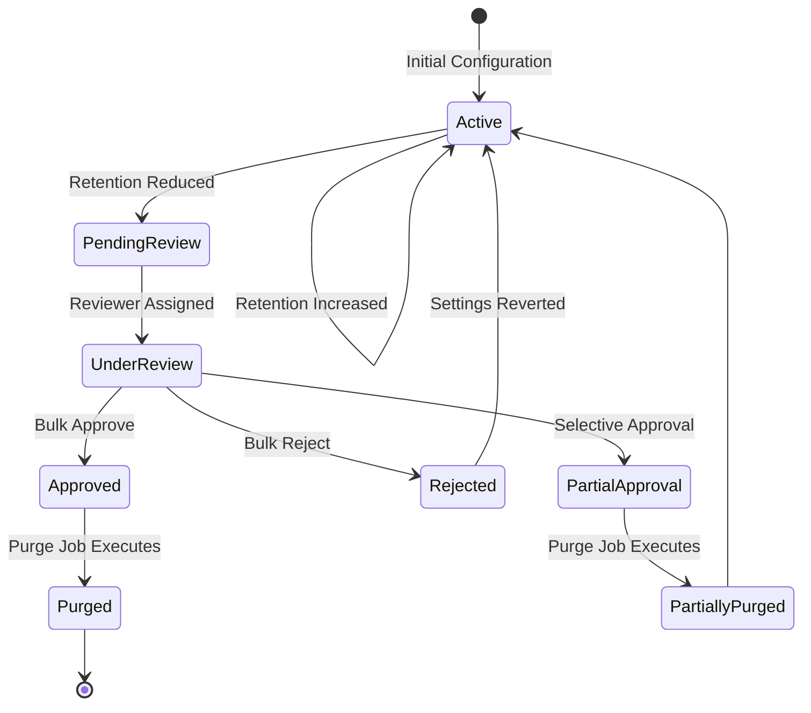

# Metrics Retention System - Design Decisions Document

**Date:** January 8, 2026  
**Status:** Design Review  
**Sprint:** Metrics Improvements P0/P1

---

## Executive Summary

This document captures critical design decisions for the metrics retention system based on stakeholder requirements for:
- **Canadian privacy compliance** (PIPEDA, CanSpam, NL/federal legislation)
- **Per-metric-type retention** with risk/benefit explanations
- **Legal review workflow** for retroactive retention changes
- **Assertive confirmation** with typing matcher and audit trails
- **Multi-tenant architecture** (design for future, implement single-tenant now)

---

## Architecture Overview



---

## Design Decision 1: Per-Metric-Type Retention

### Decision
Implement separate retention periods for each metric type with explanatory guidance.

### Rationale
- **Privacy sensitivity varies**: Search queries may reveal more personal information than page views
- **Legal flexibility**: Different regulations may apply to different data types
- **Storage optimization**: Less valuable metrics can be purged sooner
- **Informed consent**: Platform organizers need to understand trade-offs

### Data Model

```ruby
# app/models/better_together/settings/metrics.rb
class Metrics < ApplicationRecord
  # Per-metric-type retention (in days)
  attribute :page_views_retention_days, :integer, default: 730      # 2 years
  attribute :link_clicks_retention_days, :integer, default: 365     # 1 year
  attribute :shares_retention_days, :integer, default: 365          # 1 year
  attribute :downloads_retention_days, :integer, default: 180       # 6 months
  attribute :search_queries_retention_days, :integer, default: 90   # 3 months (more sensitive)
  attribute :export_retention_days, :integer, default: 90           # 3 months for CSV files
  
  # Validation: minimum 30 days, maximum 10 years
  METRIC_TYPES = %w[
    page_views
    link_clicks
    shares
    downloads
    search_queries
    export
  ].freeze
  
  METRIC_TYPES.each do |metric_type|
    validates :"#{metric_type}_retention_days",
              presence: true,
              numericality: {
                greater_than_or_equal_to: 30,
                less_than_or_equal_to: 3650,
                message: 'must be between 30 days and 10 years'
              }
  end
end
```

### UI Design

```erb
<%# Retention configuration with explanatory text %>
<div class="retention-config">
  <h4><%= t('.retention_policies') %></h4>
  <p class="text-muted"><%= t('.retention_intro') %></p>
  
  <% BetterTogether::Settings::Metrics::METRIC_TYPES.each do |metric_type| %>
    <div class="card mb-3">
      <div class="card-header">
        <h5><%= t(".#{metric_type}_title") %></h5>
      </div>
      <div class="card-body">
        <div class="row">
          <div class="col-md-4">
            <%= f.number_field :"#{metric_type}_retention_days",
                class: 'form-control',
                min: 30,
                max: 3650 %>
            <small class="form-text text-muted">
              <%= t('.days_label') %>
            </small>
          </div>
          <div class="col-md-8">
            <div class="alert alert-info mb-0">
              <h6><%= t('.why_retain') %></h6>
              <%= t(".#{metric_type}_retain_reason_html") %>
              
              <h6 class="mt-2"><%= t('.why_purge') %></h6>
              <%= t(".#{metric_type}_purge_reason_html") %>
              
              <h6 class="mt-2"><%= t('.privacy_risk') %></h6>
              <%= t(".#{metric_type}_privacy_risk_html") %>
            </div>
          </div>
        </div>
      </div>
    </div>
  <% end %>
</div>
```

### Translation Examples (Canadian Context)

```yaml
# config/locales/en.yml
en:
  better_together:
    settings:
      metrics:
        page_views_title: "Page Views"
        page_views_retain_reason_html: |
          <strong>Reasons to retain longer:</strong>
          <ul>
            <li>Identify trending content over time</li>
            <li>Seasonal pattern analysis</li>
            <li>Long-term engagement metrics</li>
          </ul>
        page_views_purge_reason_html: |
          <strong>Reasons to purge sooner:</strong>
          <ul>
            <li>Reduces storage costs</li>
            <li>Minimizes PIPEDA exposure risk</li>
            <li>Simplifies data breach response</li>
          </ul>
        page_views_privacy_risk_html: |
          <strong>Privacy considerations:</strong>
          <p>While page views don't contain user identifiers, they reveal content 
          consumption patterns. Under PIPEDA, this is considered personal information 
          if it can be linked to an individual. Retention should be limited to 
          legitimate business purposes.</p>
        
        search_queries_title: "Search Queries"
        search_queries_retain_reason_html: |
          <strong>Reasons to retain longer:</strong>
          <ul>
            <li>Improve search relevance</li>
            <li>Identify content gaps</li>
            <li>Understand member needs</li>
          </ul>
        search_queries_purge_reason_html: |
          <strong>Reasons to purge sooner:</strong>
          <ul>
            <li><strong>Higher privacy risk</strong>: Search queries often reveal intent</li>
            <li>PIPEDA requires minimizing sensitive data retention</li>
            <li>Reduces exposure in potential data breaches</li>
          </ul>
        search_queries_privacy_risk_html: |
          <strong>⚠️ Privacy considerations:</strong>
          <p><strong class="text-danger">Search queries are considered highly sensitive 
          under Canadian privacy law.</strong> They may reveal health conditions, 
          political views, or other protected characteristics. The Office of the 
          Privacy Commissioner of Canada recommends retaining search data for the 
          minimum time necessary for legitimate purposes (typically 30-90 days).</p>
          <p><em>Default: 90 days (recommended maximum under PIPEDA)</em></p>
```

---

## Design Decision 2: Retention Change Review Workflow

### Decision
When retention periods are **reduced**, affected records must be reviewed and approved by a legal/compliance officer before purging.

### Rationale
- **Regulatory compliance**: Prevents accidental deletion of legally required records
- **Risk mitigation**: Legal review ensures business/legal considerations are evaluated
- **Accountability**: Clear approval trail for audit purposes
- **Flexibility**: Bulk approval for routine changes, granular review for exceptions

### State Machine



### Data Model

```ruby
# app/models/better_together/metrics/retention_change.rb
module BetterTogether
  module Metrics
    class RetentionChange < ApplicationRecord
      belongs_to :platform
      belongs_to :initiated_by, class_name: 'BetterTogether::Person'
      belongs_to :reviewed_by, class_name: 'BetterTogether::Person', optional: true
      
      # Track which metric type is affected
      validates :metric_type, presence: true,
                inclusion: { in: Settings::Metrics::METRIC_TYPES }
      
      # Old and new retention periods
      validates :old_retention_days, presence: true, numericality: true
      validates :new_retention_days, presence: true, numericality: true
      
      # State machine
      enum status: {
        pending_review: 'pending_review',
        under_review: 'under_review',
        approved: 'approved',
        rejected: 'rejected',
        partially_approved: 'partially_approved',
        completed: 'completed'
      }, _suffix: true
      
      # Affected records details
      attribute :affected_records_count, :integer
      attribute :affected_date_range, :jsonb, default: {}
      attribute :review_notes, :text
      attribute :decision_details, :jsonb, default: {}
      
      # Timestamps
      validates :initiated_at, presence: true
      
      # Scopes
      scope :pending, -> { where(status: %w[pending_review under_review]) }
      scope :needs_review, -> { where(status: 'pending_review') }
      scope :actionable, -> { where(status: %w[approved partially_approved]) }
      
      # Is this a reduction (requiring review)?
      def reduction?
        new_retention_days < old_retention_days
      end
      
      # Calculate affected records
      def calculate_affected_records
        cutoff_old = old_retention_days.days.ago
        cutoff_new = new_retention_days.days.ago
        
        case metric_type
        when 'page_views'
          PageView.where(viewed_at: cutoff_new..cutoff_old).count
        when 'link_clicks'
          LinkClick.where(clicked_at: cutoff_new..cutoff_old).count
        when 'search_queries'
          SearchQuery.where(searched_at: cutoff_new..cutoff_old).count
        when 'shares'
          Share.where(shared_at: cutoff_new..cutoff_old).count
        when 'downloads'
          Download.where(downloaded_at: cutoff_new..cutoff_old).count
        end
      end
      
      # Execute approved deletion
      def execute_purge!
        return unless approved? || partially_approved?
        
        # Purge logic here
        # ...
        
        update!(status: 'completed')
      end
    end
  end
end
```

### Review Dashboard

```ruby
# app/controllers/better_together/metrics/retention_changes_controller.rb
module BetterTogether
  module Metrics
    class RetentionChangesController < ApplicationController
      before_action :require_legal_compliance_role
      
      def index
        @pending_changes = RetentionChange.needs_review.order(initiated_at: :asc)
        @under_review = RetentionChange.under_review.where(reviewed_by: current_person)
      end
      
      def show
        @change = RetentionChange.find(params[:id])
        @affected_sample = fetch_affected_sample(@change)
      end
      
      def bulk_approve
        change_ids = params[:change_ids]
        notes = params[:review_notes]
        
        RetentionChange.transaction do
          changes = RetentionChange.where(id: change_ids)
          changes.each do |change|
            change.update!(
              status: 'approved',
              reviewed_by: current_person,
              reviewed_at: Time.current,
              review_notes: notes
            )
          end
        end
        
        redirect_to metrics_retention_changes_path, 
                    notice: t('.bulk_approved', count: change_ids.size)
      end
      
      def bulk_reject
        # Similar to bulk_approve
      end
      
      private
      
      def require_legal_compliance_role
        unless current_person.has_role?('legal_compliance_officer') ||
               current_person.has_role?('platform_manager')
          raise Pundit::NotAuthorizedError
        end
      end
      
      def fetch_affected_sample(change)
        cutoff_old = change.old_retention_days.days.ago
        cutoff_new = change.new_retention_days.days.ago
        
        case change.metric_type
        when 'page_views'
          PageView.where(viewed_at: cutoff_new..cutoff_old).limit(100)
        # ... other types
        end
      end
    end
  end
end
```

---

## Design Decision 3: Assertive Confirmation with Typing Matcher

### Decision
All retention changes require typing a confirmation phrase to prevent accidental changes.

### Rationale
- **Error prevention**: Typing requirement forces deliberate action
- **Audit compliance**: Demonstrates informed consent
- **Industry standard**: Banking, healthcare, and government systems use similar patterns
- **Legal defensibility**: Shows due diligence in data handling

### UI Implementation (Stimulus Controller)

```javascript
// app/javascript/controllers/better_together/retention_confirmation_controller.js
import { Controller } from "@hotwired/stimulus"

export default class extends Controller {
  static targets = ["input", "submit", "phrase", "error"]
  
  connect() {
    this.expectedPhrase = this.phraseTarget.dataset.phrase
    this.updateSubmitState()
  }
  
  verify(event) {
    const typed = this.inputTarget.value.trim()
    const matches = typed === this.expectedPhrase
    
    this.updateSubmitState(matches)
    
    if (typed.length > 0 && !matches) {
      this.showError()
    } else {
      this.hideError()
    }
  }
  
  updateSubmitState(matches = false) {
    const typed = this.inputTarget.value.trim()
    
    if (matches || typed === this.expectedPhrase) {
      this.submitTarget.disabled = false
      this.submitTarget.classList.remove('btn-secondary')
      this.submitTarget.classList.add('btn-danger')
    } else {
      this.submitTarget.disabled = true
      this.submitTarget.classList.remove('btn-danger')
      this.submitTarget.classList.add('btn-secondary')
    }
  }
  
  showError() {
    this.errorTarget.classList.remove('d-none')
  }
  
  hideError() {
    this.errorTarget.classList.add('d-none')
  }
}
```

```erb
<%# app/views/better_together/settings/metrics/_confirmation_modal.html.erb %>
<%= turbo_frame_tag 'retention-confirmation' do %>
  <div class="modal fade" id="retentionConfirmationModal" tabindex="-1">
    <div class="modal-dialog modal-lg">
      <div class="modal-content">
        <div class="modal-header bg-warning text-dark">
          <h5 class="modal-title">
            <i class="fas fa-exclamation-triangle"></i>
            <%= t('.confirm_retention_change') %>
          </h5>
          <button type="button" class="btn-close" data-bs-dismiss="modal"></button>
        </div>
        
        <div class="modal-body" data-controller="retention-confirmation">
          <div class="alert alert-danger">
            <h6><%= t('.warning_title') %></h6>
            <%= t('.warning_message_html', 
                  old: @old_retention,
                  new: @new_retention,
                  metric_type: @metric_type,
                  affected_count: @affected_count) %>
          </div>
          
          <div class="card mb-3">
            <div class="card-header">
              <h6><%= t('.impact_summary') %></h6>
            </div>
            <div class="card-body">
              <table class="table table-sm mb-0">
                <tr>
                  <th><%= t('.metric_type') %></th>
                  <td><%= t(".#{@metric_type}_label") %></td>
                </tr>
                <tr>
                  <th><%= t('.current_retention') %></th>
                  <td><%= t('.days', count: @old_retention) %></td>
                </tr>
                <tr>
                  <th><%= t('.new_retention') %></th>
                  <td><%= t('.days', count: @new_retention) %></td>
                </tr>
                <tr class="table-danger">
                  <th><%= t('.records_affected') %></th>
                  <td><strong><%= number_with_delimiter(@affected_count) %></strong></td>
                </tr>
                <tr class="table-warning">
                  <th><%= t('.requires_review') %></th>
                  <td>
                    <% if @requires_review %>
                      <span class="badge bg-warning text-dark">
                        <%= t('.yes_legal_review_required') %>
                      </span>
                    <% else %>
                      <span class="badge bg-success">
                        <%= t('.no_immediate_application') %>
                      </span>
                    <% end %>
                  </td>
                </tr>
              </table>
            </div>
          </div>
          
          <div class="alert alert-info">
            <h6><%= t('.canadian_privacy_notice') %></h6>
            <%= t('.pipeda_reminder_html') %>
          </div>
          
          <%= form_with(
            model: @settings,
            url: update_metrics_settings_platform_path(@platform),
            method: :patch,
            data: { 
              controller: 'retention-confirmation',
              action: 'retention-confirmation#verify'
            }
          ) do |f| %>
            
            <% # Hidden fields for retention values %>
            <%= f.hidden_field :page_views_retention_days %>
            <%= f.hidden_field :link_clicks_retention_days %>
            <%# ... other fields ... %>
            
            <div class="mb-3">
              <label class="form-label">
                <strong><%= t('.type_to_confirm') %></strong>
              </label>
              <p class="text-muted">
                <%= t('.please_type') %>
                <code data-retention-confirmation-target="phrase" 
                      data-phrase="<%= t('.confirmation_phrase') %>" 
                      class="text-danger">
                  <%= t('.confirmation_phrase') %>
                </code>
              </p>
              
              <%= text_field_tag 'confirmation',
                  nil,
                  class: 'form-control form-control-lg',
                  autocomplete: 'off',
                  placeholder: t('.confirmation_phrase'),
                  data: { 
                    retention_confirmation_target: 'input',
                    action: 'input->retention-confirmation#verify'
                  } %>
              
              <div class="invalid-feedback d-none" 
                   data-retention-confirmation-target="error">
                <%= t('.phrase_must_match_exactly') %>
              </div>
            </div>
            
            <div class="d-flex justify-content-between">
              <button type="button" class="btn btn-secondary" data-bs-dismiss="modal">
                <%= t('buttons.cancel') %>
              </button>
              
              <%= f.submit t('.confirm_retention_change'),
                  class: 'btn btn-secondary',
                  disabled: true,
                  data: { retention_confirmation_target: 'submit' } %>
            </div>
          <% end %>
        </div>
      </div>
    </div>
  </div>
<% end %>
```

### Audit Trail

```ruby
# app/models/better_together/metrics/configuration_audit.rb
module BetterTogether
  module Metrics
    class ConfigurationAudit < ApplicationRecord
      belongs_to :platform
      belongs_to :changed_by, class_name: 'BetterTogether::Person'
      
      # What changed
      attribute :changes, :jsonb, default: {}
      
      # Confirmation details
      attribute :confirmation_phrase, :string
      attribute :confirmation_matched, :boolean, default: false
      attribute :ip_address, :string
      attribute :user_agent, :string
      
      # Timestamps
      validates :changed_at, presence: true
      
      # Retention: 7 years for compliance
      def self.retention_period
        7.years
      end
    end
  end
end
```

---

## Design Decision 4: Multi-Tenant Schema Design (Future-Proof)

### Decision
Design models and architecture to support postgres schema-based multi-tenancy, but implement single-tenant (public schema) for this sprint.

### Rationale
- **Future-proof**: Avoids refactoring when multi-tenancy is needed
- **No over-engineering**: Don't implement complexity not needed now
- **Clear migration path**: Architecture supports future schema-per-tenant
- **Performance**: Schema-level isolation is faster than row-level scoping

### Schema Design Considerations

```ruby
# Future multi-tenant architecture (NOT THIS SPRINT)
# Each hosted platform gets its own PostgreSQL schema:
#
# Schema: public (shared)
#   - platforms
#   - people
#   - users
#   - global settings
#
# Schema: tenant_platform_123 (isolated)
#   - metrics_page_views
#   - metrics_link_clicks
#   - metrics_settings
#   - metrics_audit_logs
#
# Schema: tenant_platform_456 (isolated)
#   - metrics_page_views
#   - metrics_link_clicks
#   - ...
```

### Current Implementation (Single-Tenant)

```ruby
# All metrics in public schema with platform_id scoping
# app/models/better_together/metrics/page_view.rb
class PageView < ApplicationRecord
  # For now: platform scoping via belongs_to
  # Future: schema-level isolation
  belongs_to :platform, optional: true  # Optional for now
  
  # Default scope for current platform (when multi-tenant)
  # NOT IMPLEMENTED THIS SPRINT
  # default_scope { where(platform: Current.platform) }
end

# Settings model already platform-scoped
# app/models/better_together/settings/metrics.rb
class Metrics < ApplicationRecord
  belongs_to :platform
  # This design works for both single and multi-tenant
end
```

### Migration Compatibility

```ruby
# Migrations designed to work in any schema
class CreateBetterTogetherMetricsPageViews < ActiveRecord::Migration[7.2]
  def change
    # Works in public schema now
    # Works in tenant schema later
    create_bt_table :metrics_page_views do |t|
      # platform_id optional for single-tenant
      # removed in multi-tenant (schema IS the platform)
      t.bt_references :platform, null: true
      
      # ... rest of fields
    end
  end
end
```

### Key Architectural Principles

1. **Platform-aware models**: All metrics models `belong_to :platform`
2. **Scoped queries**: Use `platform.metrics_page_views` not global queries
3. **Settings per platform**: `Settings::Metrics` always platform-scoped
4. **Schema-agnostic code**: Don't assume `public` schema in code

---

## Design Decision 5: Canadian Privacy Legislation Focus

### Decision
Documentation and default settings prioritize Canadian privacy laws (PIPEDA, CanSpam, provincial laws) while maintaining GDPR/CCPA compatibility.

### Applicable Legislation

#### PIPEDA (Personal Information Protection and Electronic Documents Act)

**Key Requirements:**
- **Consent**: Must obtain meaningful consent for data collection
- **Purpose Limitation**: Data only used for stated purposes
- **Data Minimization**: Collect only what's necessary
- **Retention Limits**: Keep data only as long as needed
- **Individual Access**: People can request their data
- **Safeguards**: Appropriate security measures

**Metrics Implications:**
- Search queries are "personal information" under PIPEDA
- Page views may be personal information if linkable to individual
- Retention periods must be justified by business need
- Default: 90 days for search queries, 2 years for aggregates

#### CanSpam (Canada's Anti-Spam Legislation)

**Key Requirements:**
- **Consent**: Express or implied consent for electronic messages
- **Identification**: Clear sender identification
- **Unsubscribe**: Easy opt-out mechanism

**Metrics Implications:**
- Email notifications about metrics must have opt-out
- Cannot send purge notifications without consent
- Track unsubscribe preferences

#### Provincial Privacy Laws

**Quebec (Bill 64):**
- Stricter than PIPEDA
- Mandatory privacy impact assessments
- Data breach notification requirements

**BC (PIPA):**
- Similar to PIPEDA for private sector
- Additional consent requirements

**Alberta (PIPA):**
- Business-focused privacy law
- Consent and security requirements

### Default Retention Recommendations

Based on Office of the Privacy Commissioner of Canada guidance:

| Metric Type | Default | Rationale |
|-------------|---------|-----------|
| Page Views | 730 days (2 years) | General analytics, low sensitivity |
| Link Clicks | 365 days (1 year) | Behavioral data, moderate sensitivity |
| Shares | 365 days (1 year) | Social engagement, moderate sensitivity |
| Downloads | 180 days (6 months) | File access tracking, moderate sensitivity |
| Search Queries | 90 days (3 months) | **High sensitivity** - reveals intent, interests |
| CSV Exports | 90 days (3 months) | Contains aggregated data, storage cost |

### Documentation Requirements

```markdown
# Privacy Policy Template - Canadian Focus

## What We Track

Better Together Community Engine tracks the following metrics to improve 
platform functionality and community engagement:

- **Page Views**: Which pages are visited (no user identification)
- **Link Clicks**: Which links are clicked (no user identification)
- **Search Queries**: What community members search for (no user identification)
- **Social Shares**: Content shared to social platforms (no user identification)
- **File Downloads**: Reports downloaded by analytics viewers (no user identification)

**Important**: We do NOT track user identities in any metrics. All data is 
event-based and cannot be linked to individual community members.

## Legal Basis (PIPEDA Compliance)

We collect this information for the following legitimate purposes:

1. **Platform Improvement**: Understanding which features are used helps us 
   prioritize development efforts
2. **Content Relevance**: Knowing which content is popular helps organizers 
   create valuable resources
3. **Security**: Detecting unusual patterns that may indicate security issues

Under PIPEDA, we limit data collection to what is reasonable and necessary for 
these purposes.

## How Long We Keep It

| Data Type | Retention Period | Why |
|-----------|------------------|-----|
| Page Views | [X] days | [Platform-specific justification] |
| Search Queries | [X] days (max 90 recommended) | High privacy sensitivity |
| Link Clicks | [X] days | [Platform-specific justification] |

These periods are configurable by platform organizers and reviewed regularly 
to ensure compliance with PIPEDA's data minimization principles.

## Your Rights Under PIPEDA

You have the right to:
- **Access**: Request a copy of any data we hold (see note below)
- **Correction**: Request correction of inaccurate data
- **Withdrawal of Consent**: Opt out of data collection (some functionality may be limited)
- **Complaint**: File a complaint with the Office of the Privacy Commissioner of Canada

**Note on Access Requests**: Because our metrics system does not store user 
identifiers, we cannot link event data to individual members. We will provide 
aggregate reports and confirm that no personally identifiable information is 
retained in our metrics system.

## Contact

Privacy Officer: [Contact information]
Office of the Privacy Commissioner of Canada: 1-800-282-1376
```

---

## Implementation Impact Summary

### Story Changes Required

#### US-MET-001: NOW MORE COMPLEX
- **Before**: Single retention setting
- **After**: 6 separate retention settings with guidance
- **Effort change**: 3 hours → 6 hours (+3 hours)

#### NEW: US-MET-001B: Legal Review Workflow
- **Story**: "As a legal/compliance officer, I want to review retroactive retention changes before they're applied"
- **Effort**: 8 hours
  - Model: RetentionChange (2h)
  - Dashboard UI (3h)
  - Bulk approval (2h)
  - Integration with purge job (1h)

#### US-MET-001C: Confirmation UI
- **Story**: "As a platform organizer, I must type a confirmation phrase to change retention settings"
- **Effort**: 3 hours
  - Stimulus controller (1h)
  - Modal UI (1h)
  - Audit logging (1h)

#### US-MET-003: ENHANCED
- **Before**: Basic audit log viewing
- **After**: Comprehensive audit trail including configuration changes
- **Effort change**: 2 hours → 4 hours (+2 hours)

#### US-MET-006: REFOCUSED
- **Before**: GDPR/CCPA documentation
- **After**: Canadian privacy legislation focus (PIPEDA, CanSpam, provincial)
- **Effort change**: 2 hours → 4 hours (+2 hours for Canadian research)

### New Total Effort

| Component | Original | Revised | Delta |
|-----------|----------|---------|-------|
| P0.1 Data Retention | 8 hours | 20 hours | +12 hours |
| P0.2 Performance | 2 hours | 2 hours | 0 |
| P0.3 Documentation | 6 hours | 8 hours | +2 hours |
| P1 Bot Filtering | 12 hours | 12 hours | 0 |
| **TOTAL** | **28 hours** | **42 hours** | **+14 hours** |

---

## Revised Sprint Plan Recommendation

### Option A: Full Implementation (42 hours over 2 weeks)
Include all refined requirements in current sprint.

### Option B: Phased Approach (28 hours this sprint, 14 hours next)
**This sprint:**
- Per-metric-type retention (basic)
- Performance indexes
- Bot filtering
- Basic Canadian privacy docs

**Next sprint:**
- Legal review workflow
- Typing matcher confirmation
- Enhanced audit trail
- Complete Canadian compliance docs

### Option C: MVP + Enhancements (Recommended)
**This sprint (32 hours):**
- Per-metric-type retention with guidance UI
- Typing matcher confirmation
- Performance indexes
- Bot filtering
- Basic Canadian privacy docs

**Future sprint:**
- Full legal review workflow dashboard
- Advanced audit reporting
- Multi-tenant schema migration

---

## Questions for Final Approval

1. **Effort tradeoff**: Accept 42-hour sprint or phase implementation?
2. **Review workflow**: Is manual legal review acceptable, or require automated flagging?
3. **Confirmation phrase**: Use fixed phrase ("DELETE MY DATA") or dynamic per-change?
4. **Multi-tenant timeline**: When is schema-based multi-tenancy needed?
5. **Provincial compliance**: Focus on federal PIPEDA or add Quebec/BC specifics?

---

**Document Status:** ✅ Ready for stakeholder review
**Next Steps:** Review with legal/compliance team, finalize implementation scope
