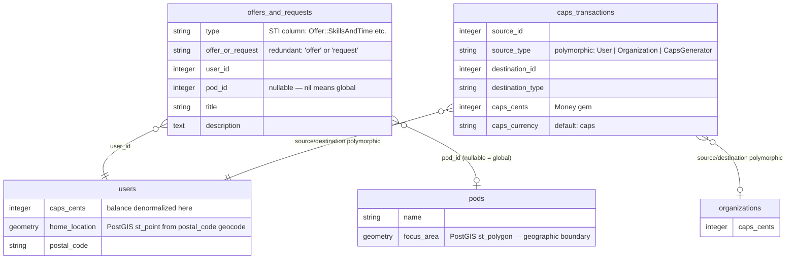
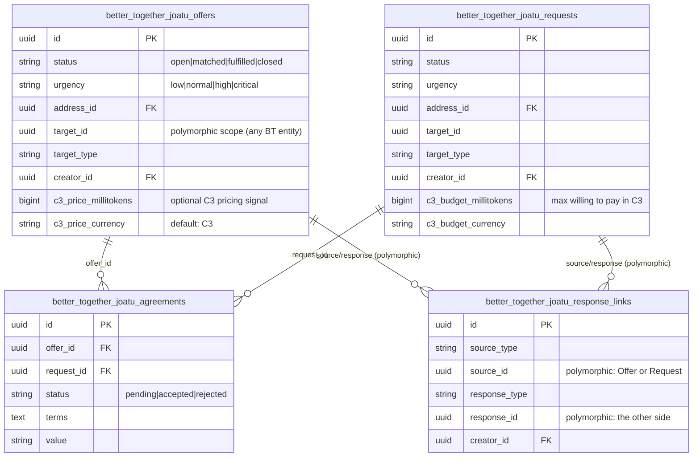
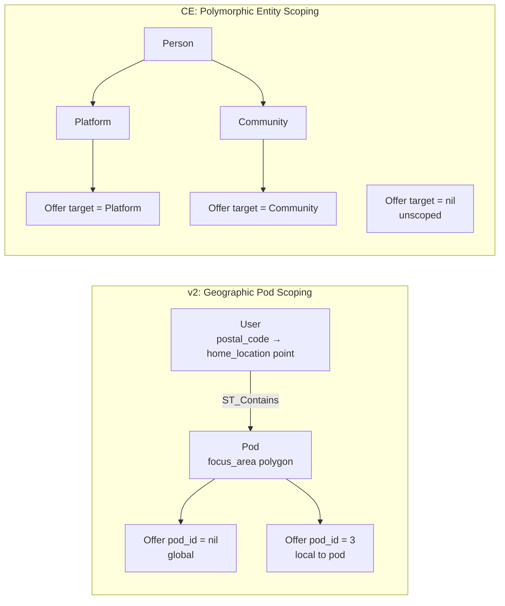
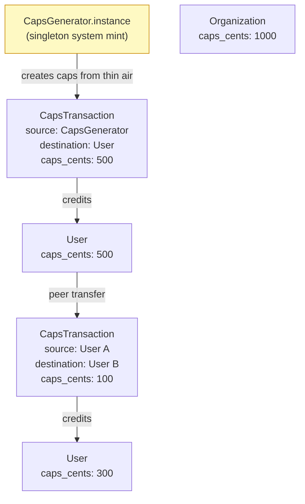
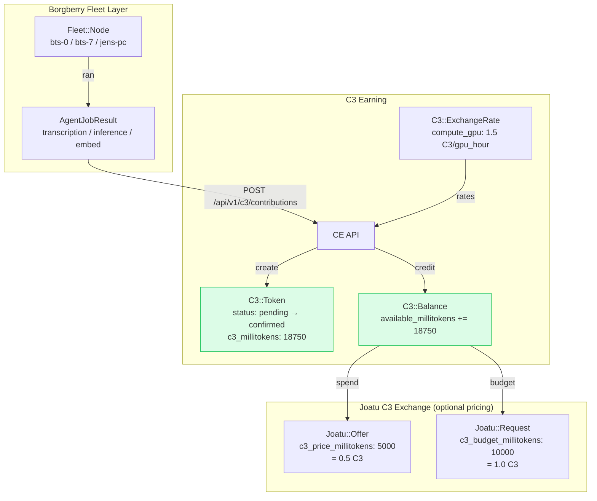
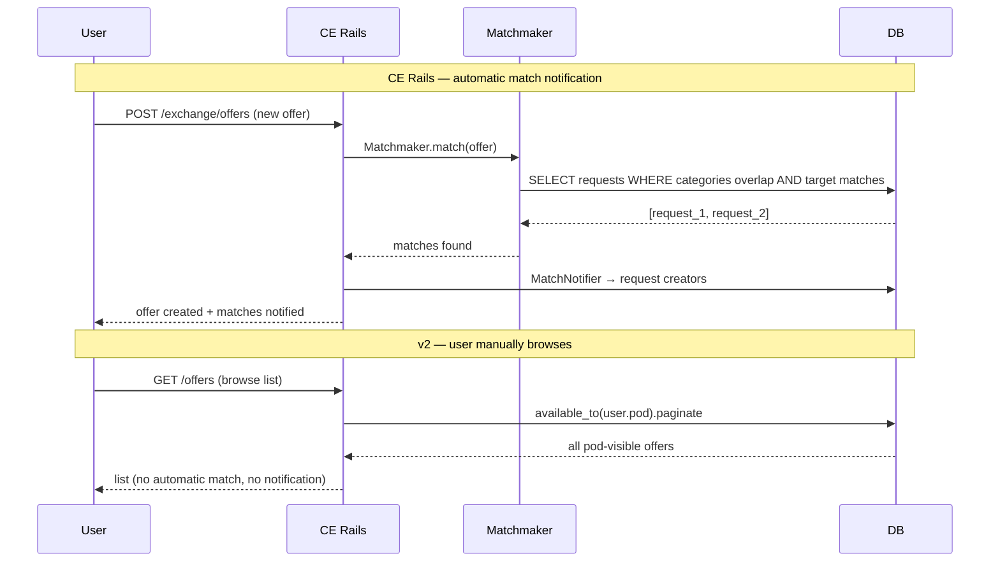
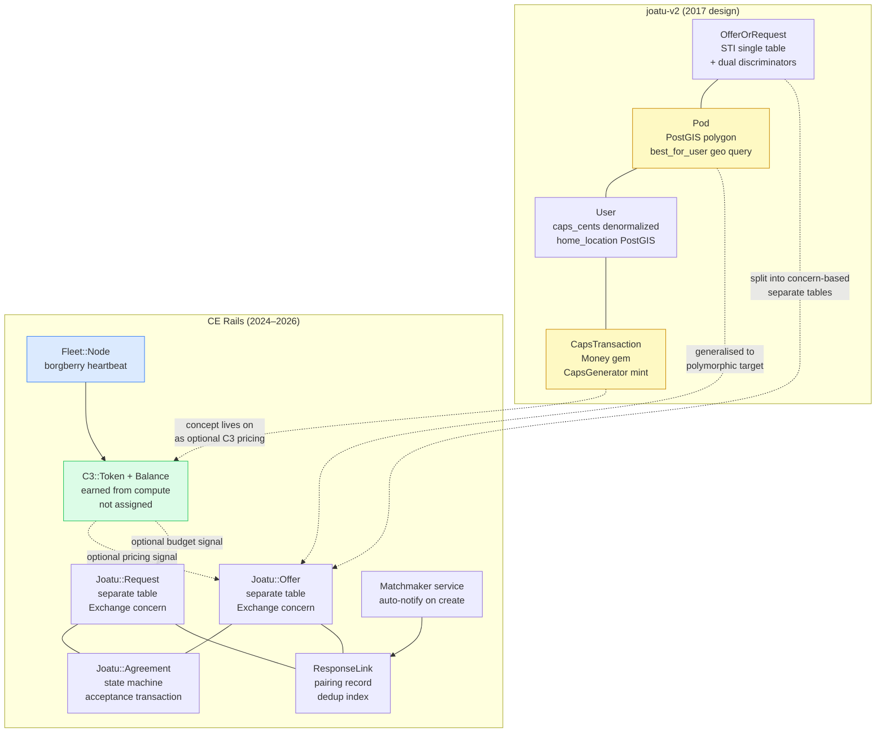

# Joatu: Alpha v2 vs Community Engine Rails — Design Comparison

> **Reference repos**
> - Alpha v2: `github.com/joatuapp/joatu-v2` (archived, local clone at `partners/joatu-v2`)
> - CE Rails: `better-together-org/community-engine-rails` (this repo)

---

## 1. Offer / Request Data Model

### v2 — Single-table STI with dual discriminators



**STI hierarchy** (all empty subclasses, discriminated by `type` column):

```
OfferOrRequest (abstract, table: offers_and_requests)
├── Offer
│   ├── Offer::SkillsAndTime
│   ├── Offer::Knowledge
│   └── Offer::PhysicalGoods
└── Request
    ├── Request::SkillsAndTime
    ├── Request::Knowledge
    └── Request::PhysicalGoods
```

### CE Rails — Separate tables, shared concern



---

## 2. Community Scoping

| Dimension | v2 `Pod` | CE Rails `target` |
|-----------|----------|-------------------|
| What it is | Explicit `Pod` model with PostGIS polygon `focus_area` | Polymorphic FK on Offer/Request (`target_type`/`target_id`) |
| Geographic | Yes — `ST_Contains(focus_area, user.home_location)` | No geographic component |
| Discovery | `best_for_user` geocodes postal code to PostGIS point | Association to Platform or Community by UUID |
| Scope semantics | `pod_id: nil` = global visibility | `target_id: nil` = unscoped |
| Null object | `UncreatedPod.new` returned when user has no pod | Any BT entity (Platform, Community, Event) |



---

## 3. Local Currency

This is the most substantive architectural difference.

### v2 — Caps (JoatUnits): assigned from a system mint



**Key characteristics:**
- Balance stored **directly on `users.caps_cents`** (and `organizations.caps_cents`) — no wallet model
- `CapsTransaction` is a double-entry ledger row — `source` and `destination` are both polymorphic
- `CapsGenerator.instance` (singleton) acts as the system mint — creates caps for community activities (garden planting, teaching classes) without a real source
- Uses `money-rails` gem with `monetize :caps_cents` — currency is `"caps"`, formatted as money
- `Profile.accepted_currencies` JSON field — users declare which currencies they accept

### CE Rails — C3 (Tree Seeds 🌱): earned through contribution



**Key characteristics:**
- Balance in a **dedicated `C3::Balance` model** (not denormalized onto Person)
- `C3::Token` records each earning event with `source_ref` (job ID), `contribution_type`, units, duration
- Stored as **integer millitokens** (1 C3 = 10,000 millitokens) — no Money gem, no float arithmetic
- C3 is **earned** through compute work (transcription, GPU inference, video encode) — there is no mint
- `C3::ExchangeRate` table maps contribution type → C3 per unit
- Joatu C3 pricing (`c3_price_millitokens` / `c3_budget_millitokens`) is **optional signalling** — not yet a forced ledger debit/credit

| Dimension | v2 Caps | CE C3 |
|-----------|---------|-------|
| Creation mechanism | `CapsGenerator` singleton (from thin air) | Borgberry compute jobs (earned) |
| Balance storage | Denormalized on `users`/`organizations` | Separate `C3::Balance` model |
| Ledger | `CapsTransaction` double-entry | `C3::Token` event log + `C3::Balance` running total |
| Currency type | Money gem, `caps_cents`, `"caps"` currency | Integer millitokens, no Money gem |
| Joatu integration | Implicit (user's balance visible in profile) | Optional `c3_price_millitokens` columns on offers/requests |
| Governance weight | Unclear — not documented | Explicitly **excluded** (one member one vote) |

---

## 4. Matchmaking

| Dimension | v2 | CE Rails |
|-----------|-----|---------|
| Mechanism | None — user browses `available_to(user)` scope | `Matchmaker` service (category + target overlap) |
| Recording | Nothing persisted | `ResponseLink` model — deduplicates, auditable |
| Notifications | None | `MatchNotifier` to both creators on new pairing |
| Initiated by | User browsing | Automatic on Offer/Request create + manual via `respond_with_offer/request` UI flow |



---

## 5. Agreement / Fulfillment Model

| Dimension | v2 | CE Rails |
|-----------|-----|---------|
| Model exists | No | Yes — `Joatu::Agreement` |
| State machine | N/A | `pending → accepted` or `pending → rejected` (terminal) |
| Uniqueness enforcement | N/A | DB unique index on `[offer_id, request_id]` + only one accepted per offer + one per request |
| Mutual status update | N/A | `accept!` closes both offer and request in one transaction |
| Notification | N/A | `AgreementNotifier` (create) + `AgreementStatusNotifier` (state change) |

---

## 6. Search

| Dimension | v2 | CE Rails |
|-----------|-----|---------|
| Engine | `pg_search` gem (`pg_search_scope`) | Custom `SearchFilter` service using Arel |
| Language support | `french`/`english` dictionary-aware tsearch | Mobility translation columns (any locale) |
| Fields searched | `title` (weight A) + `description` (weight C) | Translated `name` + ActionText `description` body + category names |
| Accent handling | `ignore_accents: true` | Not explicitly configured |
| Full-text ranking | pg_search weighted rank | None — ordering by `created_at` only |

---

## 7. Architecture and Deployment Model

| Dimension | v2 | CE Rails |
|-----------|-----|---------|
| App type | Monolithic Rails app | Rails engine (gem), multi-tenant |
| Auth | Devise on `User` (with profile separation) | Devise on `User` + separate `Person` model |
| Geographic features | PostGIS (`focus_area`, `home_location`, geocoding) | None (address FK only) |
| Real-time | Mailboxer (Conversation/Message models) | ActionCable conversations, Noticed notifications |
| API | None documented | Full JSONAPI v1 (`joatu_offers`, `joatu_requests`, `joatu_agreements`) |
| Multi-tenancy | Pod = one community per deployment | `target` polymorphic = any number of platforms/communities |
| Ruby version | 2.4.5 | 3.x (3.4.4 in active CI) |

---

## 8. What CE Rails Adds That v2 Never Had

1. **`Agreement` model** — explicit, auditable contract between offer and request creators with state machine
2. **`ResponseLink` model** — records and deduplicates offer↔request pairings before an agreement is formed
3. **`Matchmaker` service** — automatic match discovery at create time
4. **JSONAPI v1** — full REST API for mobile and external clients
5. **Pundit policies** — per-action, per-user authorization (v2 had none visible in models)
6. **Internationalization** — Mobility-translated `name` + ActionText `description` in all locales
7. **C3 integration** — compute-earned currency tied to borgberry fleet jobs (vs. assigned caps)
8. **`urgency` field** — priority signalling on offers/requests
9. **`address` association** — location scoping without requiring PostGIS
10. **`ResponseLinkable` concern** — structured UI flow for responding to the other side

---

## 9. What v2 Had That CE Rails Does Not (Yet)

1. **PostGIS geographic scoping** — pod polygon containment, user geocoding by postal code
2. **`CapsGenerator` mint** — system-assigned currency for community activities (garden, teaching)
3. **`User.caps_cents` balance** — directly spendable money balance on the user record
4. **`OrganizationMembership`** — organizations also hold caps (CE has Platform but no caps on it)
5. **Bilingual search ranking** — pg_search with French/English dictionaries, weighted fields
6. **`Profile.accepted_currencies`** — user preference for which currencies they'll accept in exchanges
7. **`PodMembership.membership_types`** — pg array column allowing multiple membership types per user/pod

---

## Summary Diagram


