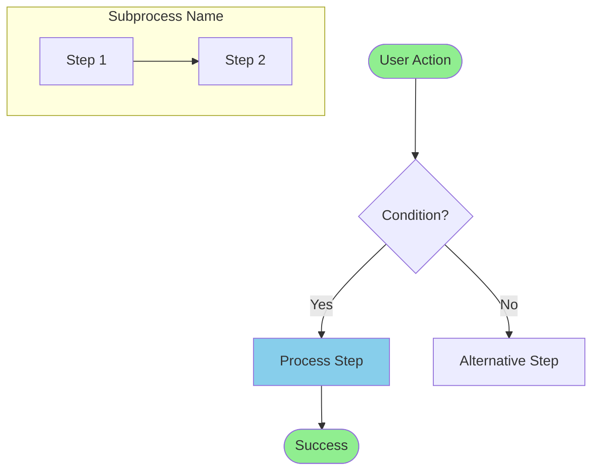

# Retrospective Documentation Workflow Guide

**Document Version:** 1.0  
**Created:** January 12, 2026  
**Based On:** PR #1149 Documentation Process

---

## Purpose

This guide establishes the standard workflow for creating comprehensive retrospective documentation for already-implemented features that lack formal planning documentation. It addresses situations where production-ready code exists without the implementation plans and acceptance criteria normally required before development begins.

**When to Use This Workflow:**
- Features merged to production without prior implementation plans
- Systems implemented before documentation standards were established
- Emergency features developed under time pressure
- Legacy code requiring comprehensive documentation

**When NOT to Use This Workflow:**
- New features (use prospective planning documentation instead)
- Minor bug fixes or patches
- Features with existing comprehensive documentation

---

## Background: Why This Workflow Exists

Better Together Community Engine follows TDD principles and requires implementation plans with collaborative review before development begins. However, PR #1149 ("Feat/policies and docs") introduced three production-ready systems without this prior planning documentation:

1. **DocumentationBuilder** - Automated doc site generation
2. **Markdown Content Management** - Dual-source content blocks with rendering
3. **SafeClassResolver** - Security utility preventing unsafe reflection

This violation of project standards created a need for **retrospective documentation**—comprehensive planning documents created after implementation to:

- Document architectural decisions made during development
- Provide context for future maintenance and enhancements
- Map existing test coverage back to stakeholder needs
- Establish patterns for similar features
- Support stakeholder understanding of capabilities
- **Prevent future documentation debt**

---

## Retrospective Documentation Workflow

### Phase 1: Assessment & Planning (1-2 hours)

#### Step 1.1: Identify Scope

**Actions:**
1. Review PR description and changed files
2. Identify distinct systems/features implemented
3. Determine system boundaries and dependencies
4. Assess documentation requirements per system

**Output:**
```markdown
## Systems Identified in PR #XXXX

1. **System Name**: Brief description
   - Files: List key files
   - Test Coverage: Lines of test code
   - Complexity: [Simple|Moderate|Complex]
   - Documentation Type: [Full System|Utility|Feature]

2. **System Name**: Brief description
   ...
```

**Decision Point:** Determine documentation approach
- **Full Systems** (200+ lines model code): Implementation plan + acceptance criteria + system docs + diagrams
- **Utilities** (<100 lines): Reference documentation only
- **Features** (enhancements to existing systems): Update existing docs + add sections

#### Step 1.2: Choose Documentation Strategy

**Options:**

**Option A: Split Documentation (Recommended)**
- Create separate documentation sets for each distinct system
- Allows parallel work and clearer system boundaries
- Easier to maintain and reference

**Option B: Monolithic Documentation**
- Single combined document for all systems in PR
- Appropriate when systems are tightly coupled
- Simpler file structure but harder to navigate

**Example Decision Matrix:**

| Systems | Coupled? | Lines of Code | Recommendation |
|---------|----------|---------------|----------------|
| 1-2 systems | Loosely | <500 lines | Either approach |
| 3+ systems | Loosely | >500 lines | Split (Option A) |
| 2+ systems | Tightly | Any | Monolithic (Option B) |

#### Step 1.3: Create Documentation Plan

**Template:**
```markdown
## Documentation Plan for PR #XXXX

**Approach:** [Split|Monolithic]

**Systems to Document:**
1. SystemName - [Implementation Plan + Acceptance Criteria + System Docs + Diagrams]
2. UtilityName - [Reference Documentation]

**Estimated Effort:**
- System 1: X hours (600+ lines implementation plan, 400+ lines criteria, 800+ lines system docs)
- System 2: Y hours
- Total: Z hours

**Sequence:**
1. Review all code for all systems
2. Document System 1
3. Document System 2
4. Update documentation assessment
5. Create workflow guide (if first retrospective)
```

### Phase 2: Code Review & Analysis (2-4 hours per system)

#### Step 2.1: Comprehensive Code Archaeology

**Review Checklist:**

**Models & Business Logic:**
- [ ] Read all model files
- [ ] Document associations and relationships
- [ ] Identify validations and constraints
- [ ] Note callbacks and lifecycle hooks
- [ ] Map concerns and modules

**Controllers & Routes:**
- [ ] Review all controller actions
- [ ] Document routes and URL patterns
- [ ] Identify authorization patterns
- [ ] Note parameter handling

**Services & Utilities:**
- [ ] Read service object implementations
- [ ] Document public APIs
- [ ] Identify dependencies
- [ ] Note configuration options

**Views & JavaScript:**
- [ ] Review view templates
- [ ] Document Stimulus controllers
- [ ] Identify interactive behaviors
- [ ] Note accessibility patterns

**Tests:**
- [ ] Count total test lines
- [ ] Categorize test types (model, controller, feature, etc.)
- [ ] Document test coverage patterns
- [ ] Identify acceptance-criteria-like tests

**Documentation:**
```markdown
## Code Review Summary: SystemName

**Models:**
- `app/models/namespace/model.rb` (XXX lines)
  - Key methods: method1, method2
  - Associations: belongs_to X, has_many Y
  - Concerns: Concern1, Concern2

**Controllers:**
- `app/controllers/namespace/controller.rb` (XXX lines)
  - Actions: index, show, create, update, destroy
  - Authorization: Policy checks via Pundit

**Services:**
- `app/services/namespace/service.rb` (XXX lines)
  - Purpose: Description
  - Public methods: method1, method2

**Tests:**
- Total: XXX lines across Y files
- Model tests: XXX lines
- Controller tests: XXX lines
- Feature tests: XXX lines
- Policy tests: XXX lines

**Key Insights:**
- Architectural pattern: [Builder|Service Object|STI|etc.]
- Security measures: [Authorization|Validation|Sanitization]
- Performance considerations: [Caching|Background jobs|Indexing]
```

### Phase 3: Implementation Plan Creation (4-6 hours per system)

#### Step 3.1: Use Implementation Plan Template

**File:** `docs/implementation/templates/implementation_plan_template.md`

**Key Sections:**
1. ⚠️ RETROSPECTIVE DOCUMENTATION header
2. Overview with problem statement
3. Stakeholder analysis
4. Implementation priority matrix (phases already complete)
5. Detailed implementation (document what was built)
6. Testing requirements (map existing tests)
7. Timeline (actual implementation timeline)
8. Risk assessment (what was mitigated)

#### Step 3.2: Document Architectural Decisions

**Focus Areas:**
- **Why this approach?** - Explain technical decisions made
- **What alternatives were considered?** - Document trade-offs
- **What patterns were used?** - Builder, Service Object, STI, etc.
- **What security measures?** - Authorization, validation, sanitization
- **What performance considerations?** - Caching, indexing, background jobs

**Example:**
```markdown
## Architectural Decisions

### Dual-Source Content Model (Chosen Approach)

**Decision:** Support both inline database editing AND file-based content with auto-sync

**Rationale:**
- Platform organizers prefer web UI editing
- Developers need version-controlled files
- Different workflows serve different stakeholder needs

**Alternatives Considered:**
- Database-only: Rejected (no version control)
- File-only: Rejected (no UI editing)
- Single source with export: Rejected (one-way sync limitations)

**Trade-offs:**
- Complexity: Dual-source loading logic adds code complexity
- Consistency: Must handle file/database sync carefully
- Benefits: Flexibility outweighs complexity for stakeholder needs
```

### Phase 4: Acceptance Criteria Creation (3-5 hours per system)

#### Step 4.1: Use TDD Acceptance Criteria Template

**File:** `docs/implementation/templates/tdd_acceptance_criteria_template.md`

**Key Sections:**
1. ⚠️ RETROSPECTIVE DOCUMENTATION header
2. Implementation plan reference
3. Stakeholder impact analysis
4. Acceptance criteria by stakeholder role
5. Test coverage matrix mapping AC to tests
6. TDD evidence from existing tests

#### Step 4.2: Map Tests to Stakeholder Needs

**Process:**
1. Read test descriptions and contexts
2. Identify stakeholder workflows being tested
3. Extract acceptance criteria from test scenarios
4. Map test file/line numbers to each criterion

**Example Test Mapping:**
```markdown
### Platform Organizer Acceptance Criteria

- [x] **AC-1.1**: I can create markdown content blocks with inline source text
  - **Test Coverage**: `spec/models/better_together/content/markdown_spec.rb:15-25`
  - **Implementation**: Content::Markdown model with `source` attribute via Mobility
  - **Validation**: Creating markdown with `source: "# Heading"` persists and renders

- [x] **AC-1.2**: I can create markdown content blocks that load from files
  - **Test Coverage**: `spec/models/better_together/content/markdown_spec.rb:78-92`
  - **Implementation**: `source_file_path` attribute, `#load_file_content` method
  - **Validation**: Creating markdown with `source_file_path: 'docs/guide.md'` loads dynamically
```

**Benefits:**
- Shows stakeholder value delivered by implementation
- Validates comprehensive test coverage exists
- Provides test navigation for future maintenance
- Demonstrates TDD approach was followed (even if documented retrospectively)

### Phase 5: System Documentation Creation (6-10 hours per system)

#### Step 5.1: Use System Documentation Template

**File:** `docs/implementation/templates/system_documentation_template.md`

**Minimum Requirements:**
- 200+ lines technical documentation
- Process flow diagram (Mermaid + PNG + SVG)
- Database schema coverage
- Model relationships
- Usage examples with code snippets
- Performance and security considerations
- Troubleshooting guide
- Integration points

#### Step 5.2: Create Process Flow Diagram

**Mermaid Diagram Guidelines:**
1. **Main flow** - Primary user/system workflows
2. **Decision points** - Conditional logic branches
3. **Subgraphs** - Related subprocess groupings
4. **Color coding** - Green (start/success), red (errors), blue (processes), orange (decisions)
5. **Clear labels** - Descriptive node text with line breaks for readability

**Example Structure:**


#### Step 5.3: Render Diagrams

**Command:**
```bash
bin/render_diagrams
```

**Verifies:**
- `.mmd` source file created in `docs/diagrams/source/`
- `.png` export generated in `docs/diagrams/exports/png/` (high-res 4800x3600)
- `.svg` export generated in `docs/diagrams/exports/svg/` (vector format)

#### Step 5.4: Document Integration Points

**Dependencies Section:**
```markdown
### Dependencies
- **SystemA**: How this system depends on SystemA
- **GemName**: Version and configuration requirements
- **ServiceName**: External service integration details
```

**Used By Section:**
```markdown
### Used By
- **SystemB**: How SystemB uses this system
- **FeatureC**: Integration point description
```

### Phase 6: Utility Reference Documentation (2-4 hours per utility)

**For Simple Utilities (<100 lines):**
- Skip full implementation plan/acceptance criteria
- Create comprehensive reference documentation instead
- Focus on API reference, usage patterns, security implications

**Reference Doc Structure:**
1. Overview and purpose
2. Architecture (if multiple implementations)
3. Usage patterns with examples
4. Real-world integration examples
5. Security considerations
6. API reference
7. Testing reference
8. Migration guide (if replacing unsafe patterns)
9. Troubleshooting

**Example: SafeClassResolver**
- **Purpose:** Prevent unsafe reflection vulnerabilities
- **Usage:** Show allow-list patterns
- **Integrations:** Document 7+ usage locations in codebase
- **Security:** Explain what it prevents (code injection, Brakeman warnings)
- **Migration:** Before/after examples for replacing `constantize`

### Phase 7: Documentation Assessment Update (30 minutes)

#### Step 7.1: Update Progress Matrix

**File:** `docs/documentation_assessment.md`

**Updates Required:**
1. Executive summary statistics (% complete, tables covered)
2. System progress matrix (add new rows with ✅ Complete)
3. Completed documentation inventory (add detailed entries)
4. Update "Last Updated" date

**Example Entry:**
```markdown
### ✅ **SystemName**
**Completion Date:** January 2026 (PR #XXXX - Retrospective Documentation)  
**Documentation Size:** 2,400+ lines (implementation plan + acceptance criteria + system docs)  
**Tables Covered:** X

**Files Created:**
- `docs/implementation/system_name_plan.md` (600+ lines)
- `docs/implementation/system_name_acceptance_criteria.md` (400+ lines)
- `docs/developers/systems/system_name_system.md` (800+ lines)
- `docs/diagrams/source/system_name_flow.mmd`
- `docs/diagrams/exports/png/system_name_flow.png`
- `docs/diagrams/exports/svg/system_name_flow.svg`

**Key Features Documented:**
- Feature 1 description
- Feature 2 description
- **Test Coverage:** XXX lines
```

#### Step 7.2: Run Progress Update Script

**Command:**
```bash
docs/scripts/update_progress.sh SystemName complete
```

**Verifies:**
- Documentation assessment updated
- Completion metrics recalculated
- Assessment timestamp updated

### Phase 8: Workflow Guide Creation (4-6 hours - One Time)

**For First Retrospective Documentation Project:**

Create this guide (`docs/meta/retrospective_documentation_workflow.md`) documenting:
1. Process used
2. Time estimates
3. Quality standards
4. Lessons learned
5. Future improvements

**This step only needed once** - subsequent retrospective efforts follow this guide.

---

## Quality Standards

### Implementation Plan Standards

**Required Sections:**
- ⚠️ RETROSPECTIVE DOCUMENTATION header
- Overview with problem statement and success criteria
- Stakeholder analysis (primary and secondary)
- Implementation priority matrix with completed phases
- Detailed implementation with code examples
- Testing requirements mapped to existing tests
- Timeline reflecting actual implementation
- Risk assessment with mitigation strategies
- Security and performance considerations
- Internationalization coverage
- Documentation updates required

**Minimum Length:** 600+ lines

### Acceptance Criteria Standards

**Required Sections:**
- ⚠️ RETROSPECTIVE DOCUMENTATION header
- Implementation plan reference
- Stakeholder impact analysis
- Acceptance criteria organized by stakeholder role
- Test coverage matrix mapping AC to test file/line numbers
- TDD evidence from existing implementation
- Validation checkpoints (post-implementation)
- Quality standards validation
- Lessons learned section

**Minimum Length:** 400+ lines

**Test Mapping Requirements:**
- Every acceptance criterion maps to specific test coverage
- Test file paths and line numbers provided
- Test validation method described
- Implementation evidence linked

### System Documentation Standards

**Required Sections:**
- Overview and system architecture
- Core components description
- Key features with examples
- Process flow diagram (embedded Mermaid + file links)
- Database schema with table definitions
- Model relationships with code examples
- Configuration examples
- Usage examples (minimum 3 scenarios)
- API endpoints (if applicable)
- Performance considerations
- Security considerations
- Monitoring and maintenance
- Troubleshooting guide
- Integration points (dependencies and consumers)

**Minimum Length:** 800+ lines (excluding diagrams)

**Diagram Requirements:**
- Mermaid source file (`.mmd`) in `docs/diagrams/source/`
- High-resolution PNG export (4800x3600) in `docs/diagrams/exports/png/`
- Vector SVG export in `docs/diagrams/exports/svg/`
- Embedded Mermaid code in system documentation
- Links to all three diagram formats

### Reference Documentation Standards (Utilities)

**Required Sections:**
- Overview and purpose
- Architecture (multiple implementations if applicable)
- Usage patterns with code examples
- Real-world integration examples (minimum 3)
- Security considerations
- API reference with all public methods
- Testing reference
- Migration guide (if replacing unsafe patterns)
- Troubleshooting guide
- Integration points

**Minimum Length:** 500+ lines

---

## Time Estimates

### Full System Documentation

**Phase 1: Assessment (1-2 hours)**
- Identify scope and systems
- Choose documentation strategy
- Create documentation plan

**Phase 2: Code Review (2-4 hours per system)**
- Read all code files
- Document architecture
- Map test coverage
- Identify stakeholder needs

**Phase 3: Implementation Plan (4-6 hours per system)**
- Use template
- Document decisions
- Map to existing code
- Explain trade-offs

**Phase 4: Acceptance Criteria (3-5 hours per system)**
- Use TDD template
- Map tests to criteria
- Document stakeholder value
- Create coverage matrix

**Phase 5: System Docs (6-10 hours per system)**
- Use template (200+ lines minimum)
- Create diagrams
- Write usage examples
- Document troubleshooting

**Phase 6: Assessment Update (30 minutes)**
- Update progress matrix
- Add inventory entries
- Run update script

**Total per System:** 16-27 hours

### Utility Reference Documentation

**Phases 1-2:** Assessment & Code Review (2-3 hours)
**Phase 3:** Reference Documentation (4-6 hours)
**Phase 4:** Assessment Update (30 minutes)

**Total per Utility:** 6-9 hours

### Example: PR #1149 Actual Time

**3 Systems Total:**
- DocumentationBuilder: ~20 hours
- Markdown Content Management: ~25 hours
- SafeClassResolver (utility): ~8 hours
- Assessment Update: ~2 hours
- Workflow Guide: ~6 hours

**Total:** ~61 hours for comprehensive retrospective documentation

---

## Best Practices

### 1. Review Before Writing

**Don't:**
- Start writing documentation without reading all code
- Guess at implementation details
- Assume architectural decisions

**Do:**
- Read every file thoroughly
- Run the code and tests locally
- Understand stakeholder value before documenting

### 2. Map to Reality

**Don't:**
- Write hypothetical plans that don't match implementation
- Describe ideal architecture that wasn't built
- Invent acceptance criteria not validated by tests

**Do:**
- Document what was actually implemented
- Explain real architectural decisions made
- Map acceptance criteria to existing test coverage
- Note deviations from ideal patterns with rationale

### 3. Maintain Honesty

**Retrospective Documentation Headers:**
Always include this warning header:

```markdown
## ⚠️ RETROSPECTIVE DOCUMENTATION

**This is retrospective documentation for already-implemented functionality in PR #XXXX (merged Month Year).**

This [implementation plan|acceptance criteria|system documentation] documents [purpose]. While this violates the standard practice of creating plans before implementation, this document serves to:

1. Document architectural decisions made during implementation
2. Provide context for future maintenance and enhancements
3. [Additional purposes specific to document type]
```

**Why This Matters:**
- Transparency about process violation
- Context for future readers
- Prevents confusion about planning timeline
- Maintains documentation integrity

### 4. Focus on Value

**Prioritize:**
- Stakeholder benefits and workflows
- Security implications and mitigations
- Performance considerations and optimizations
- Integration points and dependencies
- Troubleshooting common issues

**De-prioritize:**
- Implementation minutiae without context
- Every code path (focus on primary flows)
- Historical development timeline details
- Developer opinions without data

### 5. Use Templates Consistently

**Benefits:**
- Ensures comprehensive coverage
- Maintains quality standards
- Easier for readers to navigate
- Faster documentation creation

**Templates:**
- Implementation Plan: `docs/implementation/templates/implementation_plan_template.md`
- Acceptance Criteria: `docs/implementation/templates/tdd_acceptance_criteria_template.md`
- System Docs: `docs/implementation/templates/system_documentation_template.md`

### 6. Test Everything

**Validation Checklist:**
- [ ] All code examples are syntactically correct
- [ ] All file paths exist and are correct
- [ ] All test references point to actual tests
- [ ] All diagrams render correctly
- [ ] All links work (internal documentation references)
- [ ] All commands execute successfully

**Testing Commands:**
```bash
# Render diagrams
bin/render_diagrams

# Validate documentation links (if script exists)
docs/scripts/validate_documentation_tooling.sh

# Check i18n coverage (if adding translations)
bin/dc-run bin/i18n health
```

---

## Lessons Learned from PR #1149

### What Worked Well

1. **Split Documentation Approach**
   - Clear system boundaries
   - Parallel work possible
   - Easier to maintain and reference

2. **Comprehensive Code Review**
   - Reading all code first prevented errors
   - Understanding tests enabled accurate acceptance criteria
   - Architectural insights emerged from thorough review

3. **Template Usage**
   - Ensured complete coverage
   - Maintained consistency across systems
   - Accelerated documentation creation

4. **Diagram Creation**
   - Visual documentation clarified complex flows
   - High-resolution exports useful for presentations
   - Mermaid source enables easy updates

5. **Test Coverage Mapping**
   - Validated TDD approach was followed
   - Provided navigation for future maintenance
   - Demonstrated stakeholder value delivery

### Challenges Encountered

1. **Time Investment**
   - Underestimated complexity (initially 30-40 hours, actually 61 hours)
   - Code review took longer than expected
   - Diagram creation iterative and time-consuming

2. **Architectural Understanding**
   - Complex interactions required multiple code reads
   - Some design decisions unclear without original developer context
   - Had to infer rationale from implementation

3. **Test Organization**
   - Tests not always organized by stakeholder
   - Required interpretation to map to acceptance criteria
   - Some edge cases tested without clear stakeholder context

4. **Documentation Debt**
   - Creating retrospective docs highlighted cost of skipping planning
   - Would have been faster to document during implementation
   - Some details lost (why specific approaches were chosen)

### Improvements for Future Retrospectives

1. **Interview Original Developers**
   - Capture decision rationale directly
   - Understand trade-offs considered
   - Document rejected alternatives

2. **Create Acceptance Criteria First**
   - Map tests to criteria immediately
   - Validate stakeholder value coverage
   - Identify documentation gaps early

3. **Iterative Diagram Creation**
   - Start with simple flows
   - Refine based on documentation needs
   - Review diagrams with stakeholders

4. **Documentation Pairing**
   - Two people review code together
   - One writes while other validates
   - Faster and higher quality

---

## Prevention: Avoiding Future Documentation Debt

### Prospective Planning Process

**For All New Features:**

1. **Create Implementation Plan First**
   - Use template before writing any code
   - Get collaborative review and approval
   - Identify acceptance criteria upfront

2. **Write Acceptance Criteria Before Tests**
   - Define stakeholder value explicitly
   - Map to TDD approach
   - Review with stakeholders

3. **Document As You Build**
   - Update system docs with each major component
   - Create diagrams during design phase
   - Add usage examples as code stabilizes

4. **Review Before Merging**
   - Documentation complete and reviewed
   - Diagrams rendered and linked
   - Assessment updated

**Benefits:**
- Faster overall (no retrospective work needed)
- Better design decisions (planning forces thinking)
- Clearer stakeholder value (defined before implementation)
- More accurate documentation (captured during development)

### PR Review Checklist

**Documentation Requirements for All PRs:**

- [ ] **Implementation plan exists** for new systems/features
- [ ] **Acceptance criteria defined** with stakeholder focus
- [ ] **System documentation updated** for changed systems
- [ ] **Diagrams created/updated** if workflows changed
- [ ] **Test coverage maps to acceptance criteria**
- [ ] **Security implications documented**
- [ ] **Performance considerations noted**
- [ ] **Integration points identified**

**If ANY checklist item fails:**
- PR marked as documentation incomplete
- Cannot merge until documentation added
- Option: Merge with documentation debt ticket
- Retrospective documentation required within 1 sprint

---

## Conclusion

Retrospective documentation is **more expensive and less accurate** than prospective planning, but it's necessary when code exists without planning docs. This workflow ensures comprehensive retrospective documentation maintains quality standards while honestly acknowledging the process deviation.

**Key Takeaway:** Use this workflow for existing undocumented code, but **prevent the need** by following prospective planning for all new features.

---

## Appendix: Quick Reference

### File Locations

**Templates:**
- Implementation Plan: `docs/implementation/templates/implementation_plan_template.md`
- Acceptance Criteria: `docs/implementation/templates/tdd_acceptance_criteria_template.md`
- System Documentation: `docs/implementation/templates/system_documentation_template.md`

**Output Locations:**
- Implementation Plans: `docs/implementation/{system_name}_plan.md`
- Acceptance Criteria: `docs/implementation/{system_name}_acceptance_criteria.md`
- System Docs: `docs/developers/systems/{system_name}_system.md`
- Reference Docs: `docs/reference/{utility_name}.md`
- Diagrams Source: `docs/diagrams/source/{system_name}_flow.mmd`
- Diagrams PNG: `docs/diagrams/exports/png/{system_name}_flow.png`
- Diagrams SVG: `docs/diagrams/exports/svg/{system_name}_flow.svg`

### Commands

```bash
# Render diagrams
bin/render_diagrams

# Update documentation assessment
docs/scripts/update_progress.sh SystemName complete

# Validate documentation tooling
docs/scripts/validate_documentation_tooling.sh

# Check i18n health
bin/dc-run bin/i18n health

# Run security scan
bin/dc-run bundle exec brakeman --quiet --no-pager

# Run tests
bin/dc-run bundle exec rspec
```

### Quality Checklist

- [ ] Retrospective warning header in all docs
- [ ] Minimum line counts met (600/400/800 for full systems, 500 for utilities)
- [ ] Code examples syntactically correct
- [ ] Test coverage mapped with file/line references
- [ ] Diagrams created and rendered (Mermaid + PNG + SVG)
- [ ] Documentation assessment updated
- [ ] All links validated
- [ ] Security and performance documented
- [ ] Integration points identified
- [ ] Troubleshooting guide included

---

*This workflow guide documents the retrospective documentation process used for PR #1149 and establishes standards for future retrospective documentation efforts while emphasizing the importance of prospective planning for all new features.*
