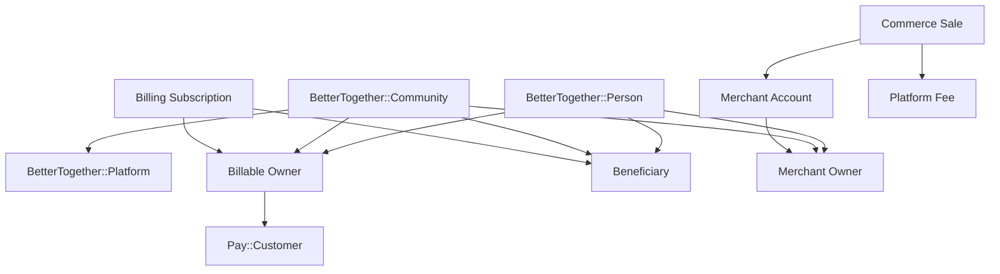

# Community Engine Payments: Multi-Owner Billing and Merchant Integrations Plan

This plan extends the current Stripe-first billing foundation so Community Engine can support:

- `BetterTogether::Community` as a Stripe customer
- `BetterTogether::Person` as a Stripe customer
- customer-owned merchant integrations for Stripe Connect
- customer-owned merchant integrations for PayPal multiparty
- BTS-hosted service fees alongside customer-facing commerce such as event registration and calendar booking

The plan is intentionally split into billing, merchant, and commerce layers. Those layers solve different stakeholder needs and should not be collapsed into one model.

## Stakeholder Goals

### Direct operators

- `Community admins` need to buy and manage hosted service for a community.
- `People` need to buy personal memberships, sponsor a community, or pay directly for services.
- `Platform operators` need a safe way to provision and monitor merchant integrations for hosted communities and individual operators.
- `BTS finance and support` need auditable ownership, fee, webhook, and reconciliation records.

### Indirect stakeholders

- `Community members` are affected by billing and merchant health when it determines access to events, calendars, or hosted service.
- `Connected sellers` need control over their own Stripe or PayPal merchant accounts rather than being locked into BTS as the merchant of record for every payment.
- `End customers` need clear receipts, refund behavior, and merchant identity when paying for registrations or bookings.

## Core Design Decision

Treat these as separate concepts:

1. `billable_owner`
   The CE entity that is the processor-facing customer for a hosted fee or subscription.
2. `beneficiary`
   The CE entity that receives access, entitlement, or service from that billing record.
3. `merchant_owner`
   The CE entity that owns a seller integration and receives customer commerce proceeds, less processor and platform fees.

In the current foundation, `Community` is both the billable owner and the beneficiary. That is acceptable for the first release, but it is too narrow for the next set of stakeholder requirements.

## Target Domain Model

## Phase Plan

### Phase 1: Dual billable owners for hosted billing

Goal: allow both people and communities to exist as Stripe customers for CE-hosted plans.

#### Required changes

- Add `pay_customer` to `BetterTogether::Person`.
- Refactor local subscription ownership from `community_id` to polymorphic `billable_owner`.
- Add polymorphic `beneficiary` to hosted subscriptions and hosted billing events.
- Update checkout, portal, webhook sync, and reconciliation flows to resolve either `Person` or `Community`.
- Add plan eligibility rules so plans can be:
  - person-only
  - community-only
  - both

#### Schema direction

- Replace or supersede `community_id` on `better_together_billing_subscriptions` with:
  - `billable_owner_type`
  - `billable_owner_id`
  - `beneficiary_type`
  - `beneficiary_id`
- Add matching ownership metadata to `better_together_billing_events`.
- Keep `billing_plan_id`, processor ids, sync metadata, and status fields.

#### Behavioral rules

- A person can pay for themselves.
- A community can pay for itself.
- A person can pay on behalf of a community.
- Hosted entitlement decisions must use `beneficiary`, not `billable_owner`.

### Phase 2: Merchant integration subsystem

Goal: allow customers to connect their own Stripe or PayPal merchant accounts while BTS charges platform or service fees.

#### Required changes

- Add `BetterTogether::Billing::MerchantAccount`.
- Support provider-specific states for:
  - `stripe_connect`
  - `paypal_multiparty`
- Add onboarding, capability, status, and external-account identifiers.
- Separate merchant-account ownership from hosted billing ownership.

#### Suggested schema

- `owner_type`
- `owner_id`
- `provider`
- `external_account_id`
- `status`
- `charges_enabled`
- `payouts_enabled`
- `capabilities`
- `country`
- `currency`
- `metadata`
- `last_synced_at`

#### Behavioral rules

- A merchant account can belong to a person or a community.
- A hosted subscription does not imply a merchant integration.
- Merchant onboarding and merchant health must be visible without exposing sensitive processor data.

### Phase 3: Commerce transactions and fee architecture

Goal: support customer-facing commerce flows such as event registration and calendar booking.

#### Required changes

- Add a commerce layer distinct from hosted subscriptions.
- Model customer transactions, refunds, fees, and transfers explicitly.
- Track which entity is:
  - the payer
  - the merchant of record
  - the beneficiary
  - the BTS fee recipient

#### Suggested core records

- `BetterTogether::Billing::Sale`
- `BetterTogether::Billing::PaymentIntentSnapshot` or equivalent processor snapshot
- `BetterTogether::Billing::Refund`
- `BetterTogether::Billing::PlatformFee`
- `BetterTogether::Billing::Transfer` when the processor flow requires it

#### Use-case mapping

- `Event registration`
  Buyer pays a merchant owner through Stripe Connect or PayPal multiparty; BTS collects a service or resale fee.
- `Calendar booking`
  Buyer pays a merchant owner; BTS can charge booking software fees and optionally per-transaction fees.
- `Hosted service`
  Person or community pays BTS directly through platform-side billing.

### Phase 4: Admin UX and policy layer

Goal: make ownership and funds flow understandable to non-technical operators.

#### Required surfaces

- Billing dashboard for person-owned and community-owned subscriptions
- Merchant onboarding and health dashboard
- Fee breakdown and payout-status views
- Capability and compliance prompts for connected merchants
- Ownership-transfer flow for converting person-paid communities into community-paid subscriptions

#### Policy concerns

- Who may attach a merchant account to a community?
- Who may initiate or transfer a hosted subscription?
- What approvals are required to change fee schedules?
- What happens to commerce flows when merchant capabilities are disabled?

### Phase 5: Webhooks, jobs, and reconciliation hardening

Goal: make billing and merchant flows resilient under real processor conditions.

#### Required capabilities

- Provider-specific webhook intake and signature verification
- Durable event journal with replay controls
- Idempotent sync services for:
  - hosted subscriptions
  - merchant-account status
  - commerce sales
  - refunds
  - disputes where relevant
- Scheduled reconciliation jobs for:
  - hosted billing state
  - merchant onboarding status
  - unsettled or mismatched commerce transactions

#### Reliability rules

- Duplicate events must be harmless.
- Missing or out-of-order events must be repairable by reconciliation.
- Manual operator actions must be auditable.
- Queue-backed processing must use a persistent production backend.

## Stripe Architecture Guidance

Use Stripe Billing for BTS-hosted service fees where CE is charging its own customers directly.

Use Stripe Connect for customer-owned merchant flows where a person or community receives customer payments through their own connected account and BTS takes a platform fee or resale fee.

Default Connect guidance for CE:

- Start with `destination charges` for single-merchant transactions where BTS needs a clear platform fee.
- Use `direct charges` only where the connected account should clearly be the merchant of record and own more of the payment lifecycle directly.
- Reserve `separate charges and transfers` for multi-party or delayed-allocation cases.

The right charge type must be chosen per commerce product, not globally.

## PayPal Architecture Guidance

Treat PayPal as a separate merchant-integration rail, not as a drop-in substitute for the current Pay plus Stripe hosted billing slice.

Recommended scope:

- use PayPal multiparty for seller onboarding and platform-fee flows
- keep hosted CE subscriptions Stripe-first initially
- add PayPal-hosted billing support later only if a real hosted-billing use case remains after Stripe-first delivery

## Migration Strategy

### Step 1: preserve the current foundation

- Keep the current community-based billing path functional.
- Add new ownership columns before removing old community-specific fields.
- Backfill existing community subscriptions so:
  - `billable_owner = community`
  - `beneficiary = community`

### Step 2: introduce person billing without breaking community billing

- Add `pay_customer` for people.
- Add person-specific checkout and portal entry points.
- Keep existing community billing controllers working during migration.

### Step 3: introduce merchant accounts behind a feature flag

- Merchant onboarding should remain disabled by default until:
  - webhook handling exists
  - reconciliation exists
  - operator UX exists
  - fee accounting is documented

## Security, Privacy, and Care Requirements

- Do not expose raw processor payloads broadly in admin UI.
- Store only the processor data needed for audit and repair.
- Keep PII retention for webhook payloads time-bounded where possible.
- Separate payout authority from general community admin rights.
- Make ownership transfers explicit, reversible, and logged.
- Do not make access-control decisions directly from unverified webhook payloads.

## Testing and Readiness Gates

### Hosted billing

- person checkout, portal, and subscription sync
- community checkout, portal, and subscription sync
- person pays for community entitlement
- ownership transfer between person and community

### Merchant integrations

- Stripe Connect onboarding state sync
- PayPal multiparty onboarding state sync
- merchant capability loss and recovery
- replay and reconciliation after webhook failure

### Commerce flows

- event registration payment with platform fee
- booking payment with platform fee
- refunds
- mismatched or delayed webhook delivery

## Deliverables

1. Domain refactor for hosted billing ownership
2. Person billing UI and policy layer
3. Merchant-account subsystem
4. Stripe Connect commerce foundation
5. PayPal multiparty commerce foundation
6. Reconciliation and operator runbooks

## Recommended Execution Order

1. Refactor hosted billing to polymorphic `billable_owner` and `beneficiary`
2. Add `Person` as a Pay owner and expose person billing UI
3. Add merchant-account models and onboarding for Stripe Connect
4. Add commerce transaction and fee records for one product lane
5. Pilot event registration or booking, not both at once
6. Add PayPal multiparty after the Stripe merchant path is operationally stable

## References

- Stripe Connect overview: https://docs.stripe.com/connect
- Stripe Connect charges: https://docs.stripe.com/connect/charges
- Stripe Billing with Connect: https://docs.stripe.com/connect/subscriptions
- Stripe connected-account SaaS fees: https://docs.stripe.com/connect/integrate-billing-connect
- Pay gem: https://github.com/pay-rails/pay
- PayPal multiparty: https://developer.paypal.com/docs/multiparty/
