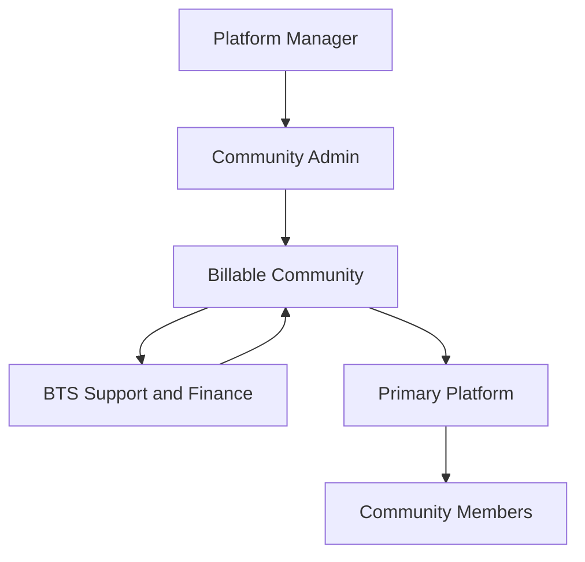
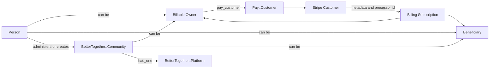

# Community Engine Payments: Stripe-First Foundation

Community Engine now includes a Stripe-first billing slice built around `pay`, BTS-local billing records for plans, subscriptions, and event audit trails, and a Phase 1 hosted-billing ownership model that can resolve both `BetterTogether::Community` and `BetterTogether::Person` as Stripe customers.

## Scope

This implementation includes:

- `pay` and `stripe` gem dependencies
- guarded Pay migrations for host apps with partial schema state
- `BetterTogether::Community` and `BetterTogether::Person` as supported hosted-billing owners
- community-admin billing page with hosted checkout, sponsorship-aware billing portal links, and checkout return sync
- local billing plan, subscription, and event models with sync tracking
- a CE-owned checkout return path that can synchronize Stripe checkout completion immediately
- Stripe webhook processing that enqueues narrow subscription events, persists BTS billing events, and syncs local subscription state
- a manual and job-driven community reconciliation path for Stripe subscriptions
- owner / beneficiary metadata so hosted subscriptions can distinguish who pays from who receives service

This implementation does not yet include:

- dunning and failed-payment recovery UX
- automated plan seeding
- participant-facing entitlement mapping beyond plan metadata and billing-page product copy
- tax, invoicing, or metered-billing flows
- automated remediation for unresolved reconciliation mismatches

## Phase 2 merchant-account status

The first Stripe Connect merchant-account slices now exist alongside hosted billing, but they remain a separate subsystem:

- `BetterTogether::Billing::MerchantAccount` supports person-owned and community-owned Stripe Connect records
- person and community billing pages expose merchant health, onboarding, and manual refresh entry points
- Stripe `account.updated` and `account.application.deauthorized` events now flow through the existing `BetterTogether::Billing::Event` journal and `StripeEventProcessor`
- merchant-account refresh is also available as a focused background job via `ReconcileStripeMerchantAccountJob`

This keeps hosted subscription ownership, hosted-service entitlement, and merchant payout ownership distinct:

- `billable_owner`
- `beneficiary`
- `merchant_owner`

## Architecture

```mermaid
flowchart LR
  Admin[Community Admin] --> BillingUI[Community Billing Page]
  BillingUI --> Checkout[Stripe Checkout]
  BillingUI --> Portal[Stripe Billing Portal]
  Checkout --> Stripe[Stripe]
  Portal --> Stripe
  Stripe -->|webhooks| PayWebhook[/pay/webhooks/stripe]
  Stripe -->|redirect with session id| ReturnFlow[Community Billing Return Flow]
  PayWebhook --> PayGem[Pay webhook delegator]
  PayGem --> Job[ProcessStripeEventJob]
  Job --> Processor[StripeEventProcessor]
  ReturnFlow --> CheckoutSync[StripeCheckoutSessionSync]
  CheckoutSync --> SubSync[StripeSubscriptionSync]
  ReconcileJob[ReconcileStripeCommunityBillingJob] --> Reconciler[StripeCommunityReconciliation]
  Reconciler --> SubSync
  Processor --> EventLog[(better_together_billing_events)]
  Processor --> LocalSubs[(better_together_billing_subscriptions)]
  Processor --> Plans[(better_together_billing_plans)]
  Processor --> Communities[(better_together_communities)]
  SubSync --> LocalSubs
```

## Stakeholders

The current billing slice affects operators and organization-level owners first, not individual end users.



- `Community Admin` and `Platform Manager` are the direct human operators of billing.
- `Community` is always a possible beneficiary and may also be the billable owner.
- `Person` can now be the processor-facing customer for personal billing or community sponsorship.
- `Primary Platform` is operationally affected, but it is not the processor-facing customer in this release.
- `Community Members` are indirect stakeholders because billing can affect the hosted space they use.
- `BTS Support and Finance` rely on the local billing records and event trail for audit, support, and reconciliation.

## Billing Model

- `BetterTogether::Billing::Plan` is the local catalog record and references the canonical Stripe Price ID.
- the current hosted-billing launch path is intentionally limited to recurring plans; `one_time` plans should remain out of the participant-facing billing catalog until CE handles the full Stripe one-time fulfillment path
- `BetterTogether::Billing::Subscription` is the CE-local subscription read model.
- `BetterTogether::Billing::Event` stores raw Stripe webhook payloads plus BTS processing state.
- `Pay::Customer` remains the processor-facing customer record owned by either a `BetterTogether::Community` or a `BetterTogether::Person`.
- `BetterTogether::Billing::Subscription` now distinguishes:
  - `billable_owner` for the processor-facing payer
  - `beneficiary` for the CE entity receiving hosted service

Hosted plans can also carry participant-facing billing-page copy in `metadata`:

- `participant_summary`
- `participant_benefits`
- `beneficiary_label`

The current hosted-billing participant-value slice also reads these optional entitlement-oriented metadata keys:

- `hosted_access_level`
- `support_tier`
- `community_capacity_tier`

CE now resolves and displays a community's current hosted-plan status from the latest synced billing subscription and those plan metadata fields. This is intentionally a read-only launch outcome, not yet a broad feature-flag matrix.

## Ownership Wiring



- people are now valid hosted-billing owners in Phase 1
- communities remain the main organization boundary for hosted service and may be either the payer or the beneficiary
- platforms hang off communities and inherit the operational consequences of billing
- local billing subscriptions are CE-side read models tied to the active billable owner and the beneficiary

## Current Phase 1 status

The current implementation has moved beyond the original community-only foundation:

- a person can pay for themselves
- a community can pay for itself
- a person can sponsor a community
- one community can sponsor another community
- checkout return sync, portal access, and reconciliation follow the active billable owner while hosted entitlement remains tied to the beneficiary

This is still a Phase 1 hosted-billing slice. It does not yet model a fully explicit transfer-state workflow for changing ownership over time; it currently handles takeover by starting a replacement checkout with the intended new owner.

## Phase 1 transfer decision

Phase 1 intentionally stops at the replacement-checkout model.

- if billing should move to a different person or community, CE starts a replacement Stripe checkout with the intended new `billable_owner`
- CE does not yet model a separate transfer request, approval, acceptance, or cleanup state machine
- sponsor cleanup is handled through the normal subscription sync and reconciliation path after the replacement checkout succeeds
- non-sponsor admins who cannot open the current sponsor's billing portal are explicitly guided to start a replacement checkout instead of trying to mutate ownership in place

This keeps hosted billing simple while preserving the real ownership split:

- `billable_owner`
- `beneficiary`

An explicit transfer-state workflow remains possible later, but it is not required to complete the current hosted-billing slice.

If BTS later needs explicit transfer approvals, rollback, or delegated acceptance, that work should be modeled as a separate hosted-billing workflow with its own audit trail rather than being folded into merchant-account ownership logic.

## Source Docs

- [Stripe setup and install guide](./payments-stripe-first-setup.md)
- [Webhook operations and resilience guide](./payments-stripe-webhook-operations.md)
- [Stripe Connect merchant operations runbook](./payments-stripe-connect-merchant-operations.md)
- [Multi-owner billing and merchant integrations plan](./payments-multi-owner-and-merchant-integrations-plan.md)
