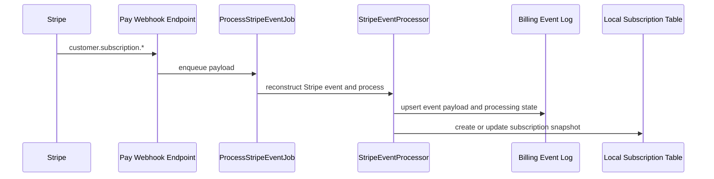

# Stripe Webhook Operations

This guide describes the current webhook path and the operational gaps that still need hardening before production rollout.

## Current Flow

## Processing Contract

- every webhook event is keyed by Stripe `event.id`
- only the Stripe subscription events CE currently uses are subscribed
- the custom CE sync work is enqueued off the webhook request thread
- subscription events attempt to resolve the community from Stripe metadata first, then `Pay::Customer`
- unsupported or unresolvable events are marked as ignored instead of failing silently

## Required Operational Expectations

- webhook signing must remain enabled with `STRIPE_WEBHOOK_SECRET`
- event replay must be safe because the event table keys on processor plus event id
- Stripe delivery retries must not produce duplicate local subscription rows
- local plans must continue to reference stable Stripe Price IDs

## Known Gaps Before Production Hardening

- there is no dead-letter or retry queue for local sync failures
- invoice, payment failure, and charge dispute events are not yet surfaced in CE UX
- subscription reconciliation is event-driven only and does not yet include a scheduled backfill job

## Recommended Next Hardening Steps

1. Move the processor call into an idempotent Active Job with a narrow synchronous ack path.
2. Add a replay-safe reconciliation job that compares Stripe subscriptions against local `BetterTogether::Billing::Subscription` records.
3. Capture more processor state for operational support, including Stripe customer id, last invoice id, and last event creation time.
4. Add admin-visible error states for failed syncs and portal unavailability.
5. Add alerting on repeated webhook processing failures.
