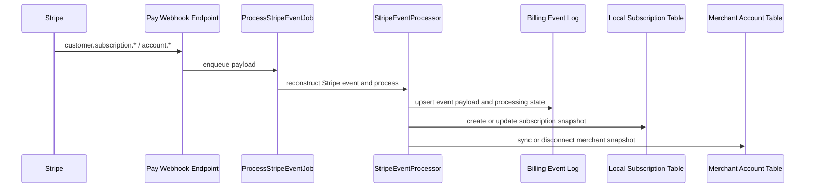

# Stripe Webhook Operations

This guide describes the current webhook path for both hosted billing subscriptions and Stripe Connect merchant accounts, plus the operational gaps that still need hardening before production rollout.

## Current Flow

## Processing Contract

- every webhook event is keyed by Stripe `event.id`
- Stripe events currently subscribed by CE include:
  - `customer.subscription.*`
  - `checkout.session.completed`
  - `account.updated`
  - `account.application.deauthorized`
- the custom CE sync work is enqueued off the webhook request thread
- checkout success redirects also perform an idempotent CE-side sync using the Checkout Session ID
- subscription events attempt to resolve the community from Stripe metadata first, then `Pay::Customer`
- merchant account events resolve the local merchant account from the Stripe Connect account id
- `account.updated` reuses `MerchantAccounts::StripeConnect::SyncAccount` so webhook repair and manual refresh share the same local state mapping
- `account.application.deauthorized` marks the local merchant account disconnected and clears the enabled capability flags
- unsupported or unresolvable events are marked as ignored instead of failing silently
- local subscriptions and merchant accounts now record enough sync state to support webhook-driven repair and focused manual reconciliation
- raw Stripe webhook payloads are retained only for a short replay window, then redacted in place to a minimal audit snapshot

## Required Operational Expectations

- webhook signing must remain enabled with `STRIPE_WEBHOOK_SECRET`
- event replay must be safe because the event table keys on processor plus event id
- Stripe delivery retries must not produce duplicate local subscription rows
- Stripe delivery retries must not produce duplicate local merchant-account state transitions
- local plans must continue to reference stable Stripe Price IDs
- merchant-account owners must remain distinct from hosted billing `billable_owner` and hosted-service `beneficiary`

## Merchant Event Behavior

### `account.updated`

- use the Stripe Connect account id to find the local `BetterTogether::Billing::MerchantAccount`
- run the standard Stripe Connect sync mapper
- update merchant status, capability flags, country, currency, and metadata snapshot
- persist the webhook in `better_together_billing_events`

### `account.application.deauthorized`

- use the Stripe account id from the event payload or event account field
- mark the local merchant account:
  - `status = disconnected`
  - `charges_enabled = false`
  - `payouts_enabled = false`
- persist the webhook in `better_together_billing_events`
- preserve the disconnect reason in metadata so support can distinguish deauthorization from a routine restricted state

## Manual Reconciliation

Current manual/operator-safe repair paths:

1. Owner-facing billing page action:
   - `refresh_merchant_account`
2. Focused background job:
   - `BetterTogether::Billing::ReconcileStripeMerchantAccountJob`
3. Scheduled scan jobs:
   - `BetterTogether::Billing::ReconcileStripeBillableOwnerBillingScanJob`
   - `BetterTogether::Billing::ReconcileStripeMerchantAccountScanJob`
4. Daily payload redaction scan:
   - `BetterTogether::Billing::RedactExpiredEventPayloadsJob`

Operator-visible billing pages now also surface recent failed or ignored Stripe billing events
for the affected person or community so support can spot webhook drift without querying the
event table directly.

Those billing pages now also escalate:

- repeated failures when the same billing record has events that failed `3` or more times
- unresolved drift when failed or ignored events remain older than the `6`-hour reconciliation window
- merchant disconnect and payout-readiness issues directly on the merchant account card
- persistent portal-access support state on the subscription card after a portal attempt fails

These paths should be used when:

- the merchant health card looks stale
- a webhook was missed or failed upstream
- onboarding is complete in Stripe but CE has not yet reflected the new capabilities
- support needs to verify whether a disconnected or restricted state is still current

## Payload Retention Policy

- raw Stripe event payloads are stored briefly so replay/debugging can use the original processor shape
- after `30` days, CE redacts each payload down to a minimal audit snapshot
- the redacted snapshot keeps:
  - Stripe event id and type
  - request correlation ids when present
  - account / customer / subscription identifiers
  - CE metadata needed to resolve owners and beneficiaries
  - limited status / capability fields needed for support and reconciliation
- the redacted snapshot removes non-essential attributes that may include broader personal or financial detail
- redaction is idempotent and tracked on `better_together_billing_events.payload_redacted_at`

## Known Gaps Before Production Hardening

- there is no dead-letter or retry queue for local sync failures
- invoice payment failures and mapped charge disputes now surface through CE billing activity alerts when the webhook can be resolved to a local billing record
- invoice settlement/finalization events now refresh local billing subscription sync metadata
- scheduled reconciliation now exists for:
  - Stripe-backed hosted billing owners
  - connected Stripe merchant accounts
- operator-visible billing pages now escalate:
  - repeated webhook failures when an event fails `3` or more times
  - stale unresolved drift when failed or ignored events remain older than the `6`-hour reconciliation window
- daily payload redaction now exists, but unresolved drift still relies on operator-visible alerts and reconciliation rather than a dedicated dead-letter queue

## Recommended Next Hardening Steps

1. Decide whether CE needs a dead-letter or replay workflow for webhook events that still cannot be repaired automatically.
2. Capture more processor state for operational support, including last invoice id and last event creation time.
3. Decide whether refund-only events should surface a dedicated operator notice once CE models one-off commerce transactions beyond subscription billing.
