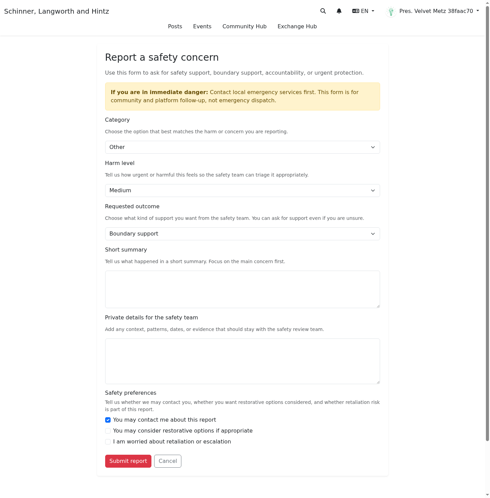
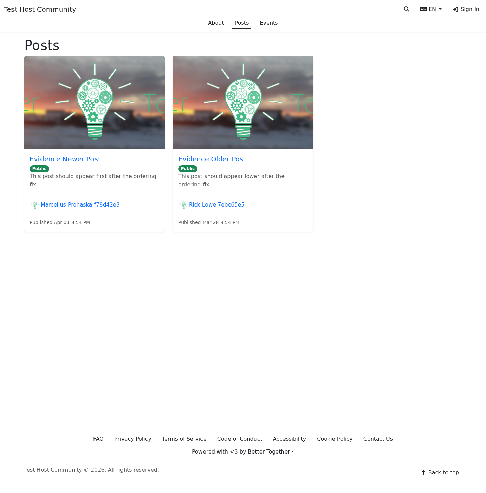
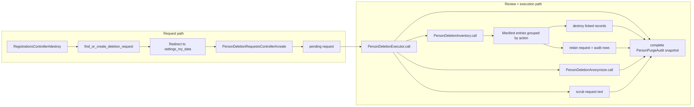
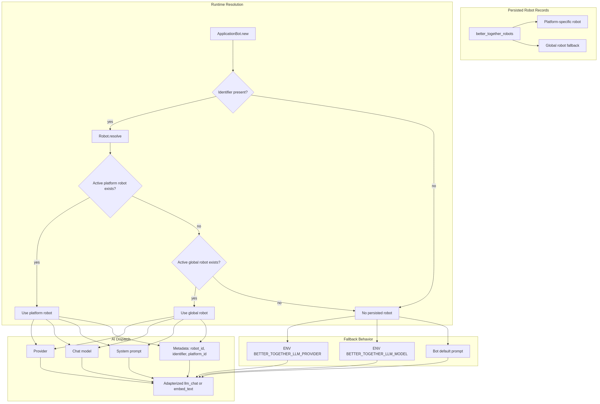
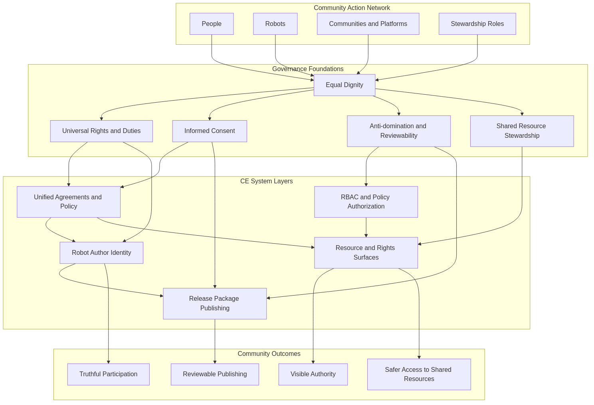
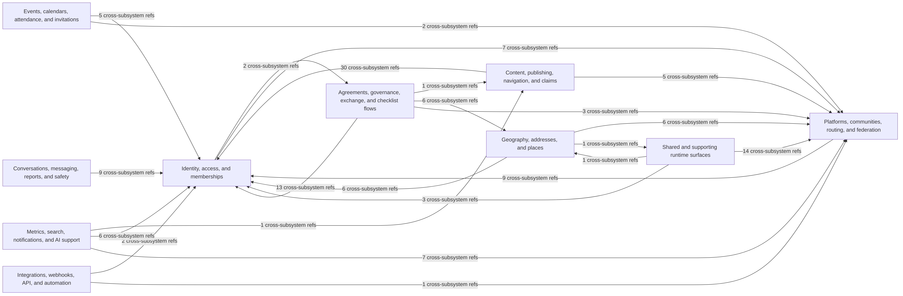

# 0.11.0 Release Notes

**Status:** Unreleased  
**Release range:** `v0.10.0..main`

This release packet tracks the shipped delta after `0.10.0` and is intended to stay aligned with the canonical [changelog](../../CHANGELOG.md), the release capability map, and the visual/documentation assets needed for stakeholder review.

This refresh also folds in the newer mainline additions that were not yet reflected in the earlier draft release packet:

- `#1500` — community access-mode unification and membership-request review evidence
- `#1501` — inbound email relay MVP with tenant-safe routing contracts
- `#1494` — community action network governance docs and release-package publishing rules
- `#1486` — GDPR-oriented person deletion audit flow, screenshots, and deletion-process diagrams
- `#1490` — adapterized block contracts and error-reporting hardening
- `#1491` — provider adapter architecture scaffold
- `#1493` — robot configuration architecture docs and resolution-flow diagram
- `#1504` — content-security ingress review states plus refreshed reporting/feedback evidence
- `#1497` — tiered PR evidence enforcement for screenshots, diagrams, and reviewer packets
- `#1498` — screenshot review-artifact hardening and image-load capture safety
- `#1499` — Community Engine subsystem diagram packet and deterministic diagram evidence

## Executive summary

`0.11.0` is a broad architecture-and-operations release.

At a high level it:

- turns Community Engine into a more clearly platform-aware and federated system
- adds stronger member data rights, consent, and privacy controls
- makes community access and membership-request review states clearer for both members and organizers
- continues the safety-reporting lane, adds content-security review states, and keeps E2EE rollout explicitly gated
- introduces tenant-safe inbound mail ingress as a new documentation-first runtime surface
- expands content, search, and MCP tooling for organizers and maintainers
- moves AI translation/runtime work toward persisted robot configuration and adapterized provider dispatch
- adds clearer governance, reviewer-evidence, and architecture-documentation surfaces for how CE is operated and audited

This packet is intentionally evidence-heavy, but it should still be readable by people who are not tracking every PR. Each major section below explains what changed, why it matters, who is most affected, and where to go for deeper detail.

## Who should read this packet

- **Stakeholders and reviewers:** start with the executive summary plus sections 1, 2, and 5 to understand the largest user-facing and governance-facing changes.
- **Platform organizers and operators:** focus on sections 1 through 8 for setup, federation, privacy, access/review flows, reporting, mail ingress, search, and runtime operations.
- **Developers and maintainers:** read the full packet, especially the linked supporting docs for search validation, platform bootstrap, MCP/content tooling, and AI runtime changes.

## Release packet mechanics

`0.11.0` should be prepared with the same evidence discipline now expected for PRs:

- docs must cover each major user-facing or operator-facing subsystem change
- diagrams must explain major process or architecture shifts
- screenshots should exist for new UI flows where reviewer comprehension benefits from visual evidence
- missing visuals are release gaps, not silent omissions

For this packet, the evidence standard is:

- **user-facing or organizer-facing UI changes:** docs plus current screenshots where visuals materially help review
- **architecture-only or runtime-contract changes:** docs, diagrams, migrations, and implementation references are acceptable when no new branch-tip UI actually shipped
- **deferred work:** label it explicitly instead of implying that a hidden or future-facing surface is already part of the shipped release experience

Current CE-native tooling:

- screenshots: `RUN_DOCS_SCREENSHOTS=1 ./bin/docs_screenshots`
- diagrams: `./bin/render_diagrams --force`
- subsystem packet refresh: `./bin/export_subsystem_diagrams`
- subsystem packet verification: `./bin/verify_subsystem_diagrams`
- docs validation: `./scripts/validate_documentation_tooling.sh`
- PDFs: `./scripts/generate_docs_pdf.sh`
- missing-asset follow-up plan: [0.11.0 asset capture plan](0.11.0_asset_capture_plan.md)

Recent mainline hardening also tightened the reviewer-evidence path itself:

- screenshot sidecars now keep path-only URLs instead of transient loopback origins (`#1498`)
- screenshot sidecars no longer persist volatile `captured_at` noise (`#1498`)
- declared screenshot callouts and release uploads/image-library captures now fail closed if annotation geometry or image loading is incomplete (`#1498`)

## Capability map

- Mermaid source: [release_0_11_0_capability_map.mmd](../diagrams/source/release_0_11_0_capability_map.mmd)
- PNG export: [release_0_11_0_capability_map.png](../diagrams/exports/png/release_0_11_0_capability_map.png)
- SVG export: [release_0_11_0_capability_map.svg](../diagrams/exports/svg/release_0_11_0_capability_map.svg)

## Implemented vs. deferred at a glance

- **Implemented in `0.11.0`:** federation/platform scoping, privacy/data-rights workflows, community access/review flows, safety reporting, content-security review states, inbound mail ingress, search/reporting hygiene, uploads/content tooling, MCP/API expansion, and AI runtime foundations
- **Implemented but intentionally gated/documentation-first:** E2EE rollout and AI runtime/robot configuration
- **Implemented in code but deferred from normal branch-tip editor rollout:** the newer structured content block families
- **Not yet a first-class organizer UI on this branch tip:** robot/AI management screens

## Embedded artefacts already available on the branch

These are the current-tip screenshots and diagrams already present on the release branch for reviewer-facing use.

### Safety report workflow

### Search and discovery ordering

### GDPR person deletion audit flow

### Robot configuration resolution

### Community action network governance

### Community Engine subsystem packet

## 1. Federation, multi-tenancy, and platform scoping

This is the largest architectural shift in `0.11.0`. Community Engine now behaves as a platform-aware engine with host-platform context, platform-scoped data access, federated connections, mirrored content, and more explicit cross-platform consent boundaries.

**Why it matters:** This release stops treating CE like a single-site app with optional external links. Platform identity, scoping, trust, and cross-platform sharing are now first-class concerns in the engine itself.

**Who is affected:** stakeholders reviewing federation/governance posture, organizers configuring host platforms and trust relationships, and developers maintaining platform-aware behavior.

### Major shipped changes

- multi-tenant platform architecture and host-platform setup flows
- setup-wizard hardening to avoid duplicate host-platform creation and to block re-entry after completion
- federation platform connections and OAuth-backed trust
- mirrored pages, posts, and events with collision-safe identifier handling
- creator opt-in for public federated content export, plus grant-based private linked sharing
- platform-scoped metrics, messaging participants, notifications, and navigation fixes
- first-class storage adapter support for local, Amazon S3, and S3-compatible backends, with organizer-facing configuration UI
- community action network governance rules that connect agreements, publishing authority, robots, and shared-resource stewardship into one reviewable system (`#1494`)

### Docs coverage

- [Multi-Tenancy Upgrade Guide](../upgrade/multi-tenancy-upgrade.md)
- [Federated seed and sync handoff](../implementation/multi_tenancy/federated_seed_and_sync_handoff_2026-03-12.md)
- [Platform organizer federation/privacy guidance](../platform_organizers/federation_privacy_and_consent.md)
- [0.11.0 setup wizard and platform bootstrap evidence](0.11.0_setup_wizard_and_platform_bootstrap.md)
- [Community Action Network Governance System](../developers/systems/community_action_network_governance_system.md)
- [Release Package Publishing System](../developers/systems/release_package_publishing_system.md)

### Diagram coverage

- existing system diagrams remain relevant:
  - [content_flow.mmd](../diagrams/source/content_flow.mmd)
  - [navigation_flow.mmd](../diagrams/source/navigation_flow.mmd)
  - [metrics_flow.mmd](../diagrams/source/metrics_flow.mmd)
- release-specific cross-check:
  - [release_0_11_0_capability_map.mmd](../diagrams/source/release_0_11_0_capability_map.mmd)
  - [release_0_11_0_setup_wizard_platform_flow.mmd](../diagrams/source/release_0_11_0_setup_wizard_platform_flow.mmd)

### Screenshot coverage

- current-tip release captures now cover:
  - setup wizard platform-details step
  - completed setup-wizard re-entry guard
  - platform connections index
  - platform connection policy editor
  - host-platform profile/admin view
  - connected-account integrations
  - storage adapter index and edit form
- related member portability UI evidence is also present through the privacy/data-rights packet

## 2. Privacy, member data rights, and consent auditing

`0.11.0` materially strengthens privacy and personal-data stewardship with self-service export/deletion workflows, agreement acceptance auditing, and stronger privacy preference handling.

**Why it matters:** The release makes member portability, deletion, and consent boundaries more visible and less ad hoc. It also gives reviewers a clearer story for how CE handles stewardship of personal data.

**Who is affected:** members using export/deletion tools, organizers handling privacy/compliance workflows, and maintainers responsible for consent and audit trails.

### Major shipped changes

- member data export workflow
- member deletion request workflow
- agreement acceptance audit fields and recorder service
- privacy/safety preferences aligned with current report and consent flows
- consent boundaries clarified for federation-related sharing
- person-deletion inventory, anonymization, manifest, and hard-deletion executor services (`#1486`)
- account-tab deletion request cleanup and removal of the legacy My Data seed section

### Docs coverage

- [Privacy and safety preferences](../end_users/privacy_and_safety_preferences.md)
- [Safety reporting](../end_users/safety_reporting.md)
- [Security and privacy management](../platform_organizers/security_privacy.md)
- [My data and exports](../end_users/my_data_and_exports.md)
- [Account deletion requests](../end_users/account_deletion_requests.md)

### Diagram coverage

- current-tip release review diagrams already exist:
  - [pr_1486_seed_export_flow.mmd](../diagrams/source/pr_1486_seed_export_flow.mmd)
  - [pr_1486_seed_export_process.mmd](../diagrams/source/pr_1486_seed_export_process.mmd)
  - [pr_1486_seed_export_model.mmd](../diagrams/source/pr_1486_seed_export_model.mmd)
- existing privacy/security architecture remains relevant:
  - [security_protection_flow.mmd](../diagrams/source/security_protection_flow.mmd)

### Screenshot coverage

- current-tip review screenshots already exist for:
  - my-data/export flow
  - person seeds index/detail flow
  - account deletion flow
- release-prefixed captures now exist for:
  - member data export page
  - deletion request page or request state view
- privacy preference / export consent remains covered by the surrounding privacy and federation docs rather than a dedicated new release screenshot

## 3. Access modes, invitations, and membership review

`0.11.0` makes community access expectations easier to understand and review. Instead of leaving join behavior to scattered copy or one-off review knowledge, the release range now carries clearer open-join versus request-to-join surfaces, a more legible membership-request lifecycle, and organizer review evidence for the moderation path.

**Why it matters:** Community participation starts at the access seam. People need to know whether they can join immediately or need review first, and organizers need a clear queue for those review decisions instead of ad hoc intake.

**Who is affected:** members joining communities, organizers reviewing participation requests, and maintainers responsible for access-mode behavior and request handling.

### Major shipped changes

- unified open-join versus request-to-join community access states across public-facing community surfaces (`#1500`)
- membership-request registration interstitial and review queue/detail flows that make pending review legible instead of silently burying it (`#1500`)
- public membership-request creation remains API-backed, but the organizer review path is now more explicitly documented and easier to verify from branch-tip evidence
- invitation and request-review surfaces now align better with the broader participation model rather than acting like isolated admin-only edge cases

### Docs coverage

- [Community management](../platform_organizers/community_management.md)
- [Community participation](../end_users/community_participation.md)
- [Membership request workflow](../developers/systems/membership_request_workflow.md)

### Diagram coverage

- [access_mode_paths_overview.mmd](../diagrams/source/access_mode_paths_overview.mmd)
- [membership_request_workflow.mmd](../diagrams/source/membership_request_workflow.mmd)
- [platform_manager_invitations_flow.mmd](../diagrams/source/platform_manager_invitations_flow.mmd)

### Screenshot coverage

- current-tip screenshots already exist for:
  - community open-join state
  - community request-to-join state
  - membership-request registration interstitial
  - organizer review queue and detail views
- dedicated review packet assets also exist under `docs/screenshots/review/pr-1500/`
- no separate release-prefixed access-mode captures were required because the stable branch-tip and review-packet evidence already cover the shipped states

## 4. Safety reporting, content security, and encrypted messaging

The release continues the safety-reporting lane, expands content-security review evidence, and also ships the beta-gated E2EE conversation stack.

**Why it matters:** Safety reporting is now more accessible and better documented, content under review has clearer operator and end-user states, and encrypted messaging remains intentionally cautious instead of being framed as silently “done.”

**Who is affected:** community members using safety tooling, organizers reviewing moderation/content-security flows, and developers handling encrypted messaging rollout.

### Major shipped changes

- accessible safety reporting workflow across blocks, communities, posts, and pages
- clarified safety-routing and privacy guidance for who can submit, who can review, and what remains private to the reporter plus platform safety reviewers (`#1504`)
- page-bottom feedback bar for page views while preserving established ellipsis/menu-based report seams on other content surfaces (`#1504`)
- held and restricted upload review states, plus a content-security review queue for attachment moderation and release decisions (`#1504`)
- restorative-safety supporting model/process work
- Signal-based E2EE conversation stack behind explicit opt-in
- `0.11.0` rollout hardening for E2EE remains intentionally conservative

### Docs coverage

- [Safety reporting](../end_users/safety_reporting.md)
- [Reporting harm and safety concerns](../end_users/reporting_harm_and_safety_concerns.md)
- [Content reporting stakeholder flows](../development/content_reporting_stakeholder_flows.md)
- [Content security ingress system](../developers/systems/content_security_ingress_system.md)
- [E2E Encryption Rollout](../platform_organizers/e2e_encryption_rollout.md)
- [E2E security model](../security/e2e-security-model.md)

### Diagram coverage

- [content_reporting_stakeholder_flow.mmd](../diagrams/source/content_reporting_stakeholder_flow.mmd)
- [content_security_ingress_flow.mmd](../diagrams/source/content_security_ingress_flow.mmd)
- existing conversation/system diagrams:
  - [conversations_messaging_flow.mmd](../diagrams/source/conversations_messaging_flow.mmd)
- release-specific E2EE stakeholder view:
  - [e2e_encrypted_conversation_flow.mmd](../diagrams/source/e2e_encrypted_conversation_flow.mmd)
  - [e2e_encrypted_conversation_flow.png](../diagrams/exports/png/e2e_encrypted_conversation_flow.png)
  - [e2e_encrypted_conversation_flow.svg](../diagrams/exports/svg/e2e_encrypted_conversation_flow.svg)

### Screenshot coverage

- current screenshot assets already cover:
  - report form
  - report detail
  - report history
  - blocked people list
  - block person form
- current-tip content-security/reporting screenshots also now cover:
  - block and community report menus
  - page feedback bar
  - content-security review queue
  - upload under-review and restricted states
- dedicated review packet assets also exist under `docs/screenshots/review/pr-1504/`
- release packet does not need to recreate the older report-history/detail captures unless UI drift makes them stale
- no current-tip screenshots exist for E2EE messaging surfaces; these remain optional while rollout stays beta-gated

## 5. Inbound mail relay and tenant-safe routing

`0.11.0` introduces the first inbound-email relay path for CE using Action Mailbox plus Better Together routing contracts. This is a runtime and architecture feature rather than a new organizer-facing settings UI, so the release packet should describe it directly instead of hiding it in implementation commits.

**Why it matters:** Email ingress is a high-risk trust boundary. The release makes inbound routing more explicit, multi-tenant aware, and reviewable so host apps do not have to guess how mail should enter the platform.

**Who is affected:** operators wiring mail ingress, host apps providing mailbox subclasses, and maintainers responsible for inbound routing, persistence, and privacy posture.

### Major shipped changes

- inbound email relay MVP built on Action Mailbox and Better Together mailbox routing (`#1501`)
- tenant-safe routing and resolution services for mapping inbound mail to the correct platform context (`#1501`)
- persisted inbound email message records to support reviewable ingress behavior instead of transient-only mail handling
- host mailbox contract guidance that makes subclass requirements explicit for CE host apps

### Docs coverage

- [Mail ingress MVP](../mail_ingress_mvp.md)

### Diagram coverage

- [mail_ingress_multi_tenant_flow.mmd](../diagrams/source/mail_ingress_multi_tenant_flow.mmd)
- [mail_ingress_privacy_controls.mmd](../diagrams/source/mail_ingress_privacy_controls.mmd)

### Screenshot coverage

- no dedicated release screenshots are required here
- this section remains intentionally documentation-first because no organizer-facing mail-ingress admin UI ships on the branch tip

## 6. Metrics, analytics retention, and reporting hygiene

`0.11.0` shifts analytics toward platform-aware and privacy-minimizing behavior.

**Why it matters:** CE is moving away from opaque metrics accumulation toward scoped, reviewable analytics with clearer retention posture and better search/index visibility.

**Who is affected:** organizers monitoring usage and search health, privacy reviewers, and developers maintaining metrics/search infrastructure.

### Major shipped changes

- platform-scoped analytics reads and writes
- retention controls for raw metrics
- reduced search query retention footprint
- related reporting service and task coverage
- search audit, health reporting, and live Elasticsearch validation in the release lane

### Docs coverage

- [Metrics system](../developers/systems/metrics_system.md)
- [0.11.0 search audit and validation](0.11.0_search_audit_and_validation.md)

### Diagram coverage

- [metrics_flow.mmd](../diagrams/source/metrics_flow.mmd)
- [release_0_11_0_search_validation_flow.mmd](../diagrams/source/release_0_11_0_search_validation_flow.mmd)
- the current release packet keeps this section documentation-first; the existing system diagram is sufficient for `0.11.0`

### Screenshot coverage

- no dedicated release screenshots yet
- keep this section documentation-first in `0.11.0`; no separate organizer-facing retention configuration UI ships on branch tip

## 7. Content authoring, uploads, and discovery

This release significantly improves authoring and browsing UX.

**Why it matters:** Content workflows are more capable for both human editors and tool-driven integrations, while uploads, embeds, and search/discovery surfaces are easier to operate safely.

**Who is affected:** editors, platform organizers, API/MCP consumers, and maintainers working on content blocks, uploads, or search tooling.

### Major shipped changes

- uploads gallery with search and copy
- image library selection for content block images
- total upload size display
- event list preloading and pagination improvements
- posts index ordering fixes
- JSON:API endpoints and MCP tooling for content blocks and page blocks
- broader page/post search and editing primitives, including `SearchPagesTool`, `SearchPostsTool`, `UpdatePostTool`, and `PublishPostTool`
- shared content-search helpers used to keep MCP/API search behavior aligned across pages and posts
- adapterized block contracts and error reporting for content/editor flows (`#1490`)
- safer embed handling
- restored Mermaid block-form partial coverage (`#1349`)
- the new structured content block families introduced during the cycle remain implemented in code, but their `Add Block` rollout is deferred until a 0.11.x patch review of editor forms, render surfaces, icons, and any required Stimulus behavior

### Docs coverage

- [Embedded content and CSP controls](../platform_organizers/embedded_content_and_csp.md)
- [Content block completeness checklist](../content-block-completeness-checklist.md)
- [0.11.0 API and MCP content tooling surface](0.11.0_api_mcp_content_surface.md)

### Diagram coverage

- [content_flow.mmd](../diagrams/source/content_flow.mmd)
- [events_flow.mmd](../diagrams/source/events_flow.mmd)
- [release_0_11_0_api_mcp_content_surface.mmd](../diagrams/source/release_0_11_0_api_mcp_content_surface.mmd)

### Screenshot coverage

- current-tip screenshots already exist for:
  - block editor contract review surfaces
  - posts index ordering evidence
- release-prefixed screenshots now also cover:
  - uploads gallery
  - block image-library picker
- uploads/media review captures are now safer to trust because the screenshot pipeline waits for image loads and fails closed on missing callout geometry instead of silently committing degraded evidence (`#1498`)
- deferred review packet also exists for:
  - full-browser `Page -> Page Blocks` editor-form captures for each hidden block type
  - representative render captures used for internal rollout review, not public editor enablement
- event list pagination/preloading remains covered by the shipped code and changelog narrative; dedicated release-prefixed event-list captures were not required to complete the packet

## 8. AI runtime, translation, and robot configuration

`0.11.0` also changes the runtime model behind CE's AI translation path. The release range now includes persisted robot records, adapterized LLM/embedding dispatch, and a move away from a single direct-provider assumption in the core engine.

**Why it matters:** This is mostly backend/runtime work, but it materially changes how translation and future AI-assisted features are configured, audited, and routed. It lays groundwork for platform-specific AI behavior and for safer local/remote provider abstraction.

**Who is affected:** operators managing AI configuration, developers maintaining translation/runtime code, and reviewers assessing how CE avoids hard-wiring itself to one provider path.

### Major shipped changes

- persisted `BetterTogether::Robot` records for runtime AI configuration
- platform-specific and global-fallback robot resolution
- adapter-registry wiring for LLM and embeddings dispatch
- `ruby_llm` initialization replacing the older direct OpenAI bootstrap path
- `ApplicationBot` and `TranslationBot` refactoring to resolve provider/model/runtime metadata through the new contract
- translation/runtime metadata becoming easier to audit and evolve without hard-coding one provider path

### Docs coverage

- [0.11.0 AI runtime and robot configuration](0.11.0_ai_runtime_and_robot_configuration.md)

### Diagram coverage

- no release-specific AI runtime diagram is on this branch yet
- keep this section documentation-first in `0.11.0` rather than pretending a stale OpenAI-only diagram still explains the shipped runtime
- the release capability map remains the high-level visual reference until AI/runtime diagrams are refreshed

### Screenshot coverage

- no dedicated release screenshots are required here
- the robot/runtime change is primarily architectural; no organizer-facing robot management UI ships on this branch tip
- existing translation UI remains relevant, but the main release value here is the runtime/configuration shift rather than a new visible form

## 9. SEO, structured data, and native polish

This release also improves search/discovery metadata and smaller native presentation details.

**Why it matters:** These changes tighten discovery metadata and fit-and-finish details without demanding a large new UI rollout.

**Who is affected:** maintainers concerned with discoverability, implementers integrating structured data, and reviewers tracking quality-of-experience improvements.

### Major shipped changes

- JSON-LD structured data helpers
- meta descriptions for standard pages
- `page_title` helper and cleaner application-layout title rendering
- native branding/presentation improvements

### Docs coverage

- [SEO guide](../seo.md)

### Diagram coverage

- no dedicated current system diagram specifically covers SEO/structured data
- release packet can rely on changelog text plus capability map unless a dedicated release diagram is needed

### Screenshot coverage

- screenshots are optional here
- no dedicated capture is required for `0.11.0`

## 10. Bug fixes, hardening, dependencies, and release housekeeping

This release also carries a large amount of correctness and compatibility work that should be called out explicitly.

**Why it matters:** A large share of `0.11.0` value comes from hardening, safety fixes, compatibility maintenance, and release hygiene that make the more visible features actually supportable.

**Who is affected:** everyone running or upgrading CE, especially maintainers responsible for CI, compatibility lanes, embeds, uploads, and policy/reporting correctness.

### Notable bugfixes and hardening

- safe iframe/CSP-managed embeds
- `ApplicationPolicy::Scope` keyword-options regression fix
- public membership request JSON:API endpoint hardening plus throttling
- partial-schema migration retry/idempotency fixes
- platform-permission migration collision fix so release upgrades do not fail when permission positions have already been occupied by earlier partial state
- rescued-production-exception logging/reporting
- uploads and same-origin asset handling fixes
- content-security attachment release-gate hardening and multi-locale upload compatibility fixes (`#1504`)
- DST-safe MCP timezone testing
- navigation/header/footer cache-key and helper-memoization fixes for visibility-aware rendering (`#1274`)
- account deletion moved into the account tab after the GDPR deletion flow landed
- OAuth sign-in buttons hidden when provider credentials are absent
- `InvitationResource` cleanup to remove the stray `created_at` attribute

### Notable dependencies and compatibility

- Devise 5.0.3 security update
- `rack-session` patch update
- `aws-sdk-s3` patch update
- `addressable` patch update
- Rails 7.2 / 8.0 / 8.1 compatibility maintenance lanes
- native Rails branch-maintenance and lint workflow updates (`#1281`)

### Developer workflow and AI/operator coverage

- community action network governance, robot author identity, and release-package publishing docs (`#1494`)
- provider adapter architecture scaffold (`#1491`)
- robot configuration system docs and runtime-resolution diagram (`#1493`)
- PR evidence standard and validator-backed review packet enforcement (`#1497`)
- screenshot review-artifact hardening, path-only sidecars, and image-load gates for release captures (`#1498`)
- generated subsystem diagrams, reference inventories, and deterministic packet verification for architecture review (`#1499`)

### Docs coverage

- `CHANGELOG.md`
- this release note
- [Pull Request Evidence Standard](../development/pull_request_evidence_standard.md)
- [Community Action Network Governance System](../developers/systems/community_action_network_governance_system.md)
- [Robot Author Identity System](../developers/systems/robot_author_identity_system.md)
- [Release Package Publishing System](../developers/systems/release_package_publishing_system.md)
- [Robot Configuration System](../developers/systems/robot_configuration_system.md)
- [Diagram index and rendering contract](../diagrams/README.md)
- [Community Engine subsystem inventory](../diagrams/reference/ce_subsystem_inventory.md)
- [Community Engine concern capability assessment](../diagrams/reference/ce_concern_capability_assessment.md)

### Diagram coverage

- [community_action_network_governance_flow.mmd](../diagrams/source/community_action_network_governance_flow.mmd)
- [ce_subsystem_interaction_map.mmd](../diagrams/source/ce_subsystem_interaction_map.mmd)
- [ce_polymorphic_association_map.mmd](../diagrams/source/ce_polymorphic_association_map.mmd)
- subsystem PNG/SVG exports under `docs/diagrams/exports/{png,svg}/ce_*`

### Screenshot coverage

- screenshot-review hardening is primarily workflow/tooling work, so no new end-user capture is required
- the refreshed branch-tip screenshots and sidecars now better represent the real UI state because image loads and callout rendering are checked before the evidence is committed

## Visual asset inventory status

### Already present on the release branch

- safety/reporting screenshots under `docs/screenshots/{desktop,mobile}/`
- access-mode and membership-request screenshots plus review packet assets from `#1500`
- mail-ingress docs and diagram exports from `#1501`
- privacy/export review screenshots from `pr_1486`
- content-block and posts ordering review screenshots from `pr_1490` and posts-index review coverage
- content-security and refreshed reporting/feedback screenshots plus review packet assets from `#1504`
- governance/release-operation diagrams from `#1494`
- CE subsystem architecture packet from `#1499`, including source, rendered exports, and reference inventories
- release-prefixed screenshots for:
  - member data export
  - person deletion request
  - uploads gallery
  - block image-library picker
  - platform connections index/editor
  - host platform profile
  - person platform integrations
  - storage configuration index/form
- release-prefixed E2EE diagram exports
- release capability map source
- broad system diagram library under `docs/diagrams/source/`

### Remaining publication notes

- federation/member export consent remains documented through the surrounding federation/privacy packet and member-portability captures already present on branch tip
- inbound mail ingress remains intentionally documentation-first for `0.11.0`; the shipped change is routing/runtime infrastructure rather than a new branch-tip admin screen
- metrics retention remains intentionally documentation-first for `0.11.0`; no dedicated organizer-facing retention screen exists on branch tip
- AI runtime and robot configuration remain intentionally documentation-first in this packet because the shipped change is architectural and no dedicated robot admin UI ships on branch tip
- native polish remains adequately covered by changelog prose and the capability map unless stakeholder review later demands explicit before/after captures

## Final release-note checklist

- [ ] `CHANGELOG.md` reflects the final shipped `0.11.0` delta
- [ ] this release doc reflects the same shipped scope
- [ ] release capability map is rendered to PNG and SVG
- [ ] all referenced screenshot assets exist on the release branch tip
- [ ] latest mainline additions through `#1500`, `#1501`, and `#1504`, plus the release-branch migration hotfix, remain represented alongside the earlier late-cycle slices
- [ ] any intentionally docs-first sections remain labeled that way instead of implying missing UI evidence
- [ ] docs validation and diagram rendering pass on the release branch
