# Sitemap Generation System Documentation

## Table of Contents
- [Overview](#overview)
- [System Architecture](#system-architecture)
- [Multi-Locale Implementation](#multi-locale-implementation)
- [Security & Privacy](#security--privacy)
- [Database Schema](#database-schema)
- [API Endpoints](#api-endpoints)
- [Background Jobs](#background-jobs)
- [Configuration](#configuration)
- [Deployment](#deployment)
- [Monitoring & Troubleshooting](#monitoring--troubleshooting)
- [SEO Best Practices](#seo-best-practices)
- [Performance Considerations](#performance-considerations)

## Overview

The Sitemap Generation System creates and maintains XML sitemaps for Better Together Community Engine platforms, supporting multi-locale content discovery by search engines while respecting privacy settings.

### Key Features
- **Multi-locale support**: Generates separate sitemaps for each language (en, es, fr, uk)
- **Privacy filtering**: Only includes public content, filtering private communities/events/posts
- **Sitemap index**: Aggregates all locale-specific sitemaps for search engine discovery
- **Active Storage integration**: Stores compressed sitemaps in S3/MinIO for scalable hosting
- **Database resilience**: Gracefully handles deployment scenarios where database unavailable
- **Background processing**: Asynchronous generation via Sidekiq jobs

### Stakeholders
- **Platform Organizers**: Need SEO optimization while protecting private content
- **Community Organizers**: Need assurance private communities don't leak to search engines
- **End Users**: Benefit from improved search discoverability in their language
- **DevOps**: Need reliable deployment without database dependency failures

## System Architecture

### Component Overview

```
┌─────────────────────────────────────────────────────────────┐
│                    Sitemap Generation System                 │
├─────────────────────────────────────────────────────────────┤
│                                                               │
│  ┌──────────────┐      ┌──────────────┐      ┌───────────┐ │
│  │  Rake Task   │─────▶│ sitemap_gen  │─────▶│  Active   │ │
│  │  Scheduler   │      │   Library    │      │  Storage  │ │
│  └──────────────┘      └──────────────┘      └───────────┘ │
│         │                      │                     │       │
│         │                      │                     │       │
│         ▼                      ▼                     ▼       │
│  ┌──────────────┐      ┌──────────────┐      ┌───────────┐ │
│  │  Sitemap     │      │  Sitemap     │      │  S3/MinIO │ │
│  │  Helper      │      │  Model       │      │  Bucket   │ │
│  └──────────────┘      └──────────────┘      └───────────┘ │
│         │                      │                     │       │
│         └──────────────────────┴─────────────────────┘       │
│                           │                                   │
│                           ▼                                   │
│                  ┌──────────────────┐                        │
│                  │  Sitemaps        │                        │
│                  │  Controller      │                        │
│                  └──────────────────┘                        │
│                           │                                   │
└───────────────────────────┼───────────────────────────────────┘
                            │
                            ▼
                   ┌─────────────────┐
                   │  Search Engines │
                   │  (Google, Bing) │
                   └─────────────────┘
```

### Data Flow

1. **Trigger**: Background job or manual rake task
2. **Database Check**: Verify database availability (skip if unavailable)
3. **Platform Check**: Verify host platform exists
4. **Generation Loop**: For each locale (en, es, fr, uk):
   - Load sitemap configuration
   - Query public resources (Communities, Events, Posts, Pages)
   - Generate locale-specific XML sitemap
   - Compress to .gz format
   - Upload to Active Storage (S3/MinIO)
   - Save database record (platform_id + locale)
5. **Index Generation**: Create sitemap index referencing all locale sitemaps
6. **Cleanup**: Remove temporary files
7. **Serve**: Controller redirects requests to Active Storage URLs

## Multi-Locale Implementation

### Locale Support

The system generates separate sitemaps for each configured locale:
- **English (en)**: Default locale
- **Spanish (es)**: Spanish translations
- **French (fr)**: French translations
- **Ukrainian (uk)**: Ukrainian translations

### URL Structure

```
# Sitemap Index
https://example.com/sitemap.xml.gz
  ↓ references all locale sitemaps

# Locale-Specific Sitemaps
https://example.com/en/sitemap.xml.gz  (English content)
https://example.com/es/sitemap.xml.gz  (Spanish content)
https://example.com/fr/sitemap.xml.gz  (French content)
https://example.com/uk/sitemap.xml.gz  (Ukrainian content)
```

### Database Records

Each platform maintains 5 sitemap records:
```ruby
# Locale-specific sitemaps
Sitemap.find_by(platform: platform, locale: 'en')
Sitemap.find_by(platform: platform, locale: 'es')
Sitemap.find_by(platform: platform, locale: 'fr')
Sitemap.find_by(platform: platform, locale: 'uk')

# Sitemap index
Sitemap.find_by(platform: platform, locale: 'index')
```

### File Storage Structure

```
Active Storage (S3/MinIO):
├── sitemap_en.xml.gz         (English sitemap)
├── sitemap_es.xml.gz         (Spanish sitemap)
├── sitemap_fr.xml.gz         (French sitemap)
├── sitemap_uk.xml.gz         (Ukrainian sitemap)
└── sitemap_index.xml.gz      (Sitemap index)
```

## Security & Privacy

### Privacy Filtering

**CRITICAL**: Only public resources appear in sitemaps. Privacy filtering applied to:

#### Communities
```ruby
BetterTogether::Community.privacy_public.find_each do |community|
  # Only communities with privacy='public' included
end
```

#### Events
```ruby
BetterTogether::Event.privacy_public.find_each do |event|
  # Only events with privacy='public' included
end
```

#### Posts
```ruby
BetterTogether::Post.published.privacy_public.find_each do |post|
  # Only published posts with privacy='public' included
end
```

#### Pages
```ruby
BetterTogether::Page.published.privacy_public.find_each do |page|
  # Only published pages with privacy='public' included
end
```

#### Conversations
**Excluded entirely**: Conversations are private by nature and never included in sitemaps.

### Locale Parameter Validation

The controller validates locale parameters against whitelist:

```ruby
def validate_locale(locale)
  return nil unless locale.present?
  return locale.to_s if I18n.available_locales.map(&:to_s).include?(locale.to_s)
  nil
end
```

Invalid locales return HTTP 404, preventing enumeration attacks.

### Access Control

- Sitemaps served via Active Storage URLs (time-limited signed URLs)
- No authorization required (public sitemaps by design)
- Private content filtered at generation time (defense in depth)

## Database Schema

### Sitemap Model

```ruby
# Table: better_together_sitemaps
create_table "better_together_sitemaps", id: :uuid do |t|
  t.uuid     "platform_id",  null: false
  t.string   "locale",       null: false, default: "en"
  t.integer  "lock_version", default: 0, null: false
  t.datetime "created_at",   null: false
  t.datetime "updated_at",   null: false
  
  t.index ["platform_id", "locale"], 
          name: "index_sitemaps_on_platform_and_locale", 
          unique: true
end
```

### Associations

```ruby
class Sitemap < ApplicationRecord
  belongs_to :platform
  has_one_attached :file
end
```

### Validations

```ruby
validates :locale, presence: true,
                   uniqueness: { scope: :platform_id },
                   inclusion: { in: ->(record) { available_locales(record) } }
```

### Class Methods

```ruby
# Find or create sitemap for platform and locale
Sitemap.current(platform, 'en')

# Find or create sitemap index
Sitemap.current_index(platform)

# Available locale values (includes 'index')
Sitemap.available_locales
# => ['en', 'es', 'fr', 'uk', 'index']
```

## API Endpoints

### Sitemap Index

```
GET /sitemap.xml.gz
```

**Controller**: `BetterTogether::SitemapsController#index`

**Response**: Redirects to Active Storage URL for sitemap index file

**Status Codes**:
- `302 Found`: Sitemap index exists, redirects to file
- `404 Not Found`: No sitemap index generated

**Example**:
```bash
curl -I https://example.com/sitemap.xml.gz
# HTTP/1.1 302 Found
# Location: https://s3.amazonaws.com/bucket/sitemap_index.xml.gz?...
```

### Locale-Specific Sitemap

```
GET /:locale/sitemap.xml.gz
```

**Controller**: `BetterTogether::SitemapsController#show`

**Parameters**:
- `locale` (required): One of: en, es, fr, uk

**Response**: Redirects to Active Storage URL for locale sitemap file

**Status Codes**:
- `302 Found`: Sitemap exists, redirects to file
- `404 Not Found`: Invalid locale or sitemap not generated

**Example**:
```bash
curl -I https://example.com/en/sitemap.xml.gz
# HTTP/1.1 302 Found
# Location: https://s3.amazonaws.com/bucket/sitemap_en.xml.gz?...
```

### HTML Link Tags

The application layout includes sitemap link tags:

```erb
<!-- Sitemap index for search engines -->
<link rel="sitemap" type="application/xml" href="/sitemap.xml.gz">

<!-- Current locale sitemap -->
<link rel="alternate" type="application/xml" hreflang="en" href="/en/sitemap.xml.gz">

<!-- Alternate locale sitemaps -->
<link rel="alternate" type="application/xml" hreflang="es" href="/es/sitemap.xml.gz">
<link rel="alternate" type="application/xml" hreflang="fr" href="/fr/sitemap.xml.gz">
<link rel="alternate" type="application/xml" hreflang="uk" href="/uk/sitemap.xml.gz">
```

## Background Jobs

### SitemapRefreshJob

```ruby
class BetterTogether::SitemapRefreshJob < ApplicationJob
  queue_as :default
  
  def perform
    Rails.application.load_tasks unless Rake::Task.task_defined?('sitemap:refresh')
    Rake::Task['sitemap:refresh'].invoke
    Rake::Task['sitemap:refresh'].reenable
  end
end
```

**Enqueue manually**:
```ruby
BetterTogether::SitemapRefreshJob.perform_later
```

**Enqueue via Sidekiq scheduler** (recommended):
```yaml
# config/sidekiq_scheduler.yml
sitemap_refresh:
  cron: '0 2 * * *'  # Daily at 2 AM
  class: 'BetterTogether::SitemapRefreshJob'
```

## Configuration

### Environment Variables

```bash
# Required: Application protocol and host
APP_PROTOCOL=https
APP_HOST=example.com

# Active Storage configuration (S3/MinIO)
AWS_ACCESS_KEY_ID=your_access_key
AWS_SECRET_ACCESS_KEY=your_secret_key
AWS_REGION=us-east-1
AWS_BUCKET=your-bucket-name

# For MinIO (self-hosted)
AWS_ENDPOINT=https://minio.example.com
```

### Sitemap Configuration

**File**: `config/sitemap.rb`

The sitemap helper provides methods for resource inclusion:

```ruby
# Add all Better Together resources
BetterTogether::SitemapHelper.add_better_together_resources(self, locale)

# Or add selectively
BetterTogether::SitemapHelper.add_communities(self, locale)
BetterTogether::SitemapHelper.add_posts(self, locale)
BetterTogether::SitemapHelper.add_events(self, locale)
BetterTogether::SitemapHelper.add_pages(self, locale)
```

### I18n Locale Configuration

**File**: `spec/dummy/config/application.rb`

```ruby
config.i18n.available_locales = %i[en es fr uk]
config.i18n.default_locale = :en
```

## Deployment

### Migration Steps

1. **Run migration**:
   ```bash
   bin/dc-run-dummy rails db:migrate
   ```

2. **Verify Active Storage configured**:
   ```bash
   # Check storage.yml has production config
   cat config/storage.yml
   ```

3. **Generate initial sitemaps**:
   ```bash
   bin/dc-run bundle exec rake sitemap:refresh
   ```

4. **Verify generation**:
   ```ruby
   BetterTogether::Sitemap.count
   # Should return 5 (4 locales + 1 index)
   ```

### Docker Build Safety

The system gracefully handles database unavailability during builds:

```ruby
# Rake task checks database availability
begin
  ActiveRecord::Base.connection.execute('SELECT 1')
rescue ActiveRecord::NoDatabaseError, PG::ConnectionBad => e
  puts "⏭️  Skipping sitemap generation (database not available)"
  next
end
```

**Critical**: The `assets:precompile` hook was removed to prevent deployment failures.

### Post-Deployment

1. **Set up cron job** for periodic regeneration:
   ```yaml
   # config/sidekiq_scheduler.yml
   sitemap_refresh:
     cron: '0 2 * * *'  # Daily at 2 AM
     class: 'BetterTogether::SitemapRefreshJob'
   ```

2. **Update robots.txt**:
   ```
   Sitemap: https://example.com/sitemap.xml.gz
   ```

3. **Submit to search engines**:
   - Google Search Console: Submit sitemap index URL
   - Bing Webmaster Tools: Submit sitemap index URL

## Monitoring & Troubleshooting

### Health Checks

```ruby
# Check if sitemaps exist for platform
platform = BetterTogether::Platform.find_by(host: true)
BetterTogether::Sitemap.where(platform: platform).pluck(:locale)
# Expected: ["en", "es", "fr", "uk", "index"]

# Check if files attached
BetterTogether::Sitemap.all.each do |sitemap|
  puts "#{sitemap.locale}: #{sitemap.file.attached? ? '✅' : '❌'}"
end
```

### Log Monitoring

Successful generation:
```
✅ Sitemap generated for locale: en
✅ Sitemap generated for locale: es
✅ Sitemap generated for locale: fr
✅ Sitemap generated for locale: uk
✅ Sitemap index generated successfully
```

Database unavailable:
```
⏭️  Skipping sitemap generation (database not available: PG::ConnectionBad)
```

No host platform:
```
⚠️  No host platform found, skipping sitemap generation
```

### Common Issues

#### Issue: Sitemap not accessible

**Symptoms**: 404 when accessing `/en/sitemap.xml.gz`

**Diagnosis**:
```ruby
sitemap = BetterTogether::Sitemap.find_by(locale: 'en')
sitemap.present?        # Should be true
sitemap.file.attached?  # Should be true
```

**Resolution**:
```bash
# Regenerate sitemaps
bin/dc-run bundle exec rake sitemap:refresh
```

#### Issue: Private content in sitemap

**Symptoms**: Private communities/events appearing in sitemap

**Diagnosis**:
```ruby
# Download and inspect sitemap
sitemap = BetterTogether::Sitemap.find_by(locale: 'en')
xml = Zlib::GzipReader.new(StringIO.new(sitemap.file.download)).read
xml.include?('private-community-slug')  # Should be false
```

**Resolution**: Check privacy scopes in `lib/better_together/sitemap_helper.rb`

#### Issue: Sitemap generation fails in production

**Symptoms**: No sitemaps generated after deployment

**Diagnosis**:
```bash
# Check logs
heroku logs --tail | grep sitemap

# Manual rake task
bin/dc-run bundle exec rake sitemap:refresh --trace
```

**Common causes**:
- Active Storage not configured
- S3/MinIO credentials missing
- Database not migrated

### Manual Regeneration

```bash
# Via rake task
bin/dc-run bundle exec rake sitemap:refresh

# Via background job
bin/dc-run-dummy rails runner "BetterTogether::SitemapRefreshJob.perform_now"

# Via Rails console
bin/dc-run-dummy rails console
> BetterTogether::SitemapRefreshJob.perform_now
```

## SEO Best Practices

### Sitemap Index Benefits

- **Scalability**: Supports large sites with multiple sitemaps
- **Organization**: Logical grouping by locale
- **Efficiency**: Search engines crawl index once, discover all locale sitemaps

### Hreflang Implementation

The layout includes alternate locale links:

```html
<link rel="alternate" hreflang="en" href="https://example.com/en/sitemap.xml.gz">
<link rel="alternate" hreflang="es" href="https://example.com/es/sitemap.xml.gz">
<link rel="alternate" hreflang="fr" href="https://example.com/fr/sitemap.xml.gz">
<link rel="alternate" hreflang="uk" href="https://example.com/uk/sitemap.xml.gz">
```

### Update Frequency

**Recommended**: Daily regeneration via cron job

**Triggers for manual regeneration**:
- Publishing new content
- Changing privacy settings
- Adding/removing communities
- Content updates

### XML Sitemap Best Practices

✅ **Implemented**:
- Gzip compression (saves bandwidth)
- `lastmod` timestamps (informs search engines of updates)
- Proper XML namespaces
- URL canonicalization

❌ **Not yet implemented**:
- `changefreq` hints (optional)
- `priority` values (optional)
- Image sitemaps (future enhancement)

## Performance Considerations

### Generation Time

Approximate generation time per locale:
- **< 100 resources**: < 1 second
- **100-1000 resources**: 1-5 seconds
- **1000-10000 resources**: 5-30 seconds
- **> 10000 resources**: Consider pagination (future enhancement)

### Active Storage Upload

- Compressed .gz files reduce bandwidth (typical compression: 70-90%)
- Asynchronous uploads prevent request timeouts
- S3/MinIO handles scaling automatically

### Database Queries

Optimizations:
- `find_each` for batched processing (1000 records per batch)
- `.privacy_public` scope uses indexed queries
- `.published` scope filters efficiently

### Caching Strategy

**Current**: No caching (sitemaps served via redirect to Active Storage)

**Future enhancement**: Consider caching sitemap URLs for 24 hours

### Monitoring Performance

```ruby
# Measure generation time
time = Benchmark.realtime do
  BetterTogether::SitemapRefreshJob.perform_now
end
puts "Generation took #{time.round(2)} seconds"
```

---

## Process Flow Diagram

```mermaid
graph TB
    Start([Sitemap Generation Triggered]) --> CheckDB{Database<br/>Available?}
    
    CheckDB -->|No| SkipDB[Log: Database unavailable<br/>Skip generation]
    CheckDB -->|Yes| CheckPlatform{Host Platform<br/>Exists?}
    SkipDB --> End([End])
    
    CheckPlatform -->|No| SkipPlatform[Log: No host platform<br/>Skip generation]
    CheckPlatform -->|Yes| InitGen[Initialize Sitemap Generator<br/>public_path: tmp/]
    SkipPlatform --> End
    
    InitGen --> LocaleLoop{For each locale<br/>en, es, fr, uk}
    
    LocaleLoop --> SetLocalePath[Set sitemaps_path:<br/>sitemaps/locale/]
    SetLocalePath --> LoadConfig[Load config/sitemap.rb]
    LoadConfig --> GenResources[Generate Sitemap Resources]
    
    GenResources --> AddHome[Add Home Page<br/>with locale param]
    AddHome --> AddCommIndex[Add Communities Index<br/>with locale param]
    AddCommIndex --> AddComm[Add Public Communities<br/>.privacy_public filter]
    
    AddComm --> AddPostIndex[Add Posts Index<br/>with locale param]
    AddPostIndex --> AddPost[Add Published Public Posts<br/>.published.privacy_public]
    
    AddPost --> AddEventIndex[Add Events Index<br/>with locale param]
    AddEventIndex --> AddEvent[Add Public Events<br/>.privacy_public filter]
    
    AddEvent --> AddPages[Add Published Public Pages<br/>.published.privacy_public]
    
    AddPages --> CompressSitemap[Compress to<br/>sitemap.xml.gz]
    CompressSitemap --> AttachFile[Attach file to<br/>Active Storage]
    
    AttachFile --> SaveRecord[Save Sitemap record<br/>platform_id + locale]
    SaveRecord --> LogSuccess[Log: Sitemap generated<br/>for locale]
    
    LogSuccess --> MoreLocales{More locales?}
    MoreLocales -->|Yes| LocaleLoop
    MoreLocales -->|No| GenIndex[Generate Sitemap Index]
    
    GenIndex --> IndexLoop{For each locale}
    IndexLoop --> AddIndexEntry[Add locale sitemap URL<br/>to index]
    AddIndexEntry --> MoreIndex{More locales?}
    MoreIndex -->|Yes| IndexLoop
    MoreIndex -->|No| CompressIndex[Compress index to<br/>sitemap_index.xml.gz]
    
    CompressIndex --> AttachIndex[Attach index to<br/>Active Storage]
    AttachIndex --> SaveIndex[Save Sitemap record<br/>platform_id + locale: 'index']
    SaveIndex --> LogIndexSuccess[Log: Index generated]
    
    LogIndexSuccess --> Cleanup[Cleanup tmp files]
    Cleanup --> End
    
    GenResources -.->|Error| HandleError[Catch Exception<br/>Log error + backtrace]
    HandleError --> Cleanup
```



**Diagram Files:**
- 📊 [Mermaid Source](../diagrams/source/sitemap_generation_flow.mmd) - Editable source
- 🖼️ [PNG Export](../diagrams/exports/png/sitemap_generation_flow.png) - High-resolution image (to be generated)
- 🎯 [SVG Export](../diagrams/exports/svg/sitemap_generation_flow.svg) - Vector graphics (to be generated)

---

## Related Documentation

- [Implementation Plan](../implementation/current_plans/sitemap_generator_fixes_implementation_plan.md)
- [Implementation Summary](../implementation/completed_work/sitemap_multi_locale_implementation_summary.md)
- [Table of Contents](../table_of_contents.md)
- [Sitemap Generator Gem Docs](https://github.com/kjvarga/sitemap_generator)
- [Google Sitemap Guidelines](https://developers.google.com/search/docs/advanced/sitemaps/overview)

---

**Last Updated**: 2026-01-12  
**Status**: Active  
**Maintainer**: Better Together Platform Team
