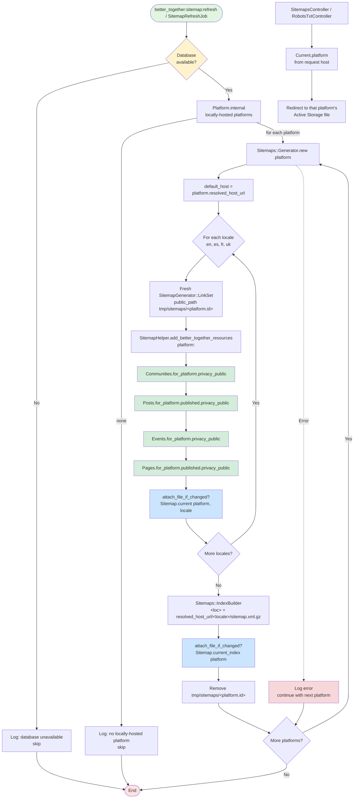

# Sitemap Generation System Documentation

## Table of Contents
- [Overview](#overview)
- [System Architecture](#system-architecture)
- [Multi-Locale Implementation](#multi-locale-implementation)
- [Security & Privacy](#security--privacy)
- [Database Schema](#database-schema)
- [API Endpoints](#api-endpoints)
- [Background Jobs](#background-jobs)
- [Configuration](#configuration)
- [Deployment](#deployment)
- [Monitoring & Troubleshooting](#monitoring--troubleshooting)
- [SEO Best Practices](#seo-best-practices)
- [Performance Considerations](#performance-considerations)

## Overview

The Sitemap Generation System creates and maintains XML sitemaps for Better Together Community Engine platforms, supporting multi-locale content discovery by search engines while respecting privacy settings.

### Key Features
- **Multi-platform**: Generates an independent sitemap set for every locally-hosted platform (`BetterTogether::Platform.internal`), each hosted on that platform's own canonical domain (`Platform#resolved_host_url`). One Community Engine instance can serve many tenant platforms, and each tenant gets its own sitemap and `robots.txt`.
- **Multi-locale support**: Generates separate sitemaps for each language (en, es, fr, uk)
- **Privacy filtering**: Only public content from that platform is indexed; private/community content and other platforms' content are excluded
- **Sitemap index**: Per-platform `<sitemapindex>` that references the controller-served locale sitemap routes
- **Active Storage integration**: Stores compressed sitemaps in S3/MinIO for scalable hosting
- **Database resilience**: Gracefully handles deployment scenarios where database unavailable
- **Background processing**: Asynchronous generation via Sidekiq jobs, triggered on content commit and on a daily schedule
- **Dynamic `robots.txt`**: `/robots.txt` is served per platform with that platform's own `Sitemap:` directives

### Entry Points

| Purpose | Command / class |
|---|---|
| Regenerate every locally-hosted platform | `rake better_together:sitemap:refresh` |
| Regenerate one platform | `BetterTogether::Sitemaps::Generator.new(platform).call` |
| Background refresh (scoped or full sweep) | `BetterTogether::SitemapRefreshJob.perform_later([platform_id])` |
| Daily scheduled sweep | `BetterTogether::SitemapRefreshScanJob` (sidekiq-cron, 02:00 UTC) |

> The `sitemap_generator` gem also defines a `rake sitemap:refresh`. The engine no
> longer uses that name so it does not inherit the gem's search-engine pinging or
> its `SitemapGenerator::Interpreter` run of the host `config/sitemap.rb`.
> `config/sitemap.rb` is kept only as a compatibility shim for host apps that
> still drive the gem's Interpreter directly.

### Stakeholders
- **Platform Organizers**: Need SEO optimization while protecting private content
- **Community Organizers**: Need assurance private communities don't leak to search engines
- **End Users**: Benefit from improved search discoverability in their language
- **DevOps**: Need reliable deployment without database dependency failures

## System Architecture

### Component Overview

```
┌─────────────────────────────────────────────────────────────┐
│                    Sitemap Generation System                 │
├─────────────────────────────────────────────────────────────┤
│                                                               │
│  ┌──────────────┐      ┌──────────────┐      ┌───────────┐ │
│  │  Rake Task   │─────▶│ sitemap_gen  │─────▶│  Active   │ │
│  │  Scheduler   │      │   Library    │      │  Storage  │ │
│  └──────────────┘      └──────────────┘      └───────────┘ │
│         │                      │                     │       │
│         │                      │                     │       │
│         ▼                      ▼                     ▼       │
│  ┌──────────────┐      ┌──────────────┐      ┌───────────┐ │
│  │  Sitemap     │      │  Sitemap     │      │  S3/MinIO │ │
│  │  Helper      │      │  Model       │      │  Bucket   │ │
│  └──────────────┘      └──────────────┘      └───────────┘ │
│         │                      │                     │       │
│         └──────────────────────┴─────────────────────┘       │
│                           │                                   │
│                           ▼                                   │
│                  ┌──────────────────┐                        │
│                  │  Sitemaps        │                        │
│                  │  Controller      │                        │
│                  └──────────────────┘                        │
│                           │                                   │
└───────────────────────────┼───────────────────────────────────┘
                            │
                            ▼
                   ┌─────────────────┐
                   │  Search Engines │
                   │  (Google, Bing) │
                   └─────────────────┘
```

### Data Flow

1. **Trigger**: `SitemapRefreshJob` (on content commit via `SitemapRefreshable`, or the daily `SitemapRefreshScanJob`) or the manual rake task.
2. **Database Check**: Verify database availability (skip if unavailable).
3. **Platform Loop**: For each `BetterTogether::Platform.internal` (locally-hosted, `external: false`), run `BetterTogether::Sitemaps::Generator`:
   1. Resolve `default_host` from `platform.resolved_host_url` (the platform's primary `PlatformDomain`).
   2. **Locale Loop** (en, es, fr, uk): a fresh `SitemapGenerator::LinkSet` builds `tmp/sitemaps/<platform.id>/<locale>/sitemap.xml.gz` from that platform's public content only (`Model.for_platform(platform)` in `SitemapHelper`).
   3. Attach each file to `Sitemap.current(platform, locale)` via `attach_file_if_changed?` (checksum-deduplicated).
   4. Build a per-platform `<sitemapindex>` (`Sitemaps::IndexBuilder`) whose `<loc>` entries are `<resolved_host_url>/<locale>/sitemap.xml.gz`, attach to `Sitemap.current_index(platform)`.
   5. Remove the platform's temp directory.
4. **Serve**: `SitemapsController` resolves the platform from `request.host` (`Current.platform`) and redirects `/sitemap.xml.gz` / `/:locale/sitemap.xml.gz` to that platform's Active Storage file.

A failure generating one platform is logged and the sweep continues with the rest of the fleet.

## Multi-Platform Implementation

A single Community Engine instance serves many platforms, each resolved from the
request host by `PlatformDomain.resolve` (`BetterTogether::PlatformContextMiddleware`
and `ApplicationController#with_current_platform_context`). Sitemaps mirror that model:

- **Which platforms**: `BetterTogether::Platform.internal` (`external: false`). External
  federated peers are never indexed — their content is not hosted here.
- **Host per platform**: `Platform#resolved_host_url` → the platform's primary
  `PlatformDomain` (auto-synced from `host_url` by `after_commit :sync_primary_platform_domain!`),
  falling back to `host_url`. All URLs in a platform's sitemap use that host.
- **Alias domains**: a platform may have additional non-primary `PlatformDomain`
  rows. They all resolve to the same platform; the sitemap and `robots.txt` always
  advertise the primary domain.
- **Storage**: `better_together_sitemaps` is keyed `(platform_id, locale)`, so each
  platform has its own `en/es/fr/uk` + `index` rows.
- **Serving**: `SitemapsController` / `RobotsTxtController` use `Current.platform`,
  so a request to any tenant's own domain is served that tenant's sitemap. Requests
  for a non-public or external platform return `404`.

## Multi-Locale Implementation

### Locale Support

The system generates separate sitemaps for each configured locale:
- **English (en)**: Default locale
- **Spanish (es)**: Spanish translations
- **French (fr)**: French translations
- **Ukrainian (uk)**: Ukrainian translations

### URL Structure

```
# Sitemap Index
https://example.com/sitemap.xml.gz
  ↓ references all locale sitemaps

# Locale-Specific Sitemaps
https://example.com/en/sitemap.xml.gz  (English content)
https://example.com/es/sitemap.xml.gz  (Spanish content)
https://example.com/fr/sitemap.xml.gz  (French content)
https://example.com/uk/sitemap.xml.gz  (Ukrainian content)
```

### Database Records

Each platform maintains 5 sitemap records:
```ruby
# Locale-specific sitemaps
Sitemap.find_by(platform: platform, locale: 'en')
Sitemap.find_by(platform: platform, locale: 'es')
Sitemap.find_by(platform: platform, locale: 'fr')
Sitemap.find_by(platform: platform, locale: 'uk')

# Sitemap index
Sitemap.find_by(platform: platform, locale: 'index')
```

### File Storage Structure

Each locally-hosted platform has its own set of Active Storage blobs, named with
the platform id:

```
Active Storage (S3/MinIO), per platform:
├── sitemap_<platform_id>_en.xml.gz
├── sitemap_<platform_id>_es.xml.gz
├── sitemap_<platform_id>_fr.xml.gz
├── sitemap_<platform_id>_uk.xml.gz
└── sitemap_index_<platform_id>.xml.gz
```

## Security & Privacy

### Privacy Filtering

**CRITICAL**: Only public resources appear in sitemaps. Privacy filtering applied to:

#### Communities
```ruby
BetterTogether::Community.privacy_public.find_each do |community|
  # Only communities with privacy='public' included
end
```

#### Events
```ruby
BetterTogether::Event.privacy_public.find_each do |event|
  # Only events with privacy='public' included
end
```

#### Posts
```ruby
BetterTogether::Post.published.privacy_public.find_each do |post|
  # Only published posts with privacy='public' included
end
```

#### Pages
```ruby
BetterTogether::Page.published.privacy_public.find_each do |page|
  # Only published pages with privacy='public' included
end
```

#### Conversations
**Excluded entirely**: Conversations are private by nature and never included in sitemaps.

### Locale Parameter Validation

The controller validates locale parameters against whitelist:

```ruby
def validate_locale(locale)
  return nil unless locale.present?
  return locale.to_s if I18n.available_locales.map(&:to_s).include?(locale.to_s)
  nil
end
```

Invalid locales return HTTP 404, preventing enumeration attacks.

### Access Control

- Sitemaps served via Active Storage URLs (time-limited signed URLs)
- No authorization required (public sitemaps by design)
- Private content filtered at generation time (defense in depth)

## Database Schema

### Sitemap Model

```ruby
# Table: better_together_sitemaps
create_table "better_together_sitemaps", id: :uuid do |t|
  t.uuid     "platform_id",  null: false
  t.string   "locale",       null: false, default: "en"
  t.integer  "lock_version", default: 0, null: false
  t.datetime "created_at",   null: false
  t.datetime "updated_at",   null: false
  
  t.index ["platform_id", "locale"], 
          name: "index_sitemaps_on_platform_and_locale", 
          unique: true
end
```

### Associations

```ruby
class Sitemap < ApplicationRecord
  belongs_to :platform
  has_one_attached :file
end
```

### Validations

```ruby
validates :locale, presence: true,
                   uniqueness: { scope: :platform_id },
                   inclusion: { in: ->(record) { available_locales(record) } }
```

### Class Methods

```ruby
# Find or create sitemap for platform and locale
Sitemap.current(platform, 'en')

# Find or create sitemap index
Sitemap.current_index(platform)

# Available locale values (includes 'index')
Sitemap.available_locales
# => ['en', 'es', 'fr', 'uk', 'index']
```

## API Endpoints

### Sitemap Index

```
GET /sitemap.xml.gz
```

**Controller**: `BetterTogether::SitemapsController#index`

**Response**: Redirects to Active Storage URL for sitemap index file

**Status Codes**:
- `302 Found`: Sitemap index exists, redirects to file
- `404 Not Found`: No sitemap index generated

**Example**:
```bash
curl -I https://example.com/sitemap.xml.gz
# HTTP/1.1 302 Found
# Location: https://s3.amazonaws.com/bucket/sitemap_index.xml.gz?...
```

### Locale-Specific Sitemap

```
GET /:locale/sitemap.xml.gz
```

**Controller**: `BetterTogether::SitemapsController#show`

**Parameters**:
- `locale` (required): One of: en, es, fr, uk

**Response**: Redirects to Active Storage URL for locale sitemap file

**Status Codes**:
- `302 Found`: Sitemap exists, redirects to file
- `404 Not Found`: Invalid locale or sitemap not generated

**Example**:
```bash
curl -I https://example.com/en/sitemap.xml.gz
# HTTP/1.1 302 Found
# Location: https://s3.amazonaws.com/bucket/sitemap_en.xml.gz?...
```

### robots.txt

```
GET /robots.txt
```

**Controller**: `BetterTogether::RobotsTxtController#show` (named to avoid the existing
`RobotsController`, which is CRUD for the AI-agent `BetterTogether::Robot` model).

Served per resolved platform. For a **private or external** platform it emits
`User-agent: * / Disallow: /` and no `Sitemap:` line.

For a **public, locally-hosted** platform it emits, all under a single
`User-agent: *`:

- **Root disallows** (`RobotsTxtController::ROOT_DISALLOW`, locale-independent):
  `/api/`, `/sidekiq/`, `/s/` (short-link redirects — the controller also sets
  `X-Robots-Tag: noindex`), `/bot-defense/`, `/content-security/` and `/rails/`
  (signed/transient blob proxies).
- **Per-locale disallows** (`LOCALE_DISALLOW`, for every `I18n.available_locale`):
  `/<locale>/users/`, `/<locale>/host/`, `/<locale>/w/`, `/<locale>/wizards/` —
  auth and host-management surfaces. Kept short and unambiguous so a public `Page`
  slug is very unlikely to collide; other private controllers (conversations,
  notifications, …) already emit `noindex` and 302 crawlers to sign-in.
- If a host keeps the default `BetterTogether.route_scope_path` (`'bt'` — the CE
  fleet apps all set it to `''`), `/bt/` and `/<locale>/bt/` are disallowed too.
- **`Sitemap:`** lines for the index and every locale, on
  `current_platform.resolved_host_url`.

> **Host apps must remove their static `public/robots.txt`.** Rails'
> `ActionDispatch::Static` serves a file in `public/` before routing, so a static
> `public/robots.txt` shadows this dynamic route.

### HTML Link Tags

The application layout includes sitemap link tags:

```erb
<!-- Sitemap index for search engines -->
<link rel="sitemap" type="application/xml" href="/sitemap.xml.gz">

<!-- Current locale sitemap -->
<link rel="alternate" type="application/xml" hreflang="en" href="/en/sitemap.xml.gz">

<!-- Alternate locale sitemaps -->
<link rel="alternate" type="application/xml" hreflang="es" href="/es/sitemap.xml.gz">
<link rel="alternate" type="application/xml" hreflang="fr" href="/fr/sitemap.xml.gz">
<link rel="alternate" type="application/xml" hreflang="uk" href="/uk/sitemap.xml.gz">
```

## Background Jobs

### SitemapRefreshJob

Calls `BetterTogether::Sitemaps::Generator` directly (no Rake shell-out).

- `perform` (no arg): sweeps every `Platform.internal`.
- `perform(platform_id)`: regenerates just that platform. This is what content
  models enqueue.
- `SitemapRefreshJob.enqueue_unless_pending(platform_id = nil)`: debounced enqueue.
  A pending full sweep suppresses everything; a pending scoped job only suppresses
  another job for the same platform id.

### SitemapRefreshScanJob

Scheduled daily via sidekiq-cron (`config/sidekiq_scheduler.yml`,
`better_together:sitemap_refresh_daily`, `0 2 * * *`, `maintenance` queue). Enqueues
one scoped `SitemapRefreshJob` per `Platform.internal`.

### SitemapRefreshable (concern)

Included by `Page`, `Post`, `Event`, and `Community`. An `after_commit` hook enqueues
a platform-scoped `SitemapRefreshJob` when the record is created, destroyed, or has a
change to an indexed column (`slug`, `privacy`, `published_at`). It no-ops in the test
environment unless `BetterTogether::SitemapRefreshable.enabled = true`.

## Configuration

### Environment Variables

```bash
# Required: Application protocol and host
APP_PROTOCOL=https
APP_HOST=example.com

# Active Storage configuration (S3/MinIO)
AWS_ACCESS_KEY_ID=your_access_key
AWS_SECRET_ACCESS_KEY=your_secret_key
AWS_REGION=us-east-1
AWS_BUCKET=your-bucket-name

# For MinIO (self-hosted)
AWS_ENDPOINT=https://minio.example.com
```

### Sitemap Configuration

The engine builds sitemaps in code (`BetterTogether::Sitemaps::Generator` +
`BetterTogether::SitemapHelper`), not from a `config/sitemap.rb` file.
`config/sitemap.rb` is retained only as a compatibility shim for host apps that
still invoke the `sitemap_generator` gem's `SitemapGenerator::Interpreter` directly;
it generates for the host platform only.

`SitemapHelper` still exposes the per-resource methods so a host app can compose its
own sitemap. Each takes an explicit `platform:` so host content stays isolated:

```ruby
BetterTogether::SitemapHelper.add_better_together_resources(self, locale, platform: platform)
BetterTogether::SitemapHelper.add_communities(self, locale, platform: platform)
BetterTogether::SitemapHelper.add_posts(self, locale, platform: platform)
BetterTogether::SitemapHelper.add_events(self, locale, platform: platform)
BetterTogether::SitemapHelper.add_pages(self, locale, platform: platform)
```

### I18n Locale Configuration

**File**: `spec/dummy/config/application.rb`

```ruby
config.i18n.available_locales = %i[en es fr uk]
config.i18n.default_locale = :en
```

## Deployment

### Migration Steps

1. **Run migration**:
   ```bash
   bin/dc-run-dummy rails db:migrate
   ```

2. **Verify Active Storage configured**:
   ```bash
   # Check storage.yml has production config
   cat config/storage.yml
   ```

3. **Generate initial sitemaps**:
   ```bash
   bin/dc-run bundle exec rake better_together:sitemap:refresh
   ```

4. **Verify generation** (per locally-hosted platform):
   ```ruby
   BetterTogether::Platform.internal.find_each do |p|
     puts "#{p.name} <#{p.resolved_host_url}>: " \
          "#{BetterTogether::Sitemap.where(platform: p).pluck(:locale).sort.inspect}"
   end
   # Each platform: ["en", "es", "fr", "index", "uk"] (order depends on locales)
   ```

### Docker Build Safety

The system gracefully handles database unavailability during builds:

```ruby
# Rake task checks database availability
begin
  ActiveRecord::Base.connection.execute('SELECT 1')
rescue ActiveRecord::NoDatabaseError, PG::ConnectionBad => e
  puts "⏭️  Skipping sitemap generation (database not available)"
  next
end
```

**Critical**: The `assets:precompile` hook was removed to prevent deployment failures.

### Post-Deployment

1. **Cron**: `better_together:sitemap_refresh_daily` (`BetterTogether::SitemapRefreshScanJob`)
   is already in `config/sidekiq_scheduler.yml`; ensure sidekiq-scheduler is running.

2. **robots.txt**: remove the host app's static `public/robots.txt` so the dynamic
   `/robots.txt` route (per-platform `Sitemap:` directives) takes effect.

3. **Submit to search engines** (per platform domain):
   - Google Search Console / Bing Webmaster Tools: submit
     `https://<platform-domain>/sitemap.xml.gz` for each platform.

## Monitoring & Troubleshooting

### Health Checks

```ruby
# Check sitemaps for every locally-hosted platform
BetterTogether::Platform.internal.find_each do |platform|
  rows = BetterTogether::Sitemap.where(platform: platform)
  attached = rows.select { |r| r.file.attached? }.map(&:locale).sort
  puts "#{platform.name} <#{platform.resolved_host_url}>: attached=#{attached.inspect}"
end
```

### Log Monitoring

Successful generation:
```
✅ Sitemap generated for locale: en
✅ Sitemap generated for locale: es
✅ Sitemap generated for locale: fr
✅ Sitemap generated for locale: uk
✅ Sitemap index generated successfully
```

Database unavailable:
```
⏭️  Skipping sitemap generation (database not available: PG::ConnectionBad)
```

No host platform:
```
⚠️  No host platform found, skipping sitemap generation
```

### Common Issues

#### Issue: Sitemap not accessible

**Symptoms**: 404 when accessing `/en/sitemap.xml.gz`

**Diagnosis**:
```ruby
platform = BetterTogether::Platform.internal.first
sitemap = BetterTogether::Sitemap.find_by(platform: platform, locale: 'en')
sitemap.present?        # Should be true
sitemap.file.attached?  # Should be true
```

**Resolution**:
```bash
# Regenerate sitemaps
bin/dc-run bundle exec rake better_together:sitemap:refresh
```

#### Issue: Private content in sitemap

**Symptoms**: Private communities/events appearing in sitemap

**Diagnosis**:
```ruby
# Download and inspect sitemap
platform = BetterTogether::Platform.internal.first
sitemap = BetterTogether::Sitemap.find_by(platform: platform, locale: 'en')
xml = Zlib::GzipReader.new(StringIO.new(sitemap.file.download)).read
xml.include?('private-community-slug')  # Should be false
```

**Resolution**: Check privacy scopes in `lib/better_together/sitemap_helper.rb`

#### Issue: Sitemap generation fails in production

**Symptoms**: No sitemaps generated after deployment

**Diagnosis**:
```bash
# Check logs
heroku logs --tail | grep sitemap

# Manual rake task
bin/dc-run bundle exec rake better_together:sitemap:refresh --trace
```

**Common causes**:
- Active Storage not configured
- S3/MinIO credentials missing
- Database not migrated

### Manual Regeneration

```bash
# Every locally-hosted platform
bin/dc-run bundle exec rake better_together:sitemap:refresh

# One platform (background job)
bin/dc-run-dummy rails runner "BetterTogether::SitemapRefreshJob.perform_now('<platform_id>')"

# One platform (synchronous, in a console)
> BetterTogether::Sitemaps::Generator.new(platform).call
```

## SEO Best Practices

### Sitemap Index Benefits

- **Scalability**: Supports large sites with multiple sitemaps
- **Organization**: Logical grouping by locale
- **Efficiency**: Search engines crawl index once, discover all locale sitemaps

### Hreflang Implementation

The layout includes alternate locale links:

```html
<link rel="alternate" hreflang="en" href="https://example.com/en/sitemap.xml.gz">
<link rel="alternate" hreflang="es" href="https://example.com/es/sitemap.xml.gz">
<link rel="alternate" hreflang="fr" href="https://example.com/fr/sitemap.xml.gz">
<link rel="alternate" hreflang="uk" href="https://example.com/uk/sitemap.xml.gz">
```

### Update Frequency

**Recommended**: Daily regeneration via cron job

**Triggers for manual regeneration**:
- Publishing new content
- Changing privacy settings
- Adding/removing communities
- Content updates

### XML Sitemap Best Practices

✅ **Implemented**:
- Gzip compression (saves bandwidth)
- `lastmod` timestamps (informs search engines of updates)
- Proper XML namespaces
- URL canonicalization

❌ **Not yet implemented**:
- `changefreq` hints (optional)
- `priority` values (optional)
- Image sitemaps (future enhancement)

## Performance Considerations

### Generation Time

Approximate generation time per locale:
- **< 100 resources**: < 1 second
- **100-1000 resources**: 1-5 seconds
- **1000-10000 resources**: 5-30 seconds
- **> 10000 resources**: Consider pagination (future enhancement)

### Active Storage Upload

- Compressed .gz files reduce bandwidth (typical compression: 70-90%)
- Asynchronous uploads prevent request timeouts
- S3/MinIO handles scaling automatically

### Database Queries

Optimizations:
- `find_each` for batched processing (1000 records per batch)
- `.privacy_public` scope uses indexed queries
- `.published` scope filters efficiently

### Caching Strategy

**Current**: No caching (sitemaps served via redirect to Active Storage)

**Future enhancement**: Consider caching sitemap URLs for 24 hours

### Monitoring Performance

```ruby
# Measure generation time
time = Benchmark.realtime do
  BetterTogether::SitemapRefreshJob.perform_now
end
puts "Generation took #{time.round(2)} seconds"
```

---

## Process Flow Diagram


```mermaid
graph TB
    Start([better_together:sitemap:refresh / SitemapRefreshJob]) --> CheckDB{Database<br/>available?}

    CheckDB -->|No| SkipDB[Log: database unavailable<br/>skip]
    CheckDB -->|Yes| PlatformScope[Platform.internal<br/>locally-hosted platforms]
    SkipDB --> End([End])

    PlatformScope -->|none| SkipPlatform[Log: no locally-hosted platform<br/>skip]
    PlatformScope -->|for each platform| Generator[Sitemaps::Generator.new platform]
    SkipPlatform --> End

    Generator --> ResolveHost[default_host =<br/>platform.resolved_host_url]
    ResolveHost --> LocaleLoop{For each locale<br/>en, es, fr, uk}

    LocaleLoop --> BuildLinkSet[Fresh SitemapGenerator::LinkSet<br/>public_path tmp/sitemaps/&lt;platform.id&gt;]
    BuildLinkSet --> AddResources[SitemapHelper.add_better_together_resources<br/>platform:]

    AddResources --> AddComm[Communities.for_platform.privacy_public]
    AddComm --> AddPost[Posts.for_platform.published.privacy_public]
    AddPost --> AddEvent[Events.for_platform.privacy_public]
    AddEvent --> AddPages[Pages.for_platform.published.privacy_public]

    AddPages --> AttachFile[attach_file_if_changed?<br/>Sitemap.current platform, locale]
    AttachFile --> MoreLocales{More locales?}
    MoreLocales -->|Yes| LocaleLoop
    MoreLocales -->|No| BuildIndex[Sitemaps::IndexBuilder<br/>&lt;loc&gt; = resolved_host_url/&lt;locale&gt;/sitemap.xml.gz]

    BuildIndex --> AttachIndex[attach_file_if_changed?<br/>Sitemap.current_index platform]
    AttachIndex --> Cleanup[Remove tmp/sitemaps/&lt;platform.id&gt;]
    Cleanup --> MorePlatforms{More platforms?}
    MorePlatforms -->|Yes| Generator
    MorePlatforms -->|No| End

    Generator -.->|Error| HandleError[Log error<br/>continue with next platform]
    HandleError --> MorePlatforms

    Serve[SitemapsController / RobotsTxtController] --> ResolvePlatform[Current.platform<br/>from request host]
    ResolvePlatform --> ServeFile[Redirect to that platform's<br/>Active Storage file]

    style Start fill:#e1f5e1
    style End fill:#ffe1e1
    style CheckDB fill:#fff3cd
    style AddComm fill:#d4edda
    style AddPost fill:#d4edda
    style AddEvent fill:#d4edda
    style AddPages fill:#d4edda
    style HandleError fill:#f8d7da
    style AttachFile fill:#cce5ff
    style AttachIndex fill:#cce5ff
```

**Diagram Files:**
- 📊 [Mermaid Source](../diagrams/source/sitemap_generation_flow.mmd) - Editable source
- 🖼️ [PNG Export](../diagrams/exports/png/sitemap_generation_flow.png) - High-resolution image (to be generated)
- 🎯 [SVG Export](../diagrams/exports/svg/sitemap_generation_flow.svg) - Vector graphics (to be generated)

---

## Related Documentation

- [Implementation Plan](../implementation/current_plans/sitemap_generator_fixes_implementation_plan.md)
- [Implementation Summary](../implementation/completed_work/sitemap_multi_locale_implementation_summary.md)
- [Table of Contents](../table_of_contents.md)
- [Sitemap Generator Gem Docs](https://github.com/kjvarga/sitemap_generator)
- [Google Sitemap Guidelines](https://developers.google.com/search/docs/advanced/sitemaps/overview)

---

**Last Updated**: 2026-09-03  
**Status**: Active  
**Maintainer**: Better Together Platform Team
