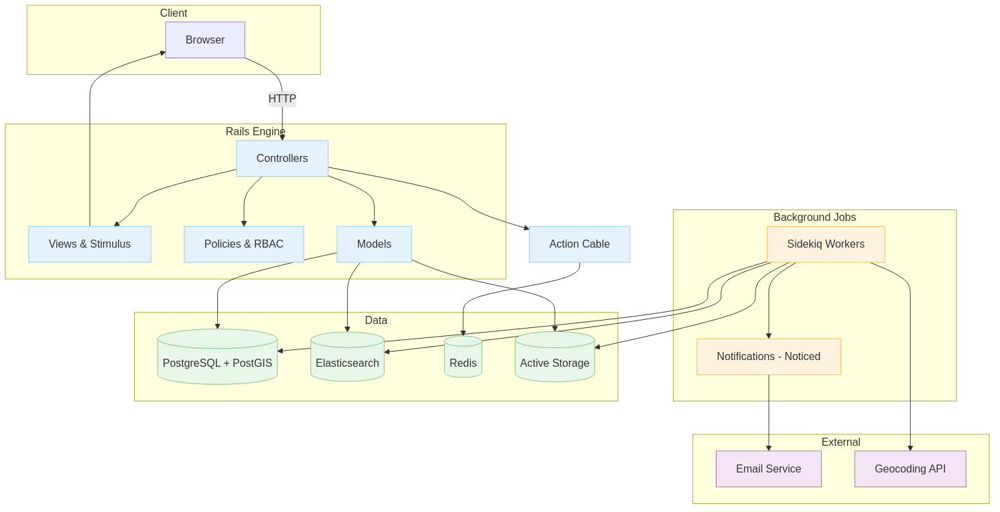

# Module 01 — Big Picture Architecture

> Duration: 40–60 minutes

---

## Objectives

- Understand platform services and data flows
- Recognize privacy/authorization gates
- Know where to find system deep‑dives

---

## Architecture Diagram

Notes:
- Web app, jobs, Action Cable, DB/PostGIS, ES, Redis, Storage, Email

---

## Privacy & Authorization

- RBAC roles/permissions
- Platform privacy modes
- Invitation tokens (event vs platform)

---

## Resources

- Systems: `docs/developers/systems/`
- Roles & Permissions: `docs/shared/roles_and_permissions.md`
- Production: `docs/production/`

